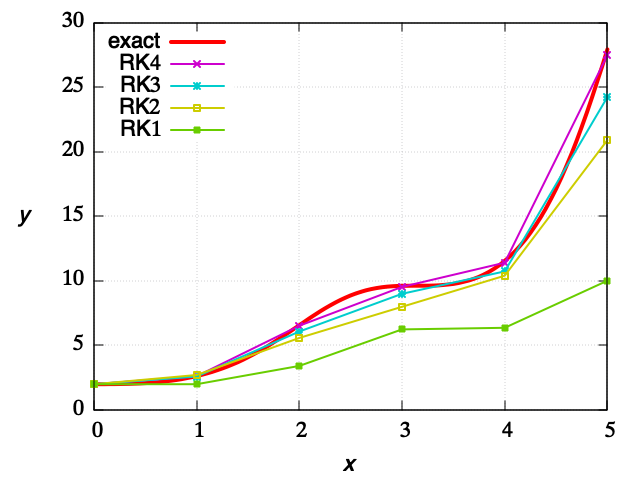

# Contents

- [Runge-Kutta Integration of ODE](#Runge-Kutta-Integration-of-ODE)

- [準ニュートン法](#準ニュートン法)

- [ヘッセ行列を利用したニュートン法](#ヘッセ行列を利用したニュートン法)

- [ISPHとEISPH](#ISPHとEISPH)

    - [壁面粒子の流速と圧力](#壁面粒子の流速と圧力)

    - [`PoissonRHS`,$`b`$と$`\nabla^2 p^{n+1}`$における$`p^{n+1}`$の係数の計算](#`PoissonRHS`,$`b`$と$`\nabla^2-p^{n+1}`$における$`p^{n+1}`$の係数の計算)

    - [圧力勾配$`\nabla p^{n+1}`$の計算 -> $`{D {\bf u}}/{Dt}`$の計算](#圧力勾配$`\nabla-p^{n+1}`$の計算-->-$`{D-{\bf-u}}/{Dt}`$の計算)

- [Bucketを用いた粒子探索のテスト](#Bucketを用いた粒子探索のテスト)

- [核関数](#核関数)

- [Compressed Sparse Row (CSR)](#Compressed-Sparse-Row-(CSR))

- [一般化最小残差法(GMRES)](#一般化最小残差法(GMRES))

- [ArnoldiProcess](#ArnoldiProcess)

## ##
## Runge-Kutta Integration of ODE

This C++ program demonstrates the application of various Runge-Kutta methods (first to fourth order) for solving a first-order ordinary differential equation (ODE).

[./builds/build_ODE/runge_kutta/main.cpp#L1](./builds/build_ODE/runge_kutta/main.cpp#L1)

## ISPHとEISPH

### 前準備
1. バケットの生成
2. 流れの計算に関与する壁粒子を保存
3. CFL条件を満たすようにタイムステップ間隔 $`\Delta t`$を設定

### フラクショナルステップを使って初期値問題を解く
4. $`{{\bf u}^\ast}`$と $`{{\bf x}^\ast}`$を計算
5. 流速の発散 $`{\nabla \cdot {\bf u}^\ast}`$の計算

   - Nomeritae et al. (2016)は， $`{{\bf u}^\ast}`$と $`{{\bf x}^\ast}`$を使っている
   - Morikawa, D. S., & Asai, M. (2021)， $`{{\bf u}^\ast}`$は使い， $`{{\bf x}^\ast}`$は使っていない

6. 流速の発散から密度 $`{\rho}^\ast`$を計算
7. 次の時刻の圧力 $`p^{n+1}`$を計算
   - ISPHは， $`\nabla^2 {p^{n+1}}=(1-\alpha )\frac{\rho_0}{\Delta t}{\nabla \cdot {\bf u}^\ast}+\alpha \frac{\rho_0-\rho^\ast}{{\Delta t}^2}`$を解く
   - EISPHは，陽的に $`p^{n+1}`$を計算する
8. $`\nabla {p^{n+1}}`$が計算でき， $`\frac{D{\bf u}}{D t}=-\frac{1}{\rho_0}\nabla {p^{n+1}} + \frac{1}{\nu}\nabla^2{\bf u} + {\bf g}`$（粘性率が一定の非圧縮性流れの加速度）を得る．
9. $`\frac{D\bf u}{Dt}`$を使って，流速を更新．流速を使って位置を更新

[./builds/build_sph/SPH.hpp#L214](./builds/build_sph/SPH.hpp#L214)

## 核関数

3次スプライン関数と5次スプライン関数の実装とテストコード
* 関数の形状を確認．
* 体積積分が1になるかどうかを確認．

[./builds/build_sph/test_KernelFunctions.cpp#L1](./builds/build_sph/test_KernelFunctions.cpp#L1)

## Compressed Sparse Row (CSR)

CSRは行列を表現する方法の一つである．
このCSRクラスは，std::unordered_mapを用いて，行列の非ゼロ要素を表現する．
std::unordered_mapのkeyはポインタであり，valueはdoubleである．
CSRクラス自身が，行列の行番号を保存しており，keyであるCSRクラスは行列の列番号を保存している．

[./builds/build_system_of_linear_eqs/CSR.cpp#L1](./builds/build_system_of_linear_eqs/CSR.cpp#L1)

## 一般化最小残差法(GMRES)

- ヘッセンベルグ行列$`H`$
- クリロフ部分空間の直交基底$`V`$
- $`H`$をQR分解した行列$`Q`$と$`R`$
- $`g`$は行列$`Q`$の最初の列

ArnoldiProcessによって，$`H`$と$`V`$を求める．このArnoldiProcessクラスの派生クラスとしてGMRESを定義している．

[./builds/build_system_of_linear_eqs/GMRES.cpp#L1](./builds/build_system_of_linear_eqs/GMRES.cpp#L1)

## ArnoldiProcess

ヘッセンベルグ行列$`H[0:k-1]`$は，Aと相似なベクトルであり，同じ固有値を持つ
   GMRESで使う場合，$`V0`$にはNormalize(b-A.x0)を与える．
   x0は初期値

   アーノルディ法は固有値問題の数値解法であり反復解法．
   一般的な行列の固有ベクトルと固有値をクリロフ空間の直行基底によって近似する方法計算する方法．
   https://en.wikipedia.org/wiki/Arnoldi_iteration

[./include/basic_linear_systems.hpp#L678](./include/basic_linear_systems.hpp#L678)

---

## NEWTON
## 準ニュートン法

NEWTON
ニュートン法で使うヤコビアンなどを別のものに置き換えた方法．

[./builds/build_root_finding/example_Broyden.cpp#L1](./builds/build_root_finding/example_Broyden.cpp#L1)

## ヘッセ行列を利用したニュートン法

NEWTON
**最適か否かを判断するための関数**は１つだけで，**最適化したい変数は複数**である場合でも，
最適化は，ヘッセ行列を利用したニュートン法によって可能である．
この方法で，変数は，関数を根とするのではなく，関数を最大最小（停留点）とする値へと収束する．

[./builds/build_root_finding/example_NewtonRaphson.cpp#L1](./builds/build_root_finding/example_NewtonRaphson.cpp#L1)

## Bucketを用いた粒子探索のテスト

NEWTON
Smoothed Particle Hydrodynamics (SPH)では，効率的な近傍粒子探査が必要となる．
このコードでは，Bucketを用いた粒子探索のテストを行う．

結果はVTKファイルに出力される．
   * 全ての粒子を表示したものは`all.vtp`
   * 中心の粒子を表示したものは`center*.vtp`
   * 中心の粒子が探査したセル内にある粒子を表示したものは`inCell*.vtp`
   * セル内かつ球内にある粒子を表示したものは`inSphere*.vtp`

   - 各セルにある粒子を表示したものは`each_cell*.vtp`
   - 各セルの中心位置を表示したものは`each_cell_position*.vtp`

[./builds/build_sph/test_Buckets.cpp#L1](./builds/build_sph/test_Buckets.cpp#L1)

---

## ISPHを使えば，水面粒子の圧力を簡単にゼロにすることができる．
ISPHを使えば，水面粒子の圧力を簡単にゼロにすることができる．
         $`\nabla \cdot {\bf u}^\ast`$は流ればで満たされれば十分であり，壁面表層粒子の圧力を，壁面表層粒子上で$`\nabla \cdot {\bf u}^\ast`$となるように決める必要はない．

[./builds/build_sph/SPH.hpp#L390](./builds/build_sph/SPH.hpp#L390)

---

## ###
### 壁面粒子の流速と圧力

壁面粒子の流速は常にゼロとすることは自然なこと．常にゼロとするならば，壁面粒子の流速をマップする方法に悩む必要はない．
一方，壁面粒子の圧力は，各ステップ毎に計算し直す必要がある．

壁面粒子の圧力は，壁面法線方向流速をゼロにするように設定されるべきだろう．

[./builds/build_sph/SPH_Functions.hpp#L215](./builds/build_sph/SPH_Functions.hpp#L215)

### `PoissonRHS`,$`b`$と$`\nabla^2 p^{n+1}`$における$`p^{n+1}`$の係数の計算

$$
\begin{align*}
&&\frac{D {\bf u}}{D t} &=-\frac{1}{\rho} \nabla P+\nu \nabla^2 {\bf u}+{\bf g}\\
&\rightarrow& \frac{{\bf u}^{n+1} - {\bf u}^{n}}{\Delta t} &=-\frac{1}{\rho} \nabla P+\nu \nabla^2 {\bf u}+{\bf g}\\
&\rightarrow& \nabla \cdot\left(\frac{\rho}{\Delta t} {\bf u}^{n+1}\right) + \nabla^2 p &= \nabla \cdot \left(\frac{\rho}{\Delta t} {\bf u}^n+\mu \nabla^2 {\bf u}+\rho {\bf g}\right)\\
&\rightarrow& \nabla^2 p &= b, \quad b = \nabla \cdot \left(\frac{\rho}{\Delta t} {\bf u}^n+\mu \nabla^2 {\bf u}+\rho {\bf g}\right)
\end{align*}
$$

ここの$`b`$を`PoissonRHS`とする．

発散の計算：

**✅ CHECKED:** $`\nabla\cdot{\bf u}=\sum_{j}\frac{m_j}{\rho_j} \frac{{\bf x}_{ij}\cdot\nabla W_{ij}}{{\bf x}_{ij}^2}`$

`PoissonRHS`,$`b`$の計算の前に，$`\mu \nabla^2{\bf u}`$を予め計算しておく．
今の所，次の順で計算すること．

1. 壁粒子の圧力の計算（流体粒子の現在の圧力$`p^n`$だけを使って近似）
2. 流体粒子の圧力$`p^{n+1}`$の計算
3. 壁粒子の圧力の計算（流体粒子の現在の圧力$`p^{n+1}`$だけを使って近似）

ラプラシアンの計算方法：

**✅ CHECKED:** $`\nabla^2 p^{n+1}=\sum_{j}A_{ij}(p_i^{n+1} - p_j^{n+1}),\quad A_{ij} = \frac{2}{\rho_i}m_j\frac{{{\bf x}_{ij}}\cdot\nabla W_{ij}}{{\bf x}_{ij}^2}`$

[./builds/build_sph/SPH_Functions.hpp#L457](./builds/build_sph/SPH_Functions.hpp#L457)

---

## 計算を安定化させるために，${\mathtt{PoissonRHS}},b
計算を安定化させるために，$`{\mathtt{PoissonRHS}},b \mathrel{+{=}} \alpha (\rho - \rho^\ast) / {\Delta t}^2`$とする場合がある．上の安定化は，簡単に言えば，

$$
\begin{equation}
\rho^\ast = \rho + \frac{D\rho^\ast}{Dt}\Delta t,\quad
\frac{D\rho^\ast}{Dt} = - \rho \nabla\cdot{\bf u}^\ast,\quad
\nabla\cdot{\bf u}^\ast = \frac{\Delta t}{\rho} b
\end{equation}
$$

であることから，$`(\rho - \rho^\ast) / \Delta t = \frac{D\rho^\ast}{Dt} = - b \Delta t`$なので，結局，

$`{\mathtt{PoissonRHS}},b \mathrel{*{=}} (1- \alpha)`$．

と同じである．ただ，$`\rho^\ast`$の計算方法が，`PoissonRHS`の計算方法と同じである場合に限る．
もし，計算方法が異なれば，計算方法の違いによって，安定化の効果も変わってくるだろう．

[./builds/build_sph/SPH_Functions.hpp#L487](./builds/build_sph/SPH_Functions.hpp#L487)

---

## SPH
### 圧力勾配$`\nabla p^{n+1}`$の計算 -> $`{D {\bf u}}/{Dt}`$の計算

SPH

勾配の計算方法：

**✅ CHECKED:** $`\nabla p_i = \rho_i \sum_{j} m_j (\frac{p_i}{\rho_i^2} + \frac{p_j}{\rho_j^2}) \nabla W_{ij}`$

**✅ CHECKED:** $`\nabla p_i = \sum_{j} \frac{m_j}{\rho_j} p_j \nabla W_{ij}`$

[./builds/build_sph/SPH_Functions.hpp#L585](./builds/build_sph/SPH_Functions.hpp#L585)

---
