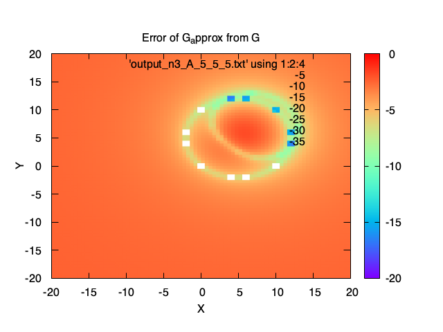
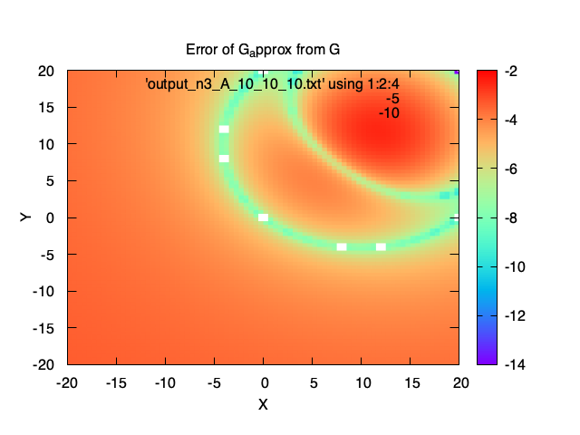
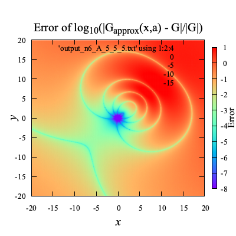
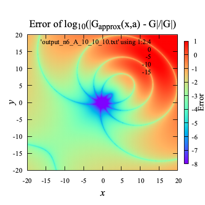
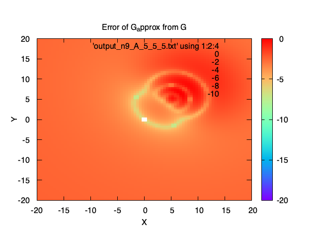
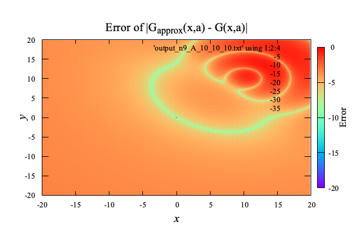

# Contents

- [🐋 ODEの初期値問題](#🐋-ODEの初期値問題)
    - [⛵️ 減衰調和振動子/Damped Harmonic Oscillatorの例](#⛵️-減衰調和振動子/Damped-Harmonic-Oscillatorの例)
    - [⛵️ Runge-Kutta Integration of ODE](#⛵️-Runge-Kutta-Integration-of-ODE)
- [🐋 Boundary Element Method (BEM-MEL)](#🐋-Boundary-Element-Method-(BEM-MEL))
    - [⛵️ 流速の計算方法](#⛵️-流速の計算方法)
        - [⚓️ 修正流速](#⚓️-修正流速)
    - [⛵️ 境界条件の設定の流れ](#⛵️-境界条件の設定の流れ)
        - [⚓️ 多重節点](#⚓️-多重節点)
    - [⛵️ 境界値問題](#⛵️-境界値問題)
        - [⚓️ 基礎方程式](#⚓️-基礎方程式)
        - [⚓️ BIEの離散化](#⚓️-BIEの離散化)
    - [⛵️ 浮体動揺解析](#⛵️-浮体動揺解析)
        - [⚓️ ノイマン境界面における$`\phi _{nt}`$の求め方](#⚓️-ノイマン境界面における$`\phi-_{nt}`$の求め方)
        - [⚓️ 境界値問題の未知変数](#⚓️-境界値問題の未知変数)
        - [⚓️ $`\phi _{nt}`$の計算で必要となる$`{\bf n}\cdot \left({\nabla \phi \cdot \nabla\nabla \phi}\right) `$について．](#⚓️-$`\phi-_{nt}`$の計算で必要となる$`{\bf-n}\cdot-\left({\nabla-\phi-\cdot-\nabla\nabla-\phi}\right)-`$について．)
- [🐋 Input Generator for BEM Simulation](#🐋-Input-Generator-for-BEM-Simulation)
    - [⛵️ Usage](#⛵️-Usage)
    - [⛵️ Customization](#⛵️-Customization)
    - [⛵️ Output](#⛵️-Output)
    - [⛵️ BEM Simulation Code](#⛵️-BEM-Simulation-Code)
        - [⚓️ Prerequisites](#⚓️-Prerequisites)
        - [⚓️ Building the Code](#⚓️-Building-the-Code)
        - [⚓️ Running the Simulation](#⚓️-Running-the-Simulation)
        - [⚓️ Output](#⚓️-Output)
        - [⚓️ 計算の流れ](#⚓️-計算の流れ)
- [🐋 メッシュの細分化](#🐋-メッシュの細分化)
- [🐋 準ニュートン法](#🐋-準ニュートン法)
    - [⛵️ ヘッセ行列を利用したニュートン法](#⛵️-ヘッセ行列を利用したニュートン法)
- [🐋 Smoothed Particle Hydrodynamics (SPH) ISPH EISPH](#🐋-Smoothed-Particle-Hydrodynamics-(SPH)-ISPH-EISPH)
    - [⛵️ 概要](#⛵️-概要)
        - [⚓️ 前準備](#⚓️-前準備)
        - [⚓️ フラクショナルステップを使って初期値問題を解く](#⚓️-フラクショナルステップを使って初期値問題を解く)
        - [⚓️ CFL条件の設定](#⚓️-CFL条件の設定)
        - [⚓️ 法線方向の計算と水面の判定](#⚓️-法線方向の計算と水面の判定)
        - [⚓️ 壁面粒子の流速と圧力](#⚓️-壁面粒子の流速と圧力)
        - [⚓️ $`\nabla^2 {\bf u} _i`$の計算](#⚓️-$`\nabla^2-{\bf-u}-_i`$の計算)
        - [⚓️ 圧力の計算　`PoissonRHS`,$`b`$と$`\nabla^2 p^{n+1}`$における$`p^{n+1}`$の係数の計算](#⚓️-圧力の計算　`PoissonRHS`,$`b`$と$`\nabla^2-p^{n+1}`$における$`p^{n+1}`$の係数の計算)
        - [⚓️ 圧力を決定するための方程式を作成](#⚓️-圧力を決定するための方程式を作成)
        - [⚓️ 圧力の安定化](#⚓️-圧力の安定化)
        - [⚓️ 圧力勾配$`\nabla p^{n+1}`$の計算](#⚓️-圧力勾配$`\nabla-p^{n+1}`$の計算)
    - [⛵️ 注意点](#⛵️-注意点)
    - [⛵️ Bucketを用いた粒子探索のテスト](#⛵️-Bucketを用いた粒子探索のテスト)
    - [⛵️ 核関数](#⛵️-核関数)
    - [⛵️ 多重極展開(Multipole Expansion)](#⛵️-多重極展開(Multipole-Expansion))
    - [⛵️ Compressed Sparse Row (CSR)](#⛵️-Compressed-Sparse-Row-(CSR))
    - [⛵️ 一般化最小残差法(GMRES)](#⛵️-一般化最小残差法(GMRES))
    - [⛵️ ArnoldiProcess](#⛵️-ArnoldiProcess)


---
# 🐋 ODEの初期値問題

## ⛵️ 減衰調和振動子/Damped Harmonic Oscillatorの例

減衰調和振動子の式から，
次のような加速度$`a(x,v)=\frac{d^2x}{dt^2}`$を
[プログラム中で宣言](./builds/build_ODE/example_DampedHrmonicOscillator.cpp#L35)し，

$$
\begin{align*}
m \frac{d^2x}{dt^2} + b \frac{dx}{dt} + k x &= 0\\
\rightarrow a(x,v) &= -\gamma v - \omega^2 x, \quad v=\frac{dx}{dt},\quad \gamma=\frac{b}{m}, \quad \omega^2=\frac{k}{m}
\end{align*}
$$

$`\gamma = 1, \omega = 10`$として，初期値問題をといてみる．
加速度の評価回数$`N`$を合わせて比較した例：

|  |  |   |
|:---:|:---:|:---:|
|$`N=25`$ evaluations|$`N=50`$ evaluations|the sum of differences|


[./builds/build_ODE/example_DampedHrmonicOscillator.cpp#L4](./builds/build_ODE/example_DampedHrmonicOscillator.cpp#L4)


**後退オイラー**

後退オイラーの１回の計算で溜まる誤差は$`O(\Delta t^2)`$．次時刻における速度と加速度が正確に計算できなければ使えない．


[./builds/build_ODE/example_DampedHrmonicOscillator.cpp#L65](./builds/build_ODE/example_DampedHrmonicOscillator.cpp#L65)


**LeapFrog**

リープフロッグの１回の計算で溜まる誤差は$`O({\Delta t}^3)`$となる．
時間間隔$`\Delta t`$が変化する場合でも使える形でプログラムしている（[LeapFrogのクラス](./include/integrationOfODE.hpp#L294)）．
$`\Delta t`$が変化する場合，"半分蹴って-移動-半分蹴って"，"半分蹴って-移動-半分蹴って"の手順を繰り返す．
[LeapFrogのクラス](./include/integrationOfODE.hpp#L294)


[./builds/build_ODE/example_DampedHrmonicOscillator.cpp#L91](./builds/build_ODE/example_DampedHrmonicOscillator.cpp#L91)


**Runge-Kutta**

4次のルンゲクッタの１回の計算で溜まる誤差は$`O({\Delta t}^5)`$となる．
しかし，加速度を4階も計算する必要がある．
このように，ルンゲクッタを使って２階微分方程式を解く場合，
２階微分方程式を２つの1階微分方程式にわけて考え，互いに独立した２つのルンゲクッタを用意し，それぞれ現時刻の微分を使って更新する．
後退オイラーのように次時刻の流速を使って位置を更新するということはできない．

[4次のRunge-Kutta](./include/integrationOfODE.hpp#L154)の場合，次のようになる．

$$
\begin{align*}
k _1 &= \frac{dx}{dt}(t _n, x _n)\\
k _2 &= \frac{dx}{dt}(t _n + \frac{\Delta t}{2}, x _n + \frac{\Delta t}{2} k _1)\\
k _3 &= \frac{dx}{dt}(t _n + \frac{\Delta t}{2}, x _n + \frac{\Delta t}{2} k _2)\\
k _4 &= \frac{dx}{dt}(t _n + \Delta t, x _n + \Delta t k _3)\\
x _{n+1} &= x _n + \frac{\Delta t}{6} (k _1 + 2 k _2 + 2 k _3 + k _4)
\end{align*}
$$

[RungeKuttaのクラス](./include/integrationOfODE.hpp#L11)


[./builds/build_ODE/example_DampedHrmonicOscillator.cpp#L117](./builds/build_ODE/example_DampedHrmonicOscillator.cpp#L117)


## ⛵️ Runge-Kutta Integration of ODE


[./builds/build_ODE/example_RungeKutta.cpp#L1](./builds/build_ODE/example_RungeKutta.cpp#L1)


---
[](banner.png)

# 🐋 Boundary Element Method (BEM-MEL)

| 項目 | 詳細|
|---:|:---|
| 要素 | 線形三角要素 |
| 時間発展方法 | 4次のルンゲクッタ |
| 解析領域 | 時間領域 |
| 境界条件 | 水面の境界条件は非線形であるが，非線形のまま解く |


[./builds/build_bem/BEM.hpp#L1](./builds/build_bem/BEM.hpp#L1)


## ⛵️ 流速の計算方法


[./builds/build_bem/BEM_calculateVelocities.hpp#L7](./builds/build_bem/BEM_calculateVelocities.hpp#L7)


### ⚓️ 修正流速

求めた流速から，次の時刻の境界面$`\Omega(t+\Delta t)`$を見積もり，その面上で節点を移動させ歪さを解消する．
修正ベクトルは，$`\Delta t`$で割り，求めた流速$`\nabla \phi`$に足し合わせて，節点を時間発展させる．

ノイマン節点も修正流速を加え時間発展させる．
ただし，ノイマン節点の修正流速に対しては，節点が水槽の角から離れないように，工夫を施している．

`calculateVecToSurface`で$`\Omega(t+\Delta t)`$上へのベクトルを計算する．
まず，`vectorTangentialShift2`で接線方向にシフトし，`vectorToNextSurface`で近の$`\Omega(t+\Delta t)`$上へのベクトルを計算する．


[./builds/build_bem/BEM_calculateVelocities.hpp#L334](./builds/build_bem/BEM_calculateVelocities.hpp#L334)


## ⛵️ 境界条件の設定の流れ

1. 流体節点が接触する構造物面を保存
- (接触した流体節点) → [構造物面]

2. 面の境界条件：３節点全てが接触している流体面はNeumann面，それ以外はDirichlet面とする
- (3点接触流体面) → [Neumann面]
- (それ以外の面) → [Dirichlet面]

3. 辺の境界条件：辺を含む２面がNeumann面ならNeumann辺，２面がDirichlet面ならDirichlet辺，それ以外はCORNERとする．
- (2面がNeumann面を含む辺) → [Neumann辺]
- (2面がDirichlet面を含む辺) → [Dirichlet辺]
- (それ以外の辺) → [CORNER]

4. 点の境界条件：点を含む面全てがNeumann面ならNeumann点，面全てがDirichlet面ならDirichlet点，それ以外はCORNERとする．
- (全ての面がNeumann面を含む点) → [Neumann点]
- (全ての面がDirichlet面を含む点) → [Dirichlet点]
- (それ以外の点) → [CORNER]

### ⚓️ 多重節点

💡 面の向き$`\bf n`$がカクッと不連続に変わる節点には，$`\phi`$は同じでも，隣接面にそれぞれ対して異なる$`\phi _n`$を計算できるようにする

💡 $`\bf n`$が不連続に変化する節点まわりの要素は，自分のために用意された$`\phi _n`$を選択し補間に用いなければならない

これを多重節点という．


[./builds/build_bem/BEM_setBoundaryConditions.hpp#L7](./builds/build_bem/BEM_setBoundaryConditions.hpp#L7)


## ⛵️ 境界値問題

### ⚓️ 基礎方程式

$$
\begin{align}
\nabla\cdot\nabla \phi& = 0&&\text{in}&&{\bf x} \in \Omega(t),\\
\frac{\partial\phi}{\partial t} +\frac{1}{2}\nabla\phi\cdot\nabla\phi - g z &=0 &&\text{on}&&{\bf x} \in \Gamma^{(\rm D)}(t),\\
\phi _n + {{\bf u} _b}\cdot{{\bf n} _b} &=0&&\text{on}&&{\bf x}\in \Gamma^{(\rm N)}(t),
\end{align}
$$

ここで，
$`{\bf x} ={(x,y,z)}`$は空間座標，$`{\bf u} _b`$は物体の流速，
$`{\bf n} _b`$は物体の外向き単位法線ベクトル，
$`\nabla=(\frac{\partial}{\partial x},\frac{\partial}{\partial y},\frac{\partial}{\partial z})`$
である．
また，$`\phi _n`$は境界面上での外向き法線方向の流速を表し，
境界面上の外向き単位法線ベクトル$`\bf n`$を使えば$`\phi _n ={\nabla\phi}\cdot {\bf n}`$で表される．

ラプラス方程式とグリーンの定理を合わせると，$`\phi`$と$`\phi _n`$に関するBIEが得られる．

$$
\alpha ({\bf{a}})\phi ({\bf{a}}) = \iint _\Gamma {\left( {G({\bf{x}},{\bf{a}})\nabla \phi ({\bf{x}}) - \phi ({\bf{x}})\nabla G({\bf{x}},{\bf{a}})} \right) \cdot {\bf{n}}({\bf{x}})dS}
\quad\text{on}\quad{\bf x} \in \Gamma(t).
$$

ここで，$`{\bf a}`$は境界面上の位置ベクトルであり，この原点$`{\bf a}`$を固定し$`{\bf x}`$について面積分される．
$`G`$は任意のスカラー関数で$`G=1/\|{\bf x}-{\bf a}\|`$とすることで，グリーンの定理の体積積分が消え，BIEの左辺のように，
原点での立体角$`\alpha\left( {\bf{a}} \right)`$とポテンシャル$`\phi( {\bf{a}})`$の積だけが残る．


[./builds/build_bem/BEM_solveBVP.hpp#L7](./builds/build_bem/BEM_solveBVP.hpp#L7)


### ⚓️ BIEの離散化

BIEを線形三角要素とGauss-Legendre積分で離散化すると，

$$
\alpha _{i _\circ}(\phi) _{i _\circ}=-\sum\limits _{k _\vartriangle}\sum\limits _{{\xi _1},{w _1}} {\sum\limits _{{\xi _0},{w _0}} {\left( {{w _0}{w _1}\left( {\sum\limits _{j=0}^2 {{{\left( {{\phi _n}} \right)} _{k _\vartriangle,j }}{N _{j }}\left( \pmb{\xi } \right)} } \right)\frac{1}{{\| {{\bf{x}}\left( \pmb{\xi } \right) - {{\bf x} _{i _\circ}}} \|}}\left\|\frac{{\partial{\bf{x}}}}{{\partial{\xi _0}}} \times \frac{{\partial{\bf{x}}}}{{\partial{\xi _1}}}\right\|} \right)} }
$$

$$
-\sum\limits _{k _\vartriangle}\sum\limits _{{\xi _1},{w _1}} \sum\limits _{{\xi _0},{w _0}} {\left( {{w _0}{w _1}\left({\sum\limits _{j =0}^2{{{\left( \phi  \right)} _{k _\vartriangle,j }}{N _{j}}\left( \pmb{\xi } \right)} } \right)\frac{{{{\bf x} _{i _\circ}} - {\bf{x}}\left( \pmb{\xi } \right)}}{{{{\| {{\bf{x}}\left( \pmb{\xi } \right) - {{\bf x} _{i _\circ}}}\|}^3}}} \cdot\left(\frac{{\partial {\bf{x}}}}{{\partial {\xi _0}}}\times\frac{{\partial {\bf{x}}}}{{\partial {\xi _1}}}\right)}\right)}
$$


[./builds/build_bem/BEM_solveBVP.hpp#L201](./builds/build_bem/BEM_solveBVP.hpp#L201)


このループでは，BIEの連立一次方程式の係数行列`IGIGn`を作成する作業を行なっている．
`IGIGn`は，ある節点$`i _\circ`$（係数行列の行インデックス）に対する
他の節点$`j _\circ`$（係数行列の列インデックス）の影響度合いのようなものである．
その影響度合いは，他の節点$`j _\circ`$の所属する要素までの距離や向きによって決まることが離散化された式からわかる．

| Variable | Description |
|:--------:|:-----------:|
| `origin` | 原点となる節点$`i _\circ`$ |
| `integ_f` | Element $`k _{\triangle}`$ |
| `t0, t1, ww` | Gaussian points and thier wieghts $`\xi _0, \xi _1, w _0 w _1`$ |
| `p0, p1, p2` | Node of the element $`k _{\triangle}`$ |
| `N012` | Shape function $`\pmb{N} _j`$ |
| `IGIGn` | Coefficient matrices of the left and right sides |
| `nr` | $`\| \pmb{x} - \pmb{x} _{i\circ } \|`$ |
| `tmp` | $`w _0 w _1 \frac{1 - \xi _0}{\| \pmb{x} - \pmb{x} _{i\circ } \|}`$ |
| `cross` | $`\frac{\partial \pmb{x}}{\partial \xi _0} \times \frac{\partial \pmb{x}}{\partial \xi _1}`$ |


[./builds/build_bem/BEM_solveBVP.hpp#L257](./builds/build_bem/BEM_solveBVP.hpp#L257)


係数行列`IGIGn`は，左辺の$`I _G \phi _n`$，右辺の$`I _{G _n}\phi`$の係数．

$$
(I _G) _{i _\circ,j _\circ} (\phi _n) _{j _\circ} = (I _{Gn}) _{i _\circ,j _\circ}  \phi _{j _\circ}
$$

境界条件に応じて，未知変数は$`\phi,\phi _n`$のどちらかに決まる．
未知変数が$`\phi`$の場合（Dirichlet境界条件の場合），
係数行列`IGIGn`中で対応する列を符号変えて入れ替えることで移項したことになる．


移項前:
$`\begin{bmatrix}I _{G0} & I _{G1} & I _{G2} & I _{G3}\end{bmatrix} \begin{bmatrix}\phi _{n0} \\ \phi _{n1} \\ \phi _{n2} \\ \phi _{n3}\end{bmatrix} =\begin{bmatrix}I _{Gn0} & I _{Gn1} & I _{Gn2} & I _{Gn3}\end{bmatrix}\begin{bmatrix}\phi _0 \\ \phi _1 \\ \phi _2 \\ \phi _3\end{bmatrix}`$

移項後:
$`\begin{bmatrix}I _{G0} & -I _{Gn1} & I _{G2} & I _{G3}\end{bmatrix}\begin{bmatrix}\phi _{n0} \\ \phi _1 \\ \phi _{n2} \\ \phi _{n3}\end{bmatrix} =\begin{bmatrix}I _{Gn0} & -I _{G1} & I _{Gn2} & I _{Gn3}\end{bmatrix}\begin{bmatrix}\phi _0 \\ \phi _{n1} \\ \phi _2 \\ \phi _3\end{bmatrix}`$

多重節点(1と3が多重節点の場合):
$`\begin{bmatrix}0 & 1 & 0 & 0\end{bmatrix}\begin{bmatrix}\phi _{n0} \\ \phi _1 \\ \phi _{n2} \\ \phi _{n3}\end{bmatrix} =\begin{bmatrix}0 & 0 & 0 & 1\end{bmatrix}\begin{bmatrix}\phi _0 \\ \phi _{n1} \\ \phi _2 \\ \phi _3\end{bmatrix}`$


[./builds/build_bem/BEM_solveBVP.hpp#L343](./builds/build_bem/BEM_solveBVP.hpp#L343)


## ⛵️ 浮体動揺解析

浮体の重心の運動方程式：

$$
m \frac{d {\boldsymbol U} _{\rm c}}{d t} = \boldsymbol{F} _{\text {ext }}+\boldsymbol{F} _{\text {hydro }}, \quad
\boldsymbol{I} \frac{d {\boldsymbol \Omega} _{\rm c}}{d t} = \boldsymbol{T} _{\text {ext }}+\boldsymbol{T} _{\text {hydro }}
$$

$`{\boldsymbol U} _{\rm c}`$は浮体の移動速度．
$`\boldsymbol{F} _{\text {ext }}`$は重力などの外力，$`\boldsymbol{F} _{\text {hydro }}`$は水の力，$`\boldsymbol{T} _{\text {ext }}`$は外力によるトルク，$`\boldsymbol{T} _{\text {hydro }}`$は水の力によるトルク．
浮体が流体から受ける力$`\boldsymbol{F} _{\text {hydro }}`$は，浮体表面の圧力$`p`$を積分することで得られ，
また圧力$`p`$は速度ポテンシャル$`\phi`$を用いて，以下のように書ける．

$$
\boldsymbol{F} _{\text {hydro }}=\int _{S} p\boldsymbol{n}  d S, \quad
p=-\rho\left(\frac{\partial \phi}{\partial t}+\frac{1}{2} (\nabla \phi)^{2}+g z\right)
$$

$`\frac{\partial \phi}{\partial t}`$を$`\phi _t`$と書くことにする．この$`\phi _t`$は陽には求められない．
そこで，$`\phi`$と似た方法，BIEを使った方法で$`\phi _t`$を求める．$`\phi`$と$`\phi _n`$の間に成り立つ境界積分方程式と全く同じ式が，$`\phi _t`$と$`\phi _{nt}`$の間にも成り立つ：

$$
\alpha ({\bf{a}})\phi _t ({\bf{a}}) = \iint _\Gamma {\left( {G({\bf{x}},{\bf{a}})\nabla \phi _t ({\bf{x}}) - \phi _t ({\bf{x}})\nabla G({\bf{x}},{\bf{a}})} \right) \cdot {\bf{n}}({\bf{x}})dS}
\quad\text{on}\quad{\bf x} \in \Gamma(t).
$$

### ⚓️ ノイマン境界面における$`\phi _{nt}`$の求め方

境界面が静止しているかどうかに関わらず，流体と物体との境界では，境界法線方向速度が一致する．
境界面上の位置ベクトルを$`\boldsymbol r`$とする．
表面上のある点の移動速度$`\frac{d\boldsymbol r}{dt}`$と流体粒子の流速$`\nabla \phi`$の間には，次の境界条件が成り立つ．

$$
{\bf n}\cdot\frac{d\boldsymbol r}{dt} =  {\bf n} \cdot \nabla \phi
$$

これを微分することで，$`\phi _{nt}`$を$`\phi`$と加速度$`\frac{d{\boldsymbol U} _{\rm c}}{dt}`$と角加速度$`\frac{d{\boldsymbol \Omega} _{\rm c}}{dt}`$を使って表すことができる．
[Wu (1998)](https://www.sciencedirect.com/science/article/pii/S088997469890158X)

$$
\begin{aligned}
&\rightarrow& 0& =\frac{d}{dt}\left({\bf n}\cdot \left(\frac{d\boldsymbol r}{dt}-\nabla \phi\right)\right) \\
&\rightarrow& 0& =\frac{d{\bf n}}{dt}\cdot \left(\frac{d\boldsymbol r}{dt}-\nabla \phi\right)+ {\bf n}\cdot \frac{d}{dt}\left(\frac{d\boldsymbol r}{dt}-\nabla \phi\right)\\
&\rightarrow& 0& =\frac{d{\bf n}}{dt}\cdot \left(\frac{d\boldsymbol r}{dt}-\nabla \phi\right)+ {\bf n}\cdot \left(\frac{d^2\boldsymbol r}{dt^2}-\frac{d}{dt}\nabla \phi\right)\\
&\rightarrow& 0& =\frac{d{\bf n}}{dt}\cdot \left(\frac{d\boldsymbol r}{dt}-\nabla \phi\right)+ {\bf n}\cdot \left(\frac{d^2\boldsymbol r}{dt^2}- {\nabla \phi _t - \nabla \phi \cdot \nabla\nabla \phi}\right)\\
&\rightarrow& \phi _{nt}& =\frac{d{\bf n}}{dt}\cdot \left(\frac{d\boldsymbol r}{dt}-\nabla \phi\right)+ {\bf n}\cdot \left(\frac{d^2\boldsymbol r}{dt^2} - \nabla \phi \cdot \nabla\nabla \phi\right)
\end{aligned}
$$

ここの$`\frac{d{\bf n}}{dt}`$と$`\frac{d^2\boldsymbol r}{dt^2}`$は，$`{\boldsymbol U} _{\rm c}`$と$`\boldsymbol \Omega _{\rm c}`$を用いて，

$$
\frac{d^2\boldsymbol r}{dt^2} = \frac{d}{dt}\left({\boldsymbol U} _{\rm c} + \boldsymbol \Omega _{\rm c} \times \boldsymbol r\right),\quad \frac{d{\bf n}}{dt} = {\boldsymbol \Omega} _{\rm c}\times{\bf n}
$$

$`\frac{d^2\boldsymbol r}{dt^2}`$を上の式に代入し，$`\phi _{nt}`$を求め，
次にBIEから$`\phi _t`$を求め，次に圧力$`p`$を求める．
そして，浮体の重さと慣性モーメントを考慮して圧力から求めた$`\frac{d^2\boldsymbol r}{dt^2}`$は，
入力した$`\frac{d^2\boldsymbol r}{dt^2}`$と一致しなければならない．

現状を整理すると，この浮体動揺解析において，知りたい未知変数は，浮体の加速度と角加速度だけ．
しかし，浮体の没水面上にある節点での圧力$`p`$が得られないと，$`\boldsymbol{F} _{\text {hydro }}`$が得られず，運動方程式から浮体加速度が計算できない．
圧力を計算するためには，$`\phi _t`$が必要で，$`\phi _t`$は簡単には得られない，という状況．

物体の加速度は， 節点における$`\{\phi _{nt0},\phi _{nt1},\phi _{nt2},..\} = \Phi _{nt}`$が分かれば求まるが，
逆に$`\Phi _{nt}`$は$`\frac{d\boldsymbol U _{\rm c}}{dt}`$が分かれば求まるので

$$
\begin{align*}
&&\frac{d\boldsymbol U _{\rm c}}{dt}& = F\left(\Phi _{nt}\left(\frac{d\boldsymbol U _{\rm c}}{dt}\right)\right)\\
&\rightarrow& Q\left(\frac{d\boldsymbol U _{\rm c}}{dt}\right) &= \frac{d\boldsymbol U _{\rm c}}{dt} - F\left(\Phi _{nt}\left(\frac{d\boldsymbol U _{\rm c}}{dt}\right)\right) =0
\end{align*}
$$

のように，ある関数$`Q`$のゼロを探す，根探し問題になる．
$`\phi _{nt}`$は，[ここ](./builds/build_bem/BEM_solveBVP.hpp#L633)で与えている．


[./builds/build_bem/BEM_solveBVP.hpp#L516](./builds/build_bem/BEM_solveBVP.hpp#L516)


$$
\nabla {\bf u} = \nabla \nabla \phi =
\begin{bmatrix} \phi _{xx} & \phi _{xy} & \phi _{xz} \\
\phi _{yx} & \phi _{yy} & \phi _{yz} \\
\phi _{zx} & \phi _{zy} & \phi _{zz}
\end{bmatrix}
$$

ヘッセ行列の計算には，要素における変数の勾配の接線成分を計算する[`grad_U_LinearElement`](./builds/build_bem/BEM_utilities.hpp#L539)を用いる．
節点における変数を$`v`$とすると，$`\nabla v-{\bf n}({\bf n}\cdot\nabla v)`$が計算できる．
要素の法線方向$`{\bf n}`$が$`x`$軸方向$`{(1,0,0)}`$である場合，$`\nabla v - (\frac{\partial}{\partial x},0,0)v`$なので，
$`(0,\frac{\partial v}{\partial y},\frac{\partial v}{\partial z})`$が得られる．


[./builds/build_bem/BEM_solveBVP.hpp#L598](./builds/build_bem/BEM_solveBVP.hpp#L598)


### ⚓️ 境界値問題の未知変数

`isNeumannID_BEM`と`isDirichletID_BEM`は，節点と面の組みが，境界値問題の未知変数かどうかを判定する．
多重節点でない場合は，{p,nullptr}が変数のキーとなり，多重節点の場合は，{p,f}が変数のキーとなる．


[./builds/build_bem/BEM_utilities.hpp#L414](./builds/build_bem/BEM_utilities.hpp#L414)


### ⚓️ $`\phi _{nt}`$の計算で必要となる$`{\bf n}\cdot \left({\nabla \phi \cdot \nabla\nabla \phi}\right) `$について．

$`\nabla`$を，$`(x,y,z)`$の座標系ではなく，
面の法線方向$`{\bf n}`$を$`x`$の代わりにとり，
面に水平な方向を$`t _0,t _1`$とする座標系で考えることにして，$`\nabla^\ast`$と書くことにする．
$`{\bf n}\cdot \left({\nabla \phi \cdot \nabla\nabla \phi}\right)`$では，$`{\bf n}`$方向成分だけをとる操作をしているので，
新しい座標系でも同じようにすれば，結果は変わらない．

$$
{\bf n}\cdot \left({\nabla \phi \cdot \nabla\nabla \phi}\right) =  {(1,0,0)}\cdot\left({\nabla^* \phi \cdot \nabla^* \nabla^* \phi}\right).
\quad
\nabla^* \phi = \left(\phi _n, \phi _{t _0}, \phi _{t _1}\right),
\quad \nabla^* \nabla^* \phi =
\begin{bmatrix}
\phi _{nn} & \phi _{nt _0} & \phi _{nt _1} \\
\phi _{t _0n} & \phi _{t _0t _0} & \phi _{t _0t _1} \\
\phi _{t _1n} & \phi _{t _1t _0} & \phi _{t _1t _1}
\end{bmatrix}
$$

最後に第１成分だけが残るので，

$$
{(1,0,0)}\cdot\left({\nabla^* \phi \cdot \nabla^* \nabla^* \phi}\right) = \nabla^* \phi \cdot (\phi _{nn}, \phi _{t _0n}, \phi _{t _1n})
$$

$`\phi _{nn}`$は，直接計算できないが，ラプラス方程式から$`\phi _{nn}=- \phi _{t _0t _0}- \phi _{t _1t _1}`$となるので，水平方向の勾配の計算から求められる．


[./builds/build_bem/BEM_utilities.hpp#L470](./builds/build_bem/BEM_utilities.hpp#L470)


## ⛵️ BEM Simulation Code

This is a C++ implementation of a BEM simulation code. Follow the instructions below to build and run the simulation.

### ⚓️ Prerequisites

- CMake
- LAPACK library
- Python 3 for input generation

### ⚓️ Building the Code

1. Clean the build directory:

```
sh clean
```

2. Configure the build using CMake:

```
cmake -DCMAKE_BUILD_TYPE=Release ../
```

3. Compile the code:

```
make
```

### ⚓️ Running the Simulation

1. Generate input files using the `input_generator.py` script:

```
python3 ./input_generator.py
```

2. Run the simulation with the generated input files:

```
./main ./input_files/Kramer2021_H00d03
```

### ⚓️ Output

The simulation results will be stored in the specified output directory.


[./builds/build_bem/main.cpp#L1](./builds/build_bem/main.cpp#L1)


### ⚓️ 計算の流れ

1. 境界条件の設定
2. 境界値問題（BIE）を解き，$`\phi`$と$`\phi _n`$を求める
3. 三角形の線形補間を使って節点の流速を計算する
4. 次時刻の$`\Omega(t+\Delta t)`$がわかるので，修正流速を計算する
5. 浮体の加速度を計算する．境界値問題（BIE）を解き，$`\phi _t`$と$`\phi _{nt}`$を求め，浮体面上の圧力$`p`$を計算する必要がある
6. 全境界面の節点の位置を更新．ディリクレ境界では$`\phi`$を次時刻の値へ更新


[./builds/build_bem/main.cpp#L246](./builds/build_bem/main.cpp#L246)


## ⛵️ 多重極展開(Multipole Expansion)

Green関数を次のようにする．

$$
G({\bf x},{\bf a}) = \frac{1}{\|{\bf x}-{\bf a}\|}
$$

$`G _{approx}({\bf x- \bf c},{\bf a - \bf c}) = \frac{1}{\|{\bf x}-{\bf a}\|}`$
$`{\bf c}=(x,y,0)`$を変化させてプロットした結果：

| | $`{\bf x} = (0,0,0),{\bf a} = (5,5,5)`$ | $`{\bf x} = (0,0,0),{\bf a} = (10,10,10)`$ |
|:----:|:---:|:---:|
| **n=3** |   |  |
| **n=6** |   |  |
| **n=9** |   |  |


[./builds/build_spherical_harmonic/main.cpp#L29](./builds/build_spherical_harmonic/main.cpp#L29)


---
# 🐋 メッシュの細分化

`n`回の細分化を行う．

```
./remesh input_file output_dir output_name n
```


出力は，`output_dir/output_name*.vtu`と`output_dir/output_name*.obj`．


[./builds/build_divide_merge/remesh.cpp#L3](./builds/build_divide_merge/remesh.cpp#L3)


---
# 🐋 準ニュートン法
ニュートン法で使うヤコビアンなどを別のものに置き換えた方法．


[./builds/build_root_finding/example_Broyden.cpp#L1](./builds/build_root_finding/example_Broyden.cpp#L1)


## ⛵️ ヘッセ行列を利用したニュートン法
**最適か否かを判断するための関数**は１つだけで，**最適化したい変数は複数**である場合でも，
最適化は，ヘッセ行列を利用したニュートン法によって可能である．
この方法で，変数は，関数を根とするのではなく，関数を最大最小（停留点）とする値へと収束する．


[./builds/build_root_finding/example_NewtonRaphson.cpp#L1](./builds/build_root_finding/example_NewtonRaphson.cpp#L1)


---
[](banner.png)

# 🐋 Smoothed Particle Hydrodynamics (SPH) ISPH EISPH

## ⛵️ 概要
### ⚓️ 前準備
1. バケットの生成
2. 流れの計算に関与する壁粒子を保存
3. CFL条件を満たすようにタイムステップ間隔 $`\Delta t`$を設定

### ⚓️ フラクショナルステップを使って初期値問題を解く

4. 水面の判定
5. $`\nabla^2 {\bf u}`$の計算
6. `PoissonRHS`,$`b`$と$`\nabla^2 p^{n+1}`$における$`p^{n+1}`$の係数の計算
7. 流速の発散から密度 $`{\rho}^\ast`$を計算
8. 次の時刻の圧力 $`p^{n+1}`$を計算
1. 壁粒子の圧力の計算（流体粒子の現在の圧力$`p^n`$だけを使って近似）
2. 流体粒子の圧力$`p^{n+1}`$の計算
9. $`\nabla {p^{n+1}}`$が計算でき， $`\frac{D{\bf u}}{D t}=-\frac{1}{\rho}\nabla {p^{n+1}} + \frac{1}{\nu}\nabla^2{\bf u} + {\bf g}`$（粘性率が一定の非圧縮性流れの加速度）を得る．
10. $`\frac{D\bf u}{Dt}`$を使って，流速を更新．流速を使って位置を更新


[./builds/build_sph/SPH.hpp#L209](./builds/build_sph/SPH.hpp#L209)


### ⚓️ CFL条件の設定

$`\max({\bf u}) \Delta t \leq c _{v} h \cap \max({\bf a}) \Delta t^2 \leq c _{a} h`$を満たすように，毎時刻$`\Delta t`$を設定する．


[./builds/build_sph/SPH_Functions.hpp#L22](./builds/build_sph/SPH_Functions.hpp#L22)


### ⚓️ 法線方向の計算と水面の判定

✅ 単位法線ベクトル: $`{\bf n} _i = -{\rm Normalize}\left(\sum _j {\frac{m _j}{\rho _j} \nabla W _{ij} }\right)`$


[./builds/build_sph/SPH_Functions.hpp#L89](./builds/build_sph/SPH_Functions.hpp#L89)


`surface_condition0,1`の両方を満たす場合，水面とする．


[./builds/build_sph/SPH_Functions.hpp#L137](./builds/build_sph/SPH_Functions.hpp#L137)


### ⚓️ 壁面粒子の流速と圧力

壁粒子の流速を流体粒子の流速に応じて変化させると計算が煩雑になるので，**ここでは**壁面粒子の流速は常にゼロに設定することにした（ゼロで一定というのは不自然ではない）．
一方，壁粒子の圧力がゼロだとするのは不自然で，流体粒子の圧力$`p^{n+1}`$の計算に悪影響を及ぼす．
なので．壁粒子の圧力は各ステップ毎に計算し直す必要がある．

📝 壁面粒子の圧力は，壁面法線方向流速をゼロにするように設定されるべきだろう．


[./builds/build_sph/SPH_Functions.hpp#L227](./builds/build_sph/SPH_Functions.hpp#L227)


### ⚓️ $`\nabla^2 {\bf u} _i`$の計算

✅ [ラプラシアンの計算方法](./builds/build_sph/SPH_Functions.hpp#L289): $`\nabla^2 {\bf u} _i=\sum _{j} A _{ij}({\bf u} _i - {\bf u} _j),\quad A _{ij} = \frac{2m _j}{\rho _i}\frac{{{\bf x} _{ij}}\cdot\nabla W _{ij}}{{\bf x} _{ij}^2}`$

<details>
<summary>見出し部分。ここをクリック。</summary>
<div>
ここが隠れてる部分。
</div>
</details>


[./builds/build_sph/SPH_Functions.hpp#L241](./builds/build_sph/SPH_Functions.hpp#L241)


### ⚓️ 圧力の計算　`PoissonRHS`,$`b`$と$`\nabla^2 p^{n+1}`$における$`p^{n+1}`$の係数の計算

次の時刻の流れ場が発散なし$`\nabla\cdot{\bf u}^{n+1}=0`$であることを保証してくれる圧力を使って，
$`\frac{D {\bf u}}{D t} =-\frac{1}{\rho} \nabla p^{n+1}+\nu \nabla^2 {\bf u}^n+{\bf g}`$を決定し，時間発展させたい．
そのような圧力を$`p^{n+1}`$と書くことにする．
そのような圧力の条件は，次のようになる．

$$
\begin{align*}
&&\frac{D {\bf u}}{D t} &=-\frac{1}{\rho} \nabla p^{n+1}+\nu \nabla^2 {\bf u}^n+{\bf g}\\
&\rightarrow& \frac{{\bf u}^{n+1} - {\bf u}^{n}}{\Delta t} &=-\frac{1}{\rho} \nabla p^{n+1}+\nu \nabla^2 {\bf u}^n+{\bf g}
\end{align*}
$$

非圧縮流体なので，$`\nabla \cdot{\bf u}^{n}`$はゼロであるべきだが，計算誤差が蓄積しゼロからずれてしまう．
そこで次の時刻の$`\nabla \cdot{\bf u}^{n+1}`$をゼロにするように圧力を決定する．

次時刻の発散の演算は，次時刻における粒子配置に基づき行われる．
なので，現在の粒子配置に基づく演算とは区別すべきである．
現在の微分演算を$`\nabla^{n}`$とし，次時刻の微分演算を$`\nabla^{n+1}`$としよう．

$$
\nabla^{n+1}\cdot {\bf u}^{n+1} = \nabla^{n+1} \cdot{\bf u}^{n} - \Delta t \nabla^{n+1} \cdot\left(\frac{1}{\rho} \nabla^{n} p^{n+1}-\nu \nabla^{n2} {\bf u}^n-{\bf g}\right)
$$

次時刻の流速の発散がゼロになるには

$$
\begin{align*}
&&\nabla^{n+1} \cdot \left(\frac{1}{\rho^n} \nabla^{n} p^{n+1}\right) &= \frac{1}{\Delta t}\nabla^{n+1} \cdot{\bf u}^{n} + \nabla^{n+1} \cdot\left(\nu^n \nabla^{n2} {\bf u}^n  + {\bf g}\right)\\
&\rightarrow& \nabla^{n+1} \cdot \left(\frac{1}{\rho^n} \nabla^{n} p^{n+1}\right) &= \nabla^{n+1} \cdot\left(\frac{1}{\Delta t}{\bf u}^{n} +\nu^n \nabla^{n2} {\bf u}^n  + {\bf g}\right)\\
&\rightarrow& \nabla^{n+1} \cdot \left(\frac{1}{\rho^n} \nabla^{n} p^{n+1}\right) &= b = \nabla^{n+1} \cdot {\bf b}^n,\quad  {\bf b}^n=\frac{1}{\Delta t}{\bf u}^{n} +\nu^n \nabla^{n2} {\bf u}^n
\end{align*}
$$

重力の発散はゼロなので消した．

**右辺について**

この$`b`$を`PoissonRHS`とする．（仮流速は$`{\bf u}^\ast = \frac{\Delta t}{\rho}{\bf b}^n`$と同じ）．`PoissonRHS`,$`b`$の計算の前に，$`\mu \nabla^2{\bf u}`$を予め計算しておく．

✅ [発散の計算方法](not found): $`b=\nabla\cdot{\bf b}^n=\sum _{j}\frac{m _j}{\rho _j}({\bf b} _j^n-{\bf b} _i^n)\cdot\nabla W _{ij}`$

**左辺について**

壁粒子の圧力は時間積分して計算しないので，毎時刻，壁粒子の$`p^n`$を計算する必要がある．

EISPH

1. 壁粒子の圧力の計算（流体粒子の現在の圧力$`p^n`$だけを使って近似）
2. 流体粒子の圧力$`p^{n+1}`$の計算

ISPH
- ISPHは作ったポアソン方程式を作成し解くことで圧力を計算する

✅ [ラプラシアンの計算方法](./builds/build_sph/SPH_Functions.hpp#L528): $`\nabla^2 p^{n+1}=\sum _{j}A _{ij}(p _i^{n+1} - p _j^{n+1}),\quad A _{ij} = \frac{2m _j}{\rho _i}\frac{{{\bf x} _{ij}}\cdot\nabla W _{ij}}{{\bf x} _{ij}^2}`$


[./builds/build_sph/SPH_Functions.hpp#L336](./builds/build_sph/SPH_Functions.hpp#L336)


### ⚓️ 圧力を決定するための方程式を作成

💡 '次の時刻における流速の発散はゼロになるように'というルールに従えば，次時刻の発散の演算は次時刻の粒子位置において行われるため，今作成するポアソン方程式の発散の演算は，次時刻の粒子位置において行われるべきだ．

各粒子$`A`$に対して，圧力を決定するための方程式を作成する．各粒子$`A`$が，流体か壁か補助粒子か水面かによって，方程式が異なる．

|方程式|目的|
|:---------|---|
| ☑️ [ポアソン方程式](./builds/build_sph/SPH_Functions.hpp#L515)              | 次時刻の流速の発散をゼロにする（非圧縮性を満たす）ように圧力を決定する． |
| ☐ [不透過条件](./builds/build_sph/SPH_Functions.hpp#L495)         | この式は圧力勾配がそれ以外の力を打ち消すように圧力を決定する．壁面付近の圧力が滑らかにならないため使わない． |
| ☐ [大気圧条件](./builds/build_sph/SPH_Functions.hpp#L503) | この式は水面粒子の圧力をゼロに固定する．圧力がゼロであるべき場所は水面から$`h/2`$上なので使わない． |

各方程式は，`equation(列番号を指定する粒子ポインタ, 計算に使われる物性値を持つ粒子ポインタ, 方程式を立てる位置)`の形で使用する．


[./builds/build_sph/SPH_Functions.hpp#L477](./builds/build_sph/SPH_Functions.hpp#L477)


### ⚓️ 圧力の安定化

$`b = \nabla \cdot {{\bf b}^n} + \alpha \frac{\rho _w - \rho^\ast}{{\Delta t}^2}`$として計算を安定化させる場合がある．
$`\rho^\ast = \rho + \frac{D\rho^\ast}{Dt}\Delta t`$と近似すると，

$$
\rho^\ast = \rho + \frac{D\rho^\ast}{Dt}\Delta t,\quad
\frac{D\rho^\ast}{Dt} = - \rho \nabla\cdot{\bf u}^\ast,\quad
\nabla\cdot{\bf u}^\ast = \frac{\Delta t}{\rho} \nabla\cdot{\bf b}^n
$$

であることから，$`(\rho _w - \rho^\ast) / {\Delta t^2}`$は，$`\nabla\cdot{\bf b}^n`$となって同じになる．

しかし，実際には，$`\rho^\ast`$は，$`\nabla \cdot {{\bf b}^n} `$を使わずに，つまり発散演算を行わずに評価するので，
計算上のようにはまとめることができない．

$`\rho^\ast`$を計算する際に，$`\rho^\ast = \rho _w + \frac{D\rho^\ast}{Dt}\Delta t`$を使った場合，確かに上のようになるが，
実際に粒子を仮位置に移動させその配置から$`\rho^\ast`$を計算した場合は，数値計算上のようにまとめることはできない．

`PoissonRHS`,$`b`$の計算方法と同じである場合に限る．
もし，計算方法が異なれば，計算方法の違いによって，安定化の効果も変わってくるだろう．


[./builds/build_sph/SPH_Functions.hpp#L575](./builds/build_sph/SPH_Functions.hpp#L575)


### ⚓️ 圧力勾配$`\nabla p^{n+1}`$の計算

✅ [勾配の計算方法](./builds/build_sph/SPH_Functions.hpp#L735): $`\nabla p _i = \rho _i \sum _{j} m _j (\frac{p _i}{\rho _i^2} + \frac{p _j}{\rho _j^2}) \nabla W _{ij}`$

✅ [勾配の計算方法](./builds/build_sph/SPH_Functions.hpp#L737): $`\nabla p _i = \rho _i \sum _{j} m _j \left(p _j - p _i\right) \nabla W _{ij}`$

✅ [勾配の計算方法](./builds/build_sph/SPH_Functions.hpp#L738): $`\nabla p _i = \sum _{j} \frac{m _j}{\rho _j} p _j \nabla W _{ij}`$


[./builds/build_sph/SPH_Functions.hpp#L696](./builds/build_sph/SPH_Functions.hpp#L696)


$`\frac{D{\bf u}^n}{Dt} = - \frac{1}{\rho} \nabla p^{n+1} + \nu \nabla^2 {\bf u}^n + {\bf g}`$が計算できた．


[./builds/build_sph/SPH_Functions.hpp#L754](./builds/build_sph/SPH_Functions.hpp#L754)


## ⛵️ 注意点

⚠️ 計算がうまく行く設定を知るために，次の箇所をチェックする．

- [流体として扱う壁粒子を設定するかどうか](./builds/build_sph/SPH.hpp#L314)
- [壁粒子の圧力をどのように壁面にマッピングするか](not found)
- [水面粒子の圧力をゼロにするかどうか](not found)
- [密度を更新するかどうか](./builds/build_sph/SPH_Functions.hpp#L859)
- [圧力の安定化をするかどうか](./builds/build_sph/SPH_Functions.hpp#L600)
- [ルンゲクッタの段数](./builds/build_sph/input_generator.py#L143)
- [反射の計算方法](./builds/build_sph/SPH_Functions.hpp#L799)

壁のwall_as_fluidは繰り返しで計算するのはどうか？


[./builds/build_sph/SPH_Functions.hpp#L896](./builds/build_sph/SPH_Functions.hpp#L896)


## ⛵️ 核関数
3次スプライン関数と5次スプライン関数の実装とテストコード
* 関数の形状を確認．
* 体積積分が1になるかどうかを確認．


[./builds/build_sph/test_KernelFunctions.cpp#L1](./builds/build_sph/test_KernelFunctions.cpp#L1)


---
## ⛵️ Bucketを用いた粒子探索のテスト
Smoothed Particle Hydrodynamics (SPH)では，効率的な近傍粒子探査が必要となる．
このコードでは，Bucketを用いた粒子探索のテストを行う．

結果はVTKファイルに出力される．
* 全ての粒子を表示したものは`all.vtp`
* 中心の粒子を表示したものは`center*.vtp`
* 中心の粒子が探査したセル内にある粒子を表示したものは`inCell*.vtp`
* セル内かつ球内にある粒子を表示したものは`inSphere*.vtp`

- 各セルにある粒子を表示したものは`each_cell*.vtp`
- 各セルの中心位置を表示したものは`each_cell_position*.vtp`


[./builds/build_sph/test_Buckets.cpp#L1](./builds/build_sph/test_Buckets.cpp#L1)


---
## ⛵️ Compressed Sparse Row (CSR)

CSRは行列を表現する方法の一つである．
このCSRクラスは，std::unordered_mapを用いて，行列の非ゼロ要素を表現する．
std::unordered_mapのkeyはポインタであり，valueはdoubleである．
CSRクラス自身が，行列の行番号を保存しており，keyであるCSRクラスは行列の列番号を保存している．

[ArnoldiProcessの行列-ベクトル積](./include/basic_linear_systems.hpp#L790)は特に計算コストが高い．
[CSRのDot積を並列化](./include/basic_linear_systems.hpp#L674)すれば，かなり高速化できる．


[./builds/build_system_of_linear_eqs/CSR.cpp#L1](./builds/build_system_of_linear_eqs/CSR.cpp#L1)


---
## ⛵️ 一般化最小残差法(GMRES)

- ヘッセンベルグ行列$`H`$
- クリロフ部分空間の直交基底$`V`$
- $`H`$をQR分解した行列$`Q`$と$`R`$
- $`g`$は行列$`Q`$の最初の列

ArnoldiProcessによって，$`H`$と$`V`$を求める．このArnoldiProcessクラスの派生クラスとしてGMRESを定義している．


[./builds/build_system_of_linear_eqs/GMRES.cpp#L1](./builds/build_system_of_linear_eqs/GMRES.cpp#L1)


---
## ⛵️ ArnoldiProcess
ヘッセンベルグ行列$`H[0:k-1]`$は，Aと相似なベクトルであり，同じ固有値を持つ
GMRESで使う場合，$`V0`$にはNormalize(b-A.x0)を与える．
x0は初期値

アーノルディ法は固有値問題の数値解法であり反復解法．
一般的な行列の固有ベクトルと固有値をクリロフ空間の直行基底によって近似する方法計算する方法．
https://en.wikipedia.org/wiki/Arnoldi_iteration


[./include/basic_linear_systems.hpp#L764](./include/basic_linear_systems.hpp#L764)


---
# 🐋 Input Generator for BEM Simulation

This Python script generates input files for the BEM simulation code. It supports various simulation cases and handles input file generation for each case.

## ⛵️ Usage

1. Make sure the required dependencies are installed.
2. Run the script using the following command:

```
python3 input_generator.py
```

Upon running the script, it will generate input files in JSON format for the specified simulation case. The input files are saved in the `./input_files/` directory.

## ⛵️ Customization

To customize the input file generation for a specific case, follow these steps:

1. Locate the `SimulationCase` variable in the script and set it to the desired case name, e.g., `"Kramer2021"`.
2. Add a new `case` block in the `match SimulationCase:` section to handle the new simulation case.
3. Define the required parameters for the simulation case within the new `case` block, following the examples provided in the script.
4. Update the `inputfiles` variable with the new input objects created for the custom case.

After customizing the script, run it again to generate the input files for the new case.

## ⛵️ Output

The script will generate input files in JSON format for the specified simulation case. The input files will be saved in the `./input_files/` directory. The generated input files can be used to run the BEM simulation.


---
[./builds/build_bem/input_generator.py#L1](./builds/build_bem/input_generator.py#L1)


---
プログラムを回す際に面倒な事は，入力ファイルの設定．
入力ファイルの作り方をドキュメントで示されても，具体的な例がないとわかりにくい．
例があっても，例と違う場合どうすればいいかなど，わからないことは多い．
このように，入力ファイルを生成するプログラムを作っておけば，その面倒をだいぶ解消できる．


---
[./builds/build_bem/input_generator.py#L50](./builds/build_bem/input_generator.py#L50)


---
プログラムを回す際に面倒な事は，入力ファイルの設定方法．
入力ファイルの作り方をドキュメントで示されても，具体的な例がないとわかりにくい．
例があっても，例と違う場合どうすればいいかなど，わからないことは多い．
このように，入力ファイルを生成するプログラムを作っておけば，その面倒をだいぶ解消できる．


---
[./builds/build_sph/input_generator.py#L18](./builds/build_sph/input_generator.py#L18)


---
