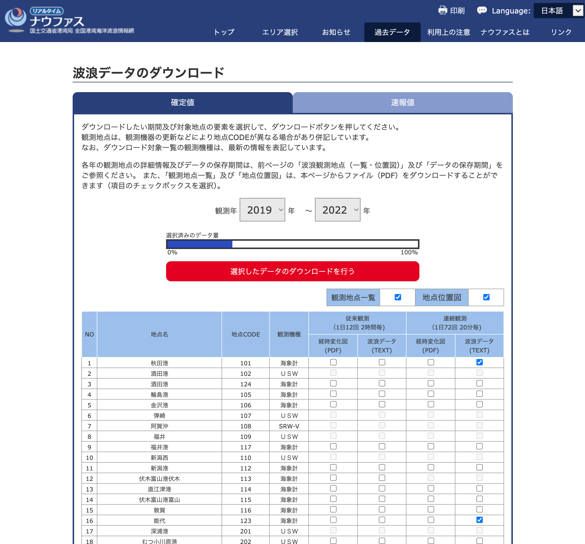
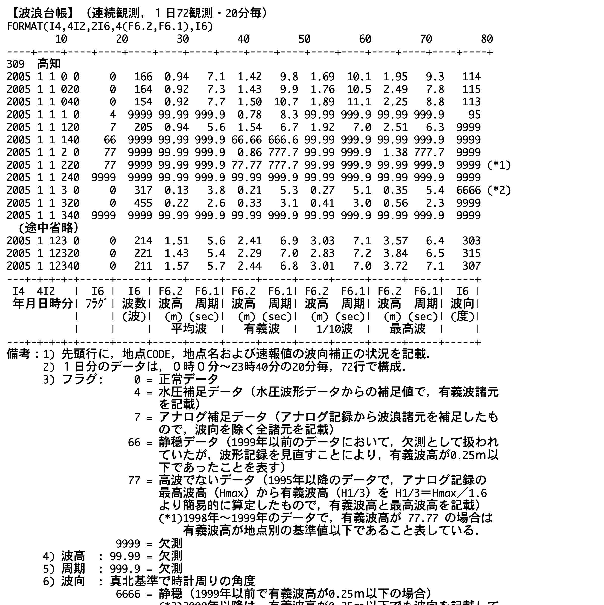

NOWPHASのデータをダウンロードする．

https://nowphas.mlit.go.jp/pastdata_select/2020//2022//

`nowphas_202504141658`にデータを保存．

連続観測（72観測/日）のデータ形式

https://nowphas.mlit.go.jp/pastdatars/data/sample/data_form01.txt

