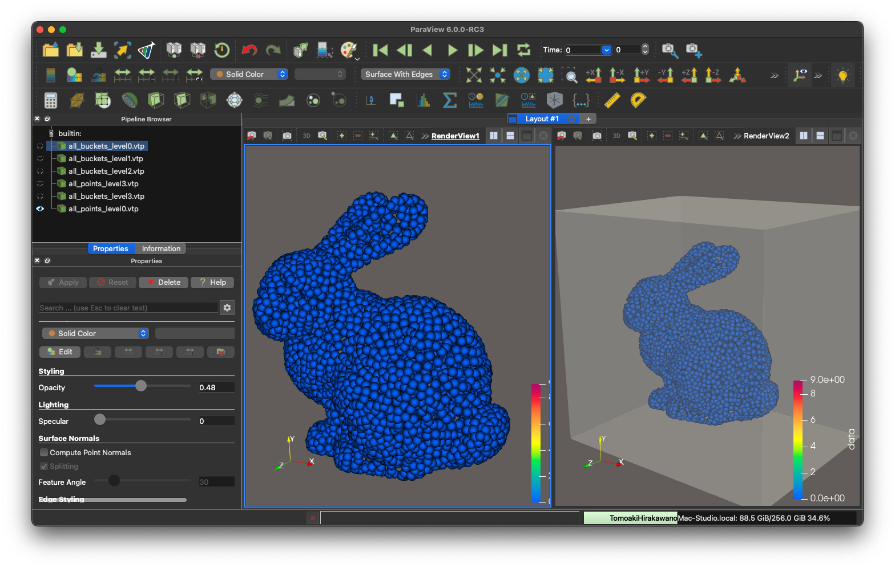
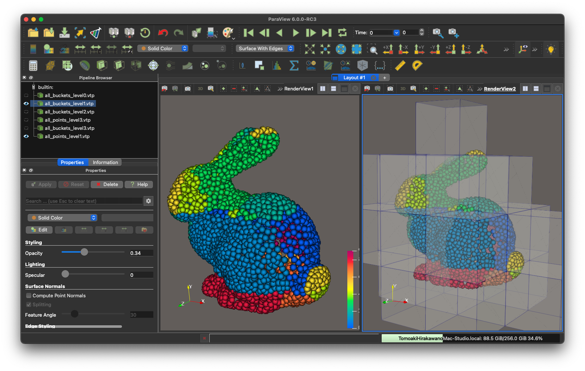
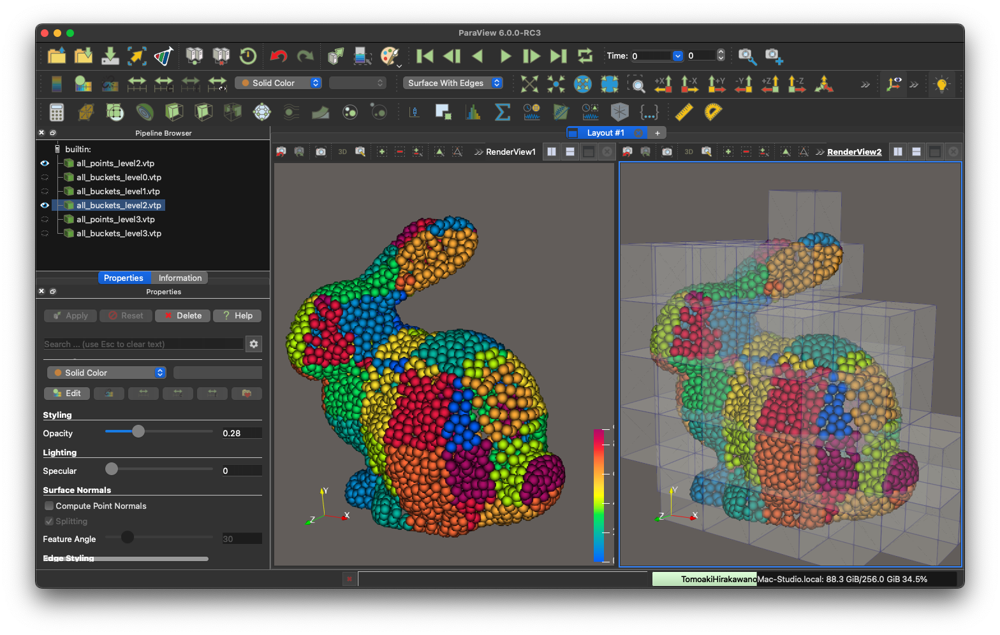
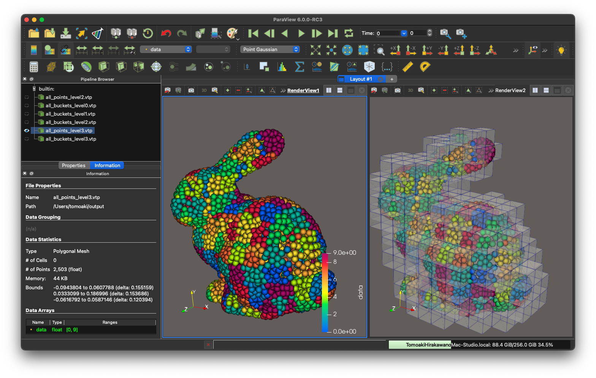
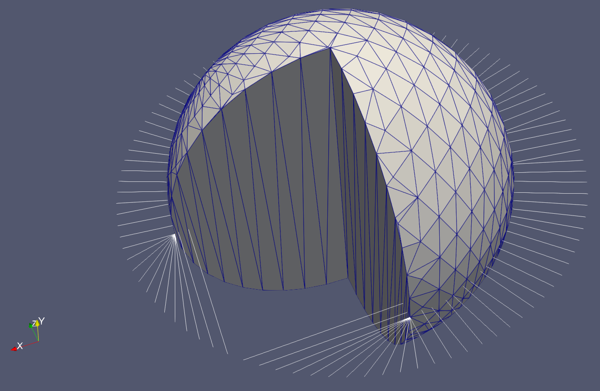
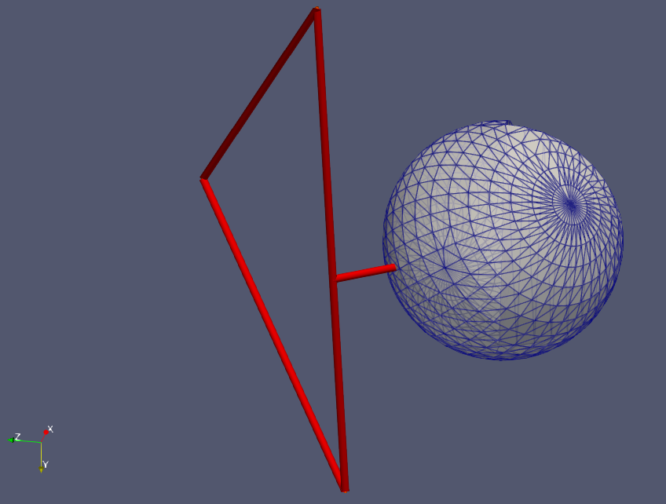
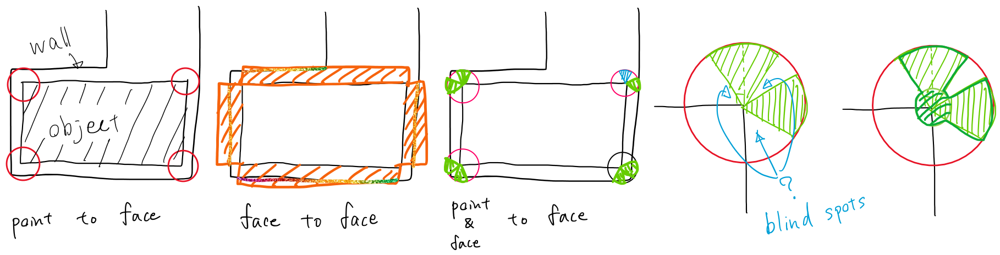

## ⛵ ⛵ 空間分割（space_partitioning） `Buckets<T, N>`  

## ⛵ ⛵ 概要  

`Buckets<T, N>` は、3次元空間内のオブジェクトを効率的に管理、検索するための汎用的な空間分割データ構造です。主な目的は、**高速な近傍探索**と、**高速多重極法 (FMM: Fast Multipole Method)** のための階層的なデータ管理基盤を提供することです。

このクラスは、空間を均一な格子（セル/バケット）に分割するだけでなく、オブジェクトの密度に応じて各セルを再帰的に細分化し、オクツリーのような**階層ツリー構造**を動的に構築できます。

**主な機能:**

* **フラットな空間分割**: 特定の座標周辺のオブジェクトを高速にリストアップします。
* **階層的なツリー構築**: オブジェクトの分布に応じて空間を再帰的に分割し、計算の局所性を高めます。
* **FMMサポート**: 多重極展開と局所展開のモーメント、および相互作用リストを各ノードで保持し、FMM計算をサポートします。
* **パフォーマンス最適化**: 更新性能と走査性能を両立させるためのデータ構造や、C++17の並列アルゴリズムを活用した高速な操作を提供します。

### 🪼 🪼 テンプレートパラメータ  

| パラメータ | 説明 |
| :--- | :--- |
| `T` | 格納するオブジェクトの型。通常はオブジェクトへのポインタ（例: `Particle*`, `Node*`）を指定します。`T` 型のオブジェクト `p` は、`p->X` という形で `Tddd` 型の位置座標を公開している必要があります。 |
| `N` | FMMで使用するモーメントの最大次数。`Moments<T, N>` クラスの実装に依存します。`N=0` の場合はFMM関連の機能は実質的に無効化されます。 |

-----

## ⛵ ⛵ コアコンセプト  

`Buckets` クラスは、2つの主要なモードで動作します。「フラットな空間分割」と「階層的なツリー構造」です。

### 🪼 🪼 1\. フラットな空間分割 (Flat Partition)  

最も基本的な利用形態です。コンストラクタで指定された3次元のバウンディングボックスを、指定されたセル幅 `dL` で均一な格子に分割します。

* **オブジェクトの追加**: 各オブジェクトは、その位置座標に基づいて対応するセル（バケット）に格納されます。
* **近傍探索**: `apply(x, d, ...)` などの関数を呼び出すことで、座標 `x` から距離 `d` の範囲内にあるセル群を効率的に特定し、その中のオブジェクトに対して一括で処理を適用できます。これにより、全オブジェクトを走査するよりも劇的に計算コストを削減できます。

### 🪼 🪼 2\. 階層的なツリー構造 (Hierarchy)  

`generateTree()` メソッドを呼び出すことで、フラットな構造から階層的なツリー構造へ移行します。

* **再帰的分割**: 各セルは、内部のオブジェクト数が特定の条件（ラムダ式で指定可能）を満たす場合に、さらに小さな8つの子セル（3Dの場合）に再帰的に分割されます。これにより、オブジェクトが密集している領域は細かく、疎な領域は粗いままの、適応的な空間分割が実現されます。
* **FMMの基盤**: このツリー構造はFMMの根幹をなします。各ノード（セル）が多重極モーメントや局所展開モーメントを保持し、親子関係や近傍関係を利用してM2M（Multipole-to-Multipole）、M2L（Multipole-to-Local）、L2L（Local-to-Local）といった変換を効率的に行います。

-----

## ⛵ ⛵ 内部データ構造  

`Buckets` クラスは、パフォーマンスと柔軟性を両立させるために、複数のデータコンテナを内部で管理しています。

| メンバ変数 | 型 | 説明 |
| :--- | :--- | :--- |
| `data` | `vector<vector<vector<unordered_set<T>>>>` | オブジェクトを格納する主要な3Dコンテナ。**`unordered_set`** を使用しているため、オブジェクトの**追加・削除が平均 O(1)** と非常に高速です。 |
| `data_vector` | `vector<vector<vector<vector<T>>>>` | `data` の内容をコピーしたキャッシュ用の3Dコンテナ。**`vector`** はデータがメモリ上で連続しているため、範囲を指定した**走査（イテレーション）が `unordered_set` よりも高速**です。`setVector()` を呼び出すことで `data` と同期されます。 |
| `data1D` | `unordered_set<T>` | このバケット（およびすべての子孫バケット）に含まれる全オブジェクトの一意な集合。 |
| `children` | `vector<vector<vector<Buckets*>>>` | 階層構造における子ノード（子バケット）へのrawポインタを保持します。メモリ管理は手動で行われます。 |
| `level_buckets` | `vector<vector<Buckets*>>` | **ルートノードのみが保持**。ツリーの各レベルに存在する非空ノードへのポインタを格納した配列。`forEachAtLevel` などで特定のレベルのノードを高速に走査するために使われます。 |
| `deepest_level_buckets` | `vector<Buckets*>` | **ルートノードのみが保持**。ツリーの末端ノード（葉ノード）の集合。 |
| `Moments...` | `Moments<T,N>` | FMM用の多重極展開モーメントと局所展開モーメントを保持するオブジェクト。 |
| `buckets_for_M2L`, `buckets_near` | `vector<Buckets*>` | FMMの計算で必要となる相互作用リスト。 |

**不変条件**:

* `vector_is_set == true` のとき、`data` と `data_vector` の内容は同一です。
* 子ノードは、親ノードの領域を重複なく正確に分割します。

-----

## ⛵ ⛵ APIガイド  

### 🪼 🪼 A. 初期化と設定  

* `Buckets(bounds, dL)`: 指定された境界 `bounds` とセル幅 `dL` でルートバケットを初期化します。
* `initialize(bounds, dL)`: 既存のインスタンスを再初期化します。
* `setVector()`: `data` (`unordered_set`) の内容を `data_vector` (`vector`) にコピーします。大量の検索や走査処理の前に呼び出すことで、パフォーマンスが向上します。

### 🪼 🪼 B. オブジェクトの管理 (追加・削除)  

* `add(x, p)`: 座標 `x` にオブジェクト `p` を追加します。ツリーが存在する場合は、対応する子孫ノードにも再帰的に追加されます。
* `erase(p)`: オブジェクト `p` を削除します。ツリー全体から再帰的に削除されます。
* `add_grow(x, p)`: オブジェクト `p` を追加し、分割条件を満たせばツリーを動的に成長（分割）させます。
* `erase_shrink(p)`: オブジェクト `p` を削除し、その結果セルが空になった場合にノードを削除（縮小）します。
* `clear()`: すべてのオブジェクトを削除します。

### 🪼 🪼 C. 階層ツリーの操作  

* `generateTree(condition)`: 指定された `condition` (ラムダ式) を満たすノードを再帰的に分割し、階層ツリーを構築します。
* 例: `B.generateTree([](auto b){ return b->data1D.size() > 8; });` // オブジェクト数が8を超えるバケットを分割
* `forEachAll(func)`: ツリーの全ノード (ルート含む) に対して深さ優先で `func` を適用します。
* `forEachAtLevel(level, func)`: 指定した `level` のすべてのノードに対して `func` を適用します。 (ルートが事前計算したリストを使用するため高速)
* `forEachAtDeepest(func)`: ツリーのすべての葉ノードに対して `func` を適用します。
* `getBucketAtLevel(level, x)`: 座標 `x` を含む、指定 `level` のノードへのポインタを返します。

### 🪼 🪼 D. 近傍探索と走査  

これらの関数は、内部で `vector_is_set` フラグをチェックし、`data_vector` が利用可能であればそちらを使って高速に処理を実行します。

* `apply(x, d, func)`: 座標 `x` からの距離 `d` の範囲（立方体近似）に含まれる**すべてのオブジェクト**に `func` を適用します。
* `any_of(x, d, pred)`: 範囲内に `pred` を満たすオブジェクトが**一つでも存在すれば** `true` を返します。
* `all_of(x, d, pred)`: 範囲内の**すべてのオブジェクトが** `pred` を満たせば `true` を返します。
* `none_of(x, d, pred)`: 範囲内に `pred` を満たすオブジェクトが**一つも存在しなければ** `true` を返します。

-----

## ⛵ ⛵ 代表的なワークフロー  

```cpp
#include "lib_spatial_partitioning.hpp"

// オブジェクトの型 (例: networkPoint*)
using MyObject = networkPoint*;

// 1. ルートバケットの生成
CoordinateBounds bounds = ...; // 対象となる空間全体の境界
double dL = 1.0;               // 分割するセルの基本サイズ
Buckets<MyObject, 8> B(bounds, dL); // FMM次数8で初期化

// 2. オブジェクトの追加
for (MyObject p : all_points) {
B.add(p->X, p);
}

// 3. (FMM利用時) 階層ツリーの生成
//    オブジェクト数が16を超えたノードを再帰的に分割する
B.generateTree([](auto b){
return b->data1D.size() > 16;
});

// 4. (パフォーマンス向上) 走査用キャッシュの作成
//    これから多くの近傍探索を行う前に呼び出す
B.setVector();

// 5. 近傍クエリの実行
Tddd search_pos = {1.0, 2.0, 3.0};
double radius = 5.0;
B.apply(search_pos, radius, [](MyObject p){
// 見つかったオブジェクト p に対する処理
process(p);
});

// 6. (動的シミュレーション時) オブジェクトの移動とツリーの再構築
//    (batchRelocateAndMaybeRegrow のような外部ユーティリティを想定)
relocate_points();
B.rebuild_tree_if_needed();
```

-----

## ⛵ ⛵ 設計思想とトレードオフ  

* **更新性能 vs 走査性能**: `unordered_set` (`data`) と `vector` (`data_vector`) の二重持ちは設計の核です。前者はオブジェクトの頻繁な追加・削除に、後者は静的なオブジェクト群に対する大量の近傍クエリに強いという特性を両立させています。`setVector()` がその切り替えスイッチの役割を果たします。
* **メモリ管理**: 子ノードを `raw pointer` (`Buckets*`) で管理することで、スマートポインタのオーバーヘッドを避け、パフォーマンスを優先しています。ただし、これによりメモリリークのリスクが生じるため、デストラクタや `erase_shrink` などで手動のメモリ管理が必須となります。将来的には `std::unique_ptr` への移行が検討されています。
* **探索範囲の近似**: 球形の探索範囲は、実装の簡略化とSIMD命令の親和性を高めるため、軸並行境界ボックス（AABB）で近似されます。つまり、検索は少し大きめの立方体領域に対して行われます。厳密な球形範囲が必要な場合は、`apply` 内のラムダ式で追加の距離二乗チェックを行う必要があります。
* **ルートノードへの情報集約**: `level_buckets` などの階層情報はルートノードに集約されます。これにより、特定のレベルのノード全体にアクセスする操作が O(対象ノード数) となり、ツリーを毎回トラバースするコストを削減しています。

## ⛵ ⛵ スレッド安全性  

本クラスは、**スレッドセーフではありません**。

* **書き込み操作** (`add`, `erase`, `generateTree` など) と、**読み取り操作** (`apply`, `any_of` など) を異なるスレッドで同時に実行すると、データ競合が発生し、未定義の動作を引き起こします。

安全な利用のためには、プログラムのフェーズを明確に分離する必要があります。

1.  **更新フェーズ**: シングルスレッドでオブジェクトの追加、削除、ツリーの再構築を行います。
2.  `setVector()` を呼び出します。
3.  **読み取りフェーズ**: `apply` などの読み取り専用操作を複数のスレッドで並列に実行します。内部で C++17 Parallel Algorithms や OpenMP が使われているため、読み取り操作自体は並列化の恩恵を受けます。
[:material-microsoft-visual-studio-code:../../include/lib_spatial_partitioning.hpp#L11](vscode://file//Users/tomoaki/Library/CloudStorage/Dropbox/code/cpp/include/lib_spatial_partitioning.hpp:11)


## ⛵ 等間隔のシンプルな空間分割 

```shell
sh clean
cmake -DCMAKE_BUILD_TYPE=Release ../ -DSOURCE_FILE=example1_space_partitioning.cpp
make
./example1_space_partitioning
```

<!-- Key coordinatebounds not found -->

<!-- Key space_partitioning not found -->

### 🪼 例 

この例では，うさぎの３Dモデルを空間分割する．
配列させたバケット内に，うさぎの点または面が含まれるかを判定し，バケットに保存する．

ただ，面は広がりがあるので，複数のバケットに含まれることがある．
面と交わる全バケットを簡単に確実に見つける方法は，現在のところ思いつかない．
なので，今の所は，面を無数の点に分けて，各点を含むバケットに面を保存することで対応している．


[:material-microsoft-visual-studio-code:example1_space_partitioning.cpp#L6](vscode://file//Users/tomoaki/Library/CloudStorage/Dropbox/code/cpp/builds/build_Buckets/example1_space_partitioning.cpp:6)

---
## ⛵ 階層のある空間分割（木構造） 

```shell
sh clean;
cmake -DCMAKE_BUILD_TYPE=Release ../ -DSOURCE_FILE=example2_tree.cpp
make
./example2_tree
```

### 🪼 `generateTree` 

ツリー生成`generateTree`によって`children[i][j][k]`が生成されると，`data[i][j][k]`の内容が`children[i][j][k]->data1D`にコピーされる．

以下二つは全く同じものを保存している:

* `b->data[i][j][k]`
* `b->children[i][j][k]->data1D`　


<div class="slide-container">




</div>

levelを０から３まで変化させて，各レベルのBucketsクラス`children`にオブジェクトを再帰的に振り分けていく．

[:material-microsoft-visual-studio-code:example2_tree.cpp#L2](vscode://file//Users/tomoaki/Library/CloudStorage/Dropbox/code/cpp/builds/build_Buckets/example2_tree.cpp:2)

---
## ⛵ 階層のある空間分割（木構造） 

```shell
sh clean; cmake -DCMAKE_BUILD_TYPE=Release ../ -DSOURCE_FILE=example2_tree_rebin.cpp
make
./example2_tree_rebin
```

### 🪼 `rebin` 

バケツに保存したオブジェクトの位置が変化した場合，
ツリー構造全体を再構築するのではなく，
バケツの外に出てしまったオブジェクトだけを再配置する方が効率的である．

[:material-microsoft-visual-studio-code:example2_tree_rebin.cpp#L1](vscode://file//Users/tomoaki/Library/CloudStorage/Dropbox/code/cpp/builds/build_Buckets/example2_tree_rebin.cpp:1)

---
## ⛵ 空間分割の応用例：オブジェクトの接触や交差の判定 

### 🪼 線分と面の交差判定 

`Network`クラスは，`makeBucketPoints`でバケツ`BucketPoints`を準備し，内部に保存している点をバケツに保存する．
同様に，`makeBucketFaces`でバケツを`BucketFaces`を準備し，内部に保存している面をバケツに保存する．

要素の接触や交差の判定には，[:material-microsoft-visual-studio-code:basic_geometry:IntersectQ](vscode://file//Users/tomoaki/Library/CloudStorage/Dropbox/code/cpp/include/basic_geometry.hpp:1978)関数を使う．
また，接触判定の高速化のために，空間分割を使う．

```shell
cmake -DCMAKE_BUILD_TYPE=Release ../ -DSOURCE_FILE=example3_line_face_interaction.cpp
make
./example3_line_face_interaction
```

<gif src="./example3/anim_faster.gif" width="500px">

[:material-microsoft-visual-studio-code:example5_line_face_interaction.cpp#L4](vscode://file//Users/tomoaki/Library/CloudStorage/Dropbox/code/cpp/builds/build_Buckets/example5_line_face_interaction.cpp:4)

---
### 🪼 点から面までの最短ベクトル `Nearest` 

[:material-microsoft-visual-studio-code:Nearest_](vscode://file//Users/tomoaki/Library/CloudStorage/Dropbox/code/cpp/include/basic_geometry.hpp:1515)関数は，点から面までの最短ベクトルを求める関数である．

```shell
sh clean
cmake -DCMAKE_BUILD_TYPE=Release ../ -DSOURCE_FILE=example4_point2face_Nearest.cpp
make
./example4_point2face_Nearest
```



[:material-microsoft-visual-studio-code:example4_point2face_Nearest.cpp#L4](vscode://file//Users/tomoaki/Library/CloudStorage/Dropbox/code/cpp/builds/build_Buckets/example4_point2face_Nearest.cpp:4)

---
### 🪼 面と面の接触判定（面と面の最短距離の計算） 

```shell
sh clean
cmake -DCMAKE_BUILD_TYPE=Release ../ -DSOURCE_FILE=example5_face2face_contact.cpp
make
./example5_face2face_contact
```

[:material-microsoft-visual-studio-code:basic_geometry:IntersectQ](vscode://file//Users/tomoaki/Library/CloudStorage/Dropbox/code/cpp/include/basic_geometry.hpp:1978)関数は，交差判定には使えるが，接触判定には使えない．
オブジェクト同士の**接触**をプログラム上で定義するなら，互いの面において最も近くにある面同士の最短距離を計算が，ある閾値以下にあるときに接触しているとみなす方法が自然である．

[:material-microsoft-visual-studio-code:Nearest(const T3Tddd &XYZ, const T3Tddd &ABC)](vscode://file//Users/tomoaki/Library/CloudStorage/Dropbox/code/cpp/include/basic_geometry.hpp:1819)関数は，面と面の最短距離を求める関数．
重心座標付近を徐々に細かく探索して，より正確な最短距離を求める．探査範囲を狭めながらこれを繰り返す．
`N=3`，4x4点で最短となる重心座標を求める．次に範囲を0.7倍に狭め，これを数十回繰り返す．




> [!WARNING]
> 捕捉した側の三角形の節点に1を，捕捉された側の三角形の節点には-1の値を与えて出力している．捕捉される側の点が-1ではないからといって，接触していないわけではない．
> 接触判定は，２つ同時に行うことは難しい．オブジェクト毎に接触判定を行う必要がある．

三角形が構造物と接触していると判定する方法は，

* 頂点と面との関係を基に，面の接触を判定する（３つの単純な情報から接触判定）
* 面と面を繋ぐ最短ベクトルを基に決める（１つの単純な情報から接触判定）
* 面のある位置で接触判定を行い，その結果をもとに面の接触を判定する（例えば３つの少し複雑な情報から接触判定）

などが考えられる．
境界要素法では，節点と面の組に合わせに対して，Dirichlet条件かNeumann条件かを設定することがある．
このような場合には，節点と面の組み合わせに対して，接触判定を行うことが最も自然である．



#### 🪸 接触判定の条件の制限 

場合によっては，面同士が向き合っている場合にのみ接触したとみなしたい場合もある．例えば次の２つが考えられる．

- `isFlat(X1nearest - X0nearest, F->normal, 10. * M_PI / 180.)`
- `isFlat(f->normal, F->normal, 10. * M_PI / 180.)`

[:material-microsoft-visual-studio-code:example5_face2face_contact.cpp#L3](vscode://file//Users/tomoaki/Library/CloudStorage/Dropbox/code/cpp/builds/build_Buckets/example5_face2face_contact.cpp:3)

---
# 🐋 vtk, vtp, vtu 

* VTK (Visualization Toolkit)
VTKは，3次元データを可視化するためのライブラリでフォーマットという意味ではない．
* VTU (VTK Unstructured Grid Format)
VTUは，内部構造や体積データの解析の場合に適している．体積のある非構造格子データを扱う際はこれを使う．
* VTP (VTK PolyData Format)
VTPは，表面のみの表示や表面の特性に焦点を当てる場合に適している．


以下は，どちらも四面体を表現している．

<details>
<summary>VTUフォーマット</summary>

```xml
<?xml version="1.0"?>
<VTKFile type="UnstructuredGrid" version="0.1" byte_order="LittleEndian">
<UnstructuredGrid>
<Piece NumberOfPoints="4" NumberOfCells="1">
<Points>
<DataArray type="Float32" NumberOfComponents="3" format="ascii">
0.157726 -0.00244936 -0.15 0.140393 -0.05 -0.15 0.123855 -0.0239571 -0.15
0.162817 -0.05 -0.2
</DataArray>
</Points>
<Cells>
<DataArray type="Int32" Name="connectivity" format="ascii">
0 1 2 3
</DataArray>
<DataArray type="Int32" Name="offsets" format="ascii">
4
</DataArray>
<DataArray type="UInt8" Name="types" format="ascii">
10
</DataArray>
</Cells>
</Piece>
</UnstructuredGrid>
</VTKFile>

```

</details>


<details>
<summary>VTPフォーマット</summary>

```xml
<?xml version="1.0"?>
<VTKFile type="PolyData" version="0.1" byte_order="LittleEndian">
<PolyData>
<Piece NumberOfLines="0" NumberOfPoints="4" NumberOfPolys="4" NumberOfStrips="0"
NumberOfVerts="0">
<Points>
<DataArray NumberOfComponents="3" format="ascii" type="Float32">
0.157726 -0.00244936 -0.15 0.140393 -0.05 -0.15 0.123855 -0.0239571 -0.15
0.162817 -0.05 -0.2
</DataArray>
</Points>
<PointData>
</PointData>
<CellData Normals="cell_normals" Scalars="cell_scalars">
</CellData>
<Polys>
<DataArray Name="connectivity" format="ascii" type="Int32">
2 3 1 0 3 2 0 1 3 0 2 1
</DataArray>
<DataArray Name="offsets" format="ascii" type="Int32">
3 6 9 12
</DataArray>
</Polys>
<Lines>
<DataArray Name="connectivity" format="ascii" type="Int32">

</DataArray>
<DataArray Name="offsets" format="ascii" type="Int32">

</DataArray>
</Lines>
</Piece>
</PolyData>
</VTKFile>
```

</details>

[:material-microsoft-visual-studio-code:example2_generate_tetra_constrained2.cpp#L353](vscode://file//Users/tomoaki/Library/CloudStorage/Dropbox/code/cpp/builds/build_Buckets/example2_generate_tetra_constrained2.cpp:353)

---
## ⛵ 四面体の生成（制約付き四面分割 constrained tetrahedralization） 

* PLC: piecewise linear complex
* CDT: constrained Delaunay triangulation

CDTの生成法には，主に２つの方法がある\ref{Schewchuk2002}：

* naive gift wrapping algorithm (これはadvancing front algorithmとも呼ばれるものと同じだろう)
* sweep algorithm

[杉原厚吉,計算幾何学](杉原厚吉,計算幾何学)によれば，ドロネー四面体分割以外に，綺麗な四面体分割を作成する方法はほとんど知られていないらしい．
四面体分割は，三角分割の場合のように，最小内角最大性が成り立たたず，スリーバー（sliver）と呼ばれる，外接円が大きくないものの潰れた悪い四面体が作られる可能性がある．
このスリーバーをうまく削除することが重要となる．

```shell
sh clean
cmake -DCMAKE_BUILD_TYPE=Release ../ -DSOURCE_FILE=example2_generate_tetra_constrained2.cpp
make
./example2_generate_tetra_constrained2
```

`bunny.obj`のような複雑なポリゴンには，この方法ではうまくいかない．

[:material-microsoft-visual-studio-code:example2_generate_tetra_constrained2.cpp#L1](vscode://file//Users/tomoaki/Library/CloudStorage/Dropbox/code/cpp/builds/build_Buckets/example2_generate_tetra_constrained2.cpp:1)

## ⛵ スコアリングと選択 

四面体の外接球の中心に点が近いほどスコアは低くなる．

外接球の半径が小さすぎる場合は四面体の候補から外す．

[:material-microsoft-visual-studio-code:example2_generate_tetra_constrained2.cpp#L161](vscode://file//Users/tomoaki/Library/CloudStorage/Dropbox/code/cpp/builds/build_Buckets/example2_generate_tetra_constrained2.cpp:161)

---
# 🐋 CGALを使って四面体を生成する 9_9_CGAL 

⚠️ コンパイルできない

## ⛵ CGALを使って四面体を生成する 

```shell
brew install gmp mpfr
brew install CGAL
```

```shell
sh clean
cmake -DCMAKE_BUILD_TYPE=Release ../ -DSOURCE_FILE=example1_generate_tetra_using_CGAL.cpp -I/opt/homebrew/Cellar/cgal/6.0.1/include
make
```

[:material-microsoft-visual-studio-code:example1_generate_tetra_using_CGAL.cpp#L2](vscode://file//Users/tomoaki/Library/CloudStorage/Dropbox/code/cpp/builds/build_Buckets/example1_generate_tetra_using_CGAL.cpp:2)

## ⛵ CGALを使って四面体を生成する 

⚠️ コンパイルできない

```shell
sh clean
cmake -DCMAKE_BUILD_TYPE=Release ../ -DSOURCE_FILE=example1_generate_tetra_using_CGAL_constrained.cpp
make
```

`CGAL::Mesh_polyhedron_3<K>::type` is typically a typedef for a polyhedron data structure that is compatible with CGAL's mesh generation algorithms.
`CGAL::Polyhedron_3<K>` is a standard CGAL polyhedron class.

[:material-microsoft-visual-studio-code:example1_generate_tetra_using_CGAL_constrained.cpp#L1](vscode://file//Users/tomoaki/Library/CloudStorage/Dropbox/code/cpp/builds/build_Buckets/example1_generate_tetra_using_CGAL_constrained.cpp:1)

## ⛵ CGALを使って四面体を生成し，さらに細分化する 

⚠️ コンパイルできない

```shell
brew install CGAL
```

```shell
sh clean
cmake -DCMAKE_BUILD_TYPE=Release ../ -DSOURCE_FILE=example1_generate_tetra_using_CGAL_refining.cpp
make
```

[:material-microsoft-visual-studio-code:example1_generate_tetra_using_CGAL_refining.cpp#L1](vscode://file//Users/tomoaki/Library/CloudStorage/Dropbox/code/cpp/builds/build_Buckets/example1_generate_tetra_using_CGAL_refining.cpp:1)

---
点が，楕円の内部にあるかどうかを判定する．


[:material-microsoft-visual-studio-code:example5_is_in_an_ellipsoid.cpp#L11](vscode://file//Users/tomoaki/Library/CloudStorage/Dropbox/code/cpp/builds/build_Buckets/example5_is_in_an_ellipsoid.cpp:11)

---
