# Contents
- [🐋 離散フーリエ変換](#-離散フーリエ変換)
    - [⛵ 複素フーリエ級数展開](#-複素フーリエ級数展開)
    - [⛵ 離散フーリエ変換（インデックス周期$`N`$のフーリエ変換）](#-離散フーリエ変換インデックス周期nのフーリエ変換)
    - [⛵ 逆離散フーリエ変換](#-逆離散フーリエ変換)
    - [⛵ 離散フーリエ変換によるデータの補間](#-離散フーリエ変換によるデータの補間)
    - [⛵ 畳み込み積分](#-畳み込み積分)
        - [🪼 離散データの畳み込み積分](#-離散データの畳み込み積分)


---
# 🐋 離散フーリエ変換 

離散フーリエ変換と逆離散フーリエ変換を端的に示すと次のようになる．
結果は，Mathematicaの`Fourier`関数，`InverseFourier`関数の`FourierParameters`オプションが，`{-1,-1}`の場合と一致する．

```Mathematica
MyFourier[list_, n_] := With[{len = Length[list]}, Sum[list[[k + 1]]*Exp[-I*n*2 \[Pi]/len*k], {k, 0, len - 1}]/len];
MyInverseFourier[list_, n_] := With[{len = Length[list]}, Sum[list[[k + 1]]*Exp[I*n*2 \[Pi]/len*k], {k, 0, len - 1}]];

(*離散データ*)
u = N@{1, 2, 3, 4, 5, 4, 3, 2, 1};

Grid[
Transpose@{cn = Table[MyFourier[u, n], {n, 0, Length[u] - 1}],
Fourier[u, FourierParameters -> {-1, -1}]}
, Frame -> All]

Grid[
Transpose@{Table[MyInverseFourier[cn, n], {n, 0, Length[cn] - 1}],
InverseFourier[cn, FourierParameters -> {-1, -1}]}
, Frame -> All]
```

## ⛵ 複素フーリエ級数展開 

```math
f(t) = \sum _{n=-\infty}^{\infty} c _n \exp(i n \omega^\ast t), \quad c _n = \frac{1}{T^\ast} \int _{-\frac{T^\ast}{2}}^{\frac{T^\ast}{2}} f(t) \exp(-i n \omega^\ast t) \, dt, \quad \omega^\ast = \frac{2\pi}{T^\ast}
```

$`\exp({i \theta}) = \cos \theta + i \sin \theta`$なので，
フーリエ係数の実部には，$`\cos \theta`$の係数が，虚部には，$`\sin \theta`$の係数が含まれる．

$`c _n=\frac{a _n - i \mathrm{sgn}(n) b _n}{2}`$

## ⛵ 離散フーリエ変換（インデックス周期$`N`$のフーリエ変換） 

$`N`$個の離散データ`{1, 1, 2, 2, 1, 1, 0, 0}`があるとする．
これが，周期的に繰り返すとする．

```cpp
{1, 1, 2, 2, 1, 1, 0, 0},{1, 1, 2, 2, 1, 1, 0, 0},{1, 1, 2, 2, 1, 1, 0, 0},...
```

与えられたデータは離散的だが，
これを連続で周期的な関数$`f(t)`$として表したい．
また，データインデックス上では，対応する与えられたデータ値と一致させたい．
つまり，$`i=2`$を関数に与えたら，2を返してほしい．これはいわば補間のようなものである．
複素フーリエ級数展開によって，この願いを叶えるためには，
$`c _0,...,c _{N-1}`$の$`N`$コの係数があればよい．

```math
f(t) = \sum _{n=0}^{N-1} c _n \exp(i n \omega^\ast t), \quad c _n = \int _{0}^{T^\ast} f(t) \exp(-i n \omega^\ast t) \, dt, \quad \omega^\ast = \frac{2\pi}{T^\ast}
```

ここでの添字の振り方は，初めのデータを$`0`$番として数えることにする．
そう数えると周期性を仮定したので，$`N`$番目のデータは$`0`$番目のデータと等しいことになる．
この無限に続く数字をフーリエ級数で表現すると，
$`0`$番目と$`N`$番目のデータは，級数を構成する三角関数の$`0`$と$`2\pi`$に対応している．
dataとindex，angle，periodの対応は次のようなイメージである．

```cpp
data  : {1, 1, 2, ...,                               0, 0}, {1, 1, ...
index : {0, 1, 2, ...,                           N-2, N-1}, {N, N+1, ...
angle : {0, 2pi/N, 2pi*2/N, ..., 2pi*(N-2)/N, 2pi*(N-1)/N}, {2pi, 2pi*(N+1)/N, ...
period: {0,   T/N,    2T/N, ...,   T*(N-2)/N,   T*(N-1)/N}, {T,     T*(N+1)/N, ...
```

複素フーリエ係数$`c _n`$を台形則で数値積分すると，

```math
\begin{align}
c _n &= \frac{1}{T^\ast} \left[ \frac{g _n(0) + g _n(N\delta t)}{2} + \sum _{k=1}^{N-1} g _n(k \delta t) \right] \delta t, \quad \delta t = \frac{T^\ast}{N}, \quad g _n(0) = g _n(N\delta t),\quad g _n(t) = f(t) \exp(-i n \omega^\ast t)\\
&= \frac{1}{N} \sum _{k=0}^{N-1} g _n(k \delta t) {\quad\text{became simple additions}}\\
&= \frac{1}{N} \sum _{k=0}^{N-1} \left[ f\left(k\frac{T^\ast}{N}\right) \exp\left( -i n \frac{2 \pi}{T^\ast} k \frac{T^\ast}{N} \right) \right]\\
&= \frac{1}{N} \sum _{k=0}^{N-1} \left[ f _k \exp\left( -i n \frac{2 \pi}{N} k \right) \right], \quad f _k = f\left(k\frac{T^\ast}{N}\right)
\end{align}
```

これからわかるように，$`c _n`$は周期$`T^\ast`$に依存しておらず，データの数$`N`$に依存している．
（$`f(kT^\ast/N)`$は，$`T^\ast`$によらず常に$`k`$番目データ値`data[k]`を指しているので，$`T^\ast`$に依存していない）
離散フーリエ係数は，周期とは無関係なのである．

$`c _n`$が大きさを表す波の周波数は，数式から$`n/T^\ast`$であるとわかる．

最後の式は，連続した関数のフーリエ係数を抽出するための式と照らし合わせると，
$`T^\ast`$を$`N`$と置き換えた形になっている．
時間軸ではなく，インデックス軸で積分しているようなものである．

$`c _n`$は，$`c _n=c _{n+N}`$であり$`n`$に関して周期$`N`$の周期関数となっている．
ただし，実部は偶関数で，虚部は奇関数である．
なので，$`c _n=c _{-n}`$ではなく，$`c _n=\overline{c _{-n}}`$である．
ただし，これは複素フーリエ変換の定義そのものの性質である．

```math
c _n = \frac{a _0}{2}, \quad c _n = \frac{a _n - i b _n}{2}, \quad c _{-n} = \frac{a _n + i b _n}{2}, \quad c _{-n} = \overline{c _n}
```

なので，$`c _n`$を求めるさい，$`n=N/2`$より大きいインデックスの係数の計算は省略できる．

---

Mathematicaの組み込み関数と比較して確かめてみる．
Mathematicaの`Fourier`関数の`FourierParameters`オプションが，`{-1,-1}`の場合に上記の式と一致する．
`MyFourier`は全く同じ結果を返す．

```Mathematica
(*example0.nb*)
list = {1., 1., 2., 2., 1., 1., 0., 0.};
MyFourier[list_, n_] := With[{len = Length[list]}, Sum[list[[k + 1]]*Exp[-I*n*2. \[Pi]/len*k], {k, 0, len - 1}]/len];
Column[Fourier[list, FourierParameters -> {-1, -1}], Frame -> All]
Column[cn = Table[MyFourier[list, n], {n, 0, Length[list] - 1}], Frame -> All]
```

c++での`MyFourier`と同じ関数を作って実行してみる．実行方法：

```cpp
sh clean
cmake -DCMAKE_BUILD_TYPE=Release ../ -DSOURCE_FILE=example0_simple.cpp
./example0_simple
```

結果は，Matheamticaと同じになる．

| list | 元データ| 離散フーリエ変換 |
|:---:|:---:|:---:|
| random list | 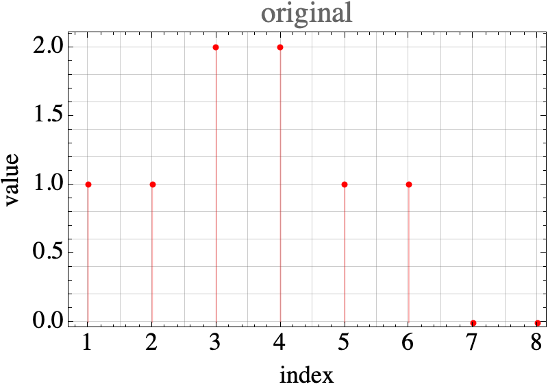 | 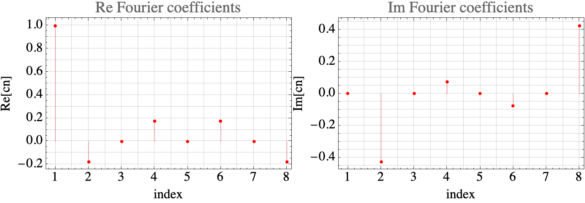 |
| cos wave | 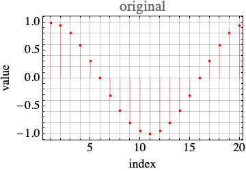 | 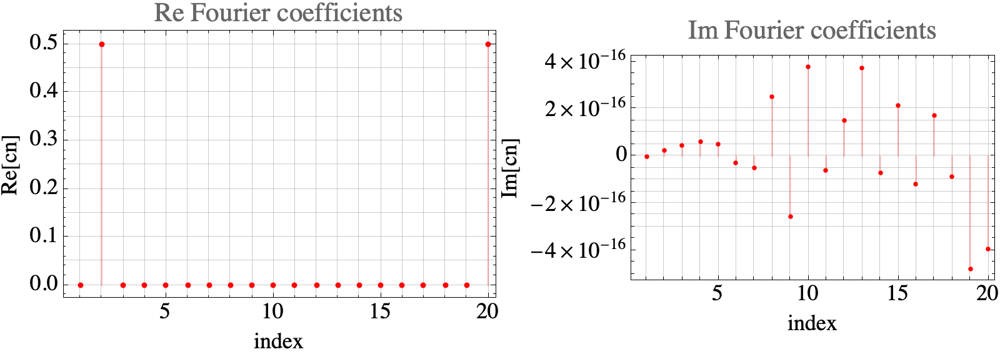 |
| square wave | 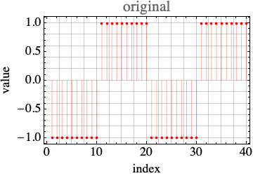 | 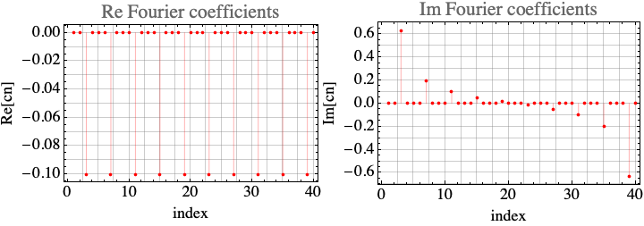 |
| triangle wave | 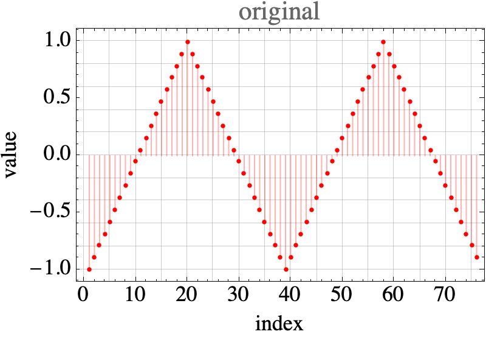 | 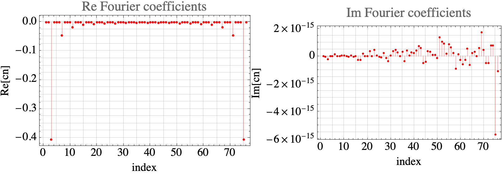 |


## ⛵ 逆離散フーリエ変換 

フーリエ係数$`c _n`$から元の関数$`f _\kappa=f(t=\kappa \delta t)`$を復元することを考える．
三角関数を掛けて積分することで係数を抽出できたので，その方法で関数を抽出する．

フーリエ変換は次のように定義している．

```math
c _n = \frac{1}{N} \sum _{k=0}^{N-1} \left[ f _k \exp\left( -i n \frac{2 \pi}{N} k \right) \right]
```

$`\exp\left( -i n \frac{2 \pi}{N} k \right)`$ではなく，$`\exp\left( i n \frac{2 \pi}{N} \kappa \right)`$を掛けて積分する．ここで，$`k`$と区別するために$`\kappa`$を使っている．

```math
\begin{equation}
\begin{aligned}
\sum _{n=0}^{N-1}{c _n} \exp\left( i n \frac{2 \pi}{N} \kappa \right)&=\sum _{n=0}^{N-1}{\frac{1}{N} \sum _{k=0}^{N-1} \left[ f _k \exp\left( -i n \frac{2 \pi}{N} k \right) \right]
} \exp\left( i n \frac{2 \pi}{N} \kappa \right)\\
&=\sum _{n=0}^{N-1}{\frac{1}{N} \sum _{k=0}^{N-1} \left[ f _k \exp\left( -i n \frac{2 \pi}{N} k \right) \right]
} \exp\left( i n \frac{2 \pi}{N} \kappa \right)\\
&=\sum _{n=0}^{N-1}{\frac{1}{N} f _\kappa} \\
&=f _\kappa\\
&=f\left(\kappa\frac{T^\ast}{N}=\kappa\delta t\right)
\end{aligned}
\end{equation}
```

このように，フーリエ係数を使って元の関数を復元できる．下の値を取り出すために$`N`$で割る必要はない．

```Mathematica
list = {1., 1., 2., 2., 1., 1., 0., 0.};
MyInverseFourier[list_, n_] := With[{len = Length[list]}, Sum[list[[k + 1]]*Exp[I*n*2 \[Pi]/len*k], {k, 0, len - 1}]];
Column[InverseFourier[cn, FourierParameters -> {-1, -1}], Frame -> All]
Column[Table[MyInverseFourier[cn, n], {n, 0, Length[list] - 1}],
Frame -> All]
```

## ⛵ 離散フーリエ変換によるデータの補間 

| list | 逆フーリエ変換 | フーリエ級数展開 |
|:---:|:---:|:---:|
| random list | 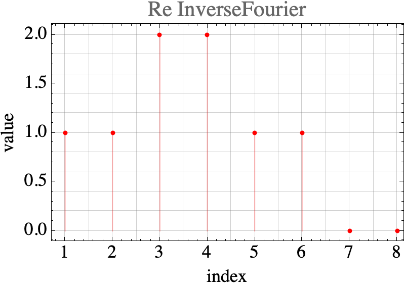 | 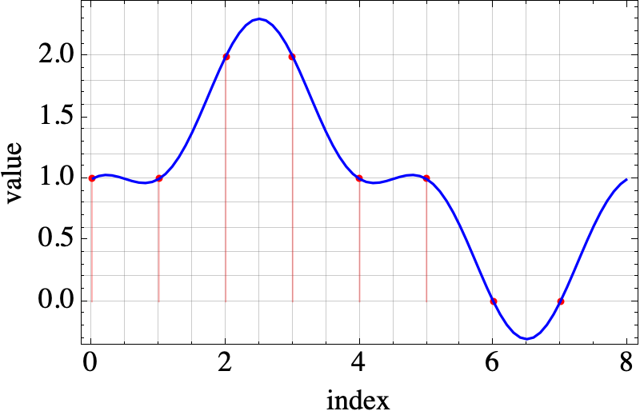 |
| cos wave | 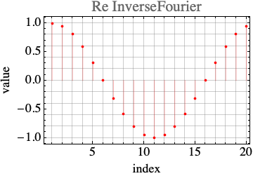 | 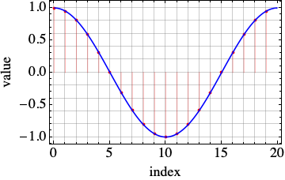 |
| square wave | 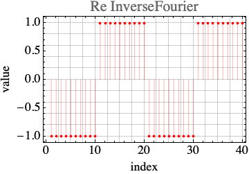 |  |
| triangle wave | 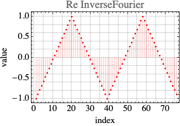 | 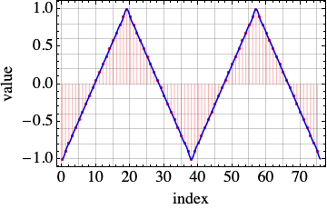 |

[./example0_simple.cpp#L1](./example0_simple.cpp#L1)

## ⛵ 畳み込み積分 

畳み込み積分は，関数`g`をスライドさせながら`f`と掛け合わせ和を求めることである．

```math
(f \ast g)(t) = \int _{-\infty}^{\infty} dx f(x) g(t-x)
```

ここで，$`\ast`$は畳み込み積分を表す．
畳み込み積分は，$`f`$と$`g`$のフーリエ変換を掛け合わせて逆フーリエ変換したものと等しい．
畳み込み積分は，shiftに関する関数と捉えることができる．

```Mathematica
ClearAll["Global`*"];

(*離散信号の定義*)
f[x_] := Piecewise[{{1/2, 0 <= x}, {-1/2, True}}]
g[x_] := Piecewise[{{1, -1 <= x <= 1}, {0, True}}]

(*面白い例*)
f[x_] := Sech[x]^2;
g[x_] := HeavisideTheta[x] - 1/2;

convolve[x_] = Integrate[f[T]*g[x - T], {T, -Infinity, Infinity}];

(*convolve[x_]=Convolve[g[t],f[t],t,x];*)

F[w_] = FourierTransform[f[x], x, w, FourierParameters -> {1, -1}];
G[w_] = FourierTransform[g[x], x, w, FourierParameters -> {1, -1}];
(*convolve[x_]=InverseFourierTransform[F[w]*G[w],w,x,\
FourierParameters->{1,-1}];*)

Manipulate[
Plot[{f[x], g[shift - x], f[x]*g[shift - x], convolve[x]}, {x, -5,
5}
, AxesLabel -> {"x", ""}
, PlotLegends -> {"f[x]", "g[shift-x]", "f[x]g[shift-x]",
"convolve[x]"}
, PlotLabel -> "shift=" <> ToString[shift]
, PlotStyle -> {{Orange, Dashed}, {Orange, DotDashed}, Orange,
Blue}
, Filling -> {3 -> Axis}
, FillingStyle -> Directive[Opacity[0.5], Blue]
, PlotRange -> {{-5, 5}, {-1, 1}}
, BaseStyle -> Black
, Epilog -> {Black, Line[{{shift, -6}, {shift, 6}}]}]
, {shift, -5, 5}]

Export[FileNameJoin[{NotebookDirectory[],
"sample_convolve.gif"}], %, "GIF", {"ImageSize" -> 700,
"AnimationRepetitions" -> \[Infinity], "AnimationRate" -> 10}]
```


### 🪼 離散データの畳み込み積分 

離散データの畳み込み積分は，次のように計算できる．

```math
(f \ast g) _j = \sum _{k=0}^{N-1} f _k g _{j-k}
```

畳み込み積分の値は，フーリエ変換された`f`と`g`の積を逆フーリエ変換した結果と等しい．

```math
(f \ast g) _j = \mathcal{F}^{-1}[\mathcal{F}[f] \cdot \mathcal{F}[g]] _j
```

$`\mathcal{F}^{-1}[\mathcal{F}[f] \cdot \mathcal{F}[g]]`$はデータ列であって，`_j`は，そのデータ列の`j`番目をとることを意味する．

全て逆フーリエ変換してから一つだけを抜き出す必要はなく，`j`だけが必要なら`j`番目のデータだけを取り出すよう和を取ればいい．

```math
(f \ast g) _j = \sum _{n=0}^{N-1} (\mathcal{F}[f] \cdot \mathcal{F}[g]) _n \exp\left(i n \frac{2\pi}{N} j\right)
```

以下は，離散フーリエ変換，逆フーリエ変換，畳み込み積分を行うMatheamticaのコードである．

データをスライドさせて掛け合わせた結果できるデータ列の和は，スライド`len=Length[f] + Length[g] - 1`まで値を持ちえる．
これ以上のスライド＆掛け算の結果はゼロになる．なので，畳み込み和が返すデータ列は，`Length[f] + Length[g] - 1`となる．

離散フーリエを使った，畳み込み和の内部では，まず`f`と`g`の長さをゼロ埋めして`len`の長さに揃えた後，それぞれのフーリエ変換を計算し，掛け合わせる．
その結果を逆フーリエ変換して，畳み込み和を求める．

```Mathematica
MyFourier[list_, n_] := With[{len = Length[list], c = -I*n*2*\[Pi]/Length[list]},
Sum[list[[k + 1]]*Exp[c*k], {k, 0, len - 1}]/len
];

MyInverseFourier[list_, n_] := With[{len = Length[list], c = I*n*2*\[Pi]/Length[list]},
Sum[list[[k + 1]]*Exp[c*k], {k, 0, len - 1}]
];

MyDiscreteConvolve[f_, g_] := Module[{len, F, G, FourierGF},
len = Length[f] + Length[g] - 1;
F = PadRight[f, len];
G = PadRight[g, len];
FourierGF = Table[MyFourier[F, n]*MyFourier[G, n], {n, 0, len - 1}];
Return[N@Table[len*MyInverseFourier[FourierGF, n], {n, 0, len - 1}]];
]
```


(see `example0.nb`)

[./example1_convolution.cpp#L1](./example1_convolution.cpp#L1)

---
