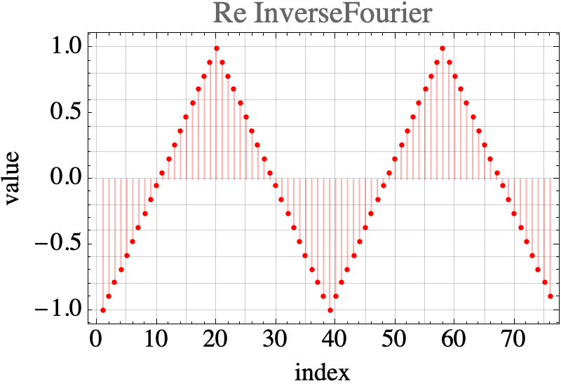

# Contents
- [🐋 フーリエ変換](#🐋-フーリエ変換)
    - [⛵ 複素フーリエ級数展開](#⛵-複素フーリエ級数展開)
    - [⛵ 離散フーリエ変換（インデックス周期$`N`$のフーリエ変換）](#⛵-離散フーリエ変換（インデックス周期$`N`$のフーリエ変換）)
    - [⛵ 逆離散フーリエ変換](#⛵-逆離散フーリエ変換)
    - [⛵ 離散フーリエ変換によるデータの補間](#⛵-離散フーリエ変換によるデータの補間)


---
# 🐋 フーリエ変換 

## ⛵ 複素フーリエ級数展開 

```math
f(t) = \sum _{n=-\infty}^{\infty} c _n \exp(i n \omega^\ast t), \quad c _n = \frac{1}{T^\ast} \int _{-\frac{T^\ast}{2}}^{\frac{T^\ast}{2}} f(t) \exp(-i n \omega^\ast t) \, dt, \quad \omega^\ast = \frac{2\pi}{T^\ast}
```

$`\exp({i \theta}) = \cos \theta + i \sin \theta`$なので，
フーリエ係数の実部には，$`\cos \theta`$の係数が，虚部には，$`\sin \theta`$の係数が含まれる．

$`c _n=\frac{a _n - i \mathrm{sgn}(n) b _n}{2}`$

## ⛵ 離散フーリエ変換（インデックス周期$`N`$のフーリエ変換） 

次のようなで$`N`$個の離散データがあるとする．

```cpp
{1, 1, 2, 2, 1, 1, 0, 0}
```

これが，周期的に繰り返すとする．

```cpp
{1, 1, 2, 2, 1, 1, 0, 0},{1, 1, 2, 2, 1, 1, 0, 0},{1, 1, 2, 2, 1, 1, 0, 0},...
```
初めのデータを$`0`$番として数えると，$`N`$番目のデータは$`0`$番目のデータと等しいことになる．
この無限に続く数字をフーリエ級数で表現するなら，$`0`$番目と$`N`$番目のデータは，級数を構成する三角関数の$`0`$と$`2\pi`$に対応させるのが自然だろう．
つまり，dataとindex，angle，periodの対応は次のようになる．

```cpp
data  : {1, 1, 2, ...,                               0, 0}, {1, 1, ...
index : {0, 1, 2, ...,                           N-2, N-1}, {N, N+1, ...
angle : {0, 2pi/N, 2pi*2/N, ..., 2pi*(N-2)/N, 2pi*(N-1)/N}, {2pi, 2pi*(N+1)/N, ...
period: {0,   T/N,    2T/N, ...,   T*(N-2)/N,   T*(N-1)/N}, {T,     T*(N+1)/N, ...
```

複素フーリエ係数$`c _n`$を台形則で数値積分すると，

```math
\begin{align}
c _n &= \frac{1}{T^\ast} \left[ \frac{g _n(0) + g _n(N\delta t)}{2} + \sum _{k=1}^{N-1} g _n(k \delta t) \right] \delta t, \quad \delta t = \frac{T^\ast}{N}, \quad g _n(0) = g _n(N\delta t),\quad g _n(t) = f(t) \exp(-i n \omega^\ast t)\\
&= \frac{1}{N} \sum _{k=0}^{N-1} g _n(k \delta t) {\quad\text{became just adding for periodic functions}}\\
&= \frac{1}{N} \sum _{k=0}^{N-1} \left[ f\left(k\frac{T^\ast}{N}\right) \exp\left( -i n \frac{2 \pi}{T^\ast} k \frac{T^\ast}{N} \right) \right]\\
&= \frac{1}{N} \sum _{k=0}^{N-1} \left[ f\left(k\frac{T^\ast}{N}\right) \exp\left( -i n \frac{2 \pi}{N} k \right) \right]
\end{align}
```

これからわかるように，$`c _n`$は周期$`T^\ast`$に依存しておらず（$`f(kT^\ast/N)`$は，$`T^\ast`$によらず常に$`k`$番めデータ値を指しているので，$`T^\ast`$に依存していない），データの数$`N`$に依存している．

この結果は，複素フーリエ係数$`c _n`$の式において，$`T^\ast`$を$`N`$として数値積分したものとも考えられる．つまり，時間軸ではなく，インデックス軸で積分していることと同じになっている．

💡 $`c _n`$を変形すると，

$$
c _n = \frac{1}{N} \sum _{k=0}^{N-1} \left[ f\left(k\frac{T^\ast}{N}\right)
\exp\left(k\right)\right]\exp\left( -i n \frac{2 \pi}{N}\right)
$$

となっており，$`n`$に関して周期$`N`$の周期関数となっている．
また$`\cos(\theta)=\cos(-\theta)`$であるため，$`\Re[c _n]=\Re[c _{-n}]`$で
$`\sin(\theta)=-\sin(-\theta)`$であるため，$`\Im[c _n]=-\Im[c _{-n}]`$である．
１周期分つまり$`N`$分の係数ではなく，$`N/2`$分の係数さえわかれば元の関数を復元できる．

---

Mathematicaの組み込み関数と比較して確かめてみる．
Mathematicaの`Fourier`関数の`FourierParameters`オプションが，`{-1,-1}`の場合に上記の式と一致する．
`MyFourier`は全く同じ結果を返す．

```Mathematica
(*example0.nb*)
list = {1., 1., 2., 2., 1., 1., 0., 0.};
MyFourier[list_, n_] := With[{len = Length[list]}, Sum[list[[k + 1]]*Exp[-I*n*2. \[Pi]/len*k], {k, 0, len - 1}]/len];
Column[Fourier[list, FourierParameters -> {-1, -1}], Frame -> All]
Column[cn = Table[MyFourier[list, n], {n, 0, Length[list] - 1}], Frame -> All]
```

c++での`MyFourier`と同じ関数を作って実行してみる．実行方法：

```cpp
sh clean
cmake -DCMAKE_BUILD_TYPE=Release ../ -DSOURCE_FILE=example0_simple.cpp
./example0_simple
```

結果は，Matheamticaと同じになる．


## ⛵ 逆離散フーリエ変換 

フーリエ係数$`c _n`$から元の関数$`f(t)`$を復元することを考える．
三角関数を掛けて積分することで係数を抽出できたので，その方法で関数を抽出する．

```math
f\left(k\frac{T^\ast}{N}=k\delta t\right) = \frac{1}{N} \sum _{k=0}^{N-1} \left[ c _n \exp\left( i n \frac{2 \pi}{N} k \right) \right]
```

```Mathematica
list = {1., 1., 2., 2., 1., 1., 0., 0.};
MyInverseFourier[list_, n_] := With[{len = Length[list]}, Sum[list[[k + 1]]*Exp[I*n*2 \[Pi]/len*k], {k, 0, len - 1}]/len];
Column[InverseFourier[cn, FourierParameters -> {-1, -1}], Frame -> All]
Column[Table[MyInverseFourier[cn, n]*(Length[list]), {n, 0, Length[list] - 1,1}], Frame -> All]
```

1周期分積分するので，$`T^\ast`$で割っている．$`\delta t`$とかけるので，結果として$`N`$で割ることになる．




## ⛵ 離散フーリエ変換によるデータの補間 


[./example0_simple.cpp#L1](./example0_simple.cpp#L1)

---
