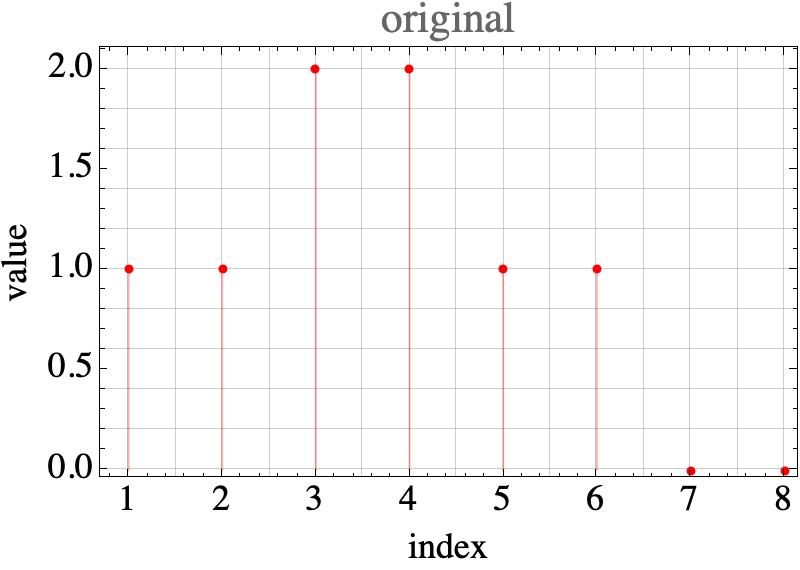

/*

# 離散フーリエ変換

離散フーリエ変換と逆離散フーリエ変換を端的に示すと次のようになる．
結果は，Mathematicaの`Fourier`関数，`InverseFourier`関数の`FourierParameters`オプションが，`{-1,-1}`の場合と一致する．

```Mathematica
MyFourier[list_, n_] := With[{len = Length[list]}, Sum[list[[k + 1]]*Exp[-I*n*2 \[Pi]/len*k], {k, 0, len - 1}]/len];
MyInverseFourier[list_, n_] := With[{len = Length[list]}, Sum[list[[k + 1]]*Exp[I*n*2 \[Pi]/len*k], {k, 0, len - 1}]];

(*離散データ*)
u = N@{1, 2, 3, 4, 5, 4, 3, 2, 1};

Grid[
 Transpose@{cn = Table[MyFourier[u, n], {n, 0, Length[u] - 1}],
   Fourier[u, FourierParameters -> {-1, -1}]}
 , Frame -> All]

Grid[
 Transpose@{Table[MyInverseFourier[cn, n], {n, 0, Length[cn] - 1}],
   InverseFourier[cn, FourierParameters -> {-1, -1}]}
 , Frame -> All]
```

## 複素フーリエ級数展開

```math
f(t) = \sum_{n=-\infty}^{\infty} c_n \exp(i n \omega^\ast t), \quad c_n = \frac{1}{T^\ast} \int_{-\frac{T^\ast}{2}}^{\frac{T^\ast}{2}} f(t) \exp(-i n \omega^\ast t) \, dt, \quad \omega^\ast = \frac{2\pi}{T^\ast}
```

$`\exp({i \theta}) = \cos \theta + i \sin \theta`$なので，
フーリエ係数の実部には，$`\cos \theta`$の係数が，虚部には，$`\sin \theta`$の係数が含まれる．

$`c_n=\frac{a_n - i \mathrm{sgn}(n) b_n}{2}`$

## 離散フーリエ変換（インデックス周期$`N`$のフーリエ変換）

$`N`$個の離散データ`{1, 1, 2, 2, 1, 1, 0, 0}`があるとする．
これが，周期的に繰り返すとする．

```cpp
{1, 1, 2, 2, 1, 1, 0, 0},{1, 1, 2, 2, 1, 1, 0, 0},{1, 1, 2, 2, 1, 1, 0, 0},...
```

与えられたデータは離散的だが，
これを連続で周期的な関数$`f(t)`$として表したい．
また，データインデックス上では，対応する与えられたデータ値と一致させたい．
つまり，$`i=2`$を関数に与えたら，2を返してほしい．これはいわば補間のようなものである．
複素フーリエ級数展開によって，この願いを叶えるためには，
$`c_0,...,c_{N-1}`$の$`N`$コの係数があればよい．

```math
f(t) = \sum_{n=0}^{N-1} c_n \exp(i n \omega^\ast t), \quad c_n = \int_{0}^{T^\ast} f(t) \exp(-i n \omega^\ast t) \, dt, \quad \omega^\ast = \frac{2\pi}{T^\ast}
```

ここでの添字の振り方は，初めのデータを$`0`$番として数えることにする．
そう数えると周期性を仮定したので，$`N`$番目のデータは$`0`$番目のデータと等しいことになる．
この無限に続く数字をフーリエ級数で表現すると，
$`0`$番目と$`N`$番目のデータは，級数を構成する三角関数の$`0`$と$`2\pi`$に対応している．
dataとindex，angle，periodの対応は次のようなイメージである．

```cpp
data  : {1, 1, 2, ...,                               0, 0}, {1, 1, ...
index : {0, 1, 2, ...,                           N-2, N-1}, {N, N+1, ...
angle : {0, 2pi/N, 2pi*2/N, ..., 2pi*(N-2)/N, 2pi*(N-1)/N}, {2pi, 2pi*(N+1)/N, ...
period: {0,   T/N,    2T/N, ...,   T*(N-2)/N,   T*(N-1)/N}, {T,     T*(N+1)/N, ...
```

複素フーリエ係数$`c_n`$を台形則で数値積分すると，

```math
\begin{align}
c_n &= \frac{1}{T^\ast} \left[ \frac{g_n(0) + g_n(N\delta t)}{2} + \sum_{k=1}^{N-1} g_n(k \delta t) \right] \delta t, \quad \delta t = \frac{T^\ast}{N}, \quad g_n(0) = g_n(N\delta t),\quad g_n(t) = f(t) \exp(-i n \omega^\ast t)\\
&= \frac{1}{N} \sum_{k=0}^{N-1} g_n(k \delta t) {\quad\text{became simple additions}}\\
&= \frac{1}{N} \sum_{k=0}^{N-1} \left[ f\left(k\frac{T^\ast}{N}\right) \exp\left( -i n \frac{2 \pi}{T^\ast} k \frac{T^\ast}{N} \right) \right]\\
&= \frac{1}{N} \sum_{k=0}^{N-1} \left[ f_k \exp\left( -i n \frac{2 \pi}{N} k \right) \right], \quad f_k = f\left(k\frac{T^\ast}{N}\right)
\end{align}
```

これからわかるように，$`c_n`$は周期$`T^\ast`$に依存しておらず，データの数$`N`$に依存している．
（$`f(kT^\ast/N)`$は，$`T^\ast`$によらず常に$`k`$番目データ値`data[k]`を指しているので，$`T^\ast`$に依存していない）
離散フーリエ係数は，周期とは無関係なのである．

$`c_n`$が大きさを表す波の周波数は，数式から$`n/T^\ast`$であるとわかる．

最後の式は，連続した関数のフーリエ係数を抽出するための式と照らし合わせると，
$`T^\ast`$を$`N`$と置き換えた形になっている．
時間軸ではなく，インデックス軸で積分しているようなものである．

$`c_n`$は，$`c_n=c_{n+N}`$であり$`n`$に関して周期$`N`$の周期関数となっている．
ただし，実部は偶関数で，虚部は奇関数である．
なので，$`c_n=c_{-n}`$ではなく，$`c_n=\overline{c_{-n}}`$である．
ただし，これは複素フーリエ変換の定義そのものの性質である．

```math
c_n = \frac{a_0}{2}, \quad c_n = \frac{a_n - i b_n}{2}, \quad c_{-n} = \frac{a_n + i b_n}{2}, \quad c_{-n} = \overline{c_n}
```

なので，$`c_n`$を求めるさい，$`n=N/2`$より大きいインデックスの係数の計算は省略できる．

---

Mathematicaの組み込み関数と比較して確かめてみる．
Mathematicaの`Fourier`関数の`FourierParameters`オプションが，`{-1,-1}`の場合に上記の式と一致する．
`MyFourier`は全く同じ結果を返す．

```Mathematica
(*example0.nb*)
list = {1., 1., 2., 2., 1., 1., 0., 0.};
MyFourier[list_, n_] := With[{len = Length[list]}, Sum[list[[k + 1]]*Exp[-I*n*2. \[Pi]/len*k], {k, 0, len - 1}]/len];
Column[Fourier[list, FourierParameters -> {-1, -1}], Frame -> All]
Column[cn = Table[MyFourier[list, n], {n, 0, Length[list] - 1}], Frame -> All]
```

c++での`MyFourier`と同じ関数を作って実行してみる．実行方法：

```cpp
sh clean
cmake -DCMAKE_BUILD_TYPE=Release ../ -DSOURCE_FILE=example0_simple.cpp
./example0_simple
```

結果は，Matheamticaと同じになる．

| list | 元データ| 離散フーリエ変換 |
|:---:|:---:|:---:|
| random list |  |  |
| cos wave |  |  |
| square wave |  |  |
| triangle wave |  |  |


## 逆離散フーリエ変換

フーリエ係数$`c_n`$から元の関数$`f_\kappa=f(t=\kappa \delta t)`$を復元することを考える．
三角関数を掛けて積分することで係数を抽出できたので，その方法で関数を抽出する．

フーリエ変換は次のように定義している．

```math
c_n = \frac{1}{N} \sum_{k=0}^{N-1} \left[ f_k \exp\left( -i n \frac{2 \pi}{N} k \right) \right]
```

$`\exp\left( -i n \frac{2 \pi}{N} k \right)`$ではなく，$`\exp\left( i n \frac{2 \pi}{N} \kappa \right)`$を掛けて積分する．ここで，$`k`$と区別するために$`\kappa`$を使っている．

```math
\begin{equation}
\begin{aligned}
\sum_{n=0}^{N-1}{c_n} \exp\left( i n \frac{2 \pi}{N} \kappa \right)&=\sum_{n=0}^{N-1}{\frac{1}{N} \sum_{k=0}^{N-1} \left[ f_k \exp\left( -i n \frac{2 \pi}{N} k \right) \right]
} \exp\left( i n \frac{2 \pi}{N} \kappa \right)\\
&=\sum_{n=0}^{N-1}{\frac{1}{N} \sum_{k=0}^{N-1} \left[ f_k \exp\left( -i n \frac{2 \pi}{N} k \right) \right]
} \exp\left( i n \frac{2 \pi}{N} \kappa \right)\\
&=\sum_{n=0}^{N-1}{\frac{1}{N} f_\kappa} \\
&=f_\kappa\\
&=f\left(\kappa\frac{T^\ast}{N}=\kappa\delta t\right)
\end{aligned}
\end{equation}
```

このように，フーリエ係数を使って元の関数を復元できる．下の値を取り出すために$`N`$で割る必要はない．

```Mathematica
list = {1., 1., 2., 2., 1., 1., 0., 0.};
MyInverseFourier[list_, n_] := With[{len = Length[list]}, Sum[list[[k + 1]]*Exp[I*n*2 \[Pi]/len*k], {k, 0, len - 1}]];
Column[InverseFourier[cn, FourierParameters -> {-1, -1}], Frame -> All]
Column[Table[MyInverseFourier[cn, n], {n, 0, Length[list] - 1}],
 Frame -> All]
 ```

## 離散フーリエ変換によるデータの補間

| list | 逆フーリエ変換 | フーリエ級数展開 |
|:---:|:---:|:---:|
| random list |  |  |
| cos wave |  |  |
| square wave |  |  |
| triangle wave |  |  |

*/

