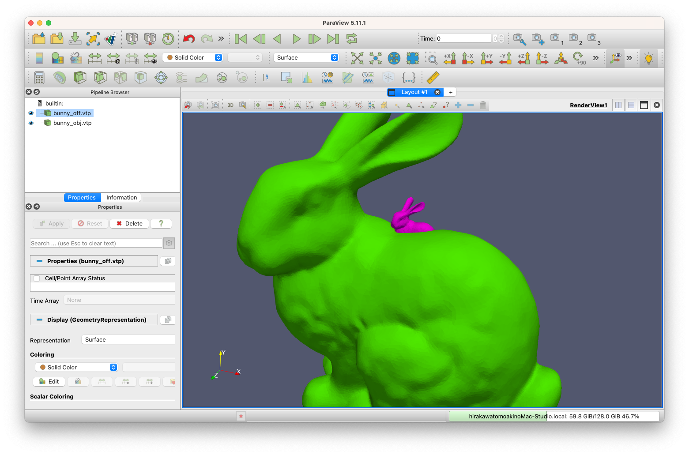

# Contents
- [🐋 `Network`](#🐋-`Network`)
    - [⛵ 点・線・面の接続関係とその整理](#⛵-点・線・面の接続関係とその整理)
    - [⛵ 3Dファイルの読み込みと出力](#⛵-3Dファイルの読み込みと出力)
        - [🪼 読み込み `Network`](#🪼-読み込み-`Network`)
        - [🪼 出力 `vtkPolygonWrite`](#🪼-出力-`vtkPolygonWrite`)
            - [🪸 面の出力](#🪸-面の出力)
            - [🪸 線の出力](#🪸-線の出力)
            - [🪸 実行方法](#🪸-実行方法)
        - [🪼 `PVDWriter`を使ったpvdファイルの作成方法](#🪼-`PVDWriter`を使ったpvdファイルの作成方法)
    - [⛵ ２次補間](#⛵-２次補間)
- [🐋 空間分割（space_partitioning）](#🐋-空間分割（space_partitioning）)
    - [⛵ 等間隔のシンプルな空間分割](#⛵-等間隔のシンプルな空間分割)
        - [🪼 例](#🪼-例)
    - [⛵ ⛵ `Bucket`クラス](#⛵-⛵-`Bucket`クラス)
        - [🪼 🪼 メンバ変数](#🪼-🪼-メンバ変数)
        - [🪼 🪼 メソッド](#🪼-🪼-メソッド)
            - [🪸 🪸 初期化関連](#🪸-🪸-初期化関連)
            - [🪸 🪸 インデックス変換¸](#🪸-🪸-インデックス変換¸)
            - [🪸 🪸 データ追加・削除](#🪸-🪸-データ追加・削除)
            - [🪸 🪸 その他](#🪸-🪸-その他)
    - [⛵ 階層のある空間分割（木構造）](#⛵-階層のある空間分割（木構造）)
    - [⛵ 空間分割の応用例：オブジェクトの接触や交差の判定](#⛵-空間分割の応用例：オブジェクトの接触や交差の判定)
        - [🪼 線分と面の交差判定](#🪼-線分と面の交差判定)
        - [🪼 面と面の接触判定](#🪼-面と面の接触判定)
            - [🪸 ２面の最短距離](#🪸-２面の最短距離)
- [🐋 vtk, vtp, vtu](#🐋-vtk,-vtp,-vtu)
- [🐋 四面体の生成](#🐋-四面体の生成)
    - [⛵ 四面体の生成（制約付き四面分割 constrained tetrahedralization）](#⛵-四面体の生成（制約付き四面分割-constrained-tetrahedralization）)
    - [⛵ スコアリングと選択](#⛵-スコアリングと選択)
- [🐋 CGALを使って四面体を生成する 9_9_CGAL](#🐋-CGALを使って四面体を生成する-9_9_CGAL)
    - [⛵ CGALを使って四面体を生成する](#⛵-CGALを使って四面体を生成する)
    - [⛵ CGALを使って四面体を生成する](#⛵-CGALを使って四面体を生成する)
    - [⛵ CGALを使って四面体を生成し，さらに細分化する](#⛵-CGALを使って四面体を生成し，さらに細分化する)


---
# 🐋 `Network` 

数値シミュレーションの多くは，三角形や四面体の３Dメッシュを利用して行われる．
単純に配列にメッシュ情報を格納していては，シミュレーションの質を高めるための工夫を加えることが難しいと思われる．
例えば，ある節点に隣接する節点や辺や要素を取得するのは，配列に格納しているだけでは効率的に行うことができない．
`Network`クラスは，節点や辺や面の接続関係を保持し，接続関係から相互にアクセスできるようにするためのクラスである．
また，メッシュを細分化することもできる．
また，一度作成した`Network`クラスのオブジェクトから，`vtk`ファイルや`obj`ファイルなどを出力することができる．

* データの読み込みと出力
* 節点や辺や面の相互アクセス
* メッシュの細分化

## ⛵ 点・線・面の接続関係とその整理 

1. `networkFace->Lines`を設定
2. `networkFace->setPoints()`は，`networkFace->Lines`が設定されていることを前提として，`networkFace->Points`と`networkFace->PLPLPL`を設定する．
3. `Network::setGeometricProperties()`は，`f->setGeometricProperties(ToX(f->setPoints()))`を実行している．

## ⛵ 3Dファイルの読み込みと出力 

### 🪼 読み込み `Network` 

[Networkのコンストラクタ](../../include/Network.hpp#L4111)では，引数として，**OFFファイル**または**OBJファイル**をあたえることができる．
`Load3DFile`クラスを使ってデータを読み込み，`Network`クラスを作成する．

```cpp
auto obj = new Network("./bunny.obj");//ファイルからNetworkオブジェクトを作成
```

### 🪼 出力 `vtkPolygonWrite` 

`Network`クラスは，`getFaces`メンバ関数を使って簡単に面の情報を取得できる．

`vtkPolygonWrite`を使うと，`Network`クラスの面の情報を，`vtp`ファイルとして出力できる．
`vtkPolygonWrite`には，`ofstream`と，`std::vector<networkFace*>`や`std::vector<networkLine*>`などを渡し，出力できる．

#### 🪸 面の出力 

```cpp
auto obj = new Network("./bunny.obj");
std::ofstream ofs("./bunny_obj.vtp");
vtkPolygonWrite(ofs, obj->getFaces());
```



#### 🪸 線の出力 

```cpp
auto obj = new Network("./bunny.obj");
std::ofstream ofs("./bunny_obj.vtp");
vtkPolygonWrite(ofs, obj->getEdges());
```

#### 🪸 実行方法 

```shell
cmake -DCMAKE_BUILD_TYPE=Release ../ -DSOURCE_FILE=example0_load_3d_file.cpp
make
./example0_load_3d_file
```

[./example0_load_3d_file.cpp#L1](./example0_load_3d_file.cpp#L1)

---
### 🪼 `PVDWriter`を使ったpvdファイルの作成方法 

pvdファイルは，ファイルと時間をセットにしてまとめ，paraview上で，3Dファイルのアニメーションを再生するためのファイル．

```cpp
PVDWriter pvd("./bunny_obj.pvd");//出力するpvdファイル名を指定しクラスを作成
pvd.push(filename, time);//`filename`には，`vtp`ファイルなどの3Dファイル名を，`time`には，そのファイルの時間を指定
pvd.output();//最後にpvdファイルを出力
```

| 面のアニメーション | 線のアニメーション |
|:---------------:|:---------------:|
|  |  |

💡 QuickTimeで作成したmovファイルをgifに変換するには，次のようにする．

```sh
ffmpeg -i line.mov -filter_complex "[0:v] fps=30, scale=iw*0.5:ih*0.5 [v]" -map "[v]" sample_line.gif
```

[./example0_load_3d_file.cpp#L91](./example0_load_3d_file.cpp#L91)

---
## ⛵ ２次補間 

```shell
sh clean
cmake -DCMAKE_BUILD_TYPE=Release ../ -DSOURCE_FILE=example0_quadratic_interpolation.cpp
make
./example0_quadratic_interpolation
```

[./example0_quadratic_interpolation.cpp#L1](./example0_quadratic_interpolation.cpp#L1)

---
# 🐋 空間分割（space_partitioning） 

## ⛵ 等間隔のシンプルな空間分割 

```shell
cmake -DCMAKE_BUILD_TYPE=Release ../ -DSOURCE_FILE=example1_space_partitioning.cpp
make
./example1_space_partitioning
```

<!-- Key coordinatebounds not found -->

<!-- Key space_partitioning not found -->

### 🪼 例 

この例では，うさぎの３Dモデルを空間分割する．
配列させたバケット内に，うさぎの点または面が含まれるかを判定し，バケットに保存する．

ただ，面は広がりがあるので，複数のバケットに含まれることがある．
面と交わる全バケットを簡単に確実に見つける方法は，現在のところ思いつかない．
なので，今の所は，面を無数の点に分けて，各点を含むバケットに面を保存することで対応している．


## ⛵ ⛵ `Bucket`クラス  

`Bucket`クラスは，オブジェクトを３次元空間内に配置し，効率的に検索できるようにするための「バケツ（Bucket）」構造を提供します．

⚠️ テンプレート型`T`のオブジェクトは，予め`getX()`を使ってxyz座標を取得できるようにしておく必要がある．

### 🪼 🪼 メンバ変数  

| 変数名                | 説明                                              |
|:---------------------:|:-------------------------------------------------:|
| `xbounds`, `ybounds`, `zbounds` | X,Y,Z 座標の境界値．`Tdd` 型                   |
| `xsize`, `ysize`, `zsize` | 各座標のサイズ．`ST` 型                          |
| `bounds`              | 全体のバウンド．`T3Tdd` 型                        |
| `center`              | 空間の中心座標．`Tddd` 型                          |
| `dn`                  | 各座標のサイズ（ST3 型）                           |
| `data`             | バケツ（3D配列）                                  |
| `data_vector`      | バケツのベクター版                                 |
| `data_bool`        | バケツが空であるかどうかを示すbool値の3D配列       |
| `vector_is_set`       | ベクター版が設定されているか                       |
| `all_stored_objects`  | 保存されている全てのオブジェクト                   |
| `map_to_ijk`          | オブジェクトからインデックスへのマッピング         |
| `dL`                  | バケツの１辺の長さ                                 |

### 🪼 🪼 メソッド  

#### 🪸 🪸 初期化関連  

- `initialize(const T3Tdd &boundingboxIN, const double dL_IN)`: バケツを初期化する．
œa
#### 🪸 🪸 インデックス変換¸  

- `itox(const ST i, const ST j, const ST k) const`: インデックスから座標へ変換．
- `indices(const Tddd &x) const`: 座標からインデックスへ変換．

#### 🪸 🪸 データ追加・削除  

- `add(const Tddd &x, const T p)`: オブジェクトを追加．
- `erase(T const p)`: オブジェクトを削除．

#### 🪸 🪸 その他  

`apply(const Tddd &x, const double d, const std::function<bool(const T &)> &func)`は，バケツの範囲を指定して，その範囲内のオブジェクトに対して関数を適用する．
これと似た関数として，

* `any_of`
* `all_of`
* `none_of`

があり，それぞれ，バケツの範囲内のオブジェクトに対して，関数を適用し，その結果が，それぞれ，`true`，`false`，`false`であれば，`true`を返す．

📝 これらの関数は，`apply`はある点を中心として半径`d`の球状の範囲を指定することができる．これは球状の範囲を指定していることになる．このような範囲指定以外に，直線上の範囲指定や，平面上の範囲指定などもできるようにしたい．
そのためには，バケツのセルと，線分や平面の交差判定を高速に行う関数が必要になる．
ラフに行っても問題ない．
線に関しては細かい分割によってインデックス変換できる．
平面に関しては，平面の方程式を使って，バケツのセルとの交差判定を行う．
[../../include/lib_spatial_partitioning.hpp#L6](../../include/lib_spatial_partitioning.hpp#L6)

[./example1_space_partitioning.cpp#L6](./example1_space_partitioning.cpp#L6)

---
## ⛵ 階層のある空間分割（木構造） 

シンプルな空間分割クラスを拡張し，木構造による空間分割を試みる．

`has_tree`が`true`の場合，`buckets`には`Bucket`クラスのポインタが格納される．
`buckets[i][j][k]`には，上のレベルの`data[i][j][k]`のデータが引き継がれている．
つまり，`buckets[i][j][k]`は，`data[i][j][k]`のデータをさらに分割したものである．
デフォルトでは，`buckets[i][j][k]`は内部に８つの`data`を持つ:

`data[0][0][0]`，`data[0][0][1]`，`data[0][1][0]`，`data[0][1][1]`，`data[1][0][0]`，`data[1][0][1]`，`data[1][1][0]`，`data[1][1][1]`．

[このツリー生成方法](../../include/lib_spatial_partitioning.hpp#L87)は，
バウンディングボックスを範囲と，それを分割する幅を指定する．
分割数を指定するよりも，この方法のように分割幅を指定する方が，自分はわかりやすい．

```cpp
buckets[i][j][k] = std::make_shared<Buckets<T>>(bounds, this->dL * 0.5 + 1e-10);
```


レベル０が生成したレベル１のバケットに保存された点を示しており，
白い線は，１階層上のレベル０のバケットの境界を示している．

[./example2_tree.cpp#L2](./example2_tree.cpp#L2)

---
## ⛵ 空間分割の応用例：オブジェクトの接触や交差の判定 

### 🪼 線分と面の交差判定 

`Network`クラスは，`makeBucketPoints`でバケツ`BucketPoints`を準備し，内部に保存している点をバケツに保存する．
同様に，`makeBucketFaces`でバケツを`BucketFaces`を準備し，内部に保存している面をバケツに保存する．

要素の接触や交差の判定には，[`IntersectQ`](../../include/basic_geometry.hpp#L1693)関数を使う．
また，接触判定の高速化のために，空間分割を使う．

```shell
cmake -DCMAKE_BUILD_TYPE=Release ../ -DSOURCE_FILE=example3_line_face_interaction.cpp
make
./example3_line_face_interaction
```

<gif src="./example3/anim_faster.gif" width="500px">

[./example3_line_face_interaction.cpp#L4](./example3_line_face_interaction.cpp#L4)

---
### 🪼 面と面の接触判定 

[`IntersectQ`](../../include/basic_geometry.hpp#L1693)関数は，交差判定には使えるが，接触判定には使えない．

**オブジェクト同士の接触**をプログラム上で定義するなら，
２面の最短距離が，ある閾値以下にある，とするのが自然な定義だろう．

#### 🪸 ２面の最短距離 

２つのポリゴン面上において最短距離にある２点の片方はある三角形の頂点である．
ただし，三角形が曲面を成している場合は違う．
これには，$N _{vertex}*M _{triangle} + M _{vertex}*N _{triangle}$の計算量がかかり，
また，この一つひとつの計算において，[Nearest](../../include/basic_geometry.hpp#L1633)のような計算を行う．
この計算は，空間分割を使って，調べる面の数を減らせば，多くの場合，実用上問題とはならない時間内で終わる．


もう一つの方法は，よりナイーブな方法で，

```shell
sh clean
cmake -DCMAKE_BUILD_TYPE=Release ../ -DSOURCE_FILE=example4_point2face.cpp
make
./example4_point2face
```


[./example4_point2face.cpp#L4](./example4_point2face.cpp#L4)

---
# 🐋 vtk, vtp, vtu 

* VTK (Visualization Toolkit)
VTKは，3次元データを可視化するためのライブラリでフォーマットという意味ではない．
* VTU (VTK Unstructured Grid Format)
VTUは，内部構造や体積データの解析の場合に適している．体積のある非構造格子データを扱う際はこれを使う．
* VTP (VTK PolyData Format)
VTPは，表面のみの表示や表面の特性に焦点を当てる場合に適している．


以下は，どちらも四面体を表現している．

VTUフォーマット：

```xml
<?xml version="1.0"?>
<VTKFile type="UnstructuredGrid" version="0.1" byte_order="LittleEndian">
<UnstructuredGrid>
<Piece NumberOfPoints="4" NumberOfCells="1">
<Points>
<DataArray type="Float32" NumberOfComponents="3" format="ascii">
0.157726 -0.00244936 -0.15 0.140393 -0.05 -0.15 0.123855 -0.0239571 -0.15
0.162817 -0.05 -0.2
</DataArray>
</Points>
<Cells>
<DataArray type="Int32" Name="connectivity" format="ascii">
0 1 2 3
</DataArray>
<DataArray type="Int32" Name="offsets" format="ascii">
4
</DataArray>
<DataArray type="UInt8" Name="types" format="ascii">
10
</DataArray>
</Cells>
</Piece>
</UnstructuredGrid>
</VTKFile>

```

VTPフォーマット：

```xml
<?xml version="1.0"?>
<VTKFile type="PolyData" version="0.1" byte_order="LittleEndian">
<PolyData>
<Piece NumberOfLines="0" NumberOfPoints="4" NumberOfPolys="4" NumberOfStrips="0"
NumberOfVerts="0">
<Points>
<DataArray NumberOfComponents="3" format="ascii" type="Float32">
0.157726 -0.00244936 -0.15 0.140393 -0.05 -0.15 0.123855 -0.0239571 -0.15
0.162817 -0.05 -0.2
</DataArray>
</Points>
<PointData>
</PointData>
<CellData Normals="cell_normals" Scalars="cell_scalars">
</CellData>
<Polys>
<DataArray Name="connectivity" format="ascii" type="Int32">
2 3 1 0 3 2 0 1 3 0 2 1
</DataArray>
<DataArray Name="offsets" format="ascii" type="Int32">
3 6 9 12
</DataArray>
</Polys>
<Lines>
<DataArray Name="connectivity" format="ascii" type="Int32">

</DataArray>
<DataArray Name="offsets" format="ascii" type="Int32">

</DataArray>
</Lines>
</Piece>
</PolyData>
</VTKFile>
```

[./example2_generate_tetra_constrained2.cpp#L296](./example2_generate_tetra_constrained2.cpp#L296)

---
# 🐋 四面体の生成 

## ⛵ 四面体の生成（制約付き四面分割 constrained tetrahedralization） 

* PLC: piecewise linear complex
* CDT: constrained Delaunay triangulation

CDTの生成法には，主に２つの方法がある\ref{Schewchuk2002}：

* naive gift wrapping algorithm (これはadvancing front algorithmとも呼ばれるものと同じだろう)
* sweep algorithm

[杉原厚吉,計算幾何学](杉原厚吉,計算幾何学)によれば，ドロネー四面体分割以外に，綺麗な四面体分割を作成する方法はほとんど知られていないらしい．
四面体分割は，三角分割の場合のように，最小内角最大性が成り立たたず，スリーバー（sliver）と呼ばれる，外接円が大きくないものの潰れた悪い四面体が作られる可能性がある．
このスリーバーをうまく削除することが重要となる．

```shell
sh clean
cmake -DCMAKE_BUILD_TYPE=Release ../ -DSOURCE_FILE=example2_generate_tetra_constrained2.cpp
make
```

`bunny.obj`のような複雑なポリゴンには，この方法ではうまくいかない．

[./example2_generate_tetra_constrained2.cpp#L1](./example2_generate_tetra_constrained2.cpp#L1)

## ⛵ スコアリングと選択 

四面体の外接球の中心に点が近いほどスコアは低くなる．

外接球の半径が小さすぎる場合は四面体の候補から外す．

[./example2_generate_tetra_constrained2.cpp#L161](./example2_generate_tetra_constrained2.cpp#L161)

---
# 🐋 CGALを使って四面体を生成する 9_9_CGAL 

⚠️ コンパイルできない

## ⛵ CGALを使って四面体を生成する 

```shell
brew install gmp mpfr
brew install CGAL
```

```shell
sh clean
cmake -DCMAKE_BUILD_TYPE=Release ../ -DSOURCE_FILE=example1_generate_tetra_using_CGAL.cpp
make
```

[./example1_generate_tetra_using_CGAL.cpp#L2](./example1_generate_tetra_using_CGAL.cpp#L2)

## ⛵ CGALを使って四面体を生成する 

⚠️ コンパイルできない

```shell
sh clean
cmake -DCMAKE_BUILD_TYPE=Release ../ -DSOURCE_FILE=example1_generate_tetra_using_CGAL_constrained.cpp
make
```

`CGAL::Mesh_polyhedron_3<K>::type` is typically a typedef for a polyhedron data structure that is compatible with CGAL's mesh generation algorithms.
`CGAL::Polyhedron_3<K>` is a standard CGAL polyhedron class.

[./example1_generate_tetra_using_CGAL_constrained.cpp#L1](./example1_generate_tetra_using_CGAL_constrained.cpp#L1)

## ⛵ CGALを使って四面体を生成し，さらに細分化する 

⚠️ コンパイルできない

```shell
brew install CGAL
```

```shell
sh clean
cmake -DCMAKE_BUILD_TYPE=Release ../ -DSOURCE_FILE=example1_generate_tetra_using_CGAL_refining.cpp
make
```

[./example1_generate_tetra_using_CGAL_refining.cpp#L1](./example1_generate_tetra_using_CGAL_refining.cpp#L1)

---
