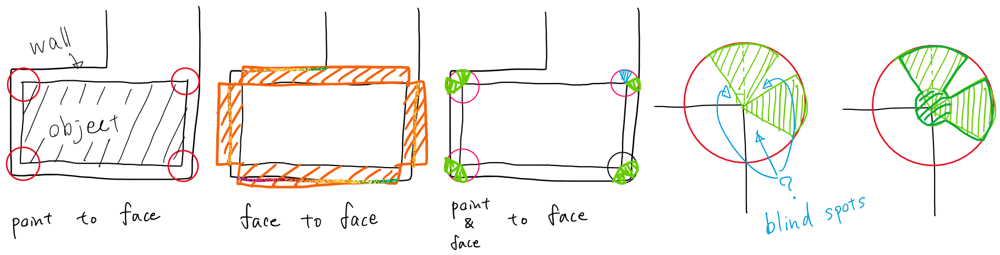

# Contents
- [🐋 `Network`](#-network)
    - [⛵ 点・線・面の接続関係とその整理](#-点線面の接続関係とその整理)
    - [⛵ 3Dファイルの読み込みと出力](#-3dファイルの読み込みと出力)
        - [🪼 読み込み `Network`](#-読み込み-network)
        - [🪼 出力 `vtkPolygonWrite`，`vtkUnstructuredGridWrite`](#-出力-vtkpolygonwritevtkunstructuredgridwrite)
            - [🪸 面の出力](#-面の出力)
            - [🪸 線の出力](#-線の出力)
            - [🪸 点の出力](#-点の出力)
            - [🪸 四面体の出力](#-四面体の出力)
            - [🪸 実行方法](#-実行方法)
        - [🪼 `PVDWriter`を使ったpvdファイルの作成方法](#-pvdwriterを使ったpvdファイルの作成方法)
    - [⛵ 四面体の操作](#-四面体の操作)
    - [⛵ 四面体の操作](#-四面体の操作)
    - [⛵ ２次補間](#-２次補間)
- [🐋 空間分割（space_partitioning）](#-空間分割space_partitioning)
    - [⛵ 等間隔のシンプルな空間分割](#-等間隔のシンプルな空間分割)
        - [🪼 例](#-例)
    - [⛵ ⛵ `Bucket`クラス](#--bucketクラス)
        - [🪼 🪼 メンバ変数](#--メンバ変数)
        - [🪼 🪼 メソッド](#--メソッド)
            - [🪸 🪸 初期化関連](#--初期化関連)
            - [🪸 🪸 インデックス変換](#--インデックス変換)
            - [🪸 🪸 データ追加・削除](#--データ追加削除)
            - [🪸 🪸 データ取得](#--データ取得)
            - [🪸 🪸 範囲指定検索](#--範囲指定検索)
        - [🪼 🪼 TODO](#--todo)
    - [⛵ 階層のある空間分割（木構造）](#-階層のある空間分割木構造)
    - [⛵ 空間分割の応用例：オブジェクトの接触や交差の判定](#-空間分割の応用例オブジェクトの接触や交差の判定)
        - [🪼 線分と面の交差判定](#-線分と面の交差判定)
        - [🪼 点から面までの最短ベクトル `Nearest`](#-点から面までの最短ベクトル-nearest)
        - [🪼 面と面の接触判定（面と面の最短距離の計算）](#-面と面の接触判定面と面の最短距離の計算)
            - [🪸 接触判定の条件の制限](#-接触判定の条件の制限)
- [🐋 vtk, vtp, vtu](#-vtk-vtp-vtu)
- [🐋 四面体の生成](#-四面体の生成)
    - [⛵ TetGenを使った四面体を生成](#-tetgenを使った四面体を生成)
- [🐋 Set  the minimum  required version  of cmake  for a  project.](#-set--the-minimum--required-version--of-cmake--for-a--project)
- [🐋 Find C++ compiler](#-find-c-compiler)
- [🐋 Add an executable to the project using the specified source files.](#-add-an-executable-to-the-project-using-the-specified-source-files)
- [🐋 In Linux/Unix, it will creates the libtet.a](#-in-linuxunix-it-will-creates-the-libteta)
        - [🪼 `tetgenbehavior`クラス](#-tetgenbehaviorクラス)
    - [⛵ 四面体の生成（制約付き四面分割 constrained tetrahedralization）](#-四面体の生成制約付き四面分割-constrained-tetrahedralization)
    - [⛵ スコアリングと選択](#-スコアリングと選択)
- [🐋 CGALを使って四面体を生成する 9_9_CGAL](#-cgalを使って四面体を生成する-9_9_cgal)
    - [⛵ CGALを使って四面体を生成する](#-cgalを使って四面体を生成する)
    - [⛵ CGALを使って四面体を生成する](#-cgalを使って四面体を生成する)
    - [⛵ CGALを使って四面体を生成し，さらに細分化する](#-cgalを使って四面体を生成しさらに細分化する)


---
# 🐋 `Network` 

節点に隣接する節点や辺や要素の情報を効率的に取得するためには，接続関係を管理し続ける必要がある．`Network`クラスは，接続関係の情報を保持し，その情報をもとに相互にアクセスするための機能を提供する．

* 節点や辺や面の相互アクセス
* メッシュの細分化
* `obj`や`off`オブジェクトデータの読み込みと出力

## ⛵ 点・線・面の接続関係とその整理 

1. `networkFace->Lines`を設定
2. `networkFace->setPoints()`は，`networkFace->Lines`が設定されていることを前提として，`networkFace->Points`と`networkFace->PLPLPL`を設定する．
3. `Network::setGeometricProperties()`は，`f->setGeometricProperties(ToX(f->setPoints()))`を実行している．

## ⛵ 3Dファイルの読み込みと出力 

### 🪼 読み込み `Network` 

[Network::constructor](../../include/Network.hpp#L3552)では，引数として，**OFFファイル**または**OBJファイル**をあたえることができる．
`Load3DFile`クラスを使ってデータを読み込み，`Network`クラスを作成している．

```cpp
auto obj = new Network("./bunny.obj");//ファイルからNetworkオブジェクトを作成
```

### 🪼 出力 `vtkPolygonWrite`，`vtkUnstructuredGridWrite` 

`Network`クラスは，`getFaces`メンバ関数を使って簡単に面の情報を取得できる．

`vtkPolygonWrite`を使うと，`Network`クラスの面の情報を，`vtp`ファイルとして出力できる．
`vtkPolygonWrite`には，`ofstream`と，`std::vector<networkFace*>`や`std::vector<networkLine*>`などを渡し，出力できる．

#### 🪸 面の出力 

面や線や点の情報を出力する場合は，`vtkPolygonWrite`を使う．

```cpp
auto obj = new Network("./bunny.obj");
std::ofstream ofs("./bunny_obj.vtp");
vtkPolygonWrite(ofs, obj->getFaces());
ofs.close();
```

#### 🪸 線の出力 

```cpp
auto obj = new Network("./bunny.obj");
std::ofstream ofs("./bunny_obj.vtp");
vtkPolygonWrite(ofs, obj->getEdges());
ofs.close();
```

#### 🪸 点の出力 

```cpp
auto obj = new Network("./bunny.obj");
std::ofstream ofs("./bunny_obj.vtp");
vtkPolygonWrite(ofs, obj->getPoints());
ofs.close();
```

#### 🪸 四面体の出力 

四面体のような内部構造を持つデータを出力する場合は，`vtkUnstructuredGridWrite`を使う．

```cpp
auto obj = new Network("./input/bunny.off");
obj->tetrahedralize();
auto data1 = std::unordered_map<networkPoint*, std::variant<double, Tddd>>();
auto data2 = std::unordered_map<networkPoint*, std::variant<double, Tddd>>();
auto data3 = std::unordered_map<networkPoint*, std::variant<double, Tddd>>();
for (const auto& p : obj->getPoints()) {
data1[p] = p->X[0];
data2[p] = p->X;
data3[p] = (double)p->Tetras.size();
}
std::vector<std::tuple<std::string, DataMap>> data = {{"x", data1}, {"xyz", data2}, {"tetra_size", data3}};
std::ofstream ofs("./outptut/tetras.vtu");
vtkUnstructuredGridWrite(ofs, obj->getTetras(), data);
ofs.close();
```

[add_data_default_name](./example0_load_3d_file.cpp#L239)，点に値を付与し，vtpとして出力することもできる．
また，[add_data_custom_name](./example0_load_3d_file.cpp#L269)を付けることもできる．

#### 🪸 実行方法 

```shell
sh clean
cmake -DCMAKE_BUILD_TYPE=Release ../ -DSOURCE_FILE=example0_load_3d_file.cpp
make
./example0_load_3d_file
```

[./example0_load_3d_file.cpp#L1](./example0_load_3d_file.cpp#L1)

---
### 🪼 `PVDWriter`を使ったpvdファイルの作成方法 

pvdファイルは，ファイルと時間をセットにしてまとめ，paraview上で，3Dファイルのアニメーションを再生するためのファイル．

```cpp
PVDWriter pvd("./bunny_obj.pvd");//出力するpvdファイル名を指定しクラスを作成
pvd.push(filename, time);//`filename`には，`vtp`ファイルなどの3Dファイル名を，`time`には，そのファイルの時間を指定
pvd.output();//最後にpvdファイルを出力
```

| 面のアニメーション | 線のアニメーション |
|:---------------:|:---------------:|
|  |  |

💡 QuickTimeで作成したmovファイルをgifに変換するには，次のようにする．

```sh
ffmpeg -i line.mov -filter_complex "[0:v] fps=30, scale=iw*0.5:ih*0.5 [v]" -map "[v]" sample_line.gif
```

[./example0_load_3d_file.cpp#L155](./example0_load_3d_file.cpp#L155)

---
## ⛵ 四面体の操作 

```shell
sh clean
cmake -DCMAKE_BUILD_TYPE=Release ../ -DSOURCE_FILE=example0_manipulation_tetrahedron.cpp
make
./example0_manipulation_tetrahedron
```

* [make_bucket_tetras](./example0_manipulation_tetrahedron.cpp#L83)，空間分割のためのバケットを作成し，四面体をバケットに登録する例
* [edge_flip](./example0_manipulation_tetrahedron.cpp#L104)，四面体を持つ表面のエッジフリップテストの例
* [test_insideQ](./example0_manipulation_tetrahedron.cpp#L139)，座標が四面体の内部か外部かの判定テストの例

[./example0_manipulation_tetrahedron.cpp#L1](./example0_manipulation_tetrahedron.cpp#L1)

## ⛵ 四面体の操作 


```shell
sh clean
cmake -DCMAKE_BUILD_TYPE=Release ../ -DSOURCE_FILE=example0_manipulation_tetrahedron_simple_simulation.cpp
make
./example0_manipulation_tetrahedron_simple_simulation
```

[./example0_manipulation_tetrahedron_simple_simulation.cpp#L1](./example0_manipulation_tetrahedron_simple_simulation.cpp#L1)

---
## ⛵ ２次補間 

```shell
sh clean
cmake -DCMAKE_BUILD_TYPE=Release ../ -DSOURCE_FILE=example0_quadratic_interpolation.cpp
make
./example0_quadratic_interpolation
```

[./example0_quadratic_interpolation.cpp#L1](./example0_quadratic_interpolation.cpp#L1)

---
# 🐋 空間分割（space_partitioning） 

## ⛵ 等間隔のシンプルな空間分割 

```shell
cmake -DCMAKE_BUILD_TYPE=Release ../ -DSOURCE_FILE=example1_space_partitioning.cpp
make
./example1_space_partitioning
```

<!-- Key coordinatebounds not found -->

<!-- Key space_partitioning not found -->

### 🪼 例 

この例では，うさぎの３Dモデルを空間分割する．
配列させたバケット内に，うさぎの点または面が含まれるかを判定し，バケットに保存する．

ただ，面は広がりがあるので，複数のバケットに含まれることがある．
面と交わる全バケットを簡単に確実に見つける方法は，現在のところ思いつかない．
なので，今の所は，面を無数の点に分けて，各点を含むバケットに面を保存することで対応している．


## ⛵ ⛵ `Bucket`クラス  

`Bucket`クラスは，オブジェクトを３次元空間内に配置し，効率的に検索できるようにするための「バケツ（Bucket）」構造を提供します．

⚠️ テンプレート型`T`のオブジェクトは，予め`getX()`を使ってxyz座標を取得できるようにしておく必要がある．

### 🪼 🪼 メンバ変数  

| 変数名                           | 説明                                          |
|:-------------------------------:|:--------------------------------------------:|
| `xbounds`, `ybounds`, `zbounds` | X,Y,Z 座標の境界値．`Tdd` 型                    |
| `xsize`, `ysize`, `zsize`       | 各座標のサイズ．`ST` 型                         |
| `bounds`                        | 全体のバウンド．`T3Tdd` 型                      |
| `center`                        | 空間の中心座標．`Tddd` 型                       |
| `dn`                            | 各座標のサイズ（ST3 型）                        |
| `data`                          | バケツ（3D配列）                               |
| `data_vector`                   | バケツのベクター版                              |
| `data_bool`                     | バケツが空であるかどうかを示すbool値の3D配列       |
| `vector_is_set`                 | ベクター版が設定されているか                     |
| `all_stored_objects`            | 保存されている全てのオブジェクト                  |
| `map_to_ijk`                    | オブジェクトからインデックスへのマッピング          |
| `dL`                            | バケツの１辺の長さ                              |

### 🪼 🪼 メソッド  

#### 🪸 🪸 初期化関連  

| メソッド | 説明 |
|:--------:|:-------------------------------------------------:|
| `initialize(const T3Tdd &boundingboxIN, const double dL_IN)` | バケツを初期化する． |

#### 🪸 🪸 インデックス変換  

| メソッド | 説明 |
|:--------:|:-------------------------------------------------:|
| `itox(const ST i, const ST j, const ST k) const` | インデックス `(i, j, k)` から座標 `(x, y, z)` へ変換． |
| `indices(const Tddd &x) const` | 座標 `x` からインデックス `(i, j, k)` へ変換． |

#### 🪸 🪸 データ追加・削除  

| メソッド | 説明 |
|:--------:|:-------------------------------------------------:|
| `add(const Tddd &x, const T p)` | オブジェクト `p` を座標 `x` に追加． |
| `erase(T const p)` | オブジェクト `p` を削除． |

#### 🪸 🪸 データ取得  

| メソッド | 説明 |
|:--------:|:-------------------------------------------------:|
| `getData(const std::array<double,3> &x)` | 座標 `x` を含むバケツのデータを取得． |
| `getData(const std::array<double,3> &x, const double d)` | 座標 `x` を中心とする半径 `d` の球状範囲のバケツデータを取得． |

#### 🪸 🪸 範囲指定検索  

| メソッド | 説明 |
|:--------:|:-------------------------------------------------:|
| `apply(const Tddd &x, const double d, const std::function<bool(const T &)> &func)` | バケツの範囲を指定し，その範囲内のオブジェクトに対して `func` を適用． |
| `any_of` | 範囲内のオブジェクトに対して，関数適用結果が1つでも `true` なら `true` を返す． |
| `all_of` | 範囲内のオブジェクトに対して，関数適用結果がすべて `true` なら `true` を返す． |
| `none_of` | 範囲内のオブジェクトに対して，関数適用結果がすべて `false` なら `true` を返す． |

---

### 🪼 🪼 TODO  
- `apply` メソッドは，現在**球状の範囲指定**のみ対応している．
これを拡張し，以下のような**直線上や平面上の範囲指定**もできるようにする．
- **直線上の範囲指定**: 細かい分割によってインデックス変換する．
- **平面上の範囲指定**: 平面の方程式を用い，バケツセルとの交差判定を高速に行う．
[../../include/lib_spatial_partitioning.hpp#L8](../../include/lib_spatial_partitioning.hpp#L8)

[./example1_space_partitioning.cpp#L6](./example1_space_partitioning.cpp#L6)

---
## ⛵ 階層のある空間分割（木構造） 

シンプルな空間分割クラスを拡張し，木構造による空間分割を試みる．

`has_tree`が`true`の場合，`buckets`には`Bucket`クラスのポインタが格納される．
`buckets[i][j][k]`には，上のレベルの`data[i][j][k]`のデータが引き継がれている．
つまり，`buckets[i][j][k]`は，`data[i][j][k]`のデータをさらに分割したものである．
デフォルトでは，`buckets[i][j][k]`は内部に８つの`data`を持つ:

`data[0][0][0]`，`data[0][0][1]`，`data[0][1][0]`，`data[0][1][1]`，`data[1][0][0]`，`data[1][0][1]`，`data[1][1][0]`，`data[1][1][1]`．

[buckets_generateTree](../../include/lib_spatial_partitioning.hpp#L132)は，
バウンディングボックスを範囲と，それを分割する幅を指定する．
分割数を指定するよりも，この方法のように分割幅を指定する方が，自分はわかりやすい．

```cpp
buckets[i][j][k] = std::make_shared<Buckets<T>>(bounds, this->dL * 0.5 + 1e-10);
```


レベル０が生成したレベル１のバケットに保存された点を示しており，
白い線は，１階層上のレベル０のバケットの境界を示している．

[./example2_tree.cpp#L2](./example2_tree.cpp#L2)

---
## ⛵ 空間分割の応用例：オブジェクトの接触や交差の判定 

### 🪼 線分と面の交差判定 

`Network`クラスは，`makeBucketPoints`でバケツ`BucketPoints`を準備し，内部に保存している点をバケツに保存する．
同様に，`makeBucketFaces`でバケツを`BucketFaces`を準備し，内部に保存している面をバケツに保存する．

要素の接触や交差の判定には，[basic_geometry:IntersectQ](../../include/basic_geometry.hpp#L2144)関数を使う．
また，接触判定の高速化のために，空間分割を使う．

```shell
cmake -DCMAKE_BUILD_TYPE=Release ../ -DSOURCE_FILE=example3_line_face_interaction.cpp
make
./example3_line_face_interaction
```

<gif src="./example3/anim_faster.gif" width="500px">

[./example5_line_face_interaction.cpp#L4](./example5_line_face_interaction.cpp#L4)

---
### 🪼 点から面までの最短ベクトル `Nearest` 

[Nearest_](../../include/basic_geometry.hpp#L1679)関数は，点から面までの最短ベクトルを求める関数である．

```shell
sh clean
cmake -DCMAKE_BUILD_TYPE=Release ../ -DSOURCE_FILE=example4_point2face_Nearest.cpp
make
./example4_point2face_Nearest
```


[./example4_point2face_Nearest.cpp#L4](./example4_point2face_Nearest.cpp#L4)

---
### 🪼 面と面の接触判定（面と面の最短距離の計算） 

```shell
sh clean
cmake -DCMAKE_BUILD_TYPE=Release ../ -DSOURCE_FILE=example5_face2face_contact.cpp
make
./example5_face2face_contact
```

[basic_geometry:IntersectQ](../../include/basic_geometry.hpp#L2144)関数は，交差判定には使えるが，接触判定には使えない．
オブジェクト同士の**接触**をプログラム上で定義するなら，互いの面において最も近くにある面同士の最短距離を計算が，ある閾値以下にあるときに接触しているとみなす方法が自然である．

[Nearest(const T3Tddd &XYZ, const T3Tddd &ABC)](../../include/basic_geometry.hpp#L1985)関数は，面と面の最短距離を求める関数．
重心座標付近を徐々に細かく探索して，より正確な最短距離を求める．探査範囲を狭めながらこれを繰り返す．
`N=3`，4x4点で最短となる重心座標を求める．次に範囲を0.7倍に狭め，これを数十回繰り返す．


> [!WARNING]
> 捕捉した側の三角形の節点に1を，捕捉された側の三角形の節点には-1の値を与えて出力している．捕捉される側の点が-1ではないからといって，接触していないわけではない．
> 接触判定は，２つ同時に行うことは難しい．オブジェクト毎に接触判定を行う必要がある．

三角形が構造物と接触していると判定する方法は，

* 頂点と面との関係を基に，面の接触を判定する（３つの単純な情報から接触判定）
* 面と面を繋ぐ最短ベクトルを基に決める（１つの単純な情報から接触判定）
* 面のある位置で接触判定を行い，その結果をもとに面の接触を判定する（例えば３つの少し複雑な情報から接触判定）

などが考えられる．
境界要素法では，節点と面の組に合わせに対して，Dirichlet条件かNeumann条件かを設定することがある．
このような場合には，節点と面の組み合わせに対して，接触判定を行うことが最も自然である．



#### 🪸 接触判定の条件の制限 

場合によっては，面同士が向き合っている場合にのみ接触したとみなしたい場合もある．例えば次の２つが考えられる．

- `isFlat(X1nearest - X0nearest, F->normal, 10. * M_PI / 180.)`
- `isFlat(f->normal, F->normal, 10. * M_PI / 180.)`

[./example5_face2face_contact.cpp#L3](./example5_face2face_contact.cpp#L3)

---
# 🐋 vtk, vtp, vtu 

* VTK (Visualization Toolkit)
VTKは，3次元データを可視化するためのライブラリでフォーマットという意味ではない．
* VTU (VTK Unstructured Grid Format)
VTUは，内部構造や体積データの解析の場合に適している．体積のある非構造格子データを扱う際はこれを使う．
* VTP (VTK PolyData Format)
VTPは，表面のみの表示や表面の特性に焦点を当てる場合に適している．


以下は，どちらも四面体を表現している．

<details>
<summary>VTUフォーマット</summary>

```xml
<?xml version="1.0"?>
<VTKFile type="UnstructuredGrid" version="0.1" byte_order="LittleEndian">
<UnstructuredGrid>
<Piece NumberOfPoints="4" NumberOfCells="1">
<Points>
<DataArray type="Float32" NumberOfComponents="3" format="ascii">
0.157726 -0.00244936 -0.15 0.140393 -0.05 -0.15 0.123855 -0.0239571 -0.15
0.162817 -0.05 -0.2
</DataArray>
</Points>
<Cells>
<DataArray type="Int32" Name="connectivity" format="ascii">
0 1 2 3
</DataArray>
<DataArray type="Int32" Name="offsets" format="ascii">
4
</DataArray>
<DataArray type="UInt8" Name="types" format="ascii">
10
</DataArray>
</Cells>
</Piece>
</UnstructuredGrid>
</VTKFile>

```

</details>


<details>
<summary>VTPフォーマット</summary>

```xml
<?xml version="1.0"?>
<VTKFile type="PolyData" version="0.1" byte_order="LittleEndian">
<PolyData>
<Piece NumberOfLines="0" NumberOfPoints="4" NumberOfPolys="4" NumberOfStrips="0"
NumberOfVerts="0">
<Points>
<DataArray NumberOfComponents="3" format="ascii" type="Float32">
0.157726 -0.00244936 -0.15 0.140393 -0.05 -0.15 0.123855 -0.0239571 -0.15
0.162817 -0.05 -0.2
</DataArray>
</Points>
<PointData>
</PointData>
<CellData Normals="cell_normals" Scalars="cell_scalars">
</CellData>
<Polys>
<DataArray Name="connectivity" format="ascii" type="Int32">
2 3 1 0 3 2 0 1 3 0 2 1
</DataArray>
<DataArray Name="offsets" format="ascii" type="Int32">
3 6 9 12
</DataArray>
</Polys>
<Lines>
<DataArray Name="connectivity" format="ascii" type="Int32">

</DataArray>
<DataArray Name="offsets" format="ascii" type="Int32">

</DataArray>
</Lines>
</Piece>
</PolyData>
</VTKFile>
```

</details>

[./example2_generate_tetra_constrained2.cpp#L354](./example2_generate_tetra_constrained2.cpp#L354)

---
# 🐋 四面体の生成 

## ⛵ TetGenを使った四面体を生成 

* TETLIBRARYを有効にしない
* `terminatetetgen`を修正する
* コンパイラを合わせる

tetgen.h内のTETLIBRARYを有効にすると，コンパイルができなかった．errorによって，abortすることを防ぐために，直接throwするよう以下のように`terminatetetgen`関数を修正した．

```cpp
inline void terminatetetgen(tetgenmesh* m, int x) {
throw x;
}
```

```cmake
# 🐋 Set  the minimum  required version  of cmake  for a  project. 
cmake_minimum_required(VERSION 3.5)

project(tetgen)

set(CXX_VERSIONS 13)

# 🐋 Find C++ compiler 
foreach(ver IN LISTS CXX_VERSIONS)
unset(CXX_COMPILER CACHE)
string(CONCAT CXX "g++-" ${ver})
find _program(CXX _COMPILER ${CXX})
if(CXX_COMPILER)
message(STATUS "${Green}Found ${CXX}: ${Magenta}${CXX_COMPILER}${ColourReset}")
set(CMAKE _CXX _COMPILER ${CXX_COMPILER})
break()
endif()
endforeach()


# 🐋 Add an executable to the project using the specified source files. 
add_executable(tetgen tetgen.cxx predicates.cxx)

#Add a library to the project using the specified source files.
# 🐋 In Linux/Unix, it will creates the libtet.a 
add_library(tet STATIC tetgen.cxx predicates.cxx)
set_target_properties(tet PROPERTIES PUBLIC_HEADER tetgen.h)

#Set properties on a target.
#We use this here to set -DTETLIBRARY for when compiling the
#library
set_target_properties(tet PROPERTIES "COMPILE_DEFINITIONS" TETLIBRARY)

if(NOT TETGEN_SKIP_INSTALL)
include(GNUInstallDirs)
install(TARGETS tet
ARCHIVE DESTINATION ${CMAKE _INSTALL _LIBDIR}
PUBLIC _HEADER DESTINATION ${CMAKE_INSTALL_INCLUDEDIR}
)
install(TARGETS tetgen RUNTIME DESTINATION ${CMAKE _INSTALL _BINDIR})
endif()
```


[https://wias-berlin.de/software/tetgen](https://wias-berlin.de/software/tetgen)

TetGenを使って四面体を生成し，Networkの四面体へと置き換え，出力するプログラム．
現在のフォルダに`tetgen1.6.0`を置き（tetgen1.6.0内にCMakelists.txtが保存されている．），次のコマンドを実行すると，`libtet.a`が生成される．
`.a`は，`.o`ファイルをまとめたアーカイブファイルである．

```shell
sh clean
cmake -DCMAKE _BUILD _TYPE=Release ./tetgen1.6.0
make
```

上のアーカイブを利用するメインのcppプログラムのCMakeLists.txt（`./tetgen1.6.0/CMakeLists.txt`ではない）に次の行を追加する．

```cmake
target _link _libraries(${BASE_NAME} "${CMAKE _CURRENT _SOURCE _DIR}/build _Network/libtet.a")
include _directories(${CMAKE_CURRENT_SOURCE_DIR})
```

この`CMakelists.txt`を使って，TetGenを使うプログラムをビルドし，実行する．

```shell
sh clean
cmake -DCMAKE_BUILD_TYPE=Release ../ -DSOURCE_FILE=example_tetGen.cpp
make
./example_tetGen pq2.a10. coil.off coil_pq2a10
```

### 🪼 `tetgenbehavior`クラス 

`tetgenbehavior`クラスは，TetGenのメッシュ生成オプションを設定するために使用され，`parse_commandline`関数を通じてオプションを指定できる．
この関数を使うことで，メッシュ生成の際に必要な条件や制約を細かく調整できる．

例として，pq2.a50.が指定された場合，以下のオプションが適用される．

```cpp
tetgenbehavior b;
b.parse_commandline("pq2.a50.");
```

| オプション | 意味 |
|:---:|:---:|
| p | PLC（Piecewise Linear Complex）を四面体メッシュ化する．その他に，再メッシュ用のrや，境界ポイントの保持を行うyなどのオプションもある．|
| q2 | 最小circum radius-the min edge比を2に設定する．$`\frac{circum R}{L _{\rm min}} > 2`$
| a50. | 四面体の最大体積を50に制限します．例えば，a100.とすると最大体積が100に制限される．|


<figure>

<figcaption>pq2.a50, pq1.a50, pq1.a0.00005の比較</figcaption>
</figure>

[./example_tetGen.cpp#L6](./example_tetGen.cpp#L6)

---
## ⛵ 四面体の生成（制約付き四面分割 constrained tetrahedralization） 

* PLC: piecewise linear complex
* CDT: constrained Delaunay triangulation

CDTの生成法には，主に２つの方法がある\ref{Schewchuk2002}：

* naive gift wrapping algorithm (これはadvancing front algorithmとも呼ばれるものと同じだろう)
* sweep algorithm

[杉原厚吉,計算幾何学](杉原厚吉,計算幾何学)によれば，ドロネー四面体分割以外に，綺麗な四面体分割を作成する方法はほとんど知られていないらしい．
四面体分割は，三角分割の場合のように，最小内角最大性が成り立たたず，スリーバー（sliver）と呼ばれる，外接円が大きくないものの潰れた悪い四面体が作られる可能性がある．
このスリーバーをうまく削除することが重要となる．

```shell
sh clean
cmake -DCMAKE_BUILD_TYPE=Release ../ -DSOURCE_FILE=example2_generate_tetra_constrained2.cpp
make
./example2_generate_tetra_constrained2
```

`bunny.obj`のような複雑なポリゴンには，この方法ではうまくいかない．

[./example2_generate_tetra_constrained2.cpp#L1](./example2_generate_tetra_constrained2.cpp#L1)

## ⛵ スコアリングと選択 

四面体の外接球の中心に点が近いほどスコアは低くなる．

外接球の半径が小さすぎる場合は四面体の候補から外す．

[./example2_generate_tetra_constrained2.cpp#L162](./example2_generate_tetra_constrained2.cpp#L162)

---
# 🐋 CGALを使って四面体を生成する 9_9_CGAL 

⚠️ コンパイルできない

## ⛵ CGALを使って四面体を生成する 

```shell
brew install gmp mpfr
brew install CGAL
```

```shell
sh clean
cmake -DCMAKE_BUILD_TYPE=Release ../ -DSOURCE_FILE=example1_generate_tetra_using_CGAL.cpp -I/opt/homebrew/Cellar/cgal/6.0.1/include
make
```

[./example1_generate_tetra_using_CGAL.cpp#L2](./example1_generate_tetra_using_CGAL.cpp#L2)

## ⛵ CGALを使って四面体を生成する 

⚠️ コンパイルできない

```shell
sh clean
cmake -DCMAKE_BUILD_TYPE=Release ../ -DSOURCE_FILE=example1_generate_tetra_using_CGAL_constrained.cpp
make
```

`CGAL::Mesh_polyhedron_3<K>::type` is typically a typedef for a polyhedron data structure that is compatible with CGAL's mesh generation algorithms.
`CGAL::Polyhedron_3<K>` is a standard CGAL polyhedron class.

[./example1_generate_tetra_using_CGAL_constrained.cpp#L1](./example1_generate_tetra_using_CGAL_constrained.cpp#L1)

## ⛵ CGALを使って四面体を生成し，さらに細分化する 

⚠️ コンパイルできない

```shell
brew install CGAL
```

```shell
sh clean
cmake -DCMAKE_BUILD_TYPE=Release ../ -DSOURCE_FILE=example1_generate_tetra_using_CGAL_refining.cpp
make
```

[./example1_generate_tetra_using_CGAL_refining.cpp#L1](./example1_generate_tetra_using_CGAL_refining.cpp#L1)

---
点が，楕円の内部にあるかどうかを判定する．


[./example5_is_in_an_ellipsoid.cpp#L11](./example5_is_in_an_ellipsoid.cpp#L11)

---
