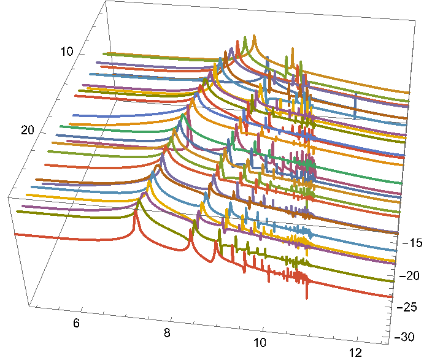

# Contents
- [🐋 ODEの初期値問題](#🐋-ODEの初期値問題)
    - [⛵ 減衰調和振動子/Damped Harmonic Oscillatorの例](#⛵-減衰調和振動子/Damped-Harmonic-Oscillatorの例)
        - [🪼 後退オイラー](#🪼-後退オイラー)
        - [🪼 🪼 LeapFrog](#🪼-🪼-LeapFrog)
        - [🪼 🪼 Runge-Kutta](#🪼-🪼-Runge-Kutta)
    - [⛵ Runge-Kutta Integration of ODE](#⛵-Runge-Kutta-Integration-of-ODE)
- [🐋 梁の振動](#🐋-梁の振動)
    - [⛵ **1. 元の偏微分方程式 (PDE)**](#⛵-**1.-元の偏微分方程式-(PDE)**)
        - [🪼 **項の意味**:](#🪼-**項の意味**:)
    - [⛵ **4. PDEとODEの関係をまとめる**](#⛵-**4.-PDEとODEの関係をまとめる**)
    - [⛵ モード展開法と動的解析法の比較](#⛵-モード展開法と動的解析法の比較)
    - [⛵ ステップ荷重は，ケーブル荷重の代わりになるか？](#⛵-ステップ荷重は，ケーブル荷重の代わりになるか？)


---
# 🐋 ODEの初期値問題 

```cpp
cmake -DCMAKE_BUILD_TYPE=Release ../ -DSOURCE_FILE=example_DampedHarmonicOscillator.cpp
make
./example_DampedHarmonicOscillator
```

## ⛵ 減衰調和振動子/Damped Harmonic Oscillatorの例 

減衰調和振動子の式から，
次のような加速度$`a(x,v)=\frac{d^2x}{dt^2}`$を
[プログラム中で宣言](../../builds/build_ODE/example_DampedHarmonicOscillator.cpp#L51)し，

```math
\begin{align*}
m \frac{d^2x}{dt^2} + b \frac{dx}{dt} + k x &= 0\\
\rightarrow a(x,v) &= -\gamma v - \omega^2 x, \quad v=\frac{dx}{dt},\quad \gamma=\frac{b}{m}, \quad \omega^2=\frac{k}{m}
\end{align*}
```

$`\gamma = 1, \omega = 10`$として，初期値問題をといてみる．
加速度の評価回数$`N`$を合わせて比較した例：

|  |  |   |
|:---:|:---:|:---:|
|N=25 evaluations|N=50 evaluations|the sum of differences|

### 🪼 後退オイラー 

後退オイラーの１回の計算で溜まる誤差は$`O(\Delta t^2)`$．次時刻における速度と加速度が正確に計算できなければ使えない．

### 🪼 🪼 LeapFrog  

リープフロッグの１回の計算で溜まる誤差は$`O({\Delta t}^3)`$となる．
時間間隔$`\Delta t`$が変化する場合でも使える形でプログラムしている（[LeapFrogのクラス](../../include/integrationOfODE.hpp#L491)）．
$\Delta t$が変化する場合，"半分蹴って-移動-半分蹴って"，"半分蹴って-移動-半分蹴って"の手順を繰り返す．
[LeapFrogのクラス](../../include/integrationOfODE.hpp#L491)
[../../include/integrationOfODE.hpp#L481](../../include/integrationOfODE.hpp#L481)


### 🪼 🪼 Runge-Kutta  

4次のルンゲクッタの１回の計算で溜まる誤差は$`O({\Delta t}^5)`$となる．
しかし，加速度を4階も計算する必要がある．
このように，ルンゲクッタを使って２階微分方程式を解く場合，
２階微分方程式を２つの1階微分方程式にわけて考え，互いに独立した２つのルンゲクッタを用意し，それぞれ現時刻の微分を使って更新する．
後退オイラーのように次時刻の流速を使って位置を更新するということはできない．

[4次のRunge-Kutta](not found)の場合，次のようになる．

```math
\begin{align*}
k _1 &= \frac{dx}{dt}(t _n, x _n)\\
k _2 &= \frac{dx}{dt}(t _n + \frac{\Delta t}{2}, x _n + \frac{\Delta t}{2} k _1)\\
k _3 &= \frac{dx}{dt}(t _n + \frac{\Delta t}{2}, x _n + \frac{\Delta t}{2} k _2)\\
k _4 &= \frac{dx}{dt}(t _n + \Delta t, x _n + \Delta t k _3)\\
x _{n+1} &= x _n + \frac{\Delta t}{6} (k _1 + 2 k _2 + 2 k _3 + k _4)
\end{align*}
```

[RungeKuttaのクラス](../../include/integrationOfODE.hpp#L34)
[../../include/integrationOfODE.hpp#L8](../../include/integrationOfODE.hpp#L8)

[./example_DampedHarmonicOscillator.cpp#L5](./example_DampedHarmonicOscillator.cpp#L5)

## ⛵ Runge-Kutta Integration of ODE 

```cpp
cmake -DCMAKE_BUILD_TYPE=Release ../ -DSOURCE_FILE=example_RungeKutta.cpp
make
./example_RungeKutta
```


[./example_RungeKutta.cpp#L1](./example_RungeKutta.cpp#L1)

---
# 🐋 梁の振動 

水平面で固定され垂直に立てられた梁の振動を考える．
梁の上端部にステップ荷重を加えた後，梁はどのように振動するだろうか．

梁の運動方程式は，次のように表される．慣性力と曲げ応力と圧縮応力の和がゼロとなるという原理に基づいている．
慣性力を表す１階時間偏微分と，曲げ応力と圧縮応力を表す４階空間偏微分を含む偏微分方程式である．

```math
\begin{align*}
\frac{\partial^2 u}{\partial t^2} &= \frac{E I}{\rho A} \frac{\partial^4 u}{\partial x^4} - \frac{E I}{\rho A} \frac{\partial^2}{\partial x^2} \left( \frac{\partial^2 u}{\partial x^2} \right) + \frac{E I}{\rho A} \frac{\partial^2}{\partial x^2} \left( \frac{\partial^2 u}{\partial x^2} \right)\\
&= \frac{E I}{\rho A} \frac{\partial^4 u}{\partial x^4}
\end{align*}
```

$`L = T - U`$をラグランジアンとすると，ラグランジアンのオイラー・ラグランジュ方程式は次のようになる．

```math
\begin{align*}
\frac{d}{dt} \left( \frac{\partial L}{\partial \dot{u}} \right) - \frac{\partial L}{\partial u} &= 0\\
\frac{d}{dt} \left( \frac{\partial T}{\partial \dot{u}} \right) - \frac{\partial T}{\partial u} &= 0\\
\frac{d}{dt} \left( \frac{\partial}{\partial \dot{u}} \left( \frac{1}{2} \rho A \dot{u}^2 \right) \right) - \frac{\partial}{\partial u} \left( \frac{1}{2} \rho A \dot{u}^2 \right) &= 0\\
\rho A \ddot{u} &= \frac{\partial}{\partial x} \left( E I \frac{\partial^2 u}{\partial x^2} \right)
\end{align*}
```

これを離散化し，モード展開法と，動的解析法を用いた方法を行なってみよう．
そして，最終的に，ステップ荷重をケーブル荷重に置き換えた場合，どのような違いが生じるかを調べてみよう．

---

## ⛵ **1. 元の偏微分方程式 (PDE)** 
梁の振動を記述する式は、空間的な**４階微分項**と時間的な**２階微分項**を含む偏微分方程式です。これは、**オイラー・ベルヌーイの梁理論**に基づいて次のように書かれます：

\[
\rho A \frac{\partial^2 u}{\partial t^2} = -E I \frac{\partial^4 u}{\partial x^4} + f(x, t)
\]

### 🪼 **項の意味**: 
1. \( \rho A \frac{\partial^2 u}{\partial t^2} \): 梁の単位長さあたりの質量に基づく慣性力（時間方向の加速度に比例）。
2. \( -E I \frac{\partial^4 u}{\partial x^4} \): 曲げ剛性による復元力（空間方向の４階微分）。
3. \( f(x, t) \): 外力（位置 \( x \) と時間 \( t \) の関数）。

この式は**連続体モデル**を基にしており、無限の自由度を持つモデルとして梁の挙動を完全に記述します。

## ⛵ **4. PDEとODEの関係をまとめる** 
1. **PDEの連続性**:
- \( \rho A \frac{\partial^2 u}{\partial t^2} = -E I \frac{\partial^4 u}{\partial x^4} + f(x, t) \) は無限の自由度を持つ連続体のモデル。

2. **空間離散化**:
- 有限要素法やモード解析により、空間の自由度を有限に縮約。
- ４階微分項が剛性マトリクス \( K \) に、質量項が質量マトリクス \( M \) に対応。

3. **ODEによる記述**:
- PDEが節点ごとの運動方程式 \( M \ddot{u} + K u = F(t) \) に変換される。

4. **モード解析**:
- ODEをモード座標に変換し、固有振動数と振動形状で簡略化して解く。

## ⛵ モード展開法と動的解析法の比較 

動的解析とモード展開法の結果をフーリエ空間で比較してみると，
モード展開で得られた固有振動数は，動的解析法で得られた固有振動数と一致することがわかる．
当然，分割数に伴うズレも含めて両者の結果が一致することが確認できる．



解いている離散化された運動方程式が同じであるから当然の結果である．

比較とは別に，節点の増加に伴う階の収束性を知ることができる．
SDOFの結果は，節点数が多いMDOFと大きく異なる．

## ⛵ ステップ荷重は，ケーブル荷重の代わりになるか？ 

```sh
sh clean
cmake -DCMAKE_BUILD_TYPE=Release ../ -DSOURCE_FILE=MDOF_beam_vibration.cpp
make
./MDOF_beam_vibration <numNodes>
```

[./MDOF_beam_vibration.cpp#L8](./MDOF_beam_vibration.cpp#L8)

---
