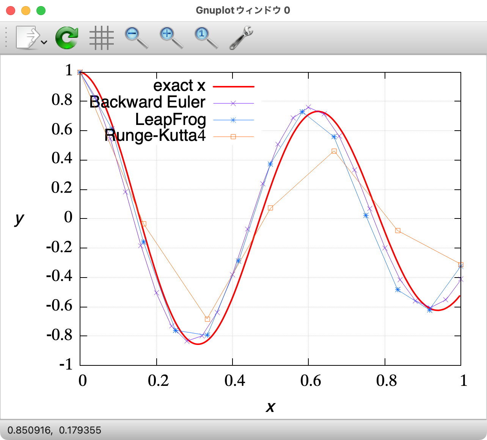
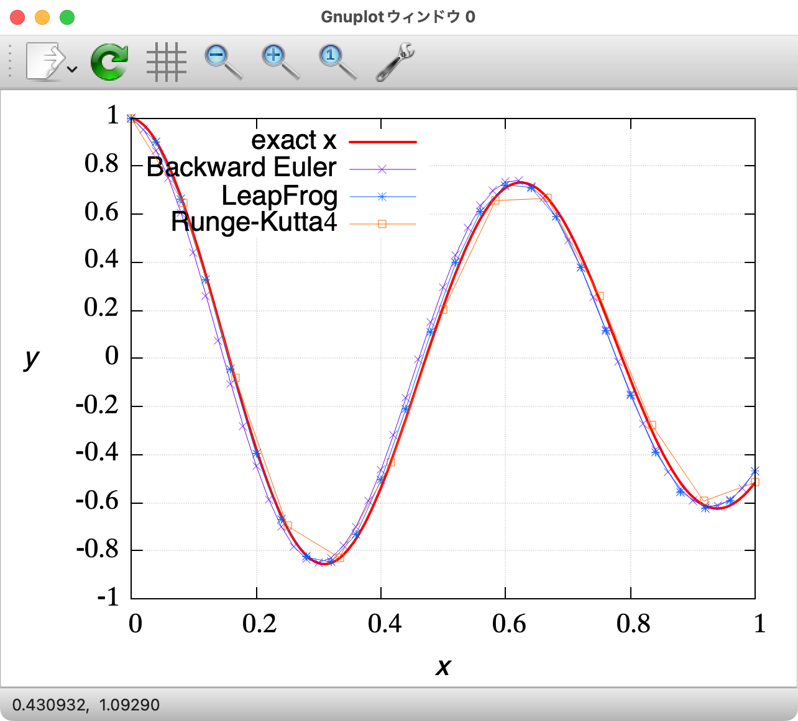
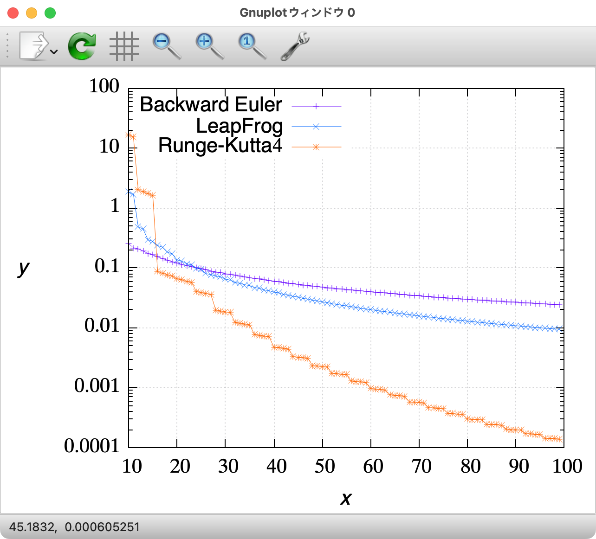
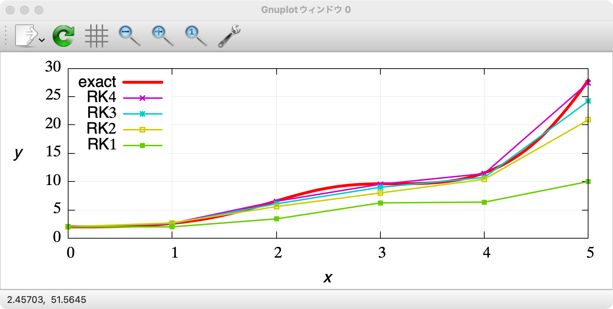

# Contents

- [🐋ODEの初期値問題](#🐋ODEの初期値問題)
    - [⛵️減衰調和振動子/Damped Harmonic Oscillatorの例](#⛵️減衰調和振動子/Damped-Harmonic-Oscillatorの例)
        - [🪸後退オイラー](#🪸後退オイラー)
        - [🪸🪸LeapFrog](#🪸🪸LeapFrog)
        - [🪸🪸Runge-Kutta](#🪸🪸Runge-Kutta)
    - [⛵️Runge-Kutta Integration of ODE](#⛵️Runge-Kutta-Integration-of-ODE)


---
# 🐋ODEの初期値問題 

## ⛵️減衰調和振動子/Damped Harmonic Oscillatorの例 

減衰調和振動子の式から，
次のような加速度$`a(x,v)=\frac{d^2x}{dt^2}`$を
[プログラム中で宣言](../../builds/build_ODE/example_DampedHrmonicOscillator.cpp#L44)し，

```math
\begin{align*}
m \frac{d^2x}{dt^2} + b \frac{dx}{dt} + k x &= 0\\
\rightarrow a(x,v) &= -\gamma v - \omega^2 x, \quad v=\frac{dx}{dt},\quad \gamma=\frac{b}{m}, \quad \omega^2=\frac{k}{m}
\end{align*}
```

$`\gamma = 1, \omega = 10`$として，初期値問題をといてみる．
加速度の評価回数$`N`$を合わせて比較した例：

|  |  |   |
|:---:|:---:|:---:|
|$`N=25`$ evaluations|$`N=50`$ evaluations|the sum of differences|

### 🪸後退オイラー 

後退オイラーの１回の計算で溜まる誤差は$`O(\Delta t^2)`$．次時刻における速度と加速度が正確に計算できなければ使えない．

### 🪸🪸LeapFrog  

リープフロッグの１回の計算で溜まる誤差は$`O({\Delta t}^3)`$となる．
時間間隔$`\Delta t`$が変化する場合でも使える形でプログラムしている（[LeapFrogのクラス](../../include/integrationOfODE.hpp#L329)）．
$\Delta t$が変化する場合，"半分蹴って-移動-半分蹴って"，"半分蹴って-移動-半分蹴って"の手順を繰り返す．
[LeapFrogのクラス](../../include/integrationOfODE.hpp#L329)

[../../include/integrationOfODE.hpp#L319](../../include/integrationOfODE.hpp#L319)


### 🪸🪸Runge-Kutta  

4次のルンゲクッタの１回の計算で溜まる誤差は$`O({\Delta t}^5)`$となる．
しかし，加速度を4階も計算する必要がある．
このように，ルンゲクッタを使って２階微分方程式を解く場合，
２階微分方程式を２つの1階微分方程式にわけて考え，互いに独立した２つのルンゲクッタを用意し，それぞれ現時刻の微分を使って更新する．
後退オイラーのように次時刻の流速を使って位置を更新するということはできない．

[4次のRunge-Kutta](../../include/integrationOfODE.hpp#L180)の場合，次のようになる．

```math
\begin{align*}
k _1 &= \frac{dx}{dt}(t _n, x _n)\\
k _2 &= \frac{dx}{dt}(t _n + \frac{\Delta t}{2}, x _n + \frac{\Delta t}{2} k _1)\\
k _3 &= \frac{dx}{dt}(t _n + \frac{\Delta t}{2}, x _n + \frac{\Delta t}{2} k _2)\\
k _4 &= \frac{dx}{dt}(t _n + \Delta t, x _n + \Delta t k _3)\\
x _{n+1} &= x _n + \frac{\Delta t}{6} (k _1 + 2 k _2 + 2 k _3 + k _4)
\end{align*}
```

[RungeKuttaのクラス](../../include/integrationOfODE.hpp#L37)

[../../include/integrationOfODE.hpp#L11](../../include/integrationOfODE.hpp#L11)


[./example_DampedHrmonicOscillator.cpp#L4](./example_DampedHrmonicOscillator.cpp#L4)


## ⛵️Runge-Kutta Integration of ODE 




[./example_RungeKutta.cpp#L1](./example_RungeKutta.cpp#L1)


---
