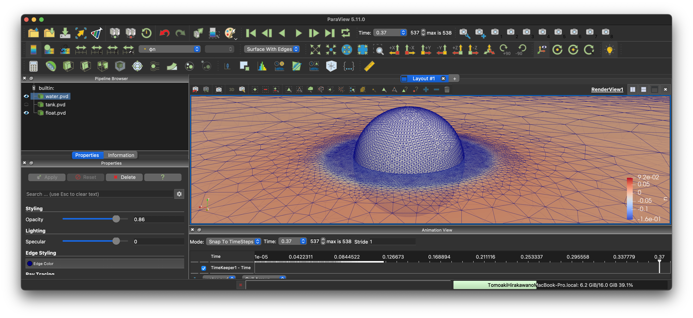

# Contents

- [🐋 Boundary Element Method (BEM-MEL)](#🐋-Boundary-Element-Method-(BEM-MEL))
    - [⛵️ 流速の計算方法](#⛵️-流速の計算方法)
        - [⚓️ 修正流速](#⚓️-修正流速)
    - [⛵️ 境界条件の設定](#⛵️-境界条件の設定)
    - [⛵️ 境界値問題](#⛵️-境界値問題)
        - [⚓️ BIEの離散化](#⚓️-BIEの離散化)
        - [⚓️ 多重節点](#⚓️-多重節点)
    - [⛵️ 浮体動揺解析](#⛵️-浮体動揺解析)
- [🐋 Input Generator for BEM Simulation](#🐋-Input-Generator-for-BEM-Simulation)
    - [⛵️ Usage](#⛵️-Usage)
    - [⛵️ Customization](#⛵️-Customization)
    - [⛵️ Output](#⛵️-Output)


---
[](banner.png)

# 🐋 Boundary Element Method (BEM-MEL)


[./BEM.hpp#L1](./BEM.hpp#L1)


## ⛵️ 流速の計算方法


[./BEM_calculateVelocities.hpp#L7](./BEM_calculateVelocities.hpp#L7)


### ⚓️ 修正流速

求めた流速から，次の時刻の境界面$`\Omega(t+\Delta t)`$を見積もり，その面上で節点を移動させ歪さを解消する．
修正ベクトルは，$`\Delta t`$で割り，求めた流速$`\nabla \phi`$に足し合わせて，節点を時間発展させる．

ノイマン節点も修正流速を加え時間発展させる．
ただし，ノイマン節点の修正流速に対しては，節点が水槽の角から離れないように，工夫を施している．


[./BEM_calculateVelocities.hpp#L354](./BEM_calculateVelocities.hpp#L354)


## ⛵️ 境界条件の設定

1. 流体節点が接触する構造物面を保存する
2. 面の境界条件：３節点全てが接触している流体面はNeumann面，それ以外はDirichlet面とする
3. 辺の境界条件：辺を含む２面がNeumann面ならNeumann辺，２面がDirichlet面ならDirichlet面，それ以外はCORNERとする．
4. 点の境界条件：点を含む面全てがNeumann面ならNeumann点，面全てがDirichlet面ならDirichlet点，それ以外はCORNERとする．


[./BEM_setBoundaryConditions.hpp#L7](./BEM_setBoundaryConditions.hpp#L7)


## ⛵️ 境界値問題

### ⚓️ BIEの離散化

$`\phi`$と$`\phi _n`$に関するBIEは，

$$
\alpha ({\bf{a}})\phi ({\bf{a}}) = \iint _\Gamma {\left( {G({\bf{x}},{\bf{a}})\nabla \phi ({\bf{x}}) - \phi ({\bf{x}})\nabla G({\bf{x}},{\bf{a}})} \right) \cdot {\bf{n}}({\bf{x}})dS}
\quad\text{on}\quad{\bf x} \in \Gamma(t).
$$

これを線形三角要素とGauss-Legendre積分で離散化すると，

$$
\alpha _{i _\circ}(\phi) _{i _\circ}=-\sum\limits _{k _\vartriangle}\sum\limits _{{\xi _1}} {\sum\limits _{{\xi _0}} {\left( {{w _0}{w _1}\left( {\sum\limits _{j=0}^2 {{{\left( {{\phi _n}} \right)} _{k _\vartriangle,j }}{N _{j }}\left( \pmb{\xi } \right)} } \right)\frac{1}{{\| {{\bf{x}}\left( \pmb{\xi } \right) - {{\bf x} _{i _\circ}}} \|}}\left\|\frac{{\partial{\bf{x}}}}{{\partial{\xi _0}}} \times \frac{{\partial{\bf{x}}}}{{\partial{\xi _1}}}\right\|} \right)} }
$$

$$
-\sum\limits _{k _\vartriangle}\sum\limits _{{\xi _1}} \sum\limits _{{\xi _0}} {\left( {{w _0}{w _1}\left({\sum\limits _{j =0}^2{{{\left( \phi  \right)} _{k _\vartriangle,j }}{N _{j}}\left( \pmb{\xi } \right)} } \right)\frac{{{{\bf x} _{i _\circ}} - {\bf{x}}\left( \pmb{\xi } \right)}}{{{{\| {{\bf{x}}\left( \pmb{\xi } \right) - {{\bf x} _{i _\circ}}}\|}^3}}} \cdot\left(\frac{{\partial {\bf{x}}}}{{\partial {\xi _0}}}\times\frac{{\partial {\bf{x}}}}{{\partial {\xi _1}}}\right)}\right)}
$$


[./BEM_solveBVP.hpp#L226](./BEM_solveBVP.hpp#L226)


### ⚓️ 多重節点
このループでは，ある面`integ_f`に隣接する節点{p0,p1,p2}の列,IGIGn[origin(fixed),p0],...に値が追加されていく．
（p0が多重接点の場合，適切にp0と同じ位置に別の変数が設定されており，別の面の積分の際にq0が参照される．）
p0は，{面,補間添字}で決定することもできる．
{面,補間添字0}->p0,{面,補間添字1}->p1,{面,補間添字2}->p2というように．

{面A,補間添字},{面B,補間添字},{面C,補間添字}が全て同じ節点p0を指していたとする．
普通の節点なら，IGIGn[origin,{p0,nullptr}]を指す．
多重節点なら，IGIGn[origin,{p0,面A}],IGIGn[origin,{p0,面B}]を指すようにする．
この操作を言葉で言い換えると，
「nが不連続に変化する点では，その点の隣接面にそれぞれ対してφnを求めるべきである（φは同じでも）．」
「nが不連続に変化する点では，どの面を積分するかに応じて，参照するφnを区別し切り替える必要がある．」

//@ さて，この段階でp0が多重節点であるかどうか判断できるだろうか？

{節点，面}-> 列ベクトルのインデックス を決めれるか？

面を区別するかどうかが先にわからないので，face*のまsまかnullptrとすべきかわからないということ．．．．

PBF_index[{p, Dirichlet, ある要素}]
は存在しないだろう．Dirichlet節点は，{p, ある要素}からの寄与を，ある面に


[./BEM_solveBVP.hpp#L325](./BEM_solveBVP.hpp#L325)


IGIGn は 左辺に IG*φn が右辺に IGn*φ が来るように計算しているため，移項する場合，符号を変える必要がある．
$`IG \phi _n = IGn \phi`$

移項前:
$`\begin{bmatrix}IG _0 & IG _1 & IG _2 & IG _3\end{bmatrix} \begin{bmatrix}\phi _{n0} \\ \phi _{n1} \\ \phi _{n2} \\ \phi _{n3}\end{bmatrix} =\begin{bmatrix}IG _{n0} & IG _{n1} & IG _{n2} & IG _{n3}\end{bmatrix}\begin{bmatrix}\phi _0 \\ \phi _1 \\ \phi _2 \\ \phi _3\end{bmatrix}`$

移項後:
$`\begin{bmatrix}IG _0 & -IG _{n1} & IG _2 & IG _3\end{bmatrix}\begin{bmatrix}\phi _{n0} \\ \phi _1 \\ \phi _{n2} \\ \phi _{n3}\end{bmatrix} =\begin{bmatrix}IG _{n0} & -IG _1 & IGn _2 & IG _{n3}\end{bmatrix}\begin{bmatrix}\phi _0 \\ \phi _{n1} \\ \phi _2 \\ \phi _3\end{bmatrix}`$

多重節点(1と3が多重節点の場合):
$`\begin{bmatrix}0 & 1 & 0 & 0\end{bmatrix}\begin{bmatrix}\phi _{n0} \\ \phi _1 \\ \phi _{n2} \\ \phi _{n3}\end{bmatrix} =\begin{bmatrix}0 & 0 & 0 & 1\end{bmatrix}\begin{bmatrix}\phi _0 \\ \phi _{n1} \\ \phi _2 \\ \phi _3\end{bmatrix}`$


[./BEM_solveBVP.hpp#L387](./BEM_solveBVP.hpp#L387)


$$
\nabla {\bf u} = \nabla \nabla \phi =
\begin{bmatrix} \phi _{xx} & \phi _{xy} & \phi _{xz} \\
\phi _{yx} & \phi _{yy} & \phi _{yz} \\
\phi _{zx} & \phi _{zy} & \phi _{zz}
\end{bmatrix}
$$


[./BEM_solveBVP.hpp#L593](./BEM_solveBVP.hpp#L593)


## ⛵️ 浮体動揺解析

浮体の重心の運動方程式：

$$
m \frac{d {\boldsymbol U} _{\rm c}}{d t} = \boldsymbol{F} _{\text {ext }}+\boldsymbol{F} _{\text {hydro }}, \quad
\boldsymbol{I} \frac{d {\boldsymbol \Omega} _{\rm c}}{d t} = \boldsymbol{T} _{\text {ext }}+\boldsymbol{T} _{\text {hydro }}
$$

$`{\boldsymbol U} _{\rm c}`$は浮体の移動速度．
$`\boldsymbol{F} _{\text {ext }}`$は重力などの外力，$`\boldsymbol{F} _{\text {hydro }}`$は水の力，$`\boldsymbol{T} _{\text {ext }}`$は外力によるトルク，$`\boldsymbol{T} _{\text {hydro }}`$は水の力によるトルク．
浮体が流体から受ける力$`\boldsymbol{F} _{\text {hydro }}`$は，浮体表面の圧力$`p`$を積分することで得られ，
また圧力$`p`$は速度ポテンシャル$`\phi`$を用いて，以下のように書ける．

$$
\boldsymbol{F} _{\text {hydro }}=\int _{S} p\boldsymbol{n}  d S, \quad
p=-\rho\left(\frac{\partial \phi}{\partial t}+\frac{1}{2} (\nabla \phi)^{2}+g z\right)
$$

$`\frac{\partial \phi}{\partial t}`$を$`\phi _t`$と書くことにする．この$`\phi _t`$は陽には求められない．
そこで，$`\phi`$と似た方法，BIEを使った方法で$`\phi _t`$を求める．$`\phi`$と$`\phi _n`$の間に成り立つ境界積分方程式と全く同じ式が，$`\phi _t`$と$`\phi _{nt}`$の間にも成り立つ：

$$
\alpha ({\bf{a}})\phi _t ({\bf{a}}) = \iint _\Gamma {\left( {G({\bf{x}},{\bf{a}})\nabla \phi _t ({\bf{x}}) - \phi _t ({\bf{x}})\nabla G({\bf{x}},{\bf{a}})} \right) \cdot {\bf{n}}({\bf{x}})dS}
\quad\text{on}\quad{\bf x} \in \Gamma(t).
$$

境界面が静止しているかどうかに関わらず，流体と物体との境界では，境界法線方向速度が一致する．
境界面上の位置ベクトルを$`\boldsymbol r`$とする．
表面上のある点の移動速度$`\frac{d\boldsymbol r}{dt}`$と流体粒子の流速$`\nabla \phi`$の間には，次の境界条件が成り立つ．

$$
{\bf n}\cdot\frac{d\boldsymbol r}{dt} =  {\bf n} \cdot \nabla \phi
$$

これを微分することで，$`\phi _{nt}`$を$`\phi`$と加速度$`\frac{d{\boldsymbol U} _{\rm c}}{dt}`$と角加速度$`\frac{d{\boldsymbol \Omega} _{\rm c}}{dt}`$を使って表すことができる．

$$
\begin{aligned}
&\rightarrow& \frac{d}{dt}({{\bf n}\cdot\frac{d\boldsymbol r}{dt}}) & = \frac{d}{dt}({{\bf n} \cdot \nabla \phi})\\
&\rightarrow& \frac{d{\bf n}}{dt}\cdot\frac{d\boldsymbol r}{dt} + {\bf n}\cdot\frac{d^2{\boldsymbol r}}{dt^2} & = \frac{d{\bf n}}{dt} \cdot \nabla \phi + {\bf n} \cdot \frac{d}{dt}{\nabla \phi}\\
&\rightarrow& \frac{d{\bf n}}{dt}\cdot{(\frac{d\boldsymbol r}{dt} - \nabla \phi)} & ={\bf n} \cdot \left(\frac{d}{dt}{\nabla \phi}- \frac{d^2{\boldsymbol r}}{dt^2}\right)\\
&\rightarrow& \frac{d{\bf n}}{dt}\cdot{(\frac{d\boldsymbol r}{dt} - \nabla \phi)} & ={\bf n} \cdot \left(\phi _t + \nabla \phi\cdot \nabla\nabla \phi - \frac{d^2{\boldsymbol r}}{dt^2}\right)\\
&\rightarrow& \phi _{nt} &= \frac{d{\bf n}}{dt} \cdot{(\frac{d\boldsymbol r}{dt} - \nabla \phi)} -{\bf n} \cdot \left(\nabla \phi\cdot \nabla\nabla \phi -\frac{d^2{\boldsymbol r}}{dt^2}\right)
\end{aligned}
$$

ここの$`\frac{d{\bf n}}{dt}`$と$`\frac{d^2\boldsymbol r}{dt^2}`$は，$`{\boldsymbol U} _{\rm c}`$と$`\boldsymbol \Omega _{\rm c}`$を用いて，

$$
\frac{d^2\boldsymbol r}{dt^2} = \frac{d}{dt}\left({\boldsymbol U} _{\rm c} + \boldsymbol \Omega _{\rm c} \times \boldsymbol r\right),\quad \frac{d{\bf n}}{dt} = {\boldsymbol \Omega} _{\rm c}
$$

$`\frac{d^2\boldsymbol r}{dt^2}`$を上の式に代入し，$`\phi _{nt}`$を求め，
次にBIEから$`\phi _t`$を求め，次に圧力$`p`$を求める．
そして，浮体の重さと慣性モーメントを考慮して圧力から求めた$`\frac{d^2\boldsymbol r}{dt^2}`$は，
入力した$`\frac{d^2\boldsymbol r}{dt^2}`$と一致しなければならない．

現状を整理すると，この浮体動揺解析において，知りたい未知変数は，浮体の加速度と角加速度だけ．
しかし，浮体の没水面上にある節点での圧力$`p`$が得られないと，$`\boldsymbol{F} _{\text {hydro }}`$が得られず，運動方程式から浮体加速度が計算できない．
圧力を計算するためには，$`\phi _t`$が必要で，$`\phi _t`$は簡単には得られない，という状況．

物体の加速度は， 節点における$`\{\phi _{nt0},\phi _{nt1},\phi _{nt2},..\} = \Phi _{nt}`$が分かれば求まるが，
逆に$`\Phi _{nt}`$は$`\frac{d\boldsymbol U _{\rm c}}{dt}`$が分かれば求まるので

$$
\begin{align*}
&&\frac{d\boldsymbol U _{\rm c}}{dt} = F\left(\Phi _{nt}\left(\frac{d\boldsymbol U _{\rm c}}{dt}\right)\right)\\
&\rightarrow& Q\left(\frac{d\boldsymbol U _{\rm c}}{dt}\right) = \frac{d\boldsymbol U _{\rm c}}{dt} - F\left(\Phi _{nt}\left(\frac{d\boldsymbol U _{\rm c}}{dt}\right)\right) =0
\end{align*}
$$

のように，ある関数$`Q`$のゼロを探す，根探し問題になる．
$`\phi _{nt}`$は，[ここ](../../builds/build_bem/BEM_solveBVP.hpp#L605)で与えている．


[./BEM_solveBVP.hpp#L769](./BEM_solveBVP.hpp#L769)


---
# 🐋 Input Generator for BEM Simulation

This Python script generates input files for the BEM simulation code. It supports various simulation cases and handles input file generation for each case.

## ⛵️ Usage

1. Make sure the required dependencies are installed.
2. Run the script using the following command:

```
python3 input_generator.py
```

Upon running the script, it will generate input files in JSON format for the specified simulation case. The input files are saved in the `./input_files/` directory.

## ⛵️ Customization

To customize the input file generation for a specific case, follow these steps:

1. Locate the `SimulationCase` variable in the script and set it to the desired case name, e.g., `"Kramer2021"`.
2. Add a new `case` block in the `match SimulationCase:` section to handle the new simulation case.
3. Define the required parameters for the simulation case within the new `case` block, following the examples provided in the script.
4. Update the `inputfiles` variable with the new input objects created for the custom case.

After customizing the script, run it again to generate the input files for the new case.

## ⛵️ Output

The script will generate input files in JSON format for the specified simulation case. The input files will be saved in the `./input_files/` directory. The generated input files can be used to run the BEM simulation.


---
[./input_generator.py#L1](./input_generator.py#L1)


---
プログラムを回す際に面倒な事は，入力ファイルの設定．
入力ファイルの作り方をドキュメントで示されても，具体的な例がないとわかりにくい．
例があっても，例と違う場合どうすればいいかなど，わからないことは多い．
このように，入力ファイルを生成するプログラムを作っておけば，その面倒をだいぶ解消できる．


---
[./input_generator.py#L50](./input_generator.py#L50)


---
