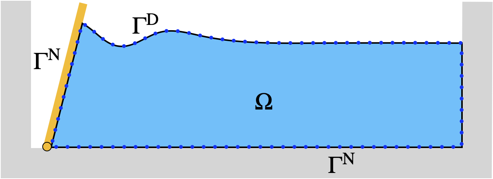
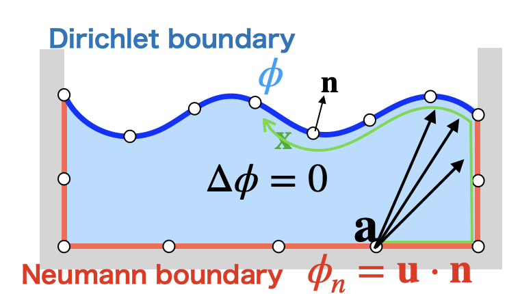
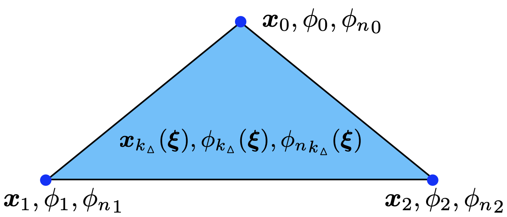
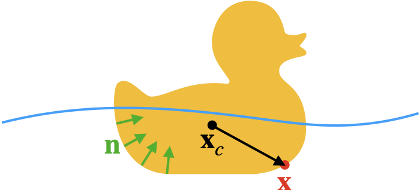
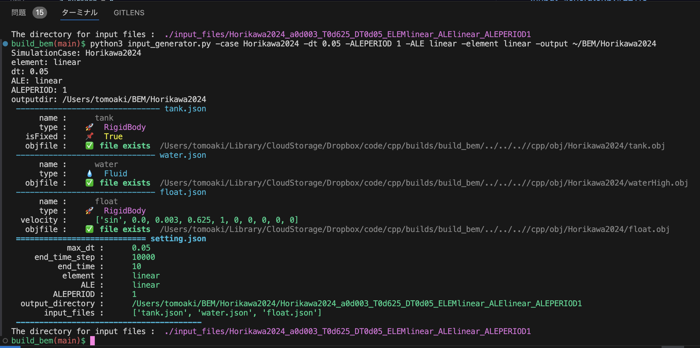
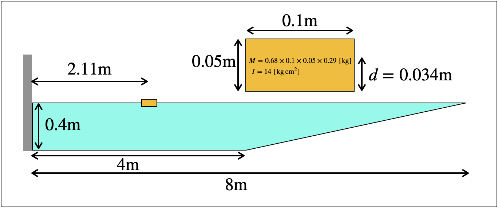
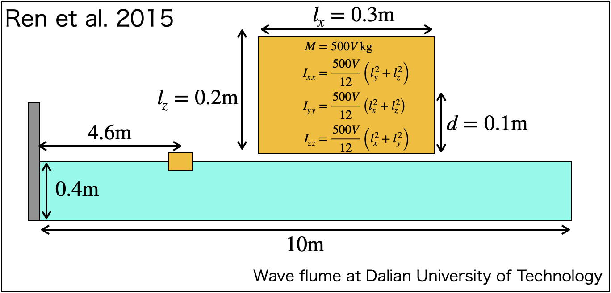
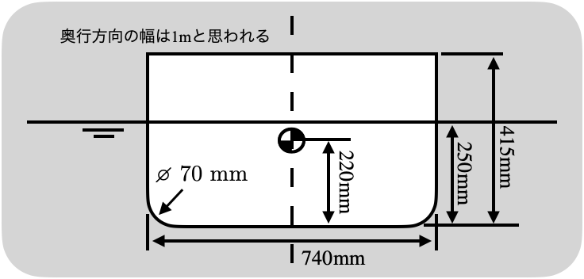
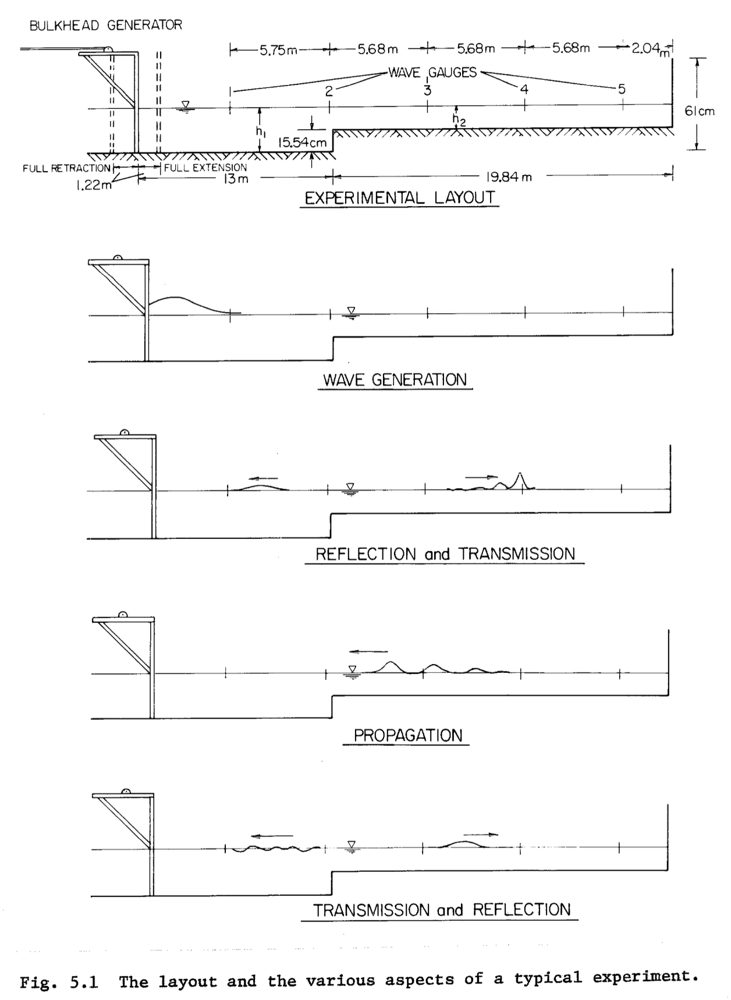
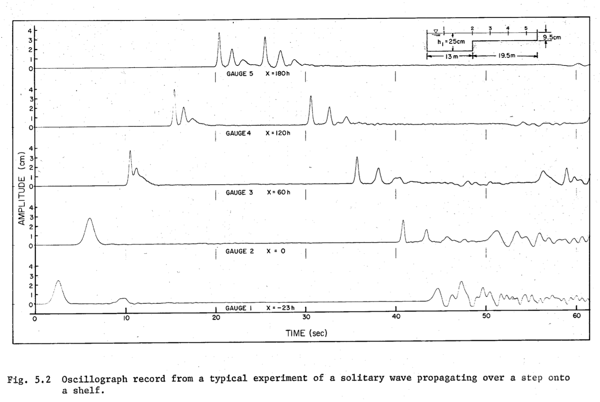

# Contents
- [🐋 BEM-MEL](#-bem-mel)
    - [⛵ 境界のタイプを決定する](#-境界のタイプを決定する)
    - [⛵ 多重節点](#-多重節点)
        - [🪼 境界値問題の未知変数ID 多重節点との区別](#-境界値問題の未知変数id-多重節点との区別)
        - [🪼 `getContactFaces()`や`getNearestContactFace()`の利用](#-getcontactfacesやgetnearestcontactfaceの利用)
            - [🪸 `contact_angle`と`isInContact()`](#-contact_angleとisincontact)
            - [🪸 🪸 接触の概念図](#--接触の概念図)
            - [🪸 `addContactFaces()`](#-addcontactfaces)
            - [🪸 呼び出し方法](#-呼び出し方法)
        - [🪼 `contactNormalVelocity()`と`accelNeumann()`](#-contactnormalvelocityとaccelneumann)
    - [⛵ 入力ファイルの読み込み](#-入力ファイルの読み込み)
    - [⛵ 計算プログラムの概要](#-計算プログラムの概要)
        - [🪼 計算の流れ](#-計算の流れ)
    - [⛵ 境界値問題](#-境界値問題)
        - [🪼 基礎方程式](#-基礎方程式)
        - [🪼 境界積分方程式（BIE）](#-境界積分方程式bie)
        - [🪼 BIEの離散化](#-bieの離散化)
        - [🪼 線形三角要素](#-線形三角要素)
            - [🪸 線形三角要素](#-線形三角要素)
            - [🪸 線形三角要素のヤコビアン](#-線形三角要素のヤコビアン)
            - [🪸 係数行列の作成](#-係数行列の作成)
        - [🪼 リジッドモードテクニック（係数行列の対角成分の計算）](#-リジッドモードテクニック係数行列の対角成分の計算)
        - [🪼 左辺と右辺の入れ替え](#-左辺と右辺の入れ替え)
            - [🪸 ２種類の多重節点](#-２種類の多重節点)
        - [🪼 高速多重極展開との関係](#-高速多重極展開との関係)
    - [⛵ 初期値問題](#-初期値問題)
        - [🪼 流速$`\frac{d\bf x}{dt}`$の計算](#-流速fracdbf-xdtの計算)
        - [🪼 $`\frac{d\phi}{dt}`$の計算](#-fracdphidtの計算)
        - [🪼 Arbitrary Lagrangian–Eulerian Methods (ALE)](#-arbitrary-lagrangianeulerian-methods-ale)
            - [🪸 使っているALEの手法](#-使っているaleの手法)
    - [⛵ 多重節点を考慮したIDの設定方法](#-多重節点を考慮したidの設定方法)
    - [⛵ 浮体動揺解析](#-浮体動揺解析)
        - [🪼 浮体の運動方程式](#-浮体の運動方程式)
            - [🪸 $`\phi`$のヘッセ行列の計算](#-phiのヘッセ行列の計算)
        - [🪼 $`\phi _{nt}`$の計算で必要となる$`{\bf n}\cdot \left({\frac{d\boldsymbol r}{dt}  \cdot \nabla\otimes\nabla \phi}\right)`$について．](#-phi-_ntの計算で必要となるbf-ncdot-leftfracdboldsymbol-rdt--cdot-nablaotimesnabla-phirightについて)
        - [🪼 浮体の重心位置・姿勢・速度の更新](#-浮体の重心位置姿勢速度の更新)
        - [🪼 加速度の計算の難しさ](#-加速度の計算の難しさ)
            - [🪸 間接的法，モード分解法](#-間接的法モード分解法)
            - [🪸 Dalena and Tanizawa's method](#-dalena-and-tanizawas-method)
            - [🪸 反復法](#-反復法)
            - [🪸 Maの反復法](#-maの反復法)
        - [🪼 $`\phi _t`$と$`\phi _{nt}`$に関するBIEの解き方（と$`\phi _{nt}`$の与え方）](#-phi-_tとphi-_ntに関するbieの解き方とphi-_ntの与え方)
            - [🪸 ディリクレ節点の$`\phi _{nt}`$の与え方(水面：圧力が既知，$`\phi`$が既知)](#-ディリクレ節点のphi-_ntの与え方水面圧力が既知phiが既知)
            - [🪸 ディリクレ節点の$`\phi _{t}`$の与え方($`\phi`$を与える造波装置：圧力が未知，$`\phi`$が既知)](#-ディリクレ節点のphi-_tの与え方phiを与える造波装置圧力が未知phiが既知)
            - [🪸 ノイマン節点での$`\phi _{nt}`$の与え方](#-ノイマン節点でのphi-_ntの与え方)
        - [🪼 流体の$`\phi`$時間発展，$`\phi _n`$の時間発展はない](#-流体のphi時間発展phi-_nの時間発展はない)
        - [🪼 波の吸収（ダンピング領域）](#-波の吸収ダンピング領域)
        - [🪼 補助関数を使った方法](#-補助関数を使った方法)
    - [⛵ 陽に与えられる境界条件に対して（造波装置など）](#-陽に与えられる境界条件に対して造波装置など)
        - [🪼 進行波を生成するための流速の境界条件](#-進行波を生成するための流速の境界条件)
        - [🪼 孤立波の造波方法 (Goring,1979)](#-孤立波の造波方法-goring1979)
        - [🪼 フラップ型造波装置](#-フラップ型造波装置)
        - [🪼 ピストン型造波装置](#-ピストン型造波装置)
        - [🪼 正弦・余弦（`sin` もしくは `cos`）の運動](#-正弦余弦sin-もしくは-cosの運動)
        - [🪼 係留索の出力](#-係留索の出力)
        - [🪼 エネルギー保存則（計算精度のチェックに利用できる）](#-エネルギー保存則計算精度のチェックに利用できる)
        - [🪼 内部流速の計算方法（使わなくてもいい）](#-内部流速の計算方法使わなくてもいい)
        - [🪼 JSONファイルの出力](#-jsonファイルの出力)
- [🐋 実行方法](#-実行方法)
    - [⛵ ファイルのダウンロード](#-ファイルのダウンロード)
    - [⛵ 入力ファイルの生成．](#-入力ファイルの生成)
    - [⛵ プログラムのコンパイルと実行](#-プログラムのコンパイルと実行)
- [🐋 Input Generator](#-input-generator)
    - [⛵ For Ubuntu](#-for-ubuntu)
    - [⛵ For Mac OS X](#-for-mac-os-x)
    - [⛵ Horikawa2024](#-horikawa2024)
        - [🪼 inputファイルの生成](#-inputファイルの生成)
        - [🪼 実行ファイルの生成（毎回する必要はない）](#-実行ファイルの生成毎回する必要はない)
        - [🪼 実行](#-実行)
    - [⛵ Tonegawa2024](#-tonegawa2024)
        - [🪼 浮体](#-浮体)
        - [🪼 水槽](#-水槽)
        - [🪼 使用するobjファイル](#-使用するobjファイル)
        - [🪼 造波装置の運動](#-造波装置の運動)
    - [⛵ Tonegawa2024 Akita](#-tonegawa2024-akita)
    - [⛵ Fredriksen2015](#-fredriksen2015)
    - [⛵ Hadzic2005](#-hadzic2005)
    - [⛵ Liang2022](#-liang2022)
    - [⛵ Palm2016](#-palm2016)
    - [⛵ Tanizawa1996](#-tanizawa1996)
    - [⛵ Kramer2021](#-kramer2021)
    - [⛵ Goring1979](#-goring1979)
- [🐋 Examples](#-examples)


---
# 🐋 BEM-MEL 


[./main.cpp#L3](./main.cpp#L3)

---
## ⛵ 境界のタイプを決定する 



0. 流体と物体の衝突を判定し，流体節点が接触する物体面を保存しておく．

* [contact_angle](not found){`networkPoint::contact_angle`}
* [isInContact](not found){`networkPoint::isInContact`}
* [addContactFaces](not found){`networkPoint::addContactFaces`}

を使って接触判定を行っている．

[BEM:contact_range](not found){流体が構造物との接触を感知する半径}の設置も重要．

つぎに，その情報を使って，境界のタイプを次の順で決める．（物理量を与えるわけではない）

1. 面の境界条件：３節点全てが接触している流体面はNeumann面，それ以外はDirichlet面とする．CORNER面は設定しない．
- Neumann面$`\Gamma^{({\rm N})}`$ : 3点接触流体面
- Dirichlet面$`\Gamma^{({\rm D})}`$ : それ以外の面

2. 辺の境界条件 : 辺を含む２面がNeumann面ならNeumann辺，２面がDirichlet面ならDirichlet辺，それ以外はCORNERとする．
- Neumann辺 : 隣接面2面がNeumann面の辺
- Dirichlet辺 : 隣接面2面がDirichlet面の辺
- CORNER辺 : それ以外の辺（Neumann面とDirichlet面の間にある辺）

3. 点の境界条件：点を含む面全てがNeumann面ならNeumann点，面全てがDirichlet面ならDirichlet点，それ以外はCORNERとする．
- Neumann点 : 隣接面全てがNeumann面である点
- Dirichlet点 : 隣接面全てがDirichlet面である点
- CORNER点 : それ以外の点（Neumann面とDirichlet面の間にある点）

[./BEM_setBoundaryTypes.hpp#L125](./BEM_setBoundaryTypes.hpp#L125)

---
## ⛵ 多重節点 

💡 面の向き$`\bf n`$がカクッと不連続に変わる節点には，$`\phi`$は同じでも，隣接面にそれぞれ対して異なる$`\phi _n`$を計算できるようにする

💡 $`\bf n`$が不連続に変化する節点まわりの要素は，自分のために用意された$`\phi _n`$を選択し補間に用いなければならない

これを多重節点という．

多重節点を導入すると，未知変数idは，節点idだけではなく，節点と面の組みのidとなる．

### 🪼 境界値問題の未知変数ID 多重節点との区別 

* `isNeumannID_BEM`と`isDirichletID_BEM`は，節点と面の組みが，境界値問題の未知変数かどうかを判定する．

* `pf2ID`は，節点と面の組みを未知変数IDに変換する．多重節点でない場合は，`{p,nullptr}`が変数のキーとなり，多重節点の場合は，与えられた`{p,f}`が変数のidとなる．

[./BEM_setBoundaryTypes.hpp#L7](./BEM_setBoundaryTypes.hpp#L7)

---
### 🪼 `getContactFaces()`や`getNearestContactFace()`の利用 

#### 🪸 `contact_angle`と`isInContact()` 

| `networkPoint`のメンバー関数/変数      | 説明                                                                |
|-------------------------|--------------------------------------------------------------------------------|
| [contact_angle](not found){`contact_angle`}         | ２面の法線ベクトルがこの`contact_angle`大きい場合，接触判定から除外される |
| [isFacing](not found){`isFacing()`}       | ２面の法線ベクトルが`contact_angle`よりも小さいか判定する．ただし，角度は，向かい合う面がなす最小の角度と考える |
| [isInContact](not found){`isInContact()`}         | 点の隣接面のいずれかが，与えられた面と接触しているか判定する．範囲内で接触しており，かつ`isFacing`が真である場合`true`を返す． |
| [addContactFaces](not found){`addContactFaces()`}     | バケツに保存された面を基に，節点が接触した面を`networkPoint::ContactFaces`に登録する．   |

現在の実装方法では，接触判定は`networkPoint::addContactFaces`が起点となる．

`networkPoint::addContactFaces`は，節点と隣接する面の組み合わせに対して，接触判定を行い，
`networkPoint::ContactFaces`，`networkPoint::nearestContactFace`，`networkPoint::f_nearestContactFaces`を追加する．

面がノイマン境界条件であるとは，面の全３節点が，`f_nearestContactFaces`に登錄されていることを意味する．
１つでも，p->f_nearestContactFaces[f]が存在しない場合，fはノイマン境界条件でない（また，同時に，pはノイマン節点でないことになる）．

また，節点がノイマン節点であるためには，隣接する全面がノイマン境界条件である必要がある．
そのため，`p->f_nearestContactFaces[隣接面]`が存在しない場合，pはノイマン境界条件でない．

#### 🪸 🪸 接触の概念図  


[../../include/networkPoint.hpp#L128](../../include/networkPoint.hpp#L128)


#### 🪸 `addContactFaces()` 

このような，追加系の関数は，スレッドセーフであることが重要である．同時に使用した場合，競合が発生する可能性があるためである．
そのようなことが起こらないように，できるだけ多くの情報を引数に渡し，関数内部で処理を閉じ込めることが望ましい．
そのため，ここでは，`const std::vector<Network *> &objects`というまとめた情報を引数に渡している．

1. ContactFacesを引き継ぎ，新たに接触した面を追加する．ただし，同じ面は保存しない．
2. 近い接触面を優先し，ほぼ同方向の接触面のフラグをfalseにする．
3. フラグが立っているものだけを保存する．ContactFacesには，最も近い接触位置が順番に格納され，同方向の面は存在しない．
4. f_nearestContactFacesには，隣接面毎に最も近い接触面と接触位置が格納される．

| `networkPoint`のメンバー関数/変数      | 説明                                                                |
|-------------------------|--------------------------------------------------------------------------------|
| `addContactFaces()`     | バケツに保存された面を基に，節点が接触した面を`networkPoint::ContactFaces`に登録する．   |
| `std::unordered_set<networkFace *> ContactFaces`          | 節点が接触した面が登録されている．   |
| `std::tuple<networkFace *, Tddd> nearestContactFace`    | 節点にとって最も近い面とその座標を登録されている．       |
| `std::unordered_map<networkFace *, std::tuple<networkFace *, Tddd>> f_nearestContactFaces` | この節点に隣接する各面にとって，最も近い面とその座標をこの変数に登録する．           |
[../../include/networkPoint.hpp#L308](../../include/networkPoint.hpp#L308)


#### 🪸 呼び出し方法 

* `getContactFaces()`で`ContactFaces`呼び出せる．
* `getNearestContactFace()`で`nearestContactFace`呼び出せる．
* `getNearestContactFace(face)`で`f_nearestContactFaces`呼び出せる．
[../../include/Network.hpp#L938](../../include/Network.hpp#L938)


これらは，`contactNormalVelocity()`や`accelNeumann()`で利用される．

### 🪼 `contactNormalVelocity()`と`accelNeumann()` 

接触している物体が，剛体でない場合，
`velocity_of_Body`は，物体の節点（ `networkPoint` ）の速度（加速度）を元にして速度（加速度）を計算する．
そのため，`networkPoint::velocity`や`networkPoint::accel`を設定しておく必要がある．

`contactNormalVelocity(p, const adjacent_f)`や`accelNeumann(p, const adjacent_f)`
を使う時は，必ず`adjacent_f`が`p`に**隣接面するノイマン面**であることを確認する．

[./BEM_utilities.hpp#L466](./BEM_utilities.hpp#L466)

---
## ⛵ 入力ファイルの読み込み 

1. 境界条件の設定
2. 境界値問題（BIE）を解き，$`\phi`$と$`\phi _n`$を求める
3. 三角形の線形補間を使って節点の流速を計算する

[./main.cpp#L53](./main.cpp#L53)

## ⛵ 計算プログラムの概要 

| 項目 | 詳細|
|---:|:---|
| 要素 | 線形三角要素 |
| 時間発展方法 | 4次のルンゲクッタ |
| 解析領域 | 時間領域 |
| 境界条件 | 水面の境界条件は非線形であるが，非線形のまま解く |

### 🪼 計算の流れ 

1. 境界条件の設定
2. 境界値問題（BIE）を解き，$`\phi`$と$`\phi _n`$を求める
3. 三角形の線形補間を使って節点の流速を計算する
4. 次時刻の$`\Omega(t+\Delta t)`$がわかるので，修正流速を計算する
5. 浮体の加速度を計算する．境界値問題（BIE）を解き，$`\phi _t`$と$`\phi _{nt}`$を求め，浮体面上の圧力$`p`$を計算する必要がある
6. 全境界面の節点の位置を更新．ディリクレ境界では$`\phi`$を次時刻の値へ更新

[./main.cpp#L148](./main.cpp#L148)

---
`phiOnFace`は，各節点`p`における各面`f`に対するポテンシャル`phi`を設定するために使用される．
`phitOnFace`は，各節点`p`における各面`f`に対するポテンシャルの時間微分`dphi/dt`を設定するために使用される．
他も同様である．

[./BEM_setBoundaryTypes.hpp#L326](./BEM_setBoundaryTypes.hpp#L326)

## ⛵ 境界値問題 

### 🪼 基礎方程式 

非粘性渦なし流れを仮定し，ラプラス方程式を満たす速度ポテンシャル$`\phi(t,\bf{x})`$によって流れ場$`\bf{u}(t,\bf{x})=\nabla\phi(t,\bf{x})`$を表す．水面，壁面，浮体表面における境界条件は，

```math
\begin{align}
\nabla\cdot\nabla \phi& = 0&&\text{in}&&{\bf x} \in \Omega(t),\\
\frac{\partial\phi}{\partial t} +\frac{1}{2}\nabla\phi\cdot\nabla\phi + g z &=0 &&\text{on}&&{\bf x} \in \Gamma^{\rm D}(t),\\
\phi _n + {{\bf u} _b}\cdot{{\bf n} _b} &=0&&\text{on}&&{\bf x}\in \Gamma^{\rm N}(t),
\end{align}
```

ここで，
$`{\bf x} ={(x,y,z)}`$は空間座標，$`{\bf u} _b`$は物体の流速，
$`{\bf n} _b`$は物体の外向き単位法線ベクトル，
$`\nabla=(\frac{\partial}{\partial x},\frac{\partial}{\partial y},\frac{\partial}{\partial z})`$
である．
また，$`\phi _n`$は境界面上での外向き法線方向の流速を表し，
境界面上の外向き単位法線ベクトル$`\bf n`$を使えば$`\phi _n ={\nabla\phi}\cdot {\bf n}`$で表される．

### 🪼 境界積分方程式（BIE） 

**グリーンの定理**

任意の$`\phi`$，$`G`$に対して次が成り立つ（**グリーンの定理**）．

```math
\iiint _\Omega \left(G({\bf x},{\bf a})\nabla^2 \phi({\bf x}) - \phi({\bf x})\nabla^2 G({\bf x},{\bf a})\right)dV
= \iint _\Gamma {\left( {G({\bf{x}},{\bf{a}})\nabla \phi ({\bf{x}}) - \phi ({\bf{x}})\nabla G({\bf{x}},{\bf{a}})} \right) \cdot {\bf{n}}({\bf{x}})dS}
```


$`\phi`$がラプラス方程式$`\nabla^2\phi=0`$を満たし，$`G=1/\|{\bf x}-{\bf a}\|`$とすると，
グリーンの定理から$`\phi`$と$`\phi _n`$の関係式，BIEが得られる．

```math
\alpha ({\bf{a}})\phi ({\bf{a}}) = \iint _\Gamma {\left( {G({\bf{x}},{\bf{a}})\nabla \phi ({\bf{x}}) - \phi ({\bf{x}})\nabla G({\bf{x}},{\bf{a}})} \right) \cdot {\bf{n}}({\bf{x}})dS}
\quad\text{on}\quad{\bf x} \in \Gamma(t).
```

ここで，$`{\bf a}`$は境界面上の位置ベクトルであり，この原点$`{\bf a}`$を固定し$`{\bf x}`$について面積分される．
$`G`$は任意のスカラー関数で$`G=1/\|{\bf x}-{\bf a}\|`$とすることで，グリーンの定理の体積積分が消え，BIEの左辺のように，
原点での立体角$`\alpha\left( {\bf{a}} \right)`$とポテンシャル$`\phi( {\bf{a}})`$の積だけが残る．



この式は，流体内部では，$`\alpha ({\bf{a}})`$は$`1`$とできる．
この式は，$`\bf{a}`$におけるポテンシャル$`\phi ({\bf{a}})`$が，右辺の１重層ポテンシャルと２重層ポテンシャルの和で表されることを示している．
$`G=1/\|{\bf x}-{\bf a}\|`$がラプラス方程式の基本解であり，$`\phi`$は境界におけるポテンシャルの分布である．

[./BEM_solveBVP.hpp#L7](./BEM_solveBVP.hpp#L7)

### 🪼 BIEの離散化 

```math
\alpha ({\bf a})\phi({\bf a})
= \iint _\Gamma {\left({
\frac{1}{\|{\bf x}-{\bf a}\|}
\nabla \phi ({\bf{x}}) + \phi ({\bf{x}})
\frac{{\bf x}-{\bf a}}{\|{\bf x}-{\bf a}\|^3}}
\right) \cdot {\bf{n}}({\bf{x}})dS}
```

面は面上の節点を使って補間され，面積分はこの補間された面上に沿って行われる．
面の法線ベクトル$`{\bf n}=\frac{\frac{{\partial {\bf x}}}{{\partial \xi _0}}\times\frac{{\partial {\bf x}}}{{\partial \xi _1}}}{\left\|\frac{{\partial {\bf x}}}{{\partial \xi _0}}\times\frac{{\partial {\bf x}}}{{\partial \xi _1}}\right\|}`$を代入し，BIEをGauss-Legendre積分で離散化すると，

```math
\sum\limits _{k _\vartriangle}\sum\limits _{{\xi _1},{w _1}} {\sum\limits _{{\xi _0},{w _0}} {\left( {{w _0}{w _1}\left( {\sum\limits _{j=0}^2 {{{\left( {{\phi _n}} \right)} _{k _\vartriangle,j }}{N _{j }}\left( \pmb{\xi } \right)} } \right)\frac{1}{{\| {{\bf{x}} _{k _\vartriangle}\left( \pmb{\xi } \right) - {{\bf x} _{i _\circ}}} \|}}\left\|\frac{{\partial{{\bf x} _{k _\vartriangle}}}}{{\partial{\xi _0}}} \times \frac{{\partial{\bf{x}} _{k _\vartriangle}}}{{\partial{\xi _1}}}\right\|} \right)} }=
```

```math
\alpha _{i _\circ}(\phi) _{i _\circ}-\sum\limits _{k _\vartriangle}\sum\limits _{{\xi _1},{w _1}} \sum\limits _{{\xi _0},{w _0}} {\left( {{w _0}{w _1}\left({\sum\limits _{j =0}^2{{{\left( \phi  \right)} _{k _\vartriangle,j }}{N _{j}}\left( \pmb{\xi } \right)} } \right)\frac{{{\bf x} _{k \vartriangle}}({\pmb{\xi}})-{{\bf x} _{i _\circ} }}{{{{\| {{{\bf x} _{k _\vartriangle}}\left( \pmb{\xi } \right) - {{\bf x} _{i _\circ}}}\|}^3}}} \cdot\left(\frac{{\partial {\bf{x}} _{k _\vartriangle}}}{{\partial {\xi _0}}}\times\frac{{\partial {\bf{x}} _{k _\vartriangle}}}{{\partial {\xi _1}}}\right)}\right)}
```

離散化では，$`\phi _{i _\circ}`$と$`{\phi _n} _{i _\circ}`$の係数を知りたいので，
$`\phi _{k _\vartriangle}({\pmb{\xi}})`$と$`{\phi _n} _{k _\vartriangle}({\pmb{\xi}})`$と書くのではなく，
$`\phi _{i _\circ}`$と$`{\phi _n} _{i _\circ}`$が見えるように$`\phi _{k _\vartriangle}({\pmb{\xi}})`$と$`{\phi _n} _{k _\vartriangle}({\pmb{\xi}})`$の補間を書いている．

ここで，$`\phi _{k _\vartriangle,j}`$における$`k _\vartriangle`$は三角形要素の番号，$`j`$は三角形要素の頂点番号．
$`N _j`$は三角形要素の形状関数，$`{\pmb{\xi}}`$は三角形要素の内部座標，$`w _0,w _1`$はGauss-Legendre積分の重み，$`\alpha _{i _\circ}`$は原点$`i _\circ`$における立体角，$`\phi`$はポテンシャル，$`\phi _n`$は法線方向のポテンシャル，$`\bf{x}`$は空間座標，$`{\bf x} _{i _\circ}`$は原点の空間座標である．

* $`\phi _{k _\vartriangle}`$は補間で作った関数
* $`\phi _{k _\vartriangle,j}`$は補間を構成する節点$`j`$での値
* $`\phi _{i _\circ}`$はより直接的にある節点$`i _\circ`$での値

💡 この段階ではまだ，1.数値積分のパラメタと，2.形状関数のパラメタと元々の面都の対応関係は，指定していない．例えば，やり方によっては$`\xi _1`$のパラメタは，$`\xi _0`$に依存するかもしれない．

補間に使うパラメタを$`{\bf \xi}=(\xi _0, \xi _1)`$として，よく使われる３節点を使う線形補間を使うことにする．
元の面に対応する，線形補間面は，パラメタ上では$`{\xi _0 + \xi _1 = 1}`$を満たす範囲なので，
積分範囲は例えば$`0\leq \xi _0 \leq 1, 0\leq \xi _1 \leq 1-\xi _0`$となる．
しかし，数値積分につかう変数と重みの組み合わせは，コンパイルタイムに決めておき計算を効率化したいので，
この点で，変化する積分範囲は数値積分との相性が悪い．

### 🪼 線形三角要素 

#### 🪸 線形三角要素 



形状関数$`{\pmb N} _j({\pmb \xi}),{\pmb \xi}=(\xi _0,\xi _1)`$は，$`\xi _0,\xi _1`$が$`0`$から$`1`$動くことで，範囲で三角要素全体を動くように定義している．

```math
{\pmb N}({\pmb \xi}) = (N _0({\pmb \xi}),N _1({\pmb \xi}),N _2({\pmb \xi})) = (\xi _0, - \xi _1 (\xi _0 - 1), (\xi _0-1)(\xi _1-1))
```

####  🪸 線形三角要素のヤコビアン 

線形三角要素のヤコビアンは，$`\|\frac{\partial {\bf{x}}}{\partial {\xi _0}} \times \frac{\partial {\bf{x}}}{\partial {\xi _1}}\|`$である．

```Mathematica
shape[t0_, t1_] := With[{t2 = 1 - t0 - t1, t0m1 = t0 - 1, t1m1 = t1 - 1}, {t0, -t1*t0m1, t0m1*t1m1}];
D0shape[t0_, t1_] = (D[shape[T0, t1], T0] /. T0 -> t0);
D1shape[t0_, t1_] = (D[shape[t0, T1], T1] /. T1 -> t1);
{a, b, c} = {{x0, y0, z0}, {x1, y1, z1}, {x2, y2, z2}}
FullSimplify[Cross[Dot[D[shape[T0, t1], T0], {a, b, c}], Dot[D[shape[t0, T1], T1], {a, b, c}]]]
FullSimplify[Cross[Dot[D[shape[T0, t1], T0], {a, b, c}], Dot[D[shape[t0, T1], T1], {a, b, c}]]/Cross[b - a, c - a]]
```

上の結果は，$`1-\xi _0`$となる．つまり，線形補間の場合，ヤコビアン内の外積は次のように，節点位置を使ってシンプルに計算できる．

```math
\frac{\partial {{\bf x} _{{k _\vartriangle}}}}{\partial {\xi _0}} \times \frac{\partial {{\bf x} _{{k _\vartriangle}}}}{\partial {\xi _1}} = (1-\xi _0) (({{\bf x} _{{k _\vartriangle} _1}}-{{\bf x} _{{k _\vartriangle} _0}})\times({{\bf x} _{{k _\vartriangle} _2}}-{{\bf x} _{{k _\vartriangle} _0}}))
= 2(1-\xi _0)A _{k _\vartriangle}{\bf n} _{k _\vartriangle}
```

これを使えば，BIEは次のように簡単になる．

```math
\sum\limits _{k _\vartriangle}{2A _{k _\vartriangle}}
\sum\limits _{{\xi _1},{w _1}}
{\sum\limits _{{\xi _0},{w _0}} {\left( {{w _0}{w _1}\left( {\sum\limits _{j=0}^2 {{{\left( {{\phi _n}} \right)} _{k _\vartriangle,j }}{N _{j }}\left( \pmb{\xi } \right)} } \right)\frac{1}{{\| {{\bf{x}}\left( \pmb{\xi } \right) - {{\bf x} _{i _\circ}}} \|}}
(1-\xi _0)
} \right)} }=
```

```math
\alpha _{i _\circ}(\phi) _{i _\circ}
-\sum\limits _{k _\vartriangle}{2A _{k _\vartriangle}{\bf n} _{k _\vartriangle}}\cdot
\sum\limits _{{\xi _1},{w _1}}
\sum\limits _{{\xi _0},{w _0}} {\left( {{w _0}{w _1}\left({\sum\limits _{j =0}^2{{{\left( \phi  \right)} _{k _\vartriangle,j }}{N _{j}}\left( \pmb{\xi } \right)} } \right)\frac{{{\bf x} _{k _\vartriangle}}({\pmb{\xi}})-{{\bf x} _{i _\circ} }}{{{{\| {{{\bf x} _{k _\vartriangle}}\left( \pmb{\xi } \right) - {{\bf x} _{i _\circ}}}\|}^3}}}} (1-\xi _0)\right)}
```

💡 ちなみに，$`\frac{1-\xi _0}{{\| {{\bf{x}}\left( \pmb{\xi } \right) - {{\bf x} _{i _\circ}}} \|}}`$の分子に$`1-\xi _0`$があることで，
関数の特異的な変化を抑えることができる．プログラム上ではこの性質が利用できるように，この分数をまとめて計算している．

[./BEM_solveBVP.hpp#L163](./BEM_solveBVP.hpp#L163)

#### 🪸 係数行列の作成 

数値シミュレーションでは，境界値問題を$`{\bf A}{\bf x}={\bf b}`$のような線形連立方程式になるよう近似，変形し（離散化），$`{\bf x}`$を求めることが多い．
BEMでもBIEを離散化してこのような形にする．その際，境界条件に応じて，方程式（$`{\bf A}{\bf x}={\bf b}`$の行）の右辺と左辺が入れ替える必要があるので注意する．
これは，$`{\bf A}{\bf x}={\bf b}`$の未知変数$`{\bf x}`$と既知変数$`{\bf b}`$がポテンシャル$`\phi`$か法線方向のポテンシャル$`\phi _n`$か，境界条件によって違うからである．
プログラム上では，係数行列$`\bf A`$やベクトル$`\bf b`$を境界条件に応じて適切に作成すれば，求まる$`\bf x`$が適切なものになる．

$`\phi`$の係数行列を$`\mathbf{M}`$，$`\phi _n`$の係数行列を$`\mathbf{N}`$，$`\mathbf{\Phi}`$を$`\phi`$のベクトル，$`\mathbf{\Phi _n}`$を$`\phi _n`$のベクトルとして，
次のような連立一次方程式を得る．

```math
\mathbf{N} \mathbf{\Phi _n} = \mathbf{M} \mathbf{\Phi} \rightarrow {\bf A}{\bf x}={\bf b}
```

このプログラムでは，$`A`$を`IGIGn`，$`b`$を`knowns`としている．

このループでは，BIEの連立一次方程式の係数行列`IGIGn`を作成する作業を行なっている．
`IGIGn`は，ある節点$`i _\circ`$（係数行列の行インデックス）に対する
他の節点$`j _\circ`$（係数行列の列インデックス）の影響度合いのようなものである．
その影響度合いは，他の節点$`j _\circ`$の所属する要素までの距離や向きによって決まることが離散化された式からわかる．

| Variable | Description |
|:--------:|:-----------:|
| `origin` | 原点となる節点$`i _\circ`$ |
| `integ_f` | Element $`k _{\triangle}`$ |
| `t0, t1, ww` | Gaussian points and thier wieghts $`\xi _0, \xi _1, w _0 w _1`$ |
| `p0, p1, p2` | Node of the element $`k _{\triangle}`$ |
| `N012` | Shape function $`\pmb{N} _j`$ |
| `IGIGn` | Coefficient matrices of the left and right sides |
| `nr` | $`\| \pmb{x} - \pmb{x} _{i\circ } \|`$ |
| `tmp` | $`w _0 w _1 \frac{1 - \xi _0}{\| \pmb{x} - \pmb{x} _{i\circ } \|}`$ |
| `cross` | $`\frac{\partial \pmb{x}}{\partial \xi _0} \times \frac{\partial \pmb{x}}{\partial \xi _1}`$ |

[./BEM_solveBVP.hpp#L350](./BEM_solveBVP.hpp#L350)

⚠️ この`std::vector<std::tuple<networkPoint *, networkFace *, double, double>> key_ig_ign`の`networkFace`は，どの面側から節点を呼び出すかを決めていて，高次補間の場合，積分面と一致しない場合がある．

1. fill key_ig_ign
2. fill IGIGn_Row

[./BEM_solveBVP.hpp#L493](./BEM_solveBVP.hpp#L493)

### 🪼 リジッドモードテクニック（係数行列の対角成分の計算） 

BIEの対角成分の計算で注意が必要なのは，原点$`i _\circ`$の頂点の立体角と，係数の特異性である．

* 係数行列の対角成分には，立体角$`\alpha`$が含まれており，この計算は面倒である．
* 係数の計算には，$`\frac{{\mathbf{x} _{k _\vartriangle}({\pmb{\xi}}) - \mathbf{x} _{i _\circ}}}{{\| \mathbf{x} _{k _\vartriangle}({\pmb{\xi}}) - \mathbf{x} _{i _\circ} \|}^3}`$が含まれており，分母が0付近で強い特異性を持つ．

そこで，素直に幾何学的な観点から立体角を計算するのではなく，BIEの式を使って積分で計算する方法がある．BIEの式に，$`\phi=1`$を代入すると，$`\phi _n`$が消える．結局，対角成分，つまり，原点$`i _\circ`$を頂点上の変数に掛かる係数は，次のようになる．

```math
\sum\limits _{k _\vartriangle} 2 A _{k _\vartriangle} \, \mathbf{n} _{k _\vartriangle} \cdot \sum\limits _{\xi _1, w _1} \sum\limits _{\xi _0, w _0} \left( w _0 w _1 \left( \sum\limits _{j=0}^2 \bar\delta _{(k _\vartriangle, j),i _\circ} N _j({\pmb{\xi}}) \right) \frac{{\mathbf{x} _{k _\vartriangle}({\pmb{\xi}}) - \mathbf{x} _{i _\circ}}}{{\| \mathbf{x} _{k _\vartriangle}({\pmb{\xi}}) - \mathbf{x} _{i _\circ} \|}^3}(1 - \xi _0)\right)
```

$`\bar\delta _{(k _\vartriangle, j),i _\circ}`$は，$`k _\vartriangle`$の$j$番目の頂点が$i _\circ$である場合に0，それ以外は1となる関数である．

数値計算上は，$`\delta _{(k _\vartriangle, j),i _\circ}`$がゼロの場合は，そもそも係数をインクリメントせず，スキップする．
これはリジッドモードテクニックと呼ばれていて，分子が小さくなる特異的な計算を省き，立体角の計算もまとめて対角成分を計算することができる方法である．

ただし，線形要素の場合，原点$`i _\circ`$を頂点とする三角形$`k _{\vartriangle}`$に対する計算，$`{\bf n} _{k _\vartriangle}\cdot ({{\bf x} _{k _\vartriangle}}(\pmb{\xi})-{{\bf x} _{i _\circ}})=0`$となるため，和をとる必要はない．
よって，そもそも線形要素の場合は，特異的な計算は含まれない．

[./BEM_solveBVP.hpp#L567](./BEM_solveBVP.hpp#L567)

### 🪼 左辺と右辺の入れ替え 

係数行列`IGIGn`は，左辺の$`I _G \phi _n`$，右辺の$`I _{G _n}\phi`$の係数行列を表している．

```math
(I _G) _{i _\circ,j _\circ} (\phi _n) _{j _\circ} = (I _{Gn}) _{i _\circ,j _\circ}  \phi _{j _\circ}
```

境界条件に応じて，未知変数は$`\phi,\phi _n`$のどちらかに決まる．
未知変数が$`\phi`$の場合（Dirichlet境界条件の場合），
係数行列`IGIGn`中で対応する列を符号変えて入れ替えることで移項したことになる．

#### 🪸 ２種類の多重節点 

1. Dirichlet面上であり，かつNeumann面上である多重節点
2. Dirichlet面上ではなく，完全にNeumann面上にあるが，法線ベクトルが大きく異なる節点

1の多重節点の場合，BIEの連立一次方程式の係数行列の行を，Dirchlet面上の$`\phi`$とNeumann面上の$`\phi`$の値が一致する，という式に変更する．
2の場合は，特に変更しない．BIEを解くことで，それぞれの面に対して，$`\phi`$が得られるが，それらの平均値，または重み付け平均値を$`\phi`$として採用する．

[./BEM_solveBVP.hpp#L610](./BEM_solveBVP.hpp#L610)

### 🪼 高速多重極展開との関係 

GMRES法は，$`A\cdot x`$の計算を何度も行い，その線形和で解を近似するので，$`A`$をプログラム中で保持せずとも，$`A\cdot x`$を計算することができれば解を求めることができる．
高速多重極展開は，この$`A\cdot x`$を高速に計算するための手法である．$`A\cdot {\bf x}={\bf b}`$のある行において，具体的な計算を考えてみる．

```math
\begin{align*}
A\cdot x &= b \\
\sum\limits _{j=0}^{N-1} A _{i _\circ,j}x _j &= b _{i _\circ} \\
\end{align*}t
```

$`\sum\limits _{j=0}^{N-1} A _{{i _\circ},j}x _j = b _{i _\circ}`$は，節点$`{i _\circ}`$を原点節点としてBIEを離散化したものである．

$`A _{i,j}({\bf a} _i)`$は，$`{\bf a} _i`$に依存しており，$`{\bf a} _i`$が変わると$`A _{i,j}({\bf a} _i)`$も変わる．
しかし，これをソース点と観測点の関数の積と和の形に変形することできる．
また，展開中心をソース点付近にとれば，ある変数が小さい場合限っては，その展開は早く収束する．
ある変数とは具体的には，展開中心からソース点までの距離/展開中心から観測点までの距離である．

[./BEM_solveBVP.hpp#L696](./BEM_solveBVP.hpp#L696)

---
## ⛵ 初期値問題 

節点の位置と速度ポテンシャル$`\phi`$に関する初期値問題を解いて行くことが，シミュレーションである．
言い換えると，節点位置$`\frac{d\bf x}{dt}`$と速度ポテンシャル$`\frac{d\phi}{dt}`$を少しずつ$`\Delta t`$ずつ時間積分することが，シミュレーションである．
ちなみに，$`\frac{d\bf x}{dt}`$や$`\frac{d\phi}{dt}`$を計算するには，境界値問題を解く必要がある．

ある時刻において，境界値問題が解けたら，$`\frac{d\bf x}{dt}`$と$`\frac{d\phi}{dt}`$はどのように計算できるだろうか．

### 🪼 流速$`\frac{d\bf x}{dt}`$の計算 

ある三角要素上の接線流速$`\nabla \phi _{\parallel}`$は，線形三角要素補間を使って次のように計算する．

```math
\nabla \phi _{\parallel} = \frac{\bf n}{2A} \times (({\bf x} _2 - {\bf x} _1) \phi _0 +({\bf x} _0 - {\bf x} _2) \phi _1 + ({\bf x} _1 - {\bf x} _0) \phi _2)
\\= \frac{\bf n}{2A} \times (({\bf x} _0,{\bf x} _1,{\bf x} _2)\cdot(\phi _1-\phi _2,\phi _2-\phi _0,\phi _0-\phi _1))
```

三角要素上の流速$`\nabla \phi`$は，次のように計算する．

```math
\nabla \phi = \frac{(\phi _n) _0+(\phi _n) _1+(\phi _n) _2}{3} {\bf n} + \nabla \phi _{\parallel}
```

### 🪼 $`\frac{d\phi}{dt}`$の計算 

ある流体粒子に乗ってみたときの，速度ポテンシャルの時間変化$`\frac{D \phi}{D t}`$は，次のように計算できる．

```math
\frac{D \phi}{D t} = \frac{\partial \phi}{\partial t} + \nabla \phi \cdot \nabla \phi
```

<details style="background-color: rgba(144, 238, 144, 0.2);">
<summary>
💡 オイラー的記述
</summary>

$`\phi=\phi(t,{\bf x})`$のように書き表し，位置と空間を独立させ分けて考える方法を，オイラー的記述という．こう書くと，$`\frac{d \phi}{d t}`$は，$`\frac{\partial \phi}{\partial t}`$であり，これは，速度ポテンシャルの純粋な時間変化ではない．純粋な，ある流体粒子の速度ポテンシャルの時間変化を表すためには，位置が時間によって変わると考え，つまり$`\phi=\phi(t,{\bf x}(t))`$と一時的に考えなおし，そして，時間微分する．そうすると$`\frac{d\phi}{dt} = \frac{\partial \phi}{\partial t} + \frac{d\bf x}{dt}\cdot \nabla \phi`$となる．

</details>

ここの$`\frac{\partial \phi}{\partial t}`$の計算は簡単ではない．そこで，ベルヌーイの式（大気圧と接する水面におけるベルヌーイの式は圧力を含まず簡単）を使って，$`\frac{\partial \phi}{\partial t}`$を消去する．

[./BEM_utilities.hpp#L789](./BEM_utilities.hpp#L789)

---
### 🪼 Arbitrary Lagrangian–Eulerian Methods (ALE) 

水面を移動する物体が存在する場合，格子が潰れてしまうため，何らかの方法で格子を綺麗に保たなければ，長時間の計算は不可能である．
その方法の一つが，節点の位置を流速$`\nabla \phi`$ではなく任意のベクトル$`{\bf v}`$で移動させる，ALEである．
$`{\bf v}`$で移動する節点位置を$`\boldsymbol{\chi}(t)`$と置くと，
$`\frac{D\phi}{Dt}=\frac{\partial\phi}{\partial t}+\nabla\phi\cdot\nabla\phi`$の代わりに，
$`\frac{D\phi}{Dt}=\frac{\partial\phi}{\partial t}+\frac{d\boldsymbol\chi}{dt} \cdot\nabla\phi,\frac{d\boldsymbol\chi}{dt} = \bf v`$
を使って$`\phi`$を時間発展させると次時刻の節点位置$`\boldsymbol{\chi}(t+\delta t)`$での$`\phi`$が得られる．

ディリクレ節点（水面）：

求めた流速から，次の時刻の境界面$`\Omega(t+\Delta t)`$を見積もり，その面上で節点を移動させ歪さを解消する．
修正ベクトルは，$`\Delta t`$で割り，求めた流速$`\nabla \phi`$に足し合わせて，節点を時間発展させる．

ノイマン節点：

ノイマン節点も修正流速を加え時間発展させる．
ただし，ノイマン節点の修正流速に対しては，節点が水槽の角から離れないように，工夫を施している．

[BEM:calculateVecToSurface](./BEM_calculateVelocities.hpp#L298){`calculateVecToSurface`}で$`\Omega(t+\Delta t)`$上へのベクトルを計算する．

1. まず，[BEM:vectorTangentialShift](./BEM_calculateVelocities.hpp#L156){`vectorTangentialShift`}で接線方向にシフトし，
2. [BEM:vectorToNextSurface](./BEM_calculateVelocities.hpp#L167){`vectorToNextSurface`}で近くの$`\Omega(t+\Delta t)`$上へのベクトルを計算する．

#### 🪸 使っているALEの手法 

`CircumradiusToInradius`をもとに，節点に隣接する面の歪みを評価し，その歪みに応じて節点を修正する．
面の歪みを修正するための節点の移動方向は，節点の向かい側にある辺の中点から辺が作る正三角形の高さの方向としている．
歪みを小さくするための方向を歪みの`CircumradiusToInradius`の微分から求めることもできるだろうが，プログラムが複雑になるためこの方法を採用している．

* 重みの最大値と最小値を設定している
* よりディリクレ面の歪みを緩和するように重みを大きくしている
* より喫水線の歪みを緩和するように重みを大きくしている

[./BEM_calculateVelocities.hpp#L260](./BEM_calculateVelocities.hpp#L260)

---
## ⛵ 多重節点を考慮したIDの設定方法

[./BEM_setBoundaryTypes.hpp#L40](./BEM_setBoundaryTypes.hpp#L40)

---
## ⛵ 浮体動揺解析 

BEM-MELで浮体動揺解析ができるようにするのは簡単ではない．
浮体に掛かる圧力の計算に必要な$`\phi _t`$が簡単には求まらないためである．
これに関しては，[Wu and Taylor (2003)](www.elsevier.com/locate/oceaneng)や[Ma and Yan (2009)](http://doi.wiley.com/10.1002/nme.2505)が参考になる．

### 🪼 浮体の運動方程式 



浮体の重心の運動方程式：

```math
m \frac{d {\boldsymbol U} _{\rm c}}{d t} = \boldsymbol{F} _{\text {ext }}+\boldsymbol{F} _{\text {hydro }}, \quad
\boldsymbol{I} \frac{d {\boldsymbol \Omega} _{\rm c}}{d t} = \boldsymbol{T} _{\text {ext }}+\boldsymbol{T} _{\text {hydro }}
```

💡 これらの変数は固定されたグローバル座標系上での変数である．大抵の場合$`m`$は座標系によらないが，$`\boldsymbol{I}`$は，浮体の基本姿勢において定義されたものであり，（浮体の座標系においては変化しないがグローバル座標系においては）浮体の姿勢によって変化する．

$`{\boldsymbol U} _{\rm c}`$は浮体の移動速度．
$`\boldsymbol{F} _{\text {ext }}`$は重力などの外力，$`\boldsymbol{F} _{\text {hydro }}`$は水の力，$`\boldsymbol{T} _{\text {ext }}`$は外力によるトルク，$`\boldsymbol{T} _{\text {hydro }}`$は水の力によるトルク．
浮体が流体から受ける力$`\boldsymbol{F} _{\text {hydro }}`$は，浮体表面の圧力$`p`$を積分することで得られ，
また圧力$`p`$は速度ポテンシャル$`\phi`$を用いて，以下のように書ける．

[BEM:surfaceIntegralOfPressure](./BEM_solveBVP.hpp#L104){圧力積分}と
[BEM:surfaceIntegralOfTorque](not found){トルクの積分}：

```math
\boldsymbol{F} _{\text {hydro }}=\iint _{\Gamma _{\rm float}} p\boldsymbol{n}  d S, \quad
\boldsymbol{T} _{\text {hydro }}=\iint _{\Gamma _{\rm float}} ({\bf x}-{\bf x} _{\rm c})\times (p\boldsymbol{n})  d S, \quad
p= p({\bf x}) =-\rho\left(\frac{\partial \phi}{\partial t}+\frac{1}{2} \|\nabla \phi\|^{2}+g z\right)
```

$`\frac{\partial \phi}{\partial t}`$を$`\phi _t`$と書くことにする．この$`\phi _t`$は陽には求められない．
そこで，$`\phi`$と似た方法，BIEを使った方法で$`\phi _t`$を求める．$`\phi`$と$`\phi _n`$の間に成り立つ境界積分方程式と全く同じ式が，$`\phi _t`$と$`\phi _{nt}`$の間にも成り立つ：

```math
\alpha ({\bf{a}})\phi _t ({\bf{a}}) = \iint _\Gamma {\left( {G({\bf{x}},{\bf{a}})\nabla \phi _t ({\bf{x}}) - \phi _t ({\bf{x}})\nabla G({\bf{x}},{\bf{a}})} \right) \cdot {\bf{n}}({\bf{x}})dS}
\quad\text{on}\quad{\bf x} \in \Gamma(t).
```

[./BEM_solveBVP.hpp#L1129](./BEM_solveBVP.hpp#L1129)

---
実際の実験では，浮体のある基本的な姿勢における主慣性モーメントが与えられる．$`{\boldsymbol I}`$を主慣性モーメントテンソルとする．

```math
{\boldsymbol I} = \begin{pmatrix}
I _x & 0 & 0 \\
0 & I _y & 0 \\
0 & 0 & I _z
\end{pmatrix}
```

global座標における浮体の慣性モーメントテンソルを求めるには，次のように考えればいい．

```math
\begin{aligned}
{\boldsymbol I}\frac{d{\bf \Omega} _{\rm L}}{dt} &= {\bf T} _{\rm L}\\
{\boldsymbol I}{\rm R} _{g2l} \frac{d{\bf \Omega} _{\rm G}}{dt}& = {\rm R} _{g2l}{\bf T} _{\rm G}\\
{\rm R} _{g2l}^{-1}{\boldsymbol I}{\rm R} _{g2l} \frac{d{\bf \Omega} _{\rm G}}{dt}& = {\bf T} _{\rm G}\\
\end{aligned}
```

このことから，global座標における慣性モーメントテンソルは，次のようになる．

```math
{\boldsymbol I} _{\rm G} = {\rm R} _{g2l}^{-1}{\boldsymbol I}{\rm R} _{g2l}
```

この運動方程式から，求めたいのは$`\frac{d{\bf \Omega} _{\rm G}}{dt}`$である．これはとても簡単で，次のように求めることができる．

```math
\frac{d{\bf \Omega} _{\rm G}}{dt} = {\rm R} _{g2l}^{-1}{\boldsymbol I}^{-1}{\rm R} _{g2l} {\bf T} _{\rm G}
```

[./BEM_solveBVP.hpp#L1454](./BEM_solveBVP.hpp#L1454)

---
#### 🪸 $`\phi`$のヘッセ行列の計算 

```math
\nabla\otimes{\bf u} = \nabla \otimes \nabla \phi =
\begin{bmatrix} \phi _{xx} & \phi _{xy} & \phi _{xz} \\
\phi _{yx} & \phi _{yy} & \phi _{yz} \\
\phi _{zx} & \phi _{zy} & \phi _{zz}
\end{bmatrix}
```

ヘッセ行列の計算には，要素における変数の勾配の接線成分を計算する[BEM:HessianOfPhi](./BEM_utilities.hpp#L885){`HessianOfPhi`}を用いる．
節点における変数を$`v`$とすると，$`\nabla v-{\bf n}({\bf n}\cdot\nabla v)`$が計算できる．
要素の法線方向$`{\bf n}`$が$`x`$軸方向$`{(1,0,0)}`$である場合，$`\nabla v - (\frac{\partial}{\partial x},0,0)v`$なので，
$`(0,\frac{\partial v}{\partial y},\frac{\partial v}{\partial z})`$が得られる．
ただし，これは位置座標の基底を変えた後で使用する．

[./BEM_utilities.hpp#L906](./BEM_utilities.hpp#L906)

### 🪼 $`\phi _{nt}`$の計算で必要となる$`{\bf n}\cdot \left({\frac{d\boldsymbol r}{dt}  \cdot \nabla\otimes\nabla \phi}\right)`$について． 

$`\nabla`$を，$`(x,y,z)`$の座標系ではなく，
面の法線方向$`{\bf n}`$を$`x`$の代わりにとり，
面に水平な方向を$`t _0,t _1`$とする座標系で考えることにして，$`\nabla^\ast`$と書くことにする．
$`{\bf n}\cdot \left({\frac{d\boldsymbol r}{dt}  \cdot \nabla\otimes\nabla \phi}\right)`$では，$`{\bf n}`$方向成分だけをとる操作をしているので，
新しい座標系でも同じようにすれば，結果は変わらない．

```math
{\bf n}\cdot \left({\frac{d\boldsymbol r}{dt}  \cdot \nabla\otimes\nabla \phi}\right) =  {(1,0,0)}\cdot\left({\frac{d{\boldsymbol r}^\ast}{dt} \cdot \nabla^* \otimes\nabla^* \phi}\right).
\quad \nabla^* \otimes\nabla^* \phi =
\begin{bmatrix}
\phi _{nn} & \phi _{nt _0} & \phi _{nt _1} \\
\phi _{t _0n} & \phi _{t _0t _0} & \phi _{t _0t _1} \\
\phi _{t _1n} & \phi _{t _1t _0} & \phi _{t _1t _1}
\end{bmatrix}
```

最後に第１成分だけが残るので，

```math
{(1,0,0)}\cdot\left({\frac{d{\boldsymbol r}^\ast}{dt}  \cdot \nabla^* \otimes\nabla^* \phi}\right) = \frac{d{\boldsymbol r}^\ast}{dt} \cdot (\phi _{nn}, \phi _{t _0n}, \phi _{t _1n})
```

$`\phi _{nn}`$は，直接計算できないが，ラプラス方程式から$`\phi _{nn}=- \phi _{t _0t _0}- \phi _{t _1t _1}`$となるので，水平方向の勾配の計算から求められる．

[./BEM_utilities.hpp#L957](./BEM_utilities.hpp#L957)

### 🪼 浮体の重心位置・姿勢・速度の更新 

浮体の重心位置は，重心に関する運動方程式を解くことで求める．
姿勢は，角運動量に関する運動方程式などを使って，各加速度を求める．姿勢はクオータニオンを使って表現する．

[./main.cpp#L394](./main.cpp#L394)

---
### 🪼 加速度の計算の難しさ 

これは，浮体表面の圧力の計算の困難，もっと言えば$`\phi _t`$の計算の困難に起因する． [Ma and Yan (2009)](http://doi.wiley.com/10.1002/nme.2505)によると，$`\phi _t`$の計算方法として以下の４つの方法が提案されている．

1. 間接的法 (indirect method) ：補助関数を使う方法
2. モード分解法 (mode-decomposition method)
3. Dalena and Tanizawa's method
4. Caoの反復法 (iterative method) [Cao et al. (1994)](http://www.iwwwfb.org/abstracts/iwwwfb09/iwwwfb09_07.pdf)
5. Maの方法 [Ma and Yan (2009)](http://doi.wiley.com/10.1002/nme.2505)

#### 🪸 間接的法，モード分解法 

間接的法，モード分解法は，$`\phi`$に関するBVPと似ているが異なる新たなBVPを解く必要がある．
この新たなBIEの境界条件は違うが，係数行列は同じ（私は違うと思うのだが）らしい．
ただ悩ましいので，LU分解のような直接法なら逆行列を保持するので余計な計算が発生しないが，直接法はそもそも遅い．
そこで反復法を使いたいが，反復法は逆行列を保持しないので，毎回係数行列を計算する必要がある，というジレンマがある．

#### 🪸 Dalena and Tanizawa's method 

Dalena and Tanizawa's methodは，$`\phi`$に関するBVPと全く違うBVPを解く必要があり，係数行列も違うので，新たに行列を構成する必要がある．
[Feng and Bai (2017)](https://linkinghub.elsevier.com/retrieve/pii/S0889974616300482)によると，この方法は境界面の局所的な曲率を用いる必要があるため，３次元解析に利用することがとても難しい．

#### 🪸 反復法 

Caoの反復法は，新たなBVPを解く必要がないので，上の問題はないらしい[Ma and Yan (2009)](http://doi.wiley.com/10.1002/nme.2505)．
（これは間違いで，直接法を使った場合はそうだが，反復法（GMRESのような）を使うなら，このCaoの反復法の内部で反復法（GMRESなど）をする必要があり時間がかかり，
初めの２つに優っているとは言えない．同じ程度の時間がかかる．）

#### 🪸 Maの反復法 

| Method |  |
|:---:|:---:|
| Indirect method | 浮体１つに対して６つ，新しいBIEを立てる．新たに解く必要があり遅い |
| Mode-decomposition method | 浮体１つに対して7つ，新しいBIEを立てる．新たに解く必要があり遅い |
| Dalena and Tanizawa's method | ? |
| Cao's iterative method | 直接法で解くなら同じBIE係数行列を使えるので，速い．反復法なら，反復法の内部で反復法をするので遅い．|
| Ma's iterative method | 直接法で解くなら同じBIE係数行列を使えるので，速い．反復法なら，反復法の内部で反復法をするので遅い．|

### 🪼 $`\phi _t`$と$`\phi _{nt}`$に関するBIEの解き方（と$`\phi _{nt}`$の与え方） 

$`\phi _t`$と$`\phi _{nt}`$に関するBIEを解くためには，ディリクレ境界には$`\phi _t`$を，ノイマン境界には$`\phi _{nt}`$を与える．

#### 🪸 ディリクレ節点の$`\phi _{nt}`$の与え方(水面：圧力が既知，$`\phi`$が既知) 

このディリクレ境界では，圧力が与えられていないので，このBiEにおいては，ノイマン境界条件を与える．
ただし，壁が完全に固定されている場合，$`\phi _{nt}`$は0とする．

#### 🪸 ディリクレ節点の$`\phi _{t}`$の与え方($`\phi`$を与える造波装置：圧力が未知，$`\phi`$が既知) 

ディリクレ境界では$`\phi _t`$は，圧力が大気圧と決まっているので，ベルヌーイの圧力方程式から$`\phi _t`$を求めることができる．

#### 🪸 ノイマン節点での$`\phi _{nt}`$の与え方 

境界面が静止しているかどうかに関わらず，流体と物体との境界では，境界法線方向速度が一致する．
浮体重心$`{\bf x} _c`$から境界面上の点$\bf x$までの位置ベクトルを$`\boldsymbol r = {\bf x} - {\bf x} _c`$とする．
表面上のある点の移動速度$`\frac{d\boldsymbol r}{dt}`$と流体粒子の流速$`\nabla \phi`$の間には，次の境界条件が成り立つ．

```math
{\bf n}\cdot\frac{d\boldsymbol r}{dt} =  {\bf n} \cdot \nabla \phi,\quad \frac{d\boldsymbol r}{dt} = \boldsymbol U _{\rm c} + {\boldsymbol \Omega} _{\rm c} \times \boldsymbol r
```

物体上のある点ではこれが常に成り立つ．

これを微分することで，$`\phi _{nt}`$を$`\phi`$と加速度$`\frac{d{\boldsymbol U} _{\rm c}}{dt}`$と角加速度$`\frac{d{\boldsymbol \Omega} _{\rm c}}{dt}`$を使って表すことができる．
[Wu (1998)](https://www.sciencedirect.com/science/article/pii/S088997469890158X)

```math
\begin{aligned}
&\rightarrow& 0& =\frac{d}{dt}\left({\bf n}\cdot \left(\frac{d\boldsymbol r}{dt}-\nabla \phi\right)\right) \\
&\rightarrow& 0& =\frac{d{\bf n}}{dt}\cdot \left(\frac{d\boldsymbol r}{dt}-\nabla \phi\right)+ {\bf n}\cdot \frac{d}{dt}\left(\frac{d\boldsymbol r}{dt}-\nabla \phi\right)\\
&\rightarrow& 0& =\frac{d{\bf n}}{dt}\cdot \left(\frac{d\boldsymbol r}{dt}-\nabla \phi\right)+ {\bf n}\cdot \left(\frac{d^2\boldsymbol r}{dt^2}-\left(\frac{\partial}{\partial t}+\frac{d{\boldsymbol r}}{dt}\cdot\nabla\right)\nabla \phi\right)\\
&\rightarrow& 0& =\frac{d{\bf n}}{dt}\cdot \left(\frac{d\boldsymbol r}{dt}-\nabla \phi\right)+ {\bf n}\cdot \left(\frac{d^2\boldsymbol r}{dt^2}- {\nabla \phi _t - \left(\frac{d\boldsymbol r}{dt} \cdot \nabla\right)\nabla \phi}\right)\\
&\rightarrow& \phi _{nt}& =\frac{d{\bf n}}{dt}\cdot \left(\frac{d\boldsymbol r}{dt}-\nabla \phi\right)+ {\bf n}\cdot \left(\frac{d^2\boldsymbol r}{dt^2} - \frac{d\boldsymbol r}{dt} \cdot (\nabla\otimes\nabla \phi) \right)
\end{aligned}
```

ここの$`\frac{d{\bf n}}{dt}`$と$`\frac{d^2\boldsymbol r}{dt^2}`$は，$`{\boldsymbol U} _{\rm c}`$と$`\boldsymbol \Omega _{\rm c}`$を用いて，

```math
\frac{d^2\boldsymbol r}{dt^2}
= \frac{d}{dt}\left({\boldsymbol U} _{\rm c} + \boldsymbol \Omega _{\rm c} \times \boldsymbol r\right)
= \frac{d{\boldsymbol U} _{\rm c}}{dt} + \frac{d{\boldsymbol \Omega _{\rm c}}}{dt} \times \boldsymbol r + \boldsymbol \Omega _{\rm c} \times \frac{d\boldsymbol r}{dt}
,\quad \frac{d{\bf n}}{dt} = {\boldsymbol \Omega} _{\rm c}\times{\bf n}
```

$`\frac{d \boldsymbol r}{dt}`$は[velocityRigidBody](not found){`velocityRigidBody`}
$`\frac{d^2 \boldsymbol r}{dt^2}`$は[accelRigidBody](not found){`accelRigidBody`}で計算する．

[BEM:phint_Neumann](./BEM_utilities.hpp#L945){`phin_Neuamnn`}で$`\phi _{nt}`$を計算する．これは[BEM:setPhiPhin_t](./BEM_setBoundaryTypes.hpp#L417){`setPhiPhin_t`}で使っている．

$`\frac{d^2\boldsymbol r}{dt^2}`$を上の式に代入し，$`\phi _{nt}`$を求め，
次にBIEから$`\phi _t`$を求め，次に圧力$p$を求める．
そして，浮体の重さと慣性モーメントを考慮して圧力から求めた$`\frac{d^2\boldsymbol r}{dt^2}`$は，
入力した$`\frac{d^2\boldsymbol r}{dt^2}`$と一致しなければならない．

現状を整理すると，この浮体動揺解析において，知りたい未知変数は，浮体の加速度と角加速度だけ．
しかし，浮体の没水面上にある節点での圧力$`p`$が得られないと，$`\boldsymbol{F} _{\text {hydro }}`$が得られず，運動方程式から浮体加速度が計算できない．
圧力を計算するためには，$`\phi _t`$が必要で，$`\phi _t`$は簡単には得られない，という状況．

物体の加速度は， 節点における$`\{\phi _{nt0},\phi _{nt1},\phi _{nt2},..\} = \Phi _{nt}`$が分かれば求まるが，
逆に$`\phi _{nt}`$は$`\frac{d\boldsymbol U _{\rm c}}{dt}`$と$\frac{d {\boldsymbol \Omega} _{\rm c}}{d t}$が分かれば求まる．また，物体の角加速度に関しても同様である．

```math
m \frac{d\boldsymbol U _{\rm c}}{dt} = \boldsymbol{F} _{\text {ext }}+ F _{\text {hydro}}\left(\Phi _{nt}\left(\frac{d\boldsymbol U _{\rm c}}{dt},\frac{d {\boldsymbol \Omega} _{\rm c}}{d t}\right)\right),\quad
\boldsymbol{I} \frac{d {\boldsymbol \Omega} _{\rm c}}{d t} = \boldsymbol{T} _{\text {ext }}+\boldsymbol{T} _{\text {hydro }}\left(\Phi _{nt}\left(\frac{d\boldsymbol U _{\rm c}}{dt},\frac{d {\boldsymbol \Omega} _{\rm c}}{d t}\right)\right)
```

これを満たすように，$`\Phi _{nt}`$を求める．これは次のように書き換えて，根探し問題として解く．
このプログラムでは，[quasi_newton:broyden](not found){Broyden法}を使って，根探している．

```math
\boldsymbol{0} = m \frac{d\boldsymbol U _{\rm c}}{dt} - \boldsymbol{F} _{\text {ext }} - F _{\text {hydro}}\left(\Phi _{nt}\left(\frac{d\boldsymbol U _{\rm c}}{dt},\frac{d {\boldsymbol \Omega} _{\rm c}}{d t}\right)\right),\quad
\boldsymbol{0} = \boldsymbol{I} \frac{d {\boldsymbol \Omega} _{\rm c}}{d t} - \boldsymbol{T} _{\text {ext }} - \boldsymbol{T} _{\text {hydro }}\left(\Phi _{nt}\left(\frac{d\boldsymbol U _{\rm c}}{dt},\frac{d {\boldsymbol \Omega} _{\rm c}}{d t} \right)\right)
```

この式を，$`{\boldsymbol Q}\left(\dfrac{d {\boldsymbol U} _{\rm c}}{d t}, \dfrac{d {\boldsymbol \Omega} _{\rm c}}{d t}\right)=(0,0,0,0,0,0)`$
として，これを満たすような$`\dfrac{d {\boldsymbol U} _{\rm c}}{d t}`$と$`\dfrac{d {\boldsymbol \Omega} _{\rm c}}{d t}`$を求める．
$`\phi _{nt}`$はこれを満たした$`\dfrac{d {\boldsymbol U} _{\rm c}}{d t}`$と$`\dfrac{d {\boldsymbol \Omega} _{\rm c}}{d t}`$を用いて求める．

$`\phi _{nt}`$は，[BEM:setphint](./BEM_setBoundaryTypes.hpp#L431){ここ}で与えている．

この方法は，基本的には[Cao et al. (1994)](http://www.iwwwfb.org/abstracts/iwwwfb09/iwwwfb09_07.pdf)と同じ方法である．

[./BEM_solveBVP.hpp#L1174](./BEM_solveBVP.hpp#L1174)

---
### 🪼 流体の$`\phi`$時間発展，$`\phi _n`$の時間発展はない 

### 🪼 波の吸収（ダンピング領域） 

```math
\begin{aligned}
\gamma &= 1 - 2 \frac{\text{horizontal distance from the center of the absorber}}{\text{width of the absorber}} \\
\phi _{\rm ref} &= \frac{\sum \phi \cdot \text{area}}{\sum \text{area}}
\end{aligned}
```

[./main.cpp#L493](./main.cpp#L493)

---
### 🪼 補助関数を使った方法 

浮体動揺解析で問題となったのは，圧力の計算に使う$`\phi _t\,{\rm on}\,🚢`$が簡単には求まらないことであったが，
$`\iint _{\Gamma _{🚢}} \phi _t{\bf n}dS`$と$`\iint _{\Gamma _{🚢}}\phi _{t}({\bf x}-{\bf x} _c)\times{\bf n}dS`$がわかればある場所の圧力はわからないが，
🚢にかかる力は計算できるのでそれでも問題ない．

体積積分がゼロとなるように，領域内でラプラス方程式を満たすような$`\varphi`$，
そして$`\Gamma _{🚢}`$上ではこちらが望む$`\varphi _n`$となり，また$`\Gamma \rm other`$上では$`\varphi=0`$となる
そんな$`\varphi`$をBIEを使って計算する．この$`\varphi`$を使うと次の式が成り立つ．
（NOTE：境界上の全ての節点上で$`\varphi`$と$`\varphi _n`$が求まったとする）

```math
\begin{align*}
0 &= \iint _\Gamma {\left( {\varphi\nabla {\phi _t} ({\bf{x}}) - {\phi _t} ({\bf{x}})\nabla \varphi} \right) \cdot {\bf{n}}({\bf{x}})dS}\\
\rightarrow 0 &= \iint _{\Gamma _{🚢}+\Gamma _{🌊}+\Gamma _{\rm wall}} \varphi {\phi _{nt}} dS - \iint _{\Gamma _{🚢}+\Gamma _{🌊}+\Gamma _{\rm wall}} {\phi _t} \varphi _n dS\\
\rightarrow 0 &= \iint _{\Gamma _{🚢}+\Gamma _{\rm wall}} \varphi {\phi _{nt}} dS - \iint _{\Gamma _{🚢}+\Gamma _{🌊}} {\phi _t} \varphi _n dS\\
\rightarrow \iint _{\Gamma _{🚢}} {\phi _t} \varphi _n dS &= \iint _{\Gamma _{🚢}+\Gamma _{\rm wall}} \varphi {\phi _{nt}} dS - \iint _{\Gamma _{🌊}} {\phi _t} \varphi _n dS\\
\rightarrow \iint _{\Gamma _{🚢}} \phi _t
\begin{bmatrix}
\boldsymbol{n} \\
(\boldsymbol{x} - \boldsymbol{x} _c) \times \boldsymbol{n}
\end{bmatrix} dS
&= \iint _{\Gamma _{🚢}+\Gamma _{\rm wall}} {\boldsymbol{\varphi} _{1-6}} {\phi _{nt}} dS - \iint _{\Gamma _{🌊}} {\phi _t} {\boldsymbol{\varphi} _n} _{1-6} dS\\
\end{align*}
```

つまり，$`\varphi _n`$を適当に選べば，左辺は知りたかった積分となり，右辺の積分で計算できることになる．

もし浮体がもう一つあると

```math
\begin{align*}
\iint _{\Gamma _{🚢}} \phi _t
\begin{bmatrix}
\boldsymbol{n} \\
(\boldsymbol{x} - \boldsymbol{x} _c) \times \boldsymbol{n}
\end{bmatrix} dS
& = \iint _{\Gamma _{🚢}+\Gamma _{🚤}+\Gamma _{\rm wall}} {\boldsymbol{\varphi} _{1-6}} {\phi _{nt}} dS - \iint _{\Gamma _{🚤}+\Gamma _{🌊}} {\phi _t} {\boldsymbol{\varphi} _n} _{1-6} dS\\
\rightarrow \iint _{\Gamma _{🚢}} \phi _t
\begin{bmatrix}
\boldsymbol{n} \\
(\boldsymbol{x} - \boldsymbol{x} _c) \times \boldsymbol{n}
\end{bmatrix} dS
& = \iint _{\Gamma _{🚢}+\Gamma _{🚤}+\Gamma _{\rm wall}} {\boldsymbol{\varphi} _{1-6}} {\phi _{nt}} dS - \iint _{\Gamma _{🌊}} {\phi _t} {\boldsymbol{\varphi} _n} _{1-6} dS
\end{align*}
```

同じように

```math
\begin{align*}
\iint _{\Gamma _{🚤}} \phi _t
\begin{bmatrix}
\boldsymbol{n} \\
(\boldsymbol{x} - \boldsymbol{x} _c) \times \boldsymbol{n}
\end{bmatrix} dS
& = \iint _{\Gamma _{🚢}+\Gamma _{🚤}+\Gamma _{\rm wall}} {\boldsymbol{\varphi} _{7-12}} {\phi _{nt}} dS - \iint _{\Gamma _{🌊}} {\phi _t} {\boldsymbol{\varphi} _n} _{7-12} dS
\end{align*}
```

$`\iint _{\Gamma _{🚢}+\Gamma _{🚤}+\Gamma _{\rm wall}} {\boldsymbol{\varphi} _{1-6}} {\phi _{nt}} dS`$や
$`\iint _{\Gamma _{🚢}+\Gamma _{🚤}+\Gamma _{\rm wall}} {\boldsymbol{\varphi} _{7-12}} {\phi _{nt}} dS`$
は加速度行列とある既知変数から成る行列の積で表される．こうして，運動方程式の$`\boldsymbol{F} _{\text {hydro }}`$と$`\boldsymbol{T} _{\text {hydro }}`$を加速度によって表すことができ，
運動方程式は加速度だけに関する連立方程式となる．

この方法は，Wu and {Eatock Taylor} (1996)，[Kashiwagi (2000)](http://journals.sagepub.com/doi/10.1243/0954406001523821)，[Wu and Taylor (2003)](www.elsevier.com/locate/oceaneng)で使用されている．
この方法は，複数の浮体を考えていないが，[Feng and Bai (2017)](https://linkinghub.elsevier.com/retrieve/pii/S0889974616300482)はこれを基にして２浮体の場合でも動揺解析を行っている．

[./BEM_solveBVP.hpp#L1301](./BEM_solveBVP.hpp#L1301)

---
## ⛵ 陽に与えられる境界条件に対して（造波装置など） 

造波理論については，[Dean et al. (1991)](http://books.google.co.uk/books/about/Water_Wave_Mechanics_for_Engineers_and_S.html?id=9-M4U_sfin8C&pgis=1)のp.170に書いてある．

造波板となるobjectに速度を与えることで，造波装置などを模擬することができる．
[BEM:impose_velocity](./main.cpp#L406){強制運動を課す}

[BEM:Hadzic2005](./BEM_utilities.hpp#L442){ここ}では，Hadzic et al. 2005の造波板の動きを模擬している．
角速度の原点は，板の`COM`としている．

[BEM:setNeumannVelocity](./BEM_setBoundaryTypes.hpp#L235){`setNeumannVelocity`}で利用され，$\phi _{n}$を計算する．

[./BEM_utilities.hpp#L16](./BEM_utilities.hpp#L16)

### 🪼 進行波を生成するための流速の境界条件 

構造物に接する節点のNeumann境界条件として，法線方向流速$`\phi _n={\bf u} _{\rm wave}\cdot{\bf n}`$を与えることで進行波を生成する．

```math
{\bf u} _{\rm wave} =
\begin{pmatrix}
a \omega \frac{\cosh(k(h+z))}{\sinh(kh)}\cos(\omega t - kx) + \frac{\omega k a^2}{2}\frac{\cosh(2k(h+z)) - \cos(2(\omega t - kx))}{\sinh^2(kh)} \\
0 \\
- a \omega \frac{\sinh(k(h+z))}{\sinh(kh)}\sin(\omega t - kx)
\end{pmatrix}
```

[./BEM_utilities.hpp#L34](./BEM_utilities.hpp#L34)

### 🪼 孤立波の造波方法 (Goring,1979) 

水深方向に流速の平均を計算すると

```math
\bar{u} = \frac{c \eta}{h + \eta}
```

となる\cite{Svendsen1974}．造波板の位置を制御して波を生成する場合はこの式を時間積分する．
ただし，数値計算に置いては，壁面の法線方向の速度が境界条件として必要な情報で，それは$`\bar{u}`$と造波板法線ベクトルの内積である．

孤立波を生成するための一つの方法は，$`\eta`$に孤立波の表面変位を与える．

[./BEM_utilities.hpp#L125](./BEM_utilities.hpp#L125)

### 🪼 フラップ型造波装置 

|   | name   |  description  |
|:-:|:-------:|:-------------:|
| 0 | `flap`|    name       |
| 1 | `start` | start time    |
| 2 | `A`     | wave amplitude|
| 3 | `T`     | wave period   |
| 4 | `h`     | water depth   |
| 5 | `l`     | length from hinge to flap end |
| 6 | `axis`  | x       |
| 7 | `axis`  | y       |
| 8 | `axis`  | z       |

フラップ型造波装置のヒンジ角速度は以下で与えられる．

```math
\theta _y = \arctan \left(\frac{l}{X(t)}\right)
```

$`X(t)`$は，平均水面の高さでのフラップ造波板表面の$`x`$座標を表しており，$`X(t) = S/2 \cos(w t)`$である．
ストローク$`S`$は次のように計算される．

```math
S = H \frac{kh}{\sinh(kh)} \frac{\sinh(2kh) + 2kh}{kh \sinh(kh) - \cosh(kh) + 1}
```

$`X(t)=a\sin(wt)`$の場合，造波装置のヒンジ角速度は次のように計算できる．

```math
\frac{d \theta _y}{dt} = -\frac{a l w \cos(w t)}{l^2 + a^2 \sin^2(w t)}
```

```Mathematica
(* conversion a*sin(w*t) into the rotational velocity {wx, wy, wz} *)
ClearAll["Global`*"]
X[t_] := a*Sin[w*t]
theta[t_] := ArcTan[l/X[t]];
dthetadt[t_] = FullSimplify[D[theta[T], T]] /. T -> t;
TrigReduce[dthetadt[t]*Sin[t w]]/Sin[t*w]
CForm[%]
```

[./BEM_utilities.hpp#L222](./BEM_utilities.hpp#L222)

### 🪼 ピストン型造波装置 

|   | name   |  description  |
|:-:|:-------:|:-------------:|
| 0 | `piston`|    name       |
| 1 | `start` | start time    |
| 2 | `A`     | wave amplitude|
| 3 | `T`     | wave period   |
| 4 | `h`     | water depth   |
| 5 | `axis`  | x       |
| 6 | `axis`  | y       |
| 7 | `axis`  | z       |

ピストン型の造波特性関数：

```math
F(f,h) = \frac{H}{S}=\frac{4\sinh^2(kh)}{2kh+\sinh(2kh)}=\frac{2 (\cosh(2kh) - 1)}{2kh+\sinh(2kh)}
```

$`S`$は造波版のストロークで振幅の２倍である．例えば，振幅が$`A=1`$mの波を発生させたい場合，
$`S = \frac{H}{F}= \frac{2A}{F} = \frac{1}{F(f,h)}`$となり，
これを造波板の変位：$`s(t) = \frac{S}{2} \cos(wt)`$と速度：$`\frac{ds}{dt}(t) = \frac{S}{2} w \sin(wt)`$に与えればよい．(see [Dean et al. (1991)](http://books.google.co.uk/books/about/Water_Wave_Mechanics_for_Engineers_and_S.html?id=9-M4U_sfin8C&pgis=1))

[./BEM_utilities.hpp#L321](./BEM_utilities.hpp#L321)

### 🪼 正弦・余弦（`sin` もしくは `cos`）の運動 

|   | name        |  description  |
|:-:|:-----------:|:-------------:|
| 0 | `sin`/`cos` |    name       |
| 1 | `start`     | start time    |
| 2 | `a`         | amplitude     |
| 3 | `T`         | period        |
| 4 | `axis`      | x             |
| 5 | `axis`      | y             |
| 6 | `axis`      | z             |
| 7 | `axis`      | rotation in x axis  |
| 8 | `axis`      | rotation in y axis  |
| 9 | `axis`      | rotation in z axis  |

名前が$`\cos`$の場合、$`{\bf v}={\rm axis}\, A w \sin(w (t - \text{start}))`$ と計算されます．
名前が$`\sin`$の場合、$`{\bf v}={\rm axis}\, A w \cos(w (t - \text{start}))`$ と計算されます．

[./BEM_utilities.hpp#L388](./BEM_utilities.hpp#L388)

---
### 🪼 係留索の出力

[./main.cpp#L879](./main.cpp#L879)

---
### 🪼 エネルギー保存則（計算精度のチェックに利用できる） 

流体全体の運動エネルギーは，ラプラス方程式と発散定理を使うと，次のように境界面に沿った積分で表される．

```math
E _K =\frac{\rho}{2} \iint _\Gamma \phi\nabla\phi\cdot {\bf n} d\Gamma
```

また，流体の位置エネルギーは，次のように表される．

```math
E _P = \frac{\rho}{2} \iint _\Gamma (0,0,g(z - z _0)^2) \cdot {\bf n} d\Gamma
```

<details>

---

<summary>
💡 なぜか？
</summary>

テンソルを使って考えてみると

```math
\begin{align*}
\nabla \cdot (\phi\nabla\phi) &= \frac{\partial\phi}{\partial x _i} \frac{\partial\phi}{\partial x _i} + \phi \frac{\partial^2\phi}{\partial x _i \partial x _i}\\
&= \nabla \phi \cdot \nabla \phi + \phi \nabla^2 \phi\\
&= \nabla \phi \cdot \nabla \phi
\end{align*}
```

よって，

```math
\iiint _\Omega \nabla\phi\cdot\nabla\phi d\Omega = \iiint _\Omega \nabla \cdot (\phi\nabla\phi) d\Omega = \iint _\Gamma \phi\nabla\phi\cdot {\bf n} d\Gamma
```

---

```math
E _P = \rho g \iiint _\Omega (z - z _0) d\Omega
= \rho g \iiint _\Omega \frac{1}{2} \nabla \cdot (0,0,(z - z _0)^2) d\Omega
= \rho g \iint _\Gamma \frac{1}{2} (0,0,(z - z _0)^2) \cdot {\bf n} d\Gamma
= \frac{1}{2}\rho g \iint _\Gamma (z - z _0)^2 n _z d\Gamma
```

---

</details>

[./BEM_calculateVelocities.hpp#L456](./BEM_calculateVelocities.hpp#L456)

### 🪼 内部流速の計算方法（使わなくてもいい） 

[Fochesato2005](https://onlinelibrary.wiley.com/doi/10.1002/fld.838)にあるように，
流体内部の流速$`\nabla \phi`$は，BIEを微分して求めることができる．

```math
u({\bf a}) = \nabla\phi({\bf a}) = \int _{\partial \Omega} \frac{\partial Q}{\partial n} ({\bf x})Q({\bf x}, {\bf a}) - \phi({\bf x}) \frac{\partial Q}{\partial n} ({\bf x}, {\bf a}) d\Gamma
```

```math
Q({\bf x},{\bf a}) = \frac{{\bf r}}{4\pi r^3}, \quad \frac{\partial Q}{\partial n} ({\bf x},{\bf a}) = \frac{1}{4\pi r^3} (3 \mathbf{n} - (\mathbf{r} \cdot \mathbf{n}) \frac{\mathbf{r}}{r^2})
```

[./BEM_calculateVelocities.hpp#L543](./BEM_calculateVelocities.hpp#L543)

---
### 🪼 JSONファイルの出力 

JSONファイルには，計算結果を出力する．

流体の場合

| 項目 | 詳細|
|---:|:---|
| `simulation_time` | シミュレーション上の時間 |
| `cpu_time` | CPU時間(CPUがプログラムを実行していた時間の合計) |
| `wall_clock_time` | 実時間 |
| `***_volume` | 流体の体積 |
| `***_EK` | 流体の運動エネルギー |
| `***_EP` | 流体の位置エネルギー |
| `***_E` | 流体の全エネルギー |

剛体などで，浮体か`output`に`json`が指定されている場合

| 項目 | 詳細|
|---:|:---|
| `simulation_time` | シミュレーション上の時間 |
| `cpu_time` | CPU時間(CPUがプログラムを実行していた時間の合計) |
| `wall_clock_time` | 実時間 |
| `***_pitch` | 浮体のピッチ角 |
| `***_yaw` | 浮体のヨー角 |
| `***_roll` | 浮体のロール角 |
| `***_force` | 浮体に働く力 |
| `***_torque` | 浮体に働くトルク |
| `***_accel` | 浮体の加速度 |
| `***_velocity` | 浮体の速度 |
| `***_COM` | 浮体の重心位置 |
| `***_area` | 浮体の面積 |
| `***_EK` | 浮体の運動エネルギー |
| `***_EP` | 浮体の位置エネルギー |

[./main.cpp#L657](./main.cpp#L657)

---
# 🐋 実行方法 

## ⛵ ファイルのダウンロード 

上書きされるので注意．ダウンロードしたら，`build_bem`ディレクトリに移動．

```sh
git clone https://github.com/tomoakihirakawa/cpp.git
cd ./cpp/builds/build_bem
```

## ⛵ 入力ファイルの生成． 

```sh
python3 input_generator.py
```

例えば，`./input_files/Hadzic2005`が生成される．

## ⛵ プログラムのコンパイルと実行 

`clean`でCMake関連のファイルを削除して（ゴミがあるかもしれないので），
`cmake`で`Makefile`を生成して，`make`でコンパイルする．

```sh
sh clean
cmake -DCMAKE_BUILD_TYPE=Release ../
make
```

実行

```sh
./main ./input_files/Hadzic2005
```

[./main.cpp#L926](./main.cpp#L926)

---
# 🐋 Input Generator 

## ⛵ For Ubuntu 

はじめに，以下のコマンドを実行して，必要なパッケージをインストールする．

```shell
python3.11 -m pip install numpy==1.25.0
```

## ⛵ For Mac OS X 

`input_generator.py`は，BEM-MELの入力ファイルを生成するためのスクリプトである．
`input_generator.py`を実行する際に，オプションを加えることで，シミュレーションケースやメッシュの名前，波を作る方法，要素の種類，時間刻み幅，シフトさせる面の補間方法，接尾語，波の高さ，出力ディレクトリ
などを指定することができるようにしている．
これは，`input_generator.py`を直接編集することなく，コマンドライン引数を使って計算条件を変更することができるようにするためで，
また，これによって，複数の計算条件を一括で実行することができるようになる．

```shell
python3.11 input_generator.py -h
```

例えば，次のようにシェルスクリプトを作成し，`input_generator.py`を実行することで，入力ファイルを生成することができる．

```shell
python3.11 input_generator.py Tanizawa1996 -m water_no_float0d08 -e linear -wavemaker flap -dt 0.03 -H 0.05 -ALE linear -ALEPERIOD 1 -outputdir ~/BEM
```

```shell
#!/bin/sh
outputdir=${HOME}/BEM
case=Palm2016
mesh _array=("water _mod")
dt _array=(0.05 0.03)
H _array=(0.05 0.1)

for dt in ${dt_array[@]};do
for H in ${H _array[@]};do
for mesh in ${mesh_array[@]};do
python3.11 input_generator.py ${case} -m ${mesh} -e pseudo_quad -wavemaker flap -dt ${dt} -H ${H} -ALE linear -ALEPERIOD 1 -outputdir ${outputdir}
python3.11 input _generator.py ${case} -m ${mesh} -e linear -wavemaker flap -dt ${dt} -H ${H} -ALE linear -ALEPERIOD 1 -outputdir ${outputdir}
done
done
done
```

python3.11 input_generator.py Tanizawa1996 -m water_no... -e pseudo_quad -wavemaker potential -dt 0.01 -ALE linear

[./input_generator.py#L1](./input_generator.py#L1)

---
## ⛵ Horikawa2024 

### 🪼 inputファイルの生成 

```sh
python3 input_generator.py Horikawa2024 -dt 0.05 -ALEPERIOD 1 -ALE linear -element linear -output ~/BEM/Horikawa2024
```

または，省略して次のように実行する．

```sh
python3 input_generator.py Horikawa2024 -dt 0.05 -output ~/BEM/Horikawa2024
```



`/input_files/Horikawa2024_a0d003_T0d625_DT0d05_ELEMlinear_ALElinear_ALEPERIOD1`をコピーして，実行時に指定する．

### 🪼 実行ファイルの生成（毎回する必要はない） 

`sh clean`で古いファイルを削除する．`cmake`を使ってcppのコンパイル方法を設定する．
cmakeをした後に，コンパイル（make）する．以下の場合，実行ファイル名はhorikawaとなる．

```sh
sh clean
cmake -DCMAKE_BUILD_TYPE=Release ../ -DOUTPUT_NAME=horikawa
make
```

実行ファイル`horikawa`を使って事項する．ただし，`input_files`ディレクトリに保存されているinputファイルを指定して実行する．

### 🪼 実行 

```sh
./horikawa ./input_files/Horikawa2024_a0d003_T0d625_DT0d05_ELEMlinear_ALElinear_ALEPERIOD1
```

[./input_generator.py#L2137](./input_generator.py#L2137)

## ⛵ Tonegawa2024 

### 🪼 浮体 

| 項目               | 値                          |
|--------------------|-----------------------------|
| サイズ (WxLxH)     | 0.375 x 0.375 x 0.84 m      |
| ムーンプールサイズ (WxL) | 0.25 x 0.25 m            |
| 喫水               | 0.056 m                     |
| 重量               | 7.56 kg (0d075) / 7.0 kg (0d125) / 4.375 kg (0d25) |
| 慣性モーメント     | [0.1139241482, 0.1139241482, 0.2117076729] (0d075) / [0.1078722037, 0.1078722037, 0.2013731481] (0d125) / [0.07943494545, 0.07943494545, 0.1514044693] (0d25) |
| 重心位置           | (x, y, z) = (2, 0, h - draft + H_float / 2) |

### 🪼 水槽 

| 項目               | 値                          |
|--------------------|-----------------------------|
| サイズ (WxLxDepth) | 2.15 x 4.45 x 0.6 m         |

### 🪼 使用するobjファイル 

| ファイル名                       |
|----------------------------------|
| Tonegawa2024/water0d075.obj (0d075) / Tonegawa2024/water0d125.obj (0d125) / Tonegawa2024/water0d25.obj (0d25) |
| Tonegawa2024/float0d075.obj (0d075) / Tonegawa2024/float0d125.obj (0d125) / Tonegawa2024/float0d25.obj (0d25) |
| Tonegawa2024/tank.obj            |
| Tonegawa2024/wavemaker.obj       |

### 🪼 造波装置の運動 

- (x, z) = (-0.31, 0)を通るy軸を中心として，wavemakerの運動をflap型造波で行う．

[./input_generator.py#L2220](./input_generator.py#L2220)

## ⛵ Tonegawa2024 Akita 

```sh
python3.11 input_generator.py Tonegawa2024Akita -dt 0.2 -T 5 -H 2 -o /Volumes/home/BEM/Tonegawa2024Akita/ -s 3MW_MP30
```

| 項目               | 重量 (ton)   | 主慣性モーメント(Ixx,Iyy,Izz) (kg-m²) |
|-------------------|--------------|---------------------|
|3MW_MP30x30        | 8437.5    | (0.67, 0.67, 0.995) x 1e10 |
|3MW_MP15x15        | 13500     | (0.974, 0.974, 1.65) x 1e10 |
|3MW_MP9x9          | 14580     | (1.04, 1.04, 1.75) x 1e10 |

|10MW_MP30x30       | 13500     | (1.11,1.11,1.59) x 1e10 | 
|10MW_MP15x15       | 21600     | (1.67,1.67,2.64) x 1e10 |
|10MW_MP9x9         | 23328     | (1.77,1.77,2.83) x 1e10 |

3MWの浮体のサイズは全て，WxLxH = 45x45x10 mで，喫水は7.5 m．
10MWの浮体のサイズは全て，WxLxH = 60x60x17 mで，喫水は12 m．

[./input_generator.py#L2735](./input_generator.py#L2735)

---
## ⛵ Fredriksen2015

[./input_generator.py#L2422](./input_generator.py#L2422)

---
## ⛵ Hadzic2005 



This case based on [Had{\v{z}}i{\'{c}} et al. (2005)](https://linkinghub.elsevier.com/retrieve/pii/S0307904X05000417) is for the validation of the floating body motion analysis using the BEM-MEL.        
The floating body is a rectangular box with the dimension of L10 cm x H5 cm x W29 cm.        
The density of the floating body is 0.68x1000 kg/m^3, therefore the mass of the floating body is 0.68x0.05x0.1x0.29x1000 kg.
The moment of inertia of the floating body is 14 kg cm^2.

[CAD data](https://a360.co/46CisV7)

[spheric Test 12](https://www.spheric-sph.org/tests/test-12)

[Youtube Nextflow](https://www.youtube.com/watch?v=H92xupH9508)

[./input_generator.py#L751](./input_generator.py#L751)

---
## ⛵ Liang2022 

\cite{Liang2022}
Shandong Provincial Key Laboratory of Ocean Engineering, Ocean University of China.
The flume was 3 m wide, 60 m long, and 1.8 m deep.
The flume is divide into two, 0.8 m and 2.2 m wide, and this test was conducted in the 0.8 m wide flume.

wave period range: 1 - 1.8 s
wave height range: 0.05 - 0.15 m

| wave height (m) | wave period (s) | water depth (m) |
|:-------|:------|:-------|
|  0.05  | 1.2   | 0.6    |
|  0.07  | 1, 1.1, 1.2 ,1.4, 1.6, 1.8 |     |
|  0.10  | 1, 1.1, 1.2 ,1.4, 1.6, 1.8 |     |
|  0.13  | 1, 1.1, 1.2 ,1.4, 1.6, 1.8 |     |
|  0.15  | 1.2   |     |

The floating breakwater:

| width | length | height | draft | mass | MOI | COM |
|:---|:---|:---|:---|:---|:---|:---|
| 0.5 m | 0.745 m | 0.28 m | 0.16 m | 58.09 kg | 2.441 kg m^2 | 0.0652 m from the bottom |

| types | chain length | stiffness |
|:---|:---|:---|
| type A | 1.567 m | 2.36*10^3 N/m |
| type B | 1.125 m | 2.36*10^3 N/m |
| type C | 0.809 m | 2.36*10^3 N/m |
| type D | None | Fixed |

The floating breakwater was made of 15 mm thick acrylic plates.

Mooring system:
The mooring line was made of  stainless steel with a line density of 0.177 kg/m.

The wave gauges were WG1: 3.5 m from the front of the float, WG2: 3.0 m from the front of the float, 
WG3: 3.0 m from the rear of the float, and WG4: 3.5 m from the rear of the float.

[./input_generator.py#L1109](./input_generator.py#L1109)

---
## ⛵ Palm2016 

| wave height (m) | wave period (s) |
|:-------|:------|
| 0.04   | 1.0   |
| 0.04   | 1.2   |
| 0.04   | 1.4   |
| 0.08   | 1.0   |
| 0.08   | 1.2   |
| 0.08   | 1.4   |

[./input_generator.py#L925](./input_generator.py#L925)

---


This case based on [Ren et al. (2015)](https://linkinghub.elsevier.com/retrieve/pii/S0141118714001175) is for the validation of the floating body motion analysis using the BEM-MEL.
The floating body is a rectangular box with the dimension of $`(l _x,l _y,l _z)=(0.3,0.42,0.2) {\rm m}`$ 
The density of the floating body is $`0.5\times1000 {\rm kg/m^3}`$.
The moment of inertia of the floating body is $`(I _{xx},I _{yy},I _{zz}) = (\frac{m}{12}(l _y^2+l _z^2),\frac{m}{12}(l _x^2+l _z^2),\frac{m}{12}(l _x^2+l _y^2))`$.

You can find numerical results compared with this case from Cheng and Lin (2018) and \cite{Bihs2017}.

[Youtube DualSPHysics](https://www.youtube.com/watch?v=VDa4zcMDjJA)

[./input_generator.py#L585](./input_generator.py#L585)

---
## ⛵ Tanizawa1996 



\cite{Tanizawa1997}と [Tanizawa (1996)](https://www.jstage.jst.go.jp/article/jjasnaoe1968/1996/180/1996_180_311/_pdf/-char/ja)には，BEM-MELを使う際の消波方法が紹介されている．
この理論は簡単で，$`\frac{D\phi}{Dt}`$と$`\frac{D\bf x}{Dt}`$に減衰項を追加するだけである．
興味深いのは，この項は，単なる消波だけでなく，ある領域の表面変位と速度ポテンシャルを理想的な値へと保つことができるため，造波装置側に設置するのも有効であることである．

浮体の左右には整流板が設置されている．水深は4.5mで一定．

| wave length | water height (m) | wave period from the linear dispersion relation (s) |
|:-------|:------|:------|
|  1.8 m  | 0.05 m | 1.07426 |
|  2.7 m  | 0.05 m | 1.31570 |
|  3.6 m  | 0.05 m | 1.51924 |
|  1.8 m  | 0.1 m  | 1.07826 |    
|  2.7 m  | 0.1 m  | 1.31570 |
|  3.6 m  | 0.1 m  | 1.51924 |

| Item of the floating body | M.K.S. system | Non-dimensional system |
|:-------|:------|:-------|
| Breadth | 0.74 m | 1.0 |
| Draft | 0.25 m | 0.338 |
| Displacement | 184.3 kg | 1.0 |
| Center of gravity | 0.22 m | 0.297 |
| Radius of inertia | 0.266 m | 0.359 |
| Natural period of heave | 1.408 s | 5.12 |
| Natural period of roll | 1.775 s | 6.46 |
| Spring constant of mooning | 51.07 N/m | 0.00704 |

[./input_generator.py#L247](./input_generator.py#L247)

---
## ⛵ Kramer2021 

This case is for the validation of the floating body motion analysis using the BEM-MEL.


The floating body is a sphere with the diameter of 0.3 m.
The mass of the floating body is 7.056 kg.
The moment of inertia of the floating body is set to be almost infinite to ignore the effect of the rotation.

The sphere is dropped from the height of 0.03 m above the water surface.

[./input_generator.py#L848](./input_generator.py#L848)

---
## ⛵ Goring1979 

The case is based on Goring's thsis Goring (1979).
We simulated the case to see the efficiency of the pseudo-quad elements against the linear elements.
Different element types can be used for BIE and ALE separately.

The cases are as follows:

| the upstream length | the downstream length | the upstream depth $`h _1`$ | the height of the shelf | Gauge1 | Gauge2 | Gauge3 |
|:---:|:---:|:---:|:---:|:---:|:---:|:---:|
| 13 m | 19.84 m | 25 cm | 15.54 cm | 23 $`h _1`$ (5.75 m) | at the step | 60 $`h _1`$ (5.68 m) |

<p align="center">


</p>

The downstream length of the shelf is too long, 19.84 m, therefore, in this simulation case, the length is reduced to 10 m.

[CAD data](https://a360.co/3EZSCBN)

inputファイルの生成

```sh
python3.11 input_generator.py Goring1979 -m water0d1.obj -dt 0.05 -e pseudo_quad -o /Volumes/home/BEM/Goring1979/
python3.11 input_generator.py Goring1979 -m water0d1.obj -dt 0.05 -o /Volumes/home/BEM/Goring1979/
python3.11 input_generator.py Goring1979 -m water0d09.obj -dt 0.05 -o /Volumes/home/BEM/Goring1979/
python3.11 input_generator.py Goring1979 -m water0d09.obj -dt 0.05 -o /Volumes/home/BEM/Goring1979/
```

実行ファイルが`fast`の場合，以下のように実行する．

```sh
./fast ./input_files/Goring1979_DT0d05_MESHwater0d09.obj_ELEMlinear_ALEpseudo_quad_ALEPERIOD1
```

[./input_generator.py#L2044](./input_generator.py#L2044)

---
# 🐋 Examples 

**[See the Examples here!](EXAMPLES.md)**

[./main.cpp#L966](./main.cpp#L966)

---
