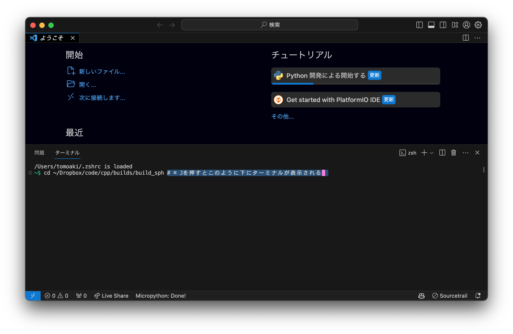
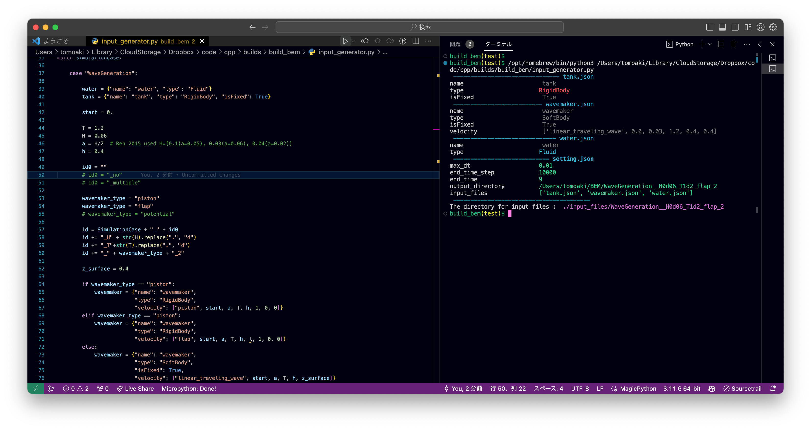

# 基本的な使い方

## コンパイルと実行

### ターミナルを開く

<table>
    <tr>
        <td>
            <figure>
                <br>
                <figcaption>ターミナルを開いてファイルのあるディレクトリまで移動する</figcaption>
            </figure>
        </td>
        <td>
            <figure>
                <br>
                <figcaption>または，vscodeを開き，Ctrl + jでターミナルを開き，ファイルのあるディレクトリまで移動する</figcaption>
            </figure>
        </td>
    </tr>
</table>


### `main.cpp`が保存されているディレクトリに移動する．

```shell
cd ~/code/cpp/builds/build_bem　#　ビルドディレクトリに移動
code ./ # vscodeで開く
```

### 実行する際に読み込ませる入力ファイルを作成する．

`input_generator.py`を実行すると，インプットファイルが生成される．



この場合，最後に表示されている`./input_files/WaveGeneration_flap_H0d06_T1d2_h0d4`がインプットファイルが保存されているディレクトリ．

#### 入力ファイルは

ディレクトリ`./input_files/WaveGeneration_flap_H0d06_T1d2_h0d4`の中には，JSON形式のファイルが保存されている．

* setting.json
* tank.json
* water.json
* wavemaker.json

例えば，`input_files/WaveGeneration_flap_H0d06_T1d2_h0d4/wavemaker.json`は以下のような内容になっていて，使用するobjファイルのパスや，波の生成方法などが記述されている．

```json
{
    "name": "wavemaker",
    "type": "SoftBody",
    "isFixed": true,
    "velocity": [
        "linear_traveling_wave",
        0.0,
        0.03,
        1.2,
        0.4,
        0.4
    ],
    "objfile": "/Users/tomoaki/Library/CloudStorage/Dropbox/code/cpp/builds/build_bem/../../../../code/cpp/obj/WaveGeneration/wavemaker10.obj"
}
```

### コンパイルして実行する．

コンパイルには`cmake`を使用している．`cmake`は，`CMakeLists.txt`に書かれた内容に従って，ヘッダファイルやライブラリを探して，コンパイルを行い，実行ファイルを生成する．

```shell
sh clean # 古いCMakeFilesなどを削除する．
cmake -DCMAKE_BUILD_TYPE=Release ../　# Releaseモードでコンパイルする．
make　# コンパイル（ビルド）する．
```

実行する．

```shell
./main ./input_files/WaveGeneration__H0d06_T1d2_flap_2　# 実行する．
```

その他利用するコマンド：

* 強制終了: Ctrl + C

# 比較対象

