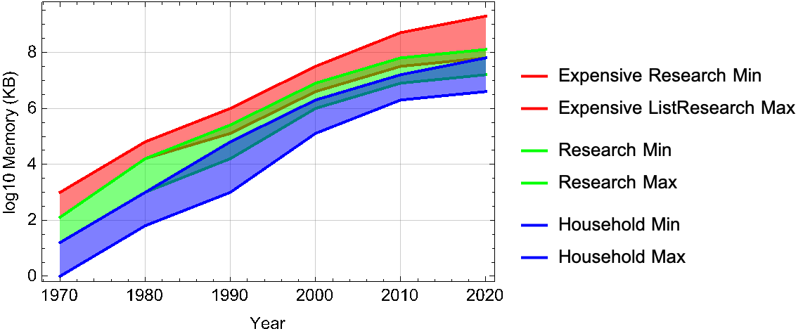

# BEM-MEL

## BEM-MEL について

### 三角関数を使った古典的な解析手法

水面がどのような微分方程式に従って運動するか調べると，
非粘性非圧縮渦なしを仮定しても，水面における境界条件は非線形である．

立てた連立偏微分方程式（境界条件と連続の式）を満たすような，関数，つまり解を，
三角関数の重ね合わせで求めようとすることは自然で賢い発想であり，この解析方法はある程度の成功を収めてきた．
この方法による線形理論はよく知られており水面波の基礎となっている．
また，摂動法を使って弱い非線形性をうまく取り込み三角関数で解を求めることもこの解析手法の延長線上にあり，よく行われている．

しかし，
複雑な形状を境界に持つ場合や，波が激しい場合においては，
この解析方法で課すことになる周期境界条件や，弱非線形性までしか考慮しないことが，
果たして結果に悪影響を及ぼさないか疑問である．
また，過渡的な現象，実際と同じように時間変化する現象に対する結果を得たい場合には，この解析手法では難しい．

### BEM　周波数領域

BEMを使った周波数領域の解析は，海洋工学の分野で標準的に行われているようだ．
例えば，WAMIT．

\cite{Goupee2014a}
\cite{Simos2018}で紹介されている

よく挙げられるBEM周波数領域の問題点

<!-- makee table using html -->

<table>
  <tr>
    <th>BEM周波数領域</th><th>BEM時間領域</th>
  </tr>
  <tr>
    <td>
        <ul>
            <li>境界条件が線形でない</li>
            <li>非線形性を考慮できない</li>
            <li>過渡的な現象を考慮できない</li>
        </ul>        
    </td>    
    <td>
        <ul>
            <li>境界条件が線形である</li>
            <li>非線形性を考慮できる</li>
            <li>過渡的な現象を考慮できる</li>
        </ul>
    <td>
    </td>
  </tr>
</table>

### BEM-MEL　時間領域

1970 年代のコンピュータのメモリ容量は小さく，計算速度も遅かった．
当時開発された正方格子上でのシミュレーション手法を使って，
巻波砕破のシミュレーションを行おうと格子を細かくすると，
直ぐにメモリ容量を超えてしまい，また計算速度の問題もあって，正方格子を使った計算は現実的ではなかった．
これに対して，
\cite{Longuet-Higgins1976}は，境界線上だけに計算点を設け，
その計算点の位置と速度ポテンシャルをラグランジュ的に時間発展させる方法を提案した．
水面で$`\frac{D\phi}{Dt}`$が簡単に計算できること，
流速(速度ポテンシャルの勾配)を計算するために，
$`\phi`$の接線方向微分$`\frac{\partial \phi}{\partial s}`$は節点の微分を使って，
法線方向微分$`\frac{\partial \phi}{\partial n}`$は境界積分方程式を解くことで計算できることを利用した．

NOTE: メモリ容量の変化

現在，メモリ容量は，以前と比べて格段に大きくなり，メモリの節約を考える必要がなくなった．
また，領域型の計算手法で作られる代数連立１次方程式の係数行列は，疎行列であることが多く，
節点数は多けれども，疎行列なら反復解法を使って高速に解を求めることができる．
一方で，境界型の計算手法は，密行列を作る必要があり，密行列の生成には計算がかかる．

$`O(n_p^2)`$，$`O(n_d^3)`$
仮に$`n_p=L^3`$，$`n_d=6L^2`$としよう
$`O(L^6)`$，$`O(216 L^6)`$

つまり，当初の BEM-MEL の優位は，現在では他の手法にうばわれてしまっている．

#### BEM-MEL の問題点

BEM-MEL の結果に数値的な不安定が生じることは，\cite{Longuet-Higgins1976}が既に紹介している．
計算精度を悪化させる原因は様々なものが考えられる．
例えば，係数行列を作成する際，つまり微分方程式を離散化する際に用いる，補間の精度や積分の精度．
または，時間発展の際に用いる，時間積分の精度などである．

補間と積分はセットで使うので，どちらが原因かを切り分けるのは難しい．
積分精度だけを考えても，数値積分手法の改良や，解析的な改良などが考えられる．
補間精度だけを考えても，補間手法の改良や，補間点の位置の調整などが考えられる．

### BEM-MEL の改良

続く研究目的は，BEM-MEL の改良に向けられた．

### 浮体動揺解析

浮体の動揺解析を行うためには，次のようなステップを踏む．

1. 浮体に掛かる力とトルクを計算し，
2. 力と重心に関する運動方程式（トルクと角運動量に関する運動方程式）から加速度（角加速度）を求め，
3. 加速度（角加速度）を積分し速度（角速度）を更新し，
4. 速度（角速度）を積分し位置（姿勢）を更新する

浮体に掛かる圧力を面積分することで力を計算できるが，BEM-MEL では，圧力の計算で必要となる$`\phi_t`$が簡単には計算できない．
これは，FEM-MEL でも同じで，MEL を使った場合に共通雨したことである(これに関しては\cite{Ma2009}に詳しく書かれている)．

\cite{Wu1996}や\cite{Kashiwagi2000}，\cite{Wu2003}の方法は，初めに$`\phi_t`$を計算し，次に圧力，力と計算して行くのではなく，
BIE と補助関数を使って，始めから圧力の面積分つまり力を別の変数の面積分として表した．
これと運動方程式を連立することで，直接，加速度を求めることができる．
\cite{Feng2017}は，この方法を発展させ２浮体の動揺解析を行っている．

本当に，複数の浮体に適用しにくい方法なのか？

#### なぜ今BEM-MELを開発するのか

高速多重極展開（FMM）を使った流体-物体相互作用解析は未だに達成されていないようで，
流体-物体相互作用解析においてBEM-MELが限界まで研究開発されたかというと，そうではないようだ．

##### なぜFMMを使った流体-物体相互作用解析が難しいのか？

流体-物体相互作用解析を行うには，２つの境界値問題を解く必要がある．
現在の計算手法は，一つ目の境界値問題で得られた係数行列の逆行列を再利用することで，計算コストを抑えている．

NOTE: 逆行列を使う方法

* **補助関数を使う方法**

補助関数（１浮体につき６つ増える）に関する境界値問題を解く必要がある（$`\phi`$-$`\phi_n`$に関するBIEの係数行列の行列を再利用することで高速化）．

\cite{Feng2017}から，補助関数を使う方法も係数行列が共通であるため計算コストを抑えることができるということがわかる．
言い換えれば，逆行列を使い回すことで，計算コストを抑えるということである．

> To compute the auxiliary functions, extra boundary value problems (BVPs) have to be solved. As th auxiliary functions share the same coefficient matrix with the velocity potential when proper boundary conditions are imposed, they are solved simultaneously with the potential, and not much additional computational effort is needed for solving these extra BVPs for the auxiliary functions.

しかし，FMMで利用されるGMRESのような反復解放を使うと，逆行列は求まらないし，計算が係数行列だけでなく右辺ベクトルにも依存するため，境界値問題をひとつひとつ個別に解く必要がある．

* **補助関数を使わない方法**

反復毎に境界値問題を解き$`\phi_t`$を計算する必要がある（$`\phi`$-$`\phi_n`$に関するBIEの係数行列の行列を再利用することで高速化）．

補助関数を使わない，$`\phi_t`$を反復して計算し徐々に収束させる方法も，逆行列がなければ反復毎に係数行列を求める必要がある．

そのため，逆行列に依存しない高速化手法が必要である．
その方法の指針として，境界値問題を一つにまとめることが考えられる．