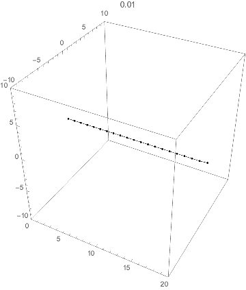

# Contents
- [🐋 ケーブルの動的解析](#-ケーブルの動的解析)
    - [⛵ 直線要素を用いたシミュレーション](#-直線要素を用いたシミュレーション)
    - [⛵ 実行方法](#-実行方法)
    - [⛵ ⛵ 浮体係留用に`Network`の派生クラスを作成](#--浮体係留用にnetworkの派生クラスを作成)


---
```shell
sh clean
cmake -DCMAKE_BUILD_TYPE=Release ../ -DSOURCE_FILE=example_rupture.cpp
make
./example_rupture
```

[./example_rupture.cpp#L15](./example_rupture.cpp#L15)

```shell
sh clean
cmake -DCMAKE_BUILD_TYPE=Release ../ -DSOURCE_FILE=example_using_Network.cpp
make
./example_using_Network
```

[./example_using_Network.cpp#L15](./example_using_Network.cpp#L15)

# 🐋 ケーブルの動的解析 

## ⛵ 直線要素を用いたシミュレーション 

💡 弦の振動を支配する方程式として，波動方程式$`\frac{\partial^2 u}{\partial t^2} = c^2 \frac{\partial^2 u}{\partial x^2}`$よく紹介される．
この方程式は，ある固定した点$`x`$における弦の変位$`u`$の加速度が，弦の曲げ剛性$`c^2`$かける曲率に比例することを表している．

直線で結ばれた節点上にケーブルの自重を集中させ，その節点に働く張力や重力から，節点の運動を追っていく．

剛性は，ヤング率$`E`$と断面積$`A`$から$`EA`$．
張力$`T`$は，$`T = EA \frac{\Delta L}{L}`$となる．

オイラー法，Leap-Frog法，Runge-Kutta法を用いて，弾性体の動きをシミュレーション．

* 剛性$`[N/m]`$:$`1400 \times 10^6`$
* 減衰$`[N/(m/s^2)]`$:$`0.9`$
* 自然長$`[m]`$:$`1`$



`const double stiffness = 10000;`の場合


チェーン

## ⛵ 実行方法 

```shell
sh clean
cmake -DCMAKE_BUILD_TYPE=Release ../
make
```

## ⛵ ⛵ 浮体係留用に`Network`の派生クラスを作成  

`networkLine`には，`natural_length`，`stiffness`，`damping`，`weight_per_unit_length`の4つのパラメータを持たせる．
`natural_length`は，`moorinLine`の`total_length`と`MooringLine`の`getPoints().size()`から決まる．
それをまとめる`MooringLine`は，`total_length`を持つ．

```cpp
const int n_points = 100;
const double total_length = 522.; //! [m]
std::array<double,3> X_anchor = {r * std::cos(0.), r * std::sin(0.), h}
std::array<double,3> X_ = {0., 0., 0.}
auto mooring = new MooringLine(X_anchor, X_fairlead, total_length, n_points);　//mooringオブジェクトの作成
```

次のように物性の設定を行う．

```cpp
mooring->setDensityStiffnessDampingDiameter(density, stiffness, damp, diam);
```

考えられる係留索クラスの使い道は，
単点（フェアリード）の位置がわかっていて，そこでの係留索が及ぼす力を計算するというもの．
前時刻の係留索の曲線から，少しずつ係留索を時間発展させて，現在の係留索の曲線を求め，その節点の配置から，力を計算できる．
移動速度がわかっている節点にはその条件を与え，わからないものに関しては，各時刻の張力と重力と抗力から，運動方程式を解いていく．
[../../include/MooringLine.hpp#L6](../../include/MooringLine.hpp#L6)

[./main.cpp#L16](./main.cpp#L16)

---
