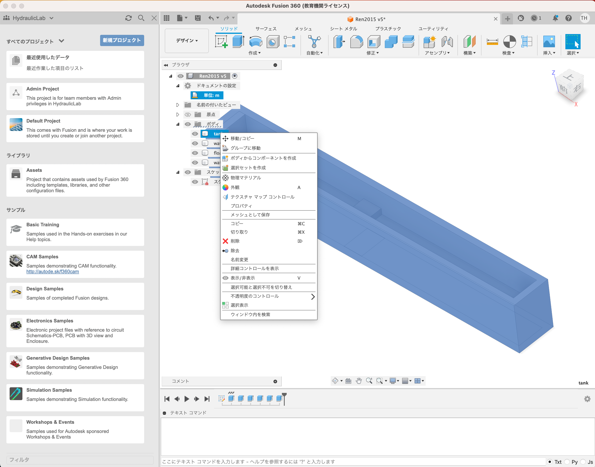
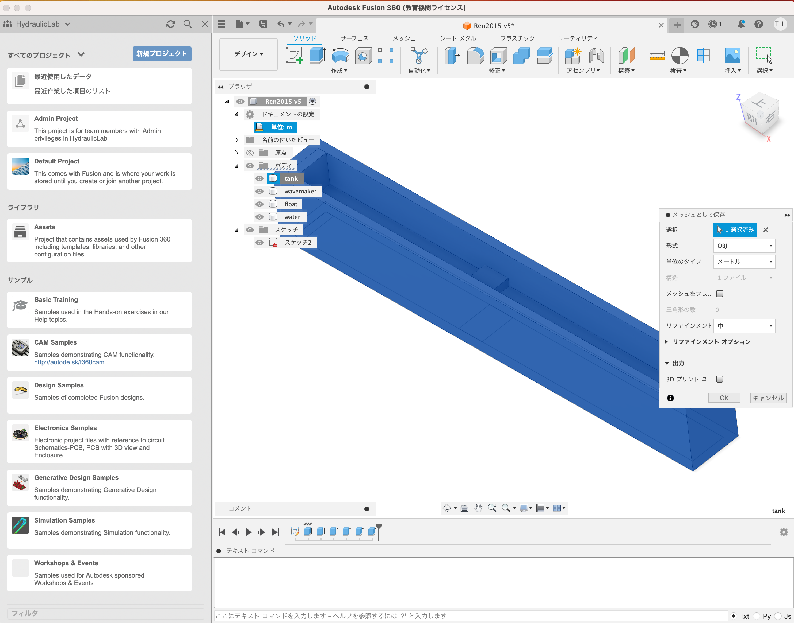
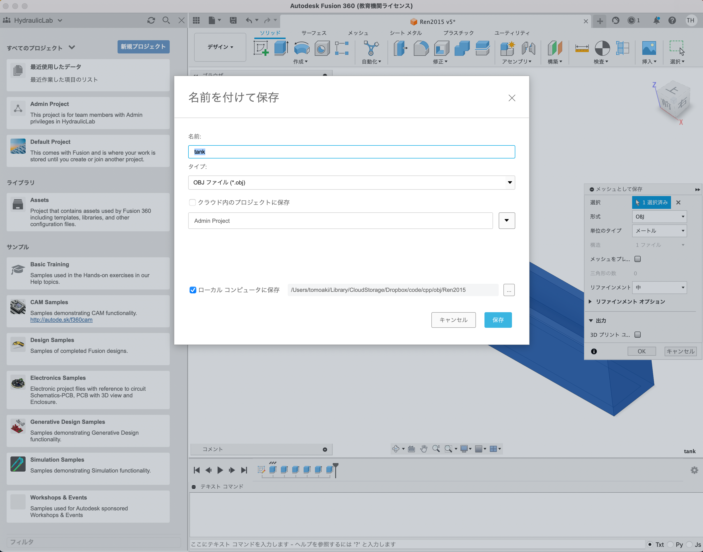
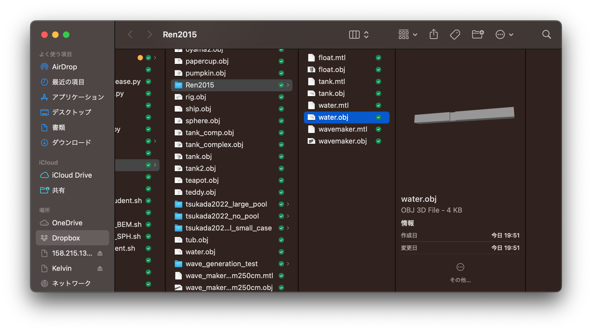

# Contents

- [🐋 Fusion360を使って計算用objファイルを生成](#🐋-Fusion360を使って計算用objファイルを生成)
- [🐋 計算用にメッシュの細分化](#🐋-計算用にメッシュの細分化)
    - [⛵ メッシュの細分化の方法](#⛵-メッシュの細分化の方法)
        - [🪼 🪼 `flip`可能かどうかの判定](#🪼-🪼-`flip`可能かどうかの判定)
        - [🪼 🪼 格子の平滑化](#🪼-🪼-格子の平滑化)
    - [⛵ 実行ファイルの作成方法（`remesh.cpp`のコンパイル方法）](#⛵-実行ファイルの作成方法（`remesh.cpp`のコンパイル方法）)
    - [⛵ 実行方法](#⛵-実行方法)


---
# 🐋 Fusion360を使って計算用objファイルを生成 









# 🐋 計算用にメッシュの細分化 

## ⛵ メッシュの細分化の方法 

### 🪼 🪼 `flip`可能かどうかの判定  

[`canFlip`](../../include/networkLine.hpp#L1618)でフリップ可能かどうかを判定する．直感的に次のような条件の場合，境界面が崩れるため，フリップさせたくない．

* フリップ前後で，辺に隣接する面の面積の和が大きく変化する場合，フリップさせない
* フリップ前後で，辺に隣接する面の法線ベクトルが大きく変換する場合，フリップさせない

しかし，これの判定において必要となる計算：三角形の内角や法線方向，ベクトルの成す角度の計算は，精確に判定できない領域があるようだ．
なので，その領域をおおよそ実験的に調べて，まずはその領域に入らせない条件を設ける（信頼できる三角形）．
次のような三角形は信頼しない：

* 三角形の内角が小さすぎる，または大きすぎる場合
* 内角の和が$`\pi`$にならない場合

信頼できる三角形の判定には，[`isValidTriangle`](../../include/basic_vectors.hpp#L1754)を用いる．

[../../include/networkLine.hpp#L1598](../../include/networkLine.hpp#L1598)


### 🪼 🪼 格子の平滑化  

境界面を格子を綺麗な状態に整えるために，境界面の点を移動させる．
移動方法は，様々考えられる．

| 移動方法 | 説明 |
|:-------|:---------|
| Laplacian smoothing                     | 境界面の点をその点の近傍の点の重心に移動させる．          |
| Area weighted smoothing                 | 隣接面の面積の重みを掛けて，面の中心に移動させる．        |
| Distorsion measure weighted smoothing   | 隣接面の歪みに関する係数を重みとして掛けて，面の中心に移動させる．|

共通点は，許されない移動を防止する移動前に，移動後の形状をチェックすることである．
`canFlip`と同様，[`isValidTriangle`](../../include/basic_vectors.hpp#L1754)を用いる．

徐々に移動させる場合，誤差の蓄積，条件の変化を把握するのが難しい．
大きな変化は防げても，小さな変化には対応できない場合が考えられる．

[../../include/NetworkUtility.hpp#L115](../../include/NetworkUtility.hpp#L115)


## ⛵ 実行ファイルの作成方法（`remesh.cpp`のコンパイル方法） 

1. `sh clean`で古いファイルを削除する．
2. `cmake`を使って，`CMakeLists.txt`から`Makefile`を生成する．（リリースビルドタイプを指定し，ソースファイルを`remesh.cpp`に設定）
3. `make`コマンドで，`Makefile`に基づいて実行ファイルをコンパイルする.

```shell
$ sh clean
$ cmake -DCMAKE_BUILD_TYPE=Release ../ -DSOURCE_FILE=remesh.cpp
$ make
```

`remesh`という実行ファイルができる．

## ⛵ 実行方法 

`n`回の細分化を行う．

```
./remesh input_file output_dir output_name n
```


出力は，`output_dir/output_name*.vtu`と`output_dir/output_name*.obj`．


次は，入力ファイルを生成し，計算をする．


[./remesh.cpp#L5](./remesh.cpp#L5)


---
