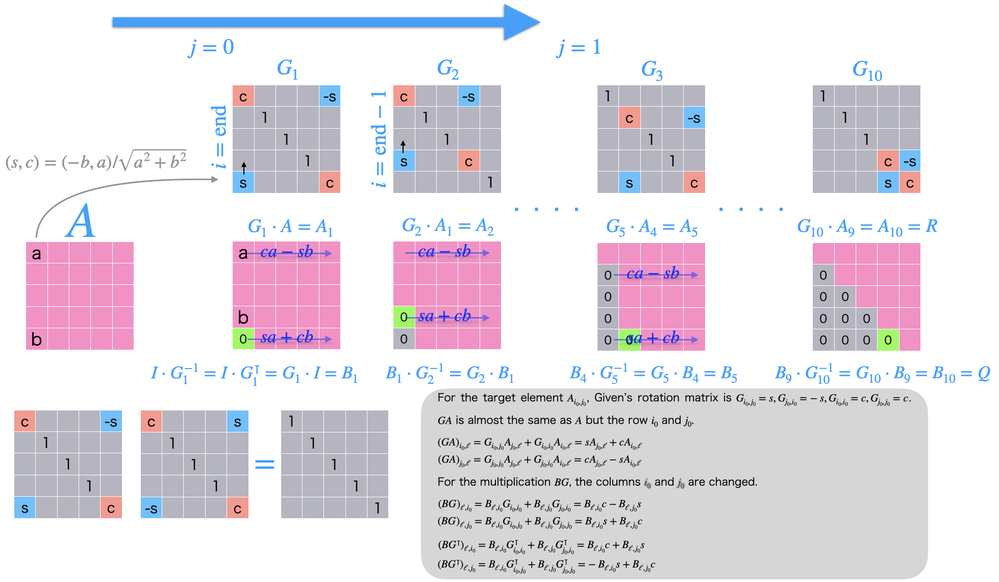

# Contents
- [🐋 固有値問題](#🐋-固有値問題)
    - [⛵ 固有値の計算](#⛵-固有値の計算)
    - [⛵ ⛵ QR分解](#⛵-⛵-QR分解)
        - [🪼 🪼 ギブンズ回転](#🪼-🪼-ギブンズ回転)
            - [🪸 🪸 ヘッセンベルグ行列に対するQR分解](#🪸-🪸-ヘッセンベルグ行列に対するQR分解)


---
# 🐋 固有値問題 

## ⛵ 固有値の計算 

行列$`A`$をQR分解$`A=QR`$し，
$`A _k = Q _k^{-1} A Q _k`$の計算を繰り返すことで，
$`A _k`$の対角成分が$`A`$の固有値に収束することを確認する．

わかりやすいように$`\cdot`$で行列の積を表す．

```math
Q _2^{-1} \cdot (Q _1^{-1} \cdot (Q _0^{-1} \cdot (A = Q _0R _0) \cdot Q _0=Q _1R _1) \cdot Q _1=Q _2 \cdot R _2) \cdot R _2
```

テストケース

```Mathematica
In[23]:= A = Table[i*j + i*i + j*j + i + j, {i, 1, 5}, {j, 1, 5}]
Eigenvalues[N@A]

Out[23]= {{5, 10, 17, 26, 37}, {10, 16, 24, 34, 46}, {17, 24, 33, 44,
57}, {26, 34, 44, 56, 70}, {37, 46, 57, 70, 85}}

Out[24]= {210.296, -15.5105, 0.214605,
1.64434*10^-14, -1.77456*10^-15}
```


```shell
sh clean
cmake -DCMAKE_BUILD_TYPE=Release .. -DSOURCE_FILE=testEigenValues.cpp
make
./testEigenValues
```

[./testEigenValues.cpp#L11](./testEigenValues.cpp#L11)

---
## ⛵ ⛵ QR分解  

QR分解は，行列を直交行列と上三角行列の積に分解することである．
このQR分解では，ギブンズ回転を用いてQR分解を行っている．

$`I = F _1^{-1} F _1`$となるような$`F _1`$があるとする．これを使えば，

```math
\begin{align*}
A&=IA\\
&=F _1^{-1} F _1 A \quad {\text{where}}\quad I = F _1^{-1} F _1
\end{align*}
```

となる．これを繰り返した結果
$`A = F _1^{-1} F _2^{-1} ...F _n^{-1} F _n ... F _2 F _1 A`$の内，
$`R = F _n ... F _2 F _1 A`$が上三角行列となってくれれば，これはQR分解である．
$`Q`$は$`Q = F _1^{-1} F _2^{-1} ...F _n^{-1}`$．

### 🪼 🪼 ギブンズ回転  

そんな都合がいい$`F _1`$はどうやって作るのか？

少なくとも
$`F _1 = \begin{pmatrix} \cos\theta & \sin\theta \\ -\sin\theta & \cos\theta \end{pmatrix}`$と決めると，$`F _1`$は直交行列となり，

```math
\begin{align*}
F _1^{-1} &= F _1^{T}\\
\rightarrow I&=F _1^{T} F _1=F _1^{-1} F _1
\end{align*}
```

あとは，$`R = F _n ... F _2 F _1 A`$が上三角行列となってくれるような，$`\cos\theta`$と$`\sin\theta`$を決めればよい．

そうするには，$`F _1 A`$を計算する際に，左下の成分をゼロにするように$`\theta`$を決めればよい．
次に，$`F _2`$を決める際に，$`F _2 F _1 A`$の左下の一つ上の成分をゼロにするように$`\theta`$を決めればよい．

というふうに繰り返す．

後で具体的にどのような値をかけているかここに示しておく．

#### 🪸 🪸 ヘッセンベルグ行列に対するQR分解  

$`A`$がヘッセンベルグ行列の場合，
ゼロとする必要がある成分は，$`A _{i+1,i}`$のみである．
そのため，普通のQR分解の計算量が$`O(n^2)`$であるのに対し，ヘッセンベルグ行列の場合は$`O(n)`$である．
[../../include/basic_linear_systems.hpp#L912](../../include/basic_linear_systems.hpp#L912)




[./testQR.cpp#L11](./testQR.cpp#L11)

---
