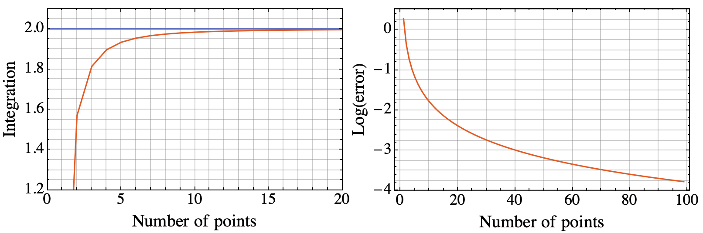
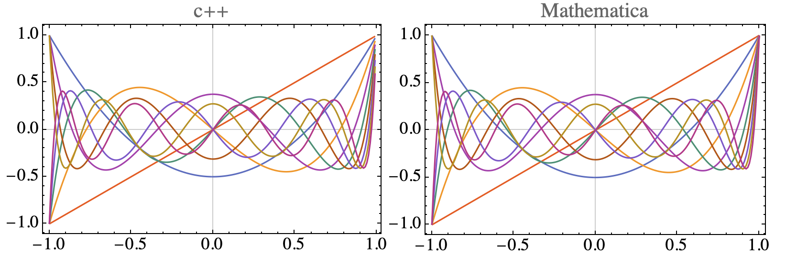
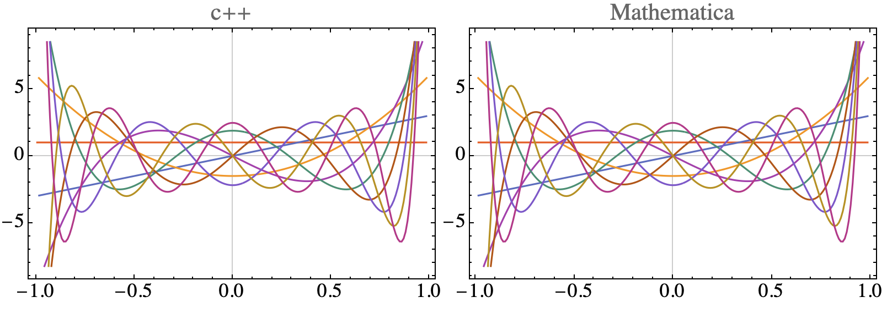

# Contents
- [🐋 数値積分](#🐋-数値積分)
    - [⛵ 台形則](#⛵-台形則)
        - [🪼 例](#🪼-例)
    - [⛵ ルジャンドル多項式，ルジャンドル補間，ガウス・ルジャンドル積分](#⛵-ルジャンドル多項式，ルジャンドル補間，ガウス・ルジャンドル積分)


---
# 🐋 数値積分 

## ⛵ 台形則 

```shell
cmake -DCMAKE_BUILD_TYPE=Release ../ -DSOURCE_FILE=TrapezoidalRule.cpp
make
./TrapezoidalRule
```

台形則は，関数の積分を台形の面積の和で近似する方法である．

```math
\int _a^b f(x) dx \approx \left(\frac{f(a)+f(b)}{2} + \sum _{i=1}^{N-1} f(a+i\Delta x)\right)\Delta x, \quad \Delta x = \frac{b-a}{N}
```

### 🪼 例 

* $`\int _0^\pi \sin(x) dx = 2`$



特異性のある積分の例：

* $`\int _\varepsilon^\pi \frac{1}{x} dx = \log{\pi} - \log{\varepsilon}`$

<image src="results_1_x.png" width="700">

* $`\int _0^1 \sqrt{1-x^2} dx = \frac{\pi}{4}`$

<image src="results_1sqrt1xx.png" width="700">

* $`\int _0^1 \frac{1}{\sqrt{1-x^2}} dx = \frac{\pi}{2}`$

<image src="results_sqrt1xx.png" width="700">

[./TrapezoidalRule.cpp#L4](./TrapezoidalRule.cpp#L4)

---
## ⛵ ルジャンドル多項式，ルジャンドル補間，ガウス・ルジャンドル積分 

```sh
sh clean
cmake -DCMAKE_BUILD_TYPE=Release ../ -DSOURCE_FILE=LegendrePolynomials.cpp
make
./LegendrePolynomials
```

Mathematicaの結果とcppの結果を比較:





`結果のチェック.nb`で結果を確認．

[./LegendrePolynomials.cpp#L7](./LegendrePolynomials.cpp#L7)

---
ガウス求積法は，ルジャンドル多項式の根を利用して関数の積分を近似する方法である．
`GaussianQuadrature`では，以下のようにして，根の初期値を与え，ニュートンラフソン法を用いて正しい根へと収束させる．

```cpp
const bool is_even = (N % 2 == 0);
const int M = (is_even ? N / 2 : (N + 1) / 2);
int k = 0;
for (int i = 1; i <= M; ++i)
x[k++] = -std::sin(M_PI * (N + 1 - 2 * i) / (2. * N + 1.));  //! first guess
for (int i = (is_even ? 0 : 1); i < N - M + (is_even ? 0 : 1); ++i)
x[k++] = -x[M - i - 1];
```

`GaussianQuadrature`のメンバ変数`x`には，ルジャンドル多項式の根が，`w`には，各点でのガウス求積の重みが格納される．


基本的には台形則による数値積分よりも，ガウス求積法の方が精度が高い．

```shell
sh clean
cmake -DCMAKE_BUILD_TYPE=Release ../ -DSOURCE_FILE=GaussianQuadrature.cpp
make
./GaussianQuadrature
```

##　⛵ 特異積分

[./GaussianQuadratureWeights.cpp#L8](./GaussianQuadratureWeights.cpp#L8)

---
