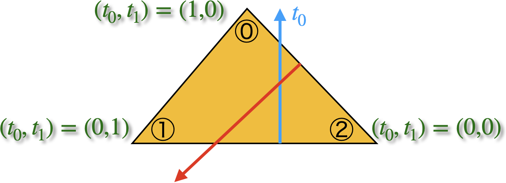
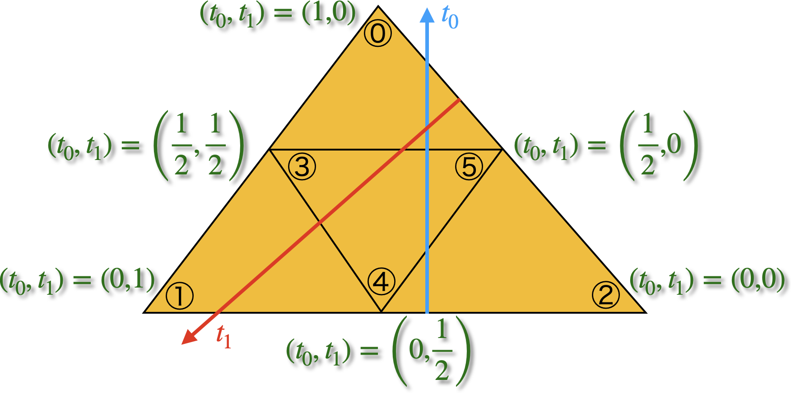

# Contents
- [🐋 補間](#🐋-補間)
    - [⛵ ラグランジュ補間](#⛵-ラグランジュ補間)
    - [⛵ 三角形を使った補間](#⛵-三角形を使った補間)
        - [🪼 三角分割](#🪼-三角分割)
        - [🪼 🪼 三角形形状関数](#🪼-🪼-三角形形状関数)
        - [🪼 🪼 範囲 {t_0,t_1} = {[0,1],[0,1]} -> [t0,t1]=[0,1],[0,1-t0]](#🪼-🪼-範囲-{t_0,t_1}-=-{[0,1],[0,1]}-->-[t0,t1]=[0,1],[0,1-t0])
        - [🪼 例：補間によって，頂点座標から平面を作成する](#🪼-例：補間によって，頂点座標から平面を作成する)
    - [⛵ 接続関係を利用した補間精度の向上（擬2次補間）](#⛵-接続関係を利用した補間精度の向上（擬2次補間）)
    - [⛵ 接続関係を利用した補間精度の向上](#⛵-接続関係を利用した補間精度の向上)
    - [⛵ B-spline補間](#⛵-B-spline補間)
        - [🪼 実行方法](#🪼-実行方法)
        - [🪼 コード](#🪼-コード)
    - [⛵ ⛵ 放射関数補間](#⛵-⛵-放射関数補間)
        - [🪼 🪼 重み$`w _i`$の見積もり](#🪼-🪼-重み$`w-_i`$の見積もり)
        - [🪼 🪼 放射基底関数$`\phi`$](#🪼-🪼-放射基底関数$`\phi`$)
            - [🪸 🪸 多重二乗（multiquadric RBF）](#🪸-🪸-多重二乗（multiquadric-RBF）)
            - [🪸 🪸 逆多重二乗（inverse multiquadric RBF）](#🪸-🪸-逆多重二乗（inverse-multiquadric-RBF）)
            - [🪸 🪸 ガウシアン（Gaussian RBF）](#🪸-🪸-ガウシアン（Gaussian-RBF）)
        - [🪼 🪼 補間関数の微分](#🪼-🪼-補間関数の微分)
            - [🪸 🪸 多重二乗](#🪸-🪸-多重二乗)
            - [🪸 🪸 逆多重二乗](#🪸-🪸-逆多重二乗)
            - [🪸 🪸 ガウシアン](#🪸-🪸-ガウシアン)
        - [🪼 🪼 最適なパラメタ$`{\varepsilon}`$](#🪼-🪼-最適なパラメタ$`{\varepsilon}`$)


---
# 🐋 補間 

## ⛵ ラグランジュ補間 

与えられたデータ点を通る多項式を求める方法の一つにラグランジュ補間がある．

```math
f(x) = \sum _{i=0}^n\dfrac{\prod _{j=0,j\neq i}^n{(x - x _j)}}{\prod _{j=0,j\neq i,j\neq k}^n{(x _i - x _j)}}y _i
```

微分は，

```math
f(x) = \sum _{i=0}^n\dfrac{\sum _{k=0}^{n}\prod _{j=0,j\neq i}^n{(x - x _j)}}{\prod _{j=0,j\neq i}^n{(x _i - x _j)}}y _i
```


[./interpolation_Lagrange.cpp#L12](./interpolation_Lagrange.cpp#L12)

---
## ⛵ 三角形を使った補間 

### 🪼 三角分割 

```shell
sh clean
cmake -DCMAKE_BUILD_TYPE=Release ../ -DSOURCE_FILE=TriangleParameterSubdivision.cpp
make
./TriangleParameterSubdivision
```

* `SubdivideTriangleIntoTriangles` で三角形を分割
* `SubdivideSquareIntoTriangles` で矩形領域を三角形に分割

`plot_parametric_subdivision.nb` で描画


`ModTriShape`を使うと，(t0,t1)=([0,1],[0,1])領域を(xi0,xi1)=([0,1],[0,1-t0])の三角形に変換できる．


[./TriangleParameterSubdivision.cpp#L11](./TriangleParameterSubdivision.cpp#L11)

---
### 🪼 🪼 三角形形状関数  

線形の三角形形状関数は，$`t _2 = 1-t _0-t _1`$として，

```math
(N _0, N _1, N _2) = (t _0, t _1, t _2)
```

2次の三角形形状関数は，$`t _2 = 1-t _0-t _1`$として，

```math
(N _0, N _1, N _2, N _3, N _4, N _5) = (t _0(2t _0-1), t _1(2t _1-1), t _2(2t _2-1), 4t _0t _1, 4t _1t _2, 4t _2t _0)
```

ちなみに，節点3と節点5の線上のパラメタは，$`t _0 = 1/2`$である．
これを2次補間の形状関数に代入すると，

```math
(N _0, N _1, N _2, N _3, N _4, N _5) = (0, t _1(2 t _1-1), t _1 (2 t _1-1), 2 t _1, 2 (1 - 2 t _1) t _1, 1 - 2 t _1)
```

となり，この線上では，節点0の影響を受けず，補間値はそれ以外の（内部）の情報からのみ決まる．
[../../include/basic_arithmetic_array_operations.hpp#L1110](../../include/basic_arithmetic_array_operations.hpp#L1110)


| 線形補間 | 2次補間 |
| --- | --- |
|  |  |

### 🪼 🪼 範囲 {t_0,t_1} = {[0,1],[0,1]} -> [t0,t1]=[0,1],[0,1-t0]  

普通の三角形形状関数は，$`{\mathbf N}=(N _0,N _1,N _2) = (t _0,t _1,1-t _0-t _1)`$．
これを使った，$`{\rm Dot}({\mathbf N},\{{\mathbf X _0},{\mathbf X _1},{\mathbf X _2}\})`$は，$`t _0,t _1=[0,1]`$で平行四辺形を作る．
$`t _0,t _1=[0,1]`$の範囲で，三角形を形成するように変数変換したいことがある．
そのたびに，変数変換をプログラムするのは面倒なので，予め形状関数自体を変更しておく．
変更した形状関数は，`ModTriShape`にあるように，

3点の場合は，

```math
(N _0,N _1,N _2) = (t _0, t _1(1 - t _0),(t _0-1)(t _1-1))
```

6点の場合は，

```math
(N _0,N _1,N _2,N _3,N _4,N _5) = (t _0(2t _0-1), t _1(2t _1-1), (1-t _0-t _1)(2(1-t _0-t _1)-1), 4t _0t _1, 4t _1(1-t _0-t _1), 4t _0(1-t _0-t _1))
```
[../../include/basic_arithmetic_array_operations.hpp#L1245](../../include/basic_arithmetic_array_operations.hpp#L1245)


### 🪼 例：補間によって，頂点座標から平面を作成する 


```shell
sh clean
cmake -DCMAKE_BUILD_TYPE=Release ../ -DSOURCE_FILE=TriShape.cpp
make
./TriShape
```

[./TriShape.cpp#L1](./TriShape.cpp#L1)

---
## ⛵ 接続関係を利用した補間精度の向上（擬2次補間） 

```shell
sh clean
cmake -DCMAKE_BUILD_TYPE=Release ../ -DSOURCE_FILE=TriShapeExample_improved_test1.cpp
make
./TriShapeExample_improved_test1
```

2次補間を利用する，要素は，2次要素と呼ばれ，
一般的には，三角形の頂点に加え，辺上にもサンプル点を配置する．

[./TriShapeExample_improved_test1.cpp#L1](./TriShapeExample_improved_test1.cpp#L1)

---
## ⛵ 接続関係を利用した補間精度の向上 

```shell
sh clean
cmake -DCMAKE_BUILD_TYPE=Release ../ -DSOURCE_FILE=TriShapeExample_improved_test2.cpp
make
./TriShapeExample_improved_test2
```

[./TriShapeExample_improved_test2.cpp#L1](./TriShapeExample_improved_test2.cpp#L1)

---
## ⛵ B-spline補間 

与えられたデータ点を通る多項式を求める方法の一つにB-spline補間がある．

### 🪼 実行方法 

```sh
$ cmake -DCMAKE _BUILD _TYPE=Release ../ -DSOURCE _FILE=interpolation _Bspline.cpp
$ make
$ ./interpolation _Bspline
$ gnuplot bspline_plot.gnu
```

### 🪼 コード 

[Bspline基底関数](../../include/basic.hpp#L834)を用いて，B-spline補間を行う．

`InterpolationBspline`は，`std::vector<double>`または`std::vector<std::array<double,N>>`を引数に取ることができる．

```cpp
// example for 1D data
std::vector<double> X;
InterpolationBspline intpX(5, abscissas, X);
```


```cpp
// example for 2D data
std::vector<std::arrray<double,2>> XY;
InterpolationBspline intpXY(5, abscissas, XY);
```

または，クラスを使いまわしたい場合，`set`メンバ関数を用いて，データをセットすることもできる．

```cpp
InterpolationBspline<std::array<double, 2>> intpXY;
intpXY.set(5, abscissas, XY);
```


## ⛵ ⛵ 放射関数補間  

距離$`r=\left\| \mathbf{x}-{{\mathbf{a}} _{i}} \right\|`$を引数とする
放射基底関数$`\phi(r _i)`$に重み$`w _i`$を掛け合わせて構築した
補間関数$`f\left( \mathbf{x} \right)=\sum\limits _{i=0}^{N-1}{{{w} _{i}}\phi \left( \left\| \mathbf{x}-{{\mathbf{a}} _{i}} \right\| \right)}`$
を放射関数補間という．

### 🪼 🪼 重み$`w _i`$の見積もり  

重み$`w _i`$の決定には，サンプル点$`A=\left\{ {{\mathbf{a}} _{0}},{{\mathbf{a}} _{1}},...,{{\mathbf{a}} _{N-1}} \right\}`$
における値$`Y=\left\{ {{y} _{0}},{{y} _{1}},...,{{y} _{N-1}} \right\}`$
を使い，補間関数$`f`$も各サンプル点$A$において値$`Y`$となる方程式を$`w _i`$について解く：

```math
\left( \begin{matrix}
{{w} _{0}}  \\
\vdots   \\
{{w} _{N-1}}  \\
\end{matrix} \right)={{\left( \begin{matrix}
\phi \left( \left\| {{\mathbf{a}} _{0}}-{{\mathbf{a}} _{0}} \right\| \right) & \cdots  & \phi \left( \left\| {{\mathbf{a}} _{0}}-{{\mathbf{a}} _{N-1}} \right\| \right)  \\
\vdots  & \ddots  & \vdots   \\
\phi \left( \left\| {{\mathbf{a}} _{N-1}}-{{\mathbf{a}} _{0}} \right\| \right) & \cdots  & \phi \left( \left\| {{\mathbf{a}} _{N-1}}-{{\mathbf{a}} _{N-1}} \right\| \right)  \\
\end{matrix} \right)}^{-1}}\left( \begin{matrix}
{{y} _{0}}  \\
\vdots   \\
{{y} _{N-1}}  \\
\end{matrix} \right)
```

### 🪼 🪼 放射基底関数$`\phi`$  

#### 🪸 🪸 多重二乗（multiquadric RBF）  

放射基底関数として多重二乗（multiquadric），
$`\phi \left( r \right)={{\left( {{\left( \varepsilon r \right)}^{2}}+1 \right)}^{\frac{1}{2}}}`$
がよく使われる．

#### 🪸 🪸 逆多重二乗（inverse multiquadric RBF）  

$`\phi \left( r \right)={{\left( {{\left( \varepsilon r \right)}^{2}}+1 \right)}^{-\frac{1}{2}}}`$

#### 🪸 🪸 ガウシアン（Gaussian RBF）  

$`\phi \left( r \right)={{e}^{-{{\left( \varepsilon r \right)}^{2}}}}`$

### 🪼 🪼 補間関数の微分  

放射関数補間の微分を少し変形すると，

$`\nabla f\left( \mathbf{x} \right)=\sum\limits _{i=0}^{N-1}{{{w} _{i}}\nabla \phi \left( \left\| \mathbf{x}-{{\mathbf{a}} _{i}} \right\| \right)}=\sum\limits _{i=0}^{N-1}{{{w} _{i}}\nabla {{r} _{i}}\frac{\partial \phi \left( {{r} _{i}} \right)}{\partial {{r} _{i}}}}`$

さらに，計算すると，

```math
\begin{align}
& {{r} _{i}}=\left\| \mathbf{x}-{{\mathbf{a}} _{i}} \right\|={{\left( \sum\limits _{j=0}^{M=2}{{{\left( \mathbf{x}-{{\mathbf{a}} _{ij}} \right)}^{2}}} \right)}^{1/2}} \\
& \frac{\partial {{r} _{i}}}{\partial {{\mathbf{x}} _{k}}}=\frac{1}{2}{{\left( \sum\limits _{j=0}^{M=2}{{{\left( \mathbf{x}-{{\mathbf{a}} _{ij}} \right)}^{2}}} \right)}^{-\frac{1}{2}}}\left( \frac{\partial }{\partial {{\mathbf{x}} _{k}}}\sum\limits _{j=0}^{M=2}{{{\left( \mathbf{x}-{{\mathbf{a}} _{ij}} \right)}^{2}}} \right) \\
& =\frac{1}{2}{{\left( \sum\limits _{j=0}^{M=2}{{{\left( \mathbf{x}-{{\mathbf{a}} _{ij}} \right)}^{2}}} \right)}^{-\frac{1}{2}}}\left( \sum\limits _{j=0}^{M=2}{2\left( \mathbf{x}-{{\mathbf{a}} _{ij}} \right)}\cdot {{\mathbf{e}} _{k}} \right) \\
& ={{\left( \sum\limits _{j=0}^{M=2}{{{\left( \mathbf{x}-{{\mathbf{a}} _{ij}} \right)}^{2}}} \right)}^{-\frac{1}{2}}}\overbrace{\left( {{\mathbf{x}} _{k}}-{{\mathbf{a}} _{ik}} \right)}^{\text{scaler}}=\frac{\overbrace{\left( {{\mathbf{x}} _{k}}-{{\mathbf{a}} _{ik}} \right)}^{\text{scaler}}}{{{r} _{i}}}
\end{align}
```

なので，$`\nabla {{r} _{i}}=\overbrace{\left( \mathbf{x}-{{\mathbf{a}} _{i}} \right)}^{\text{vecotr}}/{{r} _{i}}`$であり，

$`\nabla f\left( \mathbf{x} \right)=\sum\limits _{i=0}^{N-1}{{{w} _{i}}\frac{\mathbf{x}-{{\mathbf{a}} _{i}}}{{{r} _{i}}}\frac{\partial \phi \left( {{r} _{i}} \right)}{\partial {{r} _{i}}}}`$

である．分母がゼロになる可能性があるが，放射基底関数の微分でキャンセルされる．

#### 🪸 🪸 多重二乗  

$`\phi \left( r \right)={{\left( {{\left( \varepsilon r \right)}^{2}}+1 \right)}^{\frac{1}{2}}},\frac{\partial \phi }{\partial r}\left( r \right)=\frac{\varepsilon^2 r}{\phi \left( r \right)}`$

なので，次のように分母を消すことができる．

$`\nabla f\left( \mathbf{x} \right)=\varepsilon^2 \sum\limits _{i=0}^{N-1}{{{w} _{i}}\frac{\mathbf{x}-{{\mathbf{a}} _{i}}}{\phi \left( {{r} _{i}} \right)}}`$

#### 🪸 🪸 逆多重二乗  

```math
\begin{align}
& \phi \left( r \right)={{\left( {{\left( \varepsilon r \right)}^{2}}+1 \right)}^{-\frac{1}{2}}} \\
& \frac{\partial \phi }{\partial r}\left( r \right)=-{{\varepsilon }^{2}}r{{\left( {{\left( \varepsilon r \right)}^{2}}+1 \right)}^{-1}} \\
& \nabla f=\sum\limits _{i=0}^{N-1}{-{{\varepsilon }^{2}}\left( \mathbf{x}-{{\mathbf{a}} _{i}} \right){{\phi }^{2}}\left( r \right)} \\
\end{align}
```

#### 🪸 🪸 ガウシアン  

```math
\begin{align}
& \phi \left( r \right)={{e}^{-{{\left( \varepsilon r \right)}^{2}}}} \\
& \frac{\partial \phi }{\partial r}\left( r \right)=-2{{\varepsilon }^{2}}r{{e}^{-{{\left( \varepsilon r \right)}^{2}}}} \\
& \nabla f=\sum\limits _{i=0}^{N-1}{-2{{\varepsilon }^{2}}{{e}^{-{{\left( \varepsilon r \right)}^{2}}}}\left( \mathbf{x}-{{\mathbf{a}} _{i}} \right)} \\
\end{align}
```

### 🪼 🪼 最適なパラメタ$`{\varepsilon}`$  

サンプル点の平均的な間隔を${s}$とした場合，$`{\varepsilon = 1/s}`$とパラメタをとるとよい．
[../../include/interpolations.hpp#L238](../../include/interpolations.hpp#L238)

[./interpolation_Bspline.cpp#L12](./interpolation_Bspline.cpp#L12)

---
