# Contents
- [🐋 補間](#-補間)
    - [⛵ ラグランジュ補間](#-ラグランジュ補間)
    - [⛵ 三角形を使った補間](#-三角形を使った補間)
        - [🪼 三角分割](#-三角分割)
        - [🪼 🪼 三角形形状関数](#--三角形形状関数)
        - [🪼 🪼 範囲 {t_0,t_1} = {[0,1],[0,1]} -> [t0,t1]=[0,1],[0,1-t0]](#--範囲-t_0t_1--0101---t0t10101-t0)
        - [🪼 例：補間によって，頂点座標から平面を作成する](#-例補間によって頂点座標から平面を作成する)
    - [⛵ 接続関係を利用した補間精度の向上（擬2次補間）](#-接続関係を利用した補間精度の向上擬2次補間)
        - [🪼 複雑な3Dオブジェクトの形状補間](#-複雑な3dオブジェクトの形状補間)
        - [🪼 複雑な3Dオブジェクトの形状補間](#-複雑な3dオブジェクトの形状補間)
    - [⛵ B-spline補間](#-b-spline補間)
        - [🪼 実行方法](#-実行方法)
        - [🪼 コード](#-コード)
    - [⛵ ⛵ 放射関数補間](#--放射関数補間)
        - [🪼 🪼 重み$`w _i`$の見積もり](#--重みw-_iの見積もり)
        - [🪼 🪼 放射基底関数$`\phi`$](#--放射基底関数phi)
            - [🪸 🪸 多重二乗（multiquadric RBF）](#--多重二乗multiquadric-rbf)
            - [🪸 🪸 逆多重二乗（inverse multiquadric RBF）](#--逆多重二乗inverse-multiquadric-rbf)
            - [🪸 🪸 ガウシアン（Gaussian RBF）](#--ガウシアンgaussian-rbf)
        - [🪼 🪼 補間関数の微分](#--補間関数の微分)
            - [🪸 🪸 多重二乗](#--多重二乗)
            - [🪸 🪸 逆多重二乗](#--逆多重二乗)
            - [🪸 🪸 ガウシアン](#--ガウシアン)
        - [🪼 🪼 最適なパラメタ$`{\varepsilon}`$](#--最適なパラメタvarepsilon)


---
# 🐋 補間 

## ⛵ ラグランジュ補間 

与えられたデータ点を通る多項式を求める方法の一つにラグランジュ補間がある．

```math
f(x) = \sum _{i=0}^n\dfrac{\prod _{j=0,j\neq i}^n{(x - x _j)}}{\prod _{j=0,j\neq i,j\neq k}^n{(x _i - x _j)}}y _i
```

微分は，

```math
f(x) = \sum _{i=0}^n\dfrac{\sum _{k=0}^{n}\prod _{j=0,j\neq i}^n{(x - x _j)}}{\prod _{j=0,j\neq i}^n{(x _i - x _j)}}y _i
```

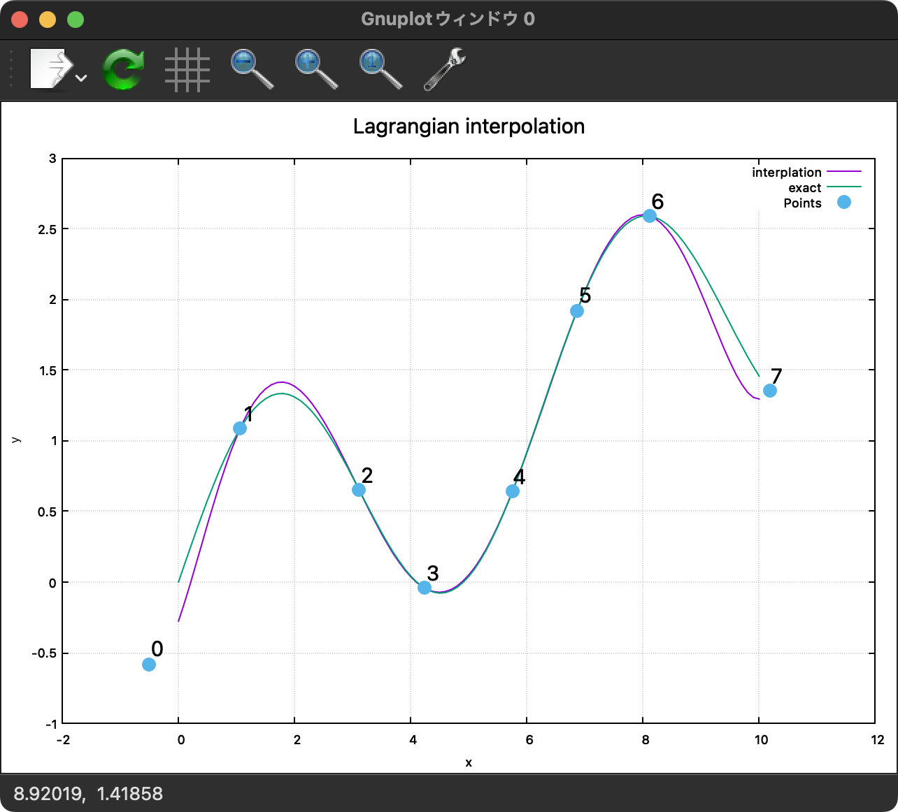

[./interpolation_Lagrange.cpp#L12](./interpolation_Lagrange.cpp#L12)

---
## ⛵ 三角形を使った補間 

### 🪼 三角分割 

```shell
sh clean
cmake -DCMAKE_BUILD_TYPE=Release ../ -DSOURCE_FILE=TriangleParameterSubdivision.cpp
make
./TriangleParameterSubdivision
```

* `SymmetricSubdivisionOfTriangle_00_10_01`で三角形を分割
* `SubdivideSquareIntoTriangles` で矩形領域を三角形に分割
* `SymmetricSubdivisionOfTriangle`は`SymmetricSubdivisionOfTriangle_00_10_01`を使って，任意頂点の三角形を分割する

`plot_parametric_subdivision.nb` で描画

| $`(\xi _0,\xi _1)`$, Range: $`(\xi _0,\xi _1)\in[0,1]\times[0,1-\xi _0]`$ | $`(\xi _0,\xi _1)`$, Range: $`(\xi _0,\xi _1)\in[0,1]\times[0,1]`$ | $`(\xi _0,\xi _1(1-\xi _0))`$, Range:$`(\xi _0,\xi _1)\in[0,1]\times[0,1]`$|

| a | b | c |
|:---:|:---:|:---:|
| 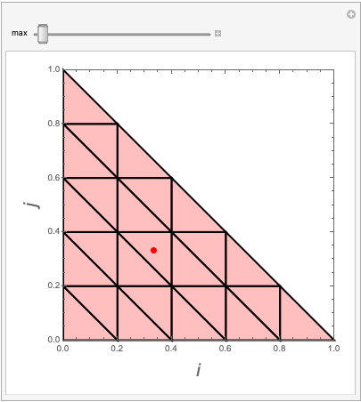 |  | 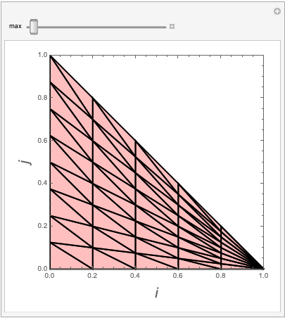 |

$`(\xi _0,\xi _1)=(\xi _0,\eta(1-\xi _0))`$とすると，
$`\eta0`$のとき，$(\xi _0,\xi _1)=(\xi _0,0)$，また
$`\eta)=1`$のとき，$(\xi _0,\xi _1)=(\xi _0,1-\xi _0)$
となり，
$`(\xi _0,\eta)\in[0,1]\times[0,1]`$は
$`(\xi _0,\xi _1)=(\xi _0,\eta(1-\xi _0))\in[0,1]\times[0,1-\xi _0]`$に写像される．

このことは，形状関数を使った積分の際に利用できる．

[./TriangleParameterSubdivision.cpp#L11](./TriangleParameterSubdivision.cpp#L11)

---
### 🪼 🪼 三角形形状関数  

線形の三角形形状関数は，$`\xi _2 = 1-\xi _0-\xi _1`$として，

```math
{\bf N} _{\rm l}({\boldsymbol \xi})=
\left(
\begin{array}{c}
\xi _0\\
\xi _1\\
\xi _2
\end{array}
\right)
```

2次の三角形形状関数は，$`\xi _2 = 1-\xi _0-\xi _1`$として，

```math
{\bf N} _{\rm q}({\boldsymbol \xi})=
\left(
\begin{array}{c}
\xi _0 (2  \xi _0 - 1)\\
\xi _1 (2 \xi _1 - 1)\\
\xi _2 (2 \xi _2 - 1)\\
4 \xi _0 \xi _1\\
4 \xi _1 \xi _2\\
4 \xi _2 \xi _0
\end{array}
\right)
```

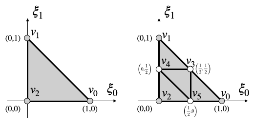

この形状関数の使い方は，節点上の変数が$`(v _0,v _1,v _2,v _4,v _5,v _6)^{\intercal}`$の場合，
次のようにして，三角形上の値を補間できる．

```math
v({\boldsymbol \xi}) =
\left(
\begin{array}{c}
\xi _0 (2  \xi _0 - 1)\\
\xi _1 (2 \xi _1 - 1)\\
\xi _2 (2 \xi _2 - 1)\\
4 \xi _0 \xi _1\\
4 \xi _1 \xi _2\\
4 \xi _2 \xi _0
\end{array}
\right)^{\intercal}
\left(
\begin{array}{c}
v _0\\
v _1\\
v _2\\
v _3\\
v _4\\
v _5
\end{array}
\right)
=
\left(
\begin{array}{c}
v _0\\
v _1\\
v _2\\
v _3\\
v _4\\
v _5
\end{array}
\right)^{\intercal}
\left(
\begin{array}{c}
\xi _0 (2  \xi _0 - 1)\\
\xi _1 (2 \xi _1 - 1)\\
\xi _2 (2 \xi _2 - 1)\\
4 \xi _0 \xi _1\\
4 \xi _1 \xi _2\\
4 \xi _2 \xi _0
\end{array}
\right)
```

$v _0$がベクトルであっても，この計算は可能である．

Mathematicaを使った上の計算を考えてみる．Mathematicaのルールとして，

- Mathematicaでは，ベクトルの転置はない
- Row majorで行列を表現する
- `Dot[A,B]`の計算は，`B`がベクトルの場合，（Mathematicaにはベクトルの転置はないが）`B`が転置されたかのような計算結果を返す

ということを考えると，上の計算は次のようになる．
${\bf N}^{\intercal}V$の転置はいらなず，`Dot[N, V]`で計算できる．
また，$V^{\intercal}{\bf N}$の計算は，`Dot[V, N]`でそのまま計算できる．

```Mathematica
In[1]:= V = {{a, b}, {c, d}, {e, f}};
Dot[{N0, N1, N2}, V]　(*第１引数に，転置が要らないことに注意．既に転置されていると考える．*)
Dot[Transpose[V], {N0, N1, N2}]　(*この順番なら一般的な方法でOK*)

Out[2]= {a N0 + c N1 + e N2, b N0 + d N1 + f N2}

Out[3]= {a N0 + c N1 + e N2, b N0 + d N1 + f N2}
```

ちなみに，節点3と節点5の線上のパラメタは，$`t _0 = 1/2`$である．
これを2次補間の形状関数に代入すると，

```math
(N _0, N _1, N _2, N _3, N _4, N _5) = (0, t _1(2 t _1-1), t _1 (2 t _1-1), 2 t _1, 2 (1 - 2 t _1) t _1, 1 - 2 t _1)
```

となり，この線上では，節点0の影響を受けず，補間値はそれ以外の（内部）の情報からのみ決まる．
[../../include/basic_arithmetic_array_operations.hpp#L1261](../../include/basic_arithmetic_array_operations.hpp#L1261)


### 🪼 🪼 範囲 {t_0,t_1} = {[0,1],[0,1]} -> [t0,t1]=[0,1],[0,1-t0]  

前で示した通り，$`(\xi _0,\xi _1)=(\xi _0,\eta(1-\xi _0))`$と置き換えることで，矩形領域を三角形領域に変換できる．

これを利用して，形状関数の引数を$`N(\xi _0,\eta(1-\xi _0))`$として与え，
$`(\xi _0,\eta)`$をそれぞれ$`[0,1]`$の範囲で変化させることで，
三角形の形状を補間できる．

このプログムでは，
`N(x,y)=TriShape<3>(x,y)`と定義し，
`N(x,y(1-x))=ModTriShape<3>(x,y)`と定義している．
[../../include/basic_arithmetic_array_operations.hpp#L1490](../../include/basic_arithmetic_array_operations.hpp#L1490)


### 🪼 例：補間によって，頂点座標から平面を作成する 

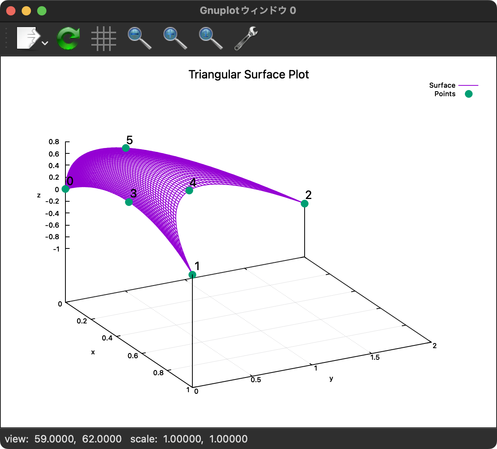

```shell
sh clean
cmake -DCMAKE_BUILD_TYPE=Release ../ -DSOURCE_FILE=TriShape.cpp
make
./TriShape
```

[./TriShape.cpp#L1](./TriShape.cpp#L1)

---
## ⛵ 接続関係を利用した補間精度の向上（擬2次補間） 

```shell
sh clean
cmake -DCMAKE_BUILD_TYPE=Release ../ -DSOURCE_FILE=TriShapeExample_improved_test1.cpp
make
./TriShapeExample_improved_test1
```

2次補間を利用する，要素は，2次要素と呼ばれ，
一般的には，三角形の頂点に加え，辺上にもサンプル点を配置する．

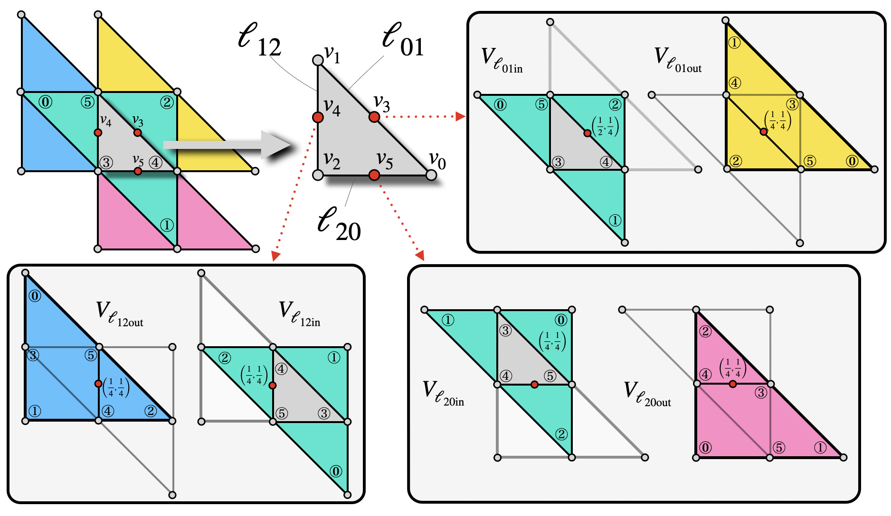


ここで紹介する擬2次補間要素は，辺上に存在しない節点を周辺の要素を使って近似し，その値を使って三角形上に2次要素を作る方法である．
擬2次補間は，線形要素と同じメッシュを使ったとしても節点数を増やす必要はないが，
メッシュの接続関係を線形補間よりも多く考慮しており，また高次の補間であるため，精度の向上が期待できる．

<!-- この方法の実装には，要素同士の接続情報を計算中に効率的に取得する必要がある． -->

辺上の節点の補間は，2次補間を使って行う．
この辺に隣接する三角形を中央にもつ2次補間は２通り考えられ，この２通りの補間の平均値を辺上の節点の値とする．
一度，辺上の節点の値が決まれば，擬2次補間要素は一般的な2次補間と全く同じである．

ただし，次の章で示すが，擬2次補間要素を方程式の離散化に適用するためには，
一方的に値を補間する機能だけでなく，補間された値がどの節点の値の線形結合で決まるかが取得できる機能もプログラムに実装する必要がある．

擬2次補間は，よく知られている2次補間の形状関数を基本としている．

```math
\begin{aligned}
v({\boldsymbol \xi}) =
N({\xi _0,\xi _1})^{\intercal}
V\end{aligned}
,\quad
N({\xi _0,\xi _1})=\left(
\begin{array}{c}
\xi _0 (2 \xi _0 - 1)\\
\xi _1 (2 \xi _1 - 1)\\
\xi _2 (2 \xi _2 - 1)\\
4 \xi _0 \xi _1\\
4 \xi _1 \xi _2\\
4 \xi _2 \xi _0
\end{array}
\right),\quad
V=\left(
\begin{array}{c}
v _0\\v _1\\v _2\\v _3\\v _4\\v _5
\end{array}
\right)
```

Fig. [fig:pseudo_quad_schematic](not found)に示すように，
この形状関数の係数を，対応する節点の値に掛けて足し合わせることで，
三角形要素の内部の任意の点における値を補間することができる．


ただし，辺上の節点$3,4,5$は設定していないので，
隣接する三角形の頂点の値を使った2次補間の平均で近似する：

```math
\begin{aligned}
v({\boldsymbol \xi}) =
N({\xi _0,\xi _1})^{\intercal}
\left(
\begin{array}{c}
v _0\\v _1\\v _2\\
\frac{1}{2}\left({N _{\rm q}\left(\frac{1}{4},\frac{1}{4}\right) V _{\rm {\ell}01in} + N _{\rm q}\left(\frac{1}{4},\frac{1}{4}\right) V _{\rm {\ell}01out}}\right)\\
\frac{1}{2}\left({N _{\rm q}\left(\frac{1}{4},\frac{1}{4}\right) V _{\rm {\ell}12in} + N _{\rm q}\left(\frac{1}{4},\frac{1}{4}\right) V _{\rm {\ell}12out}}\right)\\
\frac{1}{2}\left({N _{\rm q}\left(\frac{1}{4},\frac{1}{4}\right) V _{\rm {\ell}20in} + N _{\rm q}\left(\frac{1}{4},\frac{1}{4}\right) V _{\rm {\ell}20out}}\right)
\end{array}
\right)
\end{aligned}
```

この式を(Eq. [?](not found))の形に書き直すために．
次のような関係を使う：

```math
\begin{aligned}
N _{\rm q}\left(\frac{1}{4},\frac{1}{4}\right) V _{\rm {\ell}12in} &=N _{\rm q}\left(\frac{1}{4},\frac{1}{2}\right) V _{\rm {\ell}01in},\\
N _{\rm q}\left(\frac{1}{4},\frac{1}{4}\right) V _{\rm {\ell}20in} &=N _{\rm q}\left(\frac{1}{2},\frac{1}{4}\right) V _{\rm {\ell}01in},\\
N({\xi _0,\xi _1})^{\intercal}
\left(
\begin{array}{c}
v _0\\v _1\\v _2\\0\\0\\0
\end{array}
\right)
&=
\left(
\begin{array}{c}
0\\0\\0\\\xi _2 (2\xi _2 - 1)\\\xi _0 (2\xi _0 - 1)\\\xi _1 (2\xi _1 - 1)
\end{array}
\right)
V _{\rm {\ell}01in}
\end{aligned}
```

これを使って，$V _{\rm {\ell}12in}$と$V _{\rm {\ell}21in}$の代わりに，$V _{\rm {\ell}01in}$を使った式に置き換える．

```math
\begin{aligned}
{\bf x}({\boldsymbol \xi})&=
\left(
\left(\begin{array}{c}
0\\0\\0\\\xi _2 (2\xi _2 - 1)\\\xi _0 (2\xi _0 - 1)\\\xi _1 (2\xi _1 - 1)\\
\end{array}
\right)
+2 \xi _0 \xi _1 N _{\rm q}\left(\frac{1}{4},\frac{1}{4}\right)
+2 \xi _1 \xi _2 N _{\rm q}\left(\frac{1}{2},\frac{1}{4}\right)
+2 \xi _2 \xi _0 N _{\rm q}\left(\frac{1}{4},\frac{1}{2}\right)
\right)V _{\rm {\ell}01in}\\
&+2 \xi _0 \xi _1 N _{\rm q}\left(\frac{1}{4},\frac{1}{4}\right)V _{\rm {\ell}01out}\\
&+2 \xi _1 \xi _2 N _{\rm q}\left(\frac{1}{4},\frac{1}{4}\right)V _{\rm {\ell}12out}\\
&+2 \xi _2 \xi _0 N _{\rm q}\left(\frac{1}{4},\frac{1}{4}\right)V _{\rm {\ell}21out}
\end{aligned}
\label{eq:pseudo _quadratic _interpolation}
```

このように，(Eq. [?](not found))の形の式を４つ足し合わせることで，擬2次補間を実装することができる．

ただし，辺が角を成している場合，この補間では，角にはならず，滑らかに補間されてしまう．
そのため，角を成している辺上の節点は，線形補間を使って近似することにする．つまり，辺が繋ぐ２節点の平均で近似する．
例えば，辺01が角となっている場合，(Eq. [121](#eq:pseudo_quadratic_interpolation))は次のように書き換える．

```math
\begin{aligned}
{\bf x}({\boldsymbol \xi})&=
\left(
\left(\begin{array}{c}
0\\0\\0\\\xi _2 (2\xi _2 - 1)\\\xi _0 (2\xi _0 - 1)\\\xi _1 (2\xi _1 - 1)\\
\end{array}
\right)
+
2\xi _0\xi _1
\left(\begin{array}{c}
0\\0\\0\\0\\1\\1
\end{array}
\right)
+2 \xi _1 \xi _2 N _{\rm q}\left(\frac{1}{2},\frac{1}{4}\right)
+2 \xi _2 \xi _0 N _{\rm q}\left(\frac{1}{4},\frac{1}{2}\right)
\right)V _{\rm {\ell}01in}\\
&+2 \xi _1 \xi _2 N _{\rm q}\left(\frac{1}{4},\frac{1}{4}\right)V _{\rm {\ell}12out}\\
&+2 \xi _2 \xi _0 N _{\rm q}\left(\frac{1}{4},\frac{1}{4}\right)V _{\rm {\ell}21out}
\end{aligned}
```

0,1節点は，$`V _{\rm {\ell}01in}`$における4,5節点であるため，$`2\xi _0\xi _1(0,0,0,1,1)^{\intercal}`$の項に

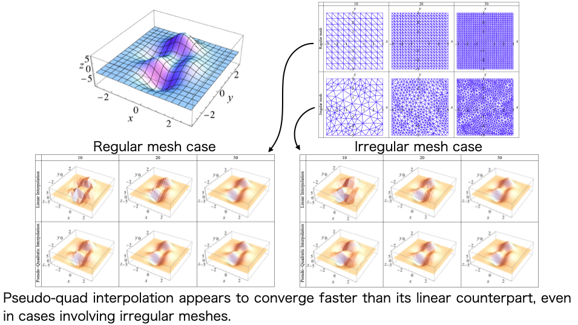

積分結果を比較すると，線形補間よりも擬2次補間の方が精度が向上していることがわかる．
規則的なメッシュでは，２次補間と擬2次補間の結果は同程度であるが，
不規則なメッシュでは，擬2次補間の精度は２次補間により悪いが，線形補間よりも良い．

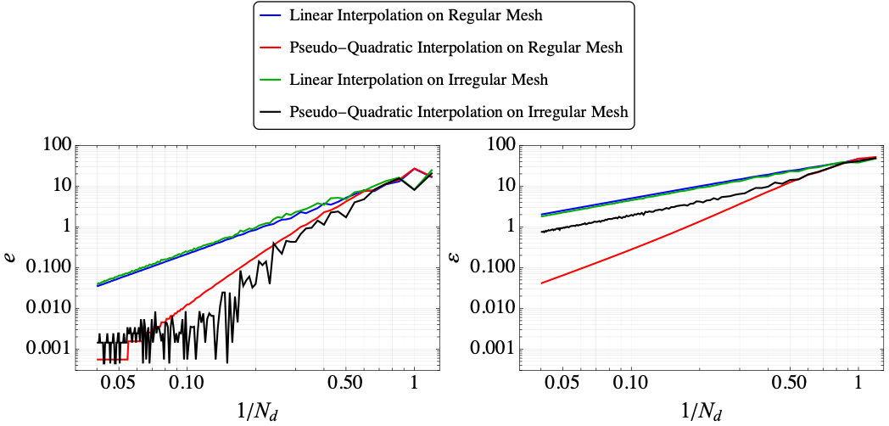

[./TriShapeExample_improved_test1.cpp#L1](./TriShapeExample_improved_test1.cpp#L1)

---
### 🪼 複雑な3Dオブジェクトの形状補間 

```shell
sh clean
cmake -DCMAKE_BUILD_TYPE=Release ../ -DSOURCE_FILE=TriShapeExample_find_nearest.cpp
make
./TriShapeExample_find_nearest
```

[./TriShapeExample_find_nearest.cpp#L1](./TriShapeExample_find_nearest.cpp#L1)

### 🪼 複雑な3Dオブジェクトの形状補間 

この例では，`obj`ファイルを読み込んで，その面を補間する．

```shell
sh clean
cmake -DCMAKE_BUILD_TYPE=Release ../ -DSOURCE_FILE=TriShapeExample_improved_test2.cpp
make
./TriShapeExample_improved_test2
```

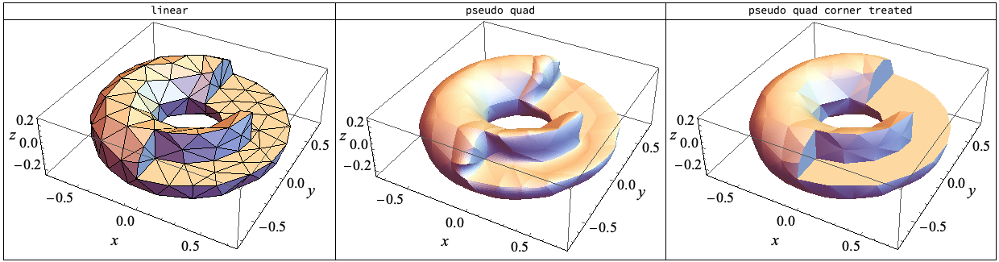

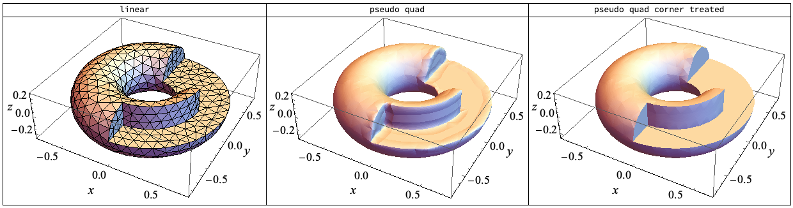

[./TriShapeExample_improved_test2.cpp#L1](./TriShapeExample_improved_test2.cpp#L1)

---
## ⛵ B-spline補間 

与えられたデータ点を通る多項式を求める方法の一つにB-spline補間がある．

### 🪼 実行方法 

```sh
$ cmake -DCMAKE _BUILD _TYPE=Release ../ -DSOURCE _FILE=interpolation _Bspline.cpp
$ make
$ ./interpolation _Bspline
$ gnuplot bspline_plot.gnu
```

### 🪼 コード 

[interpolation:Bspline](not found){Bspline基底関数}を用いて，B-spline補間を行う．

`InterpolationBspline`は，`std::vector<double>`または`std::vector<std::array<double,N>>`を引数に取ることができる．

```cpp
// example for 1D data
std::vector<double> X;
InterpolationBspline intpX(5, abscissas, X);
```

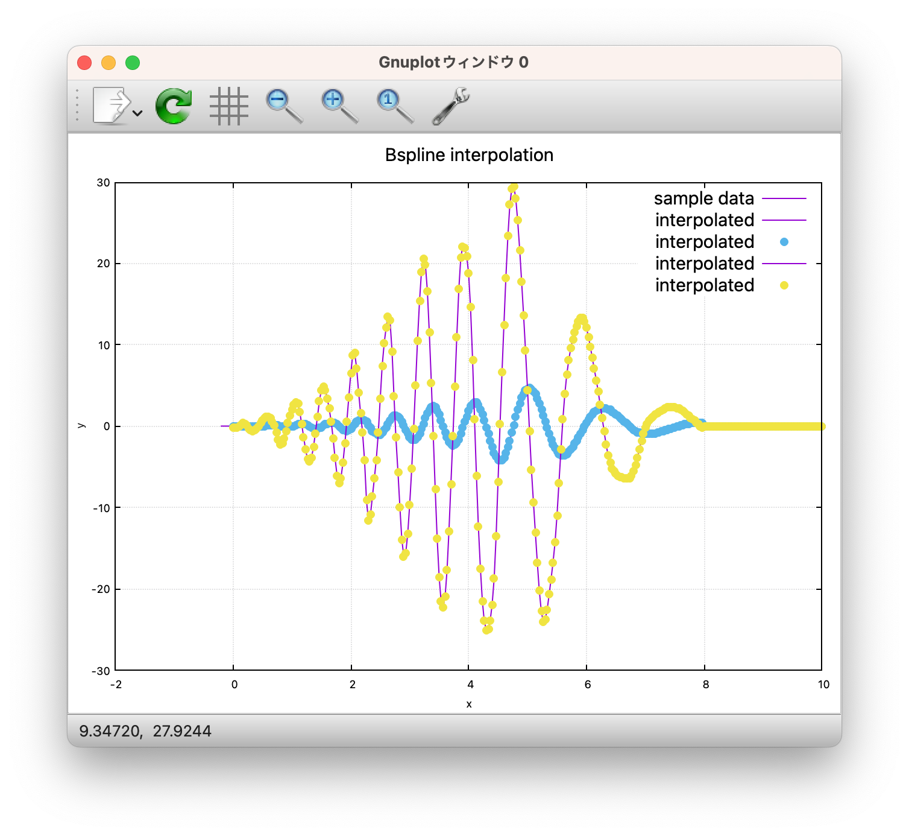

```cpp
// example for 2D data
std::vector<std::arrray<double,2>> XY;
InterpolationBspline intpXY(5, abscissas, XY);
```

または，クラスを使いまわしたい場合，`set`メンバ関数を用いて，データをセットすることもできる．

```cpp
InterpolationBspline<std::array<double, 2>> intpXY;
intpXY.set(5, abscissas, XY);
```

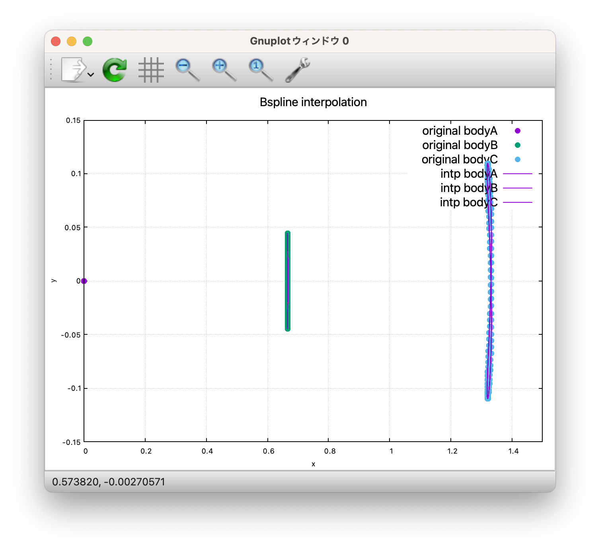

## ⛵ ⛵ 放射関数補間  

距離$`r=\left\| \mathbf{x}-{{\mathbf{a}} _{i}} \right\|`$を引数とする
放射基底関数$`\phi(r _i)`$に重み$`w _i`$を掛け合わせて構築した
補間関数$`f\left( \mathbf{x} \right)=\sum\limits _{i=0}^{N-1}{{{w} _{i}}\phi \left( \left\| \mathbf{x}-{{\mathbf{a}} _{i}} \right\| \right)}`$
を放射関数補間という．

### 🪼 🪼 重み$`w _i`$の見積もり  

重み$`w _i`$の決定には，サンプル点$`A=\left\{ {{\mathbf{a}} _{0}},{{\mathbf{a}} _{1}},...,{{\mathbf{a}} _{N-1}} \right\}`$
における値$`Y=\left\{ {{y} _{0}},{{y} _{1}},...,{{y} _{N-1}} \right\}`$
を使い，補間関数$`f`$も各サンプル点$A$において値$`Y`$となる方程式を$`w _i`$について解く：

```math
\left( \begin{matrix}
{{w} _{0}}  \\
\vdots   \\
{{w} _{N-1}}  \\
\end{matrix} \right)={{\left( \begin{matrix}
\phi \left( \left\| {{\mathbf{a}} _{0}}-{{\mathbf{a}} _{0}} \right\| \right) & \cdots  & \phi \left( \left\| {{\mathbf{a}} _{0}}-{{\mathbf{a}} _{N-1}} \right\| \right)  \\
\vdots  & \ddots  & \vdots   \\
\phi \left( \left\| {{\mathbf{a}} _{N-1}}-{{\mathbf{a}} _{0}} \right\| \right) & \cdots  & \phi \left( \left\| {{\mathbf{a}} _{N-1}}-{{\mathbf{a}} _{N-1}} \right\| \right)  \\
\end{matrix} \right)}^{-1}}\left( \begin{matrix}
{{y} _{0}}  \\
\vdots   \\
{{y} _{N-1}}  \\
\end{matrix} \right)
```

### 🪼 🪼 放射基底関数$`\phi`$  

#### 🪸 🪸 多重二乗（multiquadric RBF）  

放射基底関数として多重二乗（multiquadric），
$`\phi \left( r \right)={{\left( {{\left( \varepsilon r \right)}^{2}}+1 \right)}^{\frac{1}{2}}}`$
がよく使われる．

#### 🪸 🪸 逆多重二乗（inverse multiquadric RBF）  

$`\phi \left( r \right)={{\left( {{\left( \varepsilon r \right)}^{2}}+1 \right)}^{-\frac{1}{2}}}`$

#### 🪸 🪸 ガウシアン（Gaussian RBF）  

$`\phi \left( r \right)={{e}^{-{{\left( \varepsilon r \right)}^{2}}}}`$

### 🪼 🪼 補間関数の微分  

放射関数補間の微分を少し変形すると，

$`\nabla f\left( \mathbf{x} \right)=\sum\limits _{i=0}^{N-1}{{{w} _{i}}\nabla \phi \left( \left\| \mathbf{x}-{{\mathbf{a}} _{i}} \right\| \right)}=\sum\limits _{i=0}^{N-1}{{{w} _{i}}\nabla {{r} _{i}}\frac{\partial \phi \left( {{r} _{i}} \right)}{\partial {{r} _{i}}}}`$

さらに，計算すると，

```math
\begin{align}
& {{r} _{i}}=\left\| \mathbf{x}-{{\mathbf{a}} _{i}} \right\|={{\left( \sum\limits _{j=0}^{M=2}{{{\left( \mathbf{x}-{{\mathbf{a}} _{ij}} \right)}^{2}}} \right)}^{1/2}} \\
& \frac{\partial {{r} _{i}}}{\partial {{\mathbf{x}} _{k}}}=\frac{1}{2}{{\left( \sum\limits _{j=0}^{M=2}{{{\left( \mathbf{x}-{{\mathbf{a}} _{ij}} \right)}^{2}}} \right)}^{-\frac{1}{2}}}\left( \frac{\partial }{\partial {{\mathbf{x}} _{k}}}\sum\limits _{j=0}^{M=2}{{{\left( \mathbf{x}-{{\mathbf{a}} _{ij}} \right)}^{2}}} \right) \\
& =\frac{1}{2}{{\left( \sum\limits _{j=0}^{M=2}{{{\left( \mathbf{x}-{{\mathbf{a}} _{ij}} \right)}^{2}}} \right)}^{-\frac{1}{2}}}\left( \sum\limits _{j=0}^{M=2}{2\left( \mathbf{x}-{{\mathbf{a}} _{ij}} \right)}\cdot {{\mathbf{e}} _{k}} \right) \\
& ={{\left( \sum\limits _{j=0}^{M=2}{{{\left( \mathbf{x}-{{\mathbf{a}} _{ij}} \right)}^{2}}} \right)}^{-\frac{1}{2}}}\overbrace{\left( {{\mathbf{x}} _{k}}-{{\mathbf{a}} _{ik}} \right)}^{\text{scaler}}=\frac{\overbrace{\left( {{\mathbf{x}} _{k}}-{{\mathbf{a}} _{ik}} \right)}^{\text{scaler}}}{{{r} _{i}}}
\end{align}
```

なので，$`\nabla {{r} _{i}}=\overbrace{\left( \mathbf{x}-{{\mathbf{a}} _{i}} \right)}^{\text{vecotr}}/{{r} _{i}}`$であり，

$`\nabla f\left( \mathbf{x} \right)=\sum\limits _{i=0}^{N-1}{{{w} _{i}}\frac{\mathbf{x}-{{\mathbf{a}} _{i}}}{{{r} _{i}}}\frac{\partial \phi \left( {{r} _{i}} \right)}{\partial {{r} _{i}}}}`$

である．分母がゼロになる可能性があるが，放射基底関数の微分でキャンセルされる．

#### 🪸 🪸 多重二乗  

$`\phi \left( r \right)={{\left( {{\left( \varepsilon r \right)}^{2}}+1 \right)}^{\frac{1}{2}}},\frac{\partial \phi }{\partial r}\left( r \right)=\frac{\varepsilon^2 r}{\phi \left( r \right)}`$

なので，次のように分母を消すことができる．

$`\nabla f\left( \mathbf{x} \right)=\varepsilon^2 \sum\limits _{i=0}^{N-1}{{{w} _{i}}\frac{\mathbf{x}-{{\mathbf{a}} _{i}}}{\phi \left( {{r} _{i}} \right)}}`$

#### 🪸 🪸 逆多重二乗  

```math
\begin{align}
& \phi \left( r \right)={{\left( {{\left( \varepsilon r \right)}^{2}}+1 \right)}^{-\frac{1}{2}}} \\
& \frac{\partial \phi }{\partial r}\left( r \right)=-{{\varepsilon }^{2}}r{{\left( {{\left( \varepsilon r \right)}^{2}}+1 \right)}^{-1}} \\
& \nabla f=\sum\limits _{i=0}^{N-1}{-{{\varepsilon }^{2}}\left( \mathbf{x}-{{\mathbf{a}} _{i}} \right){{\phi }^{2}}\left( r \right)} \\
\end{align}
```

#### 🪸 🪸 ガウシアン  

```math
\begin{align}
& \phi \left( r \right)={{e}^{-{{\left( \varepsilon r \right)}^{2}}}} \\
& \frac{\partial \phi }{\partial r}\left( r \right)=-2{{\varepsilon }^{2}}r{{e}^{-{{\left( \varepsilon r \right)}^{2}}}} \\
& \nabla f=\sum\limits _{i=0}^{N-1}{-2{{\varepsilon }^{2}}{{e}^{-{{\left( \varepsilon r \right)}^{2}}}}\left( \mathbf{x}-{{\mathbf{a}} _{i}} \right)} \\
\end{align}
```

### 🪼 🪼 最適なパラメタ$`{\varepsilon}`$  

サンプル点の平均的な間隔を${s}$とした場合，$`{\varepsilon = 1/s}`$とパラメタをとるとよい．
[../../include/interpolations.hpp#L238](../../include/interpolations.hpp#L238)

[./interpolation_Bspline.cpp#L12](./interpolation_Bspline.cpp#L12)

---
