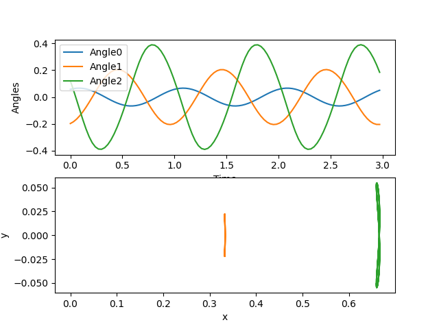

# Contents
- [🐋 pybind11の使い方](#🐋-pybind11の使い方)
    - [⛵ pybind11の書き方](#⛵-pybind11の書き方)
    - [⛵ pybind11で共有ライブラリを作成](#⛵-pybind11で共有ライブラリを作成)
        - [🪼 ラズパイでのコンパイル](#🪼-ラズパイでのコンパイル)
- [🐋 Commands used in the video https://youtu.be/-bCG87jBDqA :](#🐋-Commands-used-in-the-video-https://youtu.be/-bCG87jBDqA-:)
    - [⛵ python内で共有ライブラリを使う](#⛵-python内で共有ライブラリを使う)
        - [🪼 アニメーションgifファイルを作成しロボットの動きを可視化する](#🪼-アニメーションgifファイルを作成しロボットの動きを可視化する)
        - [🪼 モーターの節の位置と角度の時間変化をdatファイルに出力する](#🪼-モーターの節の位置と角度の時間変化をdatファイルに出力する)
        - [🪼 作成したdatファイルを読み込んで確認する](#🪼-作成したdatファイルを読み込んで確認する)


---
# 🐋 pybind11の使い方 

ラズパイでサーボモーターを動かすには，pythonを使うのが簡単．
ただ，数値計算においては，pythonの速度が遅いため実用的でなくなる場合があり，それを考慮しながらやっていくことは面倒．
そこで，pybind11を使って，pythonからでも読み込める共有ライブラリをc++を元に作った．

## ⛵ pybind11の書き方 

⚠️ `cmake`の`-DOUTPUT`オプションで指定した名前と同じ`shared_file_name_that_will_be_generated`を指定する．

```cpp
PYBIND11_MODULE(LighthillRobot, m) {
py::class_<LighthillRobot>(m, "LighthillRobot")
.def(py::init<double, double, double, double, double, int>())
.def_readwrite("c1", &LighthillRobot::c1)
.def_readwrite("c2", &LighthillRobot::c2)
.def("yLH", &LighthillRobot::yLH)
.def("X_RB", &LighthillRobot::X_RB)
.def("f", &LighthillRobot::f)
.def("ddx_yLH", &LighthillRobot::ddx_yLH)
.def("ddq_f", &LighthillRobot::ddq_f)
.def("getAngles", &LighthillRobot::getAngles)
.def("anglesToX", &LighthillRobot::anglesToX);
}
```

[./LighthillRobot.cpp#L78](./LighthillRobot.cpp#L78)

---
## ⛵ pybind11で共有ライブラリを作成 

この例は，c++のNewton法を利用して作った[Lighthill Robot](../../include/rootFinding.hpp#L232)をpythonで使うためのもの.

このディレクトリにCMakelists.txtを用意しているので，
それを使って，以下のようにターミナル上で実行・`make`すると，
Macだと`LighthillRobot_pybind.cpython-311-darwin.so`が作られる.

```sh
sh clean
cmake -DCMAKE_BUILD_TYPE=Release ./ -DINPUT=LighthillRobot.cpp -DOUTPUT=shared_file_name_that_will_be_generated
make
```

具体的には，以下のようにコンパイルする．

```sh
sh clean
cmake -DCMAKE_BUILD_TYPE=Release ./ -DINPUT=LighthillRobot.cpp -DOUTPUT=LighthillRobot -DCMAKE_CXX_COMPILER=/opt/homebrew/bin/g++-13
make
```

### 🪼 ラズパイでのコンパイル 

c++で-std=c++17を使うためには，gcc-9.1.0以上が必要．
[https://gist.github.com/sol-prog/95e4e7e3674ac819179acf33172de8a9#file-commands-sh](https://gist.github.com/sol-prog/95e4e7e3674ac819179acf33172de8a9#file-commands-sh)
ここを参考にして，まずはgcc-9.1.0をインストールする．
git cloneをする際にプロキシを通す必要がある場合は，以下のようにする．

```sh
# 🐋 Commands used in the video https://youtu.be/-bCG87jBDqA : 

sudo apt update && sudo apt upgrade -y

git clone https://bitbucket.org/sol_prog/raspberry-pi-gcc-binary.git
cd raspberry-pi-gcc-binary
tar -xjvf gcc-9.1.0-armhf-raspbian.tar.bz2
sudo mv gcc-9.1.0 /opt
cd ..
rm -rf raspberry-pi-gcc-binary

cd ~
echo 'export PATH=/opt/gcc-9.1.0/bin:$PATH' >> ~/.bashrc
echo 'export LD _LIBRARY _PATH=/opt/gcc-9.1.0/lib:$LD_LIBRARY_PATH' >> ~/.bashrc
. ~/.bashrc
sudo ln -s /usr/include/arm-linux-gnueabihf/sys /usr/include/sys
sudo ln -s /usr/include/arm-linux-gnueabihf/bits /usr/include/bits
sudo ln -s /usr/include/arm-linux-gnueabihf/gnu /usr/include/gnu
sudo ln -s /usr/include/arm-linux-gnueabihf/asm /usr/include/asm
sudo ln -s /usr/lib/arm-linux-gnueabihf/crti.o /usr/lib/crti.o
sudo ln -s /usr/lib/arm-linux-gnueabihf/crt1.o /usr/lib/crt1.o
sudo ln -s /usr/lib/arm-linux-gnueabihf/crtn.o /usr/lib/crtn.o

g++-9.1 -std=c++17 -Wall -pedantic test_fs.cpp -o test_fs
./test_fs
```

```sh
git config --global http.proxy http://書き換え:8080
git config --global https.proxy http://書き換え:8080
```

[./LighthillRobot.cpp#L1](./LighthillRobot.cpp#L1)

---
## ⛵ python内で共有ライブラリを使う 

### 🪼 アニメーションgifファイルを作成しロボットの動きを可視化する 

[このように](../../builds/build_pybind11/demo_runLightHillRobot_all.py#L21)`import`して利用できる．
cppと同じように[`robot`オブジェクトを作成](../../builds/build_pybind11/demo_runLightHillRobot_all.py#L34)．

出力結果

|例：水族館の魚|出力結果|
|:---:|:---:|
|  |  |

[./demo_runLightHillRobot1_animate_robot.py#L2](./demo_runLightHillRobot1_animate_robot.py#L2)

### 🪼 モーターの節の位置と角度の時間変化をdatファイルに出力する 

数値解析で剛体の運動表現したいことがよくある．
３次元で剛体の運動は，６自由度の運動で表現される．

$`t, x, y, z, \theta _x, \theta _y, \theta _z`$の順に並んでいる．

```data
0.0, 0.6666666421574411, -8.679523690686062e-05, 0., 0., 0., 0.00022580754704734906
0.01, 0.6666666360892092, -9.436993153716977e-05, 0., 0., 0., 0.0002085691971914809
0.02, 0.6666666288086627, -0.00010203474300463844, 0., 0., 0., 0.00018136038406231864
0.03, 0.666666620162383, -0.00010965062939973597, 0., 0., 0., 0.00014179367130820136
0.04, 0.6666666100078016, -0.00011703943260596665, 0., 0., 0., 8.706011682802684e-05
0.05, 0.6666665982273601, -0.0001239762852648563, 0., 0., 0., 1.3879082155409919e-05
```

[./demo_runLightHillRobot2_output_datfile.py#L1](./demo_runLightHillRobot2_output_datfile.py#L1)

---
### 🪼 作成したdatファイルを読み込んで確認する 



[./demo_runLightHillRobot3_load_and_plot.py#L1](./demo_runLightHillRobot3_load_and_plot.py#L1)

---
