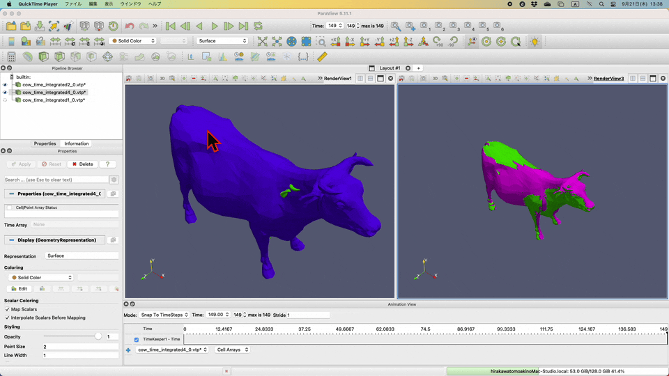

# Contents
- [🐋 クォータニオンを使った物体の３次元回転](#🐋-クォータニオンを使った物体の３次元回転)
    - [⛵ ⛵ クォータニオンを使った回転表現](#⛵-⛵-クォータニオンを使った回転表現)
    - [⛵ クォータニオンを使った物体の３次元回転の例](#⛵-クォータニオンを使った物体の３次元回転の例)
    - [⛵ ⛵ クォータニオンの積は回転の合成　$`{\boldsymbol q} _{12}={\boldsymbol q} _1 * {\boldsymbol q} _2`$](#⛵-⛵-クォータニオンの積は回転の合成　$`{\boldsymbol-q}-_{12}={\boldsymbol-q}-_1-*-{\boldsymbol-q}-_2`$)
    - [⛵ ⛵ 角加速度からクォータニオンの微分を計算](#⛵-⛵-角加速度からクォータニオンの微分を計算)
    - [⛵ クォータニオンの微分の数値的な時間積分の例](#⛵-クォータニオンの微分の数値的な時間積分の例)
        - [🪼 クォータニオンの正規化](#🪼-クォータニオンの正規化)
    - [⛵ 剛体の回転と平行移動](#⛵-剛体の回転と平行移動)


---
# 🐋 クォータニオンを使った物体の３次元回転 

## ⛵ ⛵ クォータニオンを使った回転表現  

クォータニオンは３次元の回転を表すための数学的な表現であり，このプログラムでは，**ある回転軸$`v`$に対して，角度$`\theta`$だけの回転を表すクォータニオン$`q`$**のような考え方でクォータニンオンを生成する．それは次のように表される．

```math
\begin{aligned}
q &= a + bi + cj + dk = \cos(\theta/2) +  \sin(\theta/2) \cdot \dfrac{v _x i + v _y k + v _z k}{\|v\|}\\
v &= (v _x, v _y, v _z)
\end{aligned}
```

重要なのは，クォータニオンを使ったよくある回転行列の表現方法や，クォータニオン同士の積が回転の合成になるように定義されていることである．

３次元回転というと混同してしまいやすい２つがある．
一つは，自分の目線を基準にして物体を回転させることである．
この回転は，$`Rv()`$で定義している．(時計回りを正としている)

```math
Rv = \begin{bmatrix}
a^2 + b^2 - c^2 - d^2 & 2 \cdot b \cdot c - 2 \cdot a \cdot d & 2 \cdot a \cdot c + 2 \cdot b \cdot d \\
2 \cdot b \cdot c + 2 \cdot a \cdot d & a^2 - b^2 + c^2 - d^2 & -2 \cdot a \cdot b + 2 \cdot c \cdot d \\
-2 \cdot a \cdot c + 2 \cdot b \cdot d & 2 \cdot a \cdot b + 2 \cdot c \cdot d & a^2 - b^2 - c^2 + d^2 \\
\end{bmatrix}
```

もう一つの回転は，物体ではなく，自分自身を回転させることである．つまり自分の座標系を回転させることである．
これは，並進移動座標系と似たように，自分が時計回りに回転すると，反対に物体は反時計回りに回転しているように見える．

```math
Rs = \begin{bmatrix}
a^2 + b^2 - c^2 - d^2 & 2 \cdot b \cdot c + 2 \cdot a \cdot d & -2 \cdot a \cdot c + 2 \cdot b \cdot d \\
2 \cdot b \cdot c - 2 \cdot a \cdot d & a^2 - b^2 + c^2 - d^2 & 2 \cdot a \cdot b + 2 \cdot c \cdot d \\
2 \cdot a \cdot c + 2 \cdot b \cdot d & -2 \cdot a \cdot b + 2 \cdot c \cdot d & a^2 - b^2 - c^2 + d^2 \\
\end{bmatrix}
```
[../../include/basic_vectors.hpp#L1334](../../include/basic_vectors.hpp#L1334)


## ⛵ クォータニオンを使った物体の３次元回転の例 

3Dの物体の回転と平行移動を行う例．

* translate：ネットワークの全点を指定した量だけ平行移動します．
* rotate：指定したクォータニオンと中心点を使用して、ネットワークの全点を回転します．
* main：bunny、cow、camelオブジェクトをロードして、それぞれを回転させ、結果をファイルに出力します．

```
sh clean
cmake -DCMAKE_BUILD_TYPE=Release ../ -DSOURCE_FILE=validateRotation.cpp
make
./validateRotation
```


クォータニオンから作られた回転行列`Rv`を使って，

1. 物体を$`x`$軸に回転 -> $`y`$軸に回転 -> $`z`$軸の順に回転させる．
2. 次に，$`(0.1,0,0)`$を中心にして$`x`$軸に対して回転 -> $`y`$軸に対して回転 -> $`z`$軸に対して回転させる．

`Rv`は自身の目線は変えないまま（自身の座標系を変えないまま），物体をその座標系において回転させる．

[./validateRotation.cpp#L5](./validateRotation.cpp#L5)

---
## ⛵ ⛵ クォータニオンの積は回転の合成　$`{\boldsymbol q} _{12}={\boldsymbol q} _1 * {\boldsymbol q} _2`$  

クォータニオン同士の掛け算は回転の合成になるように定義されている．

このプログラムでは，クォータニオン同士の積$`{\boldsymbol q} _1 * {\boldsymbol q} _2`$は，
`Quaternion operator*(const Quaternion &q1, const Quaternion &q2)`で次のように定義されている．
これは，**２つの回転を合成した回転を表すクォータニオン$`{\boldsymbol q} _{12}`$を作る**ことになる．

```math
\begin{aligned}
{\boldsymbol q} _{12}={\boldsymbol q} _1 * {\boldsymbol q} _2 =
\begin{bmatrix}
a1 * a2 + -b1 * b2 + -c1 * c2 + -d1 * d2\\
a1 * b2 + b1 * a2 + c1 * d2 - d1 * c2\\
a1 * c2 - b1 * d2 + c1 * a2 + d1 * b2\\
a1 * d2 + b1 * c2 - c1 * b2 + d1 * a2
\end{bmatrix}
\end{aligned}
```

## ⛵ ⛵ 角加速度からクォータニオンの微分を計算  

初期値問題を解くための数値計算は，$`x _{\text next} = x + \frac{dx}{dt} dt`$
という形に対して考える．なので，クォータニオンの微分を計算する必要がある．

**現在の角速度はわかるものとする．**

次時刻の姿勢（基準姿勢からの３次元回転）$`{\boldsymbol q}^{t+\delta t}`$は，現在の姿勢$`{\boldsymbol q}^{t}`$と角速度$`\bf w`$を使って次のように表される．

```math
\begin{aligned}
{\boldsymbol q}^{t+\delta t} &= {\boldsymbol q}^{t} * {\boldsymbol q}((1,0,0),w _x \delta t) * {\boldsymbol q}((0,1,0),w _y \delta t) * {\boldsymbol q}((0,0,1),w _z \delta t)\\
\rightarrow \frac{{\boldsymbol q}^{t+\delta t} - {\boldsymbol q}^{t}}{\delta t} &= \frac{{\boldsymbol q}^{t} * {\boldsymbol q}((1,0,0),w _x \delta t) * {\boldsymbol q}((0,1,0),w _y \delta t) * {\boldsymbol q}((0,0,1),w _z \delta t) - {\boldsymbol q}^{t}}{\delta t}
\end{aligned}
```

右辺をまとめると，時間$`\delta t`$は消えてくれる．

```cpp
auto nextQ = Quaternion({1., 0., 0.}, w[0] * dt) * Quaternion({0., 1., 0.}, w[1] * dt) * Quaternion({0., 0., 1.}, w[2] * dt);
return ((nextQ * q)() - q()) / dt;
```

結果として以下が得られる．

```math
\begin{aligned}
\begin{bmatrix}
q0\\
q1\\
q2\\
q3
\end{bmatrix}
=
\begin{bmatrix}
-q1 * w0 - q2 * w1 - q3 * w2\\
q0 * w0 + q3 * w1 - q2 * w2\\
-q3 * w0 + q0 * w1 + q1 * w2\\
q2 * w0 - q1 * w1 + q0 * w2
\end{bmatrix}
\end{aligned}
```

これを使えば，$`q _{\text next} = q + \frac{dq}{dt} dt`$という形で初期値問題を解くことができる．
[../../include/basic_vectors.hpp#L1629](../../include/basic_vectors.hpp#L1629)


## ⛵ クォータニオンの微分の数値的な時間積分の例 

以下を実行して，ルンゲクッタを使いクォータニオンの時間微分を時間積分する．

```
cmake -DCMAKE_BUILD_TYPE=Release ../ -DSOURCE_FILE=validateAngularVelocity.cpp
make
./validateAngularVelocity
```



👀 青がRK1，ピンクがRK2．緑がRK4．
RK1は時間が進むにつれて大きくなっている．
RK4も初期の状態と比べて若干大きくなっているように見える．

### 🪼 クォータニオンの正規化 

以上のような誤差は．回転行列を作成する際に，クォータニオンを正規化していないため，
回転行列の行列式が1になっていないことが原因である．
回転行列の行列式は，スケーリング（拡大縮小）を表しておリ，体積や長さを保つためには，行列式は1でなければならない．

**必ず回転行列を計算する際は，正規化したクォータニオンを使うべきである．**

## ⛵ 剛体の回転と平行移動 

剛体上の点$`X`$の位置を剛体とともに移動させるとき，
剛体の重心に関する回転と平行移動を使って，次のように計算できる．

```math
\begin{aligned}
R _{\rm new}\cdot (X-X _{\rm initial COM}) + X _{\rm new COM}
\end{aligned}
```

ここの回転行列$`R _{\rm new}`$は，「初期姿勢からの更新された姿勢までの回転」を施すものである．
初期姿勢に対する更新された姿勢を表すクォータニオン$`Q _{\rm new}`$から計算する．
[../../include/basic_vectors.hpp#L1757](../../include/basic_vectors.hpp#L1757)

[./validateAngularVelocity.cpp#L5](./validateAngularVelocity.cpp#L5)

---
