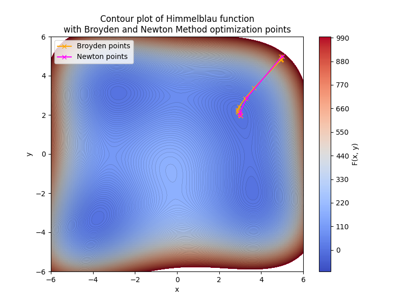

# Contents

- [🐋 ニュートン法](#🐋-ニュートン法)
    - [⛵ ニュートン法](#⛵-ニュートン法)
    - [⛵ ロボットの節をLighthillの曲線上に乗せる](#⛵-ロボットの節をLighthillの曲線上に乗せる)
        - [🪼 レビュー](#🪼-レビュー)
        - [🪼 はじめに](#🪼-はじめに)
        - [🪼 Lighthillの式](#🪼-Lighthillの式)
        - [🪼 目的関数$f$](#🪼-目的関数$f$)
        - [🪼 工夫点](#🪼-工夫点)
        - [🪼 ロボットのエネルギー効率について](#🪼-ロボットのエネルギー効率について)
    - [⛵ 準ニュートン法](#⛵-準ニュートン法)


---
# 🐋 ニュートン法 

## ⛵ ニュートン法 

**最適か否かを判断するための関数**，**ゼロまたは最大か最小にしたい関数**を目的関数と呼ぶ．
ヤコビ行列をやヘッセ行列，その両方を使う場合がある．

目的関数の根を見つける場合は，ヤコビ行列を使う．
最適化の問題の多くは，目的関数の最大最小を求めることなので，ヘッセ行列を利用したニュートン法を用いる．

```bash
$ cmake -DCMAKE _BUILD _TYPE=Release ../ -DSOURCE _FILE=example0 _NewtonRaphson _0.cpp
$ make
$ ./example0_NewtonRaphson_0
```


[./example0_NewtonRaphson_0.cpp#L1](./example0_NewtonRaphson_0.cpp#L1)


---
## ⛵ ロボットの節をLighthillの曲線上に乗せる 

### 🪼 レビュー 

<div style="overflow: hidden;">
<p align="center">

</p>
</div>

### 🪼 はじめに 

過去の論文から，重要そうな内容をいくつか抜粋，引用しておく．

> 筋電図を使って魚の筋力分布を測定したところ，力は主に前部と中部の筋肉で発生しており，
> 多くの魚が持つ後部の細い尾柄はその力を主に後方へと伝達する役割を持っていることがわかっている．
> 魚の泳ぎは複雑で，様々なアプローチから研究されてきたが，
> 多くの場合，Lighthill の*細長い体の理論(Elongated Body Theory)*，またはその発展版が使われている．
> ([Lighthill 1969](https://www.annualreviews.org/doi/10.1146/annurev.fl.01.010169.002213)，[Lighthill 1971](https://royalsocietypublishing.org/doi/10.1098/rspb.1971.0085)，[Porez et al. 2014](https://journals.sagepub.com/doi/abs/10.1177/0278364914525811))

📚 [Yong Zhong et al. 2018](https://ieeexplore.ieee.org/document/8329488)

> Wu 1961 の理論は，無限高の板の波動運動に基づき，
> 一方，Lighthill 1960 の理論は，線長い体の理論(Batchelor 1967 section 6.9 を参照)の拡張として elongated-body theory(EBT)に基づいている．
> EBT の発展版として，Newman & Wu 1973 や Newman1973 がフィンを考慮した計算を行っている．
> また，Lighthill 1970 では，EBT を large-amplitude elongated-body theory(LAEBT)に拡張している．
> LAEBT は，生体流体力学の分野で，魚の泳ぎの基礎となる理論として広く受け入れられている(Weihs 1972, Lighthill 1975).
> ロボットに関しては，Boyer et al. 2008 を参照．
> しかし，数値解析結果との比較を通して，LAEBT は，実際の流れと大きく異なることがわかった(Wolfgang 1999, Triantafyllou et al. 2000)．
> そこで，[Candelier et al. 2018](https://www.cambridge.org/core/product/identifier/S002211201000649X/type/journal_article)は，LAEBT に対応する実際の流れを調べ，さらにその３次元版を提案している．

📚 [Candelier et al. 2018](https://www.cambridge.org/core/product/identifier/S002211201000649X/type/journal_article)


### 🪼 Lighthillの式 

Lighthillの式：

```math
{\bf x}^{\rm LH}(x,t) = (x,y^{\rm LH}(x,t)),\quad
y^{\rm LH}(x,t) = \left( \frac{c _1}{L} x + {c _2} \left(\frac{x}{L}\right)^2 \right) \sin \left( \frac{2 \pi}{L} x - \omega t \right)
```

ロボットの$i$番目の節の位置ベクトル：

```math
{\bf x} _{i}^{\rm rb} = {\bf x} _{i-1}^{\rm rb} + r \left( \cos \theta _i, \sin \theta _i \right)
```

ここで，変数の意味は以下の通り．

| variable | meaning |
|:---:|:---:|
| $L$ | 全長 |
| $\omega$ | 角周波数 |
| $k$ | 波数 |
| $c _1$ | 振幅1 |
| $c _2$ | 振幅2 |
| $n$ | ロボットの関節の数 |
| $r$ | ロボットの関節間の長さ |
| $\theta _i$ | $i$番目の関節が進行方向となす角度 |

### 🪼 目的関数$f$ 

Lighthillの式にこの節を乗せるには，どのような目的関数$f$を用いればよいだろうか．
最適化する節の一つ前の節の位置を${\bf a}=(a _x,a _y)$とすると，次の目的関数$f$が考えられる．

```math
f(\theta) = y^{\rm LH}(x,t) - a _y - r \sin \theta
```

ニュートン法には微分が必要．

```math
\frac{df}{d\theta} = -r \sin\theta\frac{d y^{\rm LH} }{dx}-r\cos\theta
```


ただ，$f$を目的関数とすると根への収束が良くなかったので，$f^2/2$を目的関数として計算する．目的関数の微分は，$f \frac{df}{d\theta}$としている．

💡 この目的関数$f$には，前の節の位置が含まれているが，この目的関数を使って，先頭から順番に角度を決めていけば，各最適化において見積もる角度は常に１つだけとなる．

| n=5 | n=10 | n=50 |
|:---:|:---:|:---:|
|   |  |  |

### 🪼 工夫点 

愚直にニュートン法を適用すると，比較的振幅が大きい場合，正しい角度が得られない．
例えば以下のケース．

```cpp
double L = 0.71;
double w = 2. * M_PI * 1.0;
double k = 2. * M_PI * 2.0;
double c1 = 0.1;
double c2 = 0.1;
int nodes = 10;
int steps = 20;
```

そのような場合，[ここ](../../include/rootFinding.hpp#L253)のニュートン法のステップ幅を小さくすることで，正しい角度が得られる場合がある．


| `scale` | n=5 | n=10 | n=50 |
|:---:|:---:|:---:|:---:|
| `scale=1.0` |   |  |  |
| `scale=0.1` |  |  |  |


LighthillRobotのクラスは，[ここ](../../include/rootFinding.hpp#L214)で宣言している．

### 🪼 ロボットのエネルギー効率について 

話がNewton法から離れるが，ロボットのエネルギー効率について．この内容は後で移動しておく．

ロボットの運動エネルギーは，$`\frac{1}{2}m v^2`$．
ロボットの運動エネルギーがロボットの出力だけから得られるとすると，
ロボットの出力は，このロボットの運動エネルギーの時間変化，$m v\frac{dv}{dt}$となる．
供給電力$P$は，電流$I$と電圧$V$の積$P = I V$なので，ロボットのエネルギー効率は，

```math
\eta = \frac{m v a}{I V}
```


[./example0_NewtonRaphson_1.cpp#L6](./example0_NewtonRaphson_1.cpp#L6)


## ⛵ 準ニュートン法 

ニュートン法で使うヤコビ行列などを別のものに置き換えた方法．

```bash
$ cmake -DCMAKE _BUILD _TYPE=Release ../ -DSOURCE _FILE=example1 _Broyden.cpp
$ make
$ ./example1_Broyden
```



Newton法では，勾配ベクトルとヘッセ行列を使ったが，Broyden法では，勾配ベクトルのみを使っている．
勾配ベクトルを異なる点で計算して，ヘッセ行列の近似を行う．

勾配ベクトルがゼロになる点を探すのではなく，目的関数ベクトルがゼロになる点を探すこともできるだろう．


[./example1_Broyden.cpp#L1](./example1_Broyden.cpp#L1)


---
