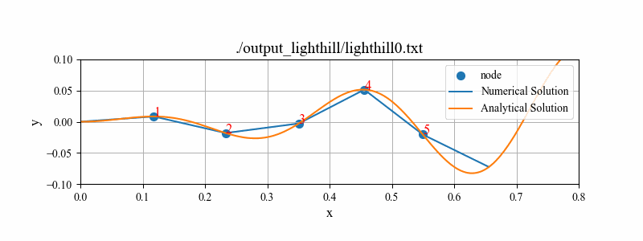
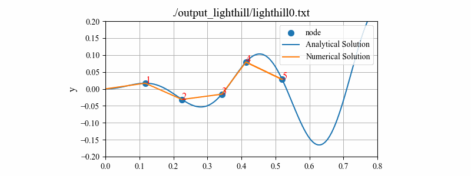
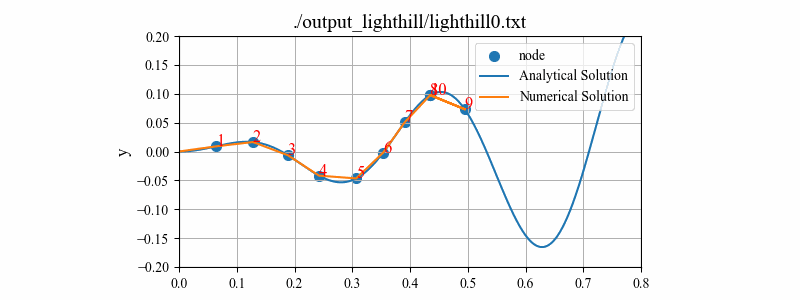

# Contents

- [🐋ニュートン法](#🐋ニュートン法)
    - [⛵️ニュートン法](#⛵️ニュートン法)
    - [⛵️ロボットの節をLighthillの曲線上に乗せる](#⛵️ロボットの節をLighthillの曲線上に乗せる)
        - [🪸レビュー](#🪸レビュー)
        - [🪸Lighthillの式](#🪸Lighthillの式)
        - [🪸目的関数$f$](#🪸目的関数$f$)
        - [🪸工夫点](#🪸工夫点)
        - [🪸ロボットのエネルギー効率について](#🪸ロボットのエネルギー効率について)
    - [⛵️準ニュートン法](#⛵️準ニュートン法)


---
# 🐋ニュートン法 

## ⛵️ニュートン法 

**最適か否かを判断するための関数**，**ゼロまたは最大か最小にしたい関数**を目的関数と呼ぶ．
ヤコビ行列をやヘッセ行列，その両方を使う場合がある．

目的関数の根を見つける場合は，ヤコビ行列を使う．
最適化の問題の多くは，目的関数の最大最小を求めることなので，ヘッセ行列を利用したニュートン法を用いる．


<p  align="right"><a href="./example0_NewtonRaphson_0.cpp#L1">./example0_NewtonRaphson_0.cpp#L1</a></p>

## ⛵️ロボットの節をLighthillの曲線上に乗せる 

### 🪸レビュー 

[REVIEW.md](./REVIEW.md)

### 🪸Lighthillの式 

Lighthillの式：

$$
{\bf x}^{\rm LH}(x,t) = (x,y^{\rm LH}(x,t)),\quad
y^{\rm LH}(x,t) = \left( \frac{c _1}{L} x + {c _2} \left(\frac{x}{L}\right)^2 \right) \sin \left( \frac{2 \pi}{L} x - \omega t \right)
$$

ロボットの$i$番目の節の位置ベクトル：

$$
{\bf x} _{i}^{\rm rb} = {\bf x} _{i-1}^{\rm rb} + r \left( \cos \theta _i, \sin \theta _i \right)
$$

ここで，変数の意味は以下の通り．

| variable | meaning |
|:---:|:---:|
| $L$ | 全長 |
| $\omega$ | 角周波数 |
| $k$ | 波数 |
| $c _1$ | 振幅1 |
| $c _2$ | 振幅2 |
| $n$ | ロボットの関節の数 |
| $r$ | ロボットの関節間の長さ |
| $\theta _i$ | $i$番目の関節が進行方向となす角度 |

### 🪸目的関数$f$ 

Lighthillの式にこの節を乗せるには，どのような目的関数$f$を用いればよいだろうか．
最適化する節の一つ前の節の位置を${\bf a}=(a _x,a _y)$とすると，次の目的関数$f$が考えられる．

$$
f(\theta) = y^{\rm LH}(x,t) - a _y - r \sin \theta
$$

ニュートン法には微分が必要．

$$
\frac{df}{d\theta} = -r \sin\theta\frac{d y^{\rm LH} }{dx}-r\cos\theta
$$

ただ，$f$を目的関数とすると根への収束が良くなかったので，$f^2/2$を目的関数として計算する．目的関数の微分は，$f \frac{df}{d\theta}$としている．

💡 この目的関数$f$には，前の節の位置が含まれているが，この目的関数を使って，先頭から順番に角度を決めていけば，各最適化において見積もる角度は常に１つだけとなる．

| $n=5$ | $n=10$ | $n=50$ |
|:---:|:---:|:---:|
|   |  |  |

### 🪸工夫点 

愚直にニュートン法を適用すると，比較的振幅が大きい場合，正しい角度が得られない．
例えば以下のケース．

```
double L = 0.71;
double w = 2. * M_PI * 1.0;
double k = 2. * M_PI * 2.0;
double c1 = 0.1;
double c2 = 0.1;
int nodes = 10;
int steps = 20;
```

そのような場合，[ここ](../../include/rootFinding.hpp#L253)のニュートン法のステップ幅を小さくすることで，正しい角度が得られる場合がある．


| `scale` | $n=5$ | $n=10$ | $n=50$ |
|:---:|:---:|:---:|:---:|
| `scale=1.0` |   |  |  |
| `scale=0.1` |  |  |  |


LighthillRobotのクラスは，[ここ](../../include/rootFinding.hpp#L214)で宣言している．

### 🪸ロボットのエネルギー効率について 

話がNewton法から離れるが，ロボットのエネルギー効率について．この内容は後で移動しておく．

ロボットの運動エネルギーは，$\frac{1}{2}m v^2$．
ロボットの運動エネルギーがロボットの出力だけから得られるとすると，
ロボットの出力は，このロボットの運動エネルギーの時間変化，$m v\frac{dv}{dt}$となる．
供給電力$P$は，電流$I$と電圧$V$の積$P = I V$なので，ロボットのエネルギー効率は，

$$
\eta = \frac{m v a}{I V}
$$


<p  align="right"><a href="./example0_NewtonRaphson_1.cpp#L6">./example0_NewtonRaphson_1.cpp#L6</a></p>

## ⛵️準ニュートン法 

ニュートン法で使うヤコビ行列などを別のものに置き換えた方法．


<p  align="right"><a href="./example1_Broyden.cpp#L1">./example1_Broyden.cpp#L1</a></p>

---
