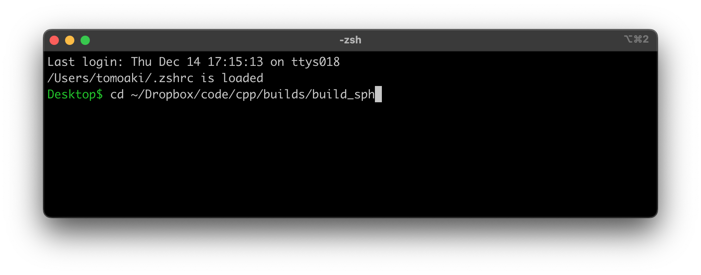
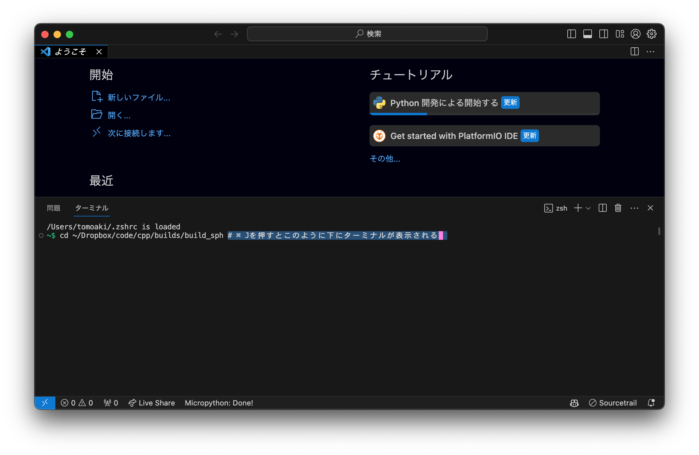
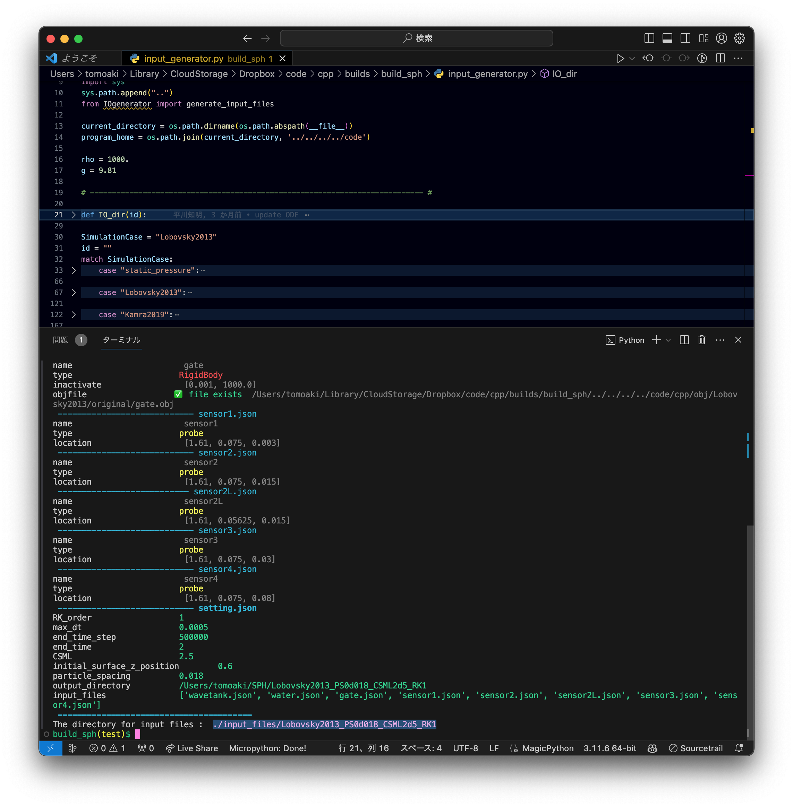
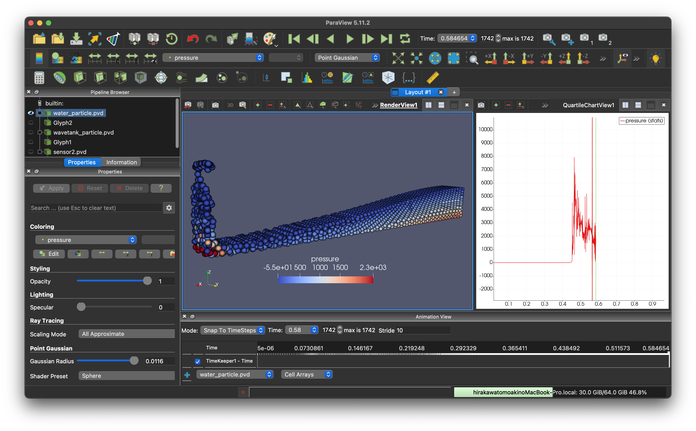

<!--EXTRACT_README_FOR_STUDENTS-->

# 基本的な使い方

## コンパイルと実行

### ターミナルを開く

<table>
    <tr>
        <td>
            <figure>
                <br>
                <figcaption>ターミナルを開いてファイルのあるディレクトリまで移動する</figcaption>
            </figure>
        </td>
        <td>
            <figure>
                <br>
                <figcaption>または，vscodeを開き，Ctrl + jでターミナルを開き，ファイルのあるディレクトリまで移動する</figcaption>
            </figure>
        </td>
    </tr>
</table>


### `main.cpp`が保存されているディレクトリに移動する．

```shell
cd ~/code/cpp/builds/build_sph # ビルドディレクトリに移動
code ./ # vscodeで開く
```

### 入力ファイルを作成する．

`input_generator.py`を実行すると，計算の設定情報を書いたインプットファイルが生成される．

 

この場合，最後に表示されている`./input_files/Lobovsky2013_PS0d018_CSML2d5_RK1`がインプットファイルが保存されたパスになる．

| インプットファイル名の例 | 説明 |
|:--|:--|
|setting.json| 計算の設定情報を書いたJSONファイル．|
|tank.json| 水槽の設定情報を書いたJSONファイル．例えば，名前やobjファイルのパスや，剛体であることが書かれている．|
|water.json| 水の設定情報を書いたJSONファイル．例えば名前やobjファイルのパス，剛体ではなく水であることが書かれている．|

### `main.cpp`を修正する
 
例えば次の箇所を修正することで，ISPHとEISPHを切り替えることができる．

```cpp
#define USE_ISPH //->#define USE_EISPH
```

### コンパイルして実行する．

コンパイルには`cmake`を使用している．`cmake`は，`CMakeLists.txt`に書かれた内容に従って，ヘッダファイルやライブラリを探して，コンパイルを行い，実行ファイルを生成する．

```shell
sh clean # 古いCMakeFilesなどを削除する．
cmake -DCMAKE_BUILD_TYPE=Release ../　# Releaseモードでコンパイルする．
make　# コンパイル（ビルド）する．
```

実行する．

```shell
./main ./input_files/Lobovsky2013_PS0d018_CSML2d5_RK1 # 実行する．
```

その他利用するコマンド：

* 強制終了: Ctrl + C

# 比較対象

\cite{Lobovsky2014}と計算結果を比較しよう．



[paraview](https://www.paraview.org/tutorials/)で可視化し，壁面に設置された圧力センサーの実験結果とSPHの計算結果を比較する．

* 計算方法を理解し，結果を考察する
* タイムステップや粒子数，平滑化距離などのパラメータを変更し，結果を比較する．
    * タイムステップは，CFL条件によって決まるので，CFL条件の設定を確認する．
    * 粒子数は，初期の粒子間距離によって決まるので，初期粒子間距離の設定を確認する．
    * 平滑化距離の変更に応じて，適切な核関数$`W`$も変化するので，核関数の設定を確認する．
  

<!--EXTRACT_README_FOR_STUDENTS-->