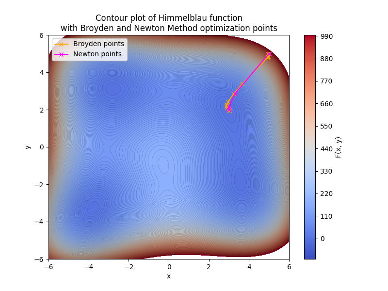
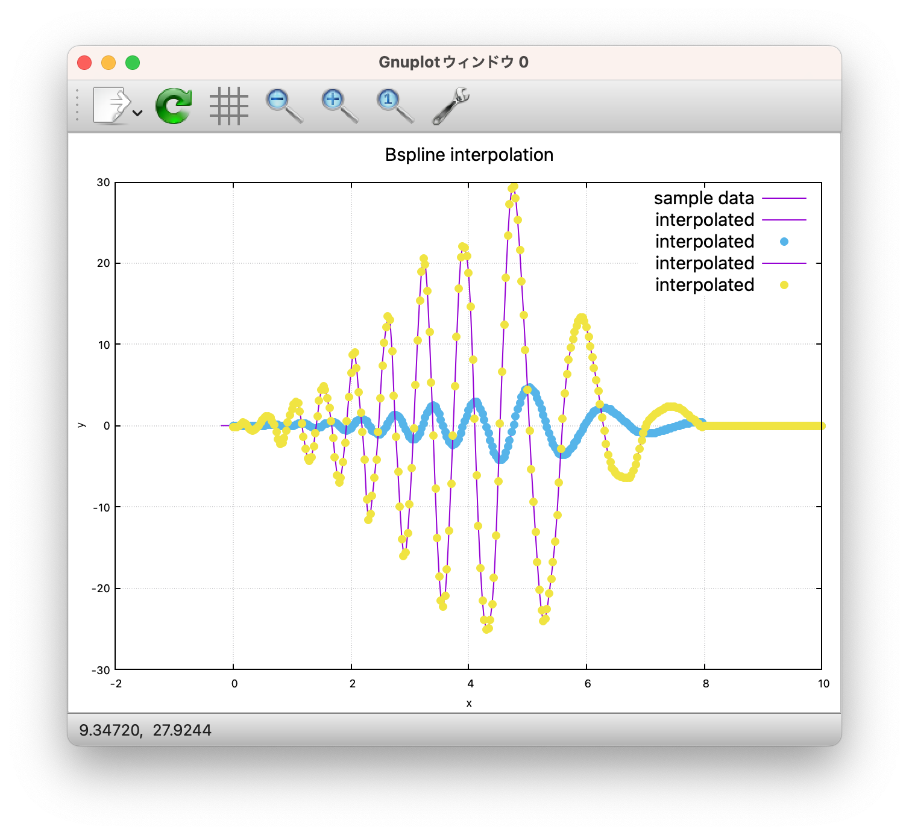
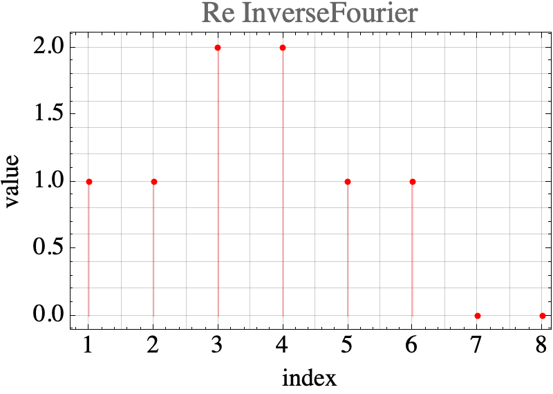
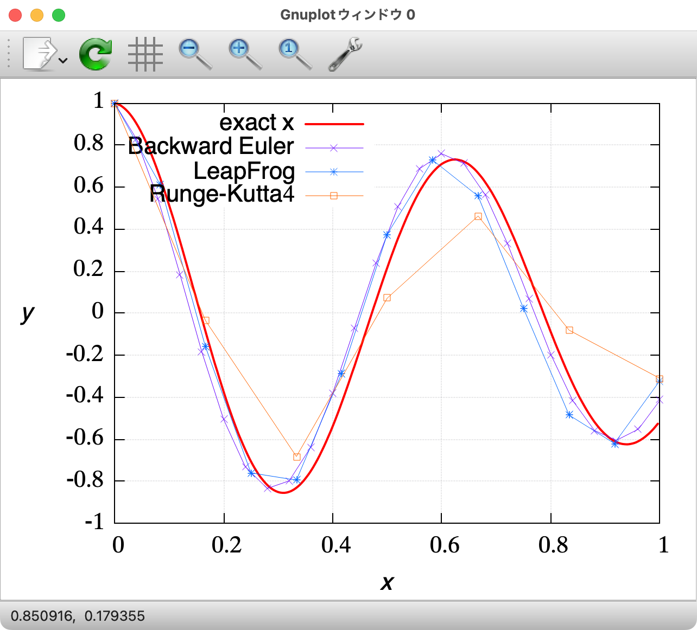
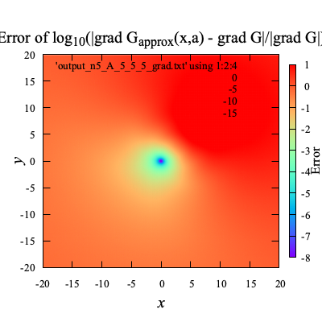
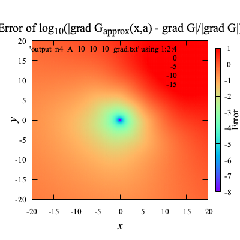

# Contents
        - [🪼 CRSの使用例](#🪼-CRSの使用例)
- [🐋 ニュートン法](#🐋-ニュートン法)
    - [⛵ ニュートン法](#⛵-ニュートン法)
- [🐋 Smoothed Particle Hydrodynamics (SPH) ISPH EISPH](#🐋-Smoothed-Particle-Hydrodynamics-(SPH)-ISPH-EISPH)
- [🐋 Smoothed Particle Hydrodynamics (SPH) ISPH EISPH](#🐋-Smoothed-Particle-Hydrodynamics-(SPH)-ISPH-EISPH)
    - [⛵ 概要](#⛵-概要)
        - [🪼 要素法と粒子法](#🪼-要素法と粒子法)
        - [🪼 SPH](#🪼-SPH)
        - [🪼 このプログラムの目的](#🪼-このプログラムの目的)
        - [🪼 大まかな計算の流れ](#🪼-大まかな計算の流れ)
            - [🐚 Navier-Stokes方程式を解く前の準備](#🐚-Navier-Stokes方程式を解く前の準備)
            - [🐚 Navier-Stokes方程式を解く](#🐚-Navier-Stokes方程式を解く)
- [🐋 Smoothed Particle Hydrodynamics (SPH) ISPH EISPH](#🐋-Smoothed-Particle-Hydrodynamics-(SPH)-ISPH-EISPH)
    - [⛵ 概要](#⛵-概要)
        - [🪼 要素法と粒子法](#🪼-要素法と粒子法)
        - [🪼 SPH](#🪼-SPH)
        - [🪼 このプログラムの目的](#🪼-このプログラムの目的)
        - [🪼 大まかな計算の流れ](#🪼-大まかな計算の流れ)
            - [🐚 Navier-Stokes方程式を解く前の準備](#🐚-Navier-Stokes方程式を解く前の準備)
            - [🐚 Navier-Stokes方程式を解く](#🐚-Navier-Stokes方程式を解く)
- [🐋 pybind11の使い方](#🐋-pybind11の使い方)
    - [⛵ pybind11の書き方](#⛵-pybind11の書き方)
- [🐋 数値積分](#🐋-数値積分)
    - [⛵ 台形則](#⛵-台形則)
- [🐋 クォータニオンを使った物体の３次元回転](#🐋-クォータニオンを使った物体の３次元回転)
    - [⛵ クォータニオンを使ったシンプルな回転](#⛵-クォータニオンを使ったシンプルな回転)
            - [🐚 CRSは，ある行ベクトルを格納するクラスと考える](#🐚-CRSは，ある行ベクトルを格納するクラスと考える)
            - [🐚 `setIndexCRS`](#🐚-`setIndexCRS`)
            - [🐚 値を格納：`set`と`increment`](#🐚-値を格納：`set`と`increment`)
            - [🐚 `selfDot`](#🐚-`selfDot`)
- [🐋 BEM-MEL](#🐋-BEM-MEL)
- [🐋 固有値問題](#🐋-固有値問題)
    - [⛵ 固有値の計算](#⛵-固有値の計算)
- [🐋 `Network`](#🐋-`Network`)
    - [⛵ 3Dファイルの読み込みと出力](#⛵-3Dファイルの読み込みと出力)
        - [🪼 読み込み `Network`](#🪼-読み込み-`Network`)
        - [🪼 出力 `vtkPolygonWrite`](#🪼-出力-`vtkPolygonWrite`)
            - [🐚 面の出力](#🐚-面の出力)
            - [🐚 線の出力](#🐚-線の出力)
            - [🐚 実行方法](#🐚-実行方法)
    - [⛵ クォータニオンの微分](#⛵-クォータニオンの微分)
    - [⛵ 角加速度からクォータニオンの微分を計算](#⛵-角加速度からクォータニオンの微分を計算)
        - [🪼 CFL条件の設定](#🪼-CFL条件の設定)
        - [🪼 CFL条件の設定](#🪼-CFL条件の設定)
        - [🪼 CFL条件の設定](#🪼-CFL条件の設定)
        - [🪼 CFL条件の設定](#🪼-CFL条件の設定)
    - [⛵ pybind11で共有ライブラリを作成](#⛵-pybind11で共有ライブラリを作成)
    - [⛵ ルジャンドル多項式，ルジャンドル補間，ガウス・ルジャンドル積分](#⛵-ルジャンドル多項式，ルジャンドル補間，ガウス・ルジャンドル積分)
- [🐋 補間](#🐋-補間)
    - [⛵ ラグランジュ補間](#⛵-ラグランジュ補間)
    - [⛵ N.S.方程式を解く前の準備](#⛵-N.S.方程式を解く前の準備)
    - [⛵ N.S.方程式を解く前の準備](#⛵-N.S.方程式を解く前の準備)
    - [⛵ N.S.方程式を解く前の準備](#⛵-N.S.方程式を解く前の準備)
    - [⛵ N.S.方程式を解く前の準備](#⛵-N.S.方程式を解く前の準備)
    - [⛵ N.S.方程式を解く前の準備](#⛵-N.S.方程式を解く前の準備)
    - [⛵ N.S.方程式を解く前の準備](#⛵-N.S.方程式を解く前の準備)
    - [⛵ ロボットの節をLighthillの曲線上に乗せる](#⛵-ロボットの節をLighthillの曲線上に乗せる)
        - [🪼 レビュー](#🪼-レビュー)
        - [🪼 Lighthillの式](#🪼-Lighthillの式)
        - [🪼 目的関数$f$](#🪼-目的関数$f$)
        - [🪼 工夫点](#🪼-工夫点)
        - [🪼 ロボットのエネルギー効率について](#🪼-ロボットのエネルギー効率について)
    - [⛵ 準ニュートン法](#⛵-準ニュートン法)
        - [🪼 `setCorrectionMatrix_gradient`について](#🪼-`setCorrectionMatrix_gradient`について)
        - [🪼 `setCorrectionMatrix_laplacian`について](#🪼-`setCorrectionMatrix_laplacian`について)
        - [🪼 `setCorrectionMatrix`について](#🪼-`setCorrectionMatrix`について)
        - [🪼 `setCorrectionMatrix`について](#🪼-`setCorrectionMatrix`について)
        - [🪼 `setCorrectionMatrix`について](#🪼-`setCorrectionMatrix`について)
            - [🐚 `interp_normal_original`の計算](#🐚-`interp_normal_original`の計算)
            - [🐚 `setCorrectionMatrix`で壁粒子の演算修正用行列を計算](#🐚-`setCorrectionMatrix`で壁粒子の演算修正用行列を計算)
        - [🪼 壁面粒子の抽出と値の計算](#🪼-壁面粒子の抽出と値の計算)
            - [🐚 `isCaptured`が`true`の壁面粒子の流速の計算](#🐚-`isCaptured`が`true`の壁面粒子の流速の計算)
        - [🪼 壁面粒子の抽出と値の計算](#🪼-壁面粒子の抽出と値の計算)
            - [🐚 `interp_normal_original`の計算](#🐚-`interp_normal_original`の計算)
            - [🐚 `isCaptured`が`true`の壁面粒子の流速の計算](#🐚-`isCaptured`が`true`の壁面粒子の流速の計算)
            - [🐚 `setCorrectionMatrix`で壁粒子の演算修正用行列を計算](#🐚-`setCorrectionMatrix`で壁粒子の演算修正用行列を計算)
        - [🪼 壁面粒子の抽出と値の計算](#🪼-壁面粒子の抽出と値の計算)
            - [🐚 `interp_normal_original`の計算](#🐚-`interp_normal_original`の計算)
            - [🐚 `isCaptured`の決定](#🐚-`isCaptured`の決定)
            - [🐚 `isCaptured`が`true`の壁面粒子の流速の計算](#🐚-`isCaptured`が`true`の壁面粒子の流速の計算)
            - [🐚 `setCorrectionMatrix`で壁粒子の演算修正用行列を計算](#🐚-`setCorrectionMatrix`で壁粒子の演算修正用行列を計算)
            - [🐚 `isCaptured`の決定](#🐚-`isCaptured`の決定)
            - [🐚 `isCaptured`の決定](#🐚-`isCaptured`の決定)
        - [🪼 流体の法線方向の計算と水面の判定](#🪼-流体の法線方向の計算と水面の判定)
            - [🐚 流体の法線方向の計算](#🐚-流体の法線方向の計算)
            - [🐚 水面の判定](#🐚-水面の判定)
        - [🪼 流体の法線方向の計算と水面の判定](#🪼-流体の法線方向の計算と水面の判定)
            - [🐚 `setCorrectionMatrix`で流体粒子の演算修正用行列を計算](#🐚-`setCorrectionMatrix`で流体粒子の演算修正用行列を計算)
            - [🐚 流体の法線方向の計算](#🐚-流体の法線方向の計算)
            - [🐚 水面の判定](#🐚-水面の判定)
        - [🪼 流体の法線方向の計算と水面の判定](#🪼-流体の法線方向の計算と水面の判定)
            - [🐚 `setCorrectionMatrix`で流体粒子の演算修正用行列を計算](#🐚-`setCorrectionMatrix`で流体粒子の演算修正用行列を計算)
            - [🐚 流体の法線方向の計算](#🐚-流体の法線方向の計算)
            - [🐚 水面の判定](#🐚-水面の判定)
    - [⛵ 入力ファイルの読み込み](#⛵-入力ファイルの読み込み)
    - [⛵ 計算プログラムの概要](#⛵-計算プログラムの概要)
        - [🪼 計算の流れ](#🪼-計算の流れ)
    - [⛵ 境界のタイプを決定する](#⛵-境界のタイプを決定する)
        - [🪼 多重節点](#🪼-多重節点)
        - [🪼 `getContactFaces()`や`getNearestContactFace()`の利用](#🪼-`getContactFaces()`や`getNearestContactFace()`の利用)
            - [🐚 `contact_angle`と`isInContact()`](#🐚-`contact_angle`と`isInContact()`)
            - [🐚 `addContactFaces()`](#🐚-`addContactFaces()`)
            - [🐚 呼び出し方法](#🐚-呼び出し方法)
        - [🪼 `uNeumann()`と`accelNeumann()`](#🪼-`uNeumann()`と`accelNeumann()`)
        - [🪼 CoordinateBounds クラスについて](#🪼-CoordinateBounds-クラスについて)
            - [🐚 概要](#🐚-概要)
            - [🐚 メンバ変数](#🐚-メンバ変数)
            - [🐚 メンバ関数](#🐚-メンバ関数)
            - [🐚 オペレーター](#🐚-オペレーター)
            - [🐚 有用性](#🐚-有用性)
        - [🪼 `PVDWriter`を使ったpvdファイルの作成方法](#🪼-`PVDWriter`を使ったpvdファイルの作成方法)
- [🐋 空間分割（space_partitioning）](#🐋-空間分割（space_partitioning）)
    - [⛵ 等間隔のシンプルな空間分割](#⛵-等間隔のシンプルな空間分割)
        - [🪼 例](#🪼-例)
    - [⛵ B-spline補間](#⛵-B-spline補間)
        - [🪼 実行方法](#🪼-実行方法)
        - [🪼 コード](#🪼-コード)
    - [⛵ 粘性項$`\nabla^2 {\bf u} _i`$の計算（`calcLaplacianU`）](#⛵-粘性項$`\nabla^2-{\bf-u}-_i`$の計算（`calcLaplacianU`）)
    - [⛵ 粘性項$`\nabla^2 {\bf u} _i`$の計算（`calcLaplacianU`）](#⛵-粘性項$`\nabla^2-{\bf-u}-_i`$の計算（`calcLaplacianU`）)
    - [⛵ 粘性項$`\nabla^2 {\bf u} _i`$の計算（`calcLaplacianU`）](#⛵-粘性項$`\nabla^2-{\bf-u}-_i`$の計算（`calcLaplacianU`）)
    - [⛵ 粘性項$`\nabla^2 {\bf u} _i`$の計算（`calcLaplacianU`）](#⛵-粘性項$`\nabla^2-{\bf-u}-_i`$の計算（`calcLaplacianU`）)
    - [⛵ python内で共有ライブラリを使う](#⛵-python内で共有ライブラリを使う)
        - [🪼 アニメーションgifファイルを作成しロボットの動きを可視化する](#🪼-アニメーションgifファイルを作成しロボットの動きを可視化する)
        - [🪼 モーターの節の位置と角度の時間変化をdatファイルに出力する](#🪼-モーターの節の位置と角度の時間変化をdatファイルに出力する)
    - [⛵ ポアソン方程式 $`\nabla ^{n+1} \cdot \left(\frac{1}{\rho ^n} \nabla ^{n} p \right)=b`$](#⛵-ポアソン方程式-$`\nabla-^{n+1}-\cdot-\left(\frac{1}{\rho-^n}-\nabla-^{n}-p-\right)=b`$)
        - [🪼 ポアソン方程式](#🪼-ポアソン方程式)
        - [🪼 右辺，$`b`$，`PoissonRHS`について](#🪼-右辺，$`b`$，`PoissonRHS`について)
        - [🪼 左辺について](#🪼-左辺について)
        - [🪼 水面の計算補助粒子`auxiliaryPoints`](#🪼-水面の計算補助粒子`auxiliaryPoints`)
    - [⛵ ポアソン方程式 $`\nabla ^{n+1} \cdot \left(\frac{1}{\rho ^n} \nabla ^{n} p \right)=b`$](#⛵-ポアソン方程式-$`\nabla-^{n+1}-\cdot-\left(\frac{1}{\rho-^n}-\nabla-^{n}-p-\right)=b`$)
        - [🪼 ポアソン方程式](#🪼-ポアソン方程式)
        - [🪼 右辺，$`b`$，`PoissonRHS`について](#🪼-右辺，$`b`$，`PoissonRHS`について)
        - [🪼 左辺について](#🪼-左辺について)
        - [🪼 水面の計算補助粒子`auxiliaryPoints`](#🪼-水面の計算補助粒子`auxiliaryPoints`)
    - [⛵ ポアソン方程式 $`\nabla ^{n+1} \cdot \left(\frac{1}{\rho ^n} \nabla ^{n} p \right)=b`$](#⛵-ポアソン方程式-$`\nabla-^{n+1}-\cdot-\left(\frac{1}{\rho-^n}-\nabla-^{n}-p-\right)=b`$)
        - [🪼 ポアソン方程式](#🪼-ポアソン方程式)
        - [🪼 右辺，$`b`$，`PoissonRHS`について](#🪼-右辺，$`b`$，`PoissonRHS`について)
        - [🪼 左辺について](#🪼-左辺について)
        - [🪼 水面の計算補助粒子`auxiliaryPoints`](#🪼-水面の計算補助粒子`auxiliaryPoints`)
    - [⛵ ポアソン方程式 $`\nabla ^{n+1} \cdot \left(\frac{1}{\rho ^n} \nabla ^{n} p \right)=b`$](#⛵-ポアソン方程式-$`\nabla-^{n+1}-\cdot-\left(\frac{1}{\rho-^n}-\nabla-^{n}-p-\right)=b`$)
        - [🪼 ポアソン方程式](#🪼-ポアソン方程式)
        - [🪼 右辺，$`b`$，`PoissonRHS`について](#🪼-右辺，$`b`$，`PoissonRHS`について)
        - [🪼 左辺について](#🪼-左辺について)
        - [🪼 水面の計算補助粒子`auxiliaryPoints`](#🪼-水面の計算補助粒子`auxiliaryPoints`)
        - [🪼 次時刻の発散演算，$`\nabla^{n+1} \cdot {\bf b}^n = \sum _j \dfrac{m _j}{\rho _j^{n+1}}({\bf b} _j^n-{\bf b} _i^n)\cdot \nabla W({\bf x} _i^{n+1},{\bf x} _j^{n+1},h)`$](#🪼-次時刻の発散演算，$`\nabla^{n+1}-\cdot-{\bf-b}^n-=-\sum-_j-\dfrac{m-_j}{\rho-_j^{n+1}}({\bf-b}-_j^n-{\bf-b}-_i^n)\cdot-\nabla-W({\bf-x}-_i^{n+1},{\bf-x}-_j^{n+1},h)`$)
        - [🪼 次時刻の発散演算，$`\nabla^{n+1} \cdot {\bf b}^n = \sum _j \dfrac{m _j}{\rho _j^{n+1}}({\bf b} _j^n-{\bf b} _i^n)\cdot \nabla W({\bf x} _i^{n+1},{\bf x} _j^{n+1},h)`$](#🪼-次時刻の発散演算，$`\nabla^{n+1}-\cdot-{\bf-b}^n-=-\sum-_j-\dfrac{m-_j}{\rho-_j^{n+1}}({\bf-b}-_j^n-{\bf-b}-_i^n)\cdot-\nabla-W({\bf-x}-_i^{n+1},{\bf-x}-_j^{n+1},h)`$)
        - [🪼 次時刻の発散演算，$`\nabla^{n+1} \cdot {\bf b}^n = \sum _j \dfrac{m _j}{\rho _j^{n+1}}({\bf b} _j^n-{\bf b} _i^n)\cdot \nabla W({\bf x} _i^{n+1},{\bf x} _j^{n+1},h)`$](#🪼-次時刻の発散演算，$`\nabla^{n+1}-\cdot-{\bf-b}^n-=-\sum-_j-\dfrac{m-_j}{\rho-_j^{n+1}}({\bf-b}-_j^n-{\bf-b}-_i^n)\cdot-\nabla-W({\bf-x}-_i^{n+1},{\bf-x}-_j^{n+1},h)`$)
        - [🪼 次時刻の発散演算，$`\nabla^{n+1} \cdot {\bf b}^n = \sum _j \dfrac{m _j}{\rho _j^{n+1}}({\bf b} _j^n-{\bf b} _i^n)\cdot \nabla W({\bf x} _i^{n+1},{\bf x} _j^{n+1},h)`$](#🪼-次時刻の発散演算，$`\nabla^{n+1}-\cdot-{\bf-b}^n-=-\sum-_j-\dfrac{m-_j}{\rho-_j^{n+1}}({\bf-b}-_j^n-{\bf-b}-_i^n)\cdot-\nabla-W({\bf-x}-_i^{n+1},{\bf-x}-_j^{n+1},h)`$)
        - [🪼 圧力の安定化](#🪼-圧力の安定化)
        - [🪼 圧力の安定化](#🪼-圧力の安定化)
        - [🪼 圧力の安定化](#🪼-圧力の安定化)
        - [🪼 圧力の安定化](#🪼-圧力の安定化)
    - [⛵ ポアソン方程式の解法](#⛵-ポアソン方程式の解法)
    - [⛵ ポアソン方程式の解法](#⛵-ポアソン方程式の解法)
    - [⛵ ポアソン方程式の解法](#⛵-ポアソン方程式の解法)
    - [⛵ ポアソン方程式の解法](#⛵-ポアソン方程式の解法)
    - [⛵ 圧力勾配$`\nabla p^{n+1}`$の計算](#⛵-圧力勾配$`\nabla-p^{n+1}`$の計算)
    - [⛵ 圧力勾配$`\nabla p^{n+1}`$の計算](#⛵-圧力勾配$`\nabla-p^{n+1}`$の計算)
    - [⛵ 圧力勾配$`\nabla p^{n+1}`$の計算](#⛵-圧力勾配$`\nabla-p^{n+1}`$の計算)
    - [⛵ 境界値問題](#⛵-境界値問題)
        - [🪼 基礎方程式](#🪼-基礎方程式)
        - [🪼 境界積分方程式（BIE）](#🪼-境界積分方程式（BIE）)
        - [🪼 BIEの離散化](#🪼-BIEの離散化)
            - [🐚 線形三角要素](#🐚-線形三角要素)
            - [ 🐚 線形三角要素のヤコビアン](#-🐚-線形三角要素のヤコビアン)
            - [🐚 係数行列の作成](#🐚-係数行列の作成)
        - [🪼 リジッドモードテクニック](#🪼-リジッドモードテクニック)
    - [⛵ 階層のある空間分割（木構造）](#⛵-階層のある空間分割（木構造）)
    - [⛵ 初期値問題](#⛵-初期値問題)
        - [🪼 流速$`\frac{d\bf x}{dt}`$の計算](#🪼-流速$`\frac{d\bf-x}{dt}`$の計算)
        - [🪼 $`\frac{d\phi}{dt}`$の計算](#🪼-$`\frac{d\phi}{dt}`$の計算)
    - [⛵ 注意点](#⛵-注意点)
    - [⛵ 出力](#⛵-出力)
    - [⛵ 出力（ポリゴン）](#⛵-出力（ポリゴン）)
    - [⛵ 注意点](#⛵-注意点)
    - [⛵ 出力](#⛵-出力)
    - [⛵ 出力（ポリゴン）](#⛵-出力（ポリゴン）)
    - [⛵ 注意点](#⛵-注意点)
    - [⛵ 注意点](#⛵-注意点)
    - [⛵ 出力](#⛵-出力)
    - [⛵ 出力（ポリゴン）](#⛵-出力（ポリゴン）)
        - [🪼 作成したdatファイルを読み込んで確認する](#🪼-作成したdatファイルを読み込んで確認する)
        - [🪼 修正流速（激しい波の計算では格子が歪になりやすく，これがないと計算が難しい）](#🪼-修正流速（激しい波の計算では格子が歪になりやすく，これがないと計算が難しい）)
    - [⛵ 空間分割の応用例：オブジェクトの接触や交差の判定](#⛵-空間分割の応用例：オブジェクトの接触や交差の判定)
        - [🪼 オブジェクトの接触や交差の判定](#🪼-オブジェクトの接触や交差の判定)
    - [⛵ 浮体動揺解析](#⛵-浮体動揺解析)
        - [🪼 浮体の運動方程式](#🪼-浮体の運動方程式)
        - [🪼 $`\phi _t`$と$`\phi _{nt}`$に関するBIEの解き方（と$`\phi _{nt}`$の与え方）](#🪼-$`\phi-_t`$と$`\phi-_{nt}`$に関するBIEの解き方（と$`\phi-_{nt}`$の与え方）)
            - [🐚 ディリクレ節点の$`\phi _{nt}`$の与え方(水面：圧力が既知，$`\phi`$が既知)](#🐚-ディリクレ節点の$`\phi-_{nt}`$の与え方(水面：圧力が既知，$`\phi`$が既知))
            - [🐚 ディリクレ節点の$`\phi _{t}`$の与え方($`\phi`$を与える造波装置：圧力が未知，$`\phi`$が既知)](#🐚-ディリクレ節点の$`\phi-_{t}`$の与え方($`\phi`$を与える造波装置：圧力が未知，$`\phi`$が既知))
            - [🐚 ノイマン節点での$`\phi _{nt}`$の与え方](#🐚-ノイマン節点での$`\phi-_{nt}`$の与え方)
            - [🐚 $`\phi`$のヘッセ行列の計算](#🐚-$`\phi`$のヘッセ行列の計算)
        - [🪼 $`\phi _{nt}`$の計算で必要となる$`{\bf n}\cdot \left({\frac{d\boldsymbol r}{dt}  \cdot \nabla\otimes\nabla \phi}\right)`$について．](#🪼-$`\phi-_{nt}`$の計算で必要となる$`{\bf-n}\cdot-\left({\frac{d\boldsymbol-r}{dt}--\cdot-\nabla\otimes\nabla-\phi}\right)`$について．)
        - [🪼 浮体の重心位置・姿勢・速度の更新](#🪼-浮体の重心位置・姿勢・速度の更新)
        - [🪼 補助関数を使った方法](#🪼-補助関数を使った方法)
        - [🪼 面同士の接触判定](#🪼-面同士の接触判定)
    - [⛵ 陽に与えられる境界条件に対して（造波装置など）](#⛵-陽に与えられる境界条件に対して（造波装置など）)
        - [🪼 フラップ型造波装置](#🪼-フラップ型造波装置)
        - [🪼 ピストン型造波装置](#🪼-ピストン型造波装置)
        - [🪼 正弦・余弦（`sin` もしくは `cos`）の運動](#🪼-正弦・余弦（`sin`-もしくは-`cos`）の運動)
        - [🪼 係留索の出力](#🪼-係留索の出力)
    - [⛵ その他](#⛵-その他)
        - [🪼 境界値問題の未知変数](#🪼-境界値問題の未知変数)
        - [🪼 エネルギー保存則（計算精度のチェックに利用できる）](#🪼-エネルギー保存則（計算精度のチェックに利用できる）)
        - [🪼 内部流速の計算方法（使わなくてもいい）](#🪼-内部流速の計算方法（使わなくてもいい）)
- [🐋 ケーブルの動的解析](#🐋-ケーブルの動的解析)
    - [⛵ 直線要素を用いたシミュレーション](#⛵-直線要素を用いたシミュレーション)
    - [⛵ 実行方法](#⛵-実行方法)
        - [🪼 JSONファイルの出力](#🪼-JSONファイルの出力)
- [🐋 実行方法](#🐋-実行方法)
- [🐋 実行方法](#🐋-実行方法)
- [🐋 実行方法](#🐋-実行方法)
    - [⛵ クォータニオンの時間微分，角速度](#⛵-クォータニオンの時間微分，角速度)
        - [🪼 クォータニオンの正規化](#🪼-クォータニオンの正規化)
    - [⛵ 剛体の回転と平行移動](#⛵-剛体の回転と平行移動)
- [🐋 入力ファイル生成 `input_generator.py`](#🐋-入力ファイル生成-`input_generator.py`)
    - [⛵ Usage](#⛵-Usage)
    - [⛵ Customization](#⛵-Customization)
    - [⛵ Output](#⛵-Output)
    - [⛵ 浮体係留用に`Network`の派生クラスを作成](#⛵-浮体係留用に`Network`の派生クラスを作成)
- [🐋 実行方法](#🐋-実行方法)
    - [⛵ ファイルのダウンロード](#⛵-ファイルのダウンロード)
    - [⛵ 入力ファイルの生成．](#⛵-入力ファイルの生成．)
    - [⛵ プログラムのコンパイルと実行](#⛵-プログラムのコンパイルと実行)
- [🐋 Input Generator](#🐋-Input-Generator)
    - [⛵ 5次スプライン関数](#⛵-5次スプライン関数)
    - [⛵ 3次スプライン関数](#⛵-3次スプライン関数)
- [🐋 Bucketを用いた粒子探索のテスト](#🐋-Bucketを用いた粒子探索のテスト)
- [🐋 Bucketを用いた粒子探索のテスト](#🐋-Bucketを用いた粒子探索のテスト)
- [🐋 Bucketを用いた粒子探索のテスト](#🐋-Bucketを用いた粒子探索のテスト)
- [🐋 Examples](#🐋-Examples)
- [🐋 CGALを使って四面体を生成する](#🐋-CGALを使って四面体を生成する)
    - [⛵ CGALを使って四面体を生成する](#⛵-CGALを使って四面体を生成する)
    - [⛵ Arnoldi過程](#⛵-Arnoldi過程)
        - [🪼 基底ベクトルの追加](#🪼-基底ベクトルの追加)
    - [⛵ 四面体を生成（制約付き四面分割 constrained tetrahedralization）](#⛵-四面体を生成（制約付き四面分割-constrained-tetrahedralization）)
- [🐋 フーリエ変換](#🐋-フーリエ変換)
    - [⛵ 複素フーリエ級数展開](#⛵-複素フーリエ級数展開)
    - [⛵ 離散フーリエ変換（インデックス周期$`N`$のフーリエ変換）](#⛵-離散フーリエ変換（インデックス周期$`N`$のフーリエ変換）)
    - [⛵ 逆離散フーリエ変換](#⛵-逆離散フーリエ変換)
    - [⛵ 離散フーリエ変換によるデータの補間](#⛵-離散フーリエ変換によるデータの補間)
    - [⛵ 一般化最小残差法/GMRES](#⛵-一般化最小残差法/GMRES)
- [🐋 JSONクラス](#🐋-JSONクラス)
- [🐋 多重極展開](#🐋-多重極展開)
    - [⛵ Green関数の多重極展開](#⛵-Green関数の多重極展開)
        - [🪼 球面座標系への変換](#🪼-球面座標系への変換)
- [🐋 ODEの初期値問題](#🐋-ODEの初期値問題)
    - [⛵ 減衰調和振動子/Damped Harmonic Oscillatorの例](#⛵-減衰調和振動子/Damped-Harmonic-Oscillatorの例)
        - [🪼 後退オイラー](#🪼-後退オイラー)
    - [⛵ Runge-Kutta Integration of ODE](#⛵-Runge-Kutta-Integration-of-ODE)
        - [🪼 LeapFrog](#🪼-LeapFrog)
        - [🪼 Runge-Kutta](#🪼-Runge-Kutta)
    - [⛵ QR分解](#⛵-QR分解)
        - [🪼 ギブンズ回転](#🪼-ギブンズ回転)
    - [⛵ 放射関数補間](#⛵-放射関数補間)
        - [🪼 重み$`w _i`$の見積もり](#🪼-重み$`w-_i`$の見積もり)
        - [🪼 放射基底関数$`\phi`$](#🪼-放射基底関数$`\phi`$)
            - [🐚 多重二乗（multiquadric RBF）](#🐚-多重二乗（multiquadric-RBF）)
            - [🐚 逆多重二乗（inverse multiquadric RBF）](#🐚-逆多重二乗（inverse-multiquadric-RBF）)
            - [🐚 ガウシアン（Gaussian RBF）](#🐚-ガウシアン（Gaussian-RBF）)
        - [🪼 補間関数の微分](#🪼-補間関数の微分)
            - [🐚 多重二乗](#🐚-多重二乗)
            - [🐚 逆多重二乗](#🐚-逆多重二乗)
            - [🐚 ガウシアン](#🐚-ガウシアン)
        - [🪼 最適なパラメタ$`{\varepsilon}`$](#🪼-最適なパラメタ$`{\varepsilon}`$)
- [🐋 Fusion360を使って計算用objファイルを生成](#🐋-Fusion360を使って計算用objファイルを生成)
- [🐋 計算用にメッシュの細分化](#🐋-計算用にメッシュの細分化)
    - [⛵ メッシュの細分化の方法](#⛵-メッシュの細分化の方法)
    - [⛵ 実行ファイルの作成方法（`remesh.cpp`のコンパイル方法）](#⛵-実行ファイルの作成方法（`remesh.cpp`のコンパイル方法）)
- [🐋 テスト](#🐋-テスト)
    - [⛵ 核関数のテスト](#⛵-核関数のテスト)
- [🐋 テスト](#🐋-テスト)
    - [⛵ 核関数のテスト](#⛵-核関数のテスト)
- [🐋 テスト](#🐋-テスト)
    - [⛵ 核関数のテスト](#⛵-核関数のテスト)
    - [⛵ C++でのJSON操作に関する実装と使用方法](#⛵-C++でのJSON操作に関する実装と使用方法)
        - [🪼 前提条件](#🪼-前提条件)
        - [🪼 JSONクラス](#🪼-JSONクラス)
            - [🐚 コンストラクタ](#🐚-コンストラクタ)
            - [🐚 操作](#🐚-操作)
        - [🪼 使用例](#🪼-使用例)
        - [🪼 ファイル出力](#🪼-ファイル出力)
        - [🪼 その他の機能](#🪼-その他の機能)
        - [🪼 注意点](#🪼-注意点)
        - [🪼 todo](#🪼-todo)
- [🐋 圧縮行格納法 (Compressed Row Storage, CRS)](#🐋-圧縮行格納法-(Compressed-Row-Storage,-CRS))
    - [⛵ 実装方法](#⛵-実装方法)
    - [⛵ CRS構造体の仕様](#⛵-CRS構造体の仕様)
        - [🪼 概要](#🪼-概要)
        - [🪼 メンバ変数](#🪼-メンバ変数)
        - [🪼 メンバ関数](#🪼-メンバ関数)
        - [🪼 `flip`可能かどうかの判定](#🪼-`flip`可能かどうかの判定)
    - [⛵ 三角形補間](#⛵-三角形補間)
    - [⛵ 範囲を修正した三角形形状関数](#⛵-範囲を修正した三角形形状関数)
    - [⛵ `Bucket`クラス](#⛵-`Bucket`クラス)
        - [🪼 メンバ変数](#🪼-メンバ変数)
        - [🪼 メソッド](#🪼-メソッド)
            - [🐚 初期化関連](#🐚-初期化関連)
            - [🐚 インデックス変換¸](#🐚-インデックス変換¸)
            - [🐚 データ追加・削除](#🐚-データ追加・削除)
            - [🐚 その他](#🐚-その他)
            - [🐚 接触の概念図](#🐚-接触の概念図)
        - [🪼 格子の平滑化](#🪼-格子の平滑化)
- [🐋 連立一次方程式の解法](#🐋-連立一次方程式の解法)
        - [🪼 テスト](#🪼-テスト)
    - [⛵ LU分解(LAPACK)](#⛵-LU分解(LAPACK))
    - [⛵ 共役勾配法と勾配降下法](#⛵-共役勾配法と勾配降下法)
        - [🪼 共役勾配法（Conjugate Gradient, CG）](#🪼-共役勾配法（Conjugate-Gradient,-CG）)
        - [🪼 勾配降下法 (Gradient Descent, GD)](#🪼-勾配降下法-(Gradient-Descent,-GD))
    - [⛵ 精度の確認](#⛵-精度の確認)
        - [🪼 $`G _{\rm apx}`$の精度](#🪼-$`G-_{\rm-apx}`$の精度)
        - [🪼 $`G _{\rm apx}`$の勾配$`\nabla G _{\rm apx}`$の精度](#🪼-$`G-_{\rm-apx}`$の勾配$`\nabla-G-_{\rm-apx}`$の精度)
    - [⛵ 境界要素法への応用](#⛵-境界要素法への応用)
        - [🪼 境界積分方程式](#🪼-境界積分方程式)
        - [🪼 空間分割](#🪼-空間分割)
        - [🪼 離散化](#🪼-離散化)


---
<!-- Key compressed_row_storage not found -->

### 🪼 CRSの使用例 

```shell
cmake -DCMAKE_BUILD_TYPE=Release ../ -DSOURCE_FILE=test3_CRS.cpp
make
./test3_CRS
```

ここには，`A`かける`V`をCRSを使って高速に計算する例を示している．

[../../builds/build_system_of_linear_eqs/test3_CRS.cpp#L1](../../builds/build_system_of_linear_eqs/test3_CRS.cpp#L1)

---
# 🐋 ニュートン法 

## ⛵ ニュートン法 

**最適か否かを判断するための関数**，**ゼロまたは最大か最小にしたい関数**を目的関数と呼ぶ．
ヤコビ行列をやヘッセ行列，その両方を使う場合がある．

目的関数の根を見つける場合は，ヤコビ行列を使う．
最適化の問題の多くは，目的関数の最大最小を求めることなので，ヘッセ行列を利用したニュートン法を用いる．

```bash
$ cmake -DCMAKE _BUILD _TYPE=Release ../ -DSOURCE _FILE=example0 _NewtonRaphson _0.cpp
$ make
$ ./example0_NewtonRaphson_0
```

[../../builds/build_root_finding/example0_NewtonRaphson_0.cpp#L1](../../builds/build_root_finding/example0_NewtonRaphson_0.cpp#L1)

---
ある回転軸$v$に対して，角度$\theta$だけ回転するクォータニオン$q$は以下のように表される．

```math
\begin{aligned}
q &= a + bi + cj + dk = \cos(\theta/2) +  \sin(\theta/2) \cdot \dfrac{v _x i + v _y k + v _z k}{\|v\|}\\
v &= (v _x, v _y, v _z)
\end{aligned}
```

`Rv()` a rotation transformation in the global coordinate system.

```math
Rv = \begin{bmatrix}
a^2 + b^2 - c^2 - d^2 & 2 \cdot b \cdot c - 2 \cdot a \cdot d & 2 \cdot a \cdot c + 2 \cdot b \cdot d \\
2 \cdot b \cdot c + 2 \cdot a \cdot d & a^2 - b^2 + c^2 - d^2 & -2 \cdot a \cdot b + 2 \cdot c \cdot d \\
-2 \cdot a \cdot c + 2 \cdot b \cdot d & 2 \cdot a \cdot b + 2 \cdot c \cdot d & a^2 - b^2 - c^2 + d^2 \\
\end{bmatrix}
```

The `Rs()` function looks like it's used to calculate how the global coordinates move relative to the object's coordinates, through rotation.
The matrix representation is:

```math
Rs = \begin{bmatrix}
a^2 + b^2 - c^2 - d^2 & 2 \cdot b \cdot c + 2 \cdot a \cdot d & -2 \cdot a \cdot c + 2 \cdot b \cdot d \\
2 \cdot b \cdot c - 2 \cdot a \cdot d & a^2 - b^2 + c^2 - d^2 & 2 \cdot a \cdot b + 2 \cdot c \cdot d \\
2 \cdot a \cdot c + 2 \cdot b \cdot d & -2 \cdot a \cdot b + 2 \cdot c \cdot d & a^2 - b^2 - c^2 + d^2 \\
\end{bmatrix}
```

[../../include/basic_vectors.hpp#L1290](../../include/basic_vectors.hpp#L1290)

---
# 🐋 Smoothed Particle Hydrodynamics (SPH) ISPH EISPH 

[README_ABSTRACT.md](./README_ABSTRACT.md)

[README_FOR_STUDENTS.md](./README_FOR_STUDENTS.md)

[../../builds/build_sph/SPH.hpp#L144](../../builds/build_sph/SPH.hpp#L144)

# 🐋 Smoothed Particle Hydrodynamics (SPH) ISPH EISPH 

## ⛵ 概要 

### 🪼 要素法と粒子法 

有限要素法や境界要素法など，
要素を利用する計算手法は，
節点の接続に基づき要素を構成し（補間），
微分方程式を離散化して解く．
基本的には，要素が歪になると計算ができない．
また，上手に要素を再構成するのは大変である．

一方の粒子法は，節点間になんら決まった（要素の様な）パターンを要求せず，再構成という概念がない．
きれいに整列した粒子の方が計算精度は高いが，乱れたとしても計算はできる．

### 🪼 SPH 

粒子法には主に２つの種類がある．
一つは，越塚らによって提案されたMoving Particle Semi-implicit (MPS)法であり，
もう一つは，[Gingold and Monaghan (1977)](https://academic.oup.com/mnras/article-lookup/doi/10.1093/mnras/181.3.375)と[Lucy (1977)](http://adsabs.harvard.edu/cgi-bin/bib_query?1977AJ.....82.1013L)によって提案されたSmoothed Particle Hydrodynamics (SPH)法である．
世界的にはSPH法がよく使われている．

SPHの研究者および産業ユーザーから成る[SPHETIC](https://www.spheric-sph.org/sph-projects-and-codes)というコミュニティがある．
それによるとSPHは，1970年代に天体物理学における非軸対称な現象を研究するために開発され，
その工学への応用は1990年代と2000年代初頭に登場した．
過去二十年で、この手法は多くの応用分野で急速に発展しており、
衝突から破壊，水面波のシミュレーション，流体-構造相互作用に至るまで多岐にわたっている．

### 🪼 このプログラムの目的 

このプログラムは，
ISPHとISPHを簡単化したEISPHを実装したものである．
まずは，不安要素が少ないISPHで安定した計算方法を確立し，
その後，EISPHへと移行する．

### 🪼 大まかな計算の流れ 

このSPHでは，非圧縮性流体のナビエ・ストークス方程式を解く．

```math
\frac{D\bf u}{Dt} = -\frac{1}{\rho}\nabla {p} + \nu\nabla^2{\bf u} + {\bf g},\quad  \nu=\frac{\mu}{\rho}
```

#### 🐚 Navier-Stokes方程式を解く前の準備 

1. バケットの生成
2. 流れの計算に関与する壁粒子を保存
3. CFL条件を満たすようにタイムステップ間隔 $`\Delta t`$を設定
4. 水面の判定

#### 🐚 Navier-Stokes方程式を解く 

5. $`\nabla^2 {\bf u}`$の計算
6. `PoissonRHS`,$`b`$と$`\nabla^2 p^{n+1}`$における$`p^{n+1}`$の係数の計算
7. 流速の発散から密度 $`{\rho}^\ast`$を計算
8. 次の時刻の圧力 $`p^{n+1}`$を計算
* 壁粒子の圧力の計算（流体粒子の現在の圧力$`p^n`$だけを使って近似）
* 流体粒子の圧力$`p^{n+1}`$の計算
9. $`\nabla {p^{n+1}}`$が計算でき， $`\frac{D{\bf u}}{D t}=-\frac{1}{\rho}\nabla {p^{n+1}} + \frac{1}{\nu}\nabla^2{\bf u} + {\bf g}`$（粘性率が一定の非圧縮性流れの加速度）を得る．
10. $`\frac{D\bf u}{Dt}`$を使って，流速を更新．流速を使って位置を更新

[../../builds/build_sph_/SPH.hpp#L140](../../builds/build_sph_/SPH.hpp#L140)

# 🐋 Smoothed Particle Hydrodynamics (SPH) ISPH EISPH 

## ⛵ 概要 

### 🪼 要素法と粒子法 

有限要素法や境界要素法など，
要素を利用する計算手法は，
節点の接続に基づき要素を構成し（補間），
微分方程式を離散化して解く．
基本的には，要素が歪になると計算ができない．
また，上手に要素を再構成するのは大変である．

一方の粒子法は，節点間になんら決まった（要素の様な）パターンを要求せず，再構成という概念がない．
きれいに整列した粒子の方が計算精度は高いが，乱れたとしても計算はできる．

### 🪼 SPH 

粒子法には主に２つの種類がある．
一つは，越塚らによって提案されたMoving Particle Semi-implicit (MPS)法であり，
もう一つは，[Gingold and Monaghan (1977)](https://academic.oup.com/mnras/article-lookup/doi/10.1093/mnras/181.3.375)と[Lucy (1977)](http://adsabs.harvard.edu/cgi-bin/bib_query?1977AJ.....82.1013L)によって提案されたSmoothed Particle Hydrodynamics (SPH)法である．
世界的にはSPH法がよく使われている．

SPHの研究者および産業ユーザーから成る[SPHETIC](https://www.spheric-sph.org/sph-projects-and-codes)というコミュニティがある．
それによるとSPHは，1970年代に天体物理学における非軸対称な現象を研究するために開発され，
その工学への応用は1990年代と2000年代初頭に登場した．
過去二十年で、この手法は多くの応用分野で急速に発展しており、
衝突から破壊，水面波のシミュレーション，流体-構造相互作用に至るまで多岐にわたっている．

### 🪼 このプログラムの目的 

このプログラムは，
ISPHとISPHを簡単化したEISPHを実装したものである．
まずは，不安要素が少ないISPHで安定した計算方法を確立し，
その後，EISPHへと移行する．

### 🪼 大まかな計算の流れ 

このSPHでは，非圧縮性流体のナビエ・ストークス方程式を解く．

```math
\frac{D\bf u}{Dt} = -\frac{1}{\rho}\nabla {p} + \nu\nabla^2{\bf u} + {\bf g},\quad  \nu=\frac{\mu}{\rho}
```

#### 🐚 Navier-Stokes方程式を解く前の準備 

1. バケットの生成
2. 流れの計算に関与する壁粒子を保存
3. CFL条件を満たすようにタイムステップ間隔 $`\Delta t`$を設定
4. 水面の判定

#### 🐚 Navier-Stokes方程式を解く 

5. $`\nabla^2 {\bf u}`$の計算
6. `PoissonRHS`,$`b`$と$`\nabla^2 p^{n+1}`$における$`p^{n+1}`$の係数の計算
7. 流速の発散から密度 $`{\rho}^\ast`$を計算
8. 次の時刻の圧力 $`p^{n+1}`$を計算
* 壁粒子の圧力の計算（流体粒子の現在の圧力$`p^n`$だけを使って近似）
* 流体粒子の圧力$`p^{n+1}`$の計算
9. $`\nabla {p^{n+1}}`$が計算でき， $`\frac{D{\bf u}}{D t}=-\frac{1}{\rho}\nabla {p^{n+1}} + \frac{1}{\nu}\nabla^2{\bf u} + {\bf g}`$（粘性率が一定の非圧縮性流れの加速度）を得る．
10. $`\frac{D\bf u}{Dt}`$を使って，流速を更新．流速を使って位置を更新

[../../builds/build_sph_back/SPH.hpp#L213](../../builds/build_sph_back/SPH.hpp#L213)

---
# 🐋 pybind11の使い方 

ラズパイでサーボモーターを動かすには，pythonを使うのが簡単．
ただ，数値計算においては，pythonの速度が遅いため実用的でなくなる場合があり，それを考慮しながらやっていくことは面倒．
そこで，pybind11を使って，pythonからでも読み込める共有ライブラリをc++を元に作った．

## ⛵ pybind11の書き方 

⚠️ `cmake`の`-DOUTPUT`オプションで指定した名前と同じ`shared_file_name_that_will_be_generated`を指定する．

```cpp
PYBIND11_MODULE(LighthillRobot, m) {
py::class_<LighthillRobot>(m, "LighthillRobot")
.def(py::init<double, double, double, double, double, int>())
.def_readwrite("c1", &LighthillRobot::c1)
.def_readwrite("c2", &LighthillRobot::c2)
.def("yLH", &LighthillRobot::yLH)
.def("X_RB", &LighthillRobot::X_RB)
.def("f", &LighthillRobot::f)
.def("ddx_yLH", &LighthillRobot::ddx_yLH)
.def("ddq_f", &LighthillRobot::ddq_f)
.def("getAngles", &LighthillRobot::getAngles)
.def("anglesToX", &LighthillRobot::anglesToX);
}
```

[../../builds/build_pybind11/LighthillRobot.cpp#L36](../../builds/build_pybind11/LighthillRobot.cpp#L36)

---
# 🐋 数値積分 

## ⛵ 台形則 

台形則は，関数の積分を台形の面積の和で近似する方法である．

```math
\int _a^b f(x) dx \approx \left(\frac{f(a)+f(b)}{2} + \sum _{i=1}^{N-1} f(a+i\Delta x)\right)\Delta x, \quad \Delta x = \frac{b-a}{N}
```

[../../builds/build_integration/TrapezoidalRule.cpp#L4](../../builds/build_integration/TrapezoidalRule.cpp#L4)

---
# 🐋 クォータニオンを使った物体の３次元回転 

## ⛵ クォータニオンを使ったシンプルな回転 

クォータニオンは，3D回転を効率的に計算するために便利な表現．

<!-- Key 0_0_0_Quaternion not found -->

* 以下のコードは、3Dオブジェクトの回転と平行移動を実行します．
* translate関数：ネットワークの全点を指定した量だけ平行移動します．
* rotate関数：指定したクォータニオンと中心点を使用して、ネットワークの全点を回転します．
* main関数：bunny、cow、camelオブジェクトをロードして、それぞれを回転させ、結果をファイルに出力します．

```
cmake -DCMAKE_BUILD_TYPE=Release ../ -DSOURCE_FILE=validateRotation.cpp
make
./validateRotation
```


$x$軸に対して回転 -> $y$軸に対して回転 -> $z$軸に対して回転

$(0.1,0,0)$を中心にして$x$軸に対して回転 -> $y$軸に対して回転 -> $z$軸に対して回転

時計回りが正である．

[../../builds/build_quaternion/validateRotation.cpp#L5](../../builds/build_quaternion/validateRotation.cpp#L5)

---
#### 🐚 CRSは，ある行ベクトルを格納するクラスと考える 

私のプログラムでは，Row-major orderで行列を格納しており，次のように行列を定義している．

```cpp
std::vector<std::vector<double>> Mat; // <- std::vector<ROW VECTOR> Mat;
```

```math
\begin{pmatrix}
\{a _{11} & a _{12} & a _{13} & \cdots & a _{1n}\}&\leftarrow {\text{a ROW VECTOR}} \\
\{a _{21} & a _{22} & a _{23} & \cdots & a _{2n}\}&\\
\{a _{31} & a _{32} & a _{33} & \cdots & a _{3n}\}&\\
\{\vdots & \vdots & \vdots & \ddots & \vdots \}&\\
\{a _{m1} & a _{m2} & a _{m3} & \cdots & a _{mn}\}&
\end{pmatrix}
```

CRSは，このROW VECTORを格納するクラスであり，CRSのベクトルが行列となる．

```cpp
std::vector<CRS*> Mat_CRS(A.size());
```

[../../builds/build_system_of_linear_eqs/test3_CRS.cpp#L72](../../builds/build_system_of_linear_eqs/test3_CRS.cpp#L72)

---
#### 🐚 `setIndexCRS` 

CRSは，`CRS->setIndexCRS(i)`のようにして，自身の行番号を保持しておく．
このインデックスは，`std::vector<VRS*>`と掛け算をする相手である`V`の行番号に対等させておく必要がある．

**掛け算`Dot(A,V)`において，CRS（これは行ベクトルと考える）は，自分に保存されている{row index,value}のセットを元に，`V[row index]*value`のようにして足し合わせていく．**

[../../builds/build_system_of_linear_eqs/test3_CRS.cpp#L99](../../builds/build_system_of_linear_eqs/test3_CRS.cpp#L99)

---
#### 🐚 値を格納：`set`と`increment` 

値を格納するには，２つの方法があり，`set`と`increment`がある．
このように，インデックスと値を指定するようにしているのは，
値がゼロの場合は，何もせず，インデックスも保存しないようにしているためである．

値を設定する，`set`と`increment`の第一引数は，CRSのポインタである．

[../../builds/build_system_of_linear_eqs/test3_CRS.cpp#L112](../../builds/build_system_of_linear_eqs/test3_CRS.cpp#L112)

#### 🐚 `selfDot` 

`selfDot`は，CRSに保存した`A`と`V`を掛け合わせる関数である．

[../../builds/build_system_of_linear_eqs/test3_CRS.cpp#L134](../../builds/build_system_of_linear_eqs/test3_CRS.cpp#L134)

---
# 🐋 BEM-MEL 

[README_FOR_STUDENTS.md](README_FOR_STUDENTS.md)

<details>
<summary>REVIEW.md</summary>

<!-- Key REVIEW.md not found -->

</details>

[../../builds/build_bem/main.cpp#L1](../../builds/build_bem/main.cpp#L1)

---
# 🐋 固有値問題 

## ⛵ 固有値の計算 

行列$`A`$をQR分解$`A=QR`$し，
$`A _k = Q _k^{-1} A Q _k`$の計算を繰り返すことで，
$`A _k`$の対角成分が$`A`$の固有値に収束することを確認する．

わかりやすいように$`\cdot`$で行列の積を表す．

```math
Q _2^{-1} \cdot (Q _1^{-1} \cdot (Q _0^{-1} \cdot (A = Q _0R _0) \cdot Q _0=Q _1R _1) \cdot Q _1=Q _2 \cdot R _2) \cdot R _2
```

[../../builds/build_eigen_value/testEigenValues.cpp#L11](../../builds/build_eigen_value/testEigenValues.cpp#L11)

---
# 🐋 `Network` 

数値シミュレーションの多くは，三角形や四面体の３Dメッシュを利用して行われる．
単純に配列にメッシュ情報を格納していては，シミュレーションの質を高めるための工夫を加えることが難しいと思われる．
例えば，ある節点に隣接する節点や辺や要素を取得するのは，配列に格納しているだけでは効率的に行うことができない．
`Network`クラスは，節点や辺や面の接続関係を保持し，接続関係から相互にアクセスできるようにするためのクラスである．
また，メッシュを細分化することもできる．
また，一度作成した`Network`クラスのオブジェクトから，`vtk`ファイルや`obj`ファイルなどを出力することができる．

* データの読み込みと出力
* 節点や辺や面の相互アクセス
* メッシュの細分化

## ⛵ 3Dファイルの読み込みと出力 

### 🪼 読み込み `Network` 

[Networkのコンストラクタ](../../include/Network.hpp#L4034)では，引数として，**OFFファイル**または**OBJファイル**をあたえることができる．
`Load3DFile`クラスを使ってデータを読み込み，`Network`クラスを作成する．

```cpp
auto obj = new Network("./bunny.obj");//ファイルからNetworkオブジェクトを作成
```

### 🪼 出力 `vtkPolygonWrite` 

`Network`クラスは，`getFaces`メンバ関数を使って簡単に面の情報を取得できる．

`vtkPolygonWrite`を使うと，`Network`クラスの面の情報を，`vtp`ファイルとして出力できる．
`vtkPolygonWrite`には，`ofstream`と，`std::vector<networkFace*>`や`std::vector<networkLine*>`などを渡し，出力できる．

#### 🐚 面の出力 

```cpp
auto obj = new Network("./bunny.obj");
std::ofstream ofs("./bunny_obj.vtp");
vtkPolygonWrite(ofs, obj->getFaces());
```


#### 🐚 線の出力 

```cpp
auto obj = new Network("./bunny.obj");
std::ofstream ofs("./bunny_obj.vtp");
vtkPolygonWrite(ofs, obj->getEdges());
```

#### 🐚 実行方法 

```shell
cmake -DCMAKE_BUILD_TYPE=Release ../ -DSOURCE_FILE=example0_load_3d_file.cpp
make
./example0_load_3d_file
```

[../../builds/build_Network/example0_load_3d_file.cpp#L1](../../builds/build_Network/example0_load_3d_file.cpp#L1)

---
## ⛵ クォータニオンの微分 

クォータニオンは姿勢を表し，クォータニオンをかけることで姿勢を変化させることができる．

上のoperator*に定義されるように
クォータニオン同士の積$`{\boldsymbol q} _1 * {\boldsymbol q} _2`$は次のように計算される．

```math
\begin{aligned}
{\boldsymbol q} _1 * {\boldsymbol q} _2 =
\begin{bmatrix}
a1 * a2 + -b1 * b2 + -c1 * c2 + -d1 * d2\\
a1 * b2 + b1 * a2 + c1 * d2 - d1 * c2\\
a1 * c2 - b1 * d2 + c1 * a2 + d1 * b2\\
a1 * d2 + b1 * c2 - c1 * b2 + d1 * a2
\end{bmatrix}
\end{aligned}
```

## ⛵ 角加速度からクォータニオンの微分を計算 

初期値問題を解くための数値計算は，$`x _{\text next} = x + \frac{dx}{dt} dt`$
という形に対して考えられているため，これに合わせるために，クォータニオンの微分を考える必要がある．

次の計算の$`\lim _{dt \to 0}`$を取ると，角加速度からクォータニオンの微分を計算できる．

```cpp
auto nextQ = Quaternion({1., 0., 0.}, w[0] * dt) * Quaternion({0., 1., 0.}, w[1] * dt) * Quaternion({0., 0., 1.}, w[2] * dt);
return ((nextQ * q)() - q()) / dt;
```

結果として以下が得られる．

```math
\begin{aligned}
\begin{bmatrix}
q0\\
q1\\
q2\\
q3
\end{bmatrix}
=
\begin{bmatrix}
-q1 * w0 - q2 * w1 - q3 * w2\\
q0 * w0 + q3 * w1 - q2 * w2\\
-q3 * w0 + q0 * w1 + q1 * w2\\
q2 * w0 - q1 * w1 + q0 * w2
\end{bmatrix}
\end{aligned}
```

これを使えば，$`q _{\text next} = q + \frac{dq}{dt} dt`$という形で初期値問題を解くことができる．

[../../include/basic_vectors.hpp#L1579](../../include/basic_vectors.hpp#L1579)

---
### 🪼 CFL条件の設定 

$`\max({\bf u}) \Delta t \leq c _{v} h \cap \max({\bf a}) \Delta t^2 \leq c _{a} h`$
を満たすように，毎時刻$`\Delta t`$を設定する．
$`c _v=0.1,c _a=0.1`$としている．

[../../builds/build_sph/SPH_Functions.hpp#L278](../../builds/build_sph/SPH_Functions.hpp#L278)

### 🪼 CFL条件の設定 

$`\max({\bf u}) \Delta t \leq c _{v} h \cap \max({\bf a}) \Delta t^2 \leq c _{a} h`$
を満たすように，毎時刻$`\Delta t`$を設定する．
$`c _v=0.1,c _a=0.1`$としている．

[../../builds/build_sph_/SPH_Functions.hpp#L252](../../builds/build_sph_/SPH_Functions.hpp#L252)

### 🪼 CFL条件の設定 

$`\max({\bf u}) \Delta t \leq c _{v} h \cap \max({\bf a}) \Delta t^2 \leq c _{a} h`$
を満たすように，毎時刻$`\Delta t`$を設定する．
$`c _v=0.1,c _a=0.1`$としている．

[../../builds/build_sph_back/SPH_Functions.hpp#L175](../../builds/build_sph_back/SPH_Functions.hpp#L175)

### 🪼 CFL条件の設定 

$`\max({\bf u}) \Delta t \leq c _{v} h \cap \max({\bf a}) \Delta t^2 \leq c _{a} h`$
を満たすように，毎時刻$`\Delta t`$を設定する．
$`c _v=0.1,c _a=0.1`$としている．

[../../builds/build_sph_back/SPH_Functions2.hpp#L175](../../builds/build_sph_back/SPH_Functions2.hpp#L175)

---
## ⛵ pybind11で共有ライブラリを作成 

この例は，c++のNewton法を利用して作った[Lighthill Robot](../../include/rootFinding.hpp#L231)をpythonで使うためのもの.

このディレクトリにCMakelists.txtを用意しているので，
それを使って，以下のようにターミナル上で実行・`make`すると，
Macだと`LighthillRobot_pybind.cpython-311-darwin.so`が作られる.

```sh
sh clean
cmake -DCMAKE_BUILD_TYPE=Release ./ -DINPUT=LighthillRobot.cpp -DOUTPUT=shared_file_name_that_will_be_generated
make
```

具体的には，以下のようにコンパイルする．

```sh
sh clean
cmake -DCMAKE_BUILD_TYPE=Release ./ -DINPUT=LighthillRobot.cpp -DOUTPUT=LighthillRobot -DCMAKE_CXX_COMPILER=/opt/homebrew/bin/g++-13
make
```

[../../builds/build_pybind11/LighthillRobot.cpp#L1](../../builds/build_pybind11/LighthillRobot.cpp#L1)

---
## ⛵ ルジャンドル多項式，ルジャンドル補間，ガウス・ルジャンドル積分 

🚧 このファイルは，ルジャンドル多項式，ルジャンドル補間，ガウス・ルジャンドル積分を扱う．

```sh
sh clean
cmake -DCMAKE_BUILD_TYPE=Release ../ -DSOURCE_FILE=LegendrePolynomials.cpp
make
./LegendrePolynomials > LegendrePolynomials.dat
```

```sh
gnuplot
file = 'LegendrePolynomials.dat'
plot for [i=2:7] file using 1:i title sprintf('order %d', i-2)
```

[../../builds/build_integration/LegendrePolynomials.cpp#L19](../../builds/build_integration/LegendrePolynomials.cpp#L19)

---
# 🐋 補間 

## ⛵ ラグランジュ補間 

与えられたデータ点を通る多項式を求める方法の一つにラグランジュ補間がある．

```math
f(x) = \sum _{i=0}^n\dfrac{\prod _{j=0,j\neq i}^n{(x - x _j)}}{\prod _{j=0,j\neq i,j\neq k}^n{(x _i - x _j)}}y _i
```

微分は，

```math
f(x) = \sum _{i=0}^n\dfrac{\sum _{k=0}^{n}\prod _{j=0,j\neq i}^n{(x - x _j)}}{\prod _{j=0,j\neq i}^n{(x _i - x _j)}}y _i
```


[../../builds/build_interpolation/interpolation_Lagrange.cpp#L12](../../builds/build_interpolation/interpolation_Lagrange.cpp#L12)

---
## ⛵ N.S.方程式を解く前の準備 

壁粒子の法線ベクトル`p->v_to_surface_SPH`を計算する．

[../../builds/build_sph/main.cpp#L270](../../builds/build_sph/main.cpp#L270)

## ⛵ N.S.方程式を解く前の準備 

壁粒子の法線ベクトル`p->v_to_surface_SPH`を計算する．

[../../builds/build_sph_/main.cpp#L251](../../builds/build_sph_/main.cpp#L251)

## ⛵ N.S.方程式を解く前の準備 

壁粒子の法線ベクトル`p->v_to_surface_SPH`を計算する．

[../../builds/build_sph_back/main.cpp#L252](../../builds/build_sph_back/main.cpp#L252)

---
## ⛵ N.S.方程式を解く前の準備

[../../builds/build_sph/SPH0_setWall_Freesurface.hpp#L11](../../builds/build_sph/SPH0_setWall_Freesurface.hpp#L11)

## ⛵ N.S.方程式を解く前の準備

[../../builds/build_sph_/SPH0_setWall_Freesurface.hpp#L7](../../builds/build_sph_/SPH0_setWall_Freesurface.hpp#L7)

## ⛵ N.S.方程式を解く前の準備

[../../builds/build_sph_back/SPH0_setWall_Freesurface.hpp#L7](../../builds/build_sph_back/SPH0_setWall_Freesurface.hpp#L7)

---
## ⛵ ロボットの節をLighthillの曲線上に乗せる 

### 🪼 レビュー 

<!-- Key ./REVIEW.md not found -->

### 🪼 Lighthillの式 

Lighthillの式：

```math
{\bf x}^{\rm LH}(x,t) = (x,y^{\rm LH}(x,t)),\quad
y^{\rm LH}(x,t) = \left( \frac{c _1}{L} x + {c _2} \left(\frac{x}{L}\right)^2 \right) \sin \left( \frac{2 \pi}{L} x - \omega t \right)
```

ロボットの$i$番目の節の位置ベクトル：

```math
{\bf x} _{i}^{\rm rb} = {\bf x} _{i-1}^{\rm rb} + r \left( \cos \theta _i, \sin \theta _i \right)
```

ここで，変数の意味は以下の通り．

| variable | meaning |
|:---:|:---:|
| $L$ | 全長 |
| $\omega$ | 角周波数 |
| $k$ | 波数 |
| $c _1$ | 振幅1 |
| $c _2$ | 振幅2 |
| $n$ | ロボットの関節の数 |
| $r$ | ロボットの関節間の長さ |
| $\theta _i$ | $i$番目の関節が進行方向となす角度 |

### 🪼 目的関数$f$ 

Lighthillの式にこの節を乗せるには，どのような目的関数$f$を用いればよいだろうか．
最適化する節の一つ前の節の位置を${\bf a}=(a _x,a _y)$とすると，次の目的関数$f$が考えられる．

```math
f(\theta) = y^{\rm LH}(x,t) - a _y - r \sin \theta
```

ニュートン法には微分が必要．

```math
\frac{df}{d\theta} = -r \sin\theta\frac{d y^{\rm LH} }{dx}-r\cos\theta
```


ただ，$f$を目的関数とすると根への収束が良くなかったので，$f^2/2$を目的関数として計算する．目的関数の微分は，$f \frac{df}{d\theta}$としている．

💡 この目的関数$f$には，前の節の位置が含まれているが，この目的関数を使って，先頭から順番に角度を決めていけば，各最適化において見積もる角度は常に１つだけとなる．

| n=5 | n=10 | n=50 |
|:---:|:---:|:---:|
|   |  |  |

### 🪼 工夫点 

愚直にニュートン法を適用すると，比較的振幅が大きい場合，正しい角度が得られない．
例えば以下のケース．

```cpp
double L = 0.71;
double w = 2. * M_PI * 1.0;
double k = 2. * M_PI * 2.0;
double c1 = 0.1;
double c2 = 0.1;
int nodes = 10;
int steps = 20;
```

そのような場合，[ここ](../../include/rootFinding.hpp#L269)のニュートン法のステップ幅を小さくすることで，正しい角度が得られる場合がある．


| `scale` | n=5 | n=10 | n=50 |
|:---:|:---:|:---:|:---:|
| `scale=1.0` |   |  |  |
| `scale=0.1` |  |  |  |


LighthillRobotのクラスは，[ここ](../../include/rootFinding.hpp#L231)で宣言している．

### 🪼 ロボットのエネルギー効率について 

話がNewton法から離れるが，ロボットのエネルギー効率について．この内容は後で移動しておく．

ロボットの運動エネルギーは，$`\frac{1}{2}m v^2`$．
ロボットの運動エネルギーがロボットの出力だけから得られるとすると，
ロボットの出力は，このロボットの運動エネルギーの時間変化，$m v\frac{dv}{dt}$となる．
供給電力$P$は，電流$I$と電圧$V$の積$P = I V$なので，ロボットのエネルギー効率は，

```math
\eta = \frac{m v a}{I V}
```

[../../builds/build_root_finding/example0_NewtonRaphson_1.cpp#L6](../../builds/build_root_finding/example0_NewtonRaphson_1.cpp#L6)

## ⛵ 準ニュートン法 

ニュートン法で使うヤコビ行列などを別のものに置き換えた方法．

```bash
$ cmake -DCMAKE _BUILD _TYPE=Release ../ -DSOURCE _FILE=example1 _Broyden.cpp
$ make
$ ./example1_Broyden
```



Newton法では，勾配ベクトルとヘッセ行列を使ったが，Broyden法では，勾配ベクトルのみを使っている．
勾配ベクトルを異なる点で計算して，ヘッセ行列の近似を行う．

勾配ベクトルがゼロになる点を探すのではなく，目的関数ベクトルがゼロになる点を探すこともできるだろう．

[../../builds/build_root_finding/example1_Broyden.cpp#L1](../../builds/build_root_finding/example1_Broyden.cpp#L1)

---
### 🪼 `setCorrectionMatrix_gradient`について 

[Morikawa et al. (2023)](https://doi.org/10.1016/j.jcpx.2023.100125)で紹介されていた，Randles and Libersky (1996)の勾配演算の精度を改善する行列を計算する．
`grad_corr_M`としている．

```math
\begin{align}
{\bf M} = \left(\sum _j V _j ({\bf x} _j-{\bf x} _i) \otimes \nabla W _{ij}\right)^{-1}
\end{align}
```
⚠️ `isCaptured`を先に計算しておく必要がある．`isCaptured`が`false`の場合は，`grad_corr_M`は単位行列になる．

[../../builds/build_sph/SPH0_setWall_Freesurface.hpp#L19](../../builds/build_sph/SPH0_setWall_Freesurface.hpp#L19)

### 🪼 `setCorrectionMatrix_laplacian`について 

ラプラシアンの演算の精度を改善する行列を計算する．
`laplacian_corr_M`としている．

```math
\begin{align}
{\bf M} = \left(\sum _j V _j ({\bf x} _j-{\bf x} _i) \otimes ({\bf x} _j-{\bf x} _i) \nabla^2 W _{ij}\right)^{-1}
\end{align}
```

⚠️ ラプラシアンの修正行列を計算するためには，先に`setCorrectionMatrix_gradient`を計算しておく必要がある．

[../../builds/build_sph/SPH0_setWall_Freesurface.hpp#L148](../../builds/build_sph/SPH0_setWall_Freesurface.hpp#L148)

### 🪼 `setCorrectionMatrix`について 

[Morikawa et al. (2023)](https://doi.org/10.1016/j.jcpx.2023.100125)で紹介されていた，Randles and Libersky (1996)の勾配演算の精度を改善する行列を計算する．
`grad_corr_M`としている．

```math
\begin{align}
{\bf M} = \left(\sum _j V _j ({\bf x} _j-{\bf x} _i) \otimes \nabla W _{ij}\right)^{-1}
\end{align}
```

⚠️ `isCaptured`を先に計算しておく必要がある．`isCaptured`が`false`の場合は，`grad_corr_M`は単位行列になる．

[../../builds/build_sph_/SPH0_setWall_Freesurface.hpp#L22](../../builds/build_sph_/SPH0_setWall_Freesurface.hpp#L22)

### 🪼 `setCorrectionMatrix`について 

[Morikawa et al. (2023)](https://doi.org/10.1016/j.jcpx.2023.100125)で紹介されていた，Randles and Libersky (1996)の勾配演算の精度を改善する行列を計算する．
`grad_corr_M`としている．

```math
\begin{align}
{\bf M} = \left(\sum _j V _j ({\bf x} _j-{\bf x} _i) \otimes \nabla W _{ij}\right)^{-1}
\end{align}
```

⚠️ `isCaptured`を先に計算しておく必要がある．`isCaptured`が`false`の場合は，`grad_corr_M`は単位行列になる．

[../../builds/build_sph_/SPH0_setWall_Freesurface.hpp#L187](../../builds/build_sph_/SPH0_setWall_Freesurface.hpp#L187)

### 🪼 `setCorrectionMatrix`について 

[Morikawa et al. (2023)](https://doi.org/10.1016/j.jcpx.2023.100125)で紹介されていた，Randles and Libersky (1996)の勾配演算の精度を改善する行列を計算する．
`grad_corr_M`としている．

```math
\begin{align}
{\bf M} = \left(\sum _j V _j ({\bf x} _j-{\bf x} _i) \otimes \nabla W _{ij}\right)^{-1}
\end{align}
```

⚠️ `isCaptured`を先に計算しておく必要がある．`isCaptured`が`false`の場合は，`grad_corr_M`は単位行列になる．

[../../builds/build_sph_back/SPH0_setWall_Freesurface.hpp#L17](../../builds/build_sph_back/SPH0_setWall_Freesurface.hpp#L17)

---
#### 🐚 `interp_normal_original`の計算 

流体粒子と同じ影響半径を使ってしまうと，流体粒子が参照できる範囲ギリギリにある壁粒子の法線方向の値が不正確になる．
そのため，流体粒子の影響半径よりも広い半径を使って，`q->interp_normal_original`の法線方向を計算することが，重要である．
少し大きい半径を`captureRange`としている．

[../../builds/build_sph/SPH0_setWall_Freesurface.hpp#L308](../../builds/build_sph/SPH0_setWall_Freesurface.hpp#L308)

#### 🐚 `setCorrectionMatrix`で壁粒子の演算修正用行列を計算 

`setCorrectionMatrix`で壁粒子の演算修正用行列を計算する．

[../../builds/build_sph/SPH0_setWall_Freesurface.hpp#L384](../../builds/build_sph/SPH0_setWall_Freesurface.hpp#L384)

### 🪼 壁面粒子の抽出と値の計算

[../../builds/build_sph/SPH0_setWall_Freesurface.hpp#L415](../../builds/build_sph/SPH0_setWall_Freesurface.hpp#L415)

#### 🐚 `isCaptured`が`true`の壁面粒子の流速の計算 

次のようにして，鏡写しのように流速を計算する．

```cpp
q->U_SPH = Reflect(q->U_SPH, q->v_to_surface_SPH)
```

[../../builds/build_sph/SPH0_setWall_Freesurface.hpp#L456](../../builds/build_sph/SPH0_setWall_Freesurface.hpp#L456)

### 🪼 壁面粒子の抽出と値の計算

[../../builds/build_sph_/SPH0_setWall_Freesurface.hpp#L335](../../builds/build_sph_/SPH0_setWall_Freesurface.hpp#L335)

#### 🐚 `interp_normal_original`の計算 

流体粒子と同じ影響半径を使ってしまうと，流体粒子が参照できる範囲ギリギリにある壁粒子の法線方向の値が不正確になる．
そのため，流体粒子の影響半径よりも広い半径を使って，`q->interp_normal_original`の法線方向を計算することが，重要である．
少し大きい半径を`captureRange`としている．

[../../builds/build_sph_/SPH0_setWall_Freesurface.hpp#L384](../../builds/build_sph_/SPH0_setWall_Freesurface.hpp#L384)

#### 🐚 `isCaptured`が`true`の壁面粒子の流速の計算 

次のようにして，鏡写しのように流速を計算する．

```cpp
q->U_SPH = Reflect(q->U_SPH, q->v_to_surface_SPH)
```

[../../builds/build_sph_/SPH0_setWall_Freesurface.hpp#L456](../../builds/build_sph_/SPH0_setWall_Freesurface.hpp#L456)

#### 🐚 `setCorrectionMatrix`で壁粒子の演算修正用行列を計算 

`setCorrectionMatrix`で壁粒子の演算修正用行列を計算する．

[../../builds/build_sph_/SPH0_setWall_Freesurface.hpp#L509](../../builds/build_sph_/SPH0_setWall_Freesurface.hpp#L509)

### 🪼 壁面粒子の抽出と値の計算

[../../builds/build_sph_back/SPH0_setWall_Freesurface.hpp#L147](../../builds/build_sph_back/SPH0_setWall_Freesurface.hpp#L147)

#### 🐚 `interp_normal_original`の計算 

流体粒子と同じ影響半径を使ってしまうと，流体粒子が参照できる範囲ギリギリにある壁粒子の法線方向の値が不正確になる．
そのため，流体粒子の影響半径よりも広い半径を使って，`q->interp_normal_original`の法線方向を計算することが，重要である．
少し大きい半径を`captureRange`としている．

[../../builds/build_sph_back/SPH0_setWall_Freesurface.hpp#L195](../../builds/build_sph_back/SPH0_setWall_Freesurface.hpp#L195)

#### 🐚 `isCaptured`の決定 

法線方向`interp_normal_original`を使って，流体粒子に近くかつ向かい合う方向にある壁粒子を抽出する．
計算に使用する壁粒子を決定し，使用する場合`isCaptured`を`true`にする．

[../../builds/build_sph_back/SPH0_setWall_Freesurface.hpp#L215](../../builds/build_sph_back/SPH0_setWall_Freesurface.hpp#L215)

#### 🐚 `isCaptured`が`true`の壁面粒子の流速の計算 

次のようにして，鏡写しのように流速を計算する．

```cpp
q->U_SPH = Reflect(q->U_SPH, q->v_to_surface_SPH)
```

[../../builds/build_sph_back/SPH0_setWall_Freesurface.hpp#L272](../../builds/build_sph_back/SPH0_setWall_Freesurface.hpp#L272)

#### 🐚 `setCorrectionMatrix`で壁粒子の演算修正用行列を計算 

`setCorrectionMatrix`で壁粒子の演算修正用行列を計算する．

[../../builds/build_sph_back/SPH0_setWall_Freesurface.hpp#L317](../../builds/build_sph_back/SPH0_setWall_Freesurface.hpp#L317)

---
#### 🐚 `isCaptured`の決定 

法線方向`interp_normal_original`を使って，流体粒子に近くかつ向かい合う方向にある壁粒子を抽出する．
計算に使用する壁粒子を決定し，使用する場合`isCaptured`を`true`にする．

[../../builds/build_sph/SPH0_setWall_Freesurface.hpp#L324](../../builds/build_sph/SPH0_setWall_Freesurface.hpp#L324)

#### 🐚 `isCaptured`の決定 

法線方向`interp_normal_original`を使って，流体粒子に近くかつ向かい合う方向にある壁粒子を抽出する．
計算に使用する壁粒子を決定し，使用する場合`isCaptured`を`true`にする．

[../../builds/build_sph_/SPH0_setWall_Freesurface.hpp#L403](../../builds/build_sph_/SPH0_setWall_Freesurface.hpp#L403)

---
### 🪼 流体の法線方向の計算と水面の判定

[../../builds/build_sph/SPH0_setWall_Freesurface.hpp#L515](../../builds/build_sph/SPH0_setWall_Freesurface.hpp#L515)

#### 🐚 流体の法線方向の計算 

✅ [単位法線ベクトル](./SPH0_setWall_Freesurface.hpp#L657): $`{\bf n} _i = {\rm Normalize}\left(-\sum _j {\frac{m _j}{\rho _j} \nabla W _{ij} }\right)`$

単位法線ベクトルは，`interp_normal`としている．

[../../builds/build_sph/SPH0_setWall_Freesurface.hpp#L538](../../builds/build_sph/SPH0_setWall_Freesurface.hpp#L538)

#### 🐚 水面の判定 

水面の判定条件は，少し複雑である．

[../../builds/build_sph/SPH0_setWall_Freesurface.hpp#L789](../../builds/build_sph/SPH0_setWall_Freesurface.hpp#L789)

### 🪼 流体の法線方向の計算と水面の判定

[../../builds/build_sph_/SPH0_setWall_Freesurface.hpp#L536](../../builds/build_sph_/SPH0_setWall_Freesurface.hpp#L536)

#### 🐚 `setCorrectionMatrix`で流体粒子の演算修正用行列を計算 

`setCorrectionMatrix`で壁粒子の演算修正用行列を計算する．

[../../builds/build_sph_/SPH0_setWall_Freesurface.hpp#L561](../../builds/build_sph_/SPH0_setWall_Freesurface.hpp#L561)

#### 🐚 流体の法線方向の計算 

✅ [単位法線ベクトル](./SPH0_setWall_Freesurface.hpp#L657): $`{\bf n} _i = {\rm Normalize}\left(-\sum _j {\frac{m _j}{\rho _j} \nabla W _{ij} }\right)`$

単位法線ベクトルは，`interp_normal`としている．

[../../builds/build_sph_/SPH0_setWall_Freesurface.hpp#L573](../../builds/build_sph_/SPH0_setWall_Freesurface.hpp#L573)

#### 🐚 水面の判定 

水面の判定条件は，少し複雑である．

[../../builds/build_sph_/SPH0_setWall_Freesurface.hpp#L734](../../builds/build_sph_/SPH0_setWall_Freesurface.hpp#L734)

### 🪼 流体の法線方向の計算と水面の判定

[../../builds/build_sph_back/SPH0_setWall_Freesurface.hpp#L342](../../builds/build_sph_back/SPH0_setWall_Freesurface.hpp#L342)

#### 🐚 `setCorrectionMatrix`で流体粒子の演算修正用行列を計算 

`setCorrectionMatrix`で壁粒子の演算修正用行列を計算する．

[../../builds/build_sph_back/SPH0_setWall_Freesurface.hpp#L370](../../builds/build_sph_back/SPH0_setWall_Freesurface.hpp#L370)

#### 🐚 流体の法線方向の計算 

✅ [単位法線ベクトル](./SPH0_setWall_Freesurface.hpp#L657): $`{\bf n} _i = {\rm Normalize}\left(-\sum _j {\frac{m _j}{\rho _j} \nabla W _{ij} }\right)`$

単位法線ベクトルは，`interp_normal`としている．

[../../builds/build_sph_back/SPH0_setWall_Freesurface.hpp#L412](../../builds/build_sph_back/SPH0_setWall_Freesurface.hpp#L412)

#### 🐚 水面の判定 

水面の判定条件は，少し複雑である．

[../../builds/build_sph_back/SPH0_setWall_Freesurface.hpp#L553](../../builds/build_sph_back/SPH0_setWall_Freesurface.hpp#L553)

---
## ⛵ 入力ファイルの読み込み 

1. 境界条件の設定
2. 境界値問題（BIE）を解き，$`\phi`$と$`\phi _n`$を求める
3. 三角形の線形補間を使って節点の流速を計算する

[../../builds/build_bem/main.cpp#L46](../../builds/build_bem/main.cpp#L46)

## ⛵ 計算プログラムの概要 

| 項目 | 詳細|
|---:|:---|
| 要素 | 線形三角要素 |
| 時間発展方法 | 4次のルンゲクッタ |
| 解析領域 | 時間領域 |
| 境界条件 | 水面の境界条件は非線形であるが，非線形のまま解く |

### 🪼 計算の流れ 

1. 境界条件の設定
2. 境界値問題（BIE）を解き，$`\phi`$と$`\phi _n`$を求める
3. 三角形の線形補間を使って節点の流速を計算する
4. 次時刻の$`\Omega(t+\Delta t)`$がわかるので，修正流速を計算する
5. 浮体の加速度を計算する．境界値問題（BIE）を解き，$`\phi _t`$と$`\phi _{nt}`$を求め，浮体面上の圧力$`p`$を計算する必要がある
6. 全境界面の節点の位置を更新．ディリクレ境界では$`\phi`$を次時刻の値へ更新

[../../builds/build_bem/main.cpp#L254](../../builds/build_bem/main.cpp#L254)

---
## ⛵ 境界のタイプを決定する 

0. 流体と物体の衝突を判定し，流体節点が接触する物体面を保存しておく．

* [`networkPoint::contact_angle`](../../include/networkPoint.hpp#L181)
* [`networkPoint::isInContact`](../../include/networkPoint.hpp#L197)
* [`networkPoint::addContactFaces`](../../include/networkPoint.hpp#L261)

を使って接触判定を行っている．

[流体が構造物との接触を感知する半径](../../builds/build_bem/BEM_setBoundaryTypes.hpp#L182)の設置も重要．

つぎに，その情報を使って，境界のタイプを次の順で決める．（物理量を与えるわけではない）

1. 面の境界条件：３節点全てが接触している流体面はNeumann面，それ以外はDirichlet面とする．CORNER面は設定しない．
- Neumann面$`\Gamma^{({\rm N})}`$ : 3点接触流体面
- Dirichlet面$`\Gamma^{({\rm D})}`$ : それ以外の面

2. 辺の境界条件 : 辺を含む２面がNeumann面ならNeumann辺，２面がDirichlet面ならDirichlet辺，それ以外はCORNERとする．
- Neumann辺 : 隣接面2面がNeumann面の辺
- Dirichlet辺 : 隣接面2面がDirichlet面の辺
- CORNER辺 : それ以外の辺（Neumann面とDirichlet面の間にある辺）

3. 点の境界条件：点を含む面全てがNeumann面ならNeumann点，面全てがDirichlet面ならDirichlet点，それ以外はCORNERとする．
- Neumann点 : 隣接面全てがNeumann面である点
- Dirichlet点 : 隣接面全てがDirichlet面である点
- CORNER点 : それ以外の点（Neumann面とDirichlet面の間にある点）

### 🪼 多重節点 

💡 面の向き$`\bf n`$がカクッと不連続に変わる節点には，$`\phi`$は同じでも，隣接面にそれぞれ対して異なる$`\phi _n`$を計算できるようにする

💡 $`\bf n`$が不連続に変化する節点まわりの要素は，自分のために用意された$`\phi _n`$を選択し補間に用いなければならない

これを多重節点という．

[../../builds/build_bem/BEM_setBoundaryTypes.hpp#L7](../../builds/build_bem/BEM_setBoundaryTypes.hpp#L7)

### 🪼 `getContactFaces()`や`getNearestContactFace()`の利用 

#### 🐚 `contact_angle`と`isInContact()` 

<!-- Key networkPoint::contact_angle not found -->

#### 🐚 `addContactFaces()` 

<!-- Key networkPoint::addContactFaces() not found -->

#### 🐚 呼び出し方法 

<!-- Key networkPoint::getContactFaces() not found -->

これらは，`uNeumann()`や`accelNeumann()`で利用される．

### 🪼 `uNeumann()`と`accelNeumann()` 

接触している物体が，剛体でない場合，
`velocity_of_Body`は，物体の節点（ `networkPoint` ）の速度（加速度）を元にして速度（加速度）を計算する．
そのため，`networkPoint::velocity`や`networkPoint::accel`を設定しておく必要がある．

`uNeumann(p, const adjacent_f)`や`accelNeumann(p, const adjacent_f)`
を使う時は，必ず`adjacent_f`が`p`に**隣接面するノイマン面**であることを確認する．

[../../builds/build_bem/BEM_utilities.hpp#L326](../../builds/build_bem/BEM_utilities.hpp#L326)

---
### 🪼 CoordinateBounds クラスについて 

#### 🐚 概要 
`CoordinateBounds`クラスは，
3次元の座標領域（バウンディングボックス）を管理するためのクラスである．

#### 🐚 メンバ変数 

| 変数名 | 型 | 説明 |
|--------|----|------|
| bounds | std::array<std::array<double,2>,3> | x, y, zそれぞれの範囲を保持する |
| X      | std::array<double,3>  | 中心座標を保持する |

#### 🐚 メンバ関数 

| メソッド名     | 戻り値型 | 説明 |
|--------------|----------|------|
| scaledBounds  | std::array<std::array<double,2>,3>    | 指定されたスケールでバウンディングボックスを拡大・縮小する |
| setBounds     | void     | バウンディングボックスを設定する（オーバーロードあり） |
| getXtuple     | const std::array<double,3> & | 中心座標を返す |
| getBounds     | const std::array<std::array<double,2>,3> & | バウンディングボックスの範囲を返す |
| Distance      | Tdd       | 指定座標との最小・最大距離を計算する |
| getVolume     | double    | バウンディングボックスの体積を計算する |
| getScale      | double    | バウンディングボックスのスケールを計算する |
| getCenter     | std::array<double,3>      | バウンディングボックスの中心座標を計算する |
| getVertices   | std::array<std::array<double,3>,8>    | バウンディングボックスの8つの頂点を計算する |

#### 🐚 オペレーター 

| オペレーター名 | 戻り値型 | 説明 |
|--------------|----------|------|
| ()            | const std::array<std::array<double,2>,3> & | バウンディングボックスの範囲を返す（関数呼び出しオペレータ） |

---

#### 🐚 有用性 
CoordinateBounds クラスは、3次元空間での領域制限やクエリ処理、衝突判定などに使用できる。簡易的な操作で座標の範囲や距離、体積などを計算できるため、効率的な空間分割やデータ処理が可能である。

[../../include/basic_geometry.hpp#L481](../../include/basic_geometry.hpp#L481)

---
<!-- Key QR_decomposition not found -->

[../../builds/build_eigen_value/testQR.cpp#L11](../../builds/build_eigen_value/testQR.cpp#L11)

---
### 🪼 `PVDWriter`を使ったpvdファイルの作成方法 

pvdファイルは，ファイルと時間をセットにしてまとめ，paraview上で，3Dファイルのアニメーションを再生するためのファイル．

```cpp
PVDWriter pvd("./bunny_obj.pvd");//出力するpvdファイル名を指定しクラスを作成
pvd.push(filename, time);//`filename`には，`vtp`ファイルなどの3Dファイル名を，`time`には，そのファイルの時間を指定
pvd.output();//最後にpvdファイルを出力
```

| 面のアニメーション | 線のアニメーション |
|:---------------:|:---------------:|
|  |  |

💡 QuickTimeで作成したmovファイルをgifに変換するには，次のようにする．

```sh
ffmpeg -i line.mov -filter_complex "[0:v] fps=30, scale=iw*0.5:ih*0.5 [v]" -map "[v]" sample_line.gif
```

[../../builds/build_Network/example0_load_3d_file.cpp#L85](../../builds/build_Network/example0_load_3d_file.cpp#L85)

---
# 🐋 空間分割（space_partitioning） 

## ⛵ 等間隔のシンプルな空間分割 

```shell
cmake -DCMAKE_BUILD_TYPE=Release ../ -DSOURCE_FILE=example1_space_partitioning.cpp
make
./example1_space_partitioning
```

<!-- Key coordinatebounds not found -->

<!-- Key space_partitioning not found -->

### 🪼 例 

この例では，うさぎの３Dモデルを空間分割する．
配列させたバケット内に，うさぎの点または面が含まれるかを判定し，バケットに保存する．

ただ，面は広がりがあるので，複数のバケットに含まれることがある．
面と交わる全バケットを簡単に確実に見つける方法は，現在のところ思いつかない．
なので，今の所は，面を無数の点に分けて，各点を含むバケットに面を保存することで対応している．


<!-- Key lib_spatial_partitioning not found -->

[../../builds/build_Network/example1_space_partitioning.cpp#L6](../../builds/build_Network/example1_space_partitioning.cpp#L6)

---
## ⛵ B-spline補間 

与えられたデータ点を通る多項式を求める方法の一つにB-spline補間がある．

### 🪼 実行方法 

```sh
$ cmake -DCMAKE _BUILD _TYPE=Release ../ -DSOURCE _FILE=interpolation _Bspline.cpp
$ make
$ ./interpolation _Bspline
$ gnuplot bspline_plot.gnu
```

### 🪼 コード 

[Bspline基底関数](../../include/basic.hpp#L806)を用いて，B-spline補間を行う．

`InterpolationBspline`は，`std::vector<double>`または`std::vector<std::array<double,N>>`を引数に取ることができる．

```cpp
// example for 1D data
std::vector<double> X;
InterpolationBspline intpX(5, abscissas, X);
```



```cpp
// example for 2D data
std::vector<std::arrray<double,2>> XY;
InterpolationBspline intpXY(5, abscissas, XY);
```

または，クラスを使いまわしたい場合，`set`メンバ関数を用いて，データをセットすることもできる．

```cpp
InterpolationBspline<std::array<double, 2>> intpXY;
intpXY.set(5, abscissas, XY);
```


<!-- Key RBF not found -->

[../../builds/build_interpolation/interpolation_Bspline.cpp#L12](../../builds/build_interpolation/interpolation_Bspline.cpp#L12)

---
## ⛵ 粘性項$`\nabla^2 {\bf u} _i`$の計算（`calcLaplacianU`） 

✅ [流速のラプラシアンの計算方法](./SPH1_lap_div_U.hpp#L116): $`\nabla^2 {\bf u} _i=\sum _{j} A _{ij}({\bf u} _i - {\bf u} _j),\quad A _{ij} = \frac{2m _j}{\rho _i}\frac{{{\bf x} _{ij}}\cdot\nabla W _{ij}}{{\bf x} _{ij}^2}`$

✅ [流速の発散の計算方法](./SPH1_lap_div_U.hpp#L99): $`\nabla\cdot{\bf u} _i=\sum _{j}\frac{m _j}{\rho _j}({{\bf u} _j-{\bf u} _i}) \cdot\nabla W _{ij}`$

[../../builds/build_sph/SPH1_lap_div_U.hpp#L7](../../builds/build_sph/SPH1_lap_div_U.hpp#L7)

## ⛵ 粘性項$`\nabla^2 {\bf u} _i`$の計算（`calcLaplacianU`） 

✅ [流速のラプラシアンの計算方法](./SPH1_lap_div_U.hpp#L116): $`\nabla^2 {\bf u} _i=\sum _{j} A _{ij}({\bf u} _i - {\bf u} _j),\quad A _{ij} = \frac{2m _j}{\rho _i}\frac{{{\bf x} _{ij}}\cdot\nabla W _{ij}}{{\bf x} _{ij}^2}`$

✅ [流速の発散の計算方法](./SPH1_lap_div_U.hpp#L99): $`\nabla\cdot{\bf u} _i=\sum _{j}\frac{m _j}{\rho _j}({{\bf u} _j-{\bf u} _i}) \cdot\nabla W _{ij}`$

[../../builds/build_sph_/SPH1_lap_div_U.hpp#L7](../../builds/build_sph_/SPH1_lap_div_U.hpp#L7)

## ⛵ 粘性項$`\nabla^2 {\bf u} _i`$の計算（`calcLaplacianU`） 

✅ [流速のラプラシアンの計算方法](./SPH1_lap_div_U.hpp#L116): $`\nabla^2 {\bf u} _i=\sum _{j} A _{ij}({\bf u} _i - {\bf u} _j),\quad A _{ij} = \frac{2m _j}{\rho _i}\frac{{{\bf x} _{ij}}\cdot\nabla W _{ij}}{{\bf x} _{ij}^2}`$

✅ [流速の発散の計算方法](./SPH1_lap_div_U.hpp#L99): $`\nabla\cdot{\bf u} _i=\sum _{j}\frac{m _j}{\rho _j}({{\bf u} _j-{\bf u} _i}) \cdot\nabla W _{ij}`$

[../../builds/build_sph_back/SPH1_lap_div_U.hpp#L7](../../builds/build_sph_back/SPH1_lap_div_U.hpp#L7)

## ⛵ 粘性項$`\nabla^2 {\bf u} _i`$の計算（`calcLaplacianU`） 

✅ [流速のラプラシアンの計算方法](./SPH1_lap_div_U.hpp#L116): $`\nabla^2 {\bf u} _i=\sum _{j} A _{ij}({\bf u} _i - {\bf u} _j),\quad A _{ij} = \frac{2m _j}{\rho _i}\frac{{{\bf x} _{ij}}\cdot\nabla W _{ij}}{{\bf x} _{ij}^2}`$

✅ [流速の発散の計算方法](./SPH1_lap_div_U.hpp#L99): $`\nabla\cdot{\bf u} _i=\sum _{j}\frac{m _j}{\rho _j}({{\bf u} _j-{\bf u} _i}) \cdot\nabla W _{ij}`$

[../../builds/build_sph_back/SPH1_lap_div_U2 (平川知明 の競合コピー 2023-10-29).hpp#L7](../../builds/build_sph_back/SPH1_lap_div_U2 (平川知明 の競合コピー 2023-10-29).hpp#L7)

---
## ⛵ python内で共有ライブラリを使う 

### 🪼 アニメーションgifファイルを作成しロボットの動きを可視化する 

[このように](../../builds/build_pybind11/demo_runLightHillRobot_all.py#L21)`import`して利用できる．
cppと同じように[`robot`オブジェクトを作成](../../builds/build_pybind11/demo_runLightHillRobot_all.py#L34)．

出力結果

|例：水族館の魚|出力結果|
|:---:|:---:|
|  |  |

[../../builds/build_pybind11/demo_runLightHillRobot1_animate_robot.py#L2](../../builds/build_pybind11/demo_runLightHillRobot1_animate_robot.py#L2)

### 🪼 モーターの節の位置と角度の時間変化をdatファイルに出力する 

数値解析で剛体の運動表現したいことがよくある．
３次元で剛体の運動は，６自由度の運動で表現される．

$`t, x, y, z, \theta _x, \theta _y, \theta _z`$の順に並んでいる．

```data
0.0, 0.6666666421574411, -8.679523690686062e-05, 0., 0., 0., 0.00022580754704734906
0.01, 0.6666666360892092, -9.436993153716977e-05, 0., 0., 0., 0.0002085691971914809
0.02, 0.6666666288086627, -0.00010203474300463844, 0., 0., 0., 0.00018136038406231864
0.03, 0.666666620162383, -0.00010965062939973597, 0., 0., 0., 0.00014179367130820136
0.04, 0.6666666100078016, -0.00011703943260596665, 0., 0., 0., 8.706011682802684e-05
0.05, 0.6666665982273601, -0.0001239762852648563, 0., 0., 0., 1.3879082155409919e-05
```

[../../builds/build_pybind11/demo_runLightHillRobot2_output_datfile.py#L1](../../builds/build_pybind11/demo_runLightHillRobot2_output_datfile.py#L1)

---
## ⛵ ポアソン方程式 $`\nabla ^{n+1} \cdot \left(\frac{1}{\rho ^n} \nabla ^{n} p \right)=b`$ 

### 🪼 ポアソン方程式 

次の時刻の流れ場を発散なし$`\nabla\cdot{\bf u}^{n+1}=0`$としてくれる
$`\frac{D {\bf u}}{D t} =-\frac{1}{\rho} \nabla p +\nu \nabla^2 {\bf u}^n+{\bf g}`$を使って，流速と粒子位置を時間発展させたい．
そのためには，圧力$`p^{n+1}`$を適切に決める必要がある．

$`\frac{D {\bf u}}{D t}`$は．$`\frac{{\bf u}^{n+1} - {\bf u}^{n}}{\Delta t}`$と離散化し条件を考えてみる．

```math
\rho\frac{{\bf u}^{n+1} - {\bf u}^{n}}{\Delta t} =- \nabla p +\mu \nabla^2 {\bf u}^n+\rho{\bf g}
```

次時刻の発散の演算は，次時刻における粒子配置に基づき行われるので，現在の粒子配置に基づく発散演算とは区別すべきである．
現在の微分演算を$`\nabla^{n}`$とし，次時刻の微分演算を$`\nabla^{n+1}`$とする．
$`\nabla^{n+1}`$を上の式に作用させると，

```math
\nabla^{n+1}\cdot {(\rho {\bf u}^{n+1})} = \nabla^{n+1} \cdot{(\rho {\bf u}^n)} - \Delta t \nabla^{n+1} \cdot\left( \nabla p-\mu \nabla^{n2} {\bf u}^n-{\rho\bf g}\right)
```

右辺がゼロとなれば，次時刻の流速の発散がゼロ，$`\nabla^{n+1} \cdot (\rho{\bf u}^{n+1})=0`$になる：

```math
\begin{align*}
&&0 &= \nabla^{n+1} \cdot (\rho{\bf u}^{n}) - \Delta t \nabla^{n+1} \cdot\left(\nabla p-\mu \nabla^{n2} {\bf u}^n-{\rho \bf g}\right)\\
&\rightarrow&\nabla^{n+1} \cdot \nabla p &= \frac{1}{\Delta t}\nabla^{n+1} \cdot (\rho {\bf u}^{n}) + \nabla^{n+1} \cdot\left(\mu \nabla^{n2} {\bf u}^n  + {\rho\bf g}\right)\\
&\rightarrow& \nabla^{n+1} \cdot \nabla p &= \nabla^{n+1} \cdot\left(\frac{1}{\Delta t} (\rho {\bf u}^{n}) +\mu \nabla^{n2} {\bf u}^n  + {\rho\bf g}\right)\\
&\rightarrow& \nabla^{n+1} \cdot \nabla p & = \nabla^{n+1} \cdot {\bf b}^n= b,\quad  {\bf b}^n=\frac{1}{\Delta t}(\rho {\bf u}^{n}) +\mu \nabla^{n2} {\rho\bf u}^n
\end{align*}
```

重力の発散はゼロなので消した．
ここで，$`\nabla p`$は敢えて，微分演算子や圧力のタイムステップを書かなかった．
$`\nabla p`$は，次時刻の流速の発散をゼロにするためだけの未知ベクトルであって，タイムステップを考える必要はない．

ここでは，演算子が異なると複雑になるので，同じ$`\nabla^{n+1}`$を使うことにする．
これに伴って，次時刻の流速$`{\bf u}^{n+1}`$を計算する際に用いる圧力勾配は，$`\nabla^{n+1} p`$として計算しなければならないことに注意する．

次時刻の微分演算子を使うことにして，$`\nabla p`$を$`\nabla^{n+1} p`$とし，次のようなポアソン方程式を得る．

```math
\nabla^{n+1}\cdot \nabla^{n+1} p =b
```

ただし，水面粒子は$`p=0`$として，上の方程式は使わない．

### 🪼 右辺，$`b`$，`PoissonRHS`について 

この$`b`$を`PoissonRHS`とする．（仮流速は$`{\bf u}^\ast = \frac{\Delta t}{\rho}{\bf b}^n`$と同じ）．
$`{\bf b}^n`$ （[`Poisson_b_vector`](./SPH1_lap_div_U.hpp#L142)）が計算できるように，$`{\bf u}^n`$と$`\nabla^2 {\bf u}^n`$を計算しておく．

✅ [発散の計算方法](../../builds/build_sph_back/SPH2_FindPressure2.hpp#L267): $`b=\nabla\cdot{\bf b}^n=\sum _{j}\frac{m _j}{\rho _j}({\bf b} _j^n-{\bf b} _i^n)\cdot\nabla W _{ij}`$

### 🪼 左辺について 

壁粒子の圧力は時間積分して計算しないので，毎時刻，壁粒子の$`p`$を計算する必要がある．

✅ [ラプラシアンの計算方法](./SPH2_FindPressure.hpp#L252): $`\nabla^2 p=\sum _{j}A _{ij}(p _i - p _j),\quad A _{ij} = \frac{2m _j}{\rho _i}\frac{{{\bf x} _{ij}}\cdot\nabla W _{ij}}{{\bf x} _{ij}^2}`$

✅ [ラプラシアンの計算方法](../../builds/build_sph_back/SPH1_lap_div_U2 (平川知明 の競合コピー 2023-10-29).hpp#L73): $`\nabla^2 p=\sum _{j}A _{ij}(p _i - p _j),\quad A _{ij} = \frac{8 m _j}{(\rho _i+\rho _j)}\frac{{{\bf x} _{ij}}\cdot\nabla W _{ij}}{{\bf x} _{ij}^2}`$

⚠️ 密度$\rho$が粒子に関わらず一定の場合，上の２式は同じになる．しかし，補助粒子の密度は，他の粒子と異なるので，[２つ目のラプラシアンの計算方法](../../builds/build_sph_back/SPH1_lap_div_U2 (平川知明 の競合コピー 2023-10-29).hpp#L73)を使うべきだろう．

**ISPH**

- ISPHは作ったポアソン方程式を作成し解くことで圧力を計算する

**EISPH**

1. 壁粒子の圧力の計算（流体粒子の現在の圧力$`p`$だけを使って近似）
2. 流体粒子の圧力$`p`$の計算

[EISPHの圧力の設定方法](not found)


$\sum _j A _{ij} (p _i-p _j) = b$において，$p _j^{\rm new} \approx p _j^{\rm old}$とすると，

```math
p _i^{\rm new} = \frac{b + \sum _j A _{ij} p _j^{\rm old}}{\sum _j A _{ij}}
```

となる．

<!---
### 🪼 水面の計算補助粒子`auxiliaryPoints` 

水面においては，流速の発散ゼロ$`\nabla^{n+1} {\bf u}^{n+1}=0`$と$`p^{n+1}=0`$が満たされる必要がある．
水面外部には，粒子がないので，求めた水面圧力は，ゼロであっても，圧力勾配は誤差を含み，$`\nabla^{n+1} {\bf u}^{n+1}=0`$は満足されない．
そこで，[水面の計算補助粒子](../../include/Network.hpp#L552)を水面外部に追加し，この点を適切計算することで，$`\nabla^{n+1} {\bf u}^{n+1}=0`$が満足されるように工夫する．
--->

[../../builds/build_sph/SPH2_FindPressure.hpp#L7](../../builds/build_sph/SPH2_FindPressure.hpp#L7)

## ⛵ ポアソン方程式 $`\nabla ^{n+1} \cdot \left(\frac{1}{\rho ^n} \nabla ^{n} p \right)=b`$ 

### 🪼 ポアソン方程式 

次の時刻の流れ場を発散なし$`\nabla\cdot{\bf u}^{n+1}=0`$としてくれる
$`\frac{D {\bf u}}{D t} =-\frac{1}{\rho} \nabla p +\nu \nabla^2 {\bf u}^n+{\bf g}`$を使って，流速と粒子位置を時間発展させたい．
そのためには，圧力$`p^{n+1}`$を適切に決める必要がある．

$`\frac{D {\bf u}}{D t}`$は．$`\frac{{\bf u}^{n+1} - {\bf u}^{n}}{\Delta t}`$と離散化し条件を考えてみる．

```math
\rho\frac{{\bf u}^{n+1} - {\bf u}^{n}}{\Delta t} =- \nabla p +\mu \nabla^2 {\bf u}^n+\rho{\bf g}
```

次時刻の発散の演算は，次時刻における粒子配置に基づき行われるので，現在の粒子配置に基づく発散演算とは区別すべきである．
現在の微分演算を$`\nabla^{n}`$とし，次時刻の微分演算を$`\nabla^{n+1}`$とする．
$`\nabla^{n+1}`$を上の式に作用させると，

```math
\nabla^{n+1}\cdot {(\rho {\bf u}^{n+1})} = \nabla^{n+1} \cdot{(\rho {\bf u}^n)} - \Delta t \nabla^{n+1} \cdot\left( \nabla p-\mu \nabla^{n2} {\bf u}^n-{\rho\bf g}\right)
```

右辺がゼロとなれば，次時刻の流速の発散がゼロ，$`\nabla^{n+1} \cdot (\rho{\bf u}^{n+1})=0`$になる：

```math
\begin{align*}
&&0 &= \nabla^{n+1} \cdot (\rho{\bf u}^{n}) - \Delta t \nabla^{n+1} \cdot\left(\nabla p-\mu \nabla^{n2} {\bf u}^n-{\rho \bf g}\right)\\
&\rightarrow&\nabla^{n+1} \cdot \nabla p &= \frac{1}{\Delta t}\nabla^{n+1} \cdot (\rho {\bf u}^{n}) + \nabla^{n+1} \cdot\left(\mu \nabla^{n2} {\bf u}^n  + {\rho\bf g}\right)\\
&\rightarrow& \nabla^{n+1} \cdot \nabla p &= \nabla^{n+1} \cdot\left(\frac{1}{\Delta t} (\rho {\bf u}^{n}) +\mu \nabla^{n2} {\bf u}^n  + {\rho\bf g}\right)\\
&\rightarrow& \nabla^{n+1} \cdot \nabla p & = \nabla^{n+1} \cdot {\bf b}^n= b,\quad  {\bf b}^n=\frac{1}{\Delta t}(\rho {\bf u}^{n}) +\mu \nabla^{n2} {\rho\bf u}^n
\end{align*}
```

重力の発散はゼロなので消した．
ここで，$`\nabla p`$は敢えて，微分演算子や圧力のタイムステップを書かなかった．
$`\nabla p`$は，次時刻の流速の発散をゼロにするためだけの未知ベクトルであって，タイムステップを考える必要はない．

ここでは，演算子が異なると複雑になるので，同じ$`\nabla^{n+1}`$を使うことにする．
これに伴って，次時刻の流速$`{\bf u}^{n+1}`$を計算する際に用いる圧力勾配は，$`\nabla^{n+1} p`$として計算しなければならないことに注意する．

次時刻の微分演算子を使うことにして，$`\nabla p`$を$`\nabla^{n+1} p`$とし，次のようなポアソン方程式を得る．

```math
\nabla^{n+1}\cdot \nabla^{n+1} p =b
```

ただし，水面粒子は$`p=0`$として，上の方程式は使わない．

### 🪼 右辺，$`b`$，`PoissonRHS`について 

この$`b`$を`PoissonRHS`とする．（仮流速は$`{\bf u}^\ast = \frac{\Delta t}{\rho}{\bf b}^n`$と同じ）．
$`{\bf b}^n`$ （[`Poisson_b_vector`](./SPH1_lap_div_U.hpp#L142)）が計算できるように，$`{\bf u}^n`$と$`\nabla^2 {\bf u}^n`$を計算しておく．

✅ [発散の計算方法](../../builds/build_sph_back/SPH2_FindPressure2.hpp#L267): $`b=\nabla\cdot{\bf b}^n=\sum _{j}\frac{m _j}{\rho _j}({\bf b} _j^n-{\bf b} _i^n)\cdot\nabla W _{ij}`$

### 🪼 左辺について 

壁粒子の圧力は時間積分して計算しないので，毎時刻，壁粒子の$`p`$を計算する必要がある．

✅ [ラプラシアンの計算方法](./SPH2_FindPressure.hpp#L252): $`\nabla^2 p=\sum _{j}A _{ij}(p _i - p _j),\quad A _{ij} = \frac{2m _j}{\rho _i}\frac{{{\bf x} _{ij}}\cdot\nabla W _{ij}}{{\bf x} _{ij}^2}`$

✅ [ラプラシアンの計算方法](../../builds/build_sph_back/SPH1_lap_div_U2 (平川知明 の競合コピー 2023-10-29).hpp#L73): $`\nabla^2 p=\sum _{j}A _{ij}(p _i - p _j),\quad A _{ij} = \frac{8 m _j}{(\rho _i+\rho _j)}\frac{{{\bf x} _{ij}}\cdot\nabla W _{ij}}{{\bf x} _{ij}^2}`$

⚠️ 密度$\rho$が粒子に関わらず一定の場合，上の２式は同じになる．しかし，補助粒子の密度は，他の粒子と異なるので，[２つ目のラプラシアンの計算方法](../../builds/build_sph_back/SPH1_lap_div_U2 (平川知明 の競合コピー 2023-10-29).hpp#L73)を使うべきだろう．

**ISPH**

- ISPHは作ったポアソン方程式を作成し解くことで圧力を計算する

**EISPH**

1. 壁粒子の圧力の計算（流体粒子の現在の圧力$`p`$だけを使って近似）
2. 流体粒子の圧力$`p`$の計算

[EISPHの圧力の設定方法](not found)


$\sum _j A _{ij} (p _i-p _j) = b$において，$p _j^{\rm new} \approx p _j^{\rm old}$とすると，

```math
p _i^{\rm new} = \frac{b + \sum _j A _{ij} p _j^{\rm old}}{\sum _j A _{ij}}
```

となる．

<!---
### 🪼 水面の計算補助粒子`auxiliaryPoints` 

水面においては，流速の発散ゼロ$`\nabla^{n+1} {\bf u}^{n+1}=0`$と$`p^{n+1}=0`$が満たされる必要がある．
水面外部には，粒子がないので，求めた水面圧力は，ゼロであっても，圧力勾配は誤差を含み，$`\nabla^{n+1} {\bf u}^{n+1}=0`$は満足されない．
そこで，[水面の計算補助粒子](../../include/Network.hpp#L552)を水面外部に追加し，この点を適切計算することで，$`\nabla^{n+1} {\bf u}^{n+1}=0`$が満足されるように工夫する．
--->

[../../builds/build_sph_/SPH2_FindPressure.hpp#L7](../../builds/build_sph_/SPH2_FindPressure.hpp#L7)

## ⛵ ポアソン方程式 $`\nabla ^{n+1} \cdot \left(\frac{1}{\rho ^n} \nabla ^{n} p \right)=b`$ 

### 🪼 ポアソン方程式 

次の時刻の流れ場を発散なし$`\nabla\cdot{\bf u}^{n+1}=0`$としてくれる
$`\frac{D {\bf u}}{D t} =-\frac{1}{\rho} \nabla p +\nu \nabla^2 {\bf u}^n+{\bf g}`$を使って，流速と粒子位置を時間発展させたい．
そのためには，圧力$`p^{n+1}`$を適切に決める必要がある．

$`\frac{D {\bf u}}{D t}`$は．$`\frac{{\bf u}^{n+1} - {\bf u}^{n}}{\Delta t}`$と離散化し条件を考えてみる．

```math
\rho\frac{{\bf u}^{n+1} - {\bf u}^{n}}{\Delta t} =- \nabla p +\mu \nabla^2 {\bf u}^n+\rho{\bf g}
```

次時刻の発散の演算は，次時刻における粒子配置に基づき行われるので，現在の粒子配置に基づく発散演算とは区別すべきである．
現在の微分演算を$`\nabla^{n}`$とし，次時刻の微分演算を$`\nabla^{n+1}`$とする．
$`\nabla^{n+1}`$を上の式に作用させると，

```math
\nabla^{n+1}\cdot {(\rho {\bf u}^{n+1})} = \nabla^{n+1} \cdot{(\rho {\bf u}^n)} - \Delta t \nabla^{n+1} \cdot\left( \nabla p-\mu \nabla^{n2} {\bf u}^n-{\rho\bf g}\right)
```

右辺がゼロとなれば，次時刻の流速の発散がゼロ，$`\nabla^{n+1} \cdot (\rho{\bf u}^{n+1})=0`$になる：

```math
\begin{align*}
&&0 &= \nabla^{n+1} \cdot (\rho{\bf u}^{n}) - \Delta t \nabla^{n+1} \cdot\left(\nabla p-\mu \nabla^{n2} {\bf u}^n-{\rho \bf g}\right)\\
&\rightarrow&\nabla^{n+1} \cdot \nabla p &= \frac{1}{\Delta t}\nabla^{n+1} \cdot (\rho {\bf u}^{n}) + \nabla^{n+1} \cdot\left(\mu \nabla^{n2} {\bf u}^n  + {\rho\bf g}\right)\\
&\rightarrow& \nabla^{n+1} \cdot \nabla p &= \nabla^{n+1} \cdot\left(\frac{1}{\Delta t} (\rho {\bf u}^{n}) +\mu \nabla^{n2} {\bf u}^n  + {\rho\bf g}\right)\\
&\rightarrow& \nabla^{n+1} \cdot \nabla p & = \nabla^{n+1} \cdot {\bf b}^n= b,\quad  {\bf b}^n=\frac{1}{\Delta t}(\rho {\bf u}^{n}) +\mu \nabla^{n2} {\rho\bf u}^n
\end{align*}
```

重力の発散はゼロなので消した．
ここで，$`\nabla p`$は敢えて，微分演算子や圧力のタイムステップを書かなかった．
$`\nabla p`$は，次時刻の流速の発散をゼロにするためだけの未知ベクトルであって，タイムステップを考える必要はない．

ここでは，演算子が異なると複雑になるので，同じ$`\nabla^{n+1}`$を使うことにする．
これに伴って，次時刻の流速$`{\bf u}^{n+1}`$を計算する際に用いる圧力勾配は，$`\nabla^{n+1} p`$として計算しなければならないことに注意する．

次時刻の微分演算子を使うことにして，$`\nabla p`$を$`\nabla^{n+1} p`$とし，次のようなポアソン方程式を得る．

```math
\nabla^{n+1}\cdot \nabla^{n+1} p =b
```

ただし，水面粒子は$`p=0`$として，上の方程式は使わない．

### 🪼 右辺，$`b`$，`PoissonRHS`について 

この$`b`$を`PoissonRHS`とする．（仮流速は$`{\bf u}^\ast = \frac{\Delta t}{\rho}{\bf b}^n`$と同じ）．
$`{\bf b}^n`$ （[`Poisson_b_vector`](./SPH1_lap_div_U.hpp#L142)）が計算できるように，$`{\bf u}^n`$と$`\nabla^2 {\bf u}^n`$を計算しておく．

✅ [発散の計算方法](../../builds/build_sph_back/SPH2_FindPressure2.hpp#L267): $`b=\nabla\cdot{\bf b}^n=\sum _{j}\frac{m _j}{\rho _j}({\bf b} _j^n-{\bf b} _i^n)\cdot\nabla W _{ij}`$

### 🪼 左辺について 

壁粒子の圧力は時間積分して計算しないので，毎時刻，壁粒子の$`p`$を計算する必要がある．

✅ [ラプラシアンの計算方法](./SPH2_FindPressure.hpp#L252): $`\nabla^2 p=\sum _{j}A _{ij}(p _i - p _j),\quad A _{ij} = \frac{2m _j}{\rho _i}\frac{{{\bf x} _{ij}}\cdot\nabla W _{ij}}{{\bf x} _{ij}^2}`$

✅ [ラプラシアンの計算方法](../../builds/build_sph_back/SPH1_lap_div_U2 (平川知明 の競合コピー 2023-10-29).hpp#L73): $`\nabla^2 p=\sum _{j}A _{ij}(p _i - p _j),\quad A _{ij} = \frac{8 m _j}{(\rho _i+\rho _j)}\frac{{{\bf x} _{ij}}\cdot\nabla W _{ij}}{{\bf x} _{ij}^2}`$

⚠️ 密度$\rho$が粒子に関わらず一定の場合，上の２式は同じになる．しかし，補助粒子の密度は，他の粒子と異なるので，[２つ目のラプラシアンの計算方法](../../builds/build_sph_back/SPH1_lap_div_U2 (平川知明 の競合コピー 2023-10-29).hpp#L73)を使うべきだろう．

**ISPH**

- ISPHは作ったポアソン方程式を作成し解くことで圧力を計算する

**EISPH**

1. 壁粒子の圧力の計算（流体粒子の現在の圧力$`p`$だけを使って近似）
2. 流体粒子の圧力$`p`$の計算

[EISPHの圧力の設定方法](not found)


$\sum _j A _{ij} (p _i-p _j) = b$において，$p _j^{\rm new} \approx p _j^{\rm old}$とすると，

```math
p _i^{\rm new} = \frac{b + \sum _j A _{ij} p _j^{\rm old}}{\sum _j A _{ij}}
```

となる．

<!---
### 🪼 水面の計算補助粒子`auxiliaryPoints` 

水面においては，流速の発散ゼロ$`\nabla^{n+1} {\bf u}^{n+1}=0`$と$`p^{n+1}=0`$が満たされる必要がある．
水面外部には，粒子がないので，求めた水面圧力は，ゼロであっても，圧力勾配は誤差を含み，$`\nabla^{n+1} {\bf u}^{n+1}=0`$は満足されない．
そこで，[水面の計算補助粒子](../../include/Network.hpp#L552)を水面外部に追加し，この点を適切計算することで，$`\nabla^{n+1} {\bf u}^{n+1}=0`$が満足されるように工夫する．
--->

[../../builds/build_sph_back/SPH2_FindPressure.hpp#L7](../../builds/build_sph_back/SPH2_FindPressure.hpp#L7)

## ⛵ ポアソン方程式 $`\nabla ^{n+1} \cdot \left(\frac{1}{\rho ^n} \nabla ^{n} p \right)=b`$ 

### 🪼 ポアソン方程式 

次の時刻の流れ場を発散なし$`\nabla\cdot{\bf u}^{n+1}=0`$としてくれる
$`\frac{D {\bf u}}{D t} =-\frac{1}{\rho} \nabla p +\nu \nabla^2 {\bf u}^n+{\bf g}`$を使って，流速と粒子位置を時間発展させたい．
そのためには，圧力$`p^{n+1}`$を適切に決める必要がある．

$`\frac{D {\bf u}}{D t}`$は．$`\frac{{\bf u}^{n+1} - {\bf u}^{n}}{\Delta t}`$と離散化し条件を考えてみる．

```math
\rho\frac{{\bf u}^{n+1} - {\bf u}^{n}}{\Delta t} =- \nabla p +\mu \nabla^2 {\bf u}^n+\rho{\bf g}
```

次時刻の発散の演算は，次時刻における粒子配置に基づき行われるので，現在の粒子配置に基づく発散演算とは区別すべきである．
現在の微分演算を$`\nabla^{n}`$とし，次時刻の微分演算を$`\nabla^{n+1}`$とする．
$`\nabla^{n+1}`$を上の式に作用させると，

```math
\nabla^{n+1}\cdot {(\rho {\bf u}^{n+1})} = \nabla^{n+1} \cdot{(\rho {\bf u}^n)} - \Delta t \nabla^{n+1} \cdot\left( \nabla p-\mu \nabla^{n2} {\bf u}^n-{\rho\bf g}\right)
```

右辺がゼロとなれば，次時刻の流速の発散がゼロ，$`\nabla^{n+1} \cdot (\rho{\bf u}^{n+1})=0`$になる：

```math
\begin{align*}
&&0 &= \nabla^{n+1} \cdot (\rho{\bf u}^{n}) - \Delta t \nabla^{n+1} \cdot\left(\nabla p-\mu \nabla^{n2} {\bf u}^n-{\rho \bf g}\right)\\
&\rightarrow&\nabla^{n+1} \cdot \nabla p &= \frac{1}{\Delta t}\nabla^{n+1} \cdot (\rho {\bf u}^{n}) + \nabla^{n+1} \cdot\left(\mu \nabla^{n2} {\bf u}^n  + {\rho\bf g}\right)\\
&\rightarrow& \nabla^{n+1} \cdot \nabla p &= \nabla^{n+1} \cdot\left(\frac{1}{\Delta t} (\rho {\bf u}^{n}) +\mu \nabla^{n2} {\bf u}^n  + {\rho\bf g}\right)\\
&\rightarrow& \nabla^{n+1} \cdot \nabla p & = \nabla^{n+1} \cdot {\bf b}^n= b,\quad  {\bf b}^n=\frac{1}{\Delta t}(\rho {\bf u}^{n}) +\mu \nabla^{n2} {\rho\bf u}^n
\end{align*}
```

重力の発散はゼロなので消した．
ここで，$`\nabla p`$は敢えて，微分演算子や圧力のタイムステップを書かなかった．
$`\nabla p`$は，次時刻の流速の発散をゼロにするためだけの未知ベクトルであって，タイムステップを考える必要はない．

ここでは，演算子が異なると複雑になるので，同じ$`\nabla^{n+1}`$を使うことにする．
これに伴って，次時刻の流速$`{\bf u}^{n+1}`$を計算する際に用いる圧力勾配は，$`\nabla^{n+1} p`$として計算しなければならないことに注意する．

次時刻の微分演算子を使うことにして，$`\nabla p`$を$`\nabla^{n+1} p`$とし，次のようなポアソン方程式を得る．

```math
\nabla^{n+1}\cdot \nabla^{n+1} p =b
```

ただし，水面粒子は$`p=0`$として，上の方程式は使わない．

### 🪼 右辺，$`b`$，`PoissonRHS`について 

この$`b`$を`PoissonRHS`とする．（仮流速は$`{\bf u}^\ast = \frac{\Delta t}{\rho}{\bf b}^n`$と同じ）．
$`{\bf b}^n`$ （[`Poisson_b_vector`](./SPH1_lap_div_U.hpp#L142)）が計算できるように，$`{\bf u}^n`$と$`\nabla^2 {\bf u}^n`$を計算しておく．

✅ [発散の計算方法](../../builds/build_sph_back/SPH2_FindPressure2.hpp#L267): $`b=\nabla\cdot{\bf b}^n=\sum _{j}\frac{m _j}{\rho _j}({\bf b} _j^n-{\bf b} _i^n)\cdot\nabla W _{ij}`$

### 🪼 左辺について 

壁粒子の圧力は時間積分して計算しないので，毎時刻，壁粒子の$`p`$を計算する必要がある．

✅ [ラプラシアンの計算方法](./SPH2_FindPressure.hpp#L252): $`\nabla^2 p=\sum _{j}A _{ij}(p _i - p _j),\quad A _{ij} = \frac{2m _j}{\rho _i}\frac{{{\bf x} _{ij}}\cdot\nabla W _{ij}}{{\bf x} _{ij}^2}`$

✅ [ラプラシアンの計算方法](../../builds/build_sph_back/SPH1_lap_div_U2 (平川知明 の競合コピー 2023-10-29).hpp#L73): $`\nabla^2 p=\sum _{j}A _{ij}(p _i - p _j),\quad A _{ij} = \frac{8 m _j}{(\rho _i+\rho _j)}\frac{{{\bf x} _{ij}}\cdot\nabla W _{ij}}{{\bf x} _{ij}^2}`$

⚠️ 密度$\rho$が粒子に関わらず一定の場合，上の２式は同じになる．しかし，補助粒子の密度は，他の粒子と異なるので，[２つ目のラプラシアンの計算方法](../../builds/build_sph_back/SPH1_lap_div_U2 (平川知明 の競合コピー 2023-10-29).hpp#L73)を使うべきだろう．

**ISPH**

- ISPHは作ったポアソン方程式を作成し解くことで圧力を計算する

**EISPH**

1. 壁粒子の圧力の計算（流体粒子の現在の圧力$`p`$だけを使って近似）
2. 流体粒子の圧力$`p`$の計算

[EISPHの圧力の設定方法](not found)


$\sum _j A _{ij} (p _i-p _j) = b$において，$p _j^{\rm new} \approx p _j^{\rm old}$とすると，

```math
p _i^{\rm new} = \frac{b + \sum _j A _{ij} p _j^{\rm old}}{\sum _j A _{ij}}
```

となる．

<!---
### 🪼 水面の計算補助粒子`auxiliaryPoints` 

水面においては，流速の発散ゼロ$`\nabla^{n+1} {\bf u}^{n+1}=0`$と$`p^{n+1}=0`$が満たされる必要がある．
水面外部には，粒子がないので，求めた水面圧力は，ゼロであっても，圧力勾配は誤差を含み，$`\nabla^{n+1} {\bf u}^{n+1}=0`$は満足されない．
そこで，[水面の計算補助粒子](../../include/Network.hpp#L552)を水面外部に追加し，この点を適切計算することで，$`\nabla^{n+1} {\bf u}^{n+1}=0`$が満足されるように工夫する．
--->

[../../builds/build_sph_back/SPH2_FindPressure2.hpp#L7](../../builds/build_sph_back/SPH2_FindPressure2.hpp#L7)

---
### 🪼 次時刻の発散演算，$`\nabla^{n+1} \cdot {\bf b}^n = \sum _j \dfrac{m _j}{\rho _j^{n+1}}({\bf b} _j^n-{\bf b} _i^n)\cdot \nabla W({\bf x} _i^{n+1},{\bf x} _j^{n+1},h)`$ 

$`\nabla^{n+1}`$の計算には，$`\rho^{n+1}`$, $`{\bf x}^{n+1}= {\bf x}^{n} + {\bf u}^{n+1} \Delta t`$が必要である．

* [次時刻の粒子体積](./SPH_Functions.hpp#L393)
* [次時刻の粒子密度](./SPH_Functions.hpp#L372)
* [次時刻の粒子位置](./SPH_Functions.hpp#L396)

[../../builds/build_sph/SPH2_FindPressure.hpp#L104](../../builds/build_sph/SPH2_FindPressure.hpp#L104)

### 🪼 次時刻の発散演算，$`\nabla^{n+1} \cdot {\bf b}^n = \sum _j \dfrac{m _j}{\rho _j^{n+1}}({\bf b} _j^n-{\bf b} _i^n)\cdot \nabla W({\bf x} _i^{n+1},{\bf x} _j^{n+1},h)`$ 

$`\nabla^{n+1}`$の計算には，$`\rho^{n+1}`$, $`{\bf x}^{n+1}= {\bf x}^{n} + {\bf u}^{n+1} \Delta t`$が必要である．

* [次時刻の粒子体積](./SPH_Functions.hpp#L393)
* [次時刻の粒子密度](./SPH_Functions.hpp#L372)
* [次時刻の粒子位置](./SPH_Functions.hpp#L396)

[../../builds/build_sph_/SPH2_FindPressure.hpp#L104](../../builds/build_sph_/SPH2_FindPressure.hpp#L104)

### 🪼 次時刻の発散演算，$`\nabla^{n+1} \cdot {\bf b}^n = \sum _j \dfrac{m _j}{\rho _j^{n+1}}({\bf b} _j^n-{\bf b} _i^n)\cdot \nabla W({\bf x} _i^{n+1},{\bf x} _j^{n+1},h)`$ 

$`\nabla^{n+1}`$の計算には，$`\rho^{n+1}`$, $`{\bf x}^{n+1}= {\bf x}^{n} + {\bf u}^{n+1} \Delta t`$が必要である．

* [次時刻の粒子体積](./SPH_Functions.hpp#L393)
* [次時刻の粒子密度](./SPH_Functions.hpp#L372)
* [次時刻の粒子位置](./SPH_Functions.hpp#L396)

[../../builds/build_sph_back/SPH2_FindPressure.hpp#L104](../../builds/build_sph_back/SPH2_FindPressure.hpp#L104)

### 🪼 次時刻の発散演算，$`\nabla^{n+1} \cdot {\bf b}^n = \sum _j \dfrac{m _j}{\rho _j^{n+1}}({\bf b} _j^n-{\bf b} _i^n)\cdot \nabla W({\bf x} _i^{n+1},{\bf x} _j^{n+1},h)`$ 

$`\nabla^{n+1}`$の計算には，$`\rho^{n+1}`$, $`{\bf x}^{n+1}= {\bf x}^{n} + {\bf u}^{n+1} \Delta t`$が必要である．

* [次時刻の粒子体積](./SPH_Functions.hpp#L393)
* [次時刻の粒子密度](./SPH_Functions.hpp#L372)
* [次時刻の粒子位置](./SPH_Functions.hpp#L396)

[../../builds/build_sph_back/SPH2_FindPressure2.hpp#L104](../../builds/build_sph_back/SPH2_FindPressure2.hpp#L104)

---
* `ROW`は，どの粒子も方程式を保存するかを表す．
* `pO_center`は，圧力の方程式を立てる際の座標を表す（基本的には`ROW`の位置と同じ）．
* `pO`は，影響半径などの情報として使う粒子を表す（基本的には`ROW`と同じ）．

|方程式|目的|
|:---------|---|
| ☑️ [ポアソン方程式](./SPH2_FindPressure.hpp#L238)              | 次時刻の流速の発散をゼロにする（非圧縮性を満たす）ように圧力を決定する． |
| ☐ [不透過条件](../../builds/build_sph_back/SPH2_FindPressure.hpp#L186)         | この式は圧力勾配がそれ以外の力を打ち消すように圧力を決定する．壁面付近の圧力が滑らかにならないため使わない． |
| ☐ [大気圧条件](not found) | この式は水面粒子の圧力をゼロに固定する．圧力がゼロであるべき場所は水面から$h/2$上なので使わない． |

各方程式は，`equation(列番号を指定する粒子ポインタ, 計算に使われる物性値を持つ粒子ポインタ, 方程式を立てる位置)`の形で使用する．

[../../builds/build_sph/SPH2_FindPressure.hpp#L149](../../builds/build_sph/SPH2_FindPressure.hpp#L149)

壁面粒子の圧力の設定方法

ポアソン方程式を解いた場合：壁近傍の粒子が内部方向への圧力を受ける．

壁の法線方向にある流体の圧力を，壁粒子の圧力とした場合（若干の修正をするが）：あまり力を受けない．

[../../builds/build_sph/SPH2_FindPressure.hpp#L325](../../builds/build_sph/SPH2_FindPressure.hpp#L325)

* `ROW`は，どの粒子も方程式を保存するかを表す．
* `pO_center`は，圧力の方程式を立てる際の座標を表す（基本的には`ROW`の位置と同じ）．
* `pO`は，影響半径などの情報として使う粒子を表す（基本的には`ROW`と同じ）．

|方程式|目的|
|:---------|---|
| ☑️ [ポアソン方程式](./SPH2_FindPressure.hpp#L238)              | 次時刻の流速の発散をゼロにする（非圧縮性を満たす）ように圧力を決定する． |
| ☐ [不透過条件](../../builds/build_sph_back/SPH2_FindPressure.hpp#L186)         | この式は圧力勾配がそれ以外の力を打ち消すように圧力を決定する．壁面付近の圧力が滑らかにならないため使わない． |
| ☐ [大気圧条件](not found) | この式は水面粒子の圧力をゼロに固定する．圧力がゼロであるべき場所は水面から$h/2$上なので使わない． |

各方程式は，`equation(列番号を指定する粒子ポインタ, 計算に使われる物性値を持つ粒子ポインタ, 方程式を立てる位置)`の形で使用する．

[../../builds/build_sph_/SPH2_FindPressure.hpp#L149](../../builds/build_sph_/SPH2_FindPressure.hpp#L149)

壁面粒子の圧力の設定方法

ポアソン方程式を解いた場合：壁近傍の粒子が内部方向への圧力を受ける．

壁の法線方向にある流体の圧力を，壁粒子の圧力とした場合（若干の修正をするが）：あまり力を受けない．

[../../builds/build_sph_/SPH2_FindPressure.hpp#L266](../../builds/build_sph_/SPH2_FindPressure.hpp#L266)

* `ROW`は，どの粒子も方程式を保存するかを表す．
* `pO_center`は，圧力の方程式を立てる際の座標を表す（基本的には`ROW`の位置と同じ）．
* `pO`は，影響半径などの情報として使う粒子を表す（基本的には`ROW`と同じ）．

|方程式|目的|
|:---------|---|
| ☑️ [ポアソン方程式](./SPH2_FindPressure.hpp#L238)              | 次時刻の流速の発散をゼロにする（非圧縮性を満たす）ように圧力を決定する． |
| ☐ [不透過条件](../../builds/build_sph_back/SPH2_FindPressure.hpp#L186)         | この式は圧力勾配がそれ以外の力を打ち消すように圧力を決定する．壁面付近の圧力が滑らかにならないため使わない． |
| ☐ [大気圧条件](not found) | この式は水面粒子の圧力をゼロに固定する．圧力がゼロであるべき場所は水面から$h/2$上なので使わない． |

各方程式は，`equation(列番号を指定する粒子ポインタ, 計算に使われる物性値を持つ粒子ポインタ, 方程式を立てる位置)`の形で使用する．

[../../builds/build_sph_back/SPH2_FindPressure.hpp#L149](../../builds/build_sph_back/SPH2_FindPressure.hpp#L149)

壁面粒子の圧力の設定方法

ポアソン方程式を解いた場合：壁近傍の粒子が内部方向への圧力を受ける．

壁の法線方向にある流体の圧力を，壁粒子の圧力とした場合（若干の修正をするが）：あまり力を受けない．

[../../builds/build_sph_back/SPH2_FindPressure.hpp#L270](../../builds/build_sph_back/SPH2_FindPressure.hpp#L270)

各粒子`ROW`が，流体か壁か補助粒子か水面かによって，方程式が異なる．

|方程式|目的|
|:---------|---|
| ☑️ [ポアソン方程式](./SPH2_FindPressure.hpp#L238)              | 次時刻の流速の発散をゼロにする（非圧縮性を満たす）ように圧力を決定する． |
| ☐ [不透過条件](../../builds/build_sph_back/SPH2_FindPressure.hpp#L186)         | この式は圧力勾配がそれ以外の力を打ち消すように圧力を決定する．壁面付近の圧力が滑らかにならないため使わない． |
| ☐ [大気圧条件](not found) | この式は水面粒子の圧力をゼロに固定する．圧力がゼロであるべき場所は水面から$h/2$上なので使わない． |

各方程式は，`equation(列番号を指定する粒子ポインタ, 計算に使われる物性値を持つ粒子ポインタ, 方程式を立てる位置)`の形で使用する．

[../../builds/build_sph_back/SPH2_FindPressure2.hpp#L151](../../builds/build_sph_back/SPH2_FindPressure2.hpp#L151)

---
### 🪼 圧力の安定化 

$`b = \nabla \cdot {{\bf b}^n} + \alpha \frac{\rho _w - \rho^\ast}{{\Delta t}^2}`$として計算を安定化させる場合がある．
$`\rho^\ast = \rho + \frac{D\rho^\ast}{Dt}\Delta t`$と近似すると，

```math
\rho^\ast = \rho + \frac{D\rho^\ast}{Dt}\Delta t,\quad
\frac{D\rho^\ast}{Dt} = - \rho \nabla\cdot{\bf u}^\ast,\quad
\nabla\cdot{\bf u}^\ast = \frac{\Delta t}{\rho} \nabla\cdot{\bf b}^n
```

であることから，$`(\rho _w - \rho^\ast) / {\Delta t^2}`$は，$`\nabla\cdot{\bf b}^n`$となって同じになる．

しかし，実際には，$`\rho^\ast`$は，$\nabla \cdot {{\bf b}^n}`$を使わずに，つまり発散演算を行わずに評価するので，
計算上のようにはまとめることができない．

$`\rho^\ast`$を計算する際に，$`\rho^\ast = \rho _w + \frac{D\rho^\ast}{Dt}\Delta t`$を使った場合，確かに上のようになるが，
実際に粒子を仮位置に移動させその配置から$\rho^*$を計算した場合は，数値計算上のようにまとめることはできない．

`PoissonRHS`,$`b`$の計算方法と同じである場合に限る．
もし，計算方法が異なれば，計算方法の違いによって，安定化の効果も変わってくるだろう．

[../../builds/build_sph/SPH2_FindPressure.hpp#L372](../../builds/build_sph/SPH2_FindPressure.hpp#L372)

### 🪼 圧力の安定化 

$`b = \nabla \cdot {{\bf b}^n} + \alpha \frac{\rho _w - \rho^\ast}{{\Delta t}^2}`$として計算を安定化させる場合がある．
$`\rho^\ast = \rho + \frac{D\rho^\ast}{Dt}\Delta t`$と近似すると，

```math
\rho^\ast = \rho + \frac{D\rho^\ast}{Dt}\Delta t,\quad
\frac{D\rho^\ast}{Dt} = - \rho \nabla\cdot{\bf u}^\ast,\quad
\nabla\cdot{\bf u}^\ast = \frac{\Delta t}{\rho} \nabla\cdot{\bf b}^n
```

であることから，$`(\rho _w - \rho^\ast) / {\Delta t^2}`$は，$`\nabla\cdot{\bf b}^n`$となって同じになる．

しかし，実際には，$`\rho^\ast`$は，$\nabla \cdot {{\bf b}^n}`$を使わずに，つまり発散演算を行わずに評価するので，
計算上のようにはまとめることができない．

$`\rho^\ast`$を計算する際に，$`\rho^\ast = \rho _w + \frac{D\rho^\ast}{Dt}\Delta t`$を使った場合，確かに上のようになるが，
実際に粒子を仮位置に移動させその配置から$\rho^*$を計算した場合は，数値計算上のようにまとめることはできない．

`PoissonRHS`,$`b`$の計算方法と同じである場合に限る．
もし，計算方法が異なれば，計算方法の違いによって，安定化の効果も変わってくるだろう．

[../../builds/build_sph_/SPH2_FindPressure.hpp#L309](../../builds/build_sph_/SPH2_FindPressure.hpp#L309)

### 🪼 圧力の安定化 

$`b = \nabla \cdot {{\bf b}^n} + \alpha \frac{\rho _w - \rho^\ast}{{\Delta t}^2}`$として計算を安定化させる場合がある．
$`\rho^\ast = \rho + \frac{D\rho^\ast}{Dt}\Delta t`$と近似すると，

```math
\rho^\ast = \rho + \frac{D\rho^\ast}{Dt}\Delta t,\quad
\frac{D\rho^\ast}{Dt} = - \rho \nabla\cdot{\bf u}^\ast,\quad
\nabla\cdot{\bf u}^\ast = \frac{\Delta t}{\rho} \nabla\cdot{\bf b}^n
```

であることから，$`(\rho _w - \rho^\ast) / {\Delta t^2}`$は，$`\nabla\cdot{\bf b}^n`$となって同じになる．

しかし，実際には，$`\rho^\ast`$は，$\nabla \cdot {{\bf b}^n}`$を使わずに，つまり発散演算を行わずに評価するので，
計算上のようにはまとめることができない．

$`\rho^\ast`$を計算する際に，$`\rho^\ast = \rho _w + \frac{D\rho^\ast}{Dt}\Delta t`$を使った場合，確かに上のようになるが，
実際に粒子を仮位置に移動させその配置から$\rho^*$を計算した場合は，数値計算上のようにまとめることはできない．

`PoissonRHS`,$`b`$の計算方法と同じである場合に限る．
もし，計算方法が異なれば，計算方法の違いによって，安定化の効果も変わってくるだろう．

[../../builds/build_sph_back/SPH2_FindPressure.hpp#L311](../../builds/build_sph_back/SPH2_FindPressure.hpp#L311)

### 🪼 圧力の安定化 

$`b = \nabla \cdot {{\bf b}^n} + \alpha \frac{\rho _w - \rho^\ast}{{\Delta t}^2}`$として計算を安定化させる場合がある．
$`\rho^\ast = \rho + \frac{D\rho^\ast}{Dt}\Delta t`$と近似すると，

```math
\rho^\ast = \rho + \frac{D\rho^\ast}{Dt}\Delta t,\quad
\frac{D\rho^\ast}{Dt} = - \rho \nabla\cdot{\bf u}^\ast,\quad
\nabla\cdot{\bf u}^\ast = \frac{\Delta t}{\rho} \nabla\cdot{\bf b}^n
```

であることから，$`(\rho _w - \rho^\ast) / {\Delta t^2}`$は，$`\nabla\cdot{\bf b}^n`$となって同じになる．

しかし，実際には，$`\rho^\ast`$は，$\nabla \cdot {{\bf b}^n}`$を使わずに，つまり発散演算を行わずに評価するので，
計算上のようにはまとめることができない．

$`\rho^\ast`$を計算する際に，$`\rho^\ast = \rho _w + \frac{D\rho^\ast}{Dt}\Delta t`$を使った場合，確かに上のようになるが，
実際に粒子を仮位置に移動させその配置から$\rho^*$を計算した場合は，数値計算上のようにまとめることはできない．

`PoissonRHS`,$`b`$の計算方法と同じである場合に限る．
もし，計算方法が異なれば，計算方法の違いによって，安定化の効果も変わってくるだろう．

[../../builds/build_sph_back/SPH2_FindPressure2.hpp#L337](../../builds/build_sph_back/SPH2_FindPressure2.hpp#L337)

---
## ⛵ ポアソン方程式の解法 

ISPHのポアソン方程式を解く場合，[ここではGMRES法](./SPH2_FindPressure.hpp#L572)を使う．

[../../builds/build_sph/SPH2_FindPressure.hpp#L473](../../builds/build_sph/SPH2_FindPressure.hpp#L473)

## ⛵ ポアソン方程式の解法 

ISPHのポアソン方程式を解く場合，[ここではGMRES法](./SPH2_FindPressure.hpp#L572)を使う．

[../../builds/build_sph_/SPH2_FindPressure.hpp#L395](../../builds/build_sph_/SPH2_FindPressure.hpp#L395)

## ⛵ ポアソン方程式の解法 

ISPHのポアソン方程式を解く場合，[ここではGMRES法](./SPH2_FindPressure.hpp#L572)を使う．

[../../builds/build_sph_back/SPH2_FindPressure.hpp#L397](../../builds/build_sph_back/SPH2_FindPressure.hpp#L397)

## ⛵ ポアソン方程式の解法 

ISPHのポアソン方程式を解く場合，[ここではGMRES法](./SPH2_FindPressure.hpp#L572)を使う．

[../../builds/build_sph_back/SPH2_FindPressure2.hpp#L434](../../builds/build_sph_back/SPH2_FindPressure2.hpp#L434)

---
## ⛵ 圧力勾配$`\nabla p^{n+1}`$の計算 

✅ [勾配の計算方法](./SPH3_grad_P.hpp#L163): $`\nabla p _i = \rho _i \sum _{j} m _j (\frac{p _i}{\rho _i^2} + \frac{p _j}{\rho _j^2}) \nabla W _{ij}`$

✅ [勾配の計算方法](./SPH3_grad_P.hpp#L117): $`\nabla p _i = \sum _{j} \frac{m _j}{\rho _i} \left(p _j - p _i\right) \nabla W _{ij}`$

✅ [勾配の計算方法](./SPH3_grad_P.hpp#L128): $`\nabla p _i = \sum _{j} \frac{m _j}{\rho _j} p _j \nabla W _{ij}`$

💡 圧力の方程式を立てる際に，左辺の密度として，流速の発散から見積もった$`\rho^({\rm next})`$を使うことは，
言い換えれば，N.S.方程式の圧力項の計算には，$`\rho^({\rm next})`$を使うと決めたことになる．
なので，圧力勾配$`\nabla p^{n+1}`$の計算にも，$`\rho^({\rm next})`$を使わなければならない．

[../../builds/build_sph/SPH3_grad_P.hpp#L11](../../builds/build_sph/SPH3_grad_P.hpp#L11)

$`\dfrac{D{\bf u}^n}{Dt} = - \frac{1}{\rho} \nabla p^{n+1} + \nu \nabla^2 {\bf u}^n + {\bf g}`$
が計算できた．

[../../builds/build_sph/SPH3_grad_P.hpp#L168](../../builds/build_sph/SPH3_grad_P.hpp#L168)

## ⛵ 圧力勾配$`\nabla p^{n+1}`$の計算 

✅ [勾配の計算方法](./SPH3_grad_P.hpp#L163): $`\nabla p _i = \rho _i \sum _{j} m _j (\frac{p _i}{\rho _i^2} + \frac{p _j}{\rho _j^2}) \nabla W _{ij}`$

✅ [勾配の計算方法](./SPH3_grad_P.hpp#L117): $`\nabla p _i = \sum _{j} \frac{m _j}{\rho _i} \left(p _j - p _i\right) \nabla W _{ij}`$

✅ [勾配の計算方法](./SPH3_grad_P.hpp#L128): $`\nabla p _i = \sum _{j} \frac{m _j}{\rho _j} p _j \nabla W _{ij}`$

💡 圧力の方程式を立てる際に，左辺の密度として，流速の発散から見積もった$`\rho^({\rm next})`$を使うことは，
言い換えれば，N.S.方程式の圧力項の計算には，$`\rho^({\rm next})`$を使うと決めたことになる．
なので，圧力勾配$`\nabla p^{n+1}`$の計算にも，$`\rho^({\rm next})`$を使わなければならない．

[../../builds/build_sph_/SPH3_grad_P.hpp#L11](../../builds/build_sph_/SPH3_grad_P.hpp#L11)

$`\dfrac{D{\bf u}^n}{Dt} = - \frac{1}{\rho} \nabla p^{n+1} + \nu \nabla^2 {\bf u}^n + {\bf g}`$
が計算できた．

[../../builds/build_sph_/SPH3_grad_P.hpp#L146](../../builds/build_sph_/SPH3_grad_P.hpp#L146)

## ⛵ 圧力勾配$`\nabla p^{n+1}`$の計算 

✅ [勾配の計算方法](./SPH3_grad_P.hpp#L163): $`\nabla p _i = \rho _i \sum _{j} m _j (\frac{p _i}{\rho _i^2} + \frac{p _j}{\rho _j^2}) \nabla W _{ij}`$

✅ [勾配の計算方法](./SPH3_grad_P.hpp#L117): $`\nabla p _i = \sum _{j} \frac{m _j}{\rho _i} \left(p _j - p _i\right) \nabla W _{ij}`$

✅ [勾配の計算方法](./SPH3_grad_P.hpp#L128): $`\nabla p _i = \sum _{j} \frac{m _j}{\rho _j} p _j \nabla W _{ij}`$

💡 圧力の方程式を立てる際に，左辺の密度として，流速の発散から見積もった$`\rho^({\rm next})`$を使うことは，
言い換えれば，N.S.方程式の圧力項の計算には，$`\rho^({\rm next})`$を使うと決めたことになる．
なので，圧力勾配$`\nabla p^{n+1}`$の計算にも，$`\rho^({\rm next})`$を使わなければならない．

[../../builds/build_sph_back/SPH3_grad_P.hpp#L11](../../builds/build_sph_back/SPH3_grad_P.hpp#L11)

$`\dfrac{D{\bf u}^n}{Dt} = - \frac{1}{\rho} \nabla p^{n+1} + \nu \nabla^2 {\bf u}^n + {\bf g}`$
が計算できた．

[../../builds/build_sph_back/SPH3_grad_P.hpp#L164](../../builds/build_sph_back/SPH3_grad_P.hpp#L164)

---
## ⛵ 境界値問題 

### 🪼 基礎方程式 

```math
\begin{align}
\nabla\cdot\nabla \phi& = 0&&\text{in}&&{\bf x} \in \Omega(t),\\
\frac{\partial\phi}{\partial t} +\frac{1}{2}\nabla\phi\cdot\nabla\phi - g z &=0 &&\text{on}&&{\bf x} \in \Gamma^{(\rm D)}(t),\\
\phi _n + {{\bf u} _b}\cdot{{\bf n} _b} &=0&&\text{on}&&{\bf x}\in \Gamma^{(\rm N)}(t),
\end{align}
```

ここで，
$`{\bf x} ={(x,y,z)}`$は空間座標，$`{\bf u} _b`$は物体の流速，
$`{\bf n} _b`$は物体の外向き単位法線ベクトル，
$`\nabla=(\frac{\partial}{\partial x},\frac{\partial}{\partial y},\frac{\partial}{\partial z})`$
である．
また，$`\phi _n`$は境界面上での外向き法線方向の流速を表し，
境界面上の外向き単位法線ベクトル$`\bf n`$を使えば$`\phi _n ={\nabla\phi}\cdot {\bf n}`$で表される．

### 🪼 境界積分方程式（BIE） 

**グリーンの定理**

任意の$`\phi`$，$`G`$に対して次が成り立つ（**グリーンの定理**）．

```math
\iiint _\Omega \left(G({\bf x},{\bf a})\nabla^2 \phi({\bf x}) - \phi({\bf x})\nabla^2 G({\bf x},{\bf a})\right)dV
= \iint _\Gamma {\left( {G({\bf{x}},{\bf{a}})\nabla \phi ({\bf{x}}) - \phi ({\bf{x}})\nabla G({\bf{x}},{\bf{a}})} \right) \cdot {\bf{n}}({\bf{x}})dS}
```


$`\phi`$がラプラス方程式$`\nabla^2\phi=0`$を満たし，$`G=1/\|{\bf x}-{\bf a}\|`$とすると，
グリーンの定理から$`\phi`$と$`\phi _n`$の関係式，BIEが得られる．

```math
\alpha ({\bf{a}})\phi ({\bf{a}}) = \iint _\Gamma {\left( {G({\bf{x}},{\bf{a}})\nabla \phi ({\bf{x}}) - \phi ({\bf{x}})\nabla G({\bf{x}},{\bf{a}})} \right) \cdot {\bf{n}}({\bf{x}})dS}
\quad\text{on}\quad{\bf x} \in \Gamma(t).
```

ここで，$`{\bf a}`$は境界面上の位置ベクトルであり，この原点$`{\bf a}`$を固定し$`{\bf x}`$について面積分される．
$`G`$は任意のスカラー関数で$`G=1/\|{\bf x}-{\bf a}\|`$とすることで，グリーンの定理の体積積分が消え，BIEの左辺のように，
原点での立体角$`\alpha\left( {\bf{a}} \right)`$とポテンシャル$`\phi( {\bf{a}})`$の積だけが残る．


この式は，流体内部では，$`\alpha ({\bf{a}})`$は$`1`$とできる．
この式は，$`\bf{a}`$におけるポテンシャル$`\phi ({\bf{a}})`$が，右辺の１重層ポテンシャルと２重層ポテンシャルの和で表されることを示している．
$`G=1/\|{\bf x}-{\bf a}\|`$がラプラス法廷式の基本解であり，$`\phi`$は境界におけるポテンシャルの分布である．

[../../builds/build_bem/BEM_solveBVP.hpp#L7](../../builds/build_bem/BEM_solveBVP.hpp#L7)

### 🪼 BIEの離散化 

BIEをGauss-Legendre積分で離散化すると，

```math
\sum\limits _{k _\vartriangle}\sum\limits _{{\xi _1},{w _1}} {\sum\limits _{{\xi _0},{w _0}} {\left( {{w _0}{w _1}\left( {\sum\limits _{j=0}^2 {{{\left( {{\phi _n}} \right)} _{k _\vartriangle,j }}{N _{j }}\left( \pmb{\xi } \right)} } \right)\frac{1}{{\| {{\bf{x}}\left( \pmb{\xi } \right) - {{\bf x} _{i _\circ}}} \|}}\left\|\frac{{\partial{\bf{x}}}}{{\partial{\xi _0}}} \times \frac{{\partial{\bf{x}}}}{{\partial{\xi _1}}}\right\|} \right)} }=
```
```math
\alpha _{i _\circ}(\phi) _{i _\circ}-\sum\limits _{k _\vartriangle}\sum\limits _{{\xi _1},{w _1}} \sum\limits _{{\xi _0},{w _0}} {\left( {{w _0}{w _1}\left({\sum\limits _{j =0}^2{{{\left( \phi  \right)} _{k _\vartriangle,j }}{N _{j}}\left( \pmb{\xi } \right)} } \right)\frac{\bf{x}(\pmb{\xi})-{{\bf x} _{i _\circ} }}{{{{\| {{\bf{x}}\left( \pmb{\xi } \right) - {{\bf x} _{i _\circ}}}\|}^3}}} \cdot\left(\frac{{\partial {\bf{x}}}}{{\partial {\xi _0}}}\times\frac{{\partial {\bf{x}}}}{{\partial {\xi _1}}}\right)}\right)}
```

ここで，$`\phi _{k _\vartriangle,j}`$における$`k _\vartriangle`$は三角形要素の番号，$`j`$は三角形要素の頂点番号．
$`N _j`$は三角形要素の形状関数，$`\pmb{\xi}`$は三角形要素の内部座標，$`w _0,w _1`$はGauss-Legendre積分の重み，$`\alpha _{i _\circ}`$は原点$`i _\circ`$における立体角，$`\phi`$はポテンシャル，$`\phi _n`$は法線方向のポテンシャル，$`\bf{x}`$は空間座標，$`{\bf x} _{i _\circ}`$は原点の空間座標である．

#### 🐚 線形三角要素 

形状関数$`{\pmb N} _j({\pmb \xi}),{\pmb \xi}=(\xi _0,\xi _1)`$は，$`\xi _0,\xi _1`$が$`0`$から$`1`$動くことで，範囲で三角要素全体を動くように定義している．

```math
{\pmb N}({\pmb \xi}) = (N _0({\pmb \xi}),N _1({\pmb \xi}),N _2({\pmb \xi})) = (\xi _0, - \xi _1 (\xi _0 - 1), (\xi _0-1)(\xi _1-1))
```

####  🐚 線形三角要素のヤコビアン 

線形三角要素のヤコビアンは，$`\|\frac{\partial {\bf{x}}}{\partial {\xi _0}} \times \frac{\partial {\bf{x}}}{\partial {\xi _1}}\|`$である．

```Mathematica
shape[t0_, t1_] := With[{t2 = 1 - t0 - t1, t0m1 = t0 - 1, t1m1 = t1 - 1}, {t0, -t1*t0m1, t0m1*t1m1}];
D0shape[t0_, t1_] = (D[shape[T0, t1], T0] /. T0 -> t0);
D1shape[t0_, t1_] = (D[shape[t0, T1], T1] /. T1 -> t1);
{a, b, c} = {{x0, y0, z0}, {x1, y1, z1}, {x2, y2, z2}}
FullSimplify[Cross[Dot[D[shape[T0, t1], T0], {a, b, c}], Dot[D[shape[t0, T1], T1], {a, b, c}]]]
FullSimplify[Cross[Dot[D[shape[T0, t1], T0], {a, b, c}], Dot[D[shape[t0, T1], T1], {a, b, c}]]/Cross[b - a, c - a]]
```

上の結果は，$`1-\xi _0`$となる．つまり，線形補間の場合，ヤコビアン内の外積は次のように，節点位置を使ってシンプルに計算できる．

```math
\frac{\partial {\bf{x}}}{\partial {\xi _0}} \times \frac{\partial {\bf{x}}}{\partial {\xi _1}} = (1-\xi _0) ((p _1-p _0)\times(p _2-p _0))
```

これを使えば，BIEは次のように簡単になる．

```math
\sum\limits _{k _\vartriangle}{2{\bf n} _{k _\vartriangle}}
\sum\limits _{{\xi _1},{w _1}}
{\sum\limits _{{\xi _0},{w _0}} {\left( {{w _0}{w _1}\left( {\sum\limits _{j=0}^2 {{{\left( {{\phi _n}} \right)} _{k _\vartriangle,j }}{N _{j }}\left( \pmb{\xi } \right)} } \right)\frac{1}{{\| {{\bf{x}}\left( \pmb{\xi } \right) - {{\bf x} _{i _\circ}}} \|}}
(1-\xi _0)
} \right)} }=
```
```math
\alpha _{i _\circ}(\phi) _{i _\circ}
-\sum\limits _{k _\vartriangle}{2{\bf n} _{k _\vartriangle}}\cdot
\sum\limits _{{\xi _1},{w _1}}
\sum\limits _{{\xi _0},{w _0}} {\left( {{w _0}{w _1}\left({\sum\limits _{j =0}^2{{{\left( \phi  \right)} _{k _\vartriangle,j }}{N _{j}}\left( \pmb{\xi } \right)} } \right)\frac{\bf{x}(\pmb{\xi})-{{\bf x} _{i _\circ} }}{{{{\| {{\bf{x}}\left( \pmb{\xi } \right) - {{\bf x} _{i _\circ}}}\|}^3}}}
(1-\xi _0)
}\right)}
```

$`(1-\xi _0)`$は，必ず正の値をとるので，絶対値を取る必要はない．
$`{2{\bf n} _{k _\vartriangle}} = ((p _1-p _0)\times(p _2-p _0))`$

💡 ちなみに，$`\frac{1-\xi _0}{{\| {{\bf{x}}\left( \pmb{\xi } \right) - {{\bf x} _{i _\circ}}} \|}}`$の分子に$`1-\xi _0`$があることで，
関数の特異的な変化を抑えることができる．プログラム上ではこの性質が利用できるように，この二つをまとめて計算する．

[../../builds/build_bem/BEM_solveBVP.hpp#L197](../../builds/build_bem/BEM_solveBVP.hpp#L197)

#### 🐚 係数行列の作成 

実際のプログラムでは，$`{\bf A}{\bf x}={\bf b}`$の形で整理することが多い．
上のようにBIEは離散化されるが，
この式を見ても，係数行列$`\bf A`$とベクトル$`\bf b`$を具体的にどのように作成するかわかりにくいかもしれない．

- $`\phi`$の係数行列を$`\mathbf{M}`$
- $`\phi _n`$の係数行列を$`\mathbf{N}`$
- $`\mathbf{\Phi}`$を$`\phi`$のベクトル
- $`\mathbf{\Phi _n}`$を$`\phi _n`$のベクトル

として，次のような連立一次方程式を得る．

```math
\mathbf{N} \mathbf{\Phi _n} = \mathbf{M} \mathbf{\Phi}
```

$`{\bf A}{\bf x}={\bf b}`$の形にして，未知変数$`{\bf x}`$を求めるわけだが，
未知変数が$`\phi`$か$`\phi _n`$かは，境界条件によって決まるので，
境界条件に応じて，$`{\bf A},{\bf b}`$を間違えずに作成する必要がある．

ここでは，$`A`$を`IGIGn`，$`b`$を`knowns`としている．

このループでは，BIEの連立一次方程式の係数行列`IGIGn`を作成する作業を行なっている．
`IGIGn`は，ある節点$`i _\circ`$（係数行列の行インデックス）に対する
他の節点$`j _\circ`$（係数行列の列インデックス）の影響度合いのようなものである．
その影響度合いは，他の節点$`j _\circ`$の所属する要素までの距離や向きによって決まることが離散化された式からわかる．

| Variable | Description |
|:--------:|:-----------:|
| `origin` | 原点となる節点$`i _\circ`$ |
| `integ_f` | Element $`k _{\triangle}`$ |
| `t0, t1, ww` | Gaussian points and thier wieghts $`\xi _0, \xi _1, w _0 w _1`$ |
| `p0, p1, p2` | Node of the element $`k _{\triangle}`$ |
| `N012` | Shape function $`\pmb{N} _j`$ |
| `IGIGn` | Coefficient matrices of the left and right sides |
| `nr` | $`\| \pmb{x} - \pmb{x} _{i\circ } \|`$ |
| `tmp` | $`w _0 w _1 \frac{1 - \xi _0}{\| \pmb{x} - \pmb{x} _{i\circ } \|}`$ |
| `cross` | $`\frac{\partial \pmb{x}}{\partial \xi _0} \times \frac{\partial \pmb{x}}{\partial \xi _1}`$ |

[../../builds/build_bem/BEM_solveBVP.hpp#L306](../../builds/build_bem/BEM_solveBVP.hpp#L306)

### 🪼 リジッドモードテクニック 

全て$`\phi=1`$とすると，$`\alpha({\bf a}) = -\int\int{\nabla G({\bf x},{\bf a})\cdot{\bf n}({\bf x})dS}`$となり，これを離散化すると，数値積分による評価が難しかった係数行列の対角成分がより精確に計算できる．
これはリジッドモードテクニックと呼ばれている．
$`{\bf x} _{i\circ}`$が$`{\bf x}({\pmb \xi})`$に近い場合，$`G`$は急激に特異的に変化するため，数値積分精度が悪化するが，リジッドモードテクニックによって積分を回避できる．

[../../builds/build_bem/BEM_solveBVP.hpp#L413](../../builds/build_bem/BEM_solveBVP.hpp#L413)

係数行列`IGIGn`は，左辺の$`I _G \phi _n`$，右辺の$`I _{G _n}\phi`$の係数．

```math
(I _G) _{i _\circ,j _\circ} (\phi _n) _{j _\circ} = (I _{Gn}) _{i _\circ,j _\circ}  \phi _{j _\circ}
```

境界条件に応じて，未知変数は$`\phi,\phi _n`$のどちらかに決まる．
未知変数が$`\phi`$の場合（Dirichlet境界条件の場合），
係数行列`IGIGn`中で対応する列を符号変えて入れ替えることで移項したことになる．


移項前:
```math
\begin{bmatrix}I _{G0} & I _{G1} & I _{G2} & I _{G3}\end{bmatrix} \begin{bmatrix}\phi _{n0} \\ \phi _{n1} \\ \phi _{n2} \\ \phi _{n3}\end{bmatrix} =\begin{bmatrix}I _{Gn0} & I _{Gn1} & I _{Gn2} & I _{Gn3}\end{bmatrix}\begin{bmatrix}\phi _0 \\ \phi _1 \\ \phi _2 \\ \phi _3\end{bmatrix}
```

移項後:
```math
\begin{bmatrix}I _{G0} & -I _{Gn1} & I _{G2} & I _{G3}\end{bmatrix}\begin{bmatrix}\phi _{n0} \\ \phi _1 \\ \phi _{n2} \\ \phi _{n3}\end{bmatrix} =\begin{bmatrix}I _{Gn0} & -I _{G1} & I _{Gn2} & I _{Gn3}\end{bmatrix}\begin{bmatrix}\phi _0 \\ \phi _{n1} \\ \phi _2 \\ \phi _3\end{bmatrix}
```

多重節点(1と3が多重節点の場合):
```math
\begin{bmatrix}0 & 1 & 0 & 0\end{bmatrix}\begin{bmatrix}\phi _{n0} \\ \phi _1 \\ \phi _{n2} \\ \phi _{n3}\end{bmatrix} =\begin{bmatrix}0 & 0 & 0 & 1\end{bmatrix}\begin{bmatrix}\phi _0 \\ \phi _{n1} \\ \phi _2 \\ \phi _3\end{bmatrix}
```

[../../builds/build_bem/BEM_solveBVP.hpp#L451](../../builds/build_bem/BEM_solveBVP.hpp#L451)

---
## ⛵ 階層のある空間分割（木構造） 

シンプルな空間分割クラスを拡張し，木構造による空間分割を試みる．

`has_tree`が`true`の場合，`buckets`には`Bucket`クラスのポインタが格納される．
`buckets[i][j][k]`には，上のレベルの`data[i][j][k]`のデータが引き継がれている．
つまり，`buckets[i][j][k]`は，`data[i][j][k]`のデータをさらに分割したものである．
デフォルトでは，`buckets[i][j][k]`は内部に８つの`data`を持つ:

`data[0][0][0]`，`data[0][0][1]`，`data[0][1][0]`，`data[0][1][1]`，`data[1][0][0]`，`data[1][0][1]`，`data[1][1][0]`，`data[1][1][1]`．

[このツリー生成方法](../../include/lib_spatial_partitioning.hpp#L85)は，
バウンディングボックスを範囲と，それを分割する幅を指定する．
分割数を指定するよりも，この方法のように分割幅を指定する方が，自分はわかりやすい．

```cpp
buckets[i][j][k] = std::make_shared<Buckets<T>>(bounds, this->dL * 0.5 + 1e-10);
```


レベル０が生成したレベル１のバケットに保存された点を示しており，
白い線は，１階層上のレベル０のバケットの境界を示している．

[../../builds/build_Network/example2_tree.cpp#L2](../../builds/build_Network/example2_tree.cpp#L2)

---
## ⛵ 初期値問題 

節点の位置と速度ポテンシャル$`\phi`$に関する初期値問題を解いて行くことが，シミュレーションである．
言い換えると，節点位置$`\frac{d\bf x}{dt}`$と速度ポテンシャル$`\frac{d\phi}{dt}`$を少しずつ$`\Delta t`$ずつ時間積分することが，シミュレーションである．
ちなみに，$`\frac{d\bf x}{dt}`$や$`\frac{d\phi}{dt}`$を計算するには，境界値問題を解く必要がある．

ある時刻において，境界値問題が解けたら，$`\frac{d\bf x}{dt}`$と$`\frac{d\phi}{dt}`$はどのように計算できるだろうか．

### 🪼 流速$`\frac{d\bf x}{dt}`$の計算 

ある三角要素上の接線流速$`\nabla \phi _{\parallel}`$は，線形三角要素補間を使って次のように計算する．

```math
\nabla \phi _{\parallel} = \frac{\bf n}{2A} \times (({\bf x} _2 - {\bf x} _1) \phi _0 +({\bf x} _0 - {\bf x} _2) \phi _1 + ({\bf x} _1 - {\bf x} _0) \phi _2)
```

三角要素上の流速$`\nabla \phi`$は，次のように計算する．

```math
\nabla \phi = \frac{(\phi _n) _0+(\phi _n) _1+(\phi _n) _2}{3} {\bf n} + \nabla \phi _{\parallel}
```

### 🪼 $`\frac{d\phi}{dt}`$の計算 

ある流体粒子に乗ってみたときの，速度ポテンシャルの時間変化$`\frac{D \phi}{D t}`$は，次のように計算できる．

```math
\frac{D \phi}{D t} = \frac{\partial \phi}{\partial t} + \nabla \phi \cdot \nabla \phi
```

<details style="background-color: rgba(144, 238, 144, 0.2);">
<summary>
💡 オイラー的記述
</summary>

$`\phi=\phi(t,{\bf x})`$のように書き表し，位置と空間を独立させ分けて考える方法を，オイラー的記述という．こう書くと，$`\frac{d \phi}{d t}`$は，$`\frac{\partial \phi}{\partial t}`$であり，これは，速度ポテンシャルの純粋な時間変化ではない．純粋な，ある流体粒子の速度ポテンシャルの時間変化を表すためには，位置が時間によって変わると考え，つまり$`\phi=\phi(t,{\bf x}(t))`$と一時的に考えなおし，そして，時間微分する．そうすると$`\frac{d\phi}{dt} = \frac{\partial \phi}{\partial t} + \frac{d\bf x}{dt}\cdot \nabla \phi`$となる．

</details>

ここの$`\frac{\partial \phi}{\partial t}`$の計算は簡単ではない．そこで，ベルヌーイの式（大気圧と接する水面におけるベルヌーイの式は圧力を含まず簡単）を使って，$`\frac{\partial \phi}{\partial t}`$を消去する．

[../../builds/build_bem/BEM_utilities.hpp#L488](../../builds/build_bem/BEM_utilities.hpp#L488)

---
## ⛵ 注意点 

⚠️ 計算がうまく行く設定を知るために，次の箇所をチェックする．

**NEW**

- [壁粒子の速度の決定方法](./SPH0_setWall_Freesurface.hpp#L504)
- [Poissonにおいてどのようにbベクトルを使うか](not found)
- [Poissonにおいてどのようにbベクトルを使うか](../../builds/build_sph_back/SPH2_FindPressure2.hpp#L264)
- どのように[壁粒子のb](not found)/[流体粒子のb](./SPH1_lap_div_U.hpp#L143)を作るか

**壁粒子**

- [壁粒子のラプラシアンの計算方法](./SPH1_lap_div_U.hpp#L141)
- [圧力の計算方法](./SPH2_FindPressure.hpp#L127)
- [どの位置において方程式を立てるか](./SPH2_FindPressure.hpp#L288)
- [流体として扱う壁粒子を設定するかどうか](./SPH0_setWall_Freesurface.hpp#L299)/[視野角に流体粒子が含まない壁粒子は除外する](not found)
- [壁粒子の圧力をどのように壁面にマッピングするか](not found)
- [壁粒子の法線方向ベクトルの計算方法](./SPH0_setWall_Freesurface.hpp#L657)
- [反射の計算方法](./SPH_Functions.hpp#L519)

**水面粒子**

- [水面粒子の圧力をゼロにするかどうか](not found)
- [補助粒子の設定はどうなっているか](../../include/Network.hpp#L552)

**その他**

- [密度を更新するかどうか](./SPH_Functions.hpp#L610)
- [圧力の安定化をするかどうか](not found)
- [ルンゲクッタの段数](./from os.py#L145)


壁のwall_as_fluidは繰り返しで計算するのはどうか？

[../../builds/build_sph/SPH_Functions.hpp#L640](../../builds/build_sph/SPH_Functions.hpp#L640)

## ⛵ 出力

[../../builds/build_sph/main.cpp#L418](../../builds/build_sph/main.cpp#L418)

## ⛵ 出力（ポリゴン）

[../../builds/build_sph/main.cpp#L606](../../builds/build_sph/main.cpp#L606)

## ⛵ 注意点 

⚠️ 計算がうまく行く設定を知るために，次の箇所をチェックする．

**NEW**

- [壁粒子の速度の決定方法](./SPH0_setWall_Freesurface.hpp#L504)
- [Poissonにおいてどのようにbベクトルを使うか](not found)
- [Poissonにおいてどのようにbベクトルを使うか](../../builds/build_sph_back/SPH2_FindPressure2.hpp#L264)
- どのように[壁粒子のb](not found)/[流体粒子のb](./SPH1_lap_div_U.hpp#L143)を作るか

**壁粒子**

- [壁粒子のラプラシアンの計算方法](./SPH1_lap_div_U.hpp#L141)
- [圧力の計算方法](./SPH2_FindPressure.hpp#L127)
- [どの位置において方程式を立てるか](./SPH2_FindPressure.hpp#L288)
- [流体として扱う壁粒子を設定するかどうか](./SPH0_setWall_Freesurface.hpp#L299)/[視野角に流体粒子が含まない壁粒子は除外する](not found)
- [壁粒子の圧力をどのように壁面にマッピングするか](not found)
- [壁粒子の法線方向ベクトルの計算方法](./SPH0_setWall_Freesurface.hpp#L657)
- [反射の計算方法](./SPH_Functions.hpp#L519)

**水面粒子**

- [水面粒子の圧力をゼロにするかどうか](not found)
- [補助粒子の設定はどうなっているか](../../include/Network.hpp#L552)

**その他**

- [密度を更新するかどうか](./SPH_Functions.hpp#L610)
- [圧力の安定化をするかどうか](not found)
- [ルンゲクッタの段数](./from os.py#L145)


壁のwall_as_fluidは繰り返しで計算するのはどうか？

[../../builds/build_sph_/SPH_Functions.hpp#L702](../../builds/build_sph_/SPH_Functions.hpp#L702)

## ⛵ 出力

[../../builds/build_sph_/main.cpp#L399](../../builds/build_sph_/main.cpp#L399)

## ⛵ 出力（ポリゴン）

[../../builds/build_sph_/main.cpp#L577](../../builds/build_sph_/main.cpp#L577)

## ⛵ 注意点 

⚠️ 計算がうまく行く設定を知るために，次の箇所をチェックする．

**NEW**

- [壁粒子の速度の決定方法](./SPH0_setWall_Freesurface.hpp#L504)
- [Poissonにおいてどのようにbベクトルを使うか](not found)
- [Poissonにおいてどのようにbベクトルを使うか](../../builds/build_sph_back/SPH2_FindPressure2.hpp#L264)
- どのように[壁粒子のb](not found)/[流体粒子のb](./SPH1_lap_div_U.hpp#L143)を作るか

**壁粒子**

- [壁粒子のラプラシアンの計算方法](./SPH1_lap_div_U.hpp#L141)
- [圧力の計算方法](./SPH2_FindPressure.hpp#L127)
- [どの位置において方程式を立てるか](./SPH2_FindPressure.hpp#L288)
- [流体として扱う壁粒子を設定するかどうか](./SPH0_setWall_Freesurface.hpp#L299)/[視野角に流体粒子が含まない壁粒子は除外する](not found)
- [壁粒子の圧力をどのように壁面にマッピングするか](not found)
- [壁粒子の法線方向ベクトルの計算方法](./SPH0_setWall_Freesurface.hpp#L657)
- [反射の計算方法](./SPH_Functions.hpp#L519)

**水面粒子**

- [水面粒子の圧力をゼロにするかどうか](not found)
- [補助粒子の設定はどうなっているか](../../include/Network.hpp#L552)

**その他**

- [密度を更新するかどうか](./SPH_Functions.hpp#L610)
- [圧力の安定化をするかどうか](not found)
- [ルンゲクッタの段数](./from os.py#L145)


壁のwall_as_fluidは繰り返しで計算するのはどうか？

[../../builds/build_sph_back/SPH_Functions.hpp#L719](../../builds/build_sph_back/SPH_Functions.hpp#L719)

## ⛵ 注意点 

⚠️ 計算がうまく行く設定を知るために，次の箇所をチェックする．

**NEW**

- [壁粒子の速度の決定方法](./SPH0_setWall_Freesurface.hpp#L504)
- [Poissonにおいてどのようにbベクトルを使うか](not found)
- [Poissonにおいてどのようにbベクトルを使うか](../../builds/build_sph_back/SPH2_FindPressure2.hpp#L264)
- どのように[壁粒子のb](not found)/[流体粒子のb](./SPH1_lap_div_U.hpp#L143)を作るか

**壁粒子**

- [壁粒子のラプラシアンの計算方法](./SPH1_lap_div_U.hpp#L141)
- [圧力の計算方法](./SPH2_FindPressure.hpp#L127)
- [どの位置において方程式を立てるか](./SPH2_FindPressure.hpp#L288)
- [流体として扱う壁粒子を設定するかどうか](./SPH0_setWall_Freesurface.hpp#L299)/[視野角に流体粒子が含まない壁粒子は除外する](not found)
- [壁粒子の圧力をどのように壁面にマッピングするか](not found)
- [壁粒子の法線方向ベクトルの計算方法](./SPH0_setWall_Freesurface.hpp#L657)
- [反射の計算方法](./SPH_Functions.hpp#L519)

**水面粒子**

- [水面粒子の圧力をゼロにするかどうか](not found)
- [補助粒子の設定はどうなっているか](../../include/Network.hpp#L552)

**その他**

- [密度を更新するかどうか](./SPH_Functions.hpp#L610)
- [圧力の安定化をするかどうか](not found)
- [ルンゲクッタの段数](./from os.py#L145)


壁のwall_as_fluidは繰り返しで計算するのはどうか？

[../../builds/build_sph_back/SPH_Functions2.hpp#L646](../../builds/build_sph_back/SPH_Functions2.hpp#L646)

## ⛵ 出力

[../../builds/build_sph_back/main.cpp#L396](../../builds/build_sph_back/main.cpp#L396)

## ⛵ 出力（ポリゴン）

[../../builds/build_sph_back/main.cpp#L574](../../builds/build_sph_back/main.cpp#L574)

---
### 🪼 作成したdatファイルを読み込んで確認する 


[../../builds/build_pybind11/demo_runLightHillRobot3_load_and_plot.py#L1](../../builds/build_pybind11/demo_runLightHillRobot3_load_and_plot.py#L1)

---
### 🪼 修正流速（激しい波の計算では格子が歪になりやすく，これがないと計算が難しい） 

ディリクレ節点（水面）：

求めた流速から，次の時刻の境界面$`\Omega(t+\Delta t)`$を見積もり，その面上で節点を移動させ歪さを解消する．
修正ベクトルは，$`\Delta t`$で割り，求めた流速$`\nabla \phi`$に足し合わせて，節点を時間発展させる．

ノイマン節点：

ノイマン節点も修正流速を加え時間発展させる．
ただし，ノイマン節点の修正流速に対しては，節点が水槽の角から離れないように，工夫を施している．

[`calculateVecToSurface`](../../builds/build_bem/BEM_calculateVelocities.hpp#L250)で$`\Omega(t+\Delta t)`$上へのベクトルを計算する．

1. まず，[`vectorTangentialShift`](../../builds/build_bem/BEM_calculateVelocities.hpp#L138)で接線方向にシフトし，
2. [`vectorToNextSurface`](../../builds/build_bem/BEM_calculateVelocities.hpp#L147)で近くの$`\Omega(t+\Delta t)`$上へのベクトルを計算する．

[../../builds/build_bem/BEM_calculateVelocities.hpp#L229](../../builds/build_bem/BEM_calculateVelocities.hpp#L229)

---
## ⛵ 空間分割の応用例：オブジェクトの接触や交差の判定 

### 🪼 オブジェクトの接触や交差の判定 

`Network`クラスは，`makeBucketPoints`でバケツ`BucketPoints`を準備し，内部に保存している点をバケツに保存する．
同様に，`makeBucketFaces`でバケツを`BucketFaces`を準備し，内部に保存している面をバケツに保存する．

要素の接触や交差の判定には，[`IntersectQ`](../../include/basic_geometry.hpp#L1580)関数を使う．
また，接触判定の高速化のために，空間分割を使う．

```shell
cmake -DCMAKE_BUILD_TYPE=Release ../ -DSOURCE_FILE=example3_line_face_interaction.cpp
make
./example3_line_face_interaction
```


[../../builds/build_Network/example3_line_face_interaction.cpp#L4](../../builds/build_Network/example3_line_face_interaction.cpp#L4)

---
## ⛵ 浮体動揺解析 

BEM-MELで浮体動揺解析ができるようにするのは簡単ではない．
浮体に掛かる圧力の計算に必要な$`\phi _t`$が簡単には求まらないためである．
これに関しては，[Wu and Taylor (2003)](www.elsevier.com/locate/oceaneng)が参考になる．

### 🪼 浮体の運動方程式 


浮体の重心の運動方程式：

```math
m \frac{d {\boldsymbol U} _{\rm c}}{d t} = \boldsymbol{F} _{\text {ext }}+\boldsymbol{F} _{\text {hydro }}, \quad
\boldsymbol{I} \frac{d {\boldsymbol \Omega} _{\rm c}}{d t} = \boldsymbol{T} _{\text {ext }}+\boldsymbol{T} _{\text {hydro }}
```

$`{\boldsymbol U} _{\rm c}`$は浮体の移動速度．
$`\boldsymbol{F} _{\text {ext }}`$は重力などの外力，$`\boldsymbol{F} _{\text {hydro }}`$は水の力，$`\boldsymbol{T} _{\text {ext }}`$は外力によるトルク，$`\boldsymbol{T} _{\text {hydro }}`$は水の力によるトルク．
浮体が流体から受ける力$`\boldsymbol{F} _{\text {hydro }}`$は，浮体表面の圧力$`p`$を積分することで得られ，
また圧力$`p`$は速度ポテンシャル$`\phi`$を用いて，以下のように書ける．

[圧力積分](../../builds/build_bem/BEM_solveBVP.hpp#L119)と
[トルクの積分](../../builds/build_bem/BEM_solveBVP.hpp#L106)：

```math
\boldsymbol{F} _{\text {hydro }}=\iint _{\Gamma _{\rm float}} p\boldsymbol{n}  d S, \quad
\boldsymbol{T} _{\text {hydro }}=\iint _{\Gamma _{\rm float}} ({\bf x}-{\bf x} _{\rm c})\times (p\boldsymbol{n})  d S, \quad
p= p({\bf x}) =-\rho\left(\frac{\partial \phi}{\partial t}+\frac{1}{2} (\nabla \phi)^{2}+g z\right)
```

$`\frac{\partial \phi}{\partial t}`$を$`\phi _t`$と書くことにする．この$`\phi _t`$は陽には求められない．
そこで，$`\phi`$と似た方法，BIEを使った方法で$`\phi _t`$を求める．$`\phi`$と$`\phi _n`$の間に成り立つ境界積分方程式と全く同じ式が，$`\phi _t`$と$`\phi _{nt}`$の間にも成り立つ：

```math
\alpha ({\bf{a}})\phi _t ({\bf{a}}) = \iint _\Gamma {\left( {G({\bf{x}},{\bf{a}})\nabla \phi _t ({\bf{x}}) - \phi _t ({\bf{x}})\nabla G({\bf{x}},{\bf{a}})} \right) \cdot {\bf{n}}({\bf{x}})dS}
\quad\text{on}\quad{\bf x} \in \Gamma(t).
```

[../../builds/build_bem/BEM_solveBVP.hpp#L647](../../builds/build_bem/BEM_solveBVP.hpp#L647)

### 🪼 $`\phi _t`$と$`\phi _{nt}`$に関するBIEの解き方（と$`\phi _{nt}`$の与え方） 

$`\phi _t`$と$`\phi _{nt}`$に関するBIEを解くためには，ディリクレ境界には$`\phi _t`$を，ノイマン境界には$`\phi _{nt}`$を与える．

#### 🐚 ディリクレ節点の$`\phi _{nt}`$の与え方(水面：圧力が既知，$`\phi`$が既知) 

このディリクレ境界では，圧力が与えられていないので，このBiEにおいては，ノイマン境界条件を与える．
ただし，壁が完全に固定されている場合，$`\phi _{nt}`$は0とする．

#### 🐚 ディリクレ節点の$`\phi _{t}`$の与え方($`\phi`$を与える造波装置：圧力が未知，$`\phi`$が既知) 

ディリクレ境界では$`\phi _t`$は，圧力が大気圧と決まっているので，ベルヌーイの圧力方程式から$`\phi _t`$を求めることができる．

#### 🐚 ノイマン節点での$`\phi _{nt}`$の与え方 

境界面が静止しているかどうかに関わらず，流体と物体との境界では，境界法線方向速度が一致する．
境界面上の点の位置ベクトルを$`\boldsymbol r`$とする．
表面上のある点の移動速度$`\frac{d\boldsymbol r}{dt}`$と流体粒子の流速$`\nabla \phi`$の間には，次の境界条件が成り立つ．

```math
{\bf n}\cdot\frac{d\boldsymbol r}{dt} =  {\bf n} \cdot \nabla \phi,\quad \frac{d\boldsymbol r}{dt} = \boldsymbol U _{\rm c} + {\boldsymbol \Omega} _{\rm c} \times \boldsymbol r
```

物体上のある点ではこれが常に成り立つ．

これを微分することで，$`\phi _{nt}`$を$`\phi`$と加速度$`\frac{d{\boldsymbol U} _{\rm c}}{dt}`$と角加速度$`\frac{d{\boldsymbol \Omega} _{\rm c}}{dt}`$を使って表すことができる．
[Wu (1998)](https://www.sciencedirect.com/science/article/pii/S088997469890158X)

```math
\begin{aligned}
&\rightarrow& 0& =\frac{d}{dt}\left({\bf n}\cdot \left(\frac{d\boldsymbol r}{dt}-\nabla \phi\right)\right) \\
&\rightarrow& 0& =\frac{d{\bf n}}{dt}\cdot \left(\frac{d\boldsymbol r}{dt}-\nabla \phi\right)+ {\bf n}\cdot \frac{d}{dt}\left(\frac{d\boldsymbol r}{dt}-\nabla \phi\right)\\
&\rightarrow& 0& =\frac{d{\bf n}}{dt}\cdot \left(\frac{d\boldsymbol r}{dt}-\nabla \phi\right)+ {\bf n}\cdot \left(\frac{d^2\boldsymbol r}{dt^2}-\left(\frac{\partial}{\partial t}+\frac{d{\boldsymbol r}}{dt}\cdot\nabla\right)\nabla \phi\right)\\
&\rightarrow& 0& =\frac{d{\bf n}}{dt}\cdot \left(\frac{d\boldsymbol r}{dt}-\nabla \phi\right)+ {\bf n}\cdot \left(\frac{d^2\boldsymbol r}{dt^2}- {\nabla \phi _t - \left(\frac{d\boldsymbol r}{dt} \cdot \nabla\right)\nabla \phi}\right)\\
&\rightarrow& \phi _{nt}& =\frac{d{\bf n}}{dt}\cdot \left(\frac{d\boldsymbol r}{dt}-\nabla \phi\right)+ {\bf n}\cdot \left(\frac{d^2\boldsymbol r}{dt^2} - \frac{d\boldsymbol r}{dt} \cdot (\nabla\otimes\nabla \phi) \right)
\end{aligned}
```

ここの$`\frac{d{\bf n}}{dt}`$と$`\frac{d^2\boldsymbol r}{dt^2}`$は，$`{\boldsymbol U} _{\rm c}`$と$`\boldsymbol \Omega _{\rm c}`$を用いて，

```math
\frac{d^2\boldsymbol r}{dt^2} = \frac{d}{dt}\left({\boldsymbol U} _{\rm c} + \boldsymbol \Omega _{\rm c} \times \boldsymbol r\right),\quad \frac{d{\bf n}}{dt} = {\boldsymbol \Omega} _{\rm c}\times{\bf n}
```

[`phin_Neuamnn`](../../builds/build_bem/BEM_utilities.hpp#L708)で$`\phi _{nt}`$を計算する．これは[`setPhiPhin_t`](../../builds/build_bem/BEM_solveBVP.hpp#L843)で使っている．

$`\frac{d^2\boldsymbol r}{dt^2}`$を上の式に代入し，$`\phi _{nt}`$を求め，
次にBIEから$`\phi _t`$を求め，次に圧力$p$を求める．
そして，浮体の重さと慣性モーメントを考慮して圧力から求めた$`\frac{d^2\boldsymbol r}{dt^2}`$は，
入力した$`\frac{d^2\boldsymbol r}{dt^2}`$と一致しなければならない．

現状を整理すると，この浮体動揺解析において，知りたい未知変数は，浮体の加速度と角加速度だけ．
しかし，浮体の没水面上にある節点での圧力$`p`$が得られないと，$`\boldsymbol{F} _{\text {hydro }}`$が得られず，運動方程式から浮体加速度が計算できない．
圧力を計算するためには，$`\phi _t`$が必要で，$`\phi _t`$は簡単には得られない，という状況．

物体の加速度は， 節点における$`\{\phi _{nt0},\phi _{nt1},\phi _{nt2},..\} = \Phi _{nt}`$が分かれば求まるが，
逆に$`\phi _{nt}`$は$`\frac{d\boldsymbol U _{\rm c}}{dt}`$と$\frac{d {\boldsymbol \Omega} _{\rm c}}{d t}$が分かれば求まる．また，物体の角加速度に関しても同様である．

```math
m \frac{d\boldsymbol U _{\rm c}}{dt} = \boldsymbol{F} _{\text {ext }}+ F _{\text {hydro}}\left(\Phi _{nt}\left(\frac{d\boldsymbol U _{\rm c}}{dt},\frac{d {\boldsymbol \Omega} _{\rm c}}{d t}\right)\right),\quad
\boldsymbol{I} \frac{d {\boldsymbol \Omega} _{\rm c}}{d t} = \boldsymbol{T} _{\text {ext }}+\boldsymbol{T} _{\text {hydro }}\left(\Phi _{nt}\left(\frac{d\boldsymbol U _{\rm c}}{dt},\frac{d {\boldsymbol \Omega} _{\rm c}}{d t}\right)\right)
```

これを満たすように，$`\Phi _{nt}`$を求める．これは次のように書き換えて，根探し問題として解く．
このプログラムでは，[Broyden法](../../builds/build_root_finding/example1_Broyden.cpp#L22)を使って，根探している．

```math
\boldsymbol{0} = m \frac{d\boldsymbol U _{\rm c}}{dt} - \boldsymbol{F} _{\text {ext }} - F _{\text {hydro}}\left(\Phi _{nt}\left(\frac{d\boldsymbol U _{\rm c}}{dt},\frac{d {\boldsymbol \Omega} _{\rm c}}{d t}\right)\right),\quad
\boldsymbol{0} = \boldsymbol{I} \frac{d {\boldsymbol \Omega} _{\rm c}}{d t} - \boldsymbol{T} _{\text {ext }} - \boldsymbol{T} _{\text {hydro }}\left(\Phi _{nt}\left(\frac{d\boldsymbol U _{\rm c}}{dt},\frac{d {\boldsymbol \Omega} _{\rm c}}{d t} \right)\right)
```

この式を，$`{\boldsymbol Q}\left(\dfrac{d {\boldsymbol U} _{\rm c}}{d t}, \dfrac{d {\boldsymbol \Omega} _{\rm c}}{d t}\right)=(0,0,0,0,0,0)`$
として，これを満たすような$`\dfrac{d {\boldsymbol U} _{\rm c}}{d t}`$と$`\dfrac{d {\boldsymbol \Omega} _{\rm c}}{d t}`$を求める．
$`\phi _{nt}`$はこれを満たした$`\dfrac{d {\boldsymbol U} _{\rm c}}{d t}`$と$`\dfrac{d {\boldsymbol \Omega} _{\rm c}}{d t}`$を用いて求める．

$`\phi _{nt}`$は，[ここ](../../builds/build_bem/BEM_solveBVP.hpp#L857)で与えている．

[../../builds/build_bem/BEM_solveBVP.hpp#L690](../../builds/build_bem/BEM_solveBVP.hpp#L690)

#### 🐚 $`\phi`$のヘッセ行列の計算 

```math
\nabla\otimes{\bf u} = \nabla \otimes \nabla \phi =
\begin{bmatrix} \phi _{xx} & \phi _{xy} & \phi _{xz} \\
\phi _{yx} & \phi _{yy} & \phi _{yz} \\
\phi _{zx} & \phi _{zy} & \phi _{zz}
\end{bmatrix}
```

ヘッセ行列の計算には，要素における変数の勾配の接線成分を計算する[`HessianOfPhi`](../../builds/build_bem/BEM_utilities.hpp#L648)を用いる．
節点における変数を$`v`$とすると，$`\nabla v-{\bf n}({\bf n}\cdot\nabla v)`$が計算できる．
要素の法線方向$`{\bf n}`$が$`x`$軸方向$`{(1,0,0)}`$である場合，$`\nabla v - (\frac{\partial}{\partial x},0,0)v`$なので，
$`(0,\frac{\partial v}{\partial y},\frac{\partial v}{\partial z})`$が得られる．
ただし，これは位置座標の基底を変えた後で使用する．

[../../builds/build_bem/BEM_utilities.hpp#L627](../../builds/build_bem/BEM_utilities.hpp#L627)

### 🪼 $`\phi _{nt}`$の計算で必要となる$`{\bf n}\cdot \left({\frac{d\boldsymbol r}{dt}  \cdot \nabla\otimes\nabla \phi}\right)`$について． 

$`\nabla`$を，$`(x,y,z)`$の座標系ではなく，
面の法線方向$`{\bf n}`$を$`x`$の代わりにとり，
面に水平な方向を$`t _0,t _1`$とする座標系で考えることにして，$`\nabla^\ast`$と書くことにする．
$`{\bf n}\cdot \left({\frac{d\boldsymbol r}{dt}  \cdot \nabla\otimes\nabla \phi}\right)`$では，$`{\bf n}`$方向成分だけをとる操作をしているので，
新しい座標系でも同じようにすれば，結果は変わらない．

```math
{\bf n}\cdot \left({\frac{d\boldsymbol r}{dt}  \cdot \nabla\otimes\nabla \phi}\right) =  {(1,0,0)}\cdot\left({\frac{d{\boldsymbol r}^\ast}{dt} \cdot \nabla^* \otimes\nabla^* \phi}\right).
\quad \nabla^* \otimes\nabla^* \phi =
\begin{bmatrix}
\phi _{nn} & \phi _{nt _0} & \phi _{nt _1} \\
\phi _{t _0n} & \phi _{t _0t _0} & \phi _{t _0t _1} \\
\phi _{t _1n} & \phi _{t _1t _0} & \phi _{t _1t _1}
\end{bmatrix}
```

最後に第１成分だけが残るので，

```math
{(1,0,0)}\cdot\left({\frac{d{\boldsymbol r}^\ast}{dt}  \cdot \nabla^* \otimes\nabla^* \phi}\right) = \frac{d{\boldsymbol r}^\ast}{dt} \cdot (\phi _{nn}, \phi _{t _0n}, \phi _{t _1n})
```

$`\phi _{nn}`$は，直接計算できないが，ラプラス方程式から$`\phi _{nn}=- \phi _{t _0t _0}- \phi _{t _1t _1}`$となるので，水平方向の勾配の計算から求められる．

[../../builds/build_bem/BEM_utilities.hpp#L678](../../builds/build_bem/BEM_utilities.hpp#L678)

### 🪼 浮体の重心位置・姿勢・速度の更新 

浮体の重心位置は，重心に関する運動方程式を解くことで求める．
姿勢は，角運動量に関する運動方程式などを使って，各加速度を求める．姿勢はクオータニオンを使って表現する．

[../../builds/build_bem/main.cpp#L374](../../builds/build_bem/main.cpp#L374)

---
### 🪼 補助関数を使った方法 

浮体動揺解析で問題となったのは，圧力の計算に使う$`\phi _t\,{\rm on}\,🚢`$が簡単には求まらないことであったが，
$`\iint _{\Gamma _{🚢}} \phi _t{\bf n}dS`$と$`\iint _{\Gamma _{🚢}}\phi _{t}({\bf x}-{\bf x} _c)\times{\bf n}dS`$がわかればある場所の圧力はわからないが，
🚢にかかる力は計算できるのでそれでも問題ない．

体積積分がゼロとなるように，領域内でラプラス方程式を満たすような$`\varphi`$，
そして$`\Gamma _{🚢}`$上ではこちらが望む$`\varphi _n`$となり，また$`\Gamma \rm other`$上では$`\varphi=0`$となる
そんな$`\varphi`$をBIEを使って計算する．この$`\varphi`$を使うと次の式が成り立つ．
（NOTE：境界上の全ての節点上で$`\varphi`$と$`\varphi _n`$が求まったとする）

```math
\begin{align*}
0 &= \iint _\Gamma {\left( {\varphi\nabla {\phi _t} ({\bf{x}}) - {\phi _t} ({\bf{x}})\nabla \varphi} \right) \cdot {\bf{n}}({\bf{x}})dS}\\
\rightarrow 0 &= \iint _{\Gamma _{🚢}+\Gamma _{🌊}+\Gamma _{\rm wall}} \varphi {\phi _{nt}} dS - \iint _{\Gamma _{🚢}+\Gamma _{🌊}+\Gamma _{\rm wall}} {\phi _t} \varphi _n dS\\
\rightarrow 0 &= \iint _{\Gamma _{🚢}+\Gamma _{\rm wall}} \varphi {\phi _{nt}} dS - \iint _{\Gamma _{🚢}+\Gamma _{🌊}} {\phi _t} \varphi _n dS\\
\rightarrow \iint _{\Gamma _{🚢}} {\phi _t} \varphi _n dS &= \iint _{\Gamma _{🚢}+\Gamma _{\rm wall}} \varphi {\phi _{nt}} dS - \iint _{\Gamma _{🌊}} {\phi _t} \varphi _n dS\\
\rightarrow \iint _{\Gamma _{🚢}} \phi _t
\begin{bmatrix}
\boldsymbol{n} \\
(\boldsymbol{x} - \boldsymbol{x} _c) \times \boldsymbol{n}
\end{bmatrix} dS
&= \iint _{\Gamma _{🚢}+\Gamma _{\rm wall}} {\boldsymbol{\varphi} _{1-6}} {\phi _{nt}} dS - \iint _{\Gamma _{🌊}} {\phi _t} {\boldsymbol{\varphi} _n} _{1-6} dS\\
\end{align*}
```

つまり，$`\varphi _n`$を適当に選べば，左辺は知りたかった積分となり，右辺の積分で計算できることになる．

もし浮体がもう一つあると

```math
\begin{align*}
\iint _{\Gamma _{🚢}} \phi _t
\begin{bmatrix}
\boldsymbol{n} \\
(\boldsymbol{x} - \boldsymbol{x} _c) \times \boldsymbol{n}
\end{bmatrix} dS
& = \iint _{\Gamma _{🚢}+\Gamma _{🚤}+\Gamma _{\rm wall}} {\boldsymbol{\varphi} _{1-6}} {\phi _{nt}} dS - \iint _{\Gamma _{🚤}+\Gamma _{🌊}} {\phi _t} {\boldsymbol{\varphi} _n} _{1-6} dS\\
\rightarrow \iint _{\Gamma _{🚢}} \phi _t
\begin{bmatrix}
\boldsymbol{n} \\
(\boldsymbol{x} - \boldsymbol{x} _c) \times \boldsymbol{n}
\end{bmatrix} dS
& = \iint _{\Gamma _{🚢}+\Gamma _{🚤}+\Gamma _{\rm wall}} {\boldsymbol{\varphi} _{1-6}} {\phi _{nt}} dS - \iint _{\Gamma _{🌊}} {\phi _t} {\boldsymbol{\varphi} _n} _{1-6} dS
\end{align*}
```

同じように

```math
\begin{align*}
\iint _{\Gamma _{🚤}} \phi _t
\begin{bmatrix}
\boldsymbol{n} \\
(\boldsymbol{x} - \boldsymbol{x} _c) \times \boldsymbol{n}
\end{bmatrix} dS
& = \iint _{\Gamma _{🚢}+\Gamma _{🚤}+\Gamma _{\rm wall}} {\boldsymbol{\varphi} _{7-12}} {\phi _{nt}} dS - \iint _{\Gamma _{🌊}} {\phi _t} {\boldsymbol{\varphi} _n} _{7-12} dS
\end{align*}
```

$`\iint _{\Gamma _{🚢}+\Gamma _{🚤}+\Gamma _{\rm wall}} {\boldsymbol{\varphi} _{1-6}} {\phi _{nt}} dS`$や
$`\iint _{\Gamma _{🚢}+\Gamma _{🚤}+\Gamma _{\rm wall}} {\boldsymbol{\varphi} _{7-12}} {\phi _{nt}} dS`$
は加速度行列とある既知変数から成る行列の積で表される．こうして，運動方程式の$`\boldsymbol{F} _{\text {hydro }}`$と$`\boldsymbol{T} _{\text {hydro }}`$を加速度によって表すことができ，
運動方程式は加速度だけに関する連立方程式となる．

この方法は，Wu and {Eatock Taylor} (1996)，[Kashiwagi (2000)](http://journals.sagepub.com/doi/10.1243/0954406001523821)，[Wu and Taylor (2003)](www.elsevier.com/locate/oceaneng)で使用されている．
この方法は，複数の浮体を考えていないが，[Feng and Bai (2017)](https://linkinghub.elsevier.com/retrieve/pii/S0889974616300482)はこれを基にして２浮体の場合でも動揺解析を行っている．

[../../builds/build_bem/BEM_solveBVP.hpp#L771](../../builds/build_bem/BEM_solveBVP.hpp#L771)

---
### 🪼 面同士の接触判定 

[`IntersectQ`](../../include/basic_geometry.hpp#L1580)関数は，交差判定には使えるが，接触判定には使えない．

接触は，ギリギリ交差している状態を指すだろうが，
実際に接触判定を応用する場面では，
交差していなくとも接触していると判定させたい場合が多いだろう．
なので，接触判定条件はより緩く設定されることが多い．

```shell
cmake -DCMAKE_BUILD_TYPE=Release ../ -DSOURCE_FILE=example3_line_face_interaction.cpp
make
./example3_line_face_interaction
```


[../../builds/build_Network/example4_face2face_contact.cpp#L4](../../builds/build_Network/example4_face2face_contact.cpp#L4)

---
## ⛵ 陽に与えられる境界条件に対して（造波装置など） 

造波理論については，[Dean et al. (1991)](http://books.google.co.uk/books/about/Water_Wave_Mechanics_for_Engineers_and_S.html?id=9-M4U_sfin8C&pgis=1)のp.170に書いてある．

造波板となるobjectに速度を与えることで，造波装置などを模擬することができる．
[強制運動を課す](../../builds/build_bem/main.cpp#L385)

[ここ](../../builds/build_bem/BEM_utilities.hpp#L306)では，Hadzic et al. 2005の造波板の動きを模擬している．
角速度の原点は，板の`COM`としている．

[`setNeumannVelocity`](../../builds/build_bem/BEM_setBoundaryTypes.hpp#L118)で利用され，$\phi _{n}$を計算する．

[../../builds/build_bem/BEM_utilities.hpp#L15](../../builds/build_bem/BEM_utilities.hpp#L15)

### 🪼 フラップ型造波装置 

|   | name   |  description  |
|:-:|:-------:|:-------------:|
| 0 | `flap`|    name       |
| 1 | `start` | start time    |
| 2 | `A`     | wave amplitude|
| 3 | `T`     | wave period   |
| 4 | `h`     | water depth   |
| 5 | `l`     | length from hinge to flap end |
| 6 | `axis`  | x       |
| 7 | `axis`  | y       |
| 8 | `axis`  | z       |

フラップ型の造波板の角速度は以下で与えられる．

```math
\omega _x = \frac{A g k (1 + 2 h k \text{csch}(2 h k)) \sin(t w)}{2 \left(-g+(h+l) w^2+g \text{sech}(h k) \cosh(d k)\right)}
```

[../../builds/build_bem/BEM_utilities.hpp#L159](../../builds/build_bem/BEM_utilities.hpp#L159)

### 🪼 ピストン型造波装置 

|   | name   |  description  |
|:-:|:-------:|:-------------:|
| 0 | `piston`|    name       |
| 1 | `start` | start time    |
| 2 | `A`     | wave amplitude|
| 3 | `T`     | wave period   |
| 4 | `h`     | water depth   |
| 5 | `axis`  | x       |
| 6 | `axis`  | y       |
| 7 | `axis`  | z       |

ピストン型の造波特性関数：

```math
F(f,h) = \frac{H}{S}=\frac{4\sinh^2(kh)}{2kh+\sinh(2kh)}=\frac{2 (\cosh(2kh) - 1)}{2kh+\sinh(2kh)}
```

$`S`$は造波版のストロークで振幅の２倍である．例えば，振幅が$`A=1`$mの波を発生させたい場合，
$`S = \frac{H}{F}= \frac{2A}{F} = \frac{1}{F(f,h)}`$となり，
これを造波板の変位：$`s(t) = \frac{S}{2} \cos(wt)`$と速度：$`\frac{ds}{dt}(t) = \frac{S}{2} w \sin(wt)`$に与えればよい．(see [Dean et al. (1991)](http://books.google.co.uk/books/about/Water_Wave_Mechanics_for_Engineers_and_S.html?id=9-M4U_sfin8C&pgis=1))

[../../builds/build_bem/BEM_utilities.hpp#L202](../../builds/build_bem/BEM_utilities.hpp#L202)

### 🪼 正弦・余弦（`sin` もしくは `cos`）の運動 

|   | name        |  description  |
|:-:|:-----------:|:-------------:|
| 0 | `sin`/`cos` |    name       |
| 1 | `start`     | start time    |
| 2 | `a`         | amplitude     |
| 3 | `T`         | period        |
| 4 | `axis`      | x             |
| 5 | `axis`      | y             |
| 6 | `axis`      | z             |
| 7 | `axis`      | rotation in x axis  |
| 8 | `axis`      | rotation in y axis  |
| 9 | `axis`      | rotation in z axis  |

名前が$`\cos`$の場合、$`{\bf v}={\rm axis}\, A w \sin(w (t - \text{start}))`$ と計算されます．
名前が$`\sin`$の場合、$`{\bf v}={\rm axis}\, A w \cos(w (t - \text{start}))`$ と計算されます．

[../../builds/build_bem/BEM_utilities.hpp#L252](../../builds/build_bem/BEM_utilities.hpp#L252)

---
### 🪼 係留索の出力

[../../builds/build_bem/main.cpp#L643](../../builds/build_bem/main.cpp#L643)

---
## ⛵ その他 

### 🪼 境界値問題の未知変数 

`isNeumannID_BEM`と`isDirichletID_BEM`は，節点と面の組みが，境界値問題の未知変数かどうかを判定する．
多重節点でない場合は，`{p,nullptr}`が変数のキーとなり，多重節点の場合は，`{p,f}`が変数のキーとなる．

[../../builds/build_bem/BEM_utilities.hpp#L563](../../builds/build_bem/BEM_utilities.hpp#L563)

---
### 🪼 エネルギー保存則（計算精度のチェックに利用できる） 

流体全体の運動エネルギーは，ラプラス方程式と発散定理を使うと，次のように境界面に沿った積分で表される．

```math
E _K =\frac{\rho}{2} \iint _\Gamma \phi\nabla\phi\cdot {\bf n} d\Gamma
```

また，流体の位置エネルギーは，次のように表される．

```math
E _P = \frac{\rho}{2} \iint _\Gamma (0,0,g(z - z _0)^2) \cdot {\bf n} d\Gamma
```

<details>

---

<summary>
💡 なぜか？
</summary>

テンソルを使って考えてみると

```math
\begin{align*}
\nabla \cdot (\phi\nabla\phi) &= \frac{\partial\phi}{\partial x _i} \frac{\partial\phi}{\partial x _i} + \phi \frac{\partial^2\phi}{\partial x _i \partial x _i}\\
&= \nabla \phi \cdot \nabla \phi + \phi \nabla^2 \phi\\
&= \nabla \phi \cdot \nabla \phi
\end{align*}
```

よって，

```math
\iiint _\Omega \nabla\phi\cdot\nabla\phi d\Omega = \iiint _\Omega \nabla \cdot (\phi\nabla\phi) d\Omega = \iint _\Gamma \phi\nabla\phi\cdot {\bf n} d\Gamma
```

---

```math
E _P = \rho g \iiint _\Omega (z - z _0) d\Omega
= \rho g \iiint _\Omega \frac{1}{2} \nabla \cdot (0,0,(z - z _0)^2) d\Omega
= \rho g \iint _\Gamma \frac{1}{2} (0,0,(z - z _0)^2) \cdot {\bf n} d\Gamma
= \frac{1}{2}\rho g \iint _\Gamma (z - z _0)^2 n _z d\Gamma
```

---

</details>

[../../builds/build_bem/BEM_calculateVelocities.hpp#L367](../../builds/build_bem/BEM_calculateVelocities.hpp#L367)

### 🪼 内部流速の計算方法（使わなくてもいい） 

[Fochesato2005](https://onlinelibrary.wiley.com/doi/10.1002/fld.838)にあるように，
流体内部の流速$`\nabla \phi`$は，BIEを微分して求めることができる．

```math
u({\bf a}) = \nabla\phi({\bf a}) = \int _{\partial \Omega} \frac{\partial Q}{\partial n} ({\bf x})Q({\bf x}, {\bf a}) - \phi({\bf x}) \frac{\partial Q}{\partial n} ({\bf x}, {\bf a}) d\Gamma
```

```math
Q({\bf x},{\bf a}) = \frac{{\bf r}}{4\pi r^3}, \quad \frac{\partial Q}{\partial n} ({\bf x},{\bf a}) = \frac{1}{4\pi r^3} (3 \mathbf{n} - (\mathbf{r} \cdot \mathbf{n}) \frac{\mathbf{r}}{r^2})
```

[../../builds/build_bem/BEM_calculateVelocities.hpp#L454](../../builds/build_bem/BEM_calculateVelocities.hpp#L454)

---
# 🐋 ケーブルの動的解析 

## ⛵ 直線要素を用いたシミュレーション 

💡 弦の振動を支配する方程式として，波動方程式$`\frac{\partial^2 u}{\partial t^2} = c^2 \frac{\partial^2 u}{\partial x^2}`$よく紹介される．
この方程式は，ある固定した点$`x`$における弦の変位$`u`$の加速度が，弦の曲げ剛性$`c^2`$かける曲率に比例することを表している．

直線で結ばれた節点上にケーブルの自重を集中させ，その節点に働く張力や重力から，節点の運動を追っていく．

剛性は，ヤング率$`E`$と断面積$`A`$から$`EA`$．
張力$`T`$は，$`T = EA \frac{\Delta L}{L}`$となる．

オイラー法，Leap-Frog法，Runge-Kutta法を用いて，弾性体の動きをシミュレーション．

* 剛性$`[N/m]`$:$`1400 \times 10^6`$
* 減衰$`[N/(m/s^2)]`$:$`0.9`$
* 自然長$`[m]`$:$`1`$


`const double stiffness = 10000;`の場合


チェーン

## ⛵ 実行方法 

```sh
sh clean
cmake -DCMAKE_BUILD_TYPE=Release ../
make
```

<!-- Key 1_MooringLine not found -->

[../../builds/build_cable/main.cpp#L16](../../builds/build_cable/main.cpp#L16)

---
### 🪼 JSONファイルの出力 

JSONファイルには，計算結果を出力する．

流体の場合

| 項目 | 詳細|
|---:|:---|
| `simulation_time` | シミュレーション上の時間 |
| `cpu_time` | CPU時間(CPUがプログラムを実行していた時間の合計) |
| `wall_clock_time` | 実時間 |
| `***_volume` | 流体の体積 |
| `***_EK` | 流体の運動エネルギー |
| `***_EP` | 流体の位置エネルギー |
| `***_E` | 流体の全エネルギー |

剛体などで，浮体か`output`に`json`が指定されている場合

| 項目 | 詳細|
|---:|:---|
| `simulation_time` | シミュレーション上の時間 |
| `cpu_time` | CPU時間(CPUがプログラムを実行していた時間の合計) |
| `wall_clock_time` | 実時間 |
| `***_pitch` | 浮体のピッチ角 |
| `***_yaw` | 浮体のヨー角 |
| `***_roll` | 浮体のロール角 |
| `***_force` | 浮体に働く力 |
| `***_torque` | 浮体に働くトルク |
| `***_accel` | 浮体の加速度 |
| `***_velocity` | 浮体の速度 |
| `***_COM` | 浮体の重心位置 |
| `***_area` | 浮体の面積 |
| `***_EK` | 浮体の運動エネルギー |
| `***_EP` | 浮体の位置エネルギー |

[../../builds/build_bem/main.cpp#L507](../../builds/build_bem/main.cpp#L507)

---
# 🐋 実行方法 

ファイルをダウンロードして，`build_sph`ディレクトリに移動．
⚠️上書きされるので注意．

```sh
git clone https://github.com/tomoakihirakawa/cpp.git
cd ./cpp/builds/build_sph
```

`clean`でCMake関連のファイルを削除して（ゴミがあるかもしれないので），
`cmake`で`Makefile`を生成して，`make`でコンパイルする．

```sh
sh clean
cmake -DCMAKE_BUILD_TYPE=Release ../
make
```

次に，入力ファイルを生成．

```sh
python3 input_generator.py
```

例えば，`./input_files/static_pressure_PS0d0125_CSML2d4_RK1`が生成される．
入力ファイルを指定して実行．

```sh
./main ./input_files/static_pressure_PS0d0125_CSML2d4_RK1
```

[../../builds/build_sph/main.cpp#L1](../../builds/build_sph/main.cpp#L1)

# 🐋 実行方法 

ファイルをダウンロードして，`build_sph`ディレクトリに移動．
⚠️上書きされるので注意．

```sh
git clone https://github.com/tomoakihirakawa/cpp.git
cd ./cpp/builds/build_sph
```

`clean`でCMake関連のファイルを削除して（ゴミがあるかもしれないので），
`cmake`で`Makefile`を生成して，`make`でコンパイルする．

```sh
sh clean
cmake -DCMAKE_BUILD_TYPE=Release ../
make
```

次に，入力ファイルを生成．

```sh
python3 input_generator.py
```

例えば，`./input_files/static_pressure_PS0d0125_CSML2d4_RK1`が生成される．
入力ファイルを指定して実行．

```sh
./main ./input_files/static_pressure_PS0d0125_CSML2d4_RK1
```

[../../builds/build_sph_/main.cpp#L1](../../builds/build_sph_/main.cpp#L1)

# 🐋 実行方法 

ファイルをダウンロードして，`build_sph`ディレクトリに移動．
⚠️上書きされるので注意．

```sh
git clone https://github.com/tomoakihirakawa/cpp.git
cd ./cpp/builds/build_sph
```

`clean`でCMake関連のファイルを削除して（ゴミがあるかもしれないので），
`cmake`で`Makefile`を生成して，`make`でコンパイルする．

```sh
sh clean
cmake -DCMAKE_BUILD_TYPE=Release ../
make
```

次に，入力ファイルを生成．

```sh
python3 input_generator.py
```

例えば，`./input_files/static_pressure_PS0d0125_CSML2d4_RK1`が生成される．
入力ファイルを指定して実行．

```sh
./main ./input_files/static_pressure_PS0d0125_CSML2d4_RK1
```

[../../builds/build_sph_back/main.cpp#L1](../../builds/build_sph_back/main.cpp#L1)

---
## ⛵ クォータニオンの時間微分，角速度 

以下を実行して，ルンゲクッタを使いクォータニオンの時間微分を時間積分する．

```
cmake -DCMAKE_BUILD_TYPE=Release ../ -DSOURCE_FILE=validateAngularVelocity.cpp
make
./validateAngularVelocity
```

<!-- Key 0_1_0_Quaternion not found -->


👀 青がRK1，ピンクがRK2．緑がRK4．
RK1は時間が進むにつれて大きくなっている．
RK4も初期の状態と比べて若干大きくなっているように見える．

### 🪼 クォータニオンの正規化 

以上のような誤差は．回転行列を作成する際に，クォータニオンを正規化していないため，
回転行列の行列式が1になっていないことが原因である．
回転行列の行列式は，スケーリング（拡大縮小）を表しておリ，体積や長さを保つためには，行列式は1でなければならない．

**必ず回転行列を計算する際は，正規化したクォータニオンを使うべきである．**

## ⛵ 剛体の回転と平行移動 

<!-- Key rigidTransformation not found -->

[../../builds/build_quaternion/validateAngularVelocity.cpp#L5](../../builds/build_quaternion/validateAngularVelocity.cpp#L5)

---
# 🐋 入力ファイル生成 `input_generator.py` 

This Python script generates input files for the BEM simulation codxxe. It supports various simulation cases and handles input file generation for each case.

## ⛵ Usage 

1. Make sure the required dependencies are installed.
2. Run the script using the following command:

```shell
$ python3 input_generator.py
```

Upon running the script, it will generate_input_files input files in JSON format for the specified simulation case. The input files are saved in the `./input_files/` directory.

## ⛵ Customization 

To customize the input file generation for a specific case, follow these steps:

1. Locate the `SimulationCase` variable in the script and set it to the desired case name, e.g., `"Kramer2021"`.
2. Add a new `case` block in the `match SimulationCase:` section to handle the new simulation case.
3. Define the required parameters for the simulation case within the new `case` block, following the examples provided in the script.
4. Update the `inputfiles` variable with the new input objects created for the custom case.

After customizing the script, run it again to generate_input_files the input files for the new case.

## ⛵ Output 

The script will generate_input_files input files in JSON format for the specified simulation case. The input files will be saved in the `./input_files/` directory. The generated input files can be used to run the BEM simulation.

[../../builds/IOgenerator.py#L1](../../builds/IOgenerator.py#L1)

---
## ⛵ 浮体係留用に`Network`の派生クラスを作成 

`networkLine`には，`natural_length`，`stiffness`，`damping`，`weight_per_unit_length`の4つのパラメータを持たせる．

`natural_length`は，`moorinLine`の`total_length`と`MooringLine`の`getPoints().size()`から決まる．

それをまとめる`MooringLine`は，`total_length`を持つ．

📝 内部で，自動でタイムステップを細かく取り，与えられた時間までシミュレーションするようにしたい．

[../../include/MooringLine.hpp#L6](../../include/MooringLine.hpp#L6)

---
# 🐋 実行方法 

## ⛵ ファイルのダウンロード 

上書きされるので注意．ダウンロードしたら，`build_bem`ディレクトリに移動．

```sh
git clone https://github.com/tomoakihirakawa/cpp.git
cd ./cpp/builds/build_bem
```

## ⛵ 入力ファイルの生成． 

```sh
python3 input_generator.py
```

例えば，`./input_files/Hadzic2005`が生成される．

## ⛵ プログラムのコンパイルと実行 

`clean`でCMake関連のファイルを削除して（ゴミがあるかもしれないので），
`cmake`で`Makefile`を生成して，`make`でコンパイルする．

```sh
sh clean
cmake -DCMAKE_BUILD_TYPE=Release ../
make
```

実行

```sh
./main ./input_files/Hadzic2005
```

[../../builds/build_bem/main.cpp#L675](../../builds/build_bem/main.cpp#L675)

---
# 🐋 Input Generator 

This file is used to generate the input files for the BEM-MEL.

[../../builds/build_bem/input_generator.py#L1](../../builds/build_bem/input_generator.py#L1)

---
## ⛵ 5次スプライン関数 

３次元のシミュレーションで用いられる，5次スプライン関数：

```math
W _{5}(q,h) = \frac{2187}{40\pi h^3}
\begin{cases}
(1-q)^5 - 6(\frac{2}{3}-q)^5 + 15(\frac{1}{3}-q)^5 & (0 \leq q < \frac{1}{3}) \\
(1-q)^5 - 6(\frac{2}{3}-q)^5 & (\frac{1}{3} \leq q < \frac{2}{3}) \\
(1-q)^5 & (\frac{2}{3} \leq q < 1) \\
0 & (q \geq 1)
\end{cases}
```

その勾配は，

```math
\nabla W _{5}(q,h) = \frac{2187}{40\pi h^4}
\begin{cases}
-5(1-q)^4 + 30(\frac{2}{3}-q)^4 - 75(\frac{1}{3}-q)^4 & (0 \leq q < \frac{1}{3}) \\
-5(1-q)^4 + 30(\frac{2}{3}-q)^4 & (\frac{1}{3} \leq q < \frac{2}{3}) \\
-5(1-q)^4 & (\frac{2}{3} \leq q < 1) \\
0 & (q \geq 1)
\end{cases}
```

ヘッシアンは，

```math
\nabla^2 W _{5}(q,h) = \frac{2187}{40\pi h^5}
\begin{cases}
20(1-q)^3 - 120(\frac{2}{3}-q)^3 + 300(\frac{1}{3}-q)^3 & (0 \leq q < \frac{1}{3}) \\
20(1-q)^3 - 120(\frac{2}{3}-q)^3 & (\frac{1}{3} \leq q < \frac{2}{3}) \\
20(1-q)^3 & (\frac{2}{3} \leq q < 1) \\
0 & (q \geq 1)
\end{cases}
```

[../../include/kernelFunctions.hpp#L74](../../include/kernelFunctions.hpp#L74)

## ⛵ 3次スプライン関数 

３次元のシミュレーションで用いられる，3次スプライン関数：

```math
W _{3}(q,h) = \frac{8}{\pi h^3}
\begin{cases}
(1-6q^2+6q^3) & (0 \leq q < \frac{1}{2}) \\
2(1-q)^3 & (\frac{1}{2} \leq q < 1) \\
0 & (q \geq 1)
\end{cases}
```

その勾配は，

```math
\nabla W _{3}(q,h) =
-{\nabla q}\frac{48}{\pi h^4}
\begin{cases}
-2q+3q^2 & (0 \leq q < \frac{1}{2}) \\
(1-q)^2 & (\frac{1}{2} \leq q < 1) \\
0 & (q \geq 1)
\end{cases}
,\quad
\nabla q = \frac{\nabla r}{h} = \frac{{\bf x} _i - {\bf x} _j}{r h}
```

ヘッシアンは，

```math
\nabla\otimes\nabla W _{3}(q,h) =
-\frac{48}{\pi h^4}
\begin{cases}
-2\nabla \otimes{(q\nabla q)}+3\nabla \otimes{(q^2\nabla q)} & (0 \leq q < \frac{1}{2}) \\
\nabla \otimes ((1-q)^2\nabla q) & (\frac{1}{2} \leq q < 1) \\
0 & (q \geq 1)
\end{cases}
,\quad
\nabla q = \frac{\nabla r}{h} = \frac{{\bf x} _i - {\bf x} _j}{r h}\\
= -\frac{48}{\pi h^4}
\begin{cases}
-2\nabla \otimes{(\frac{r}{h}\frac{{\bf x} _i - {\bf x} _j}{r})}+3\nabla \otimes{(\frac{r^2}{h^2}\frac{{\bf x} _i - {\bf x} _j}{r})} & (0 \leq q < \frac{1}{2}) \\
\nabla \otimes{(\frac{r^2}{h^2}\frac{{\bf x} _i - {\bf x} _j}{r})} & (\frac{1}{2} \leq q < 1) \\
0 & (q \geq 1)
\end{cases}
```

[../../include/kernelFunctions.hpp#L276](../../include/kernelFunctions.hpp#L276)

---


This case based on [Had{\v{z}}i{\'{c}} et al. (2005)](https://linkinghub.elsevier.com/retrieve/pii/S0307904X05000417) is for the validation of the floating body motion analysis using the BEM-MEL.        
The floating body is a rectangular box with the dimension of L10 cm x H5 cm x W29 cm.        
The density of the floating body is 0.68x1000 kg/m^3, therefore the mass of the floating body is 0.68x0.05x0.1x0.29x1000 kg.
The moment of inertia of the floating body is 14 kg cm^2.

[CAD data](https://a360.co/46CisV7)

[spheric Test 12](https://www.spheric-sph.org/tests/test-12)

[Youtube Nextflow](https://www.youtube.com/watch?v=H92xupH9508)

[../../builds/build_bem/input_generator.py#L378](../../builds/build_bem/input_generator.py#L378)

---


This case based on [Ren et al. (2015)](https://linkinghub.elsevier.com/retrieve/pii/S0141118714001175) is for the validation of the floating body motion analysis using the BEM-MEL.
The floating body is a rectangular box with the dimension of $`(l _x,l _y,l _z)=(0.3,0.42,0.2) {\rm m}`$ 
The density of the floating body is $`0.5\times1000 {\rm kg/m^3}`$.
The moment of inertia of the floating body is $`(I _{xx},I _{yy},I _{zz}) = (\frac{m}{12}(l _y^2+l _z^2),\frac{m}{12}(l _x^2+l _z^2),\frac{m}{12}(l _x^2+l _y^2))`$.

You can find numerical results compared with this case from Cheng and Lin (2018) and \cite{Bihs2017}.

[Youtube DualSPHysics](https://www.youtube.com/watch?v=VDa4zcMDjJA)

[../../builds/build_bem/input_generator.py#L246](../../builds/build_bem/input_generator.py#L246)

---
This case is for the validation of the floating body motion analysis using the BEM-MEL.


The floating body is a sphere with the diameter of 0.3 m.
The mass of the floating body is 7.056 kg.
The moment of inertia of the floating body is set to be almost infinite to ignore the effect of the rotation.

The sphere is dropped from the height of 0.03 m above the water surface.

[../../builds/build_bem/input_generator.py#L457](../../builds/build_bem/input_generator.py#L457)

---
# 🐋 Bucketを用いた粒子探索のテスト 

Smoothed Particle Hydrodynamics (SPH)では，効率的な近傍粒子探査が必要となる．
このコードでは，Bucketを用いた粒子探索のテストを行う．

結果はVTKファイルに出力される．
* 全ての粒子を表示したものは`all.vtp`
* 中心の粒子を表示したものは`center*.vtp`
* 中心の粒子が探査したセル内にある粒子を表示したものは`inCell*.vtp`
* セル内かつ球内にある粒子を表示したものは`inSphere*.vtp`

- 各セルにある粒子を表示したものは`each_cell*.vtp`
- 各セルの中心位置を表示したものは`each_cell_position*.vtp`

[../../builds/build_sph/test_Buckets.cpp#L2](../../builds/build_sph/test_Buckets.cpp#L2)

# 🐋 Bucketを用いた粒子探索のテスト 

Smoothed Particle Hydrodynamics (SPH)では，効率的な近傍粒子探査が必要となる．
このコードでは，Bucketを用いた粒子探索のテストを行う．

結果はVTKファイルに出力される．
* 全ての粒子を表示したものは`all.vtp`
* 中心の粒子を表示したものは`center*.vtp`
* 中心の粒子が探査したセル内にある粒子を表示したものは`inCell*.vtp`
* セル内かつ球内にある粒子を表示したものは`inSphere*.vtp`

- 各セルにある粒子を表示したものは`each_cell*.vtp`
- 各セルの中心位置を表示したものは`each_cell_position*.vtp`

[../../builds/build_sph_/test_Buckets.cpp#L2](../../builds/build_sph_/test_Buckets.cpp#L2)

# 🐋 Bucketを用いた粒子探索のテスト 

Smoothed Particle Hydrodynamics (SPH)では，効率的な近傍粒子探査が必要となる．
このコードでは，Bucketを用いた粒子探索のテストを行う．

結果はVTKファイルに出力される．
* 全ての粒子を表示したものは`all.vtp`
* 中心の粒子を表示したものは`center*.vtp`
* 中心の粒子が探査したセル内にある粒子を表示したものは`inCell*.vtp`
* セル内かつ球内にある粒子を表示したものは`inSphere*.vtp`

- 各セルにある粒子を表示したものは`each_cell*.vtp`
- 各セルの中心位置を表示したものは`each_cell_position*.vtp`

[../../builds/build_sph_back/test_Buckets.cpp#L2](../../builds/build_sph_back/test_Buckets.cpp#L2)

---
# 🐋 Examples 

**[See the Examples here!](EXAMPLES.md)**

[../../builds/build_bem/main.cpp#L715](../../builds/build_bem/main.cpp#L715)

---
# 🐋 CGALを使って四面体を生成する 

## ⛵ CGALを使って四面体を生成する 

```shell
brew install CGAL
```

[../../builds/build_Network/example1_generate_tetra_using_CGAL.cpp#L1](../../builds/build_Network/example1_generate_tetra_using_CGAL.cpp#L1)

---
## ⛵ Arnoldi過程 

1. 正規化した$`{\bf v} _1`$を与えておく．
2. $`{\bf v} _2 = {\rm Normalize}(\,\,\,\quad\quad\quad\quad\quad A{\bf v} _1 - ((A{\bf v} _1) \cdot {\bf v} _1){\bf v} _1\,\,\qquad\qquad\qquad\qquad\qquad\qquad)`$を計算する．
3. $`{\bf v} _3 = {\rm Normalize}(\quad\quad\quad({\bf w}=A{\bf v} _2 - ((A{\bf v} _2) \cdot {\bf v} _1){\bf v} _1)) - ({\bf w} \cdot {\bf v} _2){\bf v} _2\quad\quad\quad\quad\quad\quad)`$を計算する．
4. $`{\bf v} _4 = {\rm Normalize}(({\bf w}=(({\bf w}=A{\bf v} _3 - ((A{\bf v} _3) \cdot {\bf v} _1){\bf v} _1)) - ({\bf w} \cdot {\bf v} _2){\bf v} _2)) - ({\bf w} \cdot {\bf v} _3){\bf v} _3)`$を計算する．

言い換えると，

1. 正規化した$`{\bf v} _1`$を与えておく．
2. $`{\bf w}=A{\bf v} _1, {\bf v} _2 = {\rm Normalize}({\rm Chop}({\bf w},{\bf v} _1))`$を計算する．
3. $`{\bf w}=A{\bf v} _2, {\bf v} _3 = {\rm Normalize}({\rm Chop}({\rm Chop}({\bf w}, {\bf v} _1), {\bf v} _2))`$を計算する．
4. $`{\bf w}=A{\bf v} _3, {\bf v} _4 = {\rm Normalize}({\rm Chop}({\rm Chop}({\rm Chop}({\bf w}, {\bf v} _1), {\bf v} _2), {\bf v} _3))`$を計算する．

これは，既存のベクトルの成分を削り落として，新しいベクトルを作っているに過ぎない．

💡 ここで最も計算コストがかかるのは，$`{\bf w}=A{\bf v} _i`$の行列-ベクトル積である．

$`A{\bf v} _i`$の直交化の際に，
それに含まれる各基底$`{\bf v} _0,{\bf v} _1,...,{\bf v} _i`$の成分を計算している．
この成分からなる行列が，Hessenberg行列$`H`$である（ほとんど上三角行列のことを指す）．

```math
\begin{align*}
A{\bf v} _1 & = h _{1,1} {\bf v} _1 + h _{2,1} {\bf v} _2\\
A{\bf v} _2 & = h _{1,2} {\bf v} _1 + h _{2,2} {\bf v} _2 + h _{3,2} {\bf v} _3\\
& \dots\\
A{\bf v} _{n} & = h _{1,n} {\bf v} _1 + h _{2,n} {\bf v} _2 + \cdots + h _{n,n+1} {\bf v} _{n+1}
\end{align*}
```

💡 ここで，行数よりも項数が1多いことに注目しよう．

行列を使ってまとめると，

```math
A V _n = V _{n+1} \tilde H _n, \quad V _n = [v _1|v _2|...|v _n],
\quad \tilde H _n = \begin{bmatrix} h _{1,1} & h _{1,2} & \cdots & h _{1,n} & h _{1,n+1} \\ h _{2,1} & h _{2,2} & \cdots & h _{2,n} & h _{2,n+1} \\ \vdots & \vdots & \ddots & \vdots & \vdots \\ 0 & 0 & \cdots & h _{n,n} & h _{n,n+1} \\ 0 & 0 & \cdots & 0 & h _{n+1,n+1} \end{bmatrix}
```

💡 $`\tilde H _n`$は，Hessenberg行列が１行長くなった行列になっている．これは，前の式において，行数よりも項数が1多いことによる．

これをArnoldi分解という．ここで，$`[v _1|v _2|...|v _n]`$の$`|`$は列ベクトルを連結して行列を形成することを示している．

### 🪼 基底ベクトルの追加 

基底ベクトルを追加したい場合にどのような操作が必要となるか整理しておこう．
これは，GMRES法の繰り返し計算の中で必要となる．

[../../include/basic_linear_systems.hpp#L1307](../../include/basic_linear_systems.hpp#L1307)

---
## ⛵ 四面体を生成（制約付き四面分割 constrained tetrahedralization） 

* PLC: piecewise linear complex
* CDT: constrained Delaunay triangulation

CDTの生成法には，主に２つの方法がある[Schewchuk 2002](Schewchuk 2002)：

* naive gift wrapping algorithm (これはadvancing front algorithmとも呼ばれるものと同じだろう)
* sweep algorithm


[杉原厚吉,計算幾何学](杉原厚吉,計算幾何学)によれば，ドロネー四面体分割以外に，綺麗な四面体分割を作成する方法はほとんど知られていないらしい．
四面体分割は，三角分割の場合のように，最小内角最大性が成り立たたず，スリーバー（sliver）と呼ばれる，外接円が大きくないものの潰れた悪い四面体が作られる可能性がある．
このスリーバーをうまく削除することが重要となる．

[../../builds/build_Network/example2_generate_tetra_constrained2.cpp#L2](../../builds/build_Network/example2_generate_tetra_constrained2.cpp#L2)

---
# 🐋 フーリエ変換 

## ⛵ 複素フーリエ級数展開 

```math
f(t) = \sum _{n=-\infty}^{\infty} c _n \exp(i n \omega^\ast t), \quad c _n = \frac{1}{T^\ast} \int _{-\frac{T^\ast}{2}}^{\frac{T^\ast}{2}} f(t) \exp(-i n \omega^\ast t) \, dt, \quad \omega^\ast = \frac{2\pi}{T^\ast}
```

$`\exp({i \theta}) = \cos \theta + i \sin \theta`$なので，
フーリエ係数の実部には，$`\cos \theta`$の係数が，虚部には，$`\sin \theta`$の係数が含まれる．

$`c _n=\frac{a _n - i \mathrm{sgn}(n) b _n}{2}`$

## ⛵ 離散フーリエ変換（インデックス周期$`N`$のフーリエ変換） 

次のようなで$`N`$個の離散データがあるとする．

```cpp
{1, 1, 2, 2, 1, 1, 0, 0}
```

これが，周期的に繰り返すとする．

```cpp
{1, 1, 2, 2, 1, 1, 0, 0},{1, 1, 2, 2, 1, 1, 0, 0},{1, 1, 2, 2, 1, 1, 0, 0},...
```
初めのデータを$`0`$番として数えると，$`N`$番目のデータは$`0`$番目のデータと等しいことになる．
この無限に続く数字をフーリエ級数で表現するなら，$`0`$番目と$`N`$番目のデータは，級数を構成する三角関数の$`0`$と$`2\pi`$に対応させるのが自然だろう．
つまり，dataとindex，angle，periodの対応は次のようになる．

```cpp
data  : {1, 1, 2, ...,                               0, 0}, {1, 1, ...
index : {0, 1, 2, ...,                           N-2, N-1}, {N, N+1, ...
angle : {0, 2pi/N, 2pi*2/N, ..., 2pi*(N-2)/N, 2pi*(N-1)/N}, {2pi, 2pi*(N+1)/N, ...
period: {0,   T/N,    2T/N, ...,   T*(N-2)/N,   T*(N-1)/N}, {T,     T*(N+1)/N, ...
```

複素フーリエ係数$`c _n`$を台形則で数値積分すると，

```math
\begin{align}
c _n &= \frac{1}{T^\ast} \left[ \frac{g _n(0) + g _n(N\delta t)}{2} + \sum _{k=1}^{N-1} g _n(k \delta t) \right] \delta t, \quad \delta t = \frac{T^\ast}{N}, \quad g _n(0) = g _n(N\delta t),\quad g _n(t) = f(t) \exp(-i n \omega^\ast t)\\
&= \frac{1}{N} \sum _{k=0}^{N-1} g _n(k \delta t) {\quad\text{became simple additions}}\\
&= \frac{1}{N} \sum _{k=0}^{N-1} \left[ f\left(k\frac{T^\ast}{N}\right) \exp\left( -i n \frac{2 \pi}{T^\ast} k \frac{T^\ast}{N} \right) \right]\\
&= \frac{1}{N} \sum _{k=0}^{N-1} \left[ f\left(k\frac{T^\ast}{N}\right) \exp\left( -i n \frac{2 \pi}{N} k \right) \right]
\end{align}
```

これからわかるように，$`c _n`$は周期$`T^\ast`$に依存しておらず（$`f(kT^\ast/N)`$は，$`T^\ast`$によらず常に$`k`$番めデータ値を指しているので，$`T^\ast`$に依存していない），データの数$`N`$に依存している．

この結果は，複素フーリエ係数$`c _n`$の式において，$`T^\ast`$を$`N`$として数値積分したものとも考えられる．つまり，時間軸ではなく，インデックス軸で積分していることと同じになっている．

💡 $`c _n`$を変形すると，

$$
c _n = \frac{1}{N} \sum _{k=0}^{N-1} \left[ f\left(k\frac{T^\ast}{N}\right)
\exp\left(k\right)\right]\exp\left( -i n \frac{2 \pi}{N}\right)
$$

となっており，$`n`$に関して周期$`N`$の周期関数となっている．
また$`\cos(\theta)=\cos(-\theta)`$であるため，$`\Re[c _n]=\Re[c _{-n}]`$で
$`\sin(\theta)=-\sin(-\theta)`$であるため，$`\Im[c _n]=-\Im[c _{-n}]`$である．
１周期分つまり$`N`$分の係数ではなく，$`N/2`$分の係数さえわかれば元の関数を復元できる．

---

Mathematicaの組み込み関数と比較して確かめてみる．
Mathematicaの`Fourier`関数の`FourierParameters`オプションが，`{-1,-1}`の場合に上記の式と一致する．
`MyFourier`は全く同じ結果を返す．

```Mathematica
(*example0.nb*)
list = {1., 1., 2., 2., 1., 1., 0., 0.};
MyFourier[list_, n_] := With[{len = Length[list]}, Sum[list[[k + 1]]*Exp[-I*n*2. \[Pi]/len*k], {k, 0, len - 1}]/len];
Column[Fourier[list, FourierParameters -> {-1, -1}], Frame -> All]
Column[cn = Table[MyFourier[list, n], {n, 0, Length[list] - 1}], Frame -> All]
```

c++での`MyFourier`と同じ関数を作って実行してみる．実行方法：

```cpp
sh clean
cmake -DCMAKE_BUILD_TYPE=Release ../ -DSOURCE_FILE=example0_simple.cpp
./example0_simple
```

結果は，Matheamticaと同じになる．

| list | 元データ| 離散フーリエ変換 |
|:---:|:---:|:---:|
| random list |  |  |
| cos wave |  |  |
| square wave |  |  |
| triangle wave |  |  |


## ⛵ 逆離散フーリエ変換 

フーリエ係数$`c _n`$から元の関数$`f(t)`$を復元することを考える．
三角関数を掛けて積分することで係数を抽出できたので，その方法で関数を抽出する．

```math
f\left(k\frac{T^\ast}{N}=k\delta t\right) = \frac{1}{N} \sum _{k=0}^{N-1} \left[ c _n \exp\left( i n \frac{2 \pi}{N} k \right) \right]
```

```Mathematica
list = {1., 1., 2., 2., 1., 1., 0., 0.};
MyInverseFourier[list_, n_] := With[{len = Length[list]}, Sum[list[[k + 1]]*Exp[I*n*2 \[Pi]/len*k], {k, 0, len - 1}]/len];
Column[InverseFourier[cn, FourierParameters -> {-1, -1}], Frame -> All]
Column[Table[MyInverseFourier[cn, n]*(Length[list]), {n, 0, Length[list] - 1,1}], Frame -> All]
```

1周期分積分するので，$`T^\ast`$で割っている．$`\delta t`$とかけるので，結果として$`N`$で割ることになる．

## ⛵ 離散フーリエ変換によるデータの補間 

| list | 逆フーリエ変換 | フーリエ級数展開 |
|:---:|:---:|:---:|
| random list |  |  |
| cos wave |  |  |
| square wave |  |  |
| triangle wave |  |  |

[../../builds/build_Fourier/example0_simple.cpp#L1](../../builds/build_Fourier/example0_simple.cpp#L1)

---
## ⛵ 一般化最小残差法/GMRES 

残差$`\|{\bf b} - A{\bf x}\|`$を最小とするような$`{\bf x}`$を求めたい．
そのような$`{\bf x}`$を，クリロフ部分空間の正規直交基底を用いた，$`{\bf x} _n = V _n {\bf y} _n`$の形で近似し，追い求めていく．
$`n`$はこの表現での展開項数である．$`V _n = \{{\bf v} _1,{\bf v} _2,...,{\bf v} _n\}`$は，アーノルディ過程によって計算する，クリロフ部分空間の正規直交基底である．

1. クリロフ部分空間法の考えから，$`\|{\bf b} - A V _n {\bf y} _n\|`$を最小とするような，$`{\bf y} _n`$を求める問題に書き換える．
2. $`A V _n = V _{n+1} \tilde H _n`$（アーノルディ分解）と書き換える．
3. $`V _{n+1}`$でくくる．
4. QR分解を使って，$`{\bf y} _n`$に関する最小二乗問題を$`{\bf y} _n`$について解く．

```math
\begin{align*}
\|{\bf b} - A{\bf x} _n\| & = \|{\bf b} - A V _n {\bf y} _n\|\\
& = \|{\bf b} - V _{n+1} \tilde H _n {\bf y} _n\|\quad \text{(use Arnoldi decomposition)}\\
& = \|V _{n+1} (\|{\bf b}\| {\bf e} _1 - \tilde H _n {\bf y} _n)\|\\
& = \|\|{\bf b}\| {\bf e} _1 - \tilde H _n {\bf y} _n\|\quad \text{(the dimension has been reduced!)}\\
& = \|\|{\bf b}\| {\bf e} _1 - QR {\bf y} _n\|\quad \text{(use QR decomposition)}\\
\end{align*}
```

<details>
<summary>なぜアーノルディ分解をするのか？</summary>

* $`A`$は$`m \times m`$とすると
* $`{\bf x}`$と$`{\bf b}`$は，$`m \times 1`$ベクトル（列ベクトル）.
* $`V _n`$は，$`m \times n`$行列で，$`A`$のクリロフ部分空間の基底ベクトルを列に持つ行列．
* $`{\bf y} _n`$は$`n \times 1`$ベクトル．
* $`\tilde H _n`$は$`(n+1) \times n`$行列．

従って，$`n`$が$`m`$よりも大幅に小さい場合，
アーノルディ分解によって作られた問題$`\min\|{\bf b} - V _{n+1}{\tilde H} _n {\bf y} _n\|`$は，
元の問題$`\min\|{\bf b}-A{\bf x}\|`$より計算量が少ない問題となる．

$`A{\bf x} = {\bf b}`$の問題を解くよりも，
$`{\tilde H} _n {\bf y} _n = {\bf b}`$という問題を解く方が計算量が少ない．

</details>

💡 アーノルディ過程が逐次的に計算できるため，展開項数$`n`$を$`n+1`$へと大きくしようとする際に（精度が$`n`$では十分でない場合），GMRESで近似解$`{\bf x} _{n+1}`$を始めから計算しなおす必要はない．$`V _{n+1}`$と$`{\tilde H} _{n+1}`$は，$`V _n`$と$`{\tilde H} _n`$を再利用するようにして計算でき，従って，比較的安く，得られている$`{\bf x} _n`$から$`{\bf x} _{n+1}`$へと更新できる．

[../../include/basic_linear_systems.hpp#L1465](../../include/basic_linear_systems.hpp#L1465)

---
# 🐋 JSONクラス 

<!-- Key basic::JSON not found -->

[../../builds/build_JSON/main.cpp#L6](../../builds/build_JSON/main.cpp#L6)

---
# 🐋 多重極展開 

## ⛵ Green関数の多重極展開 

次のGreen関数を考える．

```math
G({\bf x},{\bf a}) = \frac{1}{\|{\bf x}-{\bf a}\|},
\quad \nabla G({\bf x},{\bf a}) = -\frac{{\bf x}-{\bf a}}{\|{\bf x}-{\bf a}\|^3}
```

グリーン関数は，球面調和関数を使って近似できる．
近似を$`G _{\rm apx}({\bf x},{\bf a},{\bf c})`$とする．

```math
G _{\rm apx}(n, {\bf x},{\bf a},{\bf c}) = \sum _{k=0}^n \sum _{m=-k}^k \left( \frac{r _{near}}{r _{far}} \right)^k \frac{1}{r _{far}} Y(k, -m, a _{near}, b _{near}) Y(k, m, a _{far}, b _{far})={\bf Y}^\ast({\bf x},{\bf c})\cdot{\bf Y}({\bf a},{\bf c})
```

ここで，$`(r _{near},a _{near},b _{near})`$は，球面座標系に$`{\bf x}-{\bf c}`$を変換したものであり，
$`(r _{far},a _{far},b _{far})`$は，球面座標系に$`{\bf a}-{\bf c}`$を変換したもの．$`Y(k, m, a, b)`$は球面調和関数：

```math
Y(k, m, a, b) = \sqrt{\frac{(k - |m|)!}{(k + |m|)!}} P _k^{|m|}(\cos(a)) e^{i mb}
```

$`P _k^m(x)`$はルジャンドル陪関数：

```math
P _k^m(x) = \frac{(-1)^m}{2^k k!} (1-x^2)^{m/2} \frac{d^{k+m}}{dx^{k+m}}(x^2-1)^k
```

### 🪼 球面座標系への変換 

$`{\bf x}=(x,y,z)`$から球面座標$`(r,a,b)`$への変換は次のように行う．

```math
r = \|{\bf x}\|, \quad a = \arctan \frac{\sqrt{x^2 + y^2}}{z}, \quad b = \arctan \frac{y}{x}
```

$`r _\parallel=\sqrt{x^2+y^2}`$とする．$`\frac{\partial}{\partial t}(\arctan(f(t))) = \frac{f'(t)}{1 + f(t)^2}`$なので，
$`(r,a,b)`$の$`(x,y,z)`$に関する勾配は次のようになる．

```math
\nabla r = \frac{\bf x}{r},\quad
\nabla a = \frac{1}{r^2r _\parallel} \left(xz,yz,-r _\parallel^2\right),\quad
\nabla b = \frac{1}{r _\parallel^2} \left(-y,x,0\right)
```

[../../include/lib_multipole_expansion.hpp#L17](../../include/lib_multipole_expansion.hpp#L17)

---
# 🐋 ODEの初期値問題 

```cpp
cmake -DCMAKE_BUILD_TYPE=Release ../ -DSOURCE_FILE=example_DampedHrmonicOscillator.cpp
make
./example_DampedHrmonicOscillator
```

## ⛵ 減衰調和振動子/Damped Harmonic Oscillatorの例 

減衰調和振動子の式から，
次のような加速度$`a(x,v)=\frac{d^2x}{dt^2}`$を
[プログラム中で宣言](../../builds/build_ODE/example_DampedHrmonicOscillator.cpp#L50)し，

```math
\begin{align*}
m \frac{d^2x}{dt^2} + b \frac{dx}{dt} + k x &= 0\\
\rightarrow a(x,v) &= -\gamma v - \omega^2 x, \quad v=\frac{dx}{dt},\quad \gamma=\frac{b}{m}, \quad \omega^2=\frac{k}{m}
\end{align*}
```

$`\gamma = 1, \omega = 10`$として，初期値問題をといてみる．
加速度の評価回数$`N`$を合わせて比較した例：

|  |  |   |
|:---:|:---:|:---:|
|N=25 evaluations|N=50 evaluations|the sum of differences|

### 🪼 後退オイラー 

後退オイラーの１回の計算で溜まる誤差は$`O(\Delta t^2)`$．次時刻における速度と加速度が正確に計算できなければ使えない．

<!-- Key ODE::LeapFrog not found -->

<!-- Key ODE::Runge-Kutta not found -->

[../../builds/build_ODE/example_DampedHrmonicOscillator.cpp#L4](../../builds/build_ODE/example_DampedHrmonicOscillator.cpp#L4)

## ⛵ Runge-Kutta Integration of ODE 


[../../builds/build_ODE/example_RungeKutta.cpp#L1](../../builds/build_ODE/example_RungeKutta.cpp#L1)

---
### 🪼 LeapFrog 

リープフロッグの１回の計算で溜まる誤差は$`O({\Delta t}^3)`$となる．
時間間隔$`\Delta t`$が変化する場合でも使える形でプログラムしている（[LeapFrogのクラス](../../include/integrationOfODE.hpp#L346)）．
$\Delta t$が変化する場合，"半分蹴って-移動-半分蹴って"，"半分蹴って-移動-半分蹴って"の手順を繰り返す．
[LeapFrogのクラス](../../include/integrationOfODE.hpp#L346)

[../../include/integrationOfODE.hpp#L336](../../include/integrationOfODE.hpp#L336)

---
### 🪼 Runge-Kutta 

4次のルンゲクッタの１回の計算で溜まる誤差は$`O({\Delta t}^5)`$となる．
しかし，加速度を4階も計算する必要がある．
このように，ルンゲクッタを使って２階微分方程式を解く場合，
２階微分方程式を２つの1階微分方程式にわけて考え，互いに独立した２つのルンゲクッタを用意し，それぞれ現時刻の微分を使って更新する．
後退オイラーのように次時刻の流速を使って位置を更新するということはできない．

[4次のRunge-Kutta](../../include/integrationOfODE.hpp#L191)の場合，次のようになる．

```math
\begin{align*}
k _1 &= \frac{dx}{dt}(t _n, x _n)\\
k _2 &= \frac{dx}{dt}(t _n + \frac{\Delta t}{2}, x _n + \frac{\Delta t}{2} k _1)\\
k _3 &= \frac{dx}{dt}(t _n + \frac{\Delta t}{2}, x _n + \frac{\Delta t}{2} k _2)\\
k _4 &= \frac{dx}{dt}(t _n + \Delta t, x _n + \Delta t k _3)\\
x _{n+1} &= x _n + \frac{\Delta t}{6} (k _1 + 2 k _2 + 2 k _3 + k _4)
\end{align*}
```

[RungeKuttaのクラス](../../include/integrationOfODE.hpp#L37)

[../../include/integrationOfODE.hpp#L11](../../include/integrationOfODE.hpp#L11)

---
## ⛵ QR分解 

QR分解は，行列を直交行列と上三角行列の積に分解することである．
このQR分解では，ギブンズ回転を用いてQR分解を行っている．

$`I = F _1^{-1} F _1`$となるような$`F _1`$があるとする．これを使えば，

```math
\begin{align*}
A&=IA\\
&=F _1^{-1} F _1 A \quad {\text{where}}\quad I = F _1^{-1} F _1
\end{align*}
```

となる．これを繰り返した結果
$`A = F _1^{-1} F _2^{-1} ...F _n^{-1} F _n ... F _2 F _1 A`$の内，
$`R = F _n ... F _2 F _1 A`$が上三角行列となってくれれば，これはQR分解である．
$`Q`$は$`Q = F _1^{-1} F _2^{-1} ...F _n^{-1}`$．

### 🪼 ギブンズ回転 

そんな都合がいい$`F _1`$はどうやって作るのか？

少なくとも
$`F _1 = \begin{pmatrix} \cos\theta & \sin\theta \\ -\sin\theta & \cos\theta \end{pmatrix}`$と決めると，$`F _1`$は直交行列となり，

```math
\begin{align*}
F _1^{-1} &= F _1^{T}\\
\rightarrow I&=F _1^{T} F _1=F _1^{-1} F _1
\end{align*}
```

あとは，$`R = F _n ... F _2 F _1 A`$が上三角行列となってくれるような，$`\cos\theta`$と$`\sin\theta`$を決めればよい．

そうするには，$`F _1 A`$を計算する際に，左下の成分をゼロにするように$`\theta`$を決めればよい．
次に，$`F _2`$を決める際に，$`F _2 F _1 A`$の左下の一つ上の成分をゼロにするように$`\theta`$を決めればよい．

というふうに繰り返す．

後で具体的にどのような値をかけているかここに示しておく．

[../../include/basic_linear_systems.hpp#L756](../../include/basic_linear_systems.hpp#L756)

---
## ⛵ 放射関数補間 

距離$`r=\left\| \mathbf{x}-{{\mathbf{a}} _{i}} \right\|`$を引数とする
放射基底関数$`\phi(r _i)`$に重み$`w _i`$を掛け合わせて構築した
補間関数$`f\left( \mathbf{x} \right)=\sum\limits _{i=0}^{N-1}{{{w} _{i}}\phi \left( \left\| \mathbf{x}-{{\mathbf{a}} _{i}} \right\| \right)}`$
を放射関数補間という．

### 🪼 重み$`w _i`$の見積もり 

重み$`w _i`$の決定には，サンプル点$`A=\left\{ {{\mathbf{a}} _{0}},{{\mathbf{a}} _{1}},...,{{\mathbf{a}} _{N-1}} \right\}`$
における値$`Y=\left\{ {{y} _{0}},{{y} _{1}},...,{{y} _{N-1}} \right\}`$
を使い，補間関数$`f`$も各サンプル点$A$において値$`Y`$となる方程式を$`w _i`$について解く：

```math
\left( \begin{matrix}
{{w} _{0}}  \\
\vdots   \\
{{w} _{N-1}}  \\
\end{matrix} \right)={{\left( \begin{matrix}
\phi \left( \left\| {{\mathbf{a}} _{0}}-{{\mathbf{a}} _{0}} \right\| \right) & \cdots  & \phi \left( \left\| {{\mathbf{a}} _{0}}-{{\mathbf{a}} _{N-1}} \right\| \right)  \\
\vdots  & \ddots  & \vdots   \\
\phi \left( \left\| {{\mathbf{a}} _{N-1}}-{{\mathbf{a}} _{0}} \right\| \right) & \cdots  & \phi \left( \left\| {{\mathbf{a}} _{N-1}}-{{\mathbf{a}} _{N-1}} \right\| \right)  \\
\end{matrix} \right)}^{-1}}\left( \begin{matrix}
{{y} _{0}}  \\
\vdots   \\
{{y} _{N-1}}  \\
\end{matrix} \right)
```

### 🪼 放射基底関数$`\phi`$ 

#### 🐚 多重二乗（multiquadric RBF） 

放射基底関数として多重二乗（multiquadric），
$`\phi \left( r \right)={{\left( {{\left( \varepsilon r \right)}^{2}}+1 \right)}^{\frac{1}{2}}}`$
がよく使われる．

#### 🐚 逆多重二乗（inverse multiquadric RBF） 

$`\phi \left( r \right)={{\left( {{\left( \varepsilon r \right)}^{2}}+1 \right)}^{-\frac{1}{2}}}`$

#### 🐚 ガウシアン（Gaussian RBF） 

$`\phi \left( r \right)={{e}^{-{{\left( \varepsilon r \right)}^{2}}}}`$

### 🪼 補間関数の微分 

放射関数補間の微分を少し変形すると，

$`\nabla f\left( \mathbf{x} \right)=\sum\limits _{i=0}^{N-1}{{{w} _{i}}\nabla \phi \left( \left\| \mathbf{x}-{{\mathbf{a}} _{i}} \right\| \right)}=\sum\limits _{i=0}^{N-1}{{{w} _{i}}\nabla {{r} _{i}}\frac{\partial \phi \left( {{r} _{i}} \right)}{\partial {{r} _{i}}}}`$

さらに，計算すると，

```math
\begin{align}
& {{r} _{i}}=\left\| \mathbf{x}-{{\mathbf{a}} _{i}} \right\|={{\left( \sum\limits _{j=0}^{M=2}{{{\left( \mathbf{x}-{{\mathbf{a}} _{ij}} \right)}^{2}}} \right)}^{1/2}} \\
& \frac{\partial {{r} _{i}}}{\partial {{\mathbf{x}} _{k}}}=\frac{1}{2}{{\left( \sum\limits _{j=0}^{M=2}{{{\left( \mathbf{x}-{{\mathbf{a}} _{ij}} \right)}^{2}}} \right)}^{-\frac{1}{2}}}\left( \frac{\partial }{\partial {{\mathbf{x}} _{k}}}\sum\limits _{j=0}^{M=2}{{{\left( \mathbf{x}-{{\mathbf{a}} _{ij}} \right)}^{2}}} \right) \\
& =\frac{1}{2}{{\left( \sum\limits _{j=0}^{M=2}{{{\left( \mathbf{x}-{{\mathbf{a}} _{ij}} \right)}^{2}}} \right)}^{-\frac{1}{2}}}\left( \sum\limits _{j=0}^{M=2}{2\left( \mathbf{x}-{{\mathbf{a}} _{ij}} \right)}\cdot {{\mathbf{e}} _{k}} \right) \\
& ={{\left( \sum\limits _{j=0}^{M=2}{{{\left( \mathbf{x}-{{\mathbf{a}} _{ij}} \right)}^{2}}} \right)}^{-\frac{1}{2}}}\overbrace{\left( {{\mathbf{x}} _{k}}-{{\mathbf{a}} _{ik}} \right)}^{\text{scaler}}=\frac{\overbrace{\left( {{\mathbf{x}} _{k}}-{{\mathbf{a}} _{ik}} \right)}^{\text{scaler}}}{{{r} _{i}}}
\end{align}
```

なので，$`\nabla {{r} _{i}}=\overbrace{\left( \mathbf{x}-{{\mathbf{a}} _{i}} \right)}^{\text{vecotr}}/{{r} _{i}}`$であり，

$`\nabla f\left( \mathbf{x} \right)=\sum\limits _{i=0}^{N-1}{{{w} _{i}}\frac{\mathbf{x}-{{\mathbf{a}} _{i}}}{{{r} _{i}}}\frac{\partial \phi \left( {{r} _{i}} \right)}{\partial {{r} _{i}}}}`$

である．分母がゼロになる可能性があるが，放射基底関数の微分でキャンセルされる．

#### 🐚 多重二乗 

$`\phi \left( r \right)={{\left( {{\left( \varepsilon r \right)}^{2}}+1 \right)}^{\frac{1}{2}}},\frac{\partial \phi }{\partial r}\left( r \right)=\frac{\varepsilon^2 r}{\phi \left( r \right)}`$

なので，次のように分母を消すことができる．

$`\nabla f\left( \mathbf{x} \right)=\varepsilon^2 \sum\limits _{i=0}^{N-1}{{{w} _{i}}\frac{\mathbf{x}-{{\mathbf{a}} _{i}}}{\phi \left( {{r} _{i}} \right)}}`$

#### 🐚 逆多重二乗 

```math
\begin{align}
& \phi \left( r \right)={{\left( {{\left( \varepsilon r \right)}^{2}}+1 \right)}^{-\frac{1}{2}}} \\
& \frac{\partial \phi }{\partial r}\left( r \right)=-{{\varepsilon }^{2}}r{{\left( {{\left( \varepsilon r \right)}^{2}}+1 \right)}^{-1}} \\
& \nabla f=\sum\limits _{i=0}^{N-1}{-{{\varepsilon }^{2}}\left( \mathbf{x}-{{\mathbf{a}} _{i}} \right){{\phi }^{2}}\left( r \right)} \\
\end{align}
```

#### 🐚 ガウシアン 

```math
\begin{align}
& \phi \left( r \right)={{e}^{-{{\left( \varepsilon r \right)}^{2}}}} \\
& \frac{\partial \phi }{\partial r}\left( r \right)=-2{{\varepsilon }^{2}}r{{e}^{-{{\left( \varepsilon r \right)}^{2}}}} \\
& \nabla f=\sum\limits _{i=0}^{N-1}{-2{{\varepsilon }^{2}}{{e}^{-{{\left( \varepsilon r \right)}^{2}}}}\left( \mathbf{x}-{{\mathbf{a}} _{i}} \right)} \\
\end{align}
```

### 🪼 最適なパラメタ$`{\varepsilon}`$ 

サンプル点の平均的な間隔を${s}$とした場合，$`{\varepsilon = 1/s}`$とパラメタをとるとよい．

[../../include/interpolations.hpp#L238](../../include/interpolations.hpp#L238)

---
# 🐋 Fusion360を使って計算用objファイルを生成 

| step1 | step2 | step3 | step4 |
|:-----:|:-----:|:-----:|:-----:|
|||||

# 🐋 計算用にメッシュの細分化 

## ⛵ メッシュの細分化の方法 

<!-- Key flip not found -->

<!-- Key smoothing_vector not found -->

## ⛵ 実行ファイルの作成方法（`remesh.cpp`のコンパイル方法） 

1. `sh clean`で古いファイルを削除する．
2. `cmake`を使って，`CMakeLists.txt`から`Makefile`を生成する．（リリースビルドタイプを指定し，ソースファイルを`remesh.cpp`に設定）
3. `make`コマンドで，`Makefile`に基づいて実行ファイルをコンパイルする.

```shell
sh clean
cmake -DCMAKE_BUILD_TYPE=Release ../ -DSOURCE_FILE=remesh.cpp
make
```

`remesh`という実行ファイルができる．`n`回の細分化を行う場合は，以下のように実行する．

```
./remesh input_file output_dir output_name n
```


出力は，`output_dir/output_name*.vtu`と`output_dir/output_name*.obj`．


次は，入力ファイルを生成し，計算をする．

[../../builds/build_remesh/remesh.cpp#L5](../../builds/build_remesh/remesh.cpp#L5)

---
# 🐋 テスト 

## ⛵ 核関数のテスト 

<!-- Key SPH:kernelFunctions not found -->

プログラムした[3次スプライン関数](../../include/kernelFunctions.hpp#L275)と[5次スプライン関数](../../include/kernelFunctions.hpp#L73)のテストコード

```sh
cmake -DCMAKE_BUILD_TYPE=Release ../ -DSOURCE_FILE=test_KernelFunctions.cpp
make
./test_KernelFunctions
```

* 関数の形状を確認．
* 体積積分が1になるかどうかを確認．

| 分割数$N$，体積$`V=(\frac{2r}{N})^3`$   | Sum for 3rd Order | Sum for 5th Order |
| --- | ----------------- | ----------------- |
| 5   | 1.00527           | 0.999206          |
| 10  | 1.00011           | 1.00005           |
| 15  | 0.999972          | 0.999999          |
| 20  | 1                 | 1                 |
| 25  | 1                 | 1                 |

[../../builds/build_sph/test_KernelFunctions.cpp#L1](../../builds/build_sph/test_KernelFunctions.cpp#L1)

# 🐋 テスト 

## ⛵ 核関数のテスト 

<!-- Key SPH:kernelFunctions not found -->

プログラムした[3次スプライン関数](../../include/kernelFunctions.hpp#L275)と[5次スプライン関数](../../include/kernelFunctions.hpp#L73)のテストコード

```sh
cmake -DCMAKE_BUILD_TYPE=Release ../ -DSOURCE_FILE=test_KernelFunctions.cpp
make
./test_KernelFunctions
```

* 関数の形状を確認．
* 体積積分が1になるかどうかを確認．

| 分割数$N$，体積$`V=(\frac{2r}{N})^3`$   | Sum for 3rd Order | Sum for 5th Order |
| --- | ----------------- | ----------------- |
| 5   | 1.00527           | 0.999206          |
| 10  | 1.00011           | 1.00005           |
| 15  | 0.999972          | 0.999999          |
| 20  | 1                 | 1                 |
| 25  | 1                 | 1                 |

[../../builds/build_sph_/test_KernelFunctions.cpp#L1](../../builds/build_sph_/test_KernelFunctions.cpp#L1)

# 🐋 テスト 

## ⛵ 核関数のテスト 

<!-- Key SPH:kernelFunctions not found -->

プログラムした[3次スプライン関数](../../include/kernelFunctions.hpp#L275)と[5次スプライン関数](../../include/kernelFunctions.hpp#L73)のテストコード

```sh
cmake -DCMAKE_BUILD_TYPE=Release ../ -DSOURCE_FILE=test_KernelFunctions.cpp
make
./test_KernelFunctions
```

* 関数の形状を確認．
* 体積積分が1になるかどうかを確認．

| 分割数$N$，体積$`V=(\frac{2r}{N})^3`$   | Sum for 3rd Order | Sum for 5th Order |
| --- | ----------------- | ----------------- |
| 5   | 1.00527           | 0.999206          |
| 10  | 1.00011           | 1.00005           |
| 15  | 0.999972          | 0.999999          |
| 20  | 1                 | 1                 |
| 25  | 1                 | 1                 |

[../../builds/build_sph_back/test_KernelFunctions.cpp#L1](../../builds/build_sph_back/test_KernelFunctions.cpp#L1)

---
## ⛵ C++でのJSON操作に関する実装と使用方法 

### 🪼 前提条件 

このドキュメントでは、`basic.hpp` と呼ばれる基本的なヘッダーファイルが含まれていると仮定します。また、サンプルのJSONデータが `./sample.json` に格納されていると仮定します。

### 🪼 JSONクラス 

この実装には、`JSON`という名前のC++クラスがあります。このクラスは、内部的に`std::map<std::string, std::vector<std::string>>`を持っており、JSONオブジェクトのデータを保存します。

#### 🐚 コンストラクタ 

このクラスにはいくつかのコンストラクタがあります:

1. ファイル名を引数として取る
```cpp
JSON json("./sample.json");
```
2. `std::ifstream` オブジェクトを引数として取る
```cpp
JSON json(std::ifstream("./sample.json"));
```

#### 🐚 操作 

- キーを用いた値の取得
```cpp
std::cout << json["translate"] << std::endl;
```
- キーを用いた値の設定
```cpp
json["price"] = {"10."};
```

### 🪼 使用例 

以下は、このクラスの簡単な使用例です。

```cpp
{
std::cout << magenta << "1. ファイル名でJSONをコンストラクト" << colorReset << std::endl;
JSON json("./sample.json");
std::cout << json["translate"] << std::endl;
}
```

```cpp
{
std::cout << red << "2. ifstreamでJSONをコンストラクト" << colorReset << std::endl;
JSON json(std::ifstream("./sample.json"));
json["price"] = {"10."};
}
```

### 🪼 ファイル出力 

JSONオブジェクトをファイルに出力するには、`operator<<`を使用します。

```cpp
std::ofstream os("./output.json");
os << json;
os.close();
```

### 🪼 その他の機能 

- `find` メソッドを使い、キーが存在するかどうかを調べることができます。
- `contains` メソッドも同様の機能を提供します。

### 🪼 注意点 

1. キーが存在しない場合は、例外がスローされます。
2. 数値や真偽値は、`stod`や`stob`のような関数を使って変換する必要があります。

このドキュメントはC++でのJSON操作の基本的な概要を簡単に説明したものです。実際の使用ケースや要件に応じて、コードは適宜調整してください。

### 🪼 todo 

📝 以下のようなJSONデータを読み込めるようにする.

```
"mooring": ["simple_mooring",[10, 0.1, 0],[10, 0.1, 0]]
```

📝 オブジェクトリテラルに対応する．

```
"name": { "asda": 1 }
```

[../../include/basic.hpp#L1962](../../include/basic.hpp#L1962)

---
# 🐋 圧縮行格納法 (Compressed Row Storage, CRS) 

CRSは疎行列を表現する一つの手法．
このクラスでは，行列-ベクトル積の高速化と，その行列とベクトルの管理とそれらへのアクセスの容易さを目的とし，
次のような考えで，CRSを実装している．

## ⛵ 実装方法 

多くの数値計算で最も高速化したいのは，行列-ベクトル積である．
整数のインデックスを使って，行列-ベクトル積を計算すると，インデックスの管理が大変になる．
例えば，インデックスが消えたり増えたりする場合が大変だ（例えば，要素の節点番号や，粒子法の粒子番号）．

そこで，ポインタをキーとした連装配列として，行列-ベクトル積を計算することが一つの解決策である．
行ベクトルの成分がどの節点や粒子に対応しているかを，ポインタで管理するものである．

また，CRSクラスに，できるだけ`Dot(A,V)`で利用する情報を保存しておくことで，管理とアクセスの容易さを向上させたい．

多くの場合，行ベクトルはある節点や粒子に対して成り立つ方程式を表しているので，
行のインデックスは，その節点や粒子のインデックスと一致する．
強く関連するので，この行ベクトル自体を，それが成り立つ節点や粒子クラスに保存しておくのは，自然なことである．

さらに，そのCRSには方程式`A[i]`だけでなく，節点上または粒子上の`V[i]`も保存しておくことも，自然なことである．

つまり，`Dot(A,V)`の計算を考えて，
CRSには次のような情報を保存しておくことにする．

- 方程式：`A[i]`は，`CRS->column_value`に保存されている．`column_value`は，`std::unordered_map<CRS *, double>`
- 値：`V[i]`は，`CRS->value`に保存されている
- 当然CRSとしてのポインタ
- 行番号(`i`)

特に、Arnoldiプロセスにおける行列-ベクトル積の計算は計算コストが高いです（参照: ArnoldiProcessの行列-ベクトル積）。CRSのDot積を並列化することで、大幅な高速化が可能です（参照: CRSのDot積を並列化）。

## ⛵ CRS構造体の仕様 

### 🪼 概要 

CRS（Compressed Row Storage）構造体は、疎行列の一部を効率的に格納するためのデータ構造であり、高速な線形代数の計算を実現します。

### 🪼 メンバ変数 

| 変数名 | 型 | 説明 |
|:------:|:--:|:----:|
| `column_value` | `std::unordered_map<CRS *, double>` | 行の非ゼロ要素を格納する連想配列 |
| `value` | `double` | 一般的な値を格納 |
| `diagonal_value` | `double` | 対角要素の値 |
| `tmp_value` | `double` | 一時的な値の格納用 |
| `canUseVector` | `bool` | ベクタが使用可能かのフラグ |
| `value3d` | `std::array<double, 3>` | 3次元空間の値 |
| `__index__` | `size_t` | インデックス |

### 🪼 メンバ関数 

| 関数名 | 引数 | 戻り値 | 説明 |
|:------:|:----:|:------:|:----:|
| `clearColumnValue` | なし | `void` | `column_value`をクリアし、`canUseVector`を`false`に設定する |
| `setIndexCRS` | `size_t i` | `void` | インデックス`__index__`を設定する |
| `getIndexCRS` | なし | `size_t` | インデックス`__index__`を取得する |
| `at` | `CRS *const p` | `double` | 指定された`p`に対応する`column_value`の値を取得する |
| `contains` | `CRS *const p` | `bool` | 指定された`p`が`column_value`に含まれているかを確認する |
| `increment` | `CRS *const p, const double v` | `void` | 指定された`p`に対する`column_value`の値に`v`を加算、または新規挿入する |
| `setVectorCRS` | なし | `void` | `column_value`を`std::vector`形式に変換し、`canUseVector`を`true`に設定する |

[../../include/basic_linear_systems.hpp#L1023](../../include/basic_linear_systems.hpp#L1023)

---
### 🪼 `flip`可能かどうかの判定 

[`canFlip`](../../include/networkLine.hpp#L1611)でフリップ可能かどうかを判定する．直感的に次のような条件の場合，境界面が崩れるため，フリップさせたくない．

* フリップ前後で，辺に隣接する面の面積の和が大きく変化する場合，フリップさせない
* フリップ前後で，辺に隣接する面の法線ベクトルが大きく変換する場合，フリップさせない

しかし，これの判定において必要となる計算：三角形の内角や法線方向，ベクトルの成す角度の計算は，精確に判定できない領域があるようだ．
なので，その領域をおおよそ実験的に調べて，まずはその領域に入らせない条件を設ける（信頼できる三角形）．
次のような三角形は信頼しない：

* 三角形の内角が小さすぎる，または大きすぎる場合
* 内角の和が$`\pi`$にならない場合

信頼できる三角形の判定には，[`isValidTriangle`](../../include/basic_vectors.hpp#L1981)を用いる．

[../../include/networkLine.hpp#L1591](../../include/networkLine.hpp#L1591)

---
## ⛵ 三角形補間 

<!-- Key interpolation:ModTriShape not found -->


[../../builds/build_interpolation/TriShape.cpp#L1](../../builds/build_interpolation/TriShape.cpp#L1)

---
## ⛵ 範囲を修正した三角形形状関数 

普通の三角形形状関数は，$`{\mathbf N}=(N _0,N _1,N _2) = (t _0,t _1,1-t _0-t _1)`$．
これを使った，$`{\rm Dot}({\mathbf N},\{{\mathbf X _0},{\mathbf X _1},{\mathbf X _2}\})`$は，$`t _0,t _1=[0,1]`$で平行四辺形を作る．
$`t _0,t _1=[0,1]`$の範囲で，三角形を形成するように変数変換したいことがある．
そのたびに，変数変換をプログラムするのは面倒なので，予め形状関数自体を変更しておく．
変更した形状関数は，`ModTriShape`にあるように，
3点の場合は，

```math
\begin{align}
N _0 &= t _0 \\
N _1 &= -t _1(t _0-1) \\
N _2 &= (t _0-1)(t _1-1)
\end{align}
```

6点の場合は，

```math
\begin{align}
N _0 &= t _0(2t _0-1) \\
N _1 &= t _1(2t _1-1) \\
N _2 &= (1-t _0-t _1)(2(1-t _0-t _1)-1) \\
N _3 &= 4t _0t _1 \\
N _4 &= 4t _1(1-t _0-t _1) \\
N _5 &= 4t _0(1-t _0-t _1)
\end{align}
```

[../../include/basic_arithmetic_array_operations.hpp#L965](../../include/basic_arithmetic_array_operations.hpp#L965)

---
## ⛵ `Bucket`クラス 

`Bucket`クラスは，オブジェクトを３次元空間内に配置し，効率的に検索できるようにするための「バケツ（Bucket）」構造を提供します．

⚠️ テンプレート型`T`のオブジェクトは，予め`getX()`を使ってxyz座標を取得できるようにしておく必要がある．

### 🪼 メンバ変数 

| 変数名                | 説明                                              |
|:---------------------:|:-------------------------------------------------:|
| `xbounds`, `ybounds`, `zbounds` | X,Y,Z 座標の境界値．`Tdd` 型                   |
| `xsize`, `ysize`, `zsize` | 各座標のサイズ．`ST` 型                          |
| `bounds`              | 全体のバウンド．`T3Tdd` 型                        |
| `center`              | 空間の中心座標．`Tddd` 型                          |
| `dn`                  | 各座標のサイズ（ST3 型）                           |
| `data`             | バケツ（3D配列）                                  |
| `data_vector`      | バケツのベクター版                                 |
| `data_bool`        | バケツが空であるかどうかを示すbool値の3D配列       |
| `vector_is_set`       | ベクター版が設定されているか                       |
| `all_stored_objects`  | 保存されている全てのオブジェクト                   |
| `map_to_ijk`          | オブジェクトからインデックスへのマッピング         |
| `dL`                  | バケツの１辺の長さ                                 |

### 🪼 メソッド 

#### 🐚 初期化関連 

- `initialize(const T3Tdd &boundingboxIN, const double dL_IN)`: バケツを初期化する．
œa
#### 🐚 インデックス変換¸ 

- `itox(const ST i, const ST j, const ST k) const`: インデックスから座標へ変換．
- `indices(const Tddd &x) const`: 座標からインデックスへ変換．

#### 🐚 データ追加・削除 

- `add(const Tddd &x, const T p)`: オブジェクトを追加．
- `erase(T const p)`: オブジェクトを削除．

#### 🐚 その他 

`apply(const Tddd &x, const double d, const std::function<bool(const T &)> &func)`は，バケツの範囲を指定して，その範囲内のオブジェクトに対して関数を適用する．
これと似た関数として，

* `any_of`
* `all_of`
* `none_of`

があり，それぞれ，バケツの範囲内のオブジェクトに対して，関数を適用し，その結果が，それぞれ，`true`，`false`，`false`であれば，`true`を返す．

📝 これらの関数は，`apply`はある点を中心として半径`d`の球状の範囲を指定することができる．これは球状の範囲を指定していることになる．このような範囲指定以外に，直線上の範囲指定や，平面上の範囲指定などもできるようにしたい．
そのためには，バケツのセルと，線分や平面の交差判定を高速に行う関数が必要になる．
ラフに行っても問題ない．
線に関しては細かい分割によってインデックス変換できる．
平面に関しては，平面の方程式を使って，バケツのセルとの交差判定を行う．

[../../include/lib_spatial_partitioning.hpp#L4](../../include/lib_spatial_partitioning.hpp#L4)

---
| `networkPoint`のメンバー関数/変数      | 説明                                                                |
|-------------------------|--------------------------------------------------------------------------------|
| `addContactFaces()`     | バケツに保存された面を基に，節点が接触した面を`networkPoint::ContactFaces`に登録する．   |
| `std::unordered_set<networkFace *> ContactFaces`          | 節点が接触した面が登録されている．   |
| `std::tuple<networkFace *, Tddd> nearestContactFace`    | 節点にとって最も近い面とその座標を登録されている．       |
| `std::unordered_map<networkFace *, std::tuple<networkFace *, Tddd>> f_nearestContactFaces` | この節点に隣接する各面にとって，最も近い面とその座標をこの変数に登録する．           |

[../../include/networkPoint.hpp#L265](../../include/networkPoint.hpp#L265)

---
| `networkPoint`のメンバー関数/変数      | 説明                                                                |
|-------------------------|--------------------------------------------------------------------------------|
| [`contact_angle`](../../include/networkPoint.hpp#L181)         | ２面の法線ベクトルがこの`contact_angle`大きい場合，接触判定から除外される |
| [`isFacing()`](../../include/networkPoint.hpp#L184)       | ２面の法線ベクトルが`contact_angle`よりも小さいか判定する．ただし，角度は，向かい合う面がなす最小の角度と考える |
| [`isInContact()`](../../include/networkPoint.hpp#L197)         | 点の隣接面のいずれかが，与えられた面と接触しているか判定する．範囲内で接触しており，かつ`isFacing`が真である場合`true`を返す． |
| [`addContactFaces()`](../../include/networkPoint.hpp#L261)     | バケツに保存された面を基に，節点が接触した面を`networkPoint::ContactFaces`に登録する．   |


#### 🐚 接触の概念図 


[../../include/networkPoint.hpp#L165](../../include/networkPoint.hpp#L165)

---
* `getContactFaces()`で`ContactFaces`呼び出せる．
* `getNearestContactFace()`で`nearestContactFace`呼び出せる．
* `getNearestContactFace(face)`で`f_nearestContactFaces`呼び出せる．

[../../include/Network.hpp#L967](../../include/Network.hpp#L967)

---
剛体上の点$`X`$の位置を剛体とともに移動させるとき，
剛体の重心に関する回転と平行移動を使って，次のように計算できる．

```math
\begin{aligned}
R _{\rm new}\cdot (X-X _{\rm initial COM}) + X _{\rm new COM}
\end{aligned}
```

ここの回転行列$`R _{\rm new}`$は，「初期姿勢からの更新された姿勢までの回転」を施すものである．
初期姿勢に対する更新された姿勢を表すクォータニオン$`Q _{\rm new}`$から計算する．

[../../include/basic_vectors.hpp#L1695](../../include/basic_vectors.hpp#L1695)

---
### 🪼 格子の平滑化 

境界面を格子を綺麗な状態に整えるために，境界面の点を移動させる．
移動方法は，様々考えられる．

| 移動方法 | 説明 |
|:-------|:---------|
| Laplacian smoothing                     | 境界面の点をその点の近傍の点の重心に移動させる．          |
| Area weighted smoothing                 | 隣接面の面積の重みを掛けて，面の中心に移動させる．        |
| Distorsion measure weighted smoothing   | 隣接面の歪みに関する係数を重みとして掛けて，面の中心に移動させる．|

共通点は，許されない移動を防止する移動前に，移動後の形状をチェックすることである．
`canFlip`と同様，[`isValidTriangle`](../../include/basic_vectors.hpp#L1981)を用いる．

徐々に移動させる場合，誤差の蓄積，条件の変化を把握するのが難しい．
大きな変化は防げても，小さな変化には対応できない場合が考えられる．

[../../include/NetworkUtility.hpp#L115](../../include/NetworkUtility.hpp#L115)

---
# 🐋 連立一次方程式の解法 

<!-- Key ArnoldiProcess not found -->

<!-- Key GMRES not found -->

* GMRESは反復的な方法で，特に大規模で疎な非対称行列の線形システムを解くのに適している．
* GMRESは一般的に共役勾配法よりも柔軟性があり，非対称行列に対しても使用できる．ただし，反復の回数が増えると計算コストが大きくなる可能性がある．

### 🪼 テスト 

```shell
cmake -DCMAKE_BUILD_TYPE=Release ../ -DSOURCE_FILE=test0_GMRES.cpp
make
./test0_GMRES
```

<details>
<summary>HOW TO USE</summary>


</details>

[../../builds/build_system_of_linear_eqs/test0_GMRES.cpp#L1](../../builds/build_system_of_linear_eqs/test0_GMRES.cpp#L1)

## ⛵ LU分解(LAPACK) 

* LU分解は直接的な方法で，あらゆる種類の行列（対称、非対称、正定値、非正定値）に適用できる．
* この方法は反復的な方法よりも計算コストが高くなる可能性があるが，反復法とは異なり，収束性の問題がない．

[../../builds/build_system_of_linear_eqs/test0_LAPACK.cpp#L1](../../builds/build_system_of_linear_eqs/test0_LAPACK.cpp#L1)

```shell
cmake -DCMAKE_BUILD_TYPE=Release ../ -DSOURCE_FILE=test1_EIGEN_GMRES.cpp
make
./test1_EIGEN_GMRES
```

EigenのGMRESを使った結果と比較．

[../../builds/build_system_of_linear_eqs/test1_EIGEN_GMRES.cpp#L2](../../builds/build_system_of_linear_eqs/test1_EIGEN_GMRES.cpp#L2)

## ⛵ 共役勾配法と勾配降下法 

### 🪼 共役勾配法（Conjugate Gradient, CG） 

* 共役勾配法は反復的な方法で，特に大規模で疎な（つまり，ほとんどの要素がゼロである）対称正定値行列の線形システムを解くのに適している．
* この方法の利点は，一般的に反復回数が行列の次元に対して比較的少ないこと．しかし，非対称または非正定値の行列には適用できない．

### 🪼 勾配降下法 (Gradient Descent, GD) 

* 勾配降下法は最も基本的な最適化アルゴリズムで，線形システムまたは一般的な最適化問題を解くことができる．
* しかし，勾配降下法の収束速度は通常比較的遅く，特に凸でない問題に対しては局所最小値に陥る可能性がある．

[../../builds/build_system_of_linear_eqs/test3_GradientMethod.cpp#L1](../../builds/build_system_of_linear_eqs/test3_GradientMethod.cpp#L1)

---
<!-- Key Multipole_Expansion not found -->

## ⛵ 精度の確認 

### 🪼 $`G _{\rm apx}`$の精度 

$`{\bf c}=(x,y,0)`$を変化させてプロットした結果：

|      | **n=4** | **n=5** | **n=6** | **n=7** | **n=8** |
|:----:|:---:|:---:|:---:|:---:|:---:|
| **x = (0,0,0), a = (5,5,5)**    |        |         |         |        |        |
| **x = (0,0,0), a = (10,10,10)** |  |   |   |  |  |

この結果からわかるように，Green関数の実際の値は，$`{\bf c}`$によって変わらないが，$`G _{\rm apx}`$の値は$`{\bf c}`$によって変化し，
$`{\bf c}`$が$`{\bf x}`$に近いところでは，$`G _{\rm apx}`$の値は$`G`$の値に近づく．

$`a _{near},b _{near}`$は，より小さければ精度が良く，
また，$`a _{far},b _{far}`$は，より大きければ精度が良くなる．

### 🪼 $`G _{\rm apx}`$の勾配$`\nabla G _{\rm apx}`$の精度 

$`\nabla G _{\rm apx}`$は，$`\nabla _{\rm \circ}=(\frac{\partial}{\partial r},\frac{\partial}{\partial a},\frac{\partial}{\partial b})`$とすると，

```math
\nabla G _{\rm apx} =
\nabla _{\rm \circ} G _{\rm apx}
\begin{bmatrix} \nabla r \\ \nabla a \\ \nabla b \end{bmatrix}
```

具体的には`gradGapx`のように

```math
\begin{align*}
\nabla _{\circ} G _{\rm apx}(n, {\bf x},{\bf a},{\bf c})
& = \sum _{k=0}^{n} \sum _{m=-k}^{k}\nabla _{\circ}\left(r^k Y(k, -m, a, b)\right) _{(r,a,b)=(r _{near},a _{near},b _{near})}
\frac{1}{r _{far}^{k+1}} Y(k, m, a _{far}, b _{far})\\
\nabla _{\circ}\left(r^k Y(k, -m, a, b)\right)
&= \left(k r^{k-1} Y, r^k \frac{\partial Y}{\partial a}, r^k \frac{\partial Y}{\partial b},
\right)\\
\frac{\partial Y}{\partial a} &= \sqrt{\frac{(k - |m|)!}{(k + |m|)!}} \frac{d P _k^{|m|}}{d x}(x) _{x=\cos(a) } e^{i mb}\\
\frac{\partial Y}{\partial b} &= \sqrt{\frac{(k - |m|)!}{(k + |m|)!}} P _k^{|m|}(\cos(a)) i m e^{i mb}\\
\frac{d P _k^{m}}{d x}(x) &= \frac{(-1)^m}{\sqrt{1-x^2}} \left( \frac{m x}{\sqrt{1-x^2}} P _k^{m}(x) + P _k^{m+1}(x) \right)
\end{align*}
```

勾配の座標変換は，$`Y(k,m,a _{far},b _{far})`$には影響しない．

```math
\begin{align*}
\nabla G _{\rm apx}
&= \nabla _{\circ} G _{\rm apx} \begin{bmatrix} \nabla r \\ \nabla a \\ \nabla b \end{bmatrix}\\
& = \sum _{k=0}^{n} \sum _{m=-k}^{k}\nabla _{\circ}\left(r^k Y(k, -m, a, b)\right) _{(r,a,b)=(r _{near},a _{near},b _{near})}
\begin{bmatrix} \nabla r \\ \nabla a \\ \nabla b \end{bmatrix}
\frac{1}{r _{far}^{k+1}} Y(k, m, a _{far}, b _{far})
\end{align*}
```

$`{\bf c}=(x,y,0)`$を変化させてプロットした結果：

| | **n=4** | **n=5** | **n=6** | **n=7** | **n=8** |
|:----:|:---:|:---:|:---:|:---:|:---:|
| **x = (0,0,0), a = (5,5,5)** |  |  |  |  |  |
| **x = (0,0,0), a = (10,10,10)** |  |  |  |  |  |

[../../builds/build_spherical_harmonic/test_multipole_expansion.cpp#L4](../../builds/build_spherical_harmonic/test_multipole_expansion.cpp#L4)

## ⛵ 境界要素法への応用 

境界要素法で最も計算時間を要するのは，連立１次方程式の**係数行列の作成**と**それを解く**ことである．

反復法を使えば，方程式を早く解けそうだが，実際そこまで速く解けない．
その理由は，BEMの係数行列が密行列であるために，反復法で最も時間を要する行列-ベクトル積の時間が短縮できないためである．
ナイーブなBEMでは，反復解法の利点を十分に活かせない．

しかし，
多重極展開を使えば，
**BEMの係数行列をあたかも疎行列のように，行列-ベクトル積が実行でき，
反復解法を高速に実行できる．**

### 🪼 境界積分方程式 

ラプラス方程式とグリーンの定理を合わせて，境界積分方程式が得られる．
これのグリーン関数$G$を多重極展開によって$`G _{\rm apx}`$で置き換えると，

```math
\alpha ({\bf{a}})\phi ({\bf{a}}) = \iint _\Gamma {\left( {G _{\rm apx}({\bf{x}},{\bf a},{\bf c})\phi _n ({\bf{x}}) - \phi ({\bf{x}})\nabla G _{\rm apx}({\bf{x}},{\bf a},{\bf c})\cdot {\bf{n}}(\bf x)} \right)dS}
\quad\text{on}\quad{\bf x} \in \Gamma(t)
```

となり，原点$`{\bf a}`$と積分変数$`{\bf x}`$が分離できる．

```math
\alpha ({\bf{a}})\phi ({\bf{a}})={\bf Y}({\bf a},{\bf c})\cdot\iint _\Gamma {\left( {{{\bf Y}^\ast}({\bf x},{\bf c})\phi _n ({\bf{x}}) - \phi ({\bf{x}}){{\bf Y} _n^\ast}({\bf x},{\bf c})} \right) dS}\quad\text{on}\quad{\bf x} \in \Gamma(t).
```

ここで，$`{\bf Y}({\bf a},{\bf c})`$は，
$`{\bf Y}=\{\frac{1}{r _{far}^{-k+1}}Y(0,-k,a,b),\frac{1}{r _{far}^{-k+1+1}}Y(0,-k+1,a,b),\frac{1}{r _{far}^{-k+2+1}}Y(0,-k+2,a,b),...,\frac{1}{r _{far}^{k+1}}Y(n,k,a,b)\}`$
のようなベクトル．

```math
{\bf n}({\bf x})\cdot\nabla G _{\rm apx}({\bf x},{\bf a},{\bf c})=\sum _{k=0}^n \sum _{m=-k}^k
{\bf n}({\bf x}) \cdot \left( \nabla _{\circ}(r^k Y(k, -m, a, b)) _{(r,a,b)=(r _{near},a _{near},b _{near})}
\begin{bmatrix} \nabla r \\ \nabla a \\ \nabla b \end{bmatrix} \right)
\frac{1}{r _{far}^{k+1}} Y(k,m,a _{far}, b _{far})={\bf Y} _n^\ast({\bf x},{\bf c})\cdot{\bf Y}({\bf a},{\bf c})
```

ただ，十分な精度でグリーン関数を近似するためには，
$`\|{\bf x - \bf c}\|`$が$`\|{\bf a - \bf c}\|`$よりも十分に小さい必要がある．

### 🪼 空間分割 

$`\bf c`$を一つに固定するのではなく，空間を分割して，それぞれのセルの中心において$`{\bf c}`$を固定する．
各セルのインデックスを$`\square i`$として，その中心座標を$`{\bf c} _{\square i}`$のように表す．
そうすると，

```math
\alpha ({\bf a})\phi ({\bf a})=\sum _{\square i} {\bf Y}({\bf a},{\bf c} _{\square i})\cdot\iint _{\Gamma _{\square i}}{( {{{\bf Y}^\ast}({\bf x},{\bf c} _{\square i})\phi _n ({\bf x}) - \phi ({\bf x}){{\bf Y} _n^\ast}({\bf x},{\bf c} _{\square i})} ) dS}
```

さらに，原点の近傍セルの積分は，多重極展開を使わずに，元々のグリーン関数を使って計算することにすると，

```math
\begin{align*}
\alpha ({\bf{a}})\phi ({\bf{a}})=& \iint _{\Gamma _{\rm near-filed}}( {G({\bf x},{\bf a})\phi _n ({\bf x}) - \phi (\bf x) G _n({\bf x},{\bf a})})dS\\
& + \sum _{\square i}\{{\bf Y}({\bf a},{\bf c} _{\square i})\cdot\iint _{\Gamma _{\square i}}{({{{\bf Y}^\ast}({\bf x},{\bf c} _{\square i})\phi _n ({\bf{x}}) - \phi ({\bf{x}}){{\bf Y} _n^\ast}({\bf x},{\bf c} _{\square i})})dS}\}
\end{align*}
```

### 🪼 離散化 

この計算手順は，離散化を明確にして初めて理解でき，その有用性がわかる．

2

[../../builds/build_spherical_harmonic/test_multipole_expansion.cpp#L107](../../builds/build_spherical_harmonic/test_multipole_expansion.cpp#L107)

---
