# 🐋 ４倍精度の実装 

```shell
sh clean
cmake -DCMAKE_BUILD_TYPE=Debug ../ -DSOURCE_FILE=test_Quadruple.cpp
make
./test_Quadruple
```

[:material-microsoft-visual-studio-code:test_Quadruple.cpp#L4](vscode://file//Users/tomoaki/Library/CloudStorage/Dropbox/code/cpp/builds/build_spherical_harmonic/test_Quadruple.cpp:4)

# 🐋 多重極展開の実装 

```shell
sh clean
cmake -DCMAKE_BUILD_TYPE=Debug ../ -DSOURCE_FILE=test_translation_of_a_multipole_expansion_with_tree_20240818.cpp
make
./test_translation_of_a_multipole_expansion_with_tree_20240818 ./pumpkin.obj
paraview check_M2L.pvsm
```

[:material-microsoft-visual-studio-code:test_translation_of_a_multipole_expansion_with_tree_20240818.cpp#L10](vscode://file//Users/tomoaki/Library/CloudStorage/Dropbox/code/cpp/builds/build_spherical_harmonic/test_translation_of_a_multipole_expansion_with_tree_20240818.cpp:10)

## ⛵ 最適な実装を考える 

Fast Multipole Method（FMM）は，**反復解法（例：GMRES）**と組み合わせて使われることが多い．
FMMも工夫して実装しなければ，大幅な計算時間の短縮は難しい．

実装のポイント・設計指針

1. **強度更新の効率化**
各極の「強度」（$\phi$や$\partial\phi/\partial n$×重み）は毎回計算し直す必要がある．
ポインタで値を参照する仕組みにし，毎回`source4FMM`オブジェクトを作り直さずに済むようにする．
具体的には**「ラムダ関数（クロージャ）」で強度計算ロジックを保持し，必要なときだけ呼び出して最新の値を得る**．

2. **遠方場（FMM）・近接場（直接積分）の効率化**
M2L（Multipole-to-Local）などコストの高い計算を効率化（例えばFFTによる高速畳み込みなど）．
近接場の計算も**「影響係数」（積分カーネル）を事前計算**し，ループ中はその結果と最新の強度を掛けるだけにする．

3. **ソースの定義・拡張性**
物理問題ごとに異なるソース（$\phi$, $\partial\phi/\partial n$ など）を柔軟に扱えるように，ラムダ関数で初期化できる形式にしておく．
これにより，**コード全体の柔軟性と拡張性が高まる**．

4. **BEM独自の要素（リジッドモード対応など）**
リジッドモード法を使いやすい形で，ミスが起こりにくいように分かりやすく，組み込みやすい形でロジックを注入できるように設計．

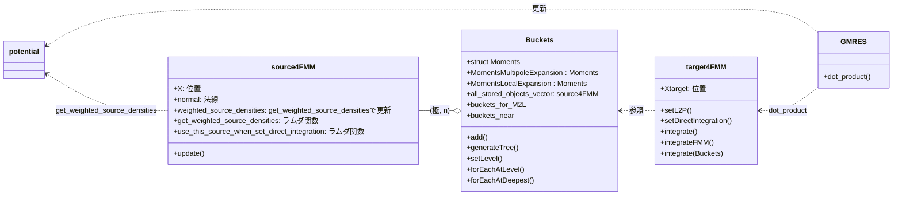

`get_weighted_source_densities`は，更新された強度を取得し，`source4FMM`の
`weighted_source_densities`に保存するためのラムダ関数である．

三角要素１つに対して，ソース１つを保存することにした．
三角要素とソースは，1対1の関係にする．これはtarget点から十分離れた要素では大きな問題にはならない．
targetがソース点を参照した際に，十分離れていない場合は，`use_this_source_when_set_direct_integration`を使って要素を細かく分割し積分する．

- `get_weighted_source_densities()`:　`source4FMM::weighted_source_densities`を更新するためのラムダ関数
- `use_this_source_when_set_direct_integration(const target4FMM* origin)`:　ラムダ関数

### 🪼 M2L（２D畳み込み） 

[:material-microsoft-visual-studio-code:Moments::set_m2l](vscode://file//Users/tomoaki/Library/CloudStorage/Dropbox/code/cpp/include/lib_spatial_partitioning.hpp:313)で，`Moments::m2l_cache`を作成する．

`set_m2l()`関数は，何度も更新される**多重極モーメント**（Multipole Moments）と，定数の**変換係数`m2lFunction()`**をキャッシュ (m2l_cache) へ保存する関数．
両方ともconstantであり（モーメントはポインタとしてはconst.），繰り返される積和の計算において更新する必要がない．

$$
{L} _{j}^{k}=\mathop{\sum}\limits _{{n}={0}}\limits^{N}{\mathop{\sum}\limits _{{m}=-{n}}\limits^{n}{\left\{{\left\{{\mathop{\sum}\limits _{{k} _{\blacksquare}}\limits^{}{{\left\{{{O} _{n}^{m}}\right\}} _{{k} _{\blacksquare}}}}\right\}\frac{{\mathcal{A}} _{j}^{k}{\mathcal{A}} _{n}^{m}{Y} _{{n}+{j}}^{{m}-{k}}\left({\mathit{\alpha}{,}\mathit{\beta}}\right)}{{\left({-{1}}\right)}^{n}{\mathcal{A}} _{{n}+{j}}^{{m}-{k}}{\mathit{\rho}}^{{n}+{j}+{1}}}}\right\}}}
\label{eq:m2l}
$$

`m2l_cache`は，次のような形で保存される．`{*Ljk, {{Ajkmn, *MMjkmn}, ...}}`のような形で保存される：

```
m2l_cache =
{*L00,{{A0000, *MM0000},{A0001, *MM0001},{A0010, *MM0010},{A0011, *MM0011}}},
{*L01,{{A0100, *MM0100},{A0101, *MM0101},{A0110, *MM0110},{A0111, *MM0111}}},
{*L10,{{A1000, *MM1000},{A1001, *MM1001},{A1010, *MM1010},{A1011, *MM1011}}},
{*L11,{{A1100, *MM1100},{A1101, *MM1101},{A1110, *MM1110},{A1111, *MM1111}}},
...}
```

### 🪼 離散フーリエ変換を使ったM2L（２D畳み込み）の高速化 

(Eq. [112](#eq:m2l))は，次のように変形できる．

$$
\begin{align}
{L} _{j}^{k}&=\mathop{\sum}\limits _{{n}={0}}\limits^{N}{\mathop{\sum}\limits _{{m}=-{n}}\limits^{n}{\left\{{\left\{{\mathop{\sum}\limits _{{k} _{\blacksquare}}\limits^{}{{\left\{{{O} _{n}^{m}}\right\}} _{{k} _{\blacksquare}}}}\right\}\frac{{\mathcal{A}} _{j}^{k}{\mathcal{A}} _{n}^{m}}{{\left({-{1}}\right)}^{n}{\mathcal{A}} _{{n}+{j}}^{{m}-{k}}}\frac{{Y} _{{n}+{j}}^{{m}-{k}}\left({\mathit{\alpha}{,}\mathit{\beta}}\right)}{{\mathit{\rho}}^{{n}+{j}+{1}}}}\right\}}}\\
&={\mathcal{A}} _{j}^{k}\mathop{\sum}\limits _{{n}={0}}\limits^{N}{\mathop{\sum}\limits _{{m}=-{n}}\limits^{n}{\left\{{\left\{{\mathop{\sum}\limits _{{k} _{\blacksquare}}\limits^{}{{\left\{{\frac{{\mathcal{A}} _{n}^{m}}{{\left({-{1}}\right)}^{n}}{O} _{n}^{m}}\right\}} _{{k} _{\blacksquare}}}}\right\}\frac{{Y} _{{n}+{j}}^{{m}-{k}}\left({\mathit{\alpha}{,}\mathit{\beta}}\right)}{{\mathcal{A}} _{{n}+{j}}^{{m}-{k}}{\mathit{\rho}}^{{n}+{j}+{1}}}}\right\}}}\\
&={\mathcal{A}} _{j}^{k}\mathop{\sum}\limits _{{n}={0}}\limits^{N}{\mathop{\sum}\limits _{{m}=-{n}}\limits^{n}{\left\{{\left\{{\mathop{\sum}\limits _{{k} _{\blacksquare}}\limits^{}{{\left\{{{\mathcal{O}} _{n}^{m}}\right\}} _{{k} _{\blacksquare}}}}\right\}{\mathcal{Y}} _{{n}+{j}}^{-\left({{m}-{k}}\right)}}\right\}}}\\
&={\mathcal{A}} _{j}^{k}{\left\{{{\mathcal{F}} _{2D}^{-{1}}\left[{\left\{{\mathop{\sum}\limits _{{k} _{\blacksquare}}\limits^{}{{\left\{{{\mathcal{F}} _{2D}\left[{{\mathcal{O}} _{n}^{m}}\right]}\right\}} _{{k} _{\blacksquare}}}}\right\}\odot{\mathcal{F}} _{2D}\left[{{\mathcal{Y}} _{q}^{p}}\right]}\right]}\right\}} _{j}^{k}
\end{align}
\label{eq:m2l _fft}
$$

where

$$
\begin{gathered}
{A} _{j}^{k}=\frac{{\left({-{1}}\right)}^{k}}{\sqrt{\left({{j}-{k}}\right){!}\left({{j}+{k}}\right){!}}},\quad{{\mathcal{A}} _{j}^{k}={i}^{-\left|{k}\right|}{A} _{j}^{k}},\quad
{{\mathcal{O}} _{n}^{m}={\left({-{1}}\right)}^{n}{\mathcal{A}} _{n}^{m}{O} _{n}^{m}},\quad{{\mathcal{Y}} _{q}^{p}=\frac{1}{{\mathcal{A}} _{q}^{p}}\frac{{Y} _{q}^{-{p}}\left({\mathit{\alpha}{,}\mathit{\beta}}\right)}{{\mathit{\rho}}^{{q}+{1}}}}
\end{gathered}
$$

注意：DFTによる畳み込み積分または相互相関の計算では，パッディングが必要．相互相関の場合は，相互相関のシフト方向にデータを反転させた上でパッディングを行う必要がある．
各バケツにおけるモーメントの計算後，パッディングや反転や累積の処理は，[:material-microsoft-visual-studio-code:Convolver2D](vscode://file//Users/tomoaki/Library/CloudStorage/Dropbox/code/cpp/include/lib_Fourier.hpp:714)クラスに任せる．

(Eq. [292](#eq:m2l_fft))から，

* ${\mathcal{F}} _{2D}\left[{{\mathcal{O}} _{n}^{m}}\right]$はバケツ毎に独立して計算できること（計算は，ツリー全体で１度だけで高速）．
* そして，あるlocalとなるバケツにおいて，対象となるバケツの${\mathcal{F}} _{2D}\left[{{\mathcal{O}} _{n}^{m}}\right]$を足し合わせること．$O(k _{buckets}N^2)$で軽量．
* 各バケツにおいて，${\mathcal{F}} _{2D}\left[{{\mathcal{O}} _{n}^{m}}\right]$と${\mathcal{F}} _{2D}\left[{{\mathcal{Y}} _{q}^{p}}\right]$を準備しておく．

非常に高速に計算できることがわかる．

### 🪼 準備`set_m2l(const std::vector<TYPE> &buckets)` 

* $\mathcal{A} _{j}^{k}$は，`include/i_absk_A_FMM.hpp`に定義されている．
* $\mathcal{O} _n^m$は，ME,M2M,M2M...と段階的に計算してきたモーメントに係数を掛けたものであり，
* $\phi$,$\phi _n$の係数それぞれに対して存在する複素行列．
* $\mathcal{Y} _q^p$は，$\phi$と$\phi _n$のそれぞれに対して共通の係数行列であり，バケツ毎に計算される．

[Onm0_Onm1_Yqp](not found)で`Yqp`, `Onm0`, `Onm1`を計算し保存する．

次に，`Fourier2D<std::complex<double>>`へ`Onm0`, `Onm1`, `Yqp`を変換し保存する．[:material-microsoft-visual-studio-code:DFT2D_Onm0_Onm1_Yqp](vscode://file//Users/tomoaki/Library/CloudStorage/Dropbox/code/cpp/include/lib_spatial_partitioning.hpp:381)

DFT/FFTを使った畳み込みは，[:material-microsoft-visual-studio-code:Fourier2D](vscode://file//Users/tomoaki/Library/CloudStorage/Dropbox/code/cpp/include/lib_Fourier.hpp:436)クラスに任せる．

```cpp
Convolver2D<std::complex<double>> convolver2D;
convolver2D.reset(img_shift.size(), img_shift[0].size(), img_kernel.size(), img_kernel[0].size());
convolver2D.addKernel(img_kernel);
convolver2D.addShift(img_shift, {true, false});
convolver2D.convolve();
```

FMMへの応用を考えた，[:material-microsoft-visual-studio-code:Fourier2D](vscode://file//Users/tomoaki/Library/CloudStorage/Dropbox/code/cpp/include/lib_Fourier.hpp:436)クラスの設計のポイント：

重要な処理は，パッディングと反転と累積の処理．
Convolver2Dの外部でFFT済みの行列が作成されていることを前提とすべき．
FFTの前に決定しておくしかない処理は，パッディングと反転の処理

* Convolver2DKernelクラス
* Convolver2DShiftクラス:係数行列を読み込み，パッディングや反転処理を行う，Convolver2DShift同士は足し合わせることができる

を作成し，それらを使ってconvolveを計算するようにする．Convolver2DShiftは係数行列を読み込み，パッディングや反転処理を行う．また，
Convolver2DShift同士は足し合わせることができるようにする．

### 🪼 実行`m2l()`

[:material-microsoft-visual-studio-code:test_translation_of_a_multipole_expansion_with_tree_20240818.cpp#L266](vscode://file//Users/tomoaki/Library/CloudStorage/Dropbox/code/cpp/builds/build_spherical_harmonic/test_translation_of_a_multipole_expansion_with_tree_20240818.cpp:266)

---
# 🐋 🐋 多重極展開  

この実装は，Greengard and Rokhlin (1997)に基づいている．

## ⛵ ⛵ Green関数の多重極展開  

次のGreen関数を考える．

$$
G({\bf x},{\bf a}) = \frac{1}{\|{\bf x}-{\bf a}\|},
\quad \nabla G({\bf x},{\bf a}) = -\frac{{\bf x}-{\bf a}}{\|{\bf x}-{\bf a}\|^3}
$$

グリーン関数は，球面調和関数を使って近似できる．
近似を$G _{\rm apx}({\bf x},{\bf a},{\bf c})$とする．

$$
G _{\rm apx}(n, {\bf x},{\bf a},{\bf c}) = \sum _{k=0}^n \sum _{m=-k}^k \left( \frac{r _{\rm near}}{r _{\rm far}} \right)^k \frac{1}{r _{\rm far}} Y(k, -m, a _{\rm near}, b _{\rm near}) Y(k, m, a _{\rm far}, b _{\rm far})=
{\bf Y}^\ast({\bf x},{\bf c})\cdot{\bf Y}({\bf a},{\bf c})
$$

$$
{\bf Y}^\ast({\bf x},{\bf c}) = r _{\rm near}^k Y(k, -m, a _{\rm near},b _{\rm near}), \quad {\bf Y}({\bf a},{\bf c}) = r _{\rm far}^{-k-1} Y(k, m, a _{\rm far}, b _{\rm far})
$$

ここで，$(r _{\rm near},a _{\rm near},b _{\rm near})$は，球面座標系に${\bf x}-{\bf c}$を変換したものであり，
$(r _{\rm far},a _{\rm far},b _{\rm far})$は，球面座標系に${\bf a}-{\bf c}$を変換したもの．$Y(k, m, a, b)$は球面調和関数：

$$
Y(k, m, a, b) = \sqrt{\frac{(k - |m|)!}{(k + |m|)!}} P _k^{|m|}(\cos(a)) e^{i mb}
$$

$P _k^m(x)$はルジャンドル陪関数：

$$
P _k^m(x) = \frac{(-1)^m}{2^k k!} (1-x^2)^{m/2} \frac{d^{k+m}}{dx^{k+m}}(x^2-1)^k
$$

### 🪼 🪼 球面座標系への変換  

${\bf x}=(x,y,z)$から球面座標$(r,a,b)$への変換は次のように行う．

$$
r = \|{\bf x}\|, \quad a = \arctan \frac{\sqrt{x^2 + y^2}}{z}, \quad b = \arctan \frac{y}{x}
$$

$r _\parallel=\sqrt{x^2+y^2}$とする．$\frac{\partial}{\partial t}(\arctan(f(t))) = \frac{f'(t)}{1 + f(t)^2}$なので，
$(r,a,b)$の$(x,y,z)$に関する勾配は次のようになる．

$$
\nabla r = \frac{\bf x}{r},\quad
\nabla a = \frac{1}{r^2r _\parallel} \left(xz,yz,-r _\parallel^2\right),\quad
\nabla b = \frac{1}{r _\parallel^2} \left(-y,x,0\right)
$$
[:material-microsoft-visual-studio-code:../../include/lib_multipole_expansion.hpp#L22](vscode://file//Users/tomoaki/Library/CloudStorage/Dropbox/code/cpp/include/lib_multipole_expansion.hpp:22)
## ⛵ ⛵ C++上での，Greengardの球面調和関数  

`sph_harmonics_`

Greengardｎ(1997)の(3.15)と同じように，球面調和関数を定義する．
c++の`std::sph_legendre`を使って(3.15)を使う場合，係数を調整と，mの絶対値を考慮する必要がある．

c++での球面調和関数の定義は次のようになる[球面調和関数](https://cpprefjp.github.io/reference/cmath/sph_legendre.html)．
ただし，$\phi=0$の結果が返ってくるので，$e^{im\phi}$をかける必要がある．

$$
\begin{align*}
{\mathrm{std::sph\ _legendre(n,m,\theta)}} &= (-1)^m \sqrt{\frac{(2n+1)(n-m)!}{4\pi(n+m)!}} {\rm{std::assoc _legendre}(n,m,cos(\theta))}\\
& = (-1)^m \sqrt{\frac{(2n+1)(n-m)!}{4\pi(n+m)!}} (1-x^2)^{m/2} \frac{d^m}{dx^m} P _n(x), \quad x = \cos(\theta)
\end{align*}
$$

Greengardｎ(1997)の(3.15)：

$$
\begin{align*}
Y(n, m, \theta, \phi) &= \sqrt{\frac{(n-|m|)!}{(n+|m|)!}} P _n^{|m|}(\cos(\theta)) e^{im \phi}\\
& = (-1)^{|m|}\sqrt{\frac{(n-|m|)!}{(n+|m|)!}} (1-x^2)^{|m|/2} \frac{d^{|m|}}{dx^{|m|}} P _n(x) e^{im \phi}, \quad x = \cos(\theta)
\end{align*}
$$

従って，$Y(n, m, \theta, \phi)$はc++の`std::sph_legendre`を使って

$$
Y(n, m, \theta, \phi) = \sqrt{\frac{4\pi}{2n+1}}{\mathrm{std::sph\ _legendre(n,|m|,\theta)}} e^{im\phi}
$$

と計算できる．
[:material-microsoft-visual-studio-code:../../include/lib_multipole_expansion.hpp#L188](vscode://file//Users/tomoaki/Library/CloudStorage/Dropbox/code/cpp/include/lib_multipole_expansion.hpp:188)


## ⛵ 精度の確認 

```shell
sh clean
cmake -DCMAKE_BUILD_TYPE=Release ../ -DSOURCE_FILE=test_multipole_expansion.cpp
make
./test_multipole_expansion
```

### 🪼 $G _{\rm apx}$の精度 

${\bf c}=(x,y,0)$を変化させてプロットした結果：

|      | **n=4** | **n=5** | **n=6** | **n=7** | **n=8** |
|:----:|:---:|:---:|:---:|:---:|:---:|
| **x = (0,0,0), a = (5,5,5)**    | 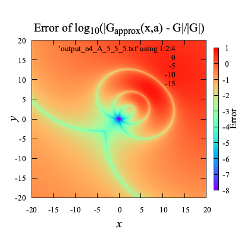       | 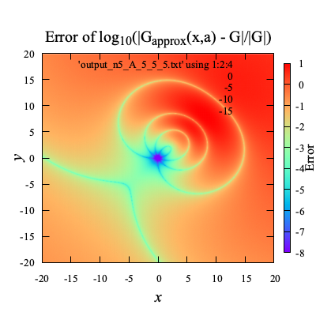        | 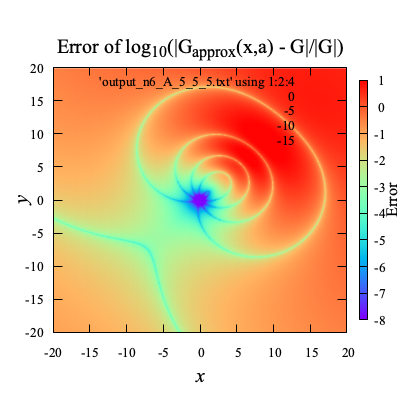        | 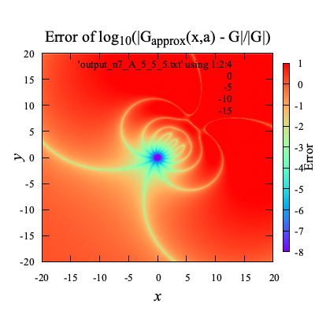       | 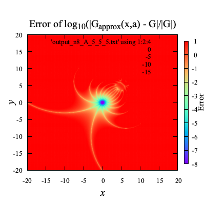       |
| **x = (0,0,0), a = (10,10,10)** | 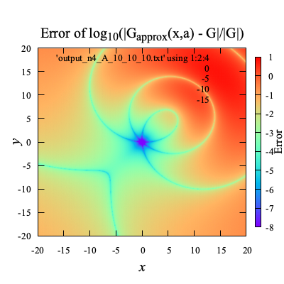 | 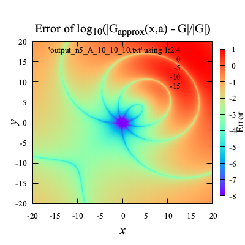  | 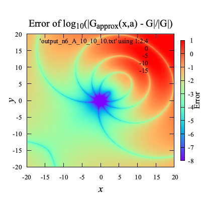  | 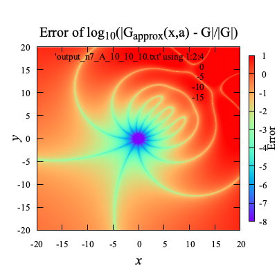 | 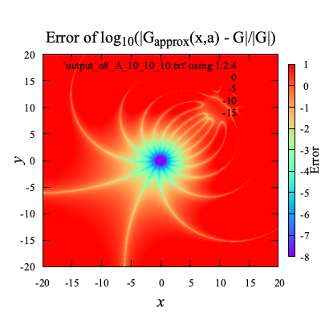 |

この結果からわかるように，Green関数の実際の値は，${\bf c}$によって変わらないが，$G _{\rm apx}$の値は${\bf c}$によって変化し，
${\bf c}$が${\bf x}$に近いところでは，$G _{\rm apx}$の値は$G$の値に近づく．

$a _{near},b _{near}$は，より小さければ精度が良く，
また，$a _{far},b _{far}$は，より大きければ精度が良くなる．

### 🪼 $G _{\rm apx}$の勾配$\nabla G _{\rm apx}$の精度 

$\nabla G _{\rm apx}$は，$\nabla _{\rm \circ}=(\frac{\partial}{\partial r},\frac{\partial}{\partial a},\frac{\partial}{\partial b})$とすると，

$$
\nabla G _{\rm apx} =
\nabla _{\rm \circ} G _{\rm apx}
\begin{bmatrix} \nabla r \\ \nabla a \\ \nabla b \end{bmatrix}
$$

具体的には`gradGapx`のように

$$
\begin{align*}
\nabla _{\circ} G _{\rm apx}(n, {\bf x},{\bf a},{\bf c})
& = \sum _{k=0}^{n} \sum _{m=-k}^{k}\nabla _{\circ}\left(r^k Y(k, -m, a, b)\right) _{(r,a,b)=(r _{near},a _{near},b _{near})}
\frac{1}{r _{far}^{k+1}} Y(k, m, a _{far}, b _{far})\\
\nabla _{\circ}\left(r^k Y(k, -m, a, b)\right)
&= \left(k r^{k-1} Y, r^k \frac{\partial Y}{\partial a}, r^k \frac{\partial Y}{\partial b},
\right)\\
\frac{\partial Y}{\partial a} &= \sqrt{\frac{(k - |m|)!}{(k + |m|)!}} \frac{d P _k^{|m|}}{d x}(x) _{x=\cos(a) } e^{i mb}\\
\frac{\partial Y}{\partial b} &= \sqrt{\frac{(k - |m|)!}{(k + |m|)!}} P _k^{|m|}(\cos(a)) i m e^{i mb}\\
\frac{d P _k^{m}}{d x}(x) &= \frac{(-1)^m}{\sqrt{1-x^2}} \left( \frac{m x}{\sqrt{1-x^2}} P _k^{m}(x) + P _k^{m+1}(x) \right)
\end{align*}
$$


勾配の座標変換は，$Y(k,m,a _{far},b _{far})$には影響しない．

$$
\begin{align*}
\nabla G _{\rm apx}
&= \nabla _{\circ} G _{\rm apx} \begin{bmatrix} \nabla r \\ \nabla a \\ \nabla b \end{bmatrix}\\
& = \sum _{k=0}^{n} \sum _{m=-k}^{k}\nabla _{\circ}\left(r^k Y(k, -m, a, b)\right) _{(r,a,b)=(r _{near},a _{near},b _{near})}
\begin{bmatrix} \nabla r \\ \nabla a \\ \nabla b \end{bmatrix}
\frac{1}{r _{far}^{k+1}} Y(k, m, a _{far}, b _{far})
\end{align*}
$$

${\bf c}=(x,y,0)$を変化させてプロットした結果：

| | **n=4** | **n=5** | **n=6** | **n=7** | **n=8** |
|:----:|:---:|:---:|:---:|:---:|:---:|
| **x = (0,0,0), a = (5,5,5)** | 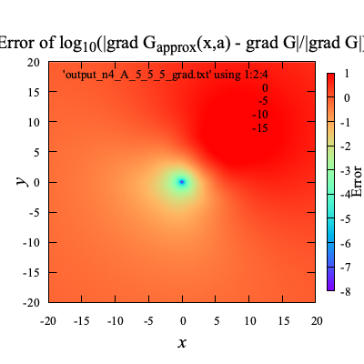 |  | 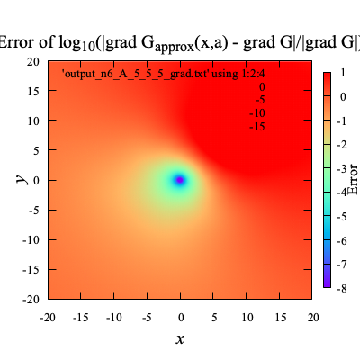 | 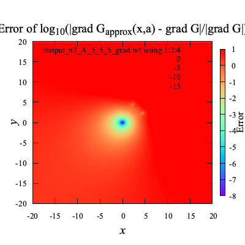 | 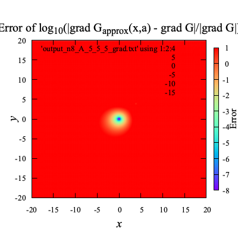 |
| **x = (0,0,0), a = (10,10,10)** | 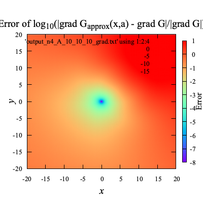 | 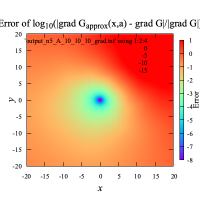 | 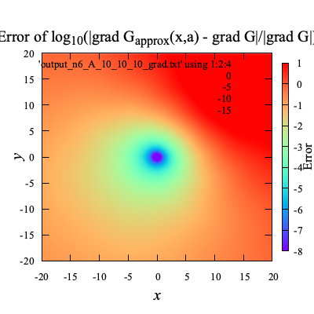 | 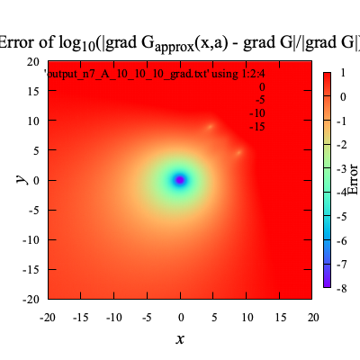 | 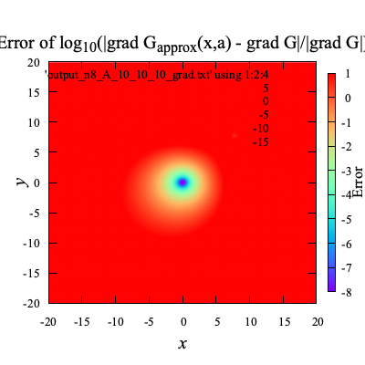 |

[:material-microsoft-visual-studio-code:test_multipole_expansion.cpp#L4](vscode://file//Users/tomoaki/Library/CloudStorage/Dropbox/code/cpp/builds/build_spherical_harmonic/test_multipole_expansion.cpp:4)

---
# 🐋 🐋 多重極展開  

この実装は，Greengard and Rokhlin (1997)に基づいている．

## ⛵ ⛵ Green関数の多重極展開  

次のGreen関数を考える．

$$
G({\bf x},{\bf a}) = \frac{1}{\|{\bf x}-{\bf a}\|},
\quad \nabla G({\bf x},{\bf a}) = -\frac{{\bf x}-{\bf a}}{\|{\bf x}-{\bf a}\|^3}
$$

グリーン関数は，球面調和関数を使って近似できる．
近似を$G _{\rm apx}({\bf x},{\bf a},{\bf c})$とする．

$$
G _{\rm apx}(n, {\bf x},{\bf a},{\bf c}) = \sum _{k=0}^n \sum _{m=-k}^k \left( \frac{r _{\rm near}}{r _{\rm far}} \right)^k \frac{1}{r _{\rm far}} Y(k, -m, a _{\rm near}, b _{\rm near}) Y(k, m, a _{\rm far}, b _{\rm far})=
{\bf Y}^\ast({\bf x},{\bf c})\cdot{\bf Y}({\bf a},{\bf c})
$$

$$
{\bf Y}^\ast({\bf x},{\bf c}) = r _{\rm near}^k Y(k, -m, a _{\rm near},b _{\rm near}), \quad {\bf Y}({\bf a},{\bf c}) = r _{\rm far}^{-k-1} Y(k, m, a _{\rm far}, b _{\rm far})
$$

ここで，$(r _{\rm near},a _{\rm near},b _{\rm near})$は，球面座標系に${\bf x}-{\bf c}$を変換したものであり，
$(r _{\rm far},a _{\rm far},b _{\rm far})$は，球面座標系に${\bf a}-{\bf c}$を変換したもの．$Y(k, m, a, b)$は球面調和関数：

$$
Y(k, m, a, b) = \sqrt{\frac{(k - |m|)!}{(k + |m|)!}} P _k^{|m|}(\cos(a)) e^{i mb}
$$

$P _k^m(x)$はルジャンドル陪関数：

$$
P _k^m(x) = \frac{(-1)^m}{2^k k!} (1-x^2)^{m/2} \frac{d^{k+m}}{dx^{k+m}}(x^2-1)^k
$$

### 🪼 🪼 球面座標系への変換  

${\bf x}=(x,y,z)$から球面座標$(r,a,b)$への変換は次のように行う．

$$
r = \|{\bf x}\|, \quad a = \arctan \frac{\sqrt{x^2 + y^2}}{z}, \quad b = \arctan \frac{y}{x}
$$

$r _\parallel=\sqrt{x^2+y^2}$とする．$\frac{\partial}{\partial t}(\arctan(f(t))) = \frac{f'(t)}{1 + f(t)^2}$なので，
$(r,a,b)$の$(x,y,z)$に関する勾配は次のようになる．

$$
\nabla r = \frac{\bf x}{r},\quad
\nabla a = \frac{1}{r^2r _\parallel} \left(xz,yz,-r _\parallel^2\right),\quad
\nabla b = \frac{1}{r _\parallel^2} \left(-y,x,0\right)
$$
[:material-microsoft-visual-studio-code:../../include/lib_multipole_expansion.hpp#L22](vscode://file//Users/tomoaki/Library/CloudStorage/Dropbox/code/cpp/include/lib_multipole_expansion.hpp:22)
## ⛵ ⛵ C++上での，Greengardの球面調和関数  

`sph_harmonics_`

Greengardｎ(1997)の(3.15)と同じように，球面調和関数を定義する．
c++の`std::sph_legendre`を使って(3.15)を使う場合，係数を調整と，mの絶対値を考慮する必要がある．

c++での球面調和関数の定義は次のようになる[球面調和関数](https://cpprefjp.github.io/reference/cmath/sph_legendre.html)．
ただし，$\phi=0$の結果が返ってくるので，$e^{im\phi}$をかける必要がある．

$$
\begin{align*}
{\mathrm{std::sph\ _legendre(n,m,\theta)}} &= (-1)^m \sqrt{\frac{(2n+1)(n-m)!}{4\pi(n+m)!}} {\rm{std::assoc _legendre}(n,m,cos(\theta))}\\
& = (-1)^m \sqrt{\frac{(2n+1)(n-m)!}{4\pi(n+m)!}} (1-x^2)^{m/2} \frac{d^m}{dx^m} P _n(x), \quad x = \cos(\theta)
\end{align*}
$$

Greengardｎ(1997)の(3.15)：

$$
\begin{align*}
Y(n, m, \theta, \phi) &= \sqrt{\frac{(n-|m|)!}{(n+|m|)!}} P _n^{|m|}(\cos(\theta)) e^{im \phi}\\
& = (-1)^{|m|}\sqrt{\frac{(n-|m|)!}{(n+|m|)!}} (1-x^2)^{|m|/2} \frac{d^{|m|}}{dx^{|m|}} P _n(x) e^{im \phi}, \quad x = \cos(\theta)
\end{align*}
$$

従って，$Y(n, m, \theta, \phi)$はc++の`std::sph_legendre`を使って

$$
Y(n, m, \theta, \phi) = \sqrt{\frac{4\pi}{2n+1}}{\mathrm{std::sph\ _legendre(n,|m|,\theta)}} e^{im\phi}
$$

と計算できる．
[:material-microsoft-visual-studio-code:../../include/lib_multipole_expansion.hpp#L188](vscode://file//Users/tomoaki/Library/CloudStorage/Dropbox/code/cpp/include/lib_multipole_expansion.hpp:188)


## ⛵ ツリー構造を使った多重極展開の移動 

```shell
sh clean
cmake -DCMAKE_BUILD_TYPE=Release ../ -DSOURCE_FILE=test_translation_of_a_multipole_expansion_with_tree_20241017_withGMRES.cpp
make
./test_translation_of_a_multipole_expansion_with_tree_20241017_withGMRES
paraview check_M2L.pvsm
```

[:material-microsoft-visual-studio-code:test_translation_of_a_multipole_expansion_with_tree_20241017_withGMRES.cpp#L14](vscode://file//Users/tomoaki/Library/CloudStorage/Dropbox/code/cpp/builds/build_spherical_harmonic/test_translation_of_a_multipole_expansion_with_tree_20241017_withGMRES.cpp:14)

# 🐋 🐋 多重極展開  

この実装は，Greengard and Rokhlin (1997)に基づいている．

## ⛵ ⛵ Green関数の多重極展開  

次のGreen関数を考える．

$$
G({\bf x},{\bf a}) = \frac{1}{\|{\bf x}-{\bf a}\|},
\quad \nabla G({\bf x},{\bf a}) = -\frac{{\bf x}-{\bf a}}{\|{\bf x}-{\bf a}\|^3}
$$

グリーン関数は，球面調和関数を使って近似できる．
近似を$G _{\rm apx}({\bf x},{\bf a},{\bf c})$とする．

$$
G _{\rm apx}(n, {\bf x},{\bf a},{\bf c}) = \sum _{k=0}^n \sum _{m=-k}^k \left( \frac{r _{\rm near}}{r _{\rm far}} \right)^k \frac{1}{r _{\rm far}} Y(k, -m, a _{\rm near}, b _{\rm near}) Y(k, m, a _{\rm far}, b _{\rm far})=
{\bf Y}^\ast({\bf x},{\bf c})\cdot{\bf Y}({\bf a},{\bf c})
$$

$$
{\bf Y}^\ast({\bf x},{\bf c}) = r _{\rm near}^k Y(k, -m, a _{\rm near},b _{\rm near}), \quad {\bf Y}({\bf a},{\bf c}) = r _{\rm far}^{-k-1} Y(k, m, a _{\rm far}, b _{\rm far})
$$

ここで，$(r _{\rm near},a _{\rm near},b _{\rm near})$は，球面座標系に${\bf x}-{\bf c}$を変換したものであり，
$(r _{\rm far},a _{\rm far},b _{\rm far})$は，球面座標系に${\bf a}-{\bf c}$を変換したもの．$Y(k, m, a, b)$は球面調和関数：

$$
Y(k, m, a, b) = \sqrt{\frac{(k - |m|)!}{(k + |m|)!}} P _k^{|m|}(\cos(a)) e^{i mb}
$$

$P _k^m(x)$はルジャンドル陪関数：

$$
P _k^m(x) = \frac{(-1)^m}{2^k k!} (1-x^2)^{m/2} \frac{d^{k+m}}{dx^{k+m}}(x^2-1)^k
$$

### 🪼 🪼 球面座標系への変換  

${\bf x}=(x,y,z)$から球面座標$(r,a,b)$への変換は次のように行う．

$$
r = \|{\bf x}\|, \quad a = \arctan \frac{\sqrt{x^2 + y^2}}{z}, \quad b = \arctan \frac{y}{x}
$$

$r _\parallel=\sqrt{x^2+y^2}$とする．$\frac{\partial}{\partial t}(\arctan(f(t))) = \frac{f'(t)}{1 + f(t)^2}$なので，
$(r,a,b)$の$(x,y,z)$に関する勾配は次のようになる．

$$
\nabla r = \frac{\bf x}{r},\quad
\nabla a = \frac{1}{r^2r _\parallel} \left(xz,yz,-r _\parallel^2\right),\quad
\nabla b = \frac{1}{r _\parallel^2} \left(-y,x,0\right)
$$
[:material-microsoft-visual-studio-code:../../include/lib_multipole_expansion.hpp#L22](vscode://file//Users/tomoaki/Library/CloudStorage/Dropbox/code/cpp/include/lib_multipole_expansion.hpp:22)
## ⛵ ⛵ C++上での，Greengardの球面調和関数  

`sph_harmonics_`

Greengardｎ(1997)の(3.15)と同じように，球面調和関数を定義する．
c++の`std::sph_legendre`を使って(3.15)を使う場合，係数を調整と，mの絶対値を考慮する必要がある．

c++での球面調和関数の定義は次のようになる[球面調和関数](https://cpprefjp.github.io/reference/cmath/sph_legendre.html)．
ただし，$\phi=0$の結果が返ってくるので，$e^{im\phi}$をかける必要がある．

$$
\begin{align*}
{\mathrm{std::sph\ _legendre(n,m,\theta)}} &= (-1)^m \sqrt{\frac{(2n+1)(n-m)!}{4\pi(n+m)!}} {\rm{std::assoc _legendre}(n,m,cos(\theta))}\\
& = (-1)^m \sqrt{\frac{(2n+1)(n-m)!}{4\pi(n+m)!}} (1-x^2)^{m/2} \frac{d^m}{dx^m} P _n(x), \quad x = \cos(\theta)
\end{align*}
$$

Greengardｎ(1997)の(3.15)：

$$
\begin{align*}
Y(n, m, \theta, \phi) &= \sqrt{\frac{(n-|m|)!}{(n+|m|)!}} P _n^{|m|}(\cos(\theta)) e^{im \phi}\\
& = (-1)^{|m|}\sqrt{\frac{(n-|m|)!}{(n+|m|)!}} (1-x^2)^{|m|/2} \frac{d^{|m|}}{dx^{|m|}} P _n(x) e^{im \phi}, \quad x = \cos(\theta)
\end{align*}
$$

従って，$Y(n, m, \theta, \phi)$はc++の`std::sph_legendre`を使って

$$
Y(n, m, \theta, \phi) = \sqrt{\frac{4\pi}{2n+1}}{\mathrm{std::sph\ _legendre(n,|m|,\theta)}} e^{im\phi}
$$

と計算できる．
[:material-microsoft-visual-studio-code:../../include/lib_multipole_expansion.hpp#L188](vscode://file//Users/tomoaki/Library/CloudStorage/Dropbox/code/cpp/include/lib_multipole_expansion.hpp:188)


## ⛵ ツリー構造を使った多重極展開の移動 

```shell
sh clean
cmake -DCMAKE_BUILD_TYPE=Release ../ -DSOURCE_FILE=test_translation_of_a_multipole_expansion_with_tree_20240818.cpp
make
./test_translation_of_a_multipole_expansion_with_tree_20240818
paraview check_M2L.pvsm
```

[:material-microsoft-visual-studio-code:test_translation_of_a_multipole_expansion_with_tree_20241126_solve.cpp#L9](vscode://file//Users/tomoaki/Library/CloudStorage/Dropbox/code/cpp/builds/build_spherical_harmonic/test_translation_of_a_multipole_expansion_with_tree_20241126_solve.cpp:9)

---
## ⛵ ベッセル関数

[:material-microsoft-visual-studio-code:test_Bessel_function.cpp#L5](vscode://file//Users/tomoaki/Library/CloudStorage/Dropbox/code/cpp/builds/build_spherical_harmonic/test_Bessel_function.cpp:5)

---
## ⛵ 境界要素法への応用 

境界要素法で最も計算時間を要するのは，連立１次方程式の**係数行列の作成**と**それを解く**ことである．

反復法を使えば，方程式を早く解けそうだが，実際そこまで速く解けない．
その理由は，BEMの係数行列が密行列であるために，反復法で最も時間を要する行列-ベクトル積の時間が短縮できないためである．
ナイーブなBEMでは，反復解法の利点を十分に活かせない．

しかし，
多重極展開を使えば，
**BEMの係数行列をあたかも疎行列のように，行列-ベクトル積が実行でき，
反復解法を高速に実行できる．**

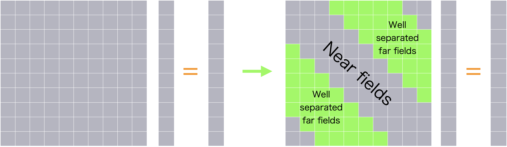

### 🪼 境界積分方程式 

ラプラス方程式とグリーンの定理を合わせて，境界積分方程式が得られる．
これのグリーン関数$G$を多重極展開によって$G _{\rm apx}$で置き換えると，

$$
\alpha ({\bf{a}})\phi ({\bf{a}}) = \iint _\Gamma {\left( {G _{\rm apx}({\bf{x}},{\bf a},{\bf c})\phi _n ({\bf{x}}) - \phi ({\bf{x}})\nabla G _{\rm apx}({\bf{x}},{\bf a},{\bf c})\cdot {\bf{n}}(\bf x)} \right)dS}
\quad\text{on}\quad{\bf x} \in \Gamma(t)
$$

となり，原点${\bf a}$と積分変数${\bf x}$が分離できる．

$$
\alpha ({\bf{a}})\phi ({\bf{a}})={\bf Y}({\bf a},{\bf c})\cdot\iint _\Gamma {\left( {{{\bf Y}^\ast}({\bf x},{\bf c})\phi _n ({\bf{x}}) - \phi ({\bf{x}}){{\bf Y} _n^\ast}({\bf x},{\bf c})} \right) dS}\quad\text{on}\quad{\bf x} \in \Gamma(t).
$$

ここで，${\bf Y}({\bf a},{\bf c})$は，
${\bf Y}=\{\frac{1}{r _{far}^{-k+1}}Y(0,-k,a,b),\frac{1}{r _{far}^{-k+1+1}}Y(0,-k+1,a,b),\frac{1}{r _{far}^{-k+2+1}}Y(0,-k+2,a,b),...,\frac{1}{r _{far}^{k+1}}Y(n,k,a,b)\}$
のようなベクトル．

$$
{\bf n}({\bf x})\cdot\nabla G _{\rm apx}({\bf x},{\bf a},{\bf c})=\sum _{k=0}^n \sum _{m=-k}^k
{\bf n}({\bf x}) \cdot \left( \nabla _{\circ}(r^k Y(k, -m, a, b)) _{(r,a,b)=(r _{near},a _{near},b _{near})}
\begin{bmatrix} \nabla r \\ \nabla a \\ \nabla b \end{bmatrix} \right)
\frac{1}{r _{far}^{k+1}} Y(k,m,a _{far}, b _{far})={\bf Y} _n^\ast({\bf x},{\bf c})\cdot{\bf Y}({\bf a},{\bf c})
$$

ただ，十分な精度でグリーン関数を近似するためには，
$\|{\bf x - \bf c}\|$が$\|{\bf a - \bf c}\|$よりも十分に小さい必要がある．

### 🪼 空間分割 

$\bf c$を一つに固定するのではなく，空間を分割して，それぞれのセルの中心において${\bf c}$を固定する．
各セルのインデックスを$\square i$として，その中心座標を${\bf c} _{\square i}$のように表す．
そうすると，

$$
\alpha ({\bf a})\phi ({\bf a})=\sum _{\square i} {\bf Y}({\bf a},{\bf c} _{\square i})\cdot\iint _{\Gamma _{\square i}}{( {{{\bf Y}^\ast}({\bf x},{\bf c} _{\square i})\phi _n ({\bf x}) - \phi ({\bf x}){{\bf Y} _n^\ast}({\bf x},{\bf c} _{\square i})} ) dS}
$$

さらに，原点の近傍セルの積分は，多重極展開を使わずに，元々のグリーン関数を使って計算することにすると，

$$
\begin{align*}
\alpha ({\bf{a}})\phi ({\bf{a}})=& \iint _{\Gamma _{\rm near-fields}}( {G({\bf x},{\bf a})\phi _n ({\bf x}) - \phi (\bf x) G _n({\bf x},{\bf a})})dS\\
& + \sum _{\square i}\{{\bf Y}({\bf a},{\bf c} _{\square i})\cdot\iint _{\Gamma _{\square i}}{({{{\bf Y}^\ast}({\bf x},{\bf c} _{\square i})\phi _n ({\bf{x}}) - \phi ({\bf{x}}){{\bf Y} _n^\ast}({\bf x},{\bf c} _{\square i})})dS}\}
\end{align*}
$$

### 🪼 局所展開 

Graf's Addition Theoremを使って，${\bf Y}^\ast({\bf x},{\bf c} _{\square i})$を${\bf Y}^\ast({\bf x},{\bf c})$の線形結合で表す．

$$
{\bf Y}^\ast({\bf x},{\bf c} _{\square i}) = \sum _{\square j} {\bf Y}^\ast({\bf x},{\bf c} _{\square j}){\bf Y}({\bf c} _{\square j},{\bf c} _{\square i})
$$

[:material-microsoft-visual-studio-code:test_multipole_expansion.cpp#L237](vscode://file//Users/tomoaki/Library/CloudStorage/Dropbox/code/cpp/builds/build_spherical_harmonic/test_multipole_expansion.cpp:237)

---
