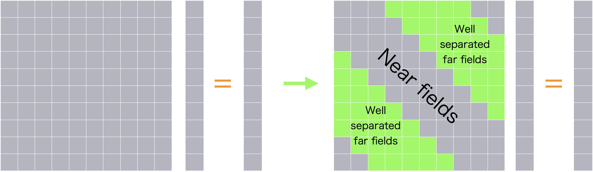

# Contents
- [🐋 🐋 多重極展開](#--多重極展開)
    - [⛵ ⛵ Green関数の多重極展開](#--green関数の多重極展開)
        - [🪼 🪼 球面座標系への変換](#--球面座標系への変換)
    - [⛵ ⛵ C++上での，Greengardの球面調和関数](#--c上でのgreengardの球面調和関数)
    - [⛵ 精度の確認](#-精度の確認)
        - [🪼 $`G _{\rm apx}`$の精度](#-g-_rm-apxの精度)
        - [🪼 $`G _{\rm apx}`$の勾配$`\nabla G _{\rm apx}`$の精度](#-g-_rm-apxの勾配nabla-g-_rm-apxの精度)
- [🐋 🐋 多重極展開](#--多重極展開)
    - [⛵ ⛵ Green関数の多重極展開](#--green関数の多重極展開)
        - [🪼 🪼 球面座標系への変換](#--球面座標系への変換)
    - [⛵ ⛵ C++上での，Greengardの球面調和関数](#--c上でのgreengardの球面調和関数)
    - [⛵ ツリー構造を使った多重極展開の移動](#-ツリー構造を使った多重極展開の移動)
- [🐋 Fast Multipole Method](#-fast-multipole-method)
    - [⛵ pole class](#-pole-class)
    - [⛵ Buckets class](#-buckets-class)
- [🐋 Fast Multipole Method](#-fast-multipole-method)
    - [⛵ 要素法特有の話](#-要素法特有の話)
- [🐋 🐋 多重極展開](#--多重極展開)
    - [⛵ ⛵ Green関数の多重極展開](#--green関数の多重極展開)
        - [🪼 🪼 球面座標系への変換](#--球面座標系への変換)
    - [⛵ ⛵ C++上での，Greengardの球面調和関数](#--c上でのgreengardの球面調和関数)
    - [⛵ ツリー構造を使った多重極展開の移動](#-ツリー構造を使った多重極展開の移動)
- [🐋 🐋 多重極展開](#--多重極展開)
    - [⛵ ⛵ Green関数の多重極展開](#--green関数の多重極展開)
        - [🪼 🪼 球面座標系への変換](#--球面座標系への変換)
    - [⛵ ⛵ C++上での，Greengardの球面調和関数](#--c上でのgreengardの球面調和関数)
    - [⛵ ツリー構造を使った多重極展開の移動](#-ツリー構造を使った多重極展開の移動)
    - [⛵ ベッセル関数](#-ベッセル関数)
    - [⛵ 境界要素法への応用](#-境界要素法への応用)
        - [🪼 境界積分方程式](#-境界積分方程式)
        - [🪼 空間分割](#-空間分割)
        - [🪼 局所展開](#-局所展開)


---
# 🐋 🐋 多重極展開  

この実装は，\cite{Greengard1997a}に基づいている．

## ⛵ ⛵ Green関数の多重極展開  

次のGreen関数を考える．

```math
G({\bf x},{\bf a}) = \frac{1}{\|{\bf x}-{\bf a}\|},
\quad \nabla G({\bf x},{\bf a}) = -\frac{{\bf x}-{\bf a}}{\|{\bf x}-{\bf a}\|^3}
```

グリーン関数は，球面調和関数を使って近似できる．
近似を$`G _{\rm apx}({\bf x},{\bf a},{\bf c})`$とする．

```math
G _{\rm apx}(n, {\bf x},{\bf a},{\bf c}) = \sum _{k=0}^n \sum _{m=-k}^k \left( \frac{r _{\rm near}}{r _{\rm far}} \right)^k \frac{1}{r _{\rm far}} Y(k, -m, a _{\rm near}, b _{\rm near}) Y(k, m, a _{\rm far}, b _{\rm far})=
{\bf Y}^\ast({\bf x},{\bf c})\cdot{\bf Y}({\bf a},{\bf c})
```

```math
{\bf Y}^\ast({\bf x},{\bf c}) = r _{\rm near}^k Y(k, -m, a _{\rm near},b _{\rm near}), \quad {\bf Y}({\bf a},{\bf c}) = r _{\rm far}^{-k-1} Y(k, m, a _{\rm far}, b _{\rm far})
```

ここで，$`(r _{\rm near},a _{\rm near},b _{\rm near})`$は，球面座標系に$`{\bf x}-{\bf c}`$を変換したものであり，
$`(r _{\rm far},a _{\rm far},b _{\rm far})`$は，球面座標系に$`{\bf a}-{\bf c}`$を変換したもの．$`Y(k, m, a, b)`$は球面調和関数：

```math
Y(k, m, a, b) = \sqrt{\frac{(k - |m|)!}{(k + |m|)!}} P _k^{|m|}(\cos(a)) e^{i mb}
```

$`P _k^m(x)`$はルジャンドル陪関数：

```math
P _k^m(x) = \frac{(-1)^m}{2^k k!} (1-x^2)^{m/2} \frac{d^{k+m}}{dx^{k+m}}(x^2-1)^k
```

### 🪼 🪼 球面座標系への変換  

$`{\bf x}=(x,y,z)`$から球面座標$`(r,a,b)`$への変換は次のように行う．

```math
r = \|{\bf x}\|, \quad a = \arctan \frac{\sqrt{x^2 + y^2}}{z}, \quad b = \arctan \frac{y}{x}
```

$`r _\parallel=\sqrt{x^2+y^2}`$とする．$`\frac{\partial}{\partial t}(\arctan(f(t))) = \frac{f'(t)}{1 + f(t)^2}`$なので，
$`(r,a,b)`$の$`(x,y,z)`$に関する勾配は次のようになる．

```math
\nabla r = \frac{\bf x}{r},\quad
\nabla a = \frac{1}{r^2r _\parallel} \left(xz,yz,-r _\parallel^2\right),\quad
\nabla b = \frac{1}{r _\parallel^2} \left(-y,x,0\right)
```
[../../include/lib_multipole_expansion.hpp#L20](../../include/lib_multipole_expansion.hpp#L20)
## ⛵ ⛵ C++上での，Greengardの球面調和関数  

`sph_harmonics_`

Greengardｎ(1997)の(3.15)と同じように，球面調和関数を定義する．
c++の`std::sph_legendre`を使って(3.15)を使う場合，係数を調整と，mの絶対値を考慮する必要がある．

c++での球面調和関数の定義は次のようになる[球面調和関数](https://cpprefjp.github.io/reference/cmath/sph_legendre.html)．
ただし，$`\phi=0`$の結果が返ってくるので，$`e^{im\phi}`$をかける必要がある．

```math
\begin{align*}
{\mathrm{std::sph\ _legendre(n,m,\theta)}} &= (-1)^m \sqrt{\frac{(2n+1)(n-m)!}{4\pi(n+m)!}} {\rm{std::assoc _legendre}(n,m,cos(\theta))}\\
& = (-1)^m \sqrt{\frac{(2n+1)(n-m)!}{4\pi(n+m)!}} (1-x^2)^{m/2} \frac{d^m}{dx^m} P _n(x), \quad x = \cos(\theta)
\end{align*}
```

Greengardｎ(1997)の(3.15)：

```math
\begin{align*}
Y(n, m, \theta, \phi) &= \sqrt{\frac{(n-|m|)!}{(n+|m|)!}} P _n^{|m|}(\cos(\theta)) e^{im \phi}\\
& = (-1)^{|m|}\sqrt{\frac{(n-|m|)!}{(n+|m|)!}} (1-x^2)^{|m|/2} \frac{d^{|m|}}{dx^{|m|}} P _n(x) e^{im \phi}, \quad x = \cos(\theta)
\end{align*}
```

従って，$`Y(n, m, \theta, \phi)`$はc++の`std::sph_legendre`を使って次のように計算できる．

```math
Y(n, m, \theta, \phi) = \sqrt{\frac{4\pi}{2n+1}}{\mathrm{std::sph\ _legendre(n,|m|,\theta)}} e^{im\phi}
```
[../../include/lib_multipole_expansion.hpp#L192](../../include/lib_multipole_expansion.hpp#L192)


## ⛵ 精度の確認 

```shell
sh clean
cmake -DCMAKE_BUILD_TYPE=Release ../ -DSOURCE_FILE=test_multipole_expansion.cpp
make
./test_multipole_expansion
```

### 🪼 $`G _{\rm apx}`$の精度 

$`{\bf c}=(x,y,0)`$を変化させてプロットした結果：

|      | **n=4** | **n=5** | **n=6** | **n=7** | **n=8** |
|:----:|:---:|:---:|:---:|:---:|:---:|
| **x = (0,0,0), a = (5,5,5)**    |        |         |         |        |        |
| **x = (0,0,0), a = (10,10,10)** |  |   |   |  |  |

この結果からわかるように，Green関数の実際の値は，$`{\bf c}`$によって変わらないが，$`G _{\rm apx}`$の値は$`{\bf c}`$によって変化し，
$`{\bf c}`$が$`{\bf x}`$に近いところでは，$`G _{\rm apx}`$の値は$`G`$の値に近づく．

$`a _{near},b _{near}`$は，より小さければ精度が良く，
また，$`a _{far},b _{far}`$は，より大きければ精度が良くなる．

### 🪼 $`G _{\rm apx}`$の勾配$`\nabla G _{\rm apx}`$の精度 

$`\nabla G _{\rm apx}`$は，$`\nabla _{\rm \circ}=(\frac{\partial}{\partial r},\frac{\partial}{\partial a},\frac{\partial}{\partial b})`$とすると，

```math
\nabla G _{\rm apx} =
\nabla _{\rm \circ} G _{\rm apx}
\begin{bmatrix} \nabla r \\ \nabla a \\ \nabla b \end{bmatrix}
```

具体的には`gradGapx`のように

```math
\begin{align*}
\nabla _{\circ} G _{\rm apx}(n, {\bf x},{\bf a},{\bf c})
& = \sum _{k=0}^{n} \sum _{m=-k}^{k}\nabla _{\circ}\left(r^k Y(k, -m, a, b)\right) _{(r,a,b)=(r _{near},a _{near},b _{near})}
\frac{1}{r _{far}^{k+1}} Y(k, m, a _{far}, b _{far})\\
\nabla _{\circ}\left(r^k Y(k, -m, a, b)\right)
&= \left(k r^{k-1} Y, r^k \frac{\partial Y}{\partial a}, r^k \frac{\partial Y}{\partial b},
\right)\\
\frac{\partial Y}{\partial a} &= \sqrt{\frac{(k - |m|)!}{(k + |m|)!}} \frac{d P _k^{|m|}}{d x}(x) _{x=\cos(a) } e^{i mb}\\
\frac{\partial Y}{\partial b} &= \sqrt{\frac{(k - |m|)!}{(k + |m|)!}} P _k^{|m|}(\cos(a)) i m e^{i mb}\\
\frac{d P _k^{m}}{d x}(x) &= \frac{(-1)^m}{\sqrt{1-x^2}} \left( \frac{m x}{\sqrt{1-x^2}} P _k^{m}(x) + P _k^{m+1}(x) \right)
\end{align*}
```

勾配の座標変換は，$`Y(k,m,a _{far},b _{far})`$には影響しない．

```math
\begin{align*}
\nabla G _{\rm apx}
&= \nabla _{\circ} G _{\rm apx} \begin{bmatrix} \nabla r \\ \nabla a \\ \nabla b \end{bmatrix}\\
& = \sum _{k=0}^{n} \sum _{m=-k}^{k}\nabla _{\circ}\left(r^k Y(k, -m, a, b)\right) _{(r,a,b)=(r _{near},a _{near},b _{near})}
\begin{bmatrix} \nabla r \\ \nabla a \\ \nabla b \end{bmatrix}
\frac{1}{r _{far}^{k+1}} Y(k, m, a _{far}, b _{far})
\end{align*}
```

$`{\bf c}=(x,y,0)`$を変化させてプロットした結果：

| | **n=4** | **n=5** | **n=6** | **n=7** | **n=8** |
|:----:|:---:|:---:|:---:|:---:|:---:|
| **x = (0,0,0), a = (5,5,5)** |  |  |  |  |  |
| **x = (0,0,0), a = (10,10,10)** |  |  |  |  |  |

[./test_multipole_expansion.cpp#L4](./test_multipole_expansion.cpp#L4)

---
# 🐋 🐋 多重極展開  

この実装は，\cite{Greengard1997a}に基づいている．

## ⛵ ⛵ Green関数の多重極展開  

次のGreen関数を考える．

```math
G({\bf x},{\bf a}) = \frac{1}{\|{\bf x}-{\bf a}\|},
\quad \nabla G({\bf x},{\bf a}) = -\frac{{\bf x}-{\bf a}}{\|{\bf x}-{\bf a}\|^3}
```

グリーン関数は，球面調和関数を使って近似できる．
近似を$`G _{\rm apx}({\bf x},{\bf a},{\bf c})`$とする．

```math
G _{\rm apx}(n, {\bf x},{\bf a},{\bf c}) = \sum _{k=0}^n \sum _{m=-k}^k \left( \frac{r _{\rm near}}{r _{\rm far}} \right)^k \frac{1}{r _{\rm far}} Y(k, -m, a _{\rm near}, b _{\rm near}) Y(k, m, a _{\rm far}, b _{\rm far})=
{\bf Y}^\ast({\bf x},{\bf c})\cdot{\bf Y}({\bf a},{\bf c})
```

```math
{\bf Y}^\ast({\bf x},{\bf c}) = r _{\rm near}^k Y(k, -m, a _{\rm near},b _{\rm near}), \quad {\bf Y}({\bf a},{\bf c}) = r _{\rm far}^{-k-1} Y(k, m, a _{\rm far}, b _{\rm far})
```

ここで，$`(r _{\rm near},a _{\rm near},b _{\rm near})`$は，球面座標系に$`{\bf x}-{\bf c}`$を変換したものであり，
$`(r _{\rm far},a _{\rm far},b _{\rm far})`$は，球面座標系に$`{\bf a}-{\bf c}`$を変換したもの．$`Y(k, m, a, b)`$は球面調和関数：

```math
Y(k, m, a, b) = \sqrt{\frac{(k - |m|)!}{(k + |m|)!}} P _k^{|m|}(\cos(a)) e^{i mb}
```

$`P _k^m(x)`$はルジャンドル陪関数：

```math
P _k^m(x) = \frac{(-1)^m}{2^k k!} (1-x^2)^{m/2} \frac{d^{k+m}}{dx^{k+m}}(x^2-1)^k
```

### 🪼 🪼 球面座標系への変換  

$`{\bf x}=(x,y,z)`$から球面座標$`(r,a,b)`$への変換は次のように行う．

```math
r = \|{\bf x}\|, \quad a = \arctan \frac{\sqrt{x^2 + y^2}}{z}, \quad b = \arctan \frac{y}{x}
```

$`r _\parallel=\sqrt{x^2+y^2}`$とする．$`\frac{\partial}{\partial t}(\arctan(f(t))) = \frac{f'(t)}{1 + f(t)^2}`$なので，
$`(r,a,b)`$の$`(x,y,z)`$に関する勾配は次のようになる．

```math
\nabla r = \frac{\bf x}{r},\quad
\nabla a = \frac{1}{r^2r _\parallel} \left(xz,yz,-r _\parallel^2\right),\quad
\nabla b = \frac{1}{r _\parallel^2} \left(-y,x,0\right)
```
[../../include/lib_multipole_expansion.hpp#L20](../../include/lib_multipole_expansion.hpp#L20)
## ⛵ ⛵ C++上での，Greengardの球面調和関数  

`sph_harmonics_`

Greengardｎ(1997)の(3.15)と同じように，球面調和関数を定義する．
c++の`std::sph_legendre`を使って(3.15)を使う場合，係数を調整と，mの絶対値を考慮する必要がある．

c++での球面調和関数の定義は次のようになる[球面調和関数](https://cpprefjp.github.io/reference/cmath/sph_legendre.html)．
ただし，$`\phi=0`$の結果が返ってくるので，$`e^{im\phi}`$をかける必要がある．

```math
\begin{align*}
{\mathrm{std::sph\ _legendre(n,m,\theta)}} &= (-1)^m \sqrt{\frac{(2n+1)(n-m)!}{4\pi(n+m)!}} {\rm{std::assoc _legendre}(n,m,cos(\theta))}\\
& = (-1)^m \sqrt{\frac{(2n+1)(n-m)!}{4\pi(n+m)!}} (1-x^2)^{m/2} \frac{d^m}{dx^m} P _n(x), \quad x = \cos(\theta)
\end{align*}
```

Greengardｎ(1997)の(3.15)：

```math
\begin{align*}
Y(n, m, \theta, \phi) &= \sqrt{\frac{(n-|m|)!}{(n+|m|)!}} P _n^{|m|}(\cos(\theta)) e^{im \phi}\\
& = (-1)^{|m|}\sqrt{\frac{(n-|m|)!}{(n+|m|)!}} (1-x^2)^{|m|/2} \frac{d^{|m|}}{dx^{|m|}} P _n(x) e^{im \phi}, \quad x = \cos(\theta)
\end{align*}
```

従って，$`Y(n, m, \theta, \phi)`$はc++の`std::sph_legendre`を使って次のように計算できる．

```math
Y(n, m, \theta, \phi) = \sqrt{\frac{4\pi}{2n+1}}{\mathrm{std::sph\ _legendre(n,|m|,\theta)}} e^{im\phi}
```
[../../include/lib_multipole_expansion.hpp#L192](../../include/lib_multipole_expansion.hpp#L192)


## ⛵ ツリー構造を使った多重極展開の移動 

```shell
sh clean
cmake -DCMAKE_BUILD_TYPE=Release ../ -DSOURCE_FILE=test_translation_of_a_multipole_expansion_with_tree_20240818.cpp
make
./test_translation_of_a_multipole_expansion_with_tree_20240818 ./pumpkin.obj
paraview check_M2L.pvsm
```

[./test_translation_of_a_multipole_expansion_with_tree_20240818.cpp#L10](./test_translation_of_a_multipole_expansion_with_tree_20240818.cpp#L10)

# 🐋 Fast Multipole Method 

## ⛵ pole class 

pole class has the following attributes:

- position
- weights
- normal vector
- updater function (to update the intensity, that is the potential, of the pole)

## ⛵ Buckets class 

Buckets class stores specified objects as `Buckets<T>`, and generates tree structure until the number of objects in a bucket is less than or equal to the specified number of objects per bucket.

The step to generate the tree structure should be as follows:

1. add objects to the bucket
2. set the maximum level of the tree using `setLevel`
3. generate the tree structure using `generateTree` while specifying the condition to stop the generation of the tree structure


# 🐋 Fast Multipole Method 

The Fast Multipole Method (FMM) is an algorithm for the efficient calculation of the integration of the pole/potential using the tree structure, the multipole expansion, shifting expansion, and the local expansion. Since FMM calculates integration/summation, such as BIE and does not make the coefficient matrix, solver for the simultaneous linear equations should be iterative methods. GMRES is commonly used for the solver with FMM.

| First steps | GRMES iterative step | description | | |
| --- | --- | --- | --- | --- |
| 1 | | add poles to the root bucket | | |
| 2 | | generate the tree structure from the root bucket | | |
| 3 (before M2M) | | expansion of the poles | | |
| 4 | 1 | **update the intensity of the poles** | | |
| 5 | 2 | Multipole to Multipole (M2M): shift the multipole expansion at each center, from the deeper level to the upper level | about 8 🪣 -> 1 parent 🪣 | use pre-computed SPH |
| 6 | 3 |  Multipole to Local (M2L)| every 🪣 -> (only same level) -> many local 🪣 | use pre-computed SPH |
| 7 | 4 | Local to Local (L2L) | 1 🪣 -> about 8 children 🪣 | use pre-computed SPH |
| 8 | 5 | Add direct integration for the near field and the integration using the local expansion for the far field | | |

Many part of process are dependent on relative position of the poles and the buckets. Therefore, many part of the first steps are saved and reused in the following iterative steps. Remaining part for iterative steps are the update of the intensity of the poles, and simple incrementatation in four-fold for-loops. However, the number of incrementation is not negligible, and the direct integration for the near field also takes time. FMM is surely faster than the direct summation when the number of poles is more than about 10000, but the calculation time is already long when the number of poles is about 10000.

## ⛵ 要素法特有の話 

そもそものガウス点がすくなければツリーを伸ばしていけて，直接積分の量を減らせるため，早くなる
直接積分の部分のガウス点は減らしたくない．これを両立することが大事だ．

このような議論はされていない．

[./test_translation_of_a_multipole_expansion_with_tree_20240818.cpp#L113](./test_translation_of_a_multipole_expansion_with_tree_20240818.cpp#L113)

# 🐋 🐋 多重極展開  

この実装は，\cite{Greengard1997a}に基づいている．

## ⛵ ⛵ Green関数の多重極展開  

次のGreen関数を考える．

```math
G({\bf x},{\bf a}) = \frac{1}{\|{\bf x}-{\bf a}\|},
\quad \nabla G({\bf x},{\bf a}) = -\frac{{\bf x}-{\bf a}}{\|{\bf x}-{\bf a}\|^3}
```

グリーン関数は，球面調和関数を使って近似できる．
近似を$`G _{\rm apx}({\bf x},{\bf a},{\bf c})`$とする．

```math
G _{\rm apx}(n, {\bf x},{\bf a},{\bf c}) = \sum _{k=0}^n \sum _{m=-k}^k \left( \frac{r _{\rm near}}{r _{\rm far}} \right)^k \frac{1}{r _{\rm far}} Y(k, -m, a _{\rm near}, b _{\rm near}) Y(k, m, a _{\rm far}, b _{\rm far})=
{\bf Y}^\ast({\bf x},{\bf c})\cdot{\bf Y}({\bf a},{\bf c})
```

```math
{\bf Y}^\ast({\bf x},{\bf c}) = r _{\rm near}^k Y(k, -m, a _{\rm near},b _{\rm near}), \quad {\bf Y}({\bf a},{\bf c}) = r _{\rm far}^{-k-1} Y(k, m, a _{\rm far}, b _{\rm far})
```

ここで，$`(r _{\rm near},a _{\rm near},b _{\rm near})`$は，球面座標系に$`{\bf x}-{\bf c}`$を変換したものであり，
$`(r _{\rm far},a _{\rm far},b _{\rm far})`$は，球面座標系に$`{\bf a}-{\bf c}`$を変換したもの．$`Y(k, m, a, b)`$は球面調和関数：

```math
Y(k, m, a, b) = \sqrt{\frac{(k - |m|)!}{(k + |m|)!}} P _k^{|m|}(\cos(a)) e^{i mb}
```

$`P _k^m(x)`$はルジャンドル陪関数：

```math
P _k^m(x) = \frac{(-1)^m}{2^k k!} (1-x^2)^{m/2} \frac{d^{k+m}}{dx^{k+m}}(x^2-1)^k
```

### 🪼 🪼 球面座標系への変換  

$`{\bf x}=(x,y,z)`$から球面座標$`(r,a,b)`$への変換は次のように行う．

```math
r = \|{\bf x}\|, \quad a = \arctan \frac{\sqrt{x^2 + y^2}}{z}, \quad b = \arctan \frac{y}{x}
```

$`r _\parallel=\sqrt{x^2+y^2}`$とする．$`\frac{\partial}{\partial t}(\arctan(f(t))) = \frac{f'(t)}{1 + f(t)^2}`$なので，
$`(r,a,b)`$の$`(x,y,z)`$に関する勾配は次のようになる．

```math
\nabla r = \frac{\bf x}{r},\quad
\nabla a = \frac{1}{r^2r _\parallel} \left(xz,yz,-r _\parallel^2\right),\quad
\nabla b = \frac{1}{r _\parallel^2} \left(-y,x,0\right)
```
[../../include/lib_multipole_expansion.hpp#L20](../../include/lib_multipole_expansion.hpp#L20)
## ⛵ ⛵ C++上での，Greengardの球面調和関数  

`sph_harmonics_`

Greengardｎ(1997)の(3.15)と同じように，球面調和関数を定義する．
c++の`std::sph_legendre`を使って(3.15)を使う場合，係数を調整と，mの絶対値を考慮する必要がある．

c++での球面調和関数の定義は次のようになる[球面調和関数](https://cpprefjp.github.io/reference/cmath/sph_legendre.html)．
ただし，$`\phi=0`$の結果が返ってくるので，$`e^{im\phi}`$をかける必要がある．

```math
\begin{align*}
{\mathrm{std::sph\ _legendre(n,m,\theta)}} &= (-1)^m \sqrt{\frac{(2n+1)(n-m)!}{4\pi(n+m)!}} {\rm{std::assoc _legendre}(n,m,cos(\theta))}\\
& = (-1)^m \sqrt{\frac{(2n+1)(n-m)!}{4\pi(n+m)!}} (1-x^2)^{m/2} \frac{d^m}{dx^m} P _n(x), \quad x = \cos(\theta)
\end{align*}
```

Greengardｎ(1997)の(3.15)：

```math
\begin{align*}
Y(n, m, \theta, \phi) &= \sqrt{\frac{(n-|m|)!}{(n+|m|)!}} P _n^{|m|}(\cos(\theta)) e^{im \phi}\\
& = (-1)^{|m|}\sqrt{\frac{(n-|m|)!}{(n+|m|)!}} (1-x^2)^{|m|/2} \frac{d^{|m|}}{dx^{|m|}} P _n(x) e^{im \phi}, \quad x = \cos(\theta)
\end{align*}
```

従って，$`Y(n, m, \theta, \phi)`$はc++の`std::sph_legendre`を使って次のように計算できる．

```math
Y(n, m, \theta, \phi) = \sqrt{\frac{4\pi}{2n+1}}{\mathrm{std::sph\ _legendre(n,|m|,\theta)}} e^{im\phi}
```
[../../include/lib_multipole_expansion.hpp#L192](../../include/lib_multipole_expansion.hpp#L192)


## ⛵ ツリー構造を使った多重極展開の移動 

```shell
sh clean
cmake -DCMAKE_BUILD_TYPE=Release ../ -DSOURCE_FILE=test_translation_of_a_multipole_expansion_with_tree_20241017_withGMRES.cpp
make
./test_translation_of_a_multipole_expansion_with_tree_20241017_withGMRES
paraview check_M2L.pvsm
```

[./test_translation_of_a_multipole_expansion_with_tree_20241017_withGMRES.cpp#L14](./test_translation_of_a_multipole_expansion_with_tree_20241017_withGMRES.cpp#L14)

# 🐋 🐋 多重極展開  

この実装は，\cite{Greengard1997a}に基づいている．

## ⛵ ⛵ Green関数の多重極展開  

次のGreen関数を考える．

```math
G({\bf x},{\bf a}) = \frac{1}{\|{\bf x}-{\bf a}\|},
\quad \nabla G({\bf x},{\bf a}) = -\frac{{\bf x}-{\bf a}}{\|{\bf x}-{\bf a}\|^3}
```

グリーン関数は，球面調和関数を使って近似できる．
近似を$`G _{\rm apx}({\bf x},{\bf a},{\bf c})`$とする．

```math
G _{\rm apx}(n, {\bf x},{\bf a},{\bf c}) = \sum _{k=0}^n \sum _{m=-k}^k \left( \frac{r _{\rm near}}{r _{\rm far}} \right)^k \frac{1}{r _{\rm far}} Y(k, -m, a _{\rm near}, b _{\rm near}) Y(k, m, a _{\rm far}, b _{\rm far})=
{\bf Y}^\ast({\bf x},{\bf c})\cdot{\bf Y}({\bf a},{\bf c})
```

```math
{\bf Y}^\ast({\bf x},{\bf c}) = r _{\rm near}^k Y(k, -m, a _{\rm near},b _{\rm near}), \quad {\bf Y}({\bf a},{\bf c}) = r _{\rm far}^{-k-1} Y(k, m, a _{\rm far}, b _{\rm far})
```

ここで，$`(r _{\rm near},a _{\rm near},b _{\rm near})`$は，球面座標系に$`{\bf x}-{\bf c}`$を変換したものであり，
$`(r _{\rm far},a _{\rm far},b _{\rm far})`$は，球面座標系に$`{\bf a}-{\bf c}`$を変換したもの．$`Y(k, m, a, b)`$は球面調和関数：

```math
Y(k, m, a, b) = \sqrt{\frac{(k - |m|)!}{(k + |m|)!}} P _k^{|m|}(\cos(a)) e^{i mb}
```

$`P _k^m(x)`$はルジャンドル陪関数：

```math
P _k^m(x) = \frac{(-1)^m}{2^k k!} (1-x^2)^{m/2} \frac{d^{k+m}}{dx^{k+m}}(x^2-1)^k
```

### 🪼 🪼 球面座標系への変換  

$`{\bf x}=(x,y,z)`$から球面座標$`(r,a,b)`$への変換は次のように行う．

```math
r = \|{\bf x}\|, \quad a = \arctan \frac{\sqrt{x^2 + y^2}}{z}, \quad b = \arctan \frac{y}{x}
```

$`r _\parallel=\sqrt{x^2+y^2}`$とする．$`\frac{\partial}{\partial t}(\arctan(f(t))) = \frac{f'(t)}{1 + f(t)^2}`$なので，
$`(r,a,b)`$の$`(x,y,z)`$に関する勾配は次のようになる．

```math
\nabla r = \frac{\bf x}{r},\quad
\nabla a = \frac{1}{r^2r _\parallel} \left(xz,yz,-r _\parallel^2\right),\quad
\nabla b = \frac{1}{r _\parallel^2} \left(-y,x,0\right)
```
[../../include/lib_multipole_expansion.hpp#L20](../../include/lib_multipole_expansion.hpp#L20)
## ⛵ ⛵ C++上での，Greengardの球面調和関数  

`sph_harmonics_`

Greengardｎ(1997)の(3.15)と同じように，球面調和関数を定義する．
c++の`std::sph_legendre`を使って(3.15)を使う場合，係数を調整と，mの絶対値を考慮する必要がある．

c++での球面調和関数の定義は次のようになる[球面調和関数](https://cpprefjp.github.io/reference/cmath/sph_legendre.html)．
ただし，$`\phi=0`$の結果が返ってくるので，$`e^{im\phi}`$をかける必要がある．

```math
\begin{align*}
{\mathrm{std::sph\ _legendre(n,m,\theta)}} &= (-1)^m \sqrt{\frac{(2n+1)(n-m)!}{4\pi(n+m)!}} {\rm{std::assoc _legendre}(n,m,cos(\theta))}\\
& = (-1)^m \sqrt{\frac{(2n+1)(n-m)!}{4\pi(n+m)!}} (1-x^2)^{m/2} \frac{d^m}{dx^m} P _n(x), \quad x = \cos(\theta)
\end{align*}
```

Greengardｎ(1997)の(3.15)：

```math
\begin{align*}
Y(n, m, \theta, \phi) &= \sqrt{\frac{(n-|m|)!}{(n+|m|)!}} P _n^{|m|}(\cos(\theta)) e^{im \phi}\\
& = (-1)^{|m|}\sqrt{\frac{(n-|m|)!}{(n+|m|)!}} (1-x^2)^{|m|/2} \frac{d^{|m|}}{dx^{|m|}} P _n(x) e^{im \phi}, \quad x = \cos(\theta)
\end{align*}
```

従って，$`Y(n, m, \theta, \phi)`$はc++の`std::sph_legendre`を使って次のように計算できる．

```math
Y(n, m, \theta, \phi) = \sqrt{\frac{4\pi}{2n+1}}{\mathrm{std::sph\ _legendre(n,|m|,\theta)}} e^{im\phi}
```
[../../include/lib_multipole_expansion.hpp#L192](../../include/lib_multipole_expansion.hpp#L192)


## ⛵ ツリー構造を使った多重極展開の移動 

```shell
sh clean
cmake -DCMAKE_BUILD_TYPE=Release ../ -DSOURCE_FILE=test_translation_of_a_multipole_expansion_with_tree_20240818.cpp
make
./test_translation_of_a_multipole_expansion_with_tree_20240818
paraview check_M2L.pvsm
```

[./test_translation_of_a_multipole_expansion_with_tree_20241126_solve.cpp#L9](./test_translation_of_a_multipole_expansion_with_tree_20241126_solve.cpp#L9)

---
## ⛵ ベッセル関数

[./test_Bessel_function.cpp#L5](./test_Bessel_function.cpp#L5)

---
## ⛵ 境界要素法への応用 

境界要素法で最も計算時間を要するのは，連立１次方程式の**係数行列の作成**と**それを解く**ことである．

反復法を使えば，方程式を早く解けそうだが，実際そこまで速く解けない．
その理由は，BEMの係数行列が密行列であるために，反復法で最も時間を要する行列-ベクトル積の時間が短縮できないためである．
ナイーブなBEMでは，反復解法の利点を十分に活かせない．

しかし，
多重極展開を使えば，
**BEMの係数行列をあたかも疎行列のように，行列-ベクトル積が実行でき，
反復解法を高速に実行できる．**



### 🪼 境界積分方程式 

ラプラス方程式とグリーンの定理を合わせて，境界積分方程式が得られる．
これのグリーン関数$G$を多重極展開によって$`G _{\rm apx}`$で置き換えると，

```math
\alpha ({\bf{a}})\phi ({\bf{a}}) = \iint _\Gamma {\left( {G _{\rm apx}({\bf{x}},{\bf a},{\bf c})\phi _n ({\bf{x}}) - \phi ({\bf{x}})\nabla G _{\rm apx}({\bf{x}},{\bf a},{\bf c})\cdot {\bf{n}}(\bf x)} \right)dS}
\quad\text{on}\quad{\bf x} \in \Gamma(t)
```

となり，原点$`{\bf a}`$と積分変数$`{\bf x}`$が分離できる．

```math
\alpha ({\bf{a}})\phi ({\bf{a}})={\bf Y}({\bf a},{\bf c})\cdot\iint _\Gamma {\left( {{{\bf Y}^\ast}({\bf x},{\bf c})\phi _n ({\bf{x}}) - \phi ({\bf{x}}){{\bf Y} _n^\ast}({\bf x},{\bf c})} \right) dS}\quad\text{on}\quad{\bf x} \in \Gamma(t).
```

ここで，$`{\bf Y}({\bf a},{\bf c})`$は，
$`{\bf Y}=\{\frac{1}{r _{far}^{-k+1}}Y(0,-k,a,b),\frac{1}{r _{far}^{-k+1+1}}Y(0,-k+1,a,b),\frac{1}{r _{far}^{-k+2+1}}Y(0,-k+2,a,b),...,\frac{1}{r _{far}^{k+1}}Y(n,k,a,b)\}`$
のようなベクトル．

```math
{\bf n}({\bf x})\cdot\nabla G _{\rm apx}({\bf x},{\bf a},{\bf c})=\sum _{k=0}^n \sum _{m=-k}^k
{\bf n}({\bf x}) \cdot \left( \nabla _{\circ}(r^k Y(k, -m, a, b)) _{(r,a,b)=(r _{near},a _{near},b _{near})}
\begin{bmatrix} \nabla r \\ \nabla a \\ \nabla b \end{bmatrix} \right)
\frac{1}{r _{far}^{k+1}} Y(k,m,a _{far}, b _{far})={\bf Y} _n^\ast({\bf x},{\bf c})\cdot{\bf Y}({\bf a},{\bf c})
```

ただ，十分な精度でグリーン関数を近似するためには，
$`\|{\bf x - \bf c}\|`$が$`\|{\bf a - \bf c}\|`$よりも十分に小さい必要がある．

### 🪼 空間分割 

$`\bf c`$を一つに固定するのではなく，空間を分割して，それぞれのセルの中心において$`{\bf c}`$を固定する．
各セルのインデックスを$`\square i`$として，その中心座標を$`{\bf c} _{\square i}`$のように表す．
そうすると，

```math
\alpha ({\bf a})\phi ({\bf a})=\sum _{\square i} {\bf Y}({\bf a},{\bf c} _{\square i})\cdot\iint _{\Gamma _{\square i}}{( {{{\bf Y}^\ast}({\bf x},{\bf c} _{\square i})\phi _n ({\bf x}) - \phi ({\bf x}){{\bf Y} _n^\ast}({\bf x},{\bf c} _{\square i})} ) dS}
```

さらに，原点の近傍セルの積分は，多重極展開を使わずに，元々のグリーン関数を使って計算することにすると，

```math
\begin{align*}
\alpha ({\bf{a}})\phi ({\bf{a}})=& \iint _{\Gamma _{\rm near-fields}}( {G({\bf x},{\bf a})\phi _n ({\bf x}) - \phi (\bf x) G _n({\bf x},{\bf a})})dS\\
& + \sum _{\square i}\{{\bf Y}({\bf a},{\bf c} _{\square i})\cdot\iint _{\Gamma _{\square i}}{({{{\bf Y}^\ast}({\bf x},{\bf c} _{\square i})\phi _n ({\bf{x}}) - \phi ({\bf{x}}){{\bf Y} _n^\ast}({\bf x},{\bf c} _{\square i})})dS}\}
\end{align*}
```

### 🪼 局所展開 

Graf's Addition Theoremを使って，$`{\bf Y}^\ast({\bf x},{\bf c} _{\square i})`$を$`{\bf Y}^\ast({\bf x},{\bf c})`$の線形結合で表す．

```math
{\bf Y}^\ast({\bf x},{\bf c} _{\square i}) = \sum _{\square j} {\bf Y}^\ast({\bf x},{\bf c} _{\square j}){\bf Y}({\bf c} _{\square j},{\bf c} _{\square i})
```

[./test_multipole_expansion.cpp#L234](./test_multipole_expansion.cpp#L234)

---
