# Contents

- [🐋 多重極展開(Multipole Expansion)](#🐋-多重極展開(Multipole-Expansion))
    - [⛵ Green関数の多重極展開](#⛵-Green関数の多重極展開)
        - [🪼 球面座標系への変換](#🪼-球面座標系への変換)
        - [🪼 $`G _{\rm apx}`$の精度](#🪼-$`G-_{\rm-apx}`$の精度)
        - [🪼 $`G _{\rm apx}`$の勾配$`\nabla G _{\rm apx}`$の精度](#🪼-$`G-_{\rm-apx}`$の勾配$`\nabla-G-_{\rm-apx}`$の精度)
    - [⛵ 境界要素法への応用](#⛵-境界要素法への応用)
        - [🪼 境界積分方程式](#🪼-境界積分方程式)
        - [🪼 空間分割](#🪼-空間分割)


---
# 🐋 多重極展開(Multipole Expansion) 

## ⛵ Green関数の多重極展開 

次のGreen関数を考える．

```math
G({\bf x},{\bf a}) = \frac{1}{\|{\bf x}-{\bf a}\|},
\quad \nabla G({\bf x},{\bf a}) = -\frac{{\bf x}-{\bf a}}{\|{\bf x}-{\bf a}\|^3}
```

グリーン関数は，球面調和関数を使って近似できる．
近似を$`G _{\rm apx}({\bf x},{\bf a},{\bf c})`$とする．

```math
G _{\rm apx}(n, {\bf x},{\bf a},{\bf c}) \approx \sum _{k=0}^n \sum _{m=-k}^k \left( \frac{r _{near}}{r _{far}} \right)^k \frac{1}{r _{far}} Y(k, -m, a _{near}, b _{near}) Y(k, m, a _{far}, b _{far})={\bf Y}^\ast({\bf x},{\bf c})\cdot{\bf Y}({\bf a},{\bf c})
```

ここで，$`(r _{near},a _{near},b _{near})`$は，球面座標系に$`{\bf x}-{\bf c}`$を変換したものであり，
$`(r _{far},a _{far},b _{far})`$は，球面座標系に$`{\bf a}-{\bf c}`$を変換したもの．$`Y(k, m, a, b)`$は球面調和関数：

```math
Y(k, m, a, b) = \sqrt{\frac{(k - |m|)!}{(k + |m|)!}} P _k^{|m|}(\cos(a)) e^{i mb}
```

$`P _k^m(x)`$はルジャンドル陪関数：

```math
P _k^m(x) = \frac{(-1)^m}{2^k k!} (1-x^2)^{m/2} \frac{d^{k+m}}{dx^{k+m}}(x^2-1)^k
```


[./test_multipole_expansion.cpp#L8](./test_multipole_expansion.cpp#L8)


### 🪼 球面座標系への変換 

$`{\bf x}=(x,y,z)`$から球面座標$`(r,a,b)`$への変換は次のように行う．

```math
r = \|{\bf x}\|, \quad a = \arctan \frac{\sqrt{x^2 + y^2}}{z}, \quad b = \arctan \frac{y}{x}
```

$`r _\parallel=\sqrt{x^2+y^2}`$とする．$`\frac{\partial}{\partial t}(\arctan(f(t))) = \frac{f'(t)}{1 + f(t)^2}`$なので，
$`(r,a,b)`$の$`(x,y,z)`$に関する勾配は次のようになる．

```math
\nabla r = \frac{\bf x}{r},\quad
\nabla a = \frac{1}{r^2r _\parallel} \left(xz,yz,-r _\parallel^2\right),\quad
\nabla b = \frac{1}{r _\parallel^2} \left(-y,x,0\right)
```


[./test_multipole_expansion.cpp#L49](./test_multipole_expansion.cpp#L49)


### 🪼 $`G _{\rm apx}`$の精度 

$`{\bf c}=(x,y,0)`$を変化させてプロットした結果：

|      | **n=4** | **n=5** | **n=6** | **n=7** | **n=8** |
|:----:|:---:|:---:|:---:|:---:|:---:|
| **$`{\bf x} = (0,0,0),{\bf a} = (5,5,5)`$**    | 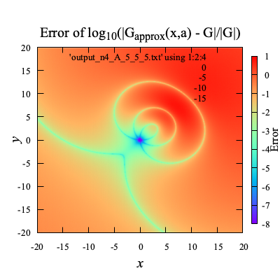       | 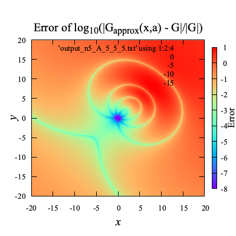        |         | 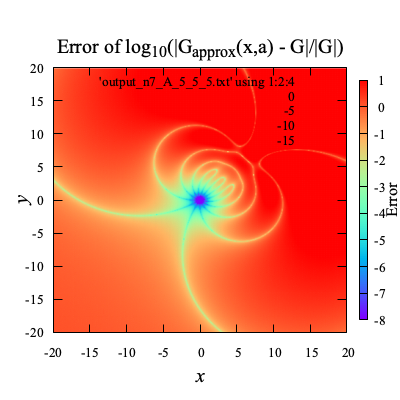       | 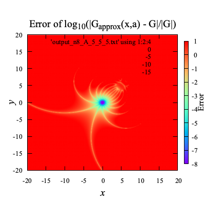       |
| **$`{\bf x} = (0,0,0),{\bf a} = (10,10,10)`$** |  | 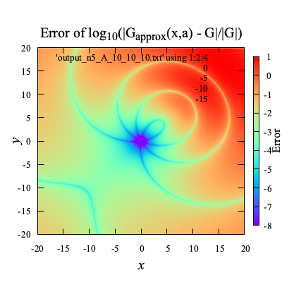  |   | 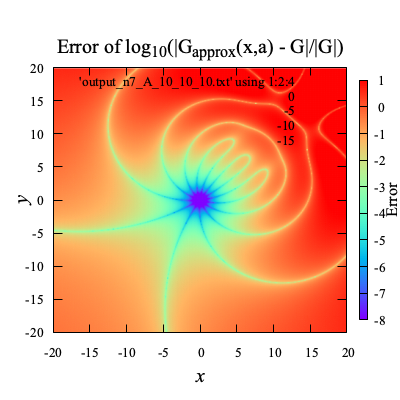 | 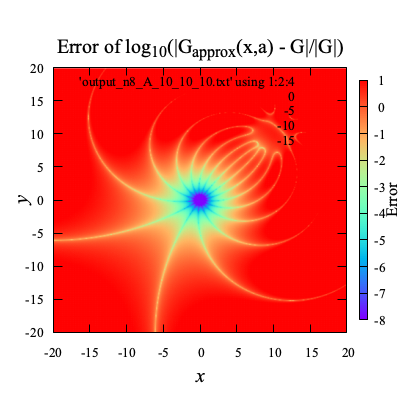 |

この結果からわかるように，Green関数の実際の値は，$`{\bf c}`$によって変わらないが，$`G _{\rm apx}`$の値は$`{\bf c}`$によって変化し，
$`{\bf c}`$が$`{\bf x}`$に近いところでは，$`G _{\rm apx}`$の値は$`G`$の値に近づく．

$`a _{near},b _{near}`$は，より小さければ精度が良く，
また，$`a _{far},b _{far}`$は，より大きければ精度が良くなる．


[./test_multipole_expansion.cpp#L86](./test_multipole_expansion.cpp#L86)


### 🪼 $`G _{\rm apx}`$の勾配$`\nabla G _{\rm apx}`$の精度 

$`\nabla G _{\rm apx}`$は，$`\nabla _{\rm \circ}=(\frac{\partial}{\partial r},\frac{\partial}{\partial a},\frac{\partial}{\partial b})`$とすると，

```math
\nabla G _{\rm apx} =
\nabla _{\rm \circ} G _{\rm apx}
\begin{bmatrix} \nabla r \\ \nabla a \\ \nabla b \end{bmatrix}
```

具体的には`gradGapx`のように

```math
\begin{align*}
\nabla _{\circ} G _{\rm apx}(n, {\bf x},{\bf a},{\bf c})
& = \sum _{k=0}^{n} \sum _{m=-k}^{k}\nabla _{\circ}\left(r^k Y(k, -m, a, b)\right) _{(r,a,b)=(r _{near},a _{near},b _{near})}
\frac{1}{r _{far}^{k+1}} Y(k, m, a _{far}, b _{far})\\
\nabla _{\circ}\left(r^k Y(k, -m, a, b)\right)
&= \left(k r^{k-1} Y, r^k \frac{\partial Y}{\partial a}, r^k \frac{\partial Y}{\partial b},
\right)\\
\frac{\partial Y}{\partial a} &= \sqrt{\frac{(k - |m|)!}{(k + |m|)!}} \frac{d P _k^{|m|}}{d x}(x) _{x=\cos(a) } e^{i mb}\\
\frac{\partial Y}{\partial b} &= \sqrt{\frac{(k - |m|)!}{(k + |m|)!}} P _k^{|m|}(\cos(a)) i m e^{i mb}\\
\frac{d P _k^{m}}{d x}(x) &= \frac{(-1)^m}{\sqrt{1-x^2}} \left( \frac{m x}{\sqrt{1-x^2}} P _k^{m}(x) + P _k^{m+1}(x) \right)
\end{align*}
```

勾配の座標変換は，$`Y(k,m,a _{far},b _{far})`$には影響しない．

```math
\begin{align*}
\nabla G _{\rm apx}
&= \nabla _{\circ} G _{\rm apx} \begin{bmatrix} \nabla r \\ \nabla a \\ \nabla b \end{bmatrix}\\
& = \sum _{k=0}^{n} \sum _{m=-k}^{k}\nabla _{\circ}\left(r^k Y(k, -m, a, b)\right) _{(r,a,b)=(r _{near},a _{near},b _{near})}
\begin{bmatrix} \nabla r \\ \nabla a \\ \nabla b \end{bmatrix}
\frac{1}{r _{far}^{k+1}} Y(k, m, a _{far}, b _{far})
\end{align*}
```

$`{\bf c}=(x,y,0)`$を変化させてプロットした結果：

| | **n=4** | **n=5** | **n=6** | **n=7** | **n=8** |
|:----:|:---:|:---:|:---:|:---:|:---:|
| **$`{\bf x} = (0,0,0),{\bf a} = (5,5,5)`$** | 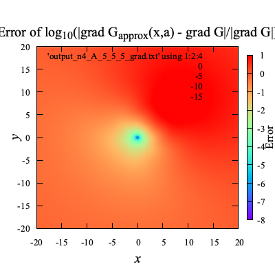 |  | 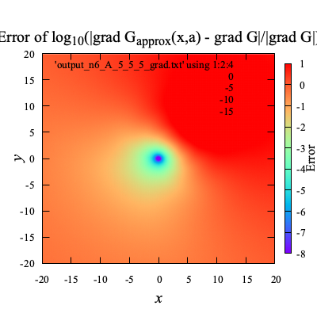 | 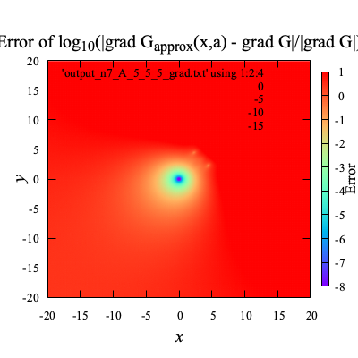 | 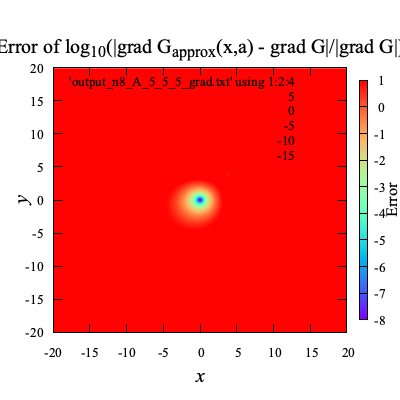 |
| **$`{\bf x} = (0,0,0),{\bf a} = (10,10,10)`$** | 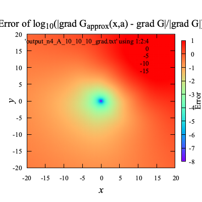 | 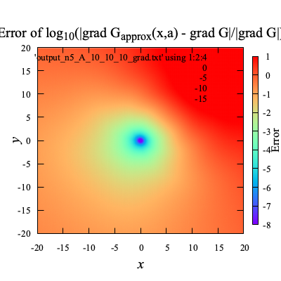 | 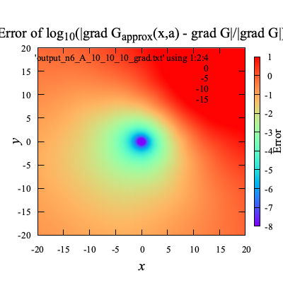 | 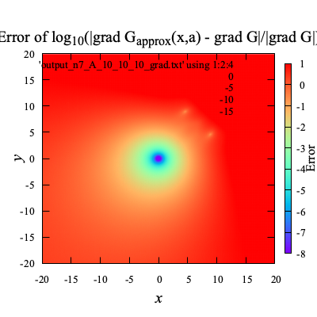 | 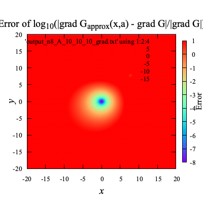 |


[./test_multipole_expansion.cpp#L146](./test_multipole_expansion.cpp#L146)


## ⛵ 境界要素法への応用 

境界要素法で最も計算時間を要するのは，連立１次方程式の**係数行列の作成**と**それを解く**ことである．

反復法を使えば，方程式を早く解けそうだが，実際そこまで速く解けない．
その理由は，BEMの係数行列が密行列であるために，反復法で最も時間を要する行列-ベクトル積の時間が短縮できないためである．
ナイーブなBEMでは，反復解法の利点を十分に活かせない．

しかし，
多重極展開を使えば，
**BEMの係数行列をあたかも疎行列のように，行列-ベクトル積が実行でき，
反復解法を高速に実行できる．**

### 🪼 境界積分方程式 

ラプラス方程式とグリーンの定理を合わせて，境界積分方程式が得られる．
これのグリーン関数$G$を多重極展開によって$`G _{\rm apx}`$で置き換えると，

```math
\alpha ({\bf{a}})\phi ({\bf{a}}) = \iint _\Gamma {\left( {G _{\rm apx}({\bf{x}},{\bf a},{\bf c})\phi _n ({\bf{x}}) - \phi ({\bf{x}})\nabla G _{\rm apx}({\bf{x}},{\bf a},{\bf c})\cdot {\bf{n}}(\bf x)} \right)dS}
\quad\text{on}\quad{\bf x} \in \Gamma(t)
```

となり，原点$`{\bf a}`$と積分変数$`{\bf x}`$が分離できる．

```math
\alpha ({\bf{a}})\phi ({\bf{a}})={\bf Y}({\bf a},{\bf c})\cdot\iint _\Gamma {\left( {{{\bf Y}^\ast}({\bf x},{\bf c})\phi _n ({\bf{x}}) - \phi ({\bf{x}}){{\bf Y} _n^\ast}({\bf x},{\bf c})} \right) dS}\quad\text{on}\quad{\bf x} \in \Gamma(t).
```

ここで，$`{\bf Y}({\bf a},{\bf c})`$は，
$`{\bf Y}=\{\frac{1}{r _{far}^{-k+1}}Y(0,-k,a,b),\frac{1}{r _{far}^{-k+1+1}}Y(0,-k+1,a,b),\frac{1}{r _{far}^{-k+2+1}}Y(0,-k+2,a,b),...,\frac{1}{r _{far}^{k+1}}Y(n,k,a,b)\}`$
のようなベクトル．

```math
{\bf n}({\bf x})\cdot\nabla G _{\rm apx}({\bf x},{\bf a},{\bf c})=\sum _{k=0}^n \sum _{m=-k}^k
{\bf n}({\bf x}) \cdot \left( \nabla _{\circ}(r^k Y(k, -m, a, b)) _{(r,a,b)=(r _{near},a _{near},b _{near})}
\begin{bmatrix} \nabla r \\ \nabla a \\ \nabla b \end{bmatrix} \right)
\frac{1}{r _{far}^{k+1}} Y(k,m,a _{far}, b _{far})={\bf Y} _n^\ast({\bf x},{\bf c})\cdot{\bf Y}({\bf a},{\bf c})
```

ただ，十分な精度でグリーン関数を近似するためには，
$`\|{\bf x - \bf c}\|`$が$`\|{\bf a - \bf c}\|`$よりも十分に小さい必要がある．

### 🪼 空間分割 

$`\bf c`$を一つに固定するのではなく，空間を分割して，それぞれのセルの中心において$`{\bf c}`$を固定する．
各セルのインデックスを$`\square i`$として，その中心座標を$`{\bf c} _{\square i}`$のように表す．
そうすると，

```math
\alpha ({\bf a})\phi ({\bf a})=\sum _{\square i} {\bf Y}({\bf a},{\bf c} _{\square i})\cdot\iint _{\Gamma _{\square i}}{( {{{\bf Y}^\ast}({\bf x},{\bf c} _{\square i})\phi _n ({\bf x}) - \phi ({\bf x}){{\bf Y} _n^\ast}({\bf x},{\bf c} _{\square i})} ) dS}
```

さらに，原点の近傍セルの積分は，多重極展開を使わずに，元々のグリーン関数を使って計算することにすると，

```math
\begin{align*}
\alpha ({\bf{a}})\phi ({\bf{a}})=& \iint _{\Gamma _{\rm near-filed}}( {G({\bf x},{\bf a})\phi _n ({\bf x}) - \phi (\bf x) G _n({\bf x},{\bf a})})dS\\
& + \sum _{\square i}\{{\bf Y}({\bf a},{\bf c} _{\square i})\cdot\iint _{\Gamma _{\square i}}{({{{\bf Y}^\ast}({\bf x},{\bf c} _{\square i})\phi _n ({\bf{x}}) - \phi ({\bf{x}}){{\bf Y} _n^\ast}({\bf x},{\bf c} _{\square i})})dS}\}
\end{align*}
```


[./test_multipole_expansion.cpp#L285](./test_multipole_expansion.cpp#L285)


---
