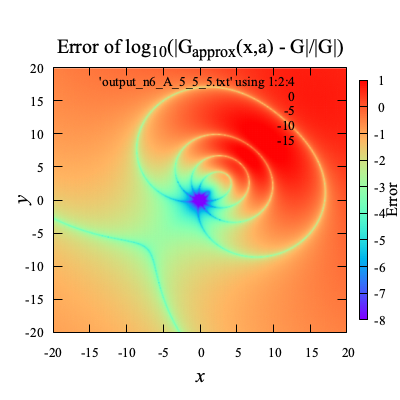

# Contents

- [🐋多重極展開(Multipole Expansion)](#🐋多重極展開(Multipole-Expansion))
    - [⛵️境界要素法への応用](#⛵️境界要素法への応用)

---
# 🐋多重極展開(Multipole Expansion) 

Green関数を次のようにする．

$$
G({\bf x},{\bf a}) = \frac{1}{\|{\bf x}-{\bf a}\|}
$$

近似解 $`G _{approx}({\bf x- \bf c},{\bf a - \bf c})`$ を以下の式で定義する：

$$
G _{approx}(n, {\bf x- \bf c},{\bf a - \bf c}) \approx \sum _{k=0}^{n} \sum _{m=-k}^{k} \left( \frac{r _{near}}{r _{far}} \right)^k \frac{1}{r _{far}} Y(k, -m, a _{near}, b _{near}) Y(k, m, a _{far}, b _{far})
$$

$$
Y(k, m, a, b) = \sqrt{\frac{(k - |m|)!}{(k + |m|)!}}(-1)^m P _k^{|m|}(\cos(a)) \left(\cos(m b) - i \sin(m b)\right)
$$

ここで，

- $`Y(k, m, a, b)`$ は球面調和関数
- $`r _{near}`$ と $`r _{far}`$ はベクトル $`{\bf x - c}`$ と $`{\bf a - c}`$ のノルム
- $`a _{near}`$, $`b _{near}`$, $`a _{far}`$, $`b _{far}`$ はベクトル $`{\bf x - c}`$ と $`{\bf a - c}`$ の球面座標

$`{\bf c}=(x,y,0)`$を変化させてプロットした結果：

| | **n=3** | **n=6** | **n=9** |
|:----:|:---:|:---:|:---:|
| **$`{\bf x} = (0,0,0),{\bf a} = (5,5,5)`$** |  |  |  |
| **$`{\bf x} = (0,0,0),{\bf a} = (10,10,10)`$** |  |  |  |

この結果からわかるように，Green関数の実際の値は，$`{\bf c}`$によって変わらないが，$`G _{approx}`$の値は$`{\bf c}`$によって変化し，
$`{\bf c}`$が$`{\bf x}`$に近いところでは，$`G _{approx}`$の値は$`G`$の値に近づく．

$`a _{near},b _{near}`$は，より小さければ精度が良く，
また，$`a _{far},b _{far}`$は，より大きければ精度が良くなる．

[./test_multipole_expansion.cpp#L29](./test_multipole_expansion.cpp#L29)

## ⛵️境界要素法への応用 

境界要素法で最も計算時間を要するのは，連立１次方程式の**係数行列の作成**と**それを解く**ことである．

反復法を使えば，方程式を早く解けそうだが，実際そこまで速く解けない．
その理由は，BEMの係数行列が密行列であるために，反復法で最も時間を要する行列-ベクトル積の時間が短縮できないためである．
ナイーブなBEMでは，反復解法の利点を十分に活かせない．

しかし，
多重極展開を使えば，
**BEMの係数行列をあたかも疎行列のように，行列-ベクトル積が実行でき，
反復解法を高速に実行できる．**

[./test_multipole_expansion.cpp#L115](./test_multipole_expansion.cpp#L115)

---
