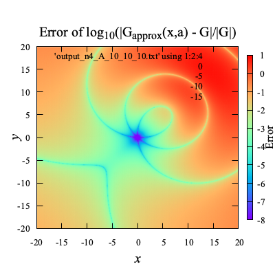

# Contents
- [🐋 🐋 多重極展開](#🐋-🐋-多重極展開)
    - [⛵ ⛵ Green関数の多重極展開](#⛵-⛵-Green関数の多重極展開)
        - [🪼 🪼 球面座標系への変換](#🪼-🪼-球面座標系への変換)
    - [⛵ 精度の確認](#⛵-精度の確認)
        - [🪼 $`G _{\rm apx}`$の精度](#🪼-$`G-_{\rm-apx}`$の精度)
        - [🪼 $`G _{\rm apx}`$の勾配$`\nabla G _{\rm apx}`$の精度](#🪼-$`G-_{\rm-apx}`$の勾配$`\nabla-G-_{\rm-apx}`$の精度)
    - [⛵ `multipole_expansion`クラスのチェック](#⛵-`multipole_expansion`クラスのチェック)
    - [⛵ 展開中心の移動（M2M）](#⛵-展開中心の移動（M2M）)
    - [⛵ `multipole_expansion`クラスのチェック](#⛵-`multipole_expansion`クラスのチェック)
    - [⛵ 展開中心の移動（M2M）](#⛵-展開中心の移動（M2M）)
    - [⛵ ツリー構造を用いた高速多重極展開のテスト](#⛵-ツリー構造を用いた高速多重極展開のテスト)
    - [⛵ ベッセル関数](#⛵-ベッセル関数)
    - [⛵ 境界要素法への応用](#⛵-境界要素法への応用)
        - [🪼 境界積分方程式](#🪼-境界積分方程式)
        - [🪼 空間分割](#🪼-空間分割)
        - [🪼 局所展開](#🪼-局所展開)


---
# 🐋 🐋 多重極展開  

## ⛵ ⛵ Green関数の多重極展開  

次のGreen関数を考える．

```math
G({\bf x},{\bf a}) = \frac{1}{\|{\bf x}-{\bf a}\|},
\quad \nabla G({\bf x},{\bf a}) = -\frac{{\bf x}-{\bf a}}{\|{\bf x}-{\bf a}\|^3}
```

グリーン関数は，球面調和関数を使って近似できる．
近似を$`G _{\rm apx}({\bf x},{\bf a},{\bf c})`$とする．

```math
G _{\rm apx}(n, {\bf x},{\bf a},{\bf c}) = \sum _{k=0}^n \sum _{m=-k}^k \left( \frac{r _{\rm near}}{r _{\rm far}} \right)^k \frac{1}{r _{\rm far}} Y(k, -m, a _{\rm near}, b _{\rm near}) Y(k, m, a _{\rm far}, b _{\rm far})=
{\bf Y}^\ast({\bf x},{\bf c})\cdot{\bf Y}({\bf a},{\bf c})
```

```math
{\bf Y}^\ast({\bf x},{\bf c}) = r _{\rm near}^k Y(k, -m, a _{\rm near},b _{\rm near}), \quad {\bf Y}({\bf a},{\bf c}) = r _{\rm far}^{-k-1} Y(k, m, a _{\rm far}, b _{\rm far})
```

ここで，$`(r _{\rm near},a _{\rm near},b _{\rm near})`$は，球面座標系に$`{\bf x}-{\bf c}`$を変換したものであり，
$`(r _{\rm far},a _{\rm far},b _{\rm far})`$は，球面座標系に$`{\bf a}-{\bf c}`$を変換したもの．$`Y(k, m, a, b)`$は球面調和関数：

```math
Y(k, m, a, b) = \sqrt{\frac{(k - |m|)!}{(k + |m|)!}} P _k^{|m|}(\cos(a)) e^{i mb}
```

$`P _k^m(x)`$はルジャンドル陪関数：

```math
P _k^m(x) = \frac{(-1)^m}{2^k k!} (1-x^2)^{m/2} \frac{d^{k+m}}{dx^{k+m}}(x^2-1)^k
```

### 🪼 🪼 球面座標系への変換  

$`{\bf x}=(x,y,z)`$から球面座標$`(r,a,b)`$への変換は次のように行う．

```math
r = \|{\bf x}\|, \quad a = \arctan \frac{\sqrt{x^2 + y^2}}{z}, \quad b = \arctan \frac{y}{x}
```

$`r _\parallel=\sqrt{x^2+y^2}`$とする．$`\frac{\partial}{\partial t}(\arctan(f(t))) = \frac{f'(t)}{1 + f(t)^2}`$なので，
$`(r,a,b)`$の$`(x,y,z)`$に関する勾配は次のようになる．

```math
\nabla r = \frac{\bf x}{r},\quad
\nabla a = \frac{1}{r^2r _\parallel} \left(xz,yz,-r _\parallel^2\right),\quad
\nabla b = \frac{1}{r _\parallel^2} \left(-y,x,0\right)
```
[../../include/lib_multipole_expansion.hpp#L17](../../include/lib_multipole_expansion.hpp#L17)


## ⛵ 精度の確認 

```shell
sh clean
cmake -DCMAKE_BUILD_TYPE=Release ../ -DSOURCE_FILE=test_multipole_expansion.cpp
make
./test_multipole_expansion
```

### 🪼 $`G _{\rm apx}`$の精度 

$`{\bf c}=(x,y,0)`$を変化させてプロットした結果：

|      | **n=4** | **n=5** | **n=6** | **n=7** | **n=8** |
|:----:|:---:|:---:|:---:|:---:|:---:|
| **x = (0,0,0), a = (5,5,5)**    |        |         |         |        |        |
| **x = (0,0,0), a = (10,10,10)** |  |   |   |  |  |

この結果からわかるように，Green関数の実際の値は，$`{\bf c}`$によって変わらないが，$`G _{\rm apx}`$の値は$`{\bf c}`$によって変化し，
$`{\bf c}`$が$`{\bf x}`$に近いところでは，$`G _{\rm apx}`$の値は$`G`$の値に近づく．

$`a _{near},b _{near}`$は，より小さければ精度が良く，
また，$`a _{far},b _{far}`$は，より大きければ精度が良くなる．

### 🪼 $`G _{\rm apx}`$の勾配$`\nabla G _{\rm apx}`$の精度 

$`\nabla G _{\rm apx}`$は，$`\nabla _{\rm \circ}=(\frac{\partial}{\partial r},\frac{\partial}{\partial a},\frac{\partial}{\partial b})`$とすると，

```math
\nabla G _{\rm apx} =
\nabla _{\rm \circ} G _{\rm apx}
\begin{bmatrix} \nabla r \\ \nabla a \\ \nabla b \end{bmatrix}
```

具体的には`gradGapx`のように

```math
\begin{align*}
\nabla _{\circ} G _{\rm apx}(n, {\bf x},{\bf a},{\bf c})
& = \sum _{k=0}^{n} \sum _{m=-k}^{k}\nabla _{\circ}\left(r^k Y(k, -m, a, b)\right) _{(r,a,b)=(r _{near},a _{near},b _{near})}
\frac{1}{r _{far}^{k+1}} Y(k, m, a _{far}, b _{far})\\
\nabla _{\circ}\left(r^k Y(k, -m, a, b)\right)
&= \left(k r^{k-1} Y, r^k \frac{\partial Y}{\partial a}, r^k \frac{\partial Y}{\partial b},
\right)\\
\frac{\partial Y}{\partial a} &= \sqrt{\frac{(k - |m|)!}{(k + |m|)!}} \frac{d P _k^{|m|}}{d x}(x) _{x=\cos(a) } e^{i mb}\\
\frac{\partial Y}{\partial b} &= \sqrt{\frac{(k - |m|)!}{(k + |m|)!}} P _k^{|m|}(\cos(a)) i m e^{i mb}\\
\frac{d P _k^{m}}{d x}(x) &= \frac{(-1)^m}{\sqrt{1-x^2}} \left( \frac{m x}{\sqrt{1-x^2}} P _k^{m}(x) + P _k^{m+1}(x) \right)
\end{align*}
```

勾配の座標変換は，$`Y(k,m,a _{far},b _{far})`$には影響しない．

```math
\begin{align*}
\nabla G _{\rm apx}
&= \nabla _{\circ} G _{\rm apx} \begin{bmatrix} \nabla r \\ \nabla a \\ \nabla b \end{bmatrix}\\
& = \sum _{k=0}^{n} \sum _{m=-k}^{k}\nabla _{\circ}\left(r^k Y(k, -m, a, b)\right) _{(r,a,b)=(r _{near},a _{near},b _{near})}
\begin{bmatrix} \nabla r \\ \nabla a \\ \nabla b \end{bmatrix}
\frac{1}{r _{far}^{k+1}} Y(k, m, a _{far}, b _{far})
\end{align*}
```

$`{\bf c}=(x,y,0)`$を変化させてプロットした結果：

| | **n=4** | **n=5** | **n=6** | **n=7** | **n=8** |
|:----:|:---:|:---:|:---:|:---:|:---:|
| **x = (0,0,0), a = (5,5,5)** |  |  |  |  |  |
| **x = (0,0,0), a = (10,10,10)** |  |  |  |  |  |

[./test_multipole_expansion.cpp#L4](./test_multipole_expansion.cpp#L4)

---
## ⛵ `multipole_expansion`クラスのチェック 

FMMアルゴリズムでは，展開中心から遠くにある遠方原点の値は，モーメントを計算した後に渡される．
ここでチェックするのは，その計算過程を行うクラス`multipole_expansion`が問題なく動作するかどうかである．

💡 境界要素法におけるモーメントは，極そのものではなく，極の面積分（３D）である．

💡 多重極モーメントを計算するために，極の値を与えられなければならない．
\cite{Liu_2009}

💡 効率化するために要求されるオペレーションは，極の値が変化した際に，できるだけ少ない計算でモーメントを更新することである．

1. モーメントの計算（近傍にある複数の極を変数分離し足し合わせる）
2. 遠方の原点を決めて渡し，計算しておいたモーメントと積和を計算する
3. この計算結果と，展開しない計算結果との差をプロット

一つ前の例では，展開位置を変えることで，多重極展開の精度がどのように変化するかを調べた．
原点位置の移動による展開精度の変化は，展開中心の移動による展開精度の変化と同じである．
展開精度は，（多分）相対距離を規格化した上での，展開中心と極と原点との相対的位置関係で決まっているからである．

## ⛵ 展開中心の移動（M2M） 

多数の極を空間的にグループ分けして，
グループの中心位置を展開中心として多重極展開したとする．

次に，そのグループをさらにまとめて新たな多重極展開を行うことを考える．
この操作は，１ステップ目で得られた各グループの多重極展開係数を利用することで効率的に行うことができる．
各極に対する多重極展開は計算せずに済むからである．

変更されるのは，多重極係数ではなく，球面調和関数自体と，少しの係数のみである．

ここでは，始めに，１ステップ目として座標原点を中心とした多重極展開を行い，
次に，様々な場所での多重極展開を行って，前回同様に精度を検証する．

もし，２ステップ目において，展開中心が１ステップ目同様に原点であれば，
前回と同じ結果が得られるはずである．


```shell
sh clean
cmake -DCMAKE_BUILD_TYPE=Release ../ -DSOURCE_FILE=test_translation_of_a_multipole_expansion.cpp
make
./test_translation_of_a_multipole_expansion
```

[./test_translation_of_a_multipole_expansion.cpp#L5](./test_translation_of_a_multipole_expansion.cpp#L5)

## ⛵ `multipole_expansion`クラスのチェック 

FMMアルゴリズムでは，展開中心から遠くにある遠方原点の値は，モーメントを計算した後に渡される．
ここでチェックするのは，その計算過程を行うクラス`multipole_expansion`が問題なく動作するかどうかである．

💡 境界要素法におけるモーメントは，極そのものではなく，極の面積分（３D）である．

💡 多重極モーメントを計算するために，極の値を与えられなければならない．
\cite{Liu_2009}

💡 効率化するために要求されるオペレーションは，極の値が変化した際に，できるだけ少ない計算でモーメントを更新することである．

1. モーメントの計算（近傍にある複数の極を変数分離し足し合わせる）
2. 遠方の原点を決めて渡し，計算しておいたモーメントと積和を計算する
3. この計算結果と，展開しない計算結果との差をプロット

一つ前の例では，展開位置を変えることで，多重極展開の精度がどのように変化するかを調べた．
原点位置の移動による展開精度の変化は，展開中心の移動による展開精度の変化と同じである．
展開精度は，（多分）相対距離を規格化した上での，展開中心と極と原点との相対的位置関係で決まっているからである．

## ⛵ 展開中心の移動（M2M） 

多数の極を空間的にグループ分けして，
グループの中心位置を展開中心として多重極展開したとする．

次に，そのグループをさらにまとめて新たな多重極展開を行うことを考える．
この操作は，１ステップ目で得られた各グループの多重極展開係数を利用することで効率的に行うことができる．
各極に対する多重極展開は計算せずに済むからである．

変更されるのは，多重極係数ではなく，球面調和関数自体と，少しの係数のみである．

ここでは，始めに，１ステップ目として座標原点を中心とした多重極展開を行い，
次に，様々な場所での多重極展開を行って，前回同様に精度を検証する．

もし，２ステップ目において，展開中心が１ステップ目同様に原点であれば，
前回と同じ結果が得られるはずである．


```shell
sh clean
cmake -DCMAKE_BUILD_TYPE=Release ../ -DSOURCE_FILE=test_translation_of_a_multipole_expansion.cpp
make
./test_translation_of_a_multipole_expansion
```

[./test_translation_of_a_multipole_expansion_trash.cpp#L5](./test_translation_of_a_multipole_expansion_trash.cpp#L5)

## ⛵ ツリー構造を用いた高速多重極展開のテスト 

1. まずobjファイルを読み込み`Network`クラスのインスタンスを作成
2. 三角格子をツリーの最下層のバケットに割り振る（空間分割して，バケットに保存）
3. ３次元のポテンシャル問題として，まずは各セル中心において，保存された三角形のポテンシャル面積分を多重極展開しモーメントを保存
4. M2M演算を行い，親のセルにモーメントを伝播．最上層のセルに到達するまで繰り返す
5. M2L演算を行い，最上層のセルでのモーメントを局所展開
6. L2L演算を行い，局所展開されたモーメントを子のセルに伝播
7. 最下層の局所展開係数を使って，ポテンシャルを計算し，直接積分と比較

[./test_translation_of_a_multipole_expansion_with_trees.cpp#L5](./test_translation_of_a_multipole_expansion_with_trees.cpp#L5)

---
## ⛵ ベッセル関数

[./test_Bessel_function.cpp#L5](./test_Bessel_function.cpp#L5)

---
## ⛵ 境界要素法への応用 

境界要素法で最も計算時間を要するのは，連立１次方程式の**係数行列の作成**と**それを解く**ことである．

反復法を使えば，方程式を早く解けそうだが，実際そこまで速く解けない．
その理由は，BEMの係数行列が密行列であるために，反復法で最も時間を要する行列-ベクトル積の時間が短縮できないためである．
ナイーブなBEMでは，反復解法の利点を十分に活かせない．

しかし，
多重極展開を使えば，
**BEMの係数行列をあたかも疎行列のように，行列-ベクトル積が実行でき，
反復解法を高速に実行できる．**


### 🪼 境界積分方程式 

ラプラス方程式とグリーンの定理を合わせて，境界積分方程式が得られる．
これのグリーン関数$G$を多重極展開によって$`G _{\rm apx}`$で置き換えると，

```math
\alpha ({\bf{a}})\phi ({\bf{a}}) = \iint _\Gamma {\left( {G _{\rm apx}({\bf{x}},{\bf a},{\bf c})\phi _n ({\bf{x}}) - \phi ({\bf{x}})\nabla G _{\rm apx}({\bf{x}},{\bf a},{\bf c})\cdot {\bf{n}}(\bf x)} \right)dS}
\quad\text{on}\quad{\bf x} \in \Gamma(t)
```

となり，原点$`{\bf a}`$と積分変数$`{\bf x}`$が分離できる．

```math
\alpha ({\bf{a}})\phi ({\bf{a}})={\bf Y}({\bf a},{\bf c})\cdot\iint _\Gamma {\left( {{{\bf Y}^\ast}({\bf x},{\bf c})\phi _n ({\bf{x}}) - \phi ({\bf{x}}){{\bf Y} _n^\ast}({\bf x},{\bf c})} \right) dS}\quad\text{on}\quad{\bf x} \in \Gamma(t).
```

ここで，$`{\bf Y}({\bf a},{\bf c})`$は，
$`{\bf Y}=\{\frac{1}{r _{far}^{-k+1}}Y(0,-k,a,b),\frac{1}{r _{far}^{-k+1+1}}Y(0,-k+1,a,b),\frac{1}{r _{far}^{-k+2+1}}Y(0,-k+2,a,b),...,\frac{1}{r _{far}^{k+1}}Y(n,k,a,b)\}`$
のようなベクトル．

```math
{\bf n}({\bf x})\cdot\nabla G _{\rm apx}({\bf x},{\bf a},{\bf c})=\sum _{k=0}^n \sum _{m=-k}^k
{\bf n}({\bf x}) \cdot \left( \nabla _{\circ}(r^k Y(k, -m, a, b)) _{(r,a,b)=(r _{near},a _{near},b _{near})}
\begin{bmatrix} \nabla r \\ \nabla a \\ \nabla b \end{bmatrix} \right)
\frac{1}{r _{far}^{k+1}} Y(k,m,a _{far}, b _{far})={\bf Y} _n^\ast({\bf x},{\bf c})\cdot{\bf Y}({\bf a},{\bf c})
```

ただ，十分な精度でグリーン関数を近似するためには，
$`\|{\bf x - \bf c}\|`$が$`\|{\bf a - \bf c}\|`$よりも十分に小さい必要がある．

### 🪼 空間分割 

$`\bf c`$を一つに固定するのではなく，空間を分割して，それぞれのセルの中心において$`{\bf c}`$を固定する．
各セルのインデックスを$`\square i`$として，その中心座標を$`{\bf c} _{\square i}`$のように表す．
そうすると，

```math
\alpha ({\bf a})\phi ({\bf a})=\sum _{\square i} {\bf Y}({\bf a},{\bf c} _{\square i})\cdot\iint _{\Gamma _{\square i}}{( {{{\bf Y}^\ast}({\bf x},{\bf c} _{\square i})\phi _n ({\bf x}) - \phi ({\bf x}){{\bf Y} _n^\ast}({\bf x},{\bf c} _{\square i})} ) dS}
```

さらに，原点の近傍セルの積分は，多重極展開を使わずに，元々のグリーン関数を使って計算することにすると，

```math
\begin{align*}
\alpha ({\bf{a}})\phi ({\bf{a}})=& \iint _{\Gamma _{\rm near-fields}}( {G({\bf x},{\bf a})\phi _n ({\bf x}) - \phi (\bf x) G _n({\bf x},{\bf a})})dS\\
& + \sum _{\square i}\{{\bf Y}({\bf a},{\bf c} _{\square i})\cdot\iint _{\Gamma _{\square i}}{({{{\bf Y}^\ast}({\bf x},{\bf c} _{\square i})\phi _n ({\bf{x}}) - \phi ({\bf{x}}){{\bf Y} _n^\ast}({\bf x},{\bf c} _{\square i})})dS}\}
\end{align*}
```

### 🪼 局所展開 

Graf's Addition Theoremを使って，$`{\bf Y}^\ast({\bf x},{\bf c} _{\square i})`$を$`{\bf Y}^\ast({\bf x},{\bf c})`$の線形結合で表す．

```math
{\bf Y}^\ast({\bf x},{\bf c} _{\square i}) = \sum _{\square j} {\bf Y}^\ast({\bf x},{\bf c} _{\square j}){\bf Y}({\bf c} _{\square j},{\bf c} _{\square i})
```

[./test_multipole_expansion.cpp#L200](./test_multipole_expansion.cpp#L200)

---
